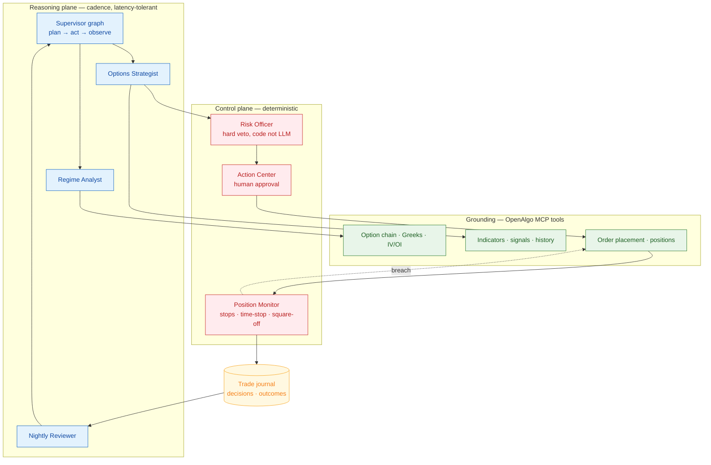

# Strike Desk — An Agentic Options-Buying Desk on OpenAlgo

> **Goal:** Build a production-grade agentic system that runs an intraday index options-buying book end to end — entries, sizing, exits — on OpenAlgo.
>
> **Why this one:** Exactly what the client asked for; it reuses a codebase already known deeply and spends the learning budget on the agentic architecture, not an unfamiliar domain.
>
> **Outcome:** A deployed desk trading a real broker account through a human-approved loop — every decision traced, every risk limit enforced in code.

## Background

The client's ask is direct: automate options buying, use OpenAlgo as the base, employ AI agents where appropriate. The base is strong — thirty-plus broker integrations behind one `/api/v1/` surface, a ZeroMQ market feed, a sandbox engine with auto square-off, an Action Center that gates orders behind human approval, and an MCP server exposing some 112 tools. What is missing is a decision-maker: today a human watches the chain and clicks, or a static rule tree fires blindly.

One framing decision shapes everything: this promises no predictive alpha. SEBI's own study found 93% of individual F&O traders lose money, and roughly 71% of aggregate retail losses were transaction costs, not bad directional calls. Option buyers lose structurally — theta bleeds daily, exits go unhonoured. The edge Strike Desk pursues is **discipline**: refusing marginal entries, sizing correctly, enforcing exits. That is an automation problem, and where agents earn their keep.

## Discipline, not prediction — and where AI actually helps

One framing has to be unambiguous, because it is the difference between an honest product and a fantasy. Strike Desk claims **no view the market doesn't already hold**. A language model does not forecast option direction better than the crowd, and any tool that says so is selling snake oil. SEBI's data is blunt: 93% of individual F&O traders lose money, and roughly 71% of aggregate retail losses are transaction costs — not wrong directional calls. The losses are **structural**: theta bleeds daily, positions are over-sized, exits go unhonoured under fear and greed. Every one of those is an execution failure, not a forecasting failure — and execution is automatable.

So the edge is **discipline**, and discipline maps onto exactly what a language model is genuinely good at — and pointedly not onto the thing it is bad at:

| Where retail bleeds | AI's real strength, applied as the feature |
| --- | --- |
| Churn / transaction costs (~71% of losses) | Reads regime across trend, momentum, volatility and OI, and **declines the marginal trade** — with a written reason you can read back |
| Theta decay on held longs | Sizes against a stated **theta budget** and sets a time-stop before decay compounds |
| Exits abandoned emotionally | Never tires, never hopes — the control plane fires **stops and square-off deterministically** |
| Over-sizing | Hard lot and capital ceilings hold a **code-level veto** the model cannot argue past |

The division of labour *is* the product: the model **reasons and explains** (regime read, contract rationale, a natural-language justification for every entry and every decline); deterministic code **decides and enforces** (risk limits, stops, square-off). Prediction is assigned to no one. This is the headline feature — not a signal generator, but a **disciplined execution layer that can justify itself** — and it is defensible precisely because it leans on AI's strengths (synthesising heterogeneous signals, explaining a judgment, acting the same way at 3 PM as at 9:15) rather than the forecasting it cannot do. It is also why the scoreboard is risk-adjusted discipline — entries declined, exits honoured, cost drag, drawdown — benchmarked against a rule-based baseline, never raw P&L promised.

## Product overview

The real user is an active index options buyer trading NIFTY and BANKNIFTY weeklies on their own broker account. Their problem: a good playbook executed inconsistently loses money. Strike Desk runs the playbook — reads the regime, decides whether conditions justify a long call or put at all, picks strike and expiry against a theta budget, clears hard risk limits, places the order through OpenAlgo, then manages the position to a target, a stop, or a time-stop that fires before decay eats the premium.

It is a peer of what Indian traders deploy today. **AlgoTest**, **Tradetron**, **QuantMan** and **Zerodha Streak** ship live options execution with backtesting and risk controls; **Sensibull** and **Opstra** cover analytics. Strike Desk matches that core capability at MVP altitude — live, broker-connected, position-managed, risk-limited, audited — but differs in substrate: those platforms encode strategy as a static condition tree that cannot reason mid-session. Strike Desk replaces the tree with a reasoning loop that explains why it declined a trade and leaves a record a regulator can read back.

## Use cases

Concrete jobs the desk does, each a slice of the plan → act → observe loop:

1. **Read the regime, decide whether to trade at all.** At the session open and on cadence through the day, snapshot trend, momentum and volatility — and often conclude that conditions justify *no* entry. Refusing the marginal trade is the primary use case, not the exception.
2. **Propose a directional long.** When conditions warrant, pick a long CE or PE with a strike and expiry sized against a theta budget, with a stated breakeven — grounded in the live chain, Greeks, IV and OI, never model memory.
3. **Adjudicate against hard risk limits.** Clear every proposal through deterministic loss caps, position count, capital and lot ceilings, and expiry-day windows. The Risk Officer holds a code-level veto the LLM cannot override.
4. **Place a live order behind human approval.** Route the intent through Action Center in semi-auto so a human approves each real-money order before it reaches the broker.
5. **Manage the open position.** Run stops, targets and a theta-aware time-stop in a tight loop that fires before decay eats the premium — never blocking on a model call.
6. **Paper-trade first in sandbox.** Run the full agent graph unattended for a complete expiry week against ₹1 Crore sandbox capital before a single rupee is live.
7. **Fail flat and square off.** On data loss, model unavailability or a limit breach, stop trading; enforce auto square-off at exchange timings and honour the kill switch.
8. **Review the day and learn.** Nightly, replay the decision journal, benchmark the agent against a rule-based baseline of the same playbook, and feed regime-tagged outcomes back into the loop.

## Agentic architecture

The system is a supervised multi-agent graph that ticks on a cadence through market hours, running plan → act → observe each tick. A **Regime Analyst** pulls trend, momentum and volatility snapshots. An **Options Strategist** reads the chain, Greeks, IV and open interest to propose a contract with a breakeven and a theta budget. A **Risk Officer** adjudicates — deliberately not a language model: loss caps, position count, capital and lot ceilings, expiry-day windows are deterministic code holding a hard veto. The LLM proposes; arithmetic disposes. Only then does the **Execution Agent** place the order and hand it to a **Position Monitor**, whose stops and square-off run in a tight loop that never blocks on a model call — an agent waiting on an API round-trip is not a risk system.

Grounding is tool-based: agents consume OpenAlgo's MCP server, so every market claim traces to a quote, a chain or a Greek, never to model memory. Memory is two-tiered — LangGraph's checkpointer for session state, a durable journal for decisions and outcomes, retrieved by regime similarity later. Guardrails layer up: sandbox mode is the default, so the agent paper-trades first; Action Center approval sits between intent and a live order; a kill switch and auto square-off bound the worst case; and when data or the model is unavailable the system fails flat.

## Tech stack & why

A sensible starting point, finalized in design. **LangGraph 1.0** orchestrates — the first durable agent framework at a stable major release, model-agnostic, Python (matching OpenAlgo's 3.12 backend), with interrupt-and-resume that maps directly onto Action Center's approval gate. Google's ADK reached GA only in May 2026 and leans Gemini-ward; the OpenAI Agents SDK is model-locked. **Claude Sonnet 5** (30 June 2026, the current default agentic tier) drives the loop, **Haiku 4.5** handles cheap classification, **Opus 4.8** the nightly review.

The cloud is forced by regulation. From 1 April 2026 SEBI requires every API order to originate from a broker-whitelisted **static IP**, with exchange-assigned Algo-IDs and audit trails; market-data reads stay exempt. Scale-to-zero serverless on the execution path is therefore ruled out. The fit is **AWS ap-south-1 (Mumbai)** — EC2 holding an Elastic IP, with Langfuse self-hosted for traces and data residency. Two tiers: a **practice/MVP posture** of one small ARM instance with SQLite, running only during market hours for a few dollars a month plus tokens; and a **production target** adding RDS Postgres and a failover IP. The cheap start is deliberate, not the finish line.

## Operational readiness

- **AgentOps — MVP.** Every plan → act → observe step, tool call and handoff traced; a trading day replayable from its trace; multi-step evals on replayed market data. The home discipline here.
- **LLMOps — MVP.** Prompts as versioned artifacts, a regression suite over frozen historical decision points, token-cost ceilings, guardrail tests. PromptOps folds in here.
- **ModelOps — MVP (lite), depth deferred.** Audit-heavy by law: each order is stamped with the agent, prompt and model version behind it, in an immutable decision log. Algo-ID registration is deferred.
- **RAGOps — deferred.** The MVP retrieves the recent journal naïvely; chunking, regime-similarity indexing and retrieval-quality eval arrive with regime memory.

MLOps and AIOps do not apply: the system trains no models of its own, and it is a trading product, not an observability tool.

## Milestones

The **MVP** is one index, one playbook: intraday directional long CE/PE on NIFTY with a theta-aware time-stop, driven by the full agent graph, running unattended in sandbox for a complete expiry week — Risk Officer, tracing, decision journal, alerts and nightly review all live. It then flips to real money in semi-auto, every order human-approved. From there the product widens: auto mode for playbooks that earned it, BANKNIFTY and SENSEX, a replay harness turning the journal into an eval set, regime memory. The **fuller product** adds hedged multi-leg buying — debit spreads that cut the theta bleed the MVP merely respects — plus portfolio-level risk and multi-broker operation.

## What success looks like

Operationally, the desk runs a full expiry week unattended in sandbox with no unhandled exceptions, no risk-limit breach, and every order traceable to the decision trace behind it. As a product, it executes the same class of live options strategies AlgoTest and Tradetron deploy, with an audit trail those platforms do not offer. On decision quality — measured, never promised — the agent is benchmarked against a rule-based baseline of the same playbook over replayed data: entries declined, exits honoured, cost drag, drawdown. Risk-adjusted discipline is the scoreboard; raw P&L is an outcome, not a target.

## What happens next

Read this, and if the shape is right, say yes. Approval opens planning: best-fit selection across framework, model tier and deployment topology; the playbook specified precisely enough to encode; risk limits written as numbers; the eval harness designed before the first agent is built. If the positioning is wrong — a different index, spreads instead of naked longs — that is a one-message correction, not a rewrite.

---
**Sources**

*Repo files:* `000_client_data/goals.txt` · `000_client_data/README.md` · `CLAUDE.md` · `DISCOVERY_MAP.md` · `mcp/mcpserver.py` · `services/option_chain_service.py` · `services/option_greeks_service.py` · `services/place_options_order_service.py` · `services/sandbox_service.py`

*Web (accessed 2026-07-10):*
- [SEBI — Safer participation of retail investors in Algorithmic trading (Feb 2025 circular)](https://www.sebi.gov.in/legal/circulars/feb-2025/safer-participation-of-retail-investors-in-algorithmic-trading_91614.html)
- [Zerodha — What is a static IP and how to add one to your developer account?](https://support.zerodha.com/category/trading-and-markets/general-kite/kite-api/articles/static-ip)
- [Kite Connect forum — Preparing to comply with SEBI's retail algo rules](https://kite.trade/forum/discussion/15912/preparing-to-comply-with-sebis-retail-algo-rules-static-ip-ratelimits-order-types)
- [AlgoTest — QuantMan vs Tradetron vs AlgoTest: A Detailed Comparison 2026](https://algotest.in/blog/quantman-vs-tradetron/)
- [AlgoTest — Opstra vs Sensibull (2026)](https://algotest.in/blog/opstra-vs-sensibull/)
- [Sensibull — India's Largest Options Trading Platform](https://sensibull.com/)
- [Tradetron — Algo Trading Strategies](https://tradetron.tech/)
- [LangChain — LangChain and LangGraph Agent Frameworks Reach v1.0 Milestones](https://www.langchain.com/blog/langchain-langgraph-1dot0)
- [Medium — The State of AI Agent Frameworks: LangGraph, OpenAI Agent SDK, Google ADK, AWS Bedrock](https://medium.com/@roberto.g.infante/the-state-of-ai-agent-frameworks-comparing-langgraph-openai-agent-sdk-google-adk-and-aws-d3e52a497720)
- [Claude Platform Docs — Models overview](https://platform.claude.com/docs/en/about-claude/models/overview)
- [Langfuse — Open Source Observability for LangGraph](https://langfuse.com/guides/cookbook/integration_langgraph)
- [TradingAgents: Multi-Agents LLM Financial Trading Framework (arXiv 2412.20138)](https://arxiv.org/abs/2412.20138)
- [MarketNetra — Why 91% of Indian F&O Traders Lose Money: Lessons from SEBI's Data](https://marketnetra.in/blog/why-91-percent-fo-traders-lose-money-sebi)
- [Ventura — Nifty & Bank Nifty Lot Size Changes January 2026](https://www.venturasecurities.com/blog/nifty-bank-nifty-lot-size-changes-january-2026-know-how-it-impacts-traders/)

*Stack:* LangGraph 1.0 + Claude Sonnet 5 (Haiku 4.5 routing, Opus 4.8 nightly review) + AWS ap-south-1 EC2 with Elastic IP, OpenAlgo MCP as the tool layer, Langfuse for tracing — production-grade; deep selection deferred to design
