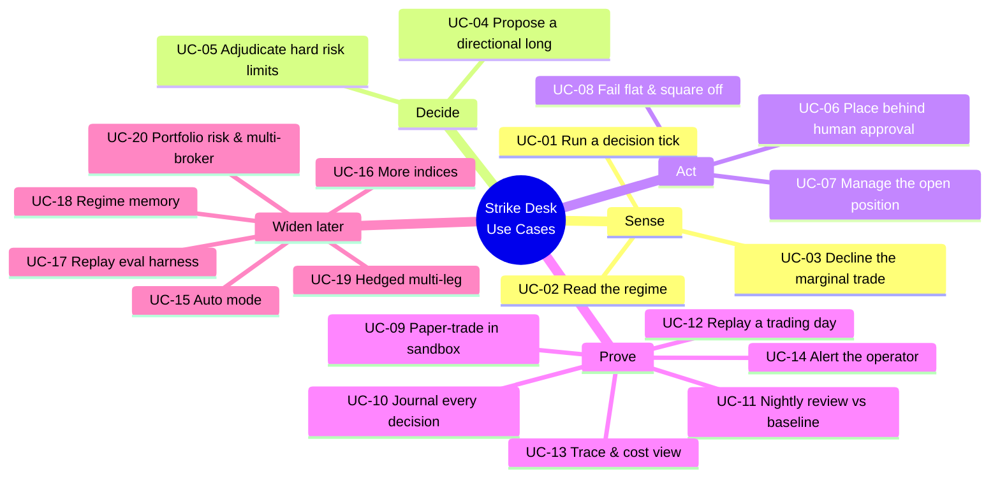

# Strike Desk — Use-Case Catalog

> **Document:** Strike Desk Use-Case Catalog — the full, product-wide list of everything the agentic options-buying desk can be asked to do, each described at design altitude.
>
> **Audience:** Amit, plus whoever plans an iteration from this catalog. Read this first — it is the map. The PRD (`02_prd.md`) says *why* each of these must exist and how well it must work, the architecture (`03_architecture.md`) says *how* the agents do them, and the tech stack (`04_tech_stack.md`) says what they are built from.
>
> **Goal:** Give one stable, numbered catalog that every other design document and every future iteration refers back to by ID. The IDs here are the spine of the project, so they never change once written — an iteration is always "build UC-05", never "build the risk thing".

<!-- export-png: 01_use_cases_toc.png -->


<details><summary>ASCII fallback — use-case map</summary>

```
Strike Desk Use Cases
|
+-- Sense
|     UC-01 Run a decision tick
|     UC-02 Read the regime
|     UC-03 Decline the marginal trade
+-- Decide
|     UC-04 Propose a directional long (strike, expiry, theta budget)
|     UC-05 Adjudicate against hard risk limits (deterministic)
+-- Act
|     UC-06 Place a live order behind human approval
|     UC-07 Manage the open position (stop, target, time-stop)
|     UC-08 Fail flat, kill switch, auto square-off
+-- Prove
|     UC-09 Paper-trade a full expiry week in sandbox
|     UC-10 Journal every decision
|     UC-11 Nightly review against a rule-based baseline
|     UC-12 Replay a trading day from its trace
|     UC-13 Trace & token-cost view
|     UC-14 Alert the operator
+-- Widen the desk (later)
      UC-15 Auto mode for earned playbooks
      UC-16 BANKNIFTY and SENSEX
      UC-17 Replay harness as an eval set
      UC-18 Regime memory
      UC-19 Hedged multi-leg (debit spreads)
      UC-20 Portfolio-level risk & multi-broker
```
</details>

---

## 1. Goal of this catalog

OpenAlgo already does the hard plumbing: thirty-plus brokers behind one `/api/v1/` surface, a ZeroMQ market feed, an option chain with Greeks, a sandbox engine with exchange-aligned auto square-off, an Action Center that gates orders behind human approval, and an MCP server exposing roughly 112 tools. What it does not have is a decision-maker. Today a human watches the chain and clicks, or a static condition tree fires blindly.

This catalog enumerates the decision-maker's job — one intraday index options-buying book, run end to end — as a list of use cases. Each entry is precise enough to plan an iteration from, but stops short of screens, payloads, and code; that expansion is the iteration planner's job, one use case at a time.

Two rules govern the whole catalog and are worth stating before the entries:

**The IDs are permanent.** UC-05 means "adjudicate a proposal against hard risk limits" forever. If a use case is later split or refined, the original ID keeps its meaning and new work gets a new ID. We never renumber.

**No use case claims predictive alpha.** The product's stated edge is discipline, not forecasting. That framing is not marketing — it is a design constraint that shows up concretely below: the model reasons and explains (UC-02, UC-03, UC-04, UC-11), deterministic code decides and enforces (UC-05, UC-07, UC-08). Any use case that would need the model to be *right about direction* to be safe is a design error.

## 2. Actors and personas

**The Trader** is Amit — the single human user, an active index options buyer running NIFTY and BANKNIFTY weeklies on his own broker account. He has a playbook he believes in; his problem is executing it consistently. He approves every real-money order in the first version, reads the reason behind every entry and every decline, and holds the kill switch. The product exists to run his playbook the way he would on his best day, at 3 PM as at 9:15.

**The Supervisor** is the top-level agent graph — the floor manager. It does no analysis itself; it runs the rhythm of plan → act → observe on a cadence through market hours, delegates to the specialists, and assembles their outputs into one intent per tick.

**The Regime Analyst** reads trend, momentum, volatility and open interest through OpenAlgo tool calls and returns a regime label with confidence and cited evidence (UC-02). It is explicitly allowed — and expected — to conclude "no trade".

**The Options Strategist** turns a tradeable regime into a concrete contract proposal: a long CE or PE with strike, expiry, quantity, breakeven and a theta budget, grounded in the live chain, Greeks, IV and OI (UC-04). It proposes; it never places.

**The Risk Officer** is deliberately **not** a language model. It is deterministic code holding a hard veto over every proposal — daily loss cap, per-trade loss cap, position count, capital and lot ceilings, expiry-day windows (UC-05). The LLM proposes; arithmetic disposes.

**The Execution Agent** routes an approved intent into OpenAlgo's order path and hands the resulting position to the monitor (UC-06).

**The Position Monitor** is again deterministic: a tight loop running stops, targets and a theta-aware time-stop that never blocks on a model call (UC-07, UC-08). An agent waiting on an API round-trip is not a risk system.

**The Nightly Reviewer** replays the day's journal after the close, benchmarks the agent against a rule-based baseline of the same playbook, and tags outcomes by regime (UC-11). It is the only agent allowed to use the most expensive model tier, because it runs once and is not on the trading path.

**OpenAlgo** is the non-human actor beneath all of it: the market feed, the option chain and Greeks services, the sandbox engine, the Action Center, the broker connection, and the MCP tool surface. The agents never reach past it to a broker directly, and never assert a market fact they did not read from it.

## 3. How to read a use-case entry

Every entry carries the same fields. The **ID** is the permanent handle. The **primary actor** says who drives it. **Goal / trigger** says what success looks like and what kicks it off. The **main flow** is the happy path in a sentence or two. **Alternates / exceptions** are named, not expanded, so the iteration planner knows what edge cases exist without pre-writing them. **Agentic behaviour** is the heart of each entry: where the plan → act → observe loop runs, which tools ground it, and which guardrail binds it — a use case with no loop, no grounding and no guardrail does not belong in this product. **Acceptance criteria** are coarse and testable; the iteration planner sharpens them. **Release** places the use case in the MVP or a later phase.

## 4. The catalog

### Sense

**UC-01 — Run a decision tick**
*Primary actor:* Supervisor. *Goal / trigger:* On a scheduled cadence through market hours (and on an explicit "evaluate now"), produce exactly one decision for the book — an intent to enter, an explicit decline, or a hold — persisted with its reasoning. *Main flow:* the supervisor plans which specialists to consult given current book state, delegates to the Regime Analyst and, if the regime warrants, the Options Strategist, passes any proposal to the Risk Officer, and records the outcome. *Alternates / exceptions:* a position is already open (the tick becomes a management-only tick and proposes no new entry); a specialist times out (the tick degrades to a decline, never to a blind entry); a tick is still running when the next fires (the new trigger is skipped, not queued in parallel); outside market hours or inside a blackout window (no tick). *Agentic behaviour:* this **is** the top-level plan → act → observe loop; the supervisor calls no market tools itself. The binding guardrail is that a tick's output is an *intent*, never an order — placement happens only through UC-06. *Acceptance criteria:* one trigger yields exactly one persisted decision record tagged with timestamp, regime, book state and outcome; a failed specialist never results in an entry. *Release:* MVP.

**UC-02 — Read the regime**
*Primary actor:* Regime Analyst. *Goal / trigger:* Inside a tick, decide what state the index is in — trending, range-bound, high-volatility, event-driven, or unknown — and whether that state is tradeable for this playbook. *Main flow:* the agent reads price history, indicators, India VIX and index-level OI through MCP tool calls, reasons over them, and returns a label with a 0–1 confidence and the specific data points it used. *Alternates / exceptions:* transitional or ambiguous regime (returns the most likely label with low confidence and says so); stale, gapped or missing feed data (returns "unknown", which is a valid and never-penalised answer); a known event window such as a policy announcement (returns "event-driven", which the playbook treats as non-tradeable at MVP). *Agentic behaviour:* a focused plan → act → observe step — plan which signals matter now, act by calling the data tools, observe and label. Grounded entirely in live OpenAlgo data, never model memory. The guardrail is that "unknown" must always be reachable and must always be safe. *Acceptance criteria:* every classification carries a label from the fixed set, a confidence, and at least one cited data point; the same input snapshot reproduces the same label. *Release:* MVP.

**UC-03 — Decline the marginal trade**
*Primary actor:* Supervisor (on the Regime Analyst's read). *Goal / trigger:* End a tick with an explicit, reasoned "no trade" whenever conditions do not justify an entry. *Main flow:* the tick records a decline with the regime that drove it and a one-line natural-language reason the trader can read back weeks later. *Alternates / exceptions:* declined for regime; declined for risk (that decline is owned by UC-05 and recorded distinctly); declined because a position is already open; declined for data quality. *Agentic behaviour:* this is the product's primary use case, not its exception path — roughly 71% of aggregate retail F&O losses are transaction costs, so refusing churn is where the edge lives. The guardrail is that a decline is *always* an available outcome and is never treated as a failed tick. *Acceptance criteria:* declines are first-class journal entries with a machine-readable reason code and a human-readable sentence; the daily decline count and its reason breakdown are reportable. *Release:* MVP.

### Decide

**UC-04 — Propose a directional long**
*Primary actor:* Options Strategist. *Goal / trigger:* When the regime warrants an entry, propose one concrete long CE or PE — index, expiry, strike, lots, entry price band, breakeven, stop, target, and a theta budget with a time-stop. *Main flow:* the agent reads the live option chain, Greeks, IV and OI through MCP tools, selects the contract that meets the playbook's delta and liquidity constraints inside the theta budget, and returns a structured proposal with a written rationale. *Alternates / exceptions:* no contract meets the constraints — too wide a spread, too thin an OI, IV outside band (returns "no viable contract", which becomes a decline); the strike ladder has moved since the regime read (the proposal is rebuilt from a fresh chain, never from a cached one); expiry-day conditions (the playbook's expiry rules bind before the proposal is formed). *Agentic behaviour:* the richest plan → act → observe step in the product. Grounded strictly in the chain and Greeks as read this tick — the guardrail is that a proposal may cite no number the agent did not fetch, and every proposal carries the tool-call evidence behind it. *Acceptance criteria:* every proposal names index, expiry, strike, option type, lots, breakeven, stop, target, time-stop and theta budget, plus a one-paragraph rationale; every number in the rationale appears in the evidence. *Release:* MVP.

**UC-05 — Adjudicate against hard risk limits**
*Primary actor:* Risk Officer (deterministic code, not an LLM). *Goal / trigger:* Before any proposal can become an order, clear it against every hard limit — daily loss cap, per-trade loss cap, maximum concurrent positions, deployed-capital ceiling, lot ceiling, per-index exposure, expiry-day window, and the day's trade count. *Main flow:* the checks run in code over the structured proposal and current book state; the proposal passes intact, is reduced in size to fit, or is vetoed with the specific limit it tripped recorded. *Alternates / exceptions:* proposal sits exactly on a limit (treated as a breach, not waved through); an input the check needs is unavailable — margin, live P&L (the proposal is held, never assumed safe); a limit is already breached at tick time (the desk stops proposing entries for the session and says so). *Agentic behaviour:* this is the guardrail layer itself, invoked by the agentic flow but intentionally not an agentic decision. The model cannot argue past it, re-prompt it, or negotiate a partial exception — the veto is arithmetic. *Acceptance criteria:* no order ever reaches the broker path that violates a hard limit; every veto or size reduction is journalled with the limit name, its configured value, and the observed value. *Release:* MVP.

### Act

**UC-06 — Place a live order behind human approval**
*Primary actor:* Execution Agent. *Goal / trigger:* Turn a risk-cleared intent into a real broker order, with a human approving each one in the first version. *Main flow:* the intent is routed through OpenAlgo's Action Center in semi-auto mode; the trader sees the contract, the size, the reasoning and the risk check, and approves or rejects; on approval the order goes to the broker through the existing `/api/v1/` path and the resulting position is handed to the Position Monitor. *Alternates / exceptions:* the trader rejects (recorded as a labelled rejection with reason — this corpus is what the desk is later graded against); the approval times out and the price band is stale (the intent expires rather than firing late); broker rejects the order (recorded, retried once inside the price band, then abandoned); partial fill (the monitor manages the filled quantity and the remainder is cancelled). *Agentic behaviour:* the agent formats and routes; it does not decide. The guardrail is the Action Center gate itself — in MVP no order reaches the broker without a human click, and every approval carries an identity and timestamp. *Acceptance criteria:* zero autonomous live orders in the MVP audit log; every placed order traces to an approval, which traces to a proposal, which traces to a regime read. *Release:* MVP.

**UC-07 — Manage the open position**
*Primary actor:* Position Monitor (deterministic). *Goal / trigger:* From fill to flat, hold the position to its stop, its target, or its time-stop, whichever comes first. *Main flow:* a tight loop reads the live price from the feed and fires the exit order the moment a level is hit, including the theta-aware time-stop that closes the position before decay eats the premium regardless of where price sits. *Alternates / exceptions:* gap through the stop (exits at market, records the slippage); exit order rejected (retries, escalates to a market exit, alerts the trader); the feed goes quiet (treated as a risk event under UC-08); trader manually closes the position outside the system (the monitor reconciles and stands down). *Agentic behaviour:* deliberately **not** agentic on the hot path — no model call sits between a stop level and an exit order. The agentic layer contributed the levels at entry time; enforcing them is code. The guardrail is that the monitor's exits do not require approval even in semi-auto: getting out is never gated. *Acceptance criteria:* every open position has a live stop, target and time-stop at all times; exit latency from level breach to order submission is measured and bounded; no position ever outlives its time-stop. *Release:* MVP.

**UC-08 — Fail flat, kill switch, auto square-off**
*Primary actor:* Position Monitor / OpenAlgo sandbox and square-off engine. *Goal / trigger:* Ensure that every abnormal condition ends in a *flat or bounded* book, never an unattended one. *Main flow:* on model unavailability, feed loss, repeated tool failure, a breached daily loss cap, or the trader hitting the kill switch, the desk stops proposing entries immediately and — depending on severity — squares off open positions; exchange-aligned auto square-off runs regardless as the backstop. *Alternates / exceptions:* partial system failure where the monitor is alive but the reasoning plane is not (trading stops, management continues — this is the correct degradation); monitor itself unhealthy (alert fires and square-off is triggered); square-off order fails (escalates to alert with explicit instruction to the trader). *Agentic behaviour:* none by design. This is the floor beneath the agents. The guardrail *is* the use case: fail flat, never fail open. *Acceptance criteria:* every named failure mode has a defined terminal state that is flat or bounded; the kill switch stops new intents within one tick and is testable; auto square-off fires at the configured exchange time in both sandbox and live. *Release:* MVP.

### Prove

**UC-09 — Paper-trade a full expiry week in sandbox**
*Primary actor:* Supervisor, against OpenAlgo's sandbox engine. *Goal / trigger:* Run the complete agent graph unattended against ₹1 Crore sandbox capital for a full expiry week before a single rupee is live. *Main flow:* identical code path, identical prompts, identical risk limits, with the execution layer pointed at the sandbox rather than the broker; the run produces a full journal, trace, and nightly reviews. *Alternates / exceptions:* sandbox and live behaviour diverge (the divergence is itself a finding and must be recorded); an unhandled exception (fails the run — the acceptance bar is zero). *Agentic behaviour:* the whole loop, unattended, which is the point: this is the only use case that proves the others compose. The guardrail is provable isolation — sandbox mode cannot reach a real broker. *Acceptance criteria:* five consecutive trading days, no unhandled exceptions, no risk-limit breach, every order traceable to its decision trace, and a complete nightly review each day. *Release:* MVP — and the gate to live money.

**UC-10 — Journal every decision**
*Primary actor:* Supervisor. *Goal / trigger:* Produce a durable, queryable record of every decision the desk makes — entries, declines, vetoes, approvals, rejections, exits — with the evidence and model version behind each. *Main flow:* each tick appends structured records linking regime read → proposal → risk verdict → approval → order → outcome, stamped with agent, prompt version and model version. *Alternates / exceptions:* journal write fails (the tick fails closed — an untraceable decision is not allowed to become an order); partial record (marked incomplete and excluded from evals). *Agentic behaviour:* the memory substrate for UC-11, UC-12, UC-17 and UC-18. The guardrail is that the journal is append-only and immutable — regulatory posture demands it and so does honest evaluation. *Acceptance criteria:* every order in the audit log resolves to a complete decision chain; the journal is queryable by date, regime, outcome and reason code. *Release:* MVP.

**UC-11 — Nightly review against a rule-based baseline**
*Primary actor:* Nightly Reviewer. *Goal / trigger:* After the close, assess the day honestly: what was traded, what was declined, what the same playbook would have done as a static rule tree, and where the agent helped or hurt. *Main flow:* the reviewer replays the day's journal, computes the scoreboard metrics — entries declined, exits honoured, cost drag, max drawdown — against the baseline, tags outcomes by regime, and writes a short narrative the trader reads over dinner. *Alternates / exceptions:* a no-trade day (still reviewed — a correct decline is a result, not a blank); baseline unavailable (metrics reported without comparison rather than silently omitted). *Agentic behaviour:* an off-path reasoning step on the most capable model tier, grounded strictly in the journal. The guardrail is that the review may state no fact absent from the journal, and it may not modify prompts or limits — it recommends; the trader changes. *Acceptance criteria:* a review exists for every trading day the desk ran; every metric is reproducible from the journal; the narrative names the day's declines and their reasons. *Release:* MVP.

**UC-12 — Replay a trading day**
*Primary actor:* Trader. *Goal / trigger:* Reconstruct any past session step by step — every agent input, tool call, output and deterministic check in order — read-only. *Main flow:* the trader picks a date or a specific order and walks the trace forward. *Alternates / exceptions:* incomplete trace (surfaced explicitly as a defect, not silently rendered); very long session (paged). *Agentic behaviour:* none — this reads what the agentic layer emitted. The guardrail is completeness: a session that cannot be replayed is a bug, regardless of whether it made money. *Acceptance criteria:* any session with a complete trace replays deterministically; incompleteness is flagged, never hidden. *Release:* MVP.

**UC-13 — Trace and token-cost view**
*Primary actor:* Trader. *Goal / trigger:* See what the desk is spending in tokens and where, alongside the operational trace. *Main flow:* per-tick and per-day cost broken down by agent and model tier, with a configured ceiling that alerts on breach. *Alternates / exceptions:* ceiling breached intraday (alerts and can be configured to degrade to cheaper tiers rather than stop trading). *Agentic behaviour:* observability over the agentic layer. The guardrail is the cost ceiling itself. *Acceptance criteria:* every tick's token cost is attributable to an agent and a model; daily aggregate is reportable and compared against the ceiling. *Release:* MVP.

**UC-14 — Alert the operator**
*Primary actor:* Supervisor / Position Monitor. *Goal / trigger:* Put the things a human must know in front of the human, immediately, through OpenAlgo's existing Telegram alerting. *Main flow:* pending approvals, fills, stop and time-stop exits, risk-limit vetoes, kill-switch activations and health failures push to Telegram; routine declines do not (they go to the journal and the nightly review). *Alternates / exceptions:* alert channel down (logged and surfaced in the health view — an unnoticed silent failure is the thing to avoid); alert storm (rate-limited and batched, except for risk events, which always go through). *Agentic behaviour:* notification over the agentic layer. The guardrail is that no risk event is ever suppressed by rate limiting. *Acceptance criteria:* every approval request and every risk event produces exactly one alert; alert delivery failure is itself visible. *Release:* MVP.

### Widen the desk (later)

**UC-15 — Auto mode for playbooks that earned it**
*Primary actor:* Execution Agent. *Goal / trigger:* Allow specific, proven playbooks to place orders without a per-order human click, in Action Center auto mode. *Agentic behaviour and guardrail:* promotion to auto is a human decision backed by evidence from the journal and evals, is per-playbook and per-index, and is instantly reversible; hard limits and the kill switch bind exactly as before. *Acceptance criteria:* auto mode is enabled only by explicit configuration, is recorded in the audit trail, and reverts to semi-auto on any risk event. *Release:* Phase 2.

**UC-16 — BANKNIFTY and SENSEX**
*Primary actor:* Supervisor. *Goal / trigger:* Run the same playbook on further indices, respecting each one's lot size, expiry calendar, liquidity profile and exchange. *Agentic behaviour and guardrail:* per-index risk limits and per-index exposure caps; the desk must never treat two indices as one book without a portfolio-level limit (which is UC-20). *Acceptance criteria:* index-specific parameters are configuration, not code; a new index adds no new decision logic. *Release:* Phase 2.

**UC-17 — Turn the journal into an eval harness**
*Primary actor:* Trader / Nightly Reviewer. *Goal / trigger:* Freeze historical decision points into a regression suite so a prompt or model change can be scored before it ships. *Agentic behaviour and guardrail:* a change that scores worse on the frozen set does not go live — this is the LLMOps regression gate made concrete. *Acceptance criteria:* the suite runs on demand and in CI, reports per-case deltas, and blocks a regression. *Release:* Phase 2.

**UC-18 — Regime memory**
*Primary actor:* Regime Analyst / Options Strategist. *Goal / trigger:* Retrieve past decisions taken in similar regimes and attach them as advisory context. *Agentic behaviour and guardrail:* advisory only — retrieved memory may never substitute for live data, and may never be the sole ground for a proposal. This is the phase that introduces a genuine RAGOps need (chunking, regime-similarity indexing, retrieval-quality eval). *Acceptance criteria:* retrieval never blocks a tick; every retrieved item is cited and its influence visible in the trace. *Release:* Phase 2.

**UC-19 — Hedged multi-leg buying**
*Primary actor:* Options Strategist. *Goal / trigger:* Extend the playbook from naked long CE/PE to debit spreads that structurally cut the theta bleed the MVP merely respects. *Agentic behaviour and guardrail:* multi-leg proposals need leg-level risk adjudication and atomic execution semantics — a half-filled spread is a different risk than either leg alone, and the Risk Officer must model that before this ships. *Acceptance criteria:* no spread is entered that cannot be exited as a unit or safely leg-by-leg with defined worst-case loss. *Release:* Fuller product.

**UC-20 — Portfolio-level risk and multi-broker operation**
*Primary actor:* Risk Officer. *Goal / trigger:* Adjudicate across indices, playbooks and broker accounts as one book, with aggregate exposure and drawdown limits above the per-trade ones. *Agentic behaviour and guardrail:* the deterministic veto stays deterministic at portfolio scale; SEBI static-IP and Algo-ID obligations apply per broker connection and must be satisfied per account. *Acceptance criteria:* a portfolio limit binds even when every individual position is within its own limits. *Release:* Fuller product.

## 5. Release view

The **MVP** is UC-01 through UC-14 on one index (NIFTY weeklies), one playbook (intraday directional long CE/PE with a theta-aware time-stop): the full graph running unattended in sandbox for a complete expiry week (UC-09), then flipped to real money in semi-auto with every order human-approved (UC-06).

**Phase 2** widens it — auto mode for playbooks that earned it (UC-15), further indices (UC-16), the replay harness as an eval set (UC-17), regime memory (UC-18).

The **fuller product** adds hedged multi-leg buying (UC-19) and portfolio-level risk across brokers (UC-20).

## 6. Limitations / when this changes

This catalog is written for a single trader, a single index, a single playbook, and a recommend-then-approve execution posture. If any of those boundaries move — a second playbook pulled forward, auto mode brought into the MVP, spreads instead of naked longs — the affected entries are revised here first and the PRD and architecture follow. The IDs do not move with them.

---
**Sources**

*Repo files:* `020_proposal/proposal.md` · `000_client_data/goals.txt` · `CLAUDE.md` · `DISCOVERY_MAP.md` · `mcp/mcpserver.py` · `services/option_chain_service.py` · `services/option_greeks_service.py` · `services/place_options_order_service.py` · `services/sandbox_service.py` · `services/action_center_service.py`
