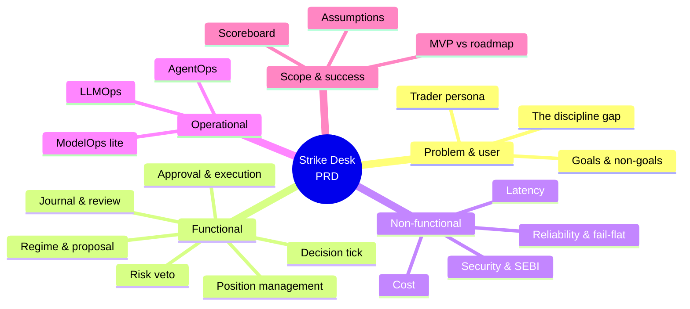

# Strike Desk — Product Requirements Document

> **Document:** Strike Desk PRD — what the product must do and how well, with every requirement tied back to a use-case ID.
>
> **Audience:** Amit, and anyone planning or building an iteration. This is the contract: the use-case catalog (`01_use_cases.md`) says *what* the desk can be asked to do; this document says which of those are required, what "good enough" means, and what success looks like.
>
> **Goal:** Pin the functional, non-functional and operational requirements at design altitude, turn the disciplines the proposal named — AgentOps, LLMOps, ModelOps-lite — into testable requirements, and write the risk limits down as *numbers* so no iteration has to guess.

<!-- export-png: 02_prd_toc.png -->


<details><summary>ASCII fallback — PRD map</summary>

```
Strike Desk PRD
|
+-- Problem & user -> discipline gap, the Trader, goals/non-goals
+-- Functional reqs -> tick, regime, proposal, risk veto, approval, execution, monitor, journal, review
+-- Non-functional reqs -> latency, reliability/fail-flat, security & SEBI, cost
+-- Operational reqs -> AgentOps, LLMOps, ModelOps (lite); RAGOps deferred
+-- Scope & success -> MVP vs roadmap, scoreboard metrics, assumptions
```
</details>

---

## 1. Problem statement

An index options buyer with a sound playbook still loses money, and the reason is not usually the playbook. SEBI's own study found that 93% of individual F&O traders lose money and that roughly 71% of aggregate retail losses were transaction costs — not wrong directional calls. The failures are structural and repetitive: taking the marginal trade out of boredom, holding a long while theta grinds it down, sizing by conviction instead of by capital, and abandoning the exit when the position turns. Every one of those is an execution failure, and execution is automatable.

OpenAlgo already provides the substrate — broker connectivity, a live feed, an option chain with Greeks, a sandbox, a human approval gate, and an MCP tool surface. What is missing is the layer that decides: today a human watches the chain and clicks, or a static condition tree fires blindly and cannot explain itself. Strike Desk is that layer — an agentic desk that reads the regime, usually declines, occasionally proposes a specific contract against a theta budget, clears every proposal through a deterministic risk veto, places behind human approval, manages the position to a stop or a time-stop, and leaves a record a regulator could read back.

## 2. Target user and persona

The product has exactly one human user in the first version: **the Trader**, who is Amit. He buys index options intraday — NIFTY and BANKNIFTY weeklies — on his own broker account, through his own self-hosted OpenAlgo instance. He is technical enough to run the stack and read a trace, but he is not looking for a research tool: he wants his own playbook executed the way he would execute it on his most disciplined day, with a reason he can read in ten seconds and a veto he can exercise at any moment.

That persona shapes everything. He does not want a black box that trades for him — hence the Action Center gate on every MVP order. He does not want a wall of numbers — hence the natural-language rationale on every entry and every decline. He does want to know *why* the desk stayed out, because staying out is most of what it does. And he is trading real money on a single-user, self-hosted instance, which is why the security model is "one user, one broker session, server access equals full control" rather than a multi-tenant permission system.

## 3. Goals and non-goals

The goal of the first version is to take one playbook, on one index, out of the trader's hands and into a traceable loop he trusts enough to leave running — and to demonstrate that it is *more disciplined*, not more clairvoyant, than he is.

The non-goals are load-bearing.

**Predictive alpha is not a goal and is not claimed.** No requirement in this document depends on the model being right about direction. If a requirement would only be safe when the forecast is good, it is a defective requirement.

**Autonomous live trading is not in the first version.** Every real-money order passes a human click (FR-6). Auto mode is Phase 2 and is per-playbook, evidence-gated and instantly reversible.

**This is not a multi-user platform, a SaaS, or a rebuild of OpenAlgo.** It is a decision layer on top of an existing self-hosted single-user instance. It adds no multi-tenancy, no broker integrations, and no market-data plumbing.

**This is not a backtesting or research product.** The nightly review and the replay harness exist to evaluate the agent, not to search for new strategies.

**No monetization, pricing, or go-to-market content is in scope.**

## 4. Functional requirements

Each requirement links to the use-case IDs it covers.

**FR-1 — Run a decision tick.** On a configurable cadence through market hours, and on explicit request, the system must run exactly one plan → act → observe cycle producing exactly one persisted decision — enter, decline, or hold — tagged with timestamp, regime, book state and reason. A specialist failure must degrade the tick to a decline, never to an entry. Overlapping triggers must be skipped, not run concurrently over the same book. *Covers UC-01.*

**FR-2 — Classify the regime.** Within a tick, the system must classify the index into a fixed regime set (trending, range-bound, high-volatility, event-driven, unknown), grounded in live price history, indicators, India VIX and index OI read through tool calls, returning a label, a 0–1 confidence, and at least one cited data point. "Unknown" must always be reachable and must always resolve to a decline. *Covers UC-02.*

**FR-3 — Decline explicitly and record why.** A no-trade outcome must be a first-class, persisted decision carrying a machine-readable reason code and a human-readable sentence, distinguishable by cause: regime, risk veto, position already open, no viable contract, or data quality. Declines must be countable and reportable per day and per reason. *Covers UC-03.*

**FR-4 — Propose a contract.** When the regime warrants an entry, the system must produce one structured proposal naming index, expiry, strike, option type, lots, entry price band, breakeven, stop, target, time-stop and theta budget, plus a written rationale. Every numeric claim in the rationale must appear in the tool-call evidence captured for that tick; a proposal citing an unfetched number is a defect. If no contract satisfies the playbook's delta, liquidity, spread and IV constraints, the system must return "no viable contract" rather than relax a constraint. *Covers UC-04.*

**FR-5 — Adjudicate deterministically.** Every proposal must pass a risk adjudication implemented as plain code, not an LLM call, covering at minimum: daily loss cap, per-trade loss cap, maximum concurrent positions, deployed-capital ceiling, lot ceiling, per-index exposure, daily trade count, and expiry-day windows. The outcome must be pass, size-reduced-to-fit, or veto, with the tripped limit, its configured value and the observed value journalled. A missing input must hold the proposal, never wave it through. A proposal exactly on a limit is a breach. *Covers UC-05.*

The MVP's limits, written as numbers so the first iteration does not have to invent them. These are the defaults; all are configuration, and the trader confirms them before the first live session:

| Limit | MVP default | Rationale |
| --- | --- | --- |
| Daily loss cap | 2% of deployed capital | Session stops proposing entries on breach |
| Per-trade loss cap | 0.5% of deployed capital | Bounds a single bad entry |
| Max concurrent positions | 1 | One index, one playbook — concurrency is Phase 2 |
| Max lots per trade | 2 lots | Hard ceiling above the sizing calculation |
| Deployed-capital ceiling | 10% of account | Premium at risk, not notional |
| Max trades per day | 3 | The anti-churn limit — the 71%-of-losses number made concrete |
| Theta budget | ≤ 15% of premium paid per day | Drives strike/expiry selection and the time-stop |
| Time-stop | 45 minutes, or 15:00 IST, whichever first | Exits before the decay curve steepens |
| Expiry-day window | No new entries after 14:00 IST on expiry day | Gamma risk the MVP does not take |
| No-trade windows | 09:15–09:30, 15:15–close | Open volatility and close illiquidity |

**FR-6 — Human approval before every live order.** In the first version, every real-money order must pass through OpenAlgo's Action Center in semi-auto mode, presenting the contract, size, rationale and risk verdict, and must not reach the broker without an authenticated approval carrying identity and timestamp. Rejections must be persisted with a reason as a labelled corpus. An approval that arrives after the proposal's price band has gone stale must expire rather than fire late. *Covers UC-06.*

**FR-7 — Manage the open position deterministically.** From fill to flat, a stop, a target and a theta-aware time-stop must be live at all times and enforced by code with no model call on the path. Exits must not require approval even in semi-auto — getting out is never gated. Gaps, rejected exits, partial fills and manual trader intervention must each have defined handling. *Covers UC-07.*

**FR-8 — Fail flat.** Every named failure mode — model unavailability, feed loss, repeated tool failure, breached daily loss cap, kill switch, monitor unhealthy — must terminate in a flat or bounded book. New intents must stop within one tick of a kill-switch activation. Exchange-aligned auto square-off must run as the backstop in both sandbox and live. The reasoning plane failing while the monitor is alive must stop trading and continue managing — that is the correct degradation, and it must be tested. *Covers UC-08.*

**FR-9 — Run the full graph in sandbox.** The system must run identical code, prompts and limits against OpenAlgo's sandbox engine with the execution layer pointed away from the broker, unattended, for a complete expiry week. Any divergence in behaviour between sandbox and live must be recorded as a finding. *Covers UC-09.*

**FR-10 — Journal every decision immutably.** Every decision must append a structured, append-only record linking regime read → proposal → risk verdict → approval or rejection → order → outcome, stamped with agent, prompt version and model version. A failed journal write must fail the tick closed: an untraceable decision may not become an order. *Covers UC-10.*

**FR-11 — Nightly review against a rule-based baseline.** After each session, the system must replay the journal, compute the scoreboard metrics against a rule-based baseline implementing the same playbook, tag outcomes by regime, and write a narrative grounded strictly in the journal. A no-trade day must still produce a review. The reviewer may recommend but must not modify prompts, limits or configuration. *Covers UC-11.*

**FR-12 — Replay a session.** Any session with a complete trace must be reconstructable step by step — agent inputs, tool calls with inputs and outputs, agent outputs, deterministic checks — read-only and in order. Incompleteness must be surfaced as a defect, never silently rendered. *Covers UC-12.*

**FR-13 — Trace and cost visibility.** Per-tick and per-day token cost must be attributable to agent and model tier, reportable in aggregate, and compared against a configured ceiling that alerts on breach. *Covers UC-13.*

**FR-14 — Alert the operator.** Pending approvals, fills, stop and time-stop exits, risk vetoes, kill-switch activations and health failures must push through OpenAlgo's existing Telegram alerting. Routine declines must not alert. Rate limiting must never suppress a risk event, and alert-delivery failure must itself be visible. *Covers UC-14.*

**FR-15 — Do not architecturally preclude the roadmap.** The tick, tool layer, journal schema and risk module must be shaped so that auto mode (UC-15), further indices (UC-16), a replay-driven eval harness (UC-17), regime memory (UC-18), multi-leg (UC-19) and portfolio risk (UC-20) can be added without redesigning the core. Index-specific parameters must be configuration, not code. These are roadmap requirements, not first-version deliverables. *Covers UC-15 through UC-20.*

## 5. Non-functional requirements

**Latency — split by plane, and the split is the design.** The reasoning plane is latency-*tolerant*: a full tick (regime read, proposal, risk adjudication, journal write) targets under 20 seconds and must complete well inside the tick cadence. The control plane is latency-*critical*: from a stop or time-stop level being breached to the exit order being submitted must be sub-second and must never wait on a model call, a network round-trip to an LLM provider, or a retry of one. Any design that puts an inference call between a level breach and an exit order violates this requirement outright.

**Reliability and graceful degradation.** A failing specialist degrades the tick to a decline; it never aborts the monitor and never produces an entry. Hard limits live in deterministic code beneath the model, so no model failure or hallucination can breach a safety limit. State is durably persisted so a restart loses no position context, and the system must be safe to run with nobody watching, because that is the entire point.

**Security, and the SEBI constraint.** OpenAlgo's model holds: single user, single broker session, self-hosted, server access equals full control. Strike Desk adds no new authentication surface and no new remote exposure. From 1 April 2026 SEBI requires every transactional API order to originate from a broker-whitelisted **static IP**, with exchange-assigned Algo-IDs and audit trails; market-data reads remain exempt. This is a hard architectural constraint, not a deployment preference: scale-to-zero serverless on the execution path is ruled out, and the execution host must hold a stable, registered IP. Broker credentials and model API keys live in environment configuration, never in code, logs or the journal, and the journal must be free of secrets because it is the artifact most likely to be exported or shared.

**Auditability.** Because orders are regulated actions, each one must be stamped with the agent, prompt version and model version behind it in an immutable log. This is a non-functional requirement with a legal edge, and it is why the journal is append-only rather than a mutable table.

**Cost.** The desk runs market hours, not around the clock. Compute is a single small always-on instance holding the registered IP; token spend is the variable cost and is controlled by model-tier routing (cheap tier for classification, workhorse for the loop, top tier only for the nightly review), by keeping the hot path model-free entirely, and by the per-day ceiling in FR-13. The MVP target is a few dollars of infrastructure per month plus tokens.

**Operational NFR — AgentOps.** This is the home discipline. Every plan → act → observe step, every delegation and every tool call with its inputs and outputs must emit a trace, such that trace coverage is effectively complete and any session replays (FR-12). Multi-step evals run over replayed market data. The operational pass-bar: a session is healthy only if its trace is complete enough to replay — an incomplete trace is itself a defect, independent of P&L.

**Operational NFR — LLMOps.** Prompts are versioned artifacts, so any traced output ties to the exact prompt that produced it. A prompt change or model swap must pass a regression gate over a frozen suite of historical decision points before it ships (UC-17); scoring worse than the incumbent blocks the change. Guardrail tests are mandatory: the grounding constraint (no asserted fact the agent did not read) and the deterministic limits (FR-5) must each have tests that fail loudly. Token-cost ceilings are part of the pass-bar. PromptOps folds in here rather than standing up separately.

**Operational NFR — ModelOps (lite).** Only the audit-facing slice applies, because the product trains and serves no models of its own: each order carries the agent, prompt and model version that produced it, in the immutable log. Exchange Algo-ID registration is deferred to the phase where it is legally required for the trader's actual broker and strategy classification.

**RAGOps — deferred, deliberately.** The MVP retrieves the recent journal naïvely, which needs no retrieval pipeline. Chunking, regime-similarity indexing and retrieval-quality evaluation arrive with regime memory (UC-18), and this document is updated then.

**MLOps and AIOps do not apply.** The system trains no models, and it is a trading product rather than an IT-operations observability tool.

## 6. MVP scope versus roadmap

The **MVP** delivers FR-1 through FR-14 for NIFTY weeklies, one playbook — intraday directional long CE/PE with a theta-aware time-stop: the full agent graph running unattended in sandbox for a complete expiry week (FR-9), with the Risk Officer, tracing, decision journal, alerts and nightly review all live. It then flips to real money in semi-auto with every order human-approved. FR-15 keeps the roadmap reachable without building it.

The **roadmap** widens in order, not on dates: auto mode for playbooks the journal has earned (UC-15); BANKNIFTY and SENSEX (UC-16); the replay harness turned into a regression eval set (UC-17); regime memory (UC-18). The **fuller product** adds hedged multi-leg buying — debit spreads that cut the theta bleed the MVP merely respects (UC-19) — and portfolio-level risk across indices and brokers (UC-20).

## 7. Success metrics

Success is risk-adjusted discipline, measured against a rule-based baseline of the same playbook over the same data. Raw P&L is an outcome, never a target, and is not a success metric in this document.

**Operational.** A complete expiry week unattended in sandbox with zero unhandled exceptions, zero risk-limit breaches, and every order traceable to the decision trace behind it. Trace completeness approaching 100%. Zero autonomous live orders in the MVP audit log.

**Decision quality**, benchmarked against the baseline: **entries declined** (the desk should decline more than the baseline and be right to — declines are graded by what the trade would have done); **exits honoured** (the fraction of exits that fired at their defined level rather than late or by hand — target 100%); **cost drag** (total transaction cost as a share of gross P&L, against the baseline's); **max drawdown** (against the baseline's over the same period).

**Trust.** The trader's approval rate on proposals rises over time, and the rate of "it missed something" corrections falls — both measurable from the labelled approve/reject corpus (FR-6).

## 8. Assumptions, constraints, dependencies

The design assumes OpenAlgo continues to expose, through its MCP surface and services, the option chain with Greeks, quotes and history, indicators, position and funds state, order placement, the sandbox engine, the Action Center approval flow, and Telegram alerting — Strike Desk builds on those rather than reimplementing broker, execution or market-data plumbing. It assumes a single trader on a single self-hosted instance with one broker session, and one index and one playbook in the first version.

It is constrained by SEBI's static-IP mandate on transactional orders from 1 April 2026, by the eventlet/gunicorn runtime rules of the host application (no `asyncio` on the hot path inside the Flask process — the reasoning plane runs out-of-process for exactly this reason), and by the recommend-then-approve posture with no autonomous orders in the first version. It depends on the broker's daily token lifecycle (Indian broker tokens expire ~3:00 AM IST) and on the model provider's availability, with fail-flat as the answer to both.

## 9. Limitations / when this changes

This PRD is written for one trader, one index, one playbook and a human-gated execution posture. If any of those move — auto mode pulled into the MVP, spreads instead of naked longs, a second index brought forward — the affected requirements are revised here and the architecture follows. The numeric risk limits in FR-5 are MVP defaults for the trader to confirm, not fixed constants; they are configuration, and changing them is a configuration change with an audit record, not a code change. The latency, cost and model-tier assumptions track the current model line and are held in the tech-stack document, which is where a change lands first.

---
**Sources**

*Repo files:* `020_proposal/proposal.md` · `030_design/01_use_cases.md` · `000_client_data/goals.txt` · `CLAUDE.md`

*Web (accessed 2026-07-10, carried forward from the proposal):*
- [SEBI — Safer participation of retail investors in Algorithmic trading (Feb 2025 circular)](https://www.sebi.gov.in/legal/circulars/feb-2025/safer-participation-of-retail-investors-in-algorithmic-trading_91614.html)
- [Zerodha — What is a static IP and how to add one to your developer account?](https://support.zerodha.com/category/trading-and-markets/general-kite/kite-api/articles/static-ip)
- [MarketNetra — Why 91% of Indian F&O Traders Lose Money: Lessons from SEBI's Data](https://marketnetra.in/blog/why-91-percent-fo-traders-lose-money-sebi)
- [Ventura — Nifty & Bank Nifty Lot Size Changes January 2026](https://www.venturasecurities.com/blog/nifty-bank-nifty-lot-size-changes-january-2026-know-how-it-impacts-traders/)
