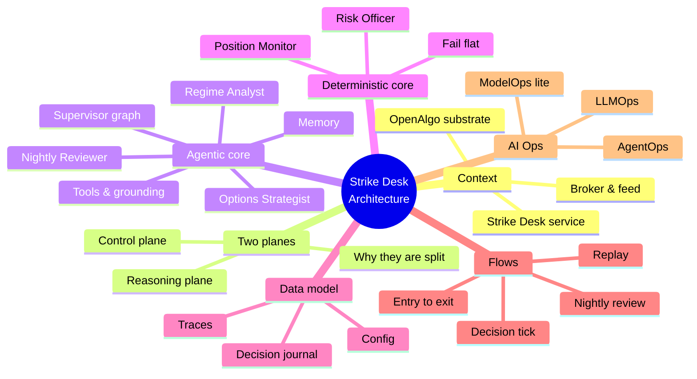
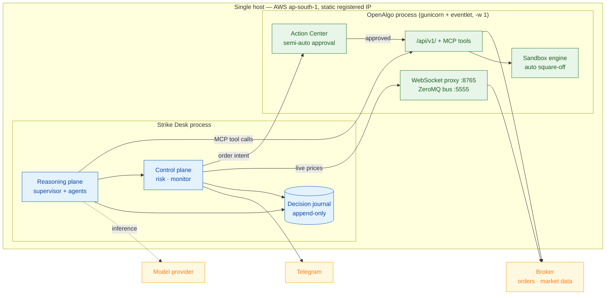
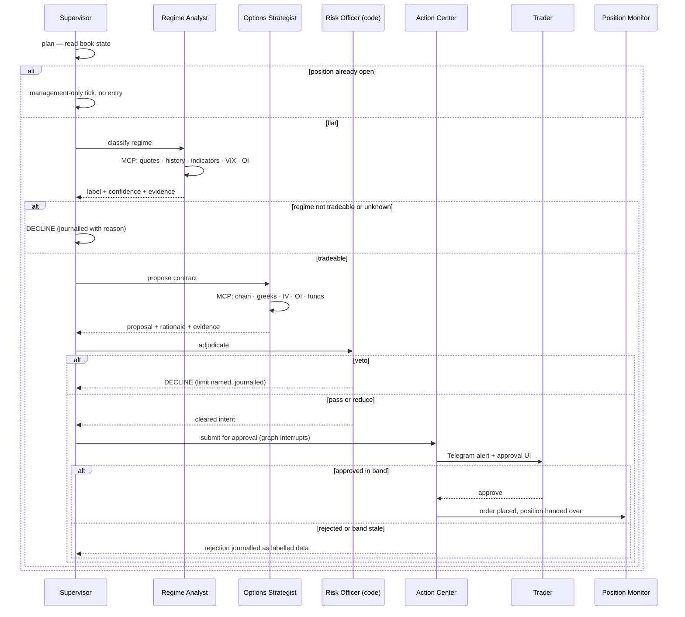

# Strike Desk — Architecture

> **Document:** Strike Desk Architecture — how the system is shaped, how the agentic loop runs, where it touches OpenAlgo, and how every requirement in the PRD is realised.
>
> **Audience:** Amit, and whoever builds an iteration. The PRD (`02_prd.md`) says *what* must be true; this says *how*. The tech stack (`04_tech_stack.md`) says what it is built from.
>
> **Goal:** Fix the structural decisions — the two-plane split, the process boundary against the Flask host, the tool-grounding contract, the journal as system of record, and the failure semantics — so no iteration re-litigates them.

<!-- export-png: 03_architecture_toc.png -->


<details><summary>ASCII fallback — architecture map</summary>

```
Strike Desk Architecture
|
+-- Context -> Strike Desk service, OpenAlgo substrate, broker & feed
+-- Two planes -> reasoning (latency-tolerant, LLM) | control (latency-critical, code)
+-- Agentic core -> supervisor graph, Regime Analyst, Options Strategist, Nightly Reviewer, tools, memory
+-- Deterministic core -> Risk Officer, Position Monitor, fail-flat
+-- Data model -> decision journal, traces, config
+-- Flows -> decision tick, entry-to-exit, nightly review, replay
+-- AI *Ops -> AgentOps, LLMOps, ModelOps (lite); RAGOps deferred
```
</details>

---

## 1. System context

Strike Desk is a **separate process** that runs alongside an existing self-hosted OpenAlgo instance on the same host. It is not a Flask blueprint, and that is a deliberate structural decision with three reasons behind it.

First, **runtime compatibility**. OpenAlgo's production posture is gunicorn with a single eventlet worker. Eventlet monkey-patches the standard library and is incompatible with `asyncio` — and every current agent framework, model SDK and tracing client is asyncio-native. Embedding the agent graph inside the Flask process would mean fighting that incompatibility on the trading path forever.

Second, **blast radius**. A hung model call, a runaway retry or a memory leak in the reasoning layer must not be able to take down the process that holds the broker session and serves the UI.

Third, **upgradeability**. OpenAlgo is an upstream open-source project the trader will keep pulling from. Strike Desk consumes it through its published API and MCP surfaces rather than forking it, so `git pull` stays boring.



Strike Desk reads market state through OpenAlgo's MCP tool surface (`mcp/mcpserver.py`, roughly 112 tools including quotes, history, indicators, option chain and Greeks), places orders through the Action Center path (`services/action_center_service.py`), runs its proving week against the sandbox engine (`services/sandbox_service.py`), takes live prices for the monitor from the WebSocket proxy on port 8765, and alerts through `services/telegram_alert_service.py`. It writes to its own database and never to OpenAlgo's.

## 2. The two planes

The single most important structural idea in this system is that it has **two planes with different latency contracts**, and the boundary between them is enforced, not aspirational.

The **reasoning plane** is where the language model lives. It runs on a cadence (minutes, not milliseconds), tolerates a several-second round trip, may retry, and may fail — because when it fails, the correct answer is "do not trade", which is safe. It decides *whether* and *what*.

The **control plane** is deterministic code. It runs continuously, holds sub-second latency, and never calls a model. It decides *whether the proposal is permitted* (Risk Officer) and *when to get out* (Position Monitor). It must keep working when the reasoning plane is dead.

This is why the Risk Officer is not an agent and the Position Monitor is not an agent. Both are decisions a language model could plausibly make and must not: a safety limit that can be argued with is not a limit, and an exit that waits on an API round-trip is not an exit. The division of labour *is* the product — the model reasons and explains, arithmetic decides and enforces, and prediction is assigned to no one.

## 3. The agentic core

### 3.1 The supervisor loop

The supervisor is a graph, not a prompt chain. On each tick it runs plan → act → observe: plan which specialists this book state requires, act by delegating, observe the structured results, and assemble exactly one decision. It calls no market tools itself. Its output is always an *intent*, never an order.

State per tick — book state, regime read, proposal, risk verdict, evidence — lives in the graph's checkpointer, so a tick is resumable and inspectable. The approval gate is modelled as an **interrupt**: the graph pauses at the human boundary and resumes on approval or expiry, which is exactly the semantics Action Center needs and is a primary reason for the framework choice recorded in `04_tech_stack.md`.

### 3.2 Why three agents, not one

Each agent owns one honest job that can be graded, versioned and overruled on its own.

The **Regime Analyst** answers "what state is the index in, and is it tradeable?" It reads price history, indicators, India VIX and index OI, and returns a label, a confidence and cited evidence. It is separated from the strategist because a regime read is reusable, cheap, and the thing most worth grading against outcomes — and because an agent that both reads the regime *and* wants to trade has an incentive to see a tradeable regime.

The **Options Strategist** answers "which contract, at what size, with what exit levels?" It reads the live chain, Greeks, IV and OI and returns a fully specified proposal with a rationale. It is a separate agent because contract selection is a different reasoning task with different grounding and a different failure mode: the Analyst's failure is a bad label, the Strategist's is an illiquid strike.

The **Nightly Reviewer** answers "how did we do, honestly?" It runs once, off the trading path, on the most capable tier, grounded strictly in the journal, and may recommend but not modify.

There is deliberately **no narrator agent**: the rationale is produced by the agent that made the judgement, because a separate prose layer over someone else's structured output is where invented numbers come from.

### 3.3 Tools and grounding

All grounding is tool-based, through OpenAlgo's MCP server. The contract is absolute: **an agent may not assert a market fact it did not read this tick.** Every tool call — inputs and outputs — is captured into the tick's evidence bundle, and the journal stores rationale alongside evidence so any claim can be checked against the call that produced it. A rationale citing a number absent from the evidence is a defect that the guardrail tests must catch (PRD §5, LLMOps).

Tool exposure is scoped tightly per agent. The Regime Analyst gets quotes, history and indicators; the Options Strategist gets chain, Greeks and funds; neither gets order-placement tools. Order placement is not in any agent's tool set — it is reachable only through the control plane. An agent that cannot call a place-order tool cannot place an order by hallucination, which is a stronger guarantee than a prompt instruction.

### 3.4 Memory

Memory is two-tiered. **Session state** lives in the graph checkpointer — this tick's working set, discarded after the tick closes. **Durable memory** is the decision journal: every decision, its evidence, its outcome, and the prompt and model versions behind it.

In the MVP the journal is retrieved naïvely — today's decisions and the last few sessions, by recency. There is no embedding index and no retrieval pipeline, and that is a deliberate scope boundary, not a gap: regime-similarity retrieval is UC-18, and it is the phase that genuinely introduces RAGOps.

### 3.5 Guardrails, layered

Five layers, from softest to hardest, each of which must hold independently:

1. **Prompt-level grounding** — agents are instructed to cite only what they read. Weakest layer; verified by tests, never trusted alone.
2. **Tool scoping** — no agent holds an order-placement tool. Structural, not instructional.
3. **The Risk Officer** — deterministic veto over every proposal (PRD FR-5). The model cannot re-prompt it.
4. **Action Center approval** — a human click between intent and real money in the MVP (FR-6).
5. **Fail-flat and auto square-off** — the floor. Kill switch, exchange-aligned square-off, sandbox default (FR-8).

Sandbox is the default target for a new deployment. Flipping to live money is an explicit configuration change plus a passing expiry-week run (FR-9), and that gate is a product requirement rather than a suggestion.

## 4. The deterministic core

### 4.1 Risk Officer

A pure function over `(proposal, book state, config)` returning `pass | reduce | veto` with the tripped limit named. Pure by design: it is trivially unit-testable, deterministic under replay, and cannot be influenced by anything the model emits except the proposal's declared numbers — which the checks recompute rather than trust. The limits it enforces and their MVP defaults are in PRD §4, FR-5. It runs before the approval gate, so the trader never sees a proposal that would have been vetoed.

### 4.2 Position Monitor

A tight loop subscribed to the WebSocket feed for the open position's symbol, holding the stop, target and time-stop in memory and firing an exit the moment a level is breached. No model call, no HTTP round-trip to the reasoning plane, no database read on the hot path. It writes exits to the journal *after* submitting them, never before — the order goes first.

The time-stop is what makes this an options-buying desk rather than a generic one. A long option loses value with the clock even when the thesis is intact, so the monitor holds a wall-clock deadline derived from the theta budget at entry and exits on it regardless of price. That is the mechanical answer to the theta-decay row in the proposal's bleed table.

Reconciliation matters: on startup and on reconnect the monitor reads actual broker positions and adopts what it finds, rather than assuming its in-memory view is authoritative. A monitor that believes in a position the broker closed is a hazard.

### 4.3 Failure semantics

The rule is **fail flat, never fail open**, and each failure has one defined terminal state:

| Failure | Reasoning plane | Control plane | Terminal state |
| --- | --- | --- | --- |
| Model unavailable / times out | Tick degrades to a decline | Unaffected | No new entries; open position still managed |
| Tool call fails repeatedly | Decline, reason `data-quality` | Unaffected | No new entries |
| Market feed lost | No new ticks | Escalates: alert, then square off | Flat |
| Daily loss cap breached | Stops proposing for the session | Manages to exit | Bounded |
| Kill switch | Stops within one tick | Squares off | Flat |
| Monitor unhealthy | Stops proposing | Alert + square-off | Flat |
| Strike Desk process dies | Both down | OpenAlgo auto square-off | Flat at exchange square-off time |

The last row is the reason auto square-off stays enabled in OpenAlgo even though Strike Desk has its own exits: the backstop must survive the thing it is backing up.

## 5. Data model

Strike Desk owns one database, separate from OpenAlgo's six, following the same conventions (SQLAlchemy ORM, `NullPool` on SQLite, sessions closed on every path).

**`decisions`** — one row per tick: timestamp, index, cadence trigger, book state snapshot, outcome (`enter` / `decline` / `hold`), reason code, natural-language reason, regime label and confidence, prompt version, model version, token cost. Append-only.

**`proposals`** — one row per proposal: decision id, expiry, strike, option type, lots, entry band, breakeven, stop, target, time-stop, theta budget, rationale.

**`risk_verdicts`** — one row per adjudication: proposal id, verdict, limit name, configured value, observed value.

**`approvals`** — one row per human action: proposal id, approve/reject, identity, timestamp, rejection reason. This table is the labelled corpus the agents are later graded against, which is why rejection reasons are captured rather than optional.

**`orders`** and **`fills`** — links from proposal to the OpenAlgo order id and the resulting position, plus exit reason (`stop` / `target` / `time-stop` / `square-off` / `manual`) and realised outcome.

**`traces`** — the per-step spans: agent, tool calls with inputs and outputs, latency, tokens.

Everything is append-only. Corrections are new rows, never updates. That is both the audit posture SEBI's direction implies and the precondition for honest evaluation — a journal you can edit is a journal you can flatter.

## 6. Key end-to-end flows

### 6.1 The decision tick



Note what is *not* in this diagram: no model call after the risk verdict. From adjudication onward the path is deterministic code and a human.

### 6.2 Entry to exit

The monitor holds three exits from the moment of fill and fires whichever comes first: the **stop** (price against the position by the configured amount), the **target**, or the **time-stop** (wall clock, derived from the theta budget, or 15:00 IST). Exits are not gated by Action Center even in semi-auto. A gap through the stop exits at market and records slippage. A rejected exit retries once, then escalates to a market order and alerts. On exit, the monitor writes the fill and outcome to the journal and the supervisor resumes proposing on the next tick, subject to the day's trade-count limit.

### 6.3 Nightly review

After the close, the reviewer replays the journal for the session, runs the rule-based baseline over the same market data, computes entries declined, exits honoured, cost drag and drawdown for both, tags each decision by regime, and writes a narrative grounded strictly in the journal. The baseline is a first-class deliverable, not a footnote: without it "the agent did well" is unfalsifiable. It is the same playbook expressed as a static condition tree — deliberately the thing the proposal argues against — so the comparison is honest.

### 6.4 Replay

Any session with a complete trace replays step by step from stored spans: agent inputs, tool calls with their captured outputs, agent outputs, deterministic checks. Because tool outputs are captured rather than re-fetched, replay is deterministic and works after market hours. An incomplete trace is rendered as an explicit defect, never silently smoothed.

### 6.5 Cross-cutting concerns

**Secrets.** Broker credentials stay in OpenAlgo's `.env` as today; the model API key lives in Strike Desk's own environment configuration. Neither is ever written to the journal or the trace — the journal is the artifact most likely to be exported for review, so it must be safe to hand over.

**Authentication.** Strike Desk exposes no new remote surface. It reaches OpenAlgo over localhost with an API key and is reached by the trader only through OpenAlgo's existing authenticated UI (Action Center) and Telegram. The single-user, self-hosted, server-access-equals-full-control model is inherited unchanged.

**SEBI static IP.** All transactional orders leave from OpenAlgo on the host holding the broker-whitelisted Elastic IP. Strike Desk never places an order from anywhere else, and the reasoning plane's outbound calls to the model provider are irrelevant to that mandate because they carry no order. This is why the deployment is a small always-on instance rather than anything scale-to-zero.

**File-descriptor hygiene.** Strike Desk follows the host project's conventions, because it is a long-running single-process service with exactly the accumulation risk the repo warns about: one shared HTTP client, one WebSocket connection with close-before-reconnect, `NullPool` SQLite engines with sessions closed on every path including error paths, and module-level singletons rather than per-tick executors.

**Observability.** The trace *is* the observability story (AgentOps), supplemented by process health checks that feed the alerting path. A missing trace is treated as an outage of a safety system, not a cosmetic gap.

## 7. Operational design (AI \*Ops)

**AgentOps** is the default discipline for this build and is realised as complete span coverage over every plan → act → observe step, every delegation and every tool call, exported to a self-hosted tracing backend so private trading data stays on the trader's own infrastructure. Multi-step evals run over replayed market data. Pass-bar: a session is healthy only if it replays.

**LLMOps** is realised as prompts stored as versioned artifacts referenced by id from every journal row, a regression suite over frozen historical decision points that must not score worse before a prompt or model change ships (UC-17), guardrail tests over grounding and the deterministic limits, and per-day token ceilings surfaced in the cost view.

**ModelOps** appears only in its audit-facing slice: every order carries the agent, prompt version and model version that produced it, immutably. Algo-ID registration is deferred until the trader's broker and strategy classification make it legally required.

**RAGOps is deliberately not adopted in the MVP** — the journal is retrieved by recency, which is not a retrieval pipeline. It arrives with regime memory (UC-18), and this document is updated then rather than force-fitting the discipline now. **MLOps and AIOps do not apply**: no models are trained here, and this is a trading product, not an observability tool.

## 8. Limitations / when this changes

This architecture assumes one index, one playbook, one open position at a time, and a human gate on every live order. Concurrency (more than one open position) changes the Risk Officer from a per-proposal check into a portfolio check and changes the monitor from one loop into a supervised set — that is UC-20's work and it is deliberately not designed in yet. Multi-leg (UC-19) changes execution semantics, because a half-filled spread is a distinct risk from either leg; the Risk Officer must model leg-level and combined risk before that ships. Regime memory (UC-18) introduces a retrieval pipeline and with it RAGOps.

The out-of-process split assumes OpenAlgo keeps running under eventlet with a single worker; if that changes upstream the reasoning could in principle move in-process, but the blast-radius and upgradeability arguments would still hold, so the split should be re-justified rather than assumed obsolete. Model tiering and latency numbers track the current model line and live in `04_tech_stack.md`, which is where such a change lands first.

---
**Sources**

*Repo files:* `020_proposal/proposal.md` · `030_design/01_use_cases.md` · `030_design/02_prd.md` · `CLAUDE.md` · `mcp/mcpserver.py` · `services/action_center_service.py` · `services/sandbox_service.py` · `services/option_chain_service.py` · `services/option_greeks_service.py` · `services/telegram_alert_service.py` · `websocket_proxy/server.py` · `database/engine_factory.py`

*Web (accessed 2026-07-10, carried forward from the proposal):*
- [SEBI — Safer participation of retail investors in Algorithmic trading](https://www.sebi.gov.in/legal/circulars/feb-2025/safer-participation-of-retail-investors-in-algorithmic-trading_91614.html)
- [LangChain — LangChain and LangGraph Agent Frameworks Reach v1.0 Milestones](https://www.langchain.com/blog/langchain-langgraph-1dot0)
- [TradingAgents: Multi-Agents LLM Financial Trading Framework (arXiv 2412.20138)](https://arxiv.org/abs/2412.20138)
