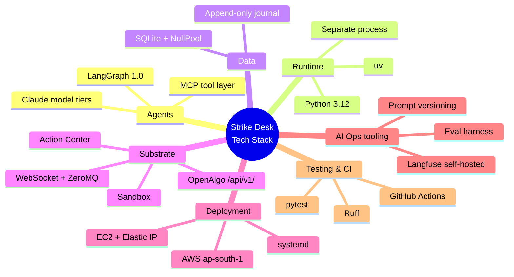

# Strike Desk — Tech Stack

> **Document:** Strike Desk Tech Stack — every technology choice the product is built on, justified, with the current verified version or model ID and its cost implication.
>
> **Audience:** Amit, and anyone building an iteration. The architecture (`03_architecture.md`) says *how* the system is shaped; this says *what* it is built from and *why* each piece fits this product specifically.
>
> **Goal:** Pin the stack so every iteration builds on the same, current, cost-aware foundation — each layer's choice, its verified version, the reason it fits, and what it costs to run.

<!-- export-png: 04_tech_stack_toc.png -->


<details><summary>ASCII fallback — tech-stack map</summary>

```
Strike Desk Tech Stack
|
+-- Agents -> LangGraph 1.0, Claude tiers (Opus 4.8 / Sonnet 5 / Haiku 4.5), MCP tools
+-- Runtime -> Python 3.12, uv, separate process from the Flask host
+-- Data -> SQLite (NullPool), append-only decision journal
+-- Substrate -> OpenAlgo /api/v1/, MCP, Action Center, sandbox, WebSocket/ZeroMQ
+-- Deployment -> AWS ap-south-1 EC2 + Elastic IP, systemd
+-- AI *Ops -> Langfuse (self-hosted), versioned prompts, replay eval harness
+-- Testing & CI -> pytest, Ruff, GitHub Actions
```
</details>

---

![Dark landscape technology diagram tagged "every technology choice defined, justified, and cost-aware", whose left column shows four interlocking constraint gears — regulation (SEBI static-IP requirement), the runtime boundary between OpenAlgo and asyncio, the two-plane split of AI cadence, and data residency for privacy — driving a green LangGraph 1.0 orchestration block with an interrupt-and-resume human approval gate feeding an MCP tool layer, beside three cost-annotated model tiers (Nightly Reviewer on Opus 4.8 / claude-opus-4-8 for sophisticated off-path analysis at high effort, Options Strategist on Sonnet 5 / claude-sonnet-5 as the trading and options reasoning core, Regime Analyst on Haiku 4.5 / claude-haiku-4-5 for fast classification at medium effort and low price), a runtime card naming Python 3.12 with uv for package management and httpx for connections, a data card putting an append-only decision journal in SQLite behind SQLAlchemy with NullPool, a blue substrate strip listing the OpenAlgo core — unified broker API (/api/v1/), Greeks/IV/OI services, WebSocket proxy (:8765) with ZeroMQ bus (:5555), Telegram alerting, Action Center semi-auto approval and the ₹1 Cr sandbox engine — a deployment row placing EC2 with an Elastic IP registered for SEBI in AWS ap-south-1 (Mumbai) alongside AI Ops of self-hosted Langfuse for AgentOps tracing and versioned prompts and a replay eval harness against a rule-based baseline, and a right-hand testing and CI column stacking pytest, Ruff, bandit and pip-audit over GitHub Actions running lint, tests, guardrail tests and prompt-regression jobs.](images/amit-design-tech-stack-image.png)

## 1. How the stack was chosen

Four constraints did most of the choosing, and every entry below traces back to one of them.

**Regulation picks the deployment.** From 1 April 2026 SEBI requires every transactional API order to originate from a broker-whitelisted **static IP**, with exchange-assigned Algo-IDs and audit trails. Market-data reads stay exempt. That single rule removes scale-to-zero serverless from the execution path and forces a small always-on host with a stable registered IP.

**The host application picks the runtime boundary.** OpenAlgo runs under gunicorn with a single eventlet worker, and eventlet is incompatible with `asyncio` — which every agent framework and model SDK depends on. Strike Desk therefore runs as its own Python process, alongside rather than inside.

**The two-plane split picks the model tiers.** The hot path has no model call at all, so no model needs to be fast enough for a stop-loss. That frees the reasoning plane to use a capable tier on a cadence, and the review plane to use the most capable tier once a day.

**Data residency and privacy pick the tooling.** Traces contain live positions and trading logic. Tracing is therefore self-hosted on the same instance rather than sent to a third-party SaaS.

## 2. Agents

**LangGraph 1.0** orchestrates the graph. It reached a stable major release, is model-agnostic, and is Python — matching OpenAlgo's 3.12 backend. The decisive feature is **interrupt-and-resume**: the graph can pause at a human boundary and resume on approval, which maps exactly onto the Action Center gate (`03_architecture.md` §3.1) rather than being bolted on. Its checkpointer gives per-tick durable state for free. Google's ADK reached GA only in May 2026 and leans Gemini-ward; the OpenAI Agents SDK is model-locked. Both were rejected for the same reason: this product wants the orchestration layer and the model choice to be independently swappable.

**Claude models, tiered by job.** Adaptive thinking (`thinking: {"type": "adaptive"}`) is used throughout; `budget_tokens` is removed on all three tiers and would 400. Effort is set per call via `output_config.effort`.

| Job | Model | Model ID | Price (per MTok in/out) | Why this tier |
| --- | --- | --- | --- | --- |
| Options Strategist — the reasoning core | Claude Sonnet 5 | `claude-sonnet-5` | $3 / $15 ($2 / $10 introductory through 2026-08-31) | Near-Opus quality on agentic and tool-heavy work at Sonnet cost; this is the call that runs on every tradeable tick |
| Regime Analyst — classification | Claude Haiku 4.5 | `claude-haiku-4-5` | $1 / $5 | Cheap, fast, and the task is a constrained label + confidence + evidence — the classic Haiku shape |
| Nightly Reviewer — off-path analysis | Claude Opus 4.8 | `claude-opus-4-8` | $5 / $25 | Runs once a day, off the trading path, on the hardest reasoning task in the product; cost is bounded by frequency |

Effort defaults: `medium` for the Regime Analyst, `high` for the Options Strategist, `xhigh` for the Nightly Reviewer. These are configuration and are meant to be swept on the eval harness (UC-17) rather than fixed by assertion.

**MCP as the tool layer.** Agents consume OpenAlgo's existing MCP server (`mcp/mcpserver.py`) rather than a bespoke adapter, so every market claim traces to a real tool call and the tool surface stays in sync with the platform as it is upgraded. Tools are scoped per agent; order placement is in no agent's tool set (`03_architecture.md` §3.3).

## 3. Runtime

**Python 3.12** — matches the host project, so shared conventions, types and idioms carry over.

**uv** for dependency and environment management, exactly as the host repo requires. Never global Python; every command is `uv run`.

**A separate OS process**, supervised by systemd, started after the OpenAlgo service. The three reasons — eventlet/asyncio incompatibility, blast radius, and keeping `git pull` on upstream OpenAlgo boring — are argued in `03_architecture.md` §1.

**httpx** for outbound HTTP, single shared client instance with connection pooling, mirroring `utils/httpx_client.py`. One client for the process, never per-call — this is an FD-hygiene requirement, not a style preference.

## 4. Data

**SQLite** for the Strike Desk database, with `NullPool` and sessions closed on every path including error paths, following the host project's hard-won convention (`StaticPool` corrupts cursor state under concurrency). One database, separate from OpenAlgo's six, so an upstream migration never touches Strike Desk's journal and vice versa.

**SQLAlchemy ORM**, never raw SQL — same rule as the host project.

**Append-only schema.** Corrections are new rows; nothing is updated in place. This is the audit posture the regulatory direction implies and the precondition for honest evaluation.

Postgres is the migration path if volume or concurrency ever demands it, but at one index, one playbook and a handful of decisions per day, SQLite is the right answer and adds no operational surface.

## 5. The OpenAlgo substrate

Not chosen so much as given — but worth naming, because these are the pieces Strike Desk is explicitly *not* rebuilding:

| Capability | Where it lives | What Strike Desk uses it for |
| --- | --- | --- |
| Unified broker API (30+ brokers) | `/api/v1/`, `restx_api/` | Order placement, positions, funds |
| MCP tool server (~112 tools) | `mcp/mcpserver.py` | All market grounding |
| Option chain, Greeks, IV, OI | `services/option_chain_service.py`, `services/option_greeks_service.py` | Contract selection |
| Action Center (semi-auto approval) | `services/action_center_service.py` | The human gate on every live order |
| Sandbox engine (₹1 Cr, auto square-off) | `services/sandbox_service.py` | The proving week (UC-09) and the fail-flat backstop |
| WebSocket proxy (:8765) + ZeroMQ bus (:5555) | `websocket_proxy/` | Live prices for the Position Monitor |
| Telegram alerting | `services/telegram_alert_service.py` | Approvals, fills, risk events |

Strike Desk adds no broker integration, no market-data plumbing, and no new remote surface.

## 6. Deployment

**AWS ap-south-1 (Mumbai)** — lowest latency to Indian exchanges and keeps trading data in-country.

**EC2 with an Elastic IP**, registered with the broker for the SEBI static-IP mandate. The IP is the reason this is a persistent instance rather than anything scale-to-zero, and the reason failover needs a second registered IP rather than a load balancer.

Two postures:

| Posture | Shape | Cost |
| --- | --- | --- |
| **Practice / MVP** | One small ARM instance (e.g. `t4g.small`), SQLite, both processes on the same host, running through market hours | A few dollars a month plus tokens |
| **Production target** | Larger instance, RDS Postgres, a second registered failover IP, off-host backups | Higher, and deliberately deferred |

The cheap start is a decision, not an oversight — it proves the system before it pays for resilience it has not yet earned.

**systemd** supervises both processes with restart-on-failure. The restart path must be safe: on start, the Position Monitor reconciles against actual broker positions rather than trusting in-memory state (`03_architecture.md` §4.2).

## 7. AI \*Ops tooling

**Langfuse, self-hosted on the same instance**, for AgentOps tracing. Self-hosting is a data-residency requirement, not a cost optimisation: traces carry live positions and the trading logic itself, and neither should leave the trader's own infrastructure. It integrates natively with LangGraph, so span coverage over plan → act → observe steps and tool calls comes from instrumentation rather than hand-rolled logging.

**Prompts as versioned artifacts** in the repo, referenced by version id from every journal row, so any traced output ties to the exact prompt behind it.

**The eval harness** is the replay of the journal (UC-12, UC-17): frozen historical decision points, scored against the rule-based baseline. It runs on demand and in CI, and a regression blocks a prompt or model change.

**The rule-based baseline** is a first-class component, not a test fixture — plain Python implementing the same playbook as a static condition tree. Without it, "the agent did well" is unfalsifiable.

## 8. Testing and CI

**pytest** for unit and integration tests, matching the host project's layout. The Risk Officer is a pure function and gets exhaustive limit-boundary coverage — including the on-the-limit case, which must read as a breach.

**Ruff** for lint and format (line length 100, target 3.12), same configuration as the host repo.

**GitHub Actions** running Ruff, pytest, the guardrail tests (grounding and deterministic limits), and the prompt regression suite. Guardrail tests are not optional and must fail loudly: a passing build with a broken risk check is worse than a red one.

**bandit** and **pip-audit** in the dev group, as the host project already provisions.

## 9. What is deliberately not in the stack

**No vector database, no embedding model.** The MVP retrieves the journal by recency. Regime-similarity retrieval (UC-18) is the phase that earns a vector store; adding one now would be infrastructure without a consumer.

**No message queue.** One tick at a time, one open position, one process. A queue would add an operational component and a failure mode to solve a problem this product does not have.

**No Kubernetes, no container orchestration.** One always-on instance pinned to a registered IP is the whole deployment. Containers may still be used for reproducibility, but nothing here needs to be scheduled across hosts.

**No second model provider.** Fail-flat is the answer to provider unavailability, and it is a *correct* answer for this product — not trading is always safe. A second provider would add prompt-portability work and a second set of credentials to buy resilience the product does not need.

**No new frontend.** Approvals go through OpenAlgo's existing Action Center UI and Telegram. A separate dashboard is a Phase-2 question at the earliest.

## 10. Limitations / when this changes

Model IDs, prices and tier boundaries move; this document holds the verified numbers and is the first place a change lands. The Sonnet 5 introductory pricing runs through 2026-08-31 — the cost model should be re-baselined after that date rather than assumed. Token accounting should be re-measured per model rather than carried across tiers.

SQLite holds until volume or concurrency argues otherwise — most likely at portfolio-level operation (UC-20), which is also when the failover IP and RDS become real rather than aspirational. LangGraph is chosen partly for model-agnosticism, so a model or provider change should not touch the graph; if it does, that coupling is a defect worth fixing rather than accepting. And if OpenAlgo's runtime posture changes upstream — no longer eventlet, no longer single-worker — the separate-process decision should be re-justified on blast-radius and upgradeability grounds rather than assumed obsolete.

---
**Sources**

*Repo files:* `020_proposal/proposal.md` · `030_design/01_use_cases.md` · `030_design/02_prd.md` · `030_design/03_architecture.md` · `CLAUDE.md` · `pyproject.toml` · `mcp/mcpserver.py` · `services/action_center_service.py` · `services/sandbox_service.py` · `utils/httpx_client.py` · `database/engine_factory.py`

*Model IDs and pricing:* verified against the current Claude model catalog — `claude-opus-4-8` ($5/$25 per MTok), `claude-sonnet-5` ($3/$15; $2/$10 introductory through 2026-08-31), `claude-haiku-4-5` ($1/$5). Adaptive thinking (`thinking: {"type": "adaptive"}`) and `output_config.effort` are the current controls; `budget_tokens` is removed on all three and returns a 400.

*Web (accessed 2026-07-10, carried forward from the proposal):*
- [SEBI — Safer participation of retail investors in Algorithmic trading](https://www.sebi.gov.in/legal/circulars/feb-2025/safer-participation-of-retail-investors-in-algorithmic-trading_91614.html)
- [Zerodha — What is a static IP and how to add one to your developer account?](https://support.zerodha.com/category/trading-and-markets/general-kite/kite-api/articles/static-ip)
- [LangChain — LangChain and LangGraph Agent Frameworks Reach v1.0 Milestones](https://www.langchain.com/blog/langchain-langgraph-1dot0)
- [Langfuse — Open Source Observability for LangGraph](https://langfuse.com/guides/cookbook/integration_langgraph)
- [Claude Platform Docs — Models overview](https://platform.claude.com/docs/en/about-claude/models/overview)
