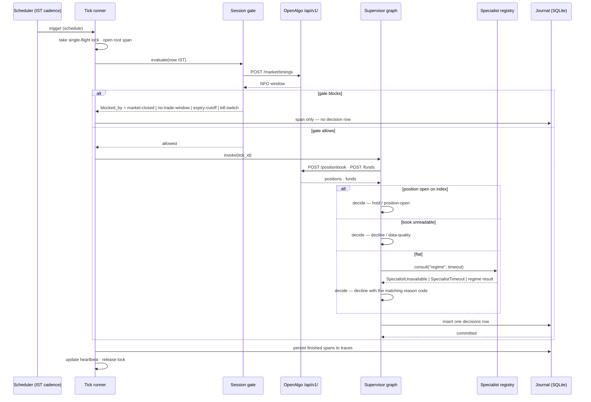

# Iteration 01 — UC-01: Run a decision tick

> **UC-01 — Run a decision tick**
>
> **Why this slice:** UC-01 is the lowest-numbered MVP entry in the use-case catalog and no iteration has been built yet, so it is the next un-built slice by catalog priority order. It is also the one entry every other MVP use case hangs off: the catalog describes UC-02, UC-04 and UC-05 as things that happen *inside a tick*, and UC-10's journal as the thing a tick writes. Building the tick first means the specialists that follow plug into a loop that already runs on a cadence, already gates itself on market hours, already fails closed, and already leaves a trace.
>
> **Actor:** The Supervisor — the top-level agent graph. It runs the rhythm, delegates to specialists, and assembles exactly one decision per trigger. The Trader (Amit) is a secondary actor: he starts and stops the service, throws the kill switch, and reads the journal.
>
> **Preconditions:** A self-hosted OpenAlgo instance is running on the same host with a valid broker session, and an OpenAlgo API key has been generated at `/apikey`. The host clock is set to `Asia/Kolkata`. Python 3.12 and `uv` are installed.
>
> **Depends on:** Nothing already built — this is the first iteration. The Regime Analyst (UC-02) and the Options Strategist (UC-04) register themselves into the specialist registry this slice defines; until they do, the registry is empty and the tick takes its documented degradation path.

![Light one-page poster titled "Iteration 01 — UC-01: Run a decision tick" and subtitled "the foundation loop of Strike Desk — safe, observable, and traceable", opening with five header cards (why this slice, primary actor Supervisor and secondary actor Trader, preconditions of OpenAlgo on the same host with an /apikey key and an Asia/Kolkata clock on Python 3.12 with uv, depends-on nothing already built, and a safety-first card fixing the vocabulary enter/decline/hold with only decline and hold reachable), then a "what this iteration builds" grid of eight tiles beside a green AC-5 safety-property note that the tick holds a read-only OpenAlgo client with no order-placement path, a ten-step numbered tick cycle running service start → scheduler fires → session gate → plan (read book, book is FLAT) → consult specialist → specialist unavailable → decide via decision table → persist → trace &amp; complete → result DECLINE, and closing panels on decision outcomes, seven key protections, a high-level architecture box wiring read-only OpenAlgo, an IST-cadence scheduler and a pluggable specialist registry into the Strike Desk service over append-only SQLite journal and traces, observability, env settings (INDEX, DECISION_INTERVAL_MINUTES default 15, SPECIALIST_TIMEOUT_SEC, NO_TRADE_WINDOWS 09:15–09:25, EXPIRY_CUTOFF_TIME 15:15), four `strike-desk` CLI commands and six acceptance checkmarks.](images/Amit-openalgo-itr-1-image-2.png)

## 1. What this iteration builds

This iteration builds exactly one thing: the Strike Desk service process and the supervisor decision tick inside it, end to end and production-ready. That means a long-running Python service, supervised by systemd, that wakes on a configurable cadence through NIFTY market hours; decides whether it is allowed to tick at all; reads the book from OpenAlgo; consults the registered specialists under a hard timeout; assembles exactly one decision from a complete, explicit decision table; writes that decision to an append-only SQLite journal; and emits an OpenTelemetry span for every step of the loop into an append-only `traces` table. It ships with a kill switch, a single-flight guard so two ticks never run over the same book, an on-demand "evaluate now" trigger, and a CLI to inspect what the desk has been deciding.

The tick's outcome vocabulary is `enter`, `decline` and `hold`. Two of those three are reachable in this slice — `decline` and `hold` — because `enter` requires a contract proposal and a risk verdict, and those arrive with their own use cases. That is not a gap papered over: it is the single most important safety property of this iteration, stated as acceptance criterion AC-5 and enforced structurally, because the read-only OpenAlgo client the tick holds has no order-placement path in it at all.

The Regime Analyst is *consulted*, not built. The supervisor asks the specialist registry for the `regime` role and, when UC-02 registers a real analyst, the same code path carries its label, confidence and evidence into the decision. Today the registry is empty, so every flat-book tick resolves to a journalled decline with reason code `specialist-unavailable` — which is precisely the "a failed specialist never results in an entry" behaviour the catalog demands of UC-01, running for real rather than described.

## 2. Main success scenario

1. systemd starts `strike-desk`. The service loads its configuration from the environment, opens one shared HTTP client against OpenAlgo, opens the journal database, creates the schema and its append-only triggers if absent, loads the prompt registry and computes the prompt-set version, installs the tracing provider, writes its PID file, and starts the scheduler on the configured IST cadence.
2. The scheduler fires. The tick runner takes the single-flight lock and opens a root span, `strike_desk.tick`, stamped with a fresh `tick_id`, the trigger source (`schedule`), and the configured index.
3. The session gate evaluates: kill switch not engaged, the NFO trading window for today contains the current IST time, the current time falls in no configured no-trade window, and if today is an expiry day the expiry cutoff has not passed. The gate allows the tick.
4. The supervisor graph runs its `plan` node: it reads the position book and funds from OpenAlgo, filters positions down to the configured index on the configured option exchange, counts the decisions already journalled today, and assembles a `BookState` snapshot. The book is flat.
5. Because the book is flat, the graph routes to `consult`, which asks the specialist registry for the `regime` role under the specialist timeout budget.
6. No `regime` specialist is registered, so the registry raises `SpecialistUnavailable`. The `consult` node records the missing role on its span and hands control on rather than raising further.
7. The `decide` node applies the decision table: a missing specialist yields outcome `decline`, reason code `specialist-unavailable`, and a deterministic one-line reason naming the role that was missing.
8. The `persist` node writes one row to `decisions`, carrying the tick id, the root span's trace id, the IST trading day, the trigger, the book-state snapshot, the outcome, both reasons, the prompt-set version, the model version (`none`, because no model was called), the token cost (zero), the measured latency, and whether every span persisted cleanly.
9. The root span closes and lands in `traces` alongside the children that closed before it. The runner updates the heartbeat file and releases the single-flight lock.

## 3. Alternate flows

**A1 — A position is already open.** When the filtered position book shows a non-zero quantity on the configured index, the `plan` node routes straight past `consult`. No specialist is called, no model is called, and the tick records outcome `hold` with reason code `position-open`. This is the catalog's management-only tick: the desk manages what it holds and does not stack a second entry on top of it.

**A2 — The tick is triggered on demand.** Sending `SIGUSR1` to the running service — which the `strike-desk tick-now` CLI does by reading the PID file — runs one tick immediately with trigger `manual`. It passes through the identical gate, graph and journal path as a scheduled tick, so an on-demand evaluation can never take a shortcut a scheduled one would not.

**A3 — The gate blocks the tick.** Outside the NFO trading window, on a market holiday, inside a no-trade window, after the expiry-day cutoff, or with the kill switch engaged, no tick runs at all. Zero decision rows are written; a single root span is emitted carrying `tick.skipped = true` and the name of the gate that blocked it. The heartbeat still updates, so a quiet desk is visibly alive rather than indistinguishable from a dead one.

**A4 — A specialist answers.** When a `regime` specialist is registered and returns a label with a confidence, the supervisor scores it: a label outside the tradeable set declines with `regime-not-tradeable`; a confidence below the configured floor declines with `regime-low-confidence`; a tradeable, confident label still declines with `specialist-unavailable` naming the `strategist` role, because a regime read alone is not an entry. The label and confidence land on the decision row either way, so a regime read is journalled even when it leads nowhere.

## 4. Exception flows

**E1 — OpenAlgo is unreachable or answers with an error.** The client retries transport failures, timeouts, `429`s and `5xx`s with backoff up to the configured retry count, then raises. The `plan` node converts that into outcome `decline` with reason code `data-quality`. The desk never assumes a flat book it could not read — an unreadable book is a reason not to trade, not a licence to.

**E2 — A specialist hangs.** Every consultation runs on a shared thread pool with a hard timeout. On expiry the registry raises `SpecialistTimeout`, the abandoned thread is left to finish and be discarded, and the tick declines with reason code `specialist-timeout`.

**E3 — The tick overruns its budget.** Each node checks the tick deadline before doing work. On overrun the graph short-circuits to a `decline` with reason code `tick-timeout`, which is journalled like any other decision so slow ticks are visible in the record rather than only in the logs.

**E4 — Two triggers overlap.** If a tick is still running when the next fires, the second cannot take the single-flight lock. It emits a root span with `tick.skipped = true` and `gate.blocked_by = overlap`, writes no decision row, and returns. Triggers are skipped, never queued, so the desk never runs two ticks over the same book state.

**E5 — Anything else raises.** The runner catches every unexpected exception from the graph and journals a `decline` with reason code `internal-error`, the exception type on the span, and the traceback in the log. A crashed tick is still a journalled decision.

**E6 — The journal write itself fails.** The tick fails closed: the error propagates, the run is logged at ERROR with the full traceback, and no decision is treated as having been made. An untraceable decision is not allowed to become anything at all — the invariant the catalog attaches to UC-10 is enforced here, at the only place in this slice that writes.

## 5. Agentic and operational behaviour

This slice builds the plan → act → observe loop itself, and runs it with no inference in it. The loop is real: a compiled LangGraph `StateGraph` with a SQLite checkpointer, whose nodes plan (read the book), act (delegate to the registry), observe (score what came back) and assemble one decision. What it does not yet contain is a model call, because both agents that hold one — the Regime Analyst and the Options Strategist — are separate catalog entries. The supervisor calls no market tools of its own beyond the book-state read the architecture assigns it, and the guardrail the catalog names for UC-01 is structural rather than instructed: the tick's OpenAlgo client whitelists four read-only paths, so no code reachable from a tick can place an order.

The operational layer this slice owns is the AgentOps span coverage and the PromptOps stamp. Every step of the loop emits an OpenTelemetry span: a root `strike_desk.tick` carrying the trigger, the trading day and the gate's verdict, and beneath it one span per node — the book-state read with what it found, the consultation with the role asked and the answer's shape, the decision assembly with the outcome and reason code, and the journal write with its measured latency. A custom span processor persists each finished span into the append-only `traces` table keyed by trace id. That table is what makes a session replayable, and because span persistence can fail independently of the tick, each decision row carries a `trace_complete` flag so an incomplete trace is surfaced rather than smoothed over. The PromptOps piece is the prompt registry: prompt artifacts are content-hashed into a single `prompt_set_version` that is stamped on every decision row, so the moment UC-02 adds its first prompt file, every row written after it is distinguishable from every row written before it. Redaction runs over every span attribute and every persisted payload, so the API key never reaches the journal, the trace table or the logs.

## 6. Data touched

Strike Desk owns one SQLite database, separate from OpenAlgo's six, and this slice creates two of the architecture's seven tables. **`decisions`** takes one row per completed tick: `tick_id`, `trace_id`, `created_at_utc`, `trading_day` (IST), `index_symbol`, `trigger`, `outcome`, `reason_code`, `reason_text`, `regime_label`, `regime_confidence`, `book_state_json`, `prompt_set_version`, `model_version`, `token_cost_micros`, `latency_ms`, `trace_complete`, `schema_version`. **`traces`** takes one row per finished span: `trace_id`, `span_id`, `parent_span_id`, `name`, `started_at_utc`, `ended_at_utc`, `duration_ms`, `status`, `attributes_json`. Both carry SQLite triggers that abort any `UPDATE` or `DELETE`. LangGraph's checkpointer writes its own tick state to a separate `checkpoints.sqlite` file, which is working state rather than journal.

Reads go to OpenAlgo over localhost: `POST /api/v1/positionbook` and `POST /api/v1/funds` for the book, `POST /api/v1/market/timings` for the day's NFO trading window, and `POST /api/v1/ping` for the startup health check. No model API is called anywhere in this slice.

## 7. Acceptance criteria

| ID | Criterion |
| --- | --- |
| **AC-1** | A trigger that passes the session gate writes exactly one `decisions` row, populated in every column, with `outcome` in `{decline, hold}` and `reason_code` drawn from the documented set. |
| **AC-2** | A trigger blocked by the gate — market closed, holiday, no-trade window, expiry cutoff passed, or kill switch engaged — writes zero `decisions` rows and emits exactly one root span carrying `tick.skipped = true` and the blocking gate's name. |
| **AC-3** | With a non-zero position on the configured index in the position book, the tick records `hold` / `position-open` and consults no specialist. |
| **AC-4** | With a flat book and no `regime` specialist registered, the tick records `decline` / `specialist-unavailable`. With a registered specialist that exceeds the specialist timeout, it records `decline` / `specialist-timeout`. Neither ever records `enter`. |
| **AC-5** | No order can be placed from tick code: the OpenAlgo client rejects any path outside its read-only whitelist, and no outcome other than `decline` or `hold` is producible by the graph without a registered `strategist` specialist. |
| **AC-6** | While a tick holds the single-flight lock, a second trigger writes zero `decisions` rows and emits a skipped root span with `gate.blocked_by = overlap`. Triggers are skipped, never queued. |
| **AC-7** | Engaging the kill switch causes the next trigger — at most one cadence interval later — to be gate-blocked with `kill-switch`; releasing it restores normal ticking, and both transitions are visible in `strike-desk status`. |
| **AC-8** | A failing `decisions` insert fails the tick closed: the error propagates out of the runner, is logged with its traceback, and no decision is reported as made. |
| **AC-9** | `UPDATE` or `DELETE` against `decisions` or `traces` raises a database error. Corrections are new rows. |
| **AC-10** | Every executed tick persists a connected span tree to `traces` — root `strike_desk.tick` plus a span for each node reached — sharing one `trace_id` that also appears on the decision row; when any span fails to persist, the decision row's `trace_complete` is `false`. |
| **AC-11** | Every `decisions` row carries a non-empty `prompt_set_version` equal to the content hash of the loaded prompt artifacts, and a `model_version` naming every model invoked during the tick (`none` when no model was called). |
| **AC-12** | A tick that exceeds the configured tick budget records `decline` / `tick-timeout`, and every row's `latency_ms` reflects the measured wall-clock duration of the tick. |
| **AC-13** | An OpenAlgo read that fails after its retries records `decline` / `data-quality`; the desk never treats an unreadable book as flat. |
| **AC-14** | The OpenAlgo API key appears in no `decisions` row, no `traces` row and no log line; redaction is applied to every persisted attribute map and every logged payload. |

## 8. The tick, end to end

You build this in `02_implementation_guide.md`, verify it by hand against `03_manual_test_cases.md`, lock it down with the suite in `04_test_automation.md`, and put it on the trading host with `05_deployment_guide.md`.

![Dark-teal schematic of iteration 01's UC-01 decision tick split into three lanes: "input &amp; scheduling" with an IST-cadence stopwatch (e.g. 5 min), an "evaluate now" SIGUSR1 button, a kill-switch padlock and an only-one-tick-at-a-time lock; "the tick loop" running a session gate shield (NFO trading window, no-trade windows, expiry cutoff, kill-switch status blocking on market-closed) into a glowing supervisor graph that reads the book by POST /positionbook and POST /funds and finds BOOK STATE "book is FLAT", consults a specialist registry whose Regime Analyst (UC-02) is marked UNAVAILABLE, resolves a DECISION table of outcome/reason-code rows to DECLINE with reason `specialist-unavailable`, persists an entry to the SQLite journal `decisions` table (tick id, trace id, outcome, reason, latency_ms, trace_complete) and emits OpenTelemetry spans into the `traces` table; and "external systems &amp; safety" showing OpenAlgo behind a read-only whitelist with ordering APIs BLOCKED, plus AgentOps/PromptOps span visualisation, a content-hash prompt registry stamp (prompt_set_version) and logs with secrets redacted.](images/Amit-openalgo-itr-1-image-1.png)
