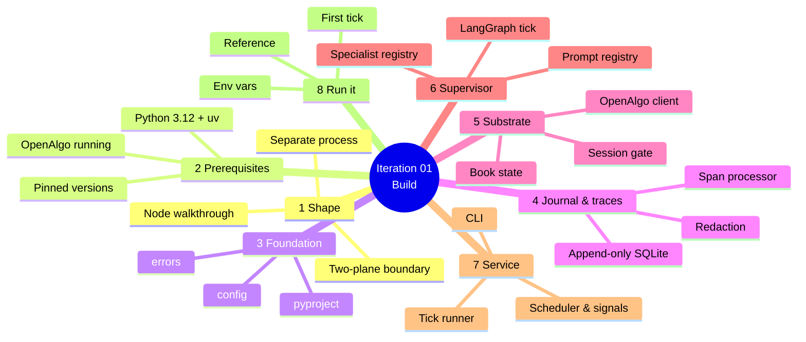
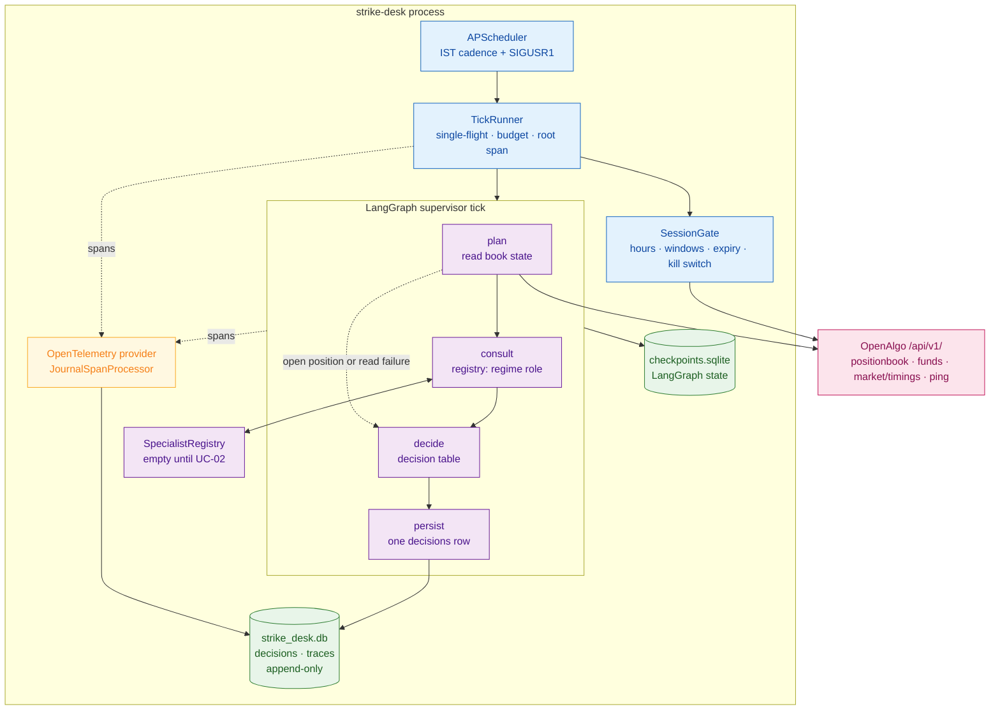

# Iteration 01 — Implementation Guide: the Strike Desk decision tick



You are building the first slice of Strike Desk: a separate Python service that wakes on a cadence through NIFTY market hours and produces exactly one journalled decision per trigger. Everything in `01_use_case.md` — the fourteen acceptance criteria, the decision table, the failure paths — is realised by the code below. Work through the sections in order; each file builds on the ones before it, and by the end of §8 you will have watched the desk take its first tick.

## 1. What you are building, and why it is shaped this way

Strike Desk runs as its own OS process alongside the OpenAlgo Flask app on the same host. It is not a Flask blueprint, because OpenAlgo runs under gunicorn with a single eventlet worker and eventlet monkey-patches the standard library in ways that fight every modern agent framework — and because a hung reasoning call must never be able to take down the process holding the broker session. Strike Desk therefore talks to OpenAlgo the way any other client would: over localhost HTTP to `/api/v1/`, with an API key.

Inside the process there are two planes with different latency contracts. The **reasoning plane** is the supervisor tick — it runs every few minutes, tolerates seconds of latency, and when it fails the correct answer is "do not trade", which is safe. The **control plane** is deterministic code that must keep working when the reasoning plane is dead. This iteration builds the reasoning plane's loop and the parts of the control plane it needs to be safe: the session gate, the single-flight guard, the kill switch, and the append-only journal.

The loop itself is a compiled LangGraph `StateGraph` with four nodes. `plan` reads the book from OpenAlgo. A conditional edge routes a flat book to `consult`, which asks the specialist registry for the `regime` role under a hard timeout, and routes everything else — an open position, an unreadable book — straight to `decide`. `decide` applies one complete decision table and produces an outcome, a machine-readable reason code and a human sentence. `persist` writes the row. Around all four, the runner holds a single-flight lock, opens the root span, and enforces the tick budget.



## 2. Prerequisites and pinned versions

You need Python 3.12 or newer and `uv` (`pip install uv`), a running OpenAlgo instance with a live broker session, and an OpenAlgo API key generated at `http://127.0.0.1:5000/apikey`. Set the host timezone to `Asia/Kolkata` — OpenAlgo's market-timings service builds its epoch timestamps from the server's local midnight, so a host on UTC will hand you a trading window shifted by five and a half hours.

Every version below was verified against PyPI and vendor documentation on 2026-07-22 and is pinned exactly, because an agent stack that drifts between your laptop and the trading host is a debugging session you do not want during market hours.

| Package | Pin | Why this version |
| --- | --- | --- |
| `langgraph` | `1.2.9` | Current 1.x release; ≥ 1.0.10 is the floor that carries the checkpointer hardening |
| `langgraph-checkpoint-sqlite` | `3.1.0` | Fixes CVE-2025-67644 (SQL injection via metadata filter keys, fixed in 3.0.1) and the chained msgpack deserialisation issue |
| `sqlalchemy` | `2.0.51` | ORM for the journal, `NullPool` on SQLite as the host repo requires |
| `httpx` | `0.28.1` | One shared pooled client for all OpenAlgo calls |
| `pydantic` / `pydantic-settings` | `2.13.4` / `2.14.2` | Typed, environment-driven configuration with `SecretStr` |
| `apscheduler` | `3.11.3` | Thread-based `BackgroundScheduler` with `max_instances=1` |
| `opentelemetry-sdk` | `1.44.0` | Span API and the `SpanProcessor` hook the journal writer plugs into |
| `opentelemetry-exporter-otlp-proto-http` | `1.44.0` | The OTLP/HTTP exporter Langfuse ingests, dormant in the practice posture |

The project tree you are about to create sits at the repository root, beside OpenAlgo's own code, with its own `pyproject.toml` and its own `uv` environment:

```
strike_desk/
├── pyproject.toml
├── .env.example
├── src/strike_desk/
│   ├── __init__.py
│   ├── __main__.py
│   ├── config.py
│   ├── errors.py
│   ├── journal.py
│   ├── observability.py
│   ├── openalgo_client.py
│   ├── book_state.py
│   ├── session.py
│   ├── specialists.py
│   ├── prompt_registry.py
│   ├── graph.py
│   ├── runner.py
│   ├── service.py
│   └── prompts/
│       └── .gitkeep
└── tests/
```

Create it and initialise the environment:

```bash
mkdir -p strike_desk/src/strike_desk/prompts strike_desk/tests
touch strike_desk/src/strike_desk/prompts/.gitkeep
```

## 3. The foundation: project metadata, configuration, errors

### `strike_desk/pyproject.toml`

Declares the pinned dependency set, the console entry point, and the lint/test configuration that CI reuses.

```toml
[project]
name = "strike-desk"
version = "0.1.0"
description = "Agentic options-buying desk on OpenAlgo — supervisor decision tick."
requires-python = ">=3.12"
dependencies = [
    "langgraph==1.2.9",
    "langgraph-checkpoint-sqlite==3.1.0",
    "sqlalchemy==2.0.51",
    "httpx==0.28.1",
    "pydantic==2.13.4",
    "pydantic-settings==2.14.2",
    "apscheduler==3.11.3",
    "opentelemetry-sdk==1.44.0",
    "opentelemetry-exporter-otlp-proto-http==1.44.0",
    "tzdata>=2025.2",
]

[project.scripts]
strike-desk = "strike_desk.__main__:main"

[dependency-groups]
dev = [
    "pytest==9.1.1",
    "pytest-cov==7.1.0",
    "respx==0.23.1",
    "freezegun==1.5.5",
    "ruff==0.15.22",
    "bandit>=1.8",
    "pip-audit>=2.7",
]

[build-system]
requires = ["hatchling"]
build-backend = "hatchling.build"

[tool.hatch.build.targets.wheel]
packages = ["src/strike_desk"]

[tool.ruff]
line-length = 100
target-version = "py312"

[tool.ruff.lint]
select = ["E", "F", "W", "I", "B", "C4", "UP"]

[tool.pytest.ini_options]
testpaths = ["tests"]
addopts = "-q --strict-markers"
filterwarnings = ["error::DeprecationWarning:strike_desk.*"]
```

### `strike_desk/src/strike_desk/__init__.py`

Package marker carrying the version the traces are stamped with.

```python
"""Strike Desk — an agentic options-buying desk built on OpenAlgo."""

__version__ = "0.1.0"
```

### `strike_desk/src/strike_desk/config.py`

Every knob the service has, typed, validated at startup, and sourced only from the environment — no secret ever appears in code or in a committed file.

```python
"""Typed, environment-driven configuration for the Strike Desk service."""

from __future__ import annotations

from datetime import time
from functools import lru_cache
from pathlib import Path
from zoneinfo import ZoneInfo

from pydantic import Field, SecretStr, field_validator
from pydantic_settings import BaseSettings, SettingsConfigDict

IST = ZoneInfo("Asia/Kolkata")

TimeWindow = tuple[time, time]


def parse_windows(raw: str) -> tuple[TimeWindow, ...]:
    """Parse ``"09:15-09:30,15:15-15:30"`` into ordered (start, end) time pairs."""
    windows: list[TimeWindow] = []
    for chunk in (piece.strip() for piece in raw.split(",")):
        if not chunk:
            continue
        start_raw, separator, end_raw = chunk.partition("-")
        if not separator:
            raise ValueError(f"window {chunk!r} must look like HH:MM-HH:MM")
        start = time.fromisoformat(start_raw.strip())
        end = time.fromisoformat(end_raw.strip())
        if start >= end:
            raise ValueError(f"window {chunk!r} must start before it ends")
        windows.append((start, end))
    return tuple(windows)


class Settings(BaseSettings):
    """All runtime configuration, read from ``STRIKE_DESK_*`` environment variables."""

    model_config = SettingsConfigDict(env_prefix="STRIKE_DESK_", extra="forbid")

    # --- OpenAlgo substrate -------------------------------------------------
    openalgo_base_url: str = "http://127.0.0.1:5000"
    openalgo_api_key: SecretStr
    openalgo_timeout_seconds: float = Field(default=5.0, gt=0, le=60)
    openalgo_retries: int = Field(default=2, ge=0, le=5)

    # --- Book ---------------------------------------------------------------
    index_symbol: str = "NIFTY"
    option_exchange: str = "NFO"

    # --- Tick cadence and budgets ------------------------------------------
    tick_interval_seconds: int = Field(default=300, ge=30, le=3600)
    tick_budget_seconds: float = Field(default=20.0, gt=0, le=120)
    specialist_timeout_seconds: float = Field(default=12.0, gt=0, le=60)

    # --- Session gates ------------------------------------------------------
    no_trade_windows: str = "09:15-09:30,15:15-15:30"
    expiry_cutoff: str = "14:00"
    expiry_weekday: int = Field(default=1, ge=0, le=6)  # 0 = Monday; NIFTY weeklies expire Tuesday

    # --- Supervisor policy --------------------------------------------------
    min_regime_confidence: float = Field(default=0.55, ge=0.0, le=1.0)

    # --- Paths --------------------------------------------------------------
    state_dir: Path = Path("/var/lib/strike-desk")
    prompts_dir: Path = Field(default_factory=lambda: Path(__file__).parent / "prompts")

    # --- Observability ------------------------------------------------------
    service_name: str = "strike-desk"
    environment: str = "practice"
    log_level: str = "INFO"
    otlp_endpoint: str | None = None
    otlp_headers: SecretStr | None = None

    @field_validator("no_trade_windows")
    @classmethod
    def _validate_windows(cls, value: str) -> str:
        parse_windows(value)
        return value

    @field_validator("expiry_cutoff")
    @classmethod
    def _validate_cutoff(cls, value: str) -> str:
        time.fromisoformat(value)
        return value

    @field_validator("environment")
    @classmethod
    def _validate_environment(cls, value: str) -> str:
        if value not in {"practice", "production"}:
            raise ValueError("environment must be 'practice' or 'production'")
        return value

    @property
    def no_trade_window_times(self) -> tuple[TimeWindow, ...]:
        return parse_windows(self.no_trade_windows)

    @property
    def expiry_cutoff_time(self) -> time:
        return time.fromisoformat(self.expiry_cutoff)

    @property
    def db_path(self) -> Path:
        return self.state_dir / "strike_desk.db"

    @property
    def checkpoint_path(self) -> Path:
        return self.state_dir / "checkpoints.sqlite"

    @property
    def kill_switch_path(self) -> Path:
        return self.state_dir / "KILL"

    @property
    def heartbeat_path(self) -> Path:
        return self.state_dir / "heartbeat"

    @property
    def pid_path(self) -> Path:
        return self.state_dir / "strike-desk.pid"


@lru_cache(maxsize=1)
def get_settings() -> Settings:
    """Process-wide settings singleton."""
    return Settings()  # type: ignore[call-arg]
```

### `strike_desk/src/strike_desk/errors.py`

One exception hierarchy, so every failure path in the tick maps onto exactly one reason code.

```python
"""Exception taxonomy — every failure the tick can survive has a type here."""

from __future__ import annotations


class StrikeDeskError(Exception):
    """Base class for every error raised inside Strike Desk."""


class OpenAlgoError(StrikeDeskError):
    """A call to OpenAlgo failed, timed out, or answered with an error status."""

    def __init__(self, message: str, status_code: int | None = None) -> None:
        super().__init__(message)
        self.status_code = status_code


class ReadOnlyViolation(StrikeDeskError):
    """Tick code attempted a path outside the read-only whitelist."""

    def __init__(self, path: str) -> None:
        super().__init__(f"path {path!r} is not in the read-only whitelist")
        self.path = path


class BookStateUnavailable(StrikeDeskError):
    """The book could not be read or parsed; the desk must not assume it is flat."""


class SpecialistUnavailable(StrikeDeskError):
    """No usable specialist answered for a role."""

    def __init__(self, role: str, detail: str) -> None:
        super().__init__(f"specialist role {role!r} unavailable: {detail}")
        self.role = role
        self.detail = detail


class SpecialistTimeout(StrikeDeskError):
    """A specialist exceeded its timeout budget."""

    def __init__(self, role: str, detail: str) -> None:
        super().__init__(f"specialist role {role!r} timed out: {detail}")
        self.role = role
        self.detail = detail


class JournalWriteError(StrikeDeskError):
    """The append-only journal could not be written; the tick must fail closed."""


class PromptNotFound(StrikeDeskError):
    """A prompt artifact was requested that the registry does not hold."""
```

## 4. The journal and the trace table

The journal is the system of record, and this is the only place in the slice that writes. Two tables, both append-only, both enforced by SQLite triggers rather than by convention — an audit log you can `UPDATE` is an audit log you can flatter. The engine follows the host project's hard-won SQLite rules: `NullPool` so every operation gets a fresh connection that is closed immediately, WAL journalling so the read-only CLI commands never block the writing daemon, and sessions closed on every path including error paths.

### `strike_desk/src/strike_desk/journal.py`

The append-only decision journal and trace store, with schema, triggers and repository in one module.

```python
"""Append-only SQLite journal: the ``decisions`` and ``traces`` tables."""

from __future__ import annotations

import sqlite3
from collections.abc import Iterator, Sequence
from contextlib import contextmanager
from datetime import datetime
from pathlib import Path
from typing import Any

from sqlalchemy import (
    DDL,
    Boolean,
    DateTime,
    Float,
    Integer,
    String,
    Text,
    create_engine,
    event,
    func,
    select,
)
from sqlalchemy.exc import SQLAlchemyError
from sqlalchemy.orm import DeclarativeBase, Mapped, Session, mapped_column, sessionmaker
from sqlalchemy.pool import NullPool

from .errors import JournalWriteError

SCHEMA_VERSION = 1


class Base(DeclarativeBase):
    """Declarative base for the Strike Desk journal."""


class Decision(Base):
    """One row per completed tick. Never updated, never deleted."""

    __tablename__ = "decisions"

    id: Mapped[int] = mapped_column(Integer, primary_key=True, autoincrement=True)
    tick_id: Mapped[str] = mapped_column(String(36), unique=True, index=True, nullable=False)
    trace_id: Mapped[str] = mapped_column(String(32), index=True, nullable=False)
    created_at_utc: Mapped[datetime] = mapped_column(DateTime(timezone=True), nullable=False)
    trading_day: Mapped[str] = mapped_column(String(10), index=True, nullable=False)
    index_symbol: Mapped[str] = mapped_column(String(32), nullable=False)
    trigger: Mapped[str] = mapped_column(String(16), nullable=False)
    outcome: Mapped[str] = mapped_column(String(16), index=True, nullable=False)
    reason_code: Mapped[str] = mapped_column(String(48), index=True, nullable=False)
    reason_text: Mapped[str] = mapped_column(Text, nullable=False)
    regime_label: Mapped[str | None] = mapped_column(String(32), nullable=True)
    regime_confidence: Mapped[float | None] = mapped_column(Float, nullable=True)
    book_state_json: Mapped[str] = mapped_column(Text, nullable=False)
    prompt_set_version: Mapped[str] = mapped_column(String(32), nullable=False)
    model_version: Mapped[str] = mapped_column(String(128), nullable=False)
    token_cost_micros: Mapped[int] = mapped_column(Integer, nullable=False, default=0)
    latency_ms: Mapped[int] = mapped_column(Integer, nullable=False)
    trace_complete: Mapped[bool] = mapped_column(Boolean, nullable=False, default=True)
    schema_version: Mapped[int] = mapped_column(Integer, nullable=False, default=SCHEMA_VERSION)


class TraceSpan(Base):
    """One row per finished OpenTelemetry span. Never updated, never deleted."""

    __tablename__ = "traces"

    id: Mapped[int] = mapped_column(Integer, primary_key=True, autoincrement=True)
    trace_id: Mapped[str] = mapped_column(String(32), index=True, nullable=False)
    span_id: Mapped[str] = mapped_column(String(16), unique=True, nullable=False)
    parent_span_id: Mapped[str | None] = mapped_column(String(16), nullable=True)
    name: Mapped[str] = mapped_column(String(64), nullable=False)
    started_at_utc: Mapped[datetime] = mapped_column(DateTime(timezone=True), nullable=False)
    ended_at_utc: Mapped[datetime] = mapped_column(DateTime(timezone=True), nullable=False)
    duration_ms: Mapped[int] = mapped_column(Integer, nullable=False)
    status: Mapped[str] = mapped_column(String(16), nullable=False)
    attributes_json: Mapped[str] = mapped_column(Text, nullable=False)


# Append-only enforcement lives in the database, not in application discipline.
for _table in (Decision.__table__, TraceSpan.__table__):
    for _operation in ("UPDATE", "DELETE"):
        event.listen(
            _table,
            "after_create",
            DDL(
                f"CREATE TRIGGER IF NOT EXISTS {_table.name}_no_{_operation.lower()} "
                f"BEFORE {_operation} ON {_table.name} "
                f"BEGIN SELECT RAISE(ABORT, '{_table.name} is append-only'); END;"
            ),
        )


def _configure_connection(dbapi_connection: Any, _record: Any) -> None:
    """Apply the SQLite pragmas an audit journal needs on every fresh connection."""
    if not isinstance(dbapi_connection, sqlite3.Connection):
        return
    cursor = dbapi_connection.cursor()
    try:
        cursor.execute("PRAGMA journal_mode=WAL")
        cursor.execute("PRAGMA busy_timeout=5000")
        cursor.execute("PRAGMA foreign_keys=ON")
        cursor.execute("PRAGMA synchronous=FULL")
    finally:
        cursor.close()


class Journal:
    """Repository over the append-only journal database."""

    def __init__(self, db_path: Path) -> None:
        db_path.parent.mkdir(parents=True, exist_ok=True)
        self._path = db_path
        self._engine = create_engine(f"sqlite:///{db_path}", poolclass=NullPool, future=True)
        event.listen(self._engine, "connect", _configure_connection)
        self._sessionmaker = sessionmaker(bind=self._engine, expire_on_commit=False)

    @property
    def path(self) -> Path:
        return self._path

    def create_schema(self) -> None:
        """Create tables and append-only triggers if they do not already exist."""
        Base.metadata.create_all(self._engine)

    @contextmanager
    def session_scope(self) -> Iterator[Session]:
        """A session that commits on success and is closed on every path."""
        session = self._sessionmaker()
        try:
            yield session
            session.commit()
        except Exception:
            session.rollback()
            raise
        finally:
            session.close()

    def record_decision(self, **fields: Any) -> str:
        """Append one decision row. Raises JournalWriteError so the tick fails closed."""
        try:
            with self.session_scope() as session:
                session.add(Decision(**fields))
        except SQLAlchemyError as exc:
            raise JournalWriteError(f"could not append decision: {exc.__class__.__name__}") from exc
        return str(fields["tick_id"])

    def record_span(self, **fields: Any) -> None:
        """Append one trace span row."""
        try:
            with self.session_scope() as session:
                session.add(TraceSpan(**fields))
        except SQLAlchemyError as exc:
            raise JournalWriteError(f"could not append span: {exc.__class__.__name__}") from exc

    def count_decisions(self, trading_day: str) -> int:
        with self.session_scope() as session:
            statement = select(func.count()).select_from(Decision).where(
                Decision.trading_day == trading_day
            )
            return int(session.execute(statement).scalar_one())

    def list_decisions(self, trading_day: str, limit: int = 100) -> Sequence[Decision]:
        with self.session_scope() as session:
            statement = (
                select(Decision)
                .where(Decision.trading_day == trading_day)
                .order_by(Decision.created_at_utc.desc())
                .limit(limit)
            )
            return list(session.execute(statement).scalars())

    def spans_for_trace(self, trace_id: str) -> Sequence[TraceSpan]:
        with self.session_scope() as session:
            statement = (
                select(TraceSpan)
                .where(TraceSpan.trace_id == trace_id)
                .order_by(TraceSpan.started_at_utc.asc())
            )
            return list(session.execute(statement).scalars())

    def close(self) -> None:
        """Dispose the engine — every connection released, no descriptor left open."""
        self._engine.dispose()
```

### `strike_desk/src/strike_desk/observability.py`

The AgentOps layer: redaction, the span processor that persists finished spans into `traces`, the tracer provider, and a logging filter so nothing secret reaches a log line.

Two decisions inside this file are worth understanding before you read it. First, **redaction is exact-value, not heuristic**: the redactor is built from the actual API-key string, so it replaces that string wherever it appears and never mangles a symbol or a tick id by pattern-matching. Second, **a span-persistence failure must not kill a tick** — it records the trace id as failed, which the `persist` node reads back to set `trace_complete = false` on the decision row. An incomplete trace is surfaced, not smoothed over, and not fatal.

```python
"""Tracing, redaction and logging — the AgentOps layer this slice owns."""

from __future__ import annotations

import json
import logging
from collections.abc import Iterable
from datetime import UTC, datetime
from threading import Lock
from typing import Any

from opentelemetry import trace
from opentelemetry.sdk.resources import Resource
from opentelemetry.sdk.trace import ReadableSpan, SpanProcessor, TracerProvider
from opentelemetry.trace import Tracer

from .config import Settings
from .journal import Journal

logger = logging.getLogger(__name__)

REDACTED = "***redacted***"
SENSITIVE_KEYS = frozenset(
    {"apikey", "api_key", "authorization", "auth", "token", "secret", "password", "pepper"}
)


class Redactor:
    """Removes known secret values and sensitive keys from anything about to be persisted."""

    def __init__(self, secrets: Iterable[str] = ()) -> None:
        self._secrets = tuple(sorted({s for s in secrets if s and len(s) >= 8}, key=len, reverse=True))

    def __call__(self, value: Any) -> Any:
        if isinstance(value, dict):
            return {
                key: REDACTED if str(key).lower() in SENSITIVE_KEYS else self(item)
                for key, item in value.items()
            }
        if isinstance(value, (list, tuple)):
            return [self(item) for item in value]
        if isinstance(value, str):
            cleaned = value
            for secret in self._secrets:
                cleaned = cleaned.replace(secret, REDACTED)
            return cleaned
        return value


class RedactingFilter(logging.Filter):
    """Applies the redactor to every log record before a handler sees it."""

    def __init__(self, redactor: Redactor) -> None:
        super().__init__()
        self._redactor = redactor

    def filter(self, record: logging.LogRecord) -> bool:
        record.msg = self._redactor(record.msg)
        if isinstance(record.args, dict):
            record.args = self._redactor(record.args)
        elif isinstance(record.args, tuple):
            record.args = tuple(self._redactor(arg) for arg in record.args)
        return True


class JournalSpanProcessor(SpanProcessor):
    """Persists every finished span into the append-only ``traces`` table."""

    def __init__(self, journal: Journal, redactor: Redactor) -> None:
        self._journal = journal
        self._redactor = redactor
        self._lock = Lock()
        self._failed_traces: set[str] = set()

    def on_start(self, span: Any, parent_context: Any = None) -> None:  # noqa: D102
        return None

    def on_end(self, span: ReadableSpan) -> None:
        context = span.get_span_context()
        trace_id = format(context.trace_id, "032x")
        start_ns = span.start_time or 0
        end_ns = span.end_time or start_ns
        try:
            self._journal.record_span(
                trace_id=trace_id,
                span_id=format(context.span_id, "016x"),
                parent_span_id=format(span.parent.span_id, "016x") if span.parent else None,
                name=span.name,
                started_at_utc=datetime.fromtimestamp(start_ns / 1e9, tz=UTC),
                ended_at_utc=datetime.fromtimestamp(end_ns / 1e9, tz=UTC),
                duration_ms=int((end_ns - start_ns) / 1e6),
                status=span.status.status_code.name,
                attributes_json=json.dumps(
                    self._redactor(dict(span.attributes or {})), default=str, sort_keys=True
                ),
            )
        except Exception:
            with self._lock:
                self._failed_traces.add(trace_id)
            logger.exception("failed to persist span %s of trace %s", span.name, trace_id)

    def had_failure(self, trace_id: str) -> bool:
        with self._lock:
            return trace_id in self._failed_traces

    def forget(self, trace_id: str) -> None:
        with self._lock:
            self._failed_traces.discard(trace_id)

    def shutdown(self) -> None:
        return None

    def force_flush(self, timeout_millis: int = 30_000) -> bool:
        return True


def configure_logging(settings: Settings, redactor: Redactor) -> None:
    """Root logging to stderr (journald captures it), with redaction on every record."""
    handler = logging.StreamHandler()
    handler.setFormatter(
        logging.Formatter("%(asctime)s %(levelname)s %(name)s: %(message)s")
    )
    handler.addFilter(RedactingFilter(redactor))
    root = logging.getLogger()
    root.handlers.clear()
    root.addHandler(handler)
    root.setLevel(settings.log_level.upper())


def _parse_otlp_headers(raw: str | None) -> dict[str, str]:
    headers: dict[str, str] = {}
    for chunk in (piece.strip() for piece in (raw or "").split(",")):
        if not chunk:
            continue
        key, separator, value = chunk.partition("=")
        if separator:
            headers[key.strip()] = value.strip()
    return headers


def configure_tracing(
    settings: Settings, journal: Journal, redactor: Redactor
) -> tuple[TracerProvider, JournalSpanProcessor]:
    """Install the tracer provider. The journal sink always runs; OTLP export is optional."""
    from . import __version__

    resource = Resource.create(
        {
            "service.name": settings.service_name,
            "service.version": __version__,
            "deployment.environment.name": settings.environment,
        }
    )
    provider = TracerProvider(resource=resource)
    journal_processor = JournalSpanProcessor(journal, redactor)
    provider.add_span_processor(journal_processor)

    if settings.otlp_endpoint:
        from opentelemetry.exporter.otlp.proto.http.trace_exporter import OTLPSpanExporter
        from opentelemetry.sdk.trace.export import BatchSpanProcessor

        exporter = OTLPSpanExporter(
            endpoint=settings.otlp_endpoint,
            headers=_parse_otlp_headers(
                settings.otlp_headers.get_secret_value() if settings.otlp_headers else None
            ),
        )
        provider.add_span_processor(BatchSpanProcessor(exporter))
        logger.info("OTLP span export enabled to %s", settings.otlp_endpoint)

    trace.set_tracer_provider(provider)
    return provider, journal_processor


def get_tracer() -> Tracer:
    return trace.get_tracer("strike_desk")
```

## 5. The substrate: OpenAlgo client, book state, session gate

### `strike_desk/src/strike_desk/openalgo_client.py`

One shared, pooled HTTP client over OpenAlgo's `/api/v1/`, restricted by construction to four read-only paths.

The whitelist is the structural half of AC-5. A prompt instruction not to place orders is a suggestion; a client that raises `ReadOnlyViolation` on any path outside `READ_ONLY_PATHS` is a guarantee, and it is the one the guardrail test in `04_test_automation.md` asserts. Note also that error messages never carry the request body — the body contains the API key, and an exception string has a way of ending up in a log.

```python
"""Read-only HTTP client for OpenAlgo's /api/v1/ surface."""

from __future__ import annotations

import logging
import time
from datetime import date
from typing import Any

import httpx

from .config import Settings
from .errors import OpenAlgoError, ReadOnlyViolation

logger = logging.getLogger(__name__)

READ_ONLY_PATHS = frozenset(
    {
        "/api/v1/ping",
        "/api/v1/funds",
        "/api/v1/positionbook",
        "/api/v1/market/timings",
    }
)

RETRYABLE_STATUS = frozenset({429, 500, 502, 503, 504})


class OpenAlgoClient:
    """A single pooled client for the process. Never instantiate one per call."""

    def __init__(self, settings: Settings) -> None:
        self._settings = settings
        self._api_key = settings.openalgo_api_key.get_secret_value()
        self._client = httpx.Client(
            base_url=settings.openalgo_base_url.rstrip("/"),
            timeout=httpx.Timeout(settings.openalgo_timeout_seconds),
            limits=httpx.Limits(max_connections=4, max_keepalive_connections=2),
            headers={"User-Agent": "strike-desk/0.1"},
        )

    def close(self) -> None:
        self._client.close()

    @staticmethod
    def _backoff_seconds(attempt: int) -> float:
        return min(0.25 * (2**attempt), 2.0)

    def _post(self, path: str, payload: dict[str, Any] | None = None) -> dict[str, Any]:
        if path not in READ_ONLY_PATHS:
            raise ReadOnlyViolation(path)

        body: dict[str, Any] = dict(payload or {})
        body["apikey"] = self._api_key
        last_error: OpenAlgoError | None = None

        for attempt in range(self._settings.openalgo_retries + 1):
            try:
                response = self._client.post(path, json=body)
            except httpx.HTTPError as exc:
                last_error = OpenAlgoError(f"{path}: transport failure {type(exc).__name__}")
            else:
                if response.status_code in RETRYABLE_STATUS:
                    last_error = OpenAlgoError(
                        f"{path}: HTTP {response.status_code}", status_code=response.status_code
                    )
                elif response.status_code != 200:
                    raise OpenAlgoError(
                        f"{path}: HTTP {response.status_code}", status_code=response.status_code
                    )
                else:
                    try:
                        parsed = response.json()
                    except ValueError as exc:
                        raise OpenAlgoError(f"{path}: response body was not JSON") from exc
                    if not isinstance(parsed, dict):
                        raise OpenAlgoError(f"{path}: response was not a JSON object")
                    if parsed.get("status") != "success":
                        raise OpenAlgoError(
                            f"{path}: status={parsed.get('status')!r} "
                            f"message={str(parsed.get('message'))[:200]!r}"
                        )
                    return parsed

            if attempt < self._settings.openalgo_retries:
                delay = self._backoff_seconds(attempt)
                logger.warning("%s failed (attempt %d), retrying in %.2fs", path, attempt + 1, delay)
                time.sleep(delay)

        raise last_error or OpenAlgoError(f"{path}: exhausted retries")

    def ping(self) -> dict[str, Any]:
        """Startup health check: proves OpenAlgo is up and the API key is valid."""
        return self._post("/api/v1/ping")

    def funds(self) -> dict[str, Any]:
        data = self._post("/api/v1/funds").get("data")
        if not isinstance(data, dict):
            raise OpenAlgoError("/api/v1/funds: 'data' was not an object")
        return data

    def positionbook(self) -> list[dict[str, Any]]:
        data = self._post("/api/v1/positionbook").get("data") or []
        if not isinstance(data, list):
            raise OpenAlgoError("/api/v1/positionbook: 'data' was not a list")
        return data

    def market_timings(self, day: date) -> list[dict[str, Any]]:
        data = self._post("/api/v1/market/timings", {"date": day.isoformat()}).get("data") or []
        if not isinstance(data, list):
            raise OpenAlgoError("/api/v1/market/timings: 'data' was not a list")
        return data
```

### `strike_desk/src/strike_desk/book_state.py`

Turns the position book and funds response into the immutable snapshot the tick reasons over and the journal stores.

Every numeric field arrives from OpenAlgo as a formatted string, so parsing is explicit and a parse failure raises `BookStateUnavailable` rather than silently becoming zero. A book you cannot parse is a book you have not read.

```python
"""The book-state snapshot: what the desk holds and what it can deploy, right now."""

from __future__ import annotations

from dataclasses import asdict, dataclass
from datetime import datetime
from typing import Any

from .config import Settings
from .errors import BookStateUnavailable, OpenAlgoError
from .journal import Journal
from .openalgo_client import OpenAlgoClient


@dataclass(frozen=True)
class OpenPosition:
    symbol: str
    exchange: str
    product: str
    quantity: int
    average_price: float
    ltp: float
    pnl: float


@dataclass(frozen=True)
class BookState:
    captured_at_utc: datetime
    flat: bool
    open_positions: tuple[OpenPosition, ...]
    available_cash: float
    utilised_margin: float
    realised_pnl: float
    unrealised_pnl: float
    decisions_today: int

    def as_dict(self) -> dict[str, Any]:
        payload = asdict(self)
        payload["captured_at_utc"] = self.captured_at_utc.isoformat()
        payload["open_positions"] = [asdict(position) for position in self.open_positions]
        return payload


def _as_float(value: Any, field: str) -> float:
    try:
        return float(str(value).replace(",", "").strip() or 0.0)
    except (TypeError, ValueError) as exc:
        raise BookStateUnavailable(f"field {field!r} was not numeric: {value!r}") from exc


def _as_int(value: Any, field: str) -> int:
    try:
        return int(float(str(value).replace(",", "").strip() or 0))
    except (TypeError, ValueError) as exc:
        raise BookStateUnavailable(f"field {field!r} was not an integer: {value!r}") from exc


def read_book_state(
    client: OpenAlgoClient,
    journal: Journal,
    settings: Settings,
    trading_day: str,
    now_utc: datetime,
) -> BookState:
    """Read positions and funds from OpenAlgo and fold them into one snapshot."""
    try:
        raw_positions = client.positionbook()
        raw_funds = client.funds()
    except OpenAlgoError as exc:
        raise BookStateUnavailable(str(exc)) from exc

    index = settings.index_symbol.upper()
    exchange = settings.option_exchange.upper()
    positions: list[OpenPosition] = []

    for row in raw_positions:
        if not isinstance(row, dict):
            raise BookStateUnavailable("position book contained a non-object row")
        symbol = str(row.get("symbol", "")).upper()
        if str(row.get("exchange", "")).upper() != exchange or not symbol.startswith(index):
            continue
        quantity = _as_int(row.get("quantity", 0), "quantity")
        if quantity == 0:
            continue
        positions.append(
            OpenPosition(
                symbol=symbol,
                exchange=exchange,
                product=str(row.get("product", "")),
                quantity=quantity,
                average_price=_as_float(row.get("average_price", 0), "average_price"),
                ltp=_as_float(row.get("ltp", 0), "ltp"),
                pnl=_as_float(row.get("pnl", 0), "pnl"),
            )
        )

    return BookState(
        captured_at_utc=now_utc,
        flat=not positions,
        open_positions=tuple(positions),
        available_cash=_as_float(raw_funds.get("availablecash", 0), "availablecash"),
        utilised_margin=_as_float(raw_funds.get("utiliseddebits", 0), "utiliseddebits"),
        realised_pnl=_as_float(raw_funds.get("m2mrealized", 0), "m2mrealized"),
        unrealised_pnl=_as_float(raw_funds.get("m2munrealized", 0), "m2munrealized"),
        decisions_today=journal.count_decisions(trading_day),
    )
```

### `strike_desk/src/strike_desk/session.py`

Decides whether a tick may run at all, in a fixed order: kill switch, then the exchange's own trading window, then the configured no-trade windows, then the expiry-day cutoff.

The trading window comes from OpenAlgo's market-timings service rather than a hardcoded 09:15–15:30, so holidays, settlement holidays and special sessions such as Muhurat trading are honoured for free — an empty NFO entry for a date simply means the desk does not tick. Expiry resolution is real logic, not a weekday check: NIFTY weeklies expire on Tuesday, and when that Tuesday is a holiday the contract expires on the previous trading day, so the gate walks backwards from the configured weekday until it lands on a day the exchange is open. Timings are cached per date and the cache is pruned, because a gate that hits the network on every check is a gate that fails when the network does.

```python
"""The session gate: may this tick run at all?"""

from __future__ import annotations

import logging
from dataclasses import dataclass
from datetime import date, datetime, timedelta

from .config import IST, Settings
from .errors import OpenAlgoError
from .openalgo_client import OpenAlgoClient

logger = logging.getLogger(__name__)

KILL_SWITCH = "kill-switch"
MARKET_CLOSED = "market-closed"
NO_TRADE_WINDOW = "no-trade-window"
EXPIRY_CUTOFF = "expiry-cutoff"
CALENDAR_UNAVAILABLE = "calendar-unavailable"
OVERLAP = "overlap"

_CACHE_LIMIT = 14


@dataclass(frozen=True)
class GateVerdict:
    allowed: bool
    blocked_by: str | None = None
    detail: str = ""


class SessionGate:
    """Evaluates every precondition that must hold before a tick runs."""

    def __init__(self, client: OpenAlgoClient, settings: Settings) -> None:
        self._client = client
        self._settings = settings
        self._windows: dict[date, tuple[datetime, datetime] | None] = {}

    def trading_window(self, day: date) -> tuple[datetime, datetime] | None:
        """The configured exchange's IST open/close for ``day``, or None if closed."""
        if day in self._windows:
            return self._windows[day]

        window: tuple[datetime, datetime] | None = None
        exchange = self._settings.option_exchange.upper()
        for row in self._client.market_timings(day):
            if not isinstance(row, dict) or str(row.get("exchange", "")).upper() != exchange:
                continue
            start = datetime.fromtimestamp(int(row["start_time"]) / 1000, tz=IST)
            end = datetime.fromtimestamp(int(row["end_time"]) / 1000, tz=IST)
            window = (start, end)
            break

        if len(self._windows) >= _CACHE_LIMIT:
            self._windows.pop(next(iter(self._windows)))
        self._windows[day] = window
        return window

    def is_trading_day(self, day: date) -> bool:
        return self.trading_window(day) is not None

    def expiry_date_for(self, day: date) -> date | None:
        """The expiry date of the weekly contract covering ``day``.

        Walks forward to the configured expiry weekday, then backwards over holidays
        to the last day the exchange is actually open.
        """
        offset = (self._settings.expiry_weekday - day.weekday()) % 7
        candidate = day + timedelta(days=offset)
        for _ in range(7):
            if self.is_trading_day(candidate):
                return candidate
            candidate -= timedelta(days=1)
        return None

    def evaluate(self, now: datetime) -> GateVerdict:
        """Apply every gate in order and return the first one that blocks."""
        kill_path = self._settings.kill_switch_path
        if kill_path.exists():
            try:
                detail = kill_path.read_text(encoding="utf-8").strip()[:200]
            except OSError:
                detail = ""
            return GateVerdict(False, KILL_SWITCH, detail or "kill switch engaged")

        try:
            window = self.trading_window(now.date())
            expiry = self.expiry_date_for(now.date())
        except OpenAlgoError as exc:
            logger.error("session calendar unavailable: %s", exc)
            return GateVerdict(False, CALENDAR_UNAVAILABLE, str(exc))

        if window is None:
            return GateVerdict(
                False, MARKET_CLOSED, f"{self._settings.option_exchange} is closed on {now.date()}"
            )
        start, end = window
        if not (start <= now <= end):
            return GateVerdict(
                False,
                MARKET_CLOSED,
                f"{now.time().isoformat(timespec='seconds')} is outside "
                f"{start.time().isoformat(timespec='minutes')}–"
                f"{end.time().isoformat(timespec='minutes')}",
            )

        for window_start, window_end in self._settings.no_trade_window_times:
            if window_start <= now.time() < window_end:
                return GateVerdict(
                    False,
                    NO_TRADE_WINDOW,
                    f"inside {window_start.isoformat(timespec='minutes')}–"
                    f"{window_end.isoformat(timespec='minutes')}",
                )

        if expiry == now.date() and now.time() >= self._settings.expiry_cutoff_time:
            return GateVerdict(
                False,
                EXPIRY_CUTOFF,
                f"expiry day, past {self._settings.expiry_cutoff_time.isoformat(timespec='minutes')}",
            )

        return GateVerdict(True)
```

## 6. The supervisor: registry, prompts, graph

### `strike_desk/src/strike_desk/specialists.py`

The delegation port. Every specialist the supervisor will ever consult implements one protocol and is reached through one registry with one hard timeout.

The timeout runs on a module-level thread pool shared by the whole process — never a pool per call, because an executor is a bundle of file descriptors and threads and creating one per tick is exactly the accumulation the host project warns about. When a specialist overruns, the future is abandoned and its thread left to finish and be discarded; the tick does not wait for it. A specialist that raises, or returns something malformed, is treated as unavailable — the supervisor's job is to keep the desk safe, not to interpret a broken answer.

```python
"""The specialist port: one protocol, one registry, one hard timeout."""

from __future__ import annotations

import logging
from concurrent.futures import ThreadPoolExecutor
from concurrent.futures import TimeoutError as FuturesTimeout
from dataclasses import dataclass, field
from datetime import datetime
from threading import Lock
from typing import Any, Protocol, runtime_checkable

from .errors import SpecialistTimeout, SpecialistUnavailable

logger = logging.getLogger(__name__)

ROLE_REGIME = "regime"
ROLE_STRATEGIST = "strategist"

_executor: ThreadPoolExecutor | None = None
_executor_lock = Lock()


def get_executor() -> ThreadPoolExecutor:
    """The process-wide specialist executor. One pool, created once."""
    global _executor
    with _executor_lock:
        if _executor is None:
            _executor = ThreadPoolExecutor(max_workers=2, thread_name_prefix="specialist")
        return _executor


def shutdown_executor() -> None:
    """Release the pool's threads on service shutdown."""
    global _executor
    with _executor_lock:
        if _executor is not None:
            _executor.shutdown(wait=False, cancel_futures=True)
            _executor = None


@dataclass(frozen=True)
class SpecialistRequest:
    tick_id: str
    index_symbol: str
    as_of: datetime
    book: dict[str, Any]


@dataclass(frozen=True)
class SpecialistResult:
    role: str
    payload: dict[str, Any] = field(default_factory=dict)
    model_version: str | None = None
    prompt_version: str | None = None
    token_cost_micros: int = 0


@runtime_checkable
class Specialist(Protocol):
    """What every agent the supervisor delegates to must implement."""

    role: str

    def run(self, request: SpecialistRequest) -> SpecialistResult: ...


class SpecialistRegistry:
    """Holds the specialists available to the supervisor this session."""

    def __init__(self) -> None:
        self._specialists: dict[str, Specialist] = {}
        self._lock = Lock()

    def register(self, specialist: Specialist) -> None:
        role = getattr(specialist, "role", "")
        if not role:
            raise ValueError("a specialist must declare a non-empty role")
        with self._lock:
            self._specialists[role] = specialist
        logger.info("registered specialist for role %r", role)

    def registered_roles(self) -> tuple[str, ...]:
        with self._lock:
            return tuple(sorted(self._specialists))

    def consult(
        self, role: str, request: SpecialistRequest, timeout_seconds: float
    ) -> SpecialistResult:
        """Run one specialist under a hard timeout. Never returns a partial answer."""
        with self._lock:
            specialist = self._specialists.get(role)
        if specialist is None:
            raise SpecialistUnavailable(role, "no specialist registered for this role")

        future = get_executor().submit(specialist.run, request)
        try:
            result = future.result(timeout=timeout_seconds)
        except FuturesTimeout as exc:
            future.cancel()
            raise SpecialistTimeout(role, f"exceeded {timeout_seconds:.1f}s") from exc
        except Exception as exc:
            raise SpecialistUnavailable(role, f"raised {type(exc).__name__}") from exc

        if not isinstance(result, SpecialistResult) or result.role != role:
            raise SpecialistUnavailable(role, "returned a malformed result")
        return result
```

### `strike_desk/src/strike_desk/prompt_registry.py`

The PromptOps layer: prompt artifacts are files with a version header, and the whole set collapses to one content hash that gets stamped on every decision row.

The registry is empty today and its set version is the hash of the empty set. That is not a placeholder — it is the correct value, and the moment a prompt file lands in `prompts/`, every decision written afterwards carries a different `prompt_set_version` than every decision written before it. That is what makes a traced output tie to the exact prompt behind it.

```python
"""PromptOps: versioned prompt artifacts, collapsed to one stamped set version."""

from __future__ import annotations

import hashlib
import logging
import re
from dataclasses import dataclass
from pathlib import Path

from .errors import PromptNotFound

logger = logging.getLogger(__name__)

_FRONT_MATTER = re.compile(r"\A---\s*\n(?P<body>.*?)\n---\s*\n", re.DOTALL)


@dataclass(frozen=True)
class PromptArtifact:
    name: str
    version: str
    content: str
    digest: str


def _parse(path: Path) -> PromptArtifact:
    raw = path.read_text(encoding="utf-8")
    match = _FRONT_MATTER.match(raw)
    version = "v0"
    body = raw
    if match:
        for line in match.group("body").splitlines():
            key, separator, value = line.partition(":")
            if separator and key.strip() == "version":
                version = value.strip() or "v0"
        body = raw[match.end() :]
    digest = hashlib.sha256(body.encode("utf-8")).hexdigest()
    return PromptArtifact(name=path.stem, version=version, content=body, digest=digest)


class PromptRegistry:
    """Immutable view of the prompt artifacts loaded at startup."""

    def __init__(self, artifacts: dict[str, PromptArtifact]) -> None:
        self._artifacts = dict(artifacts)
        fingerprint = "\n".join(
            f"{name}:{artifact.version}:{artifact.digest}"
            for name, artifact in sorted(self._artifacts.items())
        )
        self._set_version = "ps-" + hashlib.sha256(fingerprint.encode("utf-8")).hexdigest()[:12]

    @classmethod
    def load(cls, directory: Path) -> PromptRegistry:
        artifacts: dict[str, PromptArtifact] = {}
        if directory.is_dir():
            for path in sorted(directory.glob("*.md")):
                artifact = _parse(path)
                artifacts[artifact.name] = artifact
        registry = cls(artifacts)
        logger.info(
            "loaded %d prompt artifact(s) from %s as %s",
            len(artifacts),
            directory,
            registry.set_version,
        )
        return registry

    @property
    def set_version(self) -> str:
        return self._set_version

    def names(self) -> tuple[str, ...]:
        return tuple(sorted(self._artifacts))

    def get(self, name: str) -> PromptArtifact:
        try:
            return self._artifacts[name]
        except KeyError as exc:
            raise PromptNotFound(f"no prompt artifact named {name!r}") from exc

    def __len__(self) -> int:
        return len(self._artifacts)
```

### `strike_desk/src/strike_desk/graph.py`

The supervisor tick itself: four nodes, one conditional edge, and one complete decision table.

Read `_decide_outcome` closely — it is the heart of the slice and every acceptance criterion about outcomes points at it. The ordering is deliberate: budget first (a slow tick must not then act on stale facts), then an unreadable book, then an open position, then specialist failure, then the regime verdict. The last branch is the one that guarantees AC-5: a tradeable, confident regime is still not an entry, because an entry needs a contract proposal, and the `strategist` role is not registered. When UC-04 registers one, this branch is where its proposal enters — until then it declines, with a sentence that says exactly why.

```python
"""The supervisor decision tick as a LangGraph state graph."""

from __future__ import annotations

import json
import logging
import time
from dataclasses import dataclass
from datetime import UTC, datetime
from typing import Any, TypedDict

from langgraph.graph import END, START, StateGraph
from opentelemetry.trace import Status, StatusCode

from .book_state import read_book_state
from .config import Settings
from .errors import BookStateUnavailable, SpecialistTimeout, SpecialistUnavailable
from .journal import SCHEMA_VERSION, Journal
from .observability import JournalSpanProcessor, get_tracer
from .openalgo_client import OpenAlgoClient
from .prompt_registry import PromptRegistry
from .specialists import (
    ROLE_REGIME,
    ROLE_STRATEGIST,
    SpecialistRegistry,
    SpecialistRequest,
)

logger = logging.getLogger(__name__)

OUTCOME_ENTER = "enter"
OUTCOME_DECLINE = "decline"
OUTCOME_HOLD = "hold"

REASON_POSITION_OPEN = "position-open"
REASON_DATA_QUALITY = "data-quality"
REASON_SPECIALIST_UNAVAILABLE = "specialist-unavailable"
REASON_SPECIALIST_TIMEOUT = "specialist-timeout"
REASON_REGIME_NOT_TRADEABLE = "regime-not-tradeable"
REASON_REGIME_LOW_CONFIDENCE = "regime-low-confidence"
REASON_TICK_TIMEOUT = "tick-timeout"
REASON_INTERNAL_ERROR = "internal-error"

TRADEABLE_REGIMES = frozenset({"trending", "range-bound"})


class TickState(TypedDict, total=False):
    tick_id: str
    trace_id: str
    trigger: str
    trading_day: str
    started_monotonic: float
    deadline_monotonic: float
    book: dict[str, Any] | None
    book_error: str | None
    budget_exceeded: bool
    regime_label: str | None
    regime_confidence: float | None
    specialist_error: dict[str, str] | None
    model_versions: list[str]
    token_cost_micros: int
    outcome: str
    reason_code: str
    reason_text: str


@dataclass
class TickDeps:
    settings: Settings
    client: OpenAlgoClient
    journal: Journal
    registry: SpecialistRegistry
    prompts: PromptRegistry
    span_processor: JournalSpanProcessor
    checkpointer: Any


def _decide_outcome(state: TickState, settings: Settings) -> tuple[str, str, str]:
    """The complete decision table. Returns (outcome, reason_code, reason_text)."""
    if state.get("budget_exceeded"):
        return (
            OUTCOME_DECLINE,
            REASON_TICK_TIMEOUT,
            f"Declined: the tick exceeded its {settings.tick_budget_seconds:.0f}s budget "
            "before a decision could be assembled.",
        )

    book_error = state.get("book_error")
    if book_error:
        return (
            OUTCOME_DECLINE,
            REASON_DATA_QUALITY,
            f"Declined: the book could not be read from OpenAlgo ({book_error}). "
            "An unreadable book is never assumed flat.",
        )

    book = state.get("book") or {}
    positions = book.get("open_positions") or []
    if positions:
        symbols = ", ".join(str(position.get("symbol", "?")) for position in positions)
        return (
            OUTCOME_HOLD,
            REASON_POSITION_OPEN,
            f"Held: {len(positions)} open {settings.index_symbol} position(s) ({symbols}). "
            "This tick manages the book; it does not add to it.",
        )

    error = state.get("specialist_error")
    if error:
        role = error.get("role", "?")
        detail = error.get("detail", "")
        if error.get("kind") == "timeout":
            return (
                OUTCOME_DECLINE,
                REASON_SPECIALIST_TIMEOUT,
                f"Declined: the {role!r} specialist did not answer within its timeout ({detail}).",
            )
        return (
            OUTCOME_DECLINE,
            REASON_SPECIALIST_UNAVAILABLE,
            f"Declined: no usable {role!r} specialist ({detail}).",
        )

    label = state.get("regime_label") or "unknown"
    confidence = state.get("regime_confidence") or 0.0
    if label not in TRADEABLE_REGIMES:
        return (
            OUTCOME_DECLINE,
            REASON_REGIME_NOT_TRADEABLE,
            f"Declined: regime read as {label!r}, which this playbook does not trade.",
        )
    if confidence < settings.min_regime_confidence:
        return (
            OUTCOME_DECLINE,
            REASON_REGIME_LOW_CONFIDENCE,
            f"Declined: regime {label!r} is tradeable but confidence {confidence:.2f} "
            f"is below the {settings.min_regime_confidence:.2f} floor.",
        )
    return (
        OUTCOME_DECLINE,
        REASON_SPECIALIST_UNAVAILABLE,
        f"Declined: regime {label!r} is tradeable at {confidence:.2f} confidence, but no "
        f"{ROLE_STRATEGIST!r} specialist is registered to propose a contract. "
        "A regime read alone is never an entry.",
    )


def build_tick_graph(deps: TickDeps) -> Any:
    """Compile the supervisor tick graph. One compiled graph per process."""
    tracer = get_tracer()

    def _over_budget(state: TickState) -> bool:
        return time.monotonic() >= state["deadline_monotonic"]

    def plan(state: TickState) -> dict[str, Any]:
        with tracer.start_as_current_span("tick.plan") as span:
            span.set_attribute("strike_desk.tick_id", state["tick_id"])
            if _over_budget(state):
                span.set_attribute("tick.budget_exceeded", True)
                return {"budget_exceeded": True}
            try:
                book = read_book_state(
                    deps.client,
                    deps.journal,
                    deps.settings,
                    state["trading_day"],
                    datetime.now(tz=UTC),
                )
            except BookStateUnavailable as exc:
                span.set_attribute("book.error", str(exc))
                span.set_status(Status(StatusCode.ERROR, "book state unavailable"))
                return {"book": None, "book_error": str(exc)}
            span.set_attribute("book.flat", book.flat)
            span.set_attribute("book.open_positions", len(book.open_positions))
            span.set_attribute("book.decisions_today", book.decisions_today)
            span.set_attribute("book.available_cash", book.available_cash)
            return {"book": book.as_dict()}

    def route_after_plan(state: TickState) -> str:
        if state.get("budget_exceeded") or state.get("book_error"):
            return "decide"
        book = state.get("book") or {}
        return "decide" if book.get("open_positions") else "consult"

    def consult(state: TickState) -> dict[str, Any]:
        with tracer.start_as_current_span("tick.consult") as span:
            span.set_attribute("specialist.role", ROLE_REGIME)
            span.set_attribute("specialist.registered_roles", ",".join(deps.registry.registered_roles()))
            if _over_budget(state):
                span.set_attribute("tick.budget_exceeded", True)
                return {"budget_exceeded": True}

            request = SpecialistRequest(
                tick_id=state["tick_id"],
                index_symbol=deps.settings.index_symbol,
                as_of=datetime.now(tz=UTC),
                book=state.get("book") or {},
            )
            try:
                result = deps.registry.consult(
                    ROLE_REGIME, request, deps.settings.specialist_timeout_seconds
                )
            except SpecialistTimeout as exc:
                span.set_attribute("specialist.outcome", "timeout")
                span.set_status(Status(StatusCode.ERROR, "specialist timeout"))
                return {
                    "specialist_error": {
                        "role": exc.role,
                        "kind": "timeout",
                        "detail": exc.detail,
                    }
                }
            except SpecialistUnavailable as exc:
                span.set_attribute("specialist.outcome", "unavailable")
                return {
                    "specialist_error": {
                        "role": exc.role,
                        "kind": "unavailable",
                        "detail": exc.detail,
                    }
                }

            try:
                label = str(result.payload["label"]).strip().lower()
                confidence = float(result.payload["confidence"])
            except (KeyError, TypeError, ValueError):
                span.set_attribute("specialist.outcome", "malformed")
                return {
                    "specialist_error": {
                        "role": ROLE_REGIME,
                        "kind": "unavailable",
                        "detail": "payload lacked a usable label/confidence",
                    }
                }

            span.set_attribute("specialist.outcome", "answered")
            span.set_attribute("regime.label", label)
            span.set_attribute("regime.confidence", confidence)
            return {
                "regime_label": label,
                "regime_confidence": confidence,
                "model_versions": [result.model_version] if result.model_version else [],
                "token_cost_micros": int(result.token_cost_micros),
            }

    def decide(state: TickState) -> dict[str, Any]:
        with tracer.start_as_current_span("tick.decide") as span:
            if _over_budget(state) and not state.get("budget_exceeded"):
                state = {**state, "budget_exceeded": True}
            outcome, reason_code, reason_text = _decide_outcome(state, deps.settings)
            span.set_attribute("decision.outcome", outcome)
            span.set_attribute("decision.reason_code", reason_code)
            return {
                "outcome": outcome,
                "reason_code": reason_code,
                "reason_text": reason_text,
                "budget_exceeded": bool(state.get("budget_exceeded")),
            }

    def persist(state: TickState) -> dict[str, Any]:
        with tracer.start_as_current_span("tick.persist") as span:
            latency_ms = int((time.monotonic() - state["started_monotonic"]) * 1000)
            trace_complete = not deps.span_processor.had_failure(state["trace_id"])
            models = [version for version in (state.get("model_versions") or []) if version]
            deps.journal.record_decision(
                tick_id=state["tick_id"],
                trace_id=state["trace_id"],
                created_at_utc=datetime.now(tz=UTC),
                trading_day=state["trading_day"],
                index_symbol=deps.settings.index_symbol,
                trigger=state["trigger"],
                outcome=state["outcome"],
                reason_code=state["reason_code"],
                reason_text=state["reason_text"],
                regime_label=state.get("regime_label"),
                regime_confidence=state.get("regime_confidence"),
                book_state_json=json.dumps(state.get("book"), default=str, sort_keys=True),
                prompt_set_version=deps.prompts.set_version,
                model_version=",".join(models) if models else "none",
                token_cost_micros=int(state.get("token_cost_micros") or 0),
                latency_ms=latency_ms,
                trace_complete=trace_complete,
                schema_version=SCHEMA_VERSION,
            )
            span.set_attribute("journal.latency_ms", latency_ms)
            span.set_attribute("journal.trace_complete", trace_complete)
            logger.info(
                "tick %s -> %s/%s in %dms",
                state["tick_id"],
                state["outcome"],
                state["reason_code"],
                latency_ms,
            )
            return {}

    builder = StateGraph(TickState)
    builder.add_node("plan", plan)
    builder.add_node("consult", consult)
    builder.add_node("decide", decide)
    builder.add_node("persist", persist)
    builder.add_edge(START, "plan")
    builder.add_conditional_edges(
        "plan", route_after_plan, {"consult": "consult", "decide": "decide"}
    )
    builder.add_edge("consult", "decide")
    builder.add_edge("decide", "persist")
    builder.add_edge("persist", END)
    return builder.compile(checkpointer=deps.checkpointer)
```

## 7. The service: runner, scheduler, CLI

### `strike_desk/src/strike_desk/runner.py`

Wraps the graph in the things that make it safe to run unattended: the single-flight lock, the root span, the session gate, the tick budget, and the fail-closed journal contract.

The lock is non-blocking on purpose. If a tick is still running when the next trigger arrives, the second one records a skipped span and returns — triggers are skipped, never queued, because two ticks reasoning over the same book at once is exactly the race the catalog tells us to avoid. And when the graph raises something unexpected, the runner journals an `internal-error` decline itself: a crashed tick is still a decision that happened, and it belongs in the record.

```python
"""The tick runner: single-flight, gated, budgeted, and fail-closed."""

from __future__ import annotations

import json
import logging
import threading
import time
import uuid
from datetime import UTC, datetime

from opentelemetry.trace import Status, StatusCode

from .config import IST
from .errors import JournalWriteError
from .graph import OUTCOME_DECLINE, REASON_INTERNAL_ERROR, TickDeps, build_tick_graph
from .journal import SCHEMA_VERSION
from .observability import get_tracer
from .session import OVERLAP, SessionGate

logger = logging.getLogger(__name__)


class TickRunner:
    """Runs exactly one decision tick per accepted trigger."""

    def __init__(self, deps: TickDeps, gate: SessionGate) -> None:
        self._deps = deps
        self._gate = gate
        self._graph = build_tick_graph(deps)
        self._lock = threading.Lock()
        self._tracer = get_tracer()

    def run_tick(self, trigger: str) -> str | None:
        """Return the tick id, or None when the trigger was skipped."""
        if not self._lock.acquire(blocking=False):
            self._skipped(trigger, OVERLAP, "a tick was already in flight")
            return None
        try:
            return self._run_locked(trigger)
        finally:
            self._lock.release()
            self._touch_heartbeat()

    def _skipped(self, trigger: str, blocked_by: str, detail: str) -> None:
        with self._tracer.start_as_current_span("strike_desk.tick") as root:
            root.set_attribute("strike_desk.trigger", trigger)
            root.set_attribute("strike_desk.index", self._deps.settings.index_symbol)
            root.set_attribute("tick.skipped", True)
            root.set_attribute("gate.allowed", False)
            root.set_attribute("gate.blocked_by", blocked_by)
            root.set_attribute("gate.detail", detail)
        logger.info("trigger %s skipped: %s (%s)", trigger, blocked_by, detail)

    def _touch_heartbeat(self) -> None:
        try:
            path = self._deps.settings.heartbeat_path
            path.parent.mkdir(parents=True, exist_ok=True)
            path.write_text(datetime.now(tz=UTC).isoformat(), encoding="utf-8")
        except OSError:
            logger.exception("could not update the heartbeat file")

    def _run_locked(self, trigger: str) -> str | None:
        settings = self._deps.settings
        tick_id = str(uuid.uuid4())
        started = time.monotonic()
        now_ist = datetime.now(tz=IST)
        trading_day = now_ist.date().isoformat()

        with self._tracer.start_as_current_span("strike_desk.tick") as root:
            trace_id = format(root.get_span_context().trace_id, "032x")
            root.set_attribute("strike_desk.tick_id", tick_id)
            root.set_attribute("strike_desk.trigger", trigger)
            root.set_attribute("strike_desk.index", settings.index_symbol)
            root.set_attribute("strike_desk.trading_day", trading_day)
            root.set_attribute("strike_desk.prompt_set_version", self._deps.prompts.set_version)

            verdict = self._gate.evaluate(now_ist)
            root.set_attribute("gate.allowed", verdict.allowed)
            if not verdict.allowed:
                root.set_attribute("tick.skipped", True)
                root.set_attribute("gate.blocked_by", verdict.blocked_by or "unknown")
                root.set_attribute("gate.detail", verdict.detail)
                logger.info("tick skipped: %s (%s)", verdict.blocked_by, verdict.detail)
                return None

            root.set_attribute("tick.skipped", False)
            state = {
                "tick_id": tick_id,
                "trace_id": trace_id,
                "trigger": trigger,
                "trading_day": trading_day,
                "started_monotonic": started,
                "deadline_monotonic": started + settings.tick_budget_seconds,
                "model_versions": [],
                "token_cost_micros": 0,
            }
            config = {"configurable": {"thread_id": tick_id}, "recursion_limit": 12}

            try:
                final = self._graph.invoke(state, config)
            except JournalWriteError:
                root.set_status(Status(StatusCode.ERROR, "journal write failed"))
                logger.exception("tick %s failed closed — journal unwritable", tick_id)
                raise
            except Exception as exc:  # noqa: BLE001 — a crashed tick is still a decision
                root.set_status(Status(StatusCode.ERROR, type(exc).__name__))
                logger.exception("tick %s raised unexpectedly", tick_id)
                self._journal_internal_error(tick_id, trace_id, trigger, trading_day, started, exc)
                return tick_id

            root.set_attribute("decision.outcome", final["outcome"])
            root.set_attribute("decision.reason_code", final["reason_code"])
            self._deps.span_processor.forget(trace_id)
            return tick_id

    def _journal_internal_error(
        self,
        tick_id: str,
        trace_id: str,
        trigger: str,
        trading_day: str,
        started: float,
        exc: BaseException,
    ) -> None:
        self._deps.journal.record_decision(
            tick_id=tick_id,
            trace_id=trace_id,
            created_at_utc=datetime.now(tz=UTC),
            trading_day=trading_day,
            index_symbol=self._deps.settings.index_symbol,
            trigger=trigger,
            outcome=OUTCOME_DECLINE,
            reason_code=REASON_INTERNAL_ERROR,
            reason_text=(
                f"Declined: the tick raised {type(exc).__name__} before assembling a decision. "
                "The desk stays out when it cannot reason."
            ),
            regime_label=None,
            regime_confidence=None,
            book_state_json=json.dumps(None),
            prompt_set_version=self._deps.prompts.set_version,
            model_version="none",
            token_cost_micros=0,
            latency_ms=int((time.monotonic() - started) * 1000),
            trace_complete=not self._deps.span_processor.had_failure(trace_id),
            schema_version=SCHEMA_VERSION,
        )
```

### `strike_desk/src/strike_desk/service.py`

Wires every component together, owns the scheduler and the signal handlers, and releases every descriptor on shutdown.

Three details are load-bearing. The service **pings OpenAlgo before scheduling anything**, so a bad API key or a down substrate fails at startup rather than silently declining all day. The scheduler runs `max_instances=1` with `coalesce=True`, which stops APScheduler from piling up missed runs — the single-flight lock is the belt, this is the braces. And a run of consecutive journal-write failures **engages the kill switch automatically**: if the desk cannot record what it decides, the correct behaviour is to stop deciding.

```python
"""Service composition: scheduler, signals, lifecycle."""

from __future__ import annotations

import logging
import os
import signal
import sqlite3
import threading
from datetime import UTC, datetime
from types import FrameType

from apscheduler.schedulers.background import BackgroundScheduler
from apscheduler.triggers.interval import IntervalTrigger
from langgraph.checkpoint.sqlite import SqliteSaver

from .config import IST, Settings
from .errors import JournalWriteError
from .graph import TickDeps
from .journal import Journal
from .observability import Redactor, configure_logging, configure_tracing
from .openalgo_client import OpenAlgoClient
from .prompt_registry import PromptRegistry
from .runner import TickRunner
from .session import SessionGate
from .specialists import SpecialistRegistry, shutdown_executor

logger = logging.getLogger(__name__)

MAX_CONSECUTIVE_JOURNAL_FAILURES = 3


class StrikeDeskService:
    """The long-running desk process."""

    def __init__(self, settings: Settings) -> None:
        self._settings = settings
        settings.state_dir.mkdir(parents=True, exist_ok=True)

        redactor = Redactor([settings.openalgo_api_key.get_secret_value()])
        configure_logging(settings, redactor)

        self._journal = Journal(settings.db_path)
        self._journal.create_schema()
        self._provider, self._span_processor = configure_tracing(settings, self._journal, redactor)

        self._client = OpenAlgoClient(settings)
        self._prompts = PromptRegistry.load(settings.prompts_dir)
        self.registry = SpecialistRegistry()

        self._checkpoint_conn = sqlite3.connect(
            str(settings.checkpoint_path), check_same_thread=False
        )
        checkpointer = SqliteSaver(self._checkpoint_conn)
        checkpointer.setup()

        deps = TickDeps(
            settings=settings,
            client=self._client,
            journal=self._journal,
            registry=self.registry,
            prompts=self._prompts,
            span_processor=self._span_processor,
            checkpointer=checkpointer,
        )
        self._runner = TickRunner(deps, SessionGate(self._client, settings))
        self._scheduler = BackgroundScheduler(timezone=IST)
        self._stop = threading.Event()
        self._manual = threading.Event()
        self._journal_failures = 0

    def _safe_tick(self, trigger: str) -> None:
        """Never let one bad tick kill the daemon — but never let it hide, either."""
        try:
            self._runner.run_tick(trigger)
        except JournalWriteError:
            self._journal_failures += 1
            logger.critical(
                "journal write failed (%d consecutive) — the tick failed closed",
                self._journal_failures,
            )
            if self._journal_failures >= MAX_CONSECUTIVE_JOURNAL_FAILURES:
                self.engage_kill_switch("journal unwritable — desk stopped automatically")
        except Exception:  # noqa: BLE001 — the scheduler thread must survive
            logger.exception("trigger %s failed", trigger)
        else:
            self._journal_failures = 0

    def engage_kill_switch(self, reason: str) -> None:
        self._settings.kill_switch_path.write_text(
            f"{datetime.now(tz=UTC).isoformat()} {reason}", encoding="utf-8"
        )
        logger.critical("kill switch engaged: %s", reason)

    def _handle_stop(self, _signum: int, _frame: FrameType | None) -> None:
        self._stop.set()

    def _handle_manual(self, _signum: int, _frame: FrameType | None) -> None:
        self._manual.set()

    def start(self) -> None:
        self._client.ping()
        logger.info(
            "strike-desk starting: index=%s cadence=%ss prompts=%s roles=%s",
            self._settings.index_symbol,
            self._settings.tick_interval_seconds,
            self._prompts.set_version,
            self.registry.registered_roles() or "(none)",
        )
        self._settings.pid_path.write_text(str(os.getpid()), encoding="utf-8")
        self._scheduler.add_job(
            self._safe_tick,
            IntervalTrigger(seconds=self._settings.tick_interval_seconds),
            args=("schedule",),
            id="decision-tick",
            max_instances=1,
            coalesce=True,
            misfire_grace_time=30,
        )
        self._scheduler.start()
        signal.signal(signal.SIGTERM, self._handle_stop)
        signal.signal(signal.SIGINT, self._handle_stop)
        signal.signal(signal.SIGUSR1, self._handle_manual)

    def run_forever(self) -> None:
        try:
            while not self._stop.is_set():
                if self._manual.wait(timeout=1.0):
                    self._manual.clear()
                    self._safe_tick("manual")
        finally:
            self.shutdown()

    def shutdown(self) -> None:
        logger.info("strike-desk shutting down")
        try:
            self._scheduler.shutdown(wait=True)
        except Exception:  # noqa: BLE001
            logger.exception("scheduler shutdown failed")
        shutdown_executor()
        self._provider.shutdown()
        self._client.close()
        try:
            self._checkpoint_conn.close()
        finally:
            self._journal.close()
        self._settings.pid_path.unlink(missing_ok=True)
```

### `strike_desk/src/strike_desk/__main__.py`

The operator's surface: run the daemon, force a tick, throw or release the kill switch, and read the journal back.

Every subcommand except `run` is a short-lived process that opens the journal read-only-ish and exits, which WAL journalling makes safe against the running daemon. There is no network surface here at all — authorisation is filesystem permissions on the state directory, which is exactly the single-user, self-hosted, server-access-equals-full-control model Strike Desk inherits.

```python
"""Command-line surface for the Strike Desk service."""

from __future__ import annotations

import argparse
import os
import signal
import sys
from datetime import UTC, datetime

from .config import IST, Settings, get_settings
from .journal import Journal
from .prompt_registry import PromptRegistry
from .service import StrikeDeskService


def _today() -> str:
    return datetime.now(tz=IST).date().isoformat()


def _cmd_run(settings: Settings, _args: argparse.Namespace) -> int:
    service = StrikeDeskService(settings)
    service.start()
    service.run_forever()
    return 0


def _cmd_tick_now(settings: Settings, _args: argparse.Namespace) -> int:
    try:
        pid = int(settings.pid_path.read_text(encoding="utf-8").strip())
    except (OSError, ValueError):
        print("strike-desk does not appear to be running (no readable PID file)", file=sys.stderr)
        return 1
    try:
        os.kill(pid, signal.SIGUSR1)
    except OSError as exc:
        print(f"could not signal pid {pid}: {exc}", file=sys.stderr)
        return 1
    print(f"requested an immediate tick from pid {pid}")
    return 0


def _cmd_kill(settings: Settings, args: argparse.Namespace) -> int:
    settings.state_dir.mkdir(parents=True, exist_ok=True)
    settings.kill_switch_path.write_text(
        f"{datetime.now(tz=UTC).isoformat()} {args.reason}", encoding="utf-8"
    )
    print(f"kill switch engaged: {args.reason}")
    return 0


def _cmd_resume(settings: Settings, _args: argparse.Namespace) -> int:
    if settings.kill_switch_path.exists():
        settings.kill_switch_path.unlink()
        print("kill switch released")
    else:
        print("kill switch was not engaged")
    return 0


def _cmd_status(settings: Settings, _args: argparse.Namespace) -> int:
    journal = Journal(settings.db_path)
    try:
        journal.create_schema()
        day = _today()
        decisions = journal.list_decisions(day, limit=1000)
        by_reason: dict[str, int] = {}
        for decision in decisions:
            by_reason[decision.reason_code] = by_reason.get(decision.reason_code, 0) + 1

        killed = settings.kill_switch_path.exists()
        print(f"index            : {settings.index_symbol}")
        print(f"cadence          : {settings.tick_interval_seconds}s")
        print(f"prompt set       : {PromptRegistry.load(settings.prompts_dir).set_version}")
        print(f"kill switch      : {'ENGAGED' if killed else 'released'}")
        if killed:
            print(f"  reason         : {settings.kill_switch_path.read_text(encoding='utf-8').strip()}")
        if settings.heartbeat_path.exists():
            beat = datetime.fromisoformat(settings.heartbeat_path.read_text(encoding="utf-8").strip())
            age = (datetime.now(tz=UTC) - beat).total_seconds()
            print(f"last tick attempt: {beat.isoformat()} ({age:.0f}s ago)")
        else:
            print("last tick attempt: never")
        print(f"decisions {day}: {len(decisions)}")
        for reason, count in sorted(by_reason.items()):
            print(f"  {reason:<26} {count}")
    finally:
        journal.close()
    return 0


def _cmd_journal(settings: Settings, args: argparse.Namespace) -> int:
    journal = Journal(settings.db_path)
    try:
        journal.create_schema()
        day = args.day or _today()
        for decision in journal.list_decisions(day, limit=args.limit):
            flag = "" if decision.trace_complete else "  [TRACE INCOMPLETE]"
            print(
                f"{decision.created_at_utc.isoformat()}  {decision.outcome:<8}"
                f"{decision.reason_code:<26} {decision.latency_ms:>5}ms  "
                f"{decision.trace_id}{flag}"
            )
            print(f"    {decision.reason_text}")
    finally:
        journal.close()
    return 0


def main(argv: list[str] | None = None) -> int:
    parser = argparse.ArgumentParser(prog="strike-desk", description="Strike Desk decision tick")
    subparsers = parser.add_subparsers(dest="command", required=True)

    subparsers.add_parser("run", help="run the desk service in the foreground")
    subparsers.add_parser("tick-now", help="ask the running service for one immediate tick")

    kill_parser = subparsers.add_parser("kill", help="engage the kill switch")
    kill_parser.add_argument("--reason", default="engaged by the trader")

    subparsers.add_parser("resume", help="release the kill switch")
    subparsers.add_parser("status", help="show liveness, kill state and today's decisions")

    journal_parser = subparsers.add_parser("journal", help="print today's decisions")
    journal_parser.add_argument("--day", help="IST trading day as YYYY-MM-DD")
    journal_parser.add_argument("--limit", type=int, default=50)

    args = parser.parse_args(argv)
    settings = get_settings()
    handlers = {
        "run": _cmd_run,
        "tick-now": _cmd_tick_now,
        "kill": _cmd_kill,
        "resume": _cmd_resume,
        "status": _cmd_status,
        "journal": _cmd_journal,
    }
    return handlers[args.command](settings, args)


if __name__ == "__main__":
    raise SystemExit(main())
```

## 8. Environment, first run, and where to go next

### `strike_desk/.env.example`

Commit this; never commit a filled-in `.env`. The API key is the only secret here, and in production it comes from AWS Systems Manager Parameter Store rather than a file — `05_deployment_guide.md` wires that up.

```bash
# --- OpenAlgo substrate ---
STRIKE_DESK_OPENALGO_BASE_URL=http://127.0.0.1:5000
STRIKE_DESK_OPENALGO_API_KEY=replace-me-with-the-key-from-/apikey
STRIKE_DESK_OPENALGO_TIMEOUT_SECONDS=5.0
STRIKE_DESK_OPENALGO_RETRIES=2

# --- Book ---
STRIKE_DESK_INDEX_SYMBOL=NIFTY
STRIKE_DESK_OPTION_EXCHANGE=NFO

# --- Cadence and budgets ---
STRIKE_DESK_TICK_INTERVAL_SECONDS=300
STRIKE_DESK_TICK_BUDGET_SECONDS=20
STRIKE_DESK_SPECIALIST_TIMEOUT_SECONDS=12

# --- Session gates ---
STRIKE_DESK_NO_TRADE_WINDOWS=09:15-09:30,15:15-15:30
STRIKE_DESK_EXPIRY_CUTOFF=14:00
STRIKE_DESK_EXPIRY_WEEKDAY=1

# --- Supervisor policy ---
STRIKE_DESK_MIN_REGIME_CONFIDENCE=0.55

# --- Paths ---
STRIKE_DESK_STATE_DIR=/var/lib/strike-desk

# --- Observability ---
STRIKE_DESK_SERVICE_NAME=strike-desk
STRIKE_DESK_ENVIRONMENT=practice
STRIKE_DESK_LOG_LEVEL=INFO
# Leave the two OTLP variables unset in the practice posture: spans land in the
# journal's traces table and cost nothing. Set them to promote to Langfuse.
# STRIKE_DESK_OTLP_ENDPOINT=http://127.0.0.1:3000/api/public/otel/v1/traces
# STRIKE_DESK_OTLP_HEADERS=Authorization=Basic <base64 of pk-lf-...:sk-lf-...>
```

### First working result

Install the environment and confirm the code is clean:

```bash
cd strike_desk
uv sync
uv run ruff check .
```

Now run it against a local OpenAlgo with a writable state directory of your own, so you do not need root on your laptop:

```bash
export STRIKE_DESK_OPENALGO_API_KEY='<the key from /apikey>'
export STRIKE_DESK_STATE_DIR="$PWD/.state"
export STRIKE_DESK_TICK_INTERVAL_SECONDS=60
uv run strike-desk run
```

You should see a startup line naming the index, the cadence, the prompt-set version (`ps-` followed by twelve hex characters) and `roles=()`. Within a minute the first tick fires. During market hours on a flat book you get `tick <uuid> -> decline/specialist-unavailable in NNms`; outside them you get `tick skipped: market-closed (...)`.

From a second terminal, with the same environment exported, force a tick and read the record back:

```bash
uv run strike-desk tick-now
uv run strike-desk status
uv run strike-desk journal
```

`journal` prints one line per decision plus its sentence. To see the trace behind any of them, take the trace id from that line and query it directly:

```bash
sqlite3 "$STRIKE_DESK_STATE_DIR/strike_desk.db" \
  "SELECT name, duration_ms, status FROM traces WHERE trace_id='<trace-id>' ORDER BY started_at_utc;"
```

You should see `strike_desk.tick` with `tick.plan`, `tick.consult`, `tick.decide` and `tick.persist` beneath it. Confirm the journal really is append-only, which is AC-9 by hand:

```bash
sqlite3 "$STRIKE_DESK_STATE_DIR/strike_desk.db" "UPDATE decisions SET outcome='enter';"
# Error: decisions is append-only
```

Finally, prove the kill switch: `uv run strike-desk kill --reason "testing"`, wait one cadence, and the log shows `tick skipped: kill-switch (...)`; `uv run strike-desk resume` restores normal ticking.

Work the full matrix by hand with `03_manual_test_cases.md`, then install the automated suite from `04_test_automation.md` before you put anything on a host. `05_deployment_guide.md` takes this same code to EC2.

## 9. Reference

| Component | File | Responsibility |
| --- | --- | --- |
| Configuration | `config.py` | Typed env-driven settings, window parsing, derived state paths |
| Errors | `errors.py` | One exception per survivable failure, mapped 1:1 to reason codes |
| Journal | `journal.py` | `decisions` + `traces`, append-only triggers, `NullPool` engine |
| Observability | `observability.py` | Redactor, `JournalSpanProcessor`, tracer provider, logging filter |
| OpenAlgo client | `openalgo_client.py` | Pooled httpx client, retries, read-only path whitelist |
| Book state | `book_state.py` | Positions + funds → immutable snapshot |
| Session gate | `session.py` | Kill switch, trading window, no-trade windows, expiry cutoff |
| Specialists | `specialists.py` | Protocol, registry, shared executor, hard timeout |
| Prompts | `prompt_registry.py` | Versioned artifacts, content-hashed set version |
| Graph | `graph.py` | Four-node tick, routing, the complete decision table |
| Runner | `runner.py` | Single-flight lock, root span, budget, fail-closed journal |
| Service | `service.py` | Composition, scheduler, signals, lifecycle, auto kill switch |
| CLI | `__main__.py` | `run`, `tick-now`, `kill`, `resume`, `status`, `journal` |

| Reason code | Outcome | Raised when |
| --- | --- | --- |
| `position-open` | `hold` | A non-zero position exists on the configured index |
| `data-quality` | `decline` | The book could not be read or parsed after retries |
| `specialist-unavailable` | `decline` | No specialist registered for a needed role, or it errored / answered malformed |
| `specialist-timeout` | `decline` | A specialist exceeded `specialist_timeout_seconds` |
| `regime-not-tradeable` | `decline` | The regime label is outside `TRADEABLE_REGIMES` |
| `regime-low-confidence` | `decline` | The label is tradeable but confidence is below the floor |
| `tick-timeout` | `decline` | The tick exceeded `tick_budget_seconds` |
| `internal-error` | `decline` | The graph raised something the runner did not expect |

## 10. Limitations

The tick makes no model call, so nothing here exercises inference latency, token cost or prompt quality — `token_cost_micros` is always zero and `model_version` is always `none` until a specialist that calls a model registers itself. The specialist timeout abandons an overrunning thread rather than killing it, which is the only option Python gives you; a pathological specialist that never returns will hold one of the two pool workers until the process restarts, and two such specialists would stall consultations. `SqliteSaver` is documented as intended for lightweight synchronous use and is not designed for heavy concurrent access; that is the right fit here because exactly one tick runs at a time, and it is a component to revisit only when concurrency arrives. Finally, the trading window is read from OpenAlgo's market-calendar database, so a stale or unseeded calendar there produces a `calendar-unavailable` gate block rather than a tick — safe, but it means OpenAlgo's calendar must be current for the desk to trade at all.

---
**Sources**

*Repo files:* `030_design/01_use_cases.md` · `030_design/02_prd.md` · `030_design/03_architecture.md` · `030_design/04_tech_stack.md` · `restx_api/__init__.py` · `restx_api/positionbook.py` · `restx_api/funds.py` · `restx_api/data_schemas.py` · `services/positionbook_service.py` · `services/funds_service.py` · `services/market_calendar_service.py` · `database/market_calendar_db.py` · `broker/zerodha/mapping/order_data.py` · `broker/zerodha/api/funds.py` · `CLAUDE.md`

*Web (accessed 2026-07-22):*
- [LangGraph on PyPI — version 1.2.9, Python ≥ 3.10](https://pypi.org/project/langgraph/)
- [LangGraph Graph API — StateGraph, conditional edges, compile, thread_id](https://docs.langchain.com/oss/python/langgraph/graph-api)
- [SqliteSaver reference — construction from a sqlite3.Connection, setup()](https://reference.langchain.com/python/langgraph.checkpoint.sqlite/SqliteSaver)
- [Check Point Research — From SQLi to RCE: exploiting LangGraph's checkpointer](https://research.checkpoint.com/2026/from-sqli-to-rce-exploiting-langgraphs-checkpointer/)
- [CVE-2025-67644 advisory — fixed in langgraph-checkpoint-sqlite 3.0.1](https://github.com/langchain-ai/langgraph/security/advisories/GHSA-9rwj-6rc7-p77c)
- [Langfuse — OpenTelemetry endpoint, Basic auth, OTLP env vars](https://langfuse.com/integrations/native/opentelemetry)
- [NSE weekly expiry moved to Tuesday from 1 September 2025](https://www.sahi.com/blogs/nse-vs-bse-expiry-shake-up-what-traders)
