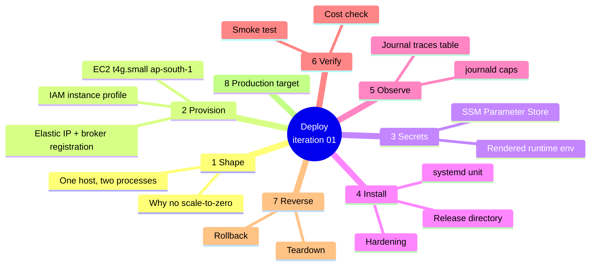
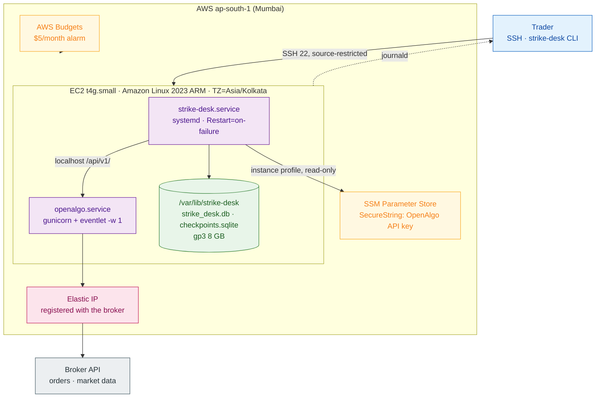

# Iteration 01 — Deployment Guide: the desk on AWS



## 1. What you are standing up

One EC2 instance in `ap-south-1` runs two processes: the OpenAlgo Flask app that already holds the broker session, and the `strike-desk` service you built in `02_implementation_guide.md`. They talk over localhost. The instance holds an Elastic IP registered with the broker, because from 1 April 2026 SEBI requires every transactional API order to originate from a whitelisted static IP.

That single rule is why this deployment has no scale-to-zero posture and never will. A Lambda or a Cloud Run service with `min-instances=0` cannot hold a registered address, so "cheap" here means *the cheapest persistent host that can legally place an order*, not *nothing running when idle*. The practice posture gets the compute to genuinely $0 through the T4g free trial and holds the remaining floor at roughly **$4.30 a month** — the public IPv4 address and an 8 GB root volume — with zero token spend, because this slice makes no model call. §6 proves that number against your actual bill.



This guide assumes OpenAlgo is already installed and running on the host with a valid broker session — Strike Desk is a client of it, not a replacement for it. If you are building the host from scratch, install OpenAlgo first by its own instructions, confirm `curl -s localhost:5000/api/v1/ping` answers, and then start at §2.

## 2. Provision the host

Set your region and a few names once, then work through the commands in order. Everything below uses the AWS CLI v2 configured with an account you own.

```bash
export AWS_REGION=ap-south-1
export SD_NAME=strike-desk
export MY_IP="$(curl -s https://checkip.amazonaws.com)/32"
```

Create a security group that allows only SSH from your own address. Nothing else is exposed: OpenAlgo listens on localhost, Strike Desk exposes no network surface at all, and the WebSocket proxy is not reached from outside the host.

```bash
VPC_ID=$(aws ec2 describe-vpcs --filters Name=isDefault,Values=true \
  --query 'Vpcs[0].VpcId' --output text)

SG_ID=$(aws ec2 create-security-group \
  --group-name "${SD_NAME}-sg" \
  --description "Strike Desk trading host" \
  --vpc-id "$VPC_ID" --query GroupId --output text)

aws ec2 authorize-security-group-ingress --group-id "$SG_ID" \
  --protocol tcp --port 22 --cidr "$MY_IP"
```

Give the instance an IAM role that can read exactly one secret and nothing else. Least privilege here is not ceremony — this role is what a compromised process would inherit.

```bash
cat > /tmp/trust.json <<'JSON'
{"Version":"2012-10-17","Statement":[{"Effect":"Allow",
 "Principal":{"Service":"ec2.amazonaws.com"},"Action":"sts:AssumeRole"}]}
JSON

aws iam create-role --role-name "${SD_NAME}-role" \
  --assume-role-policy-document file:///tmp/trust.json

ACCOUNT_ID=$(aws sts get-caller-identity --query Account --output text)
cat > /tmp/policy.json <<JSON
{"Version":"2012-10-17","Statement":[
 {"Effect":"Allow","Action":["ssm:GetParameter"],
  "Resource":"arn:aws:ssm:${AWS_REGION}:${ACCOUNT_ID}:parameter/strike-desk/*"},
 {"Effect":"Allow","Action":["kms:Decrypt"],
  "Resource":"*","Condition":{"StringEquals":{"kms:ViaService":"ssm.${AWS_REGION}.amazonaws.com"}}}]}
JSON

aws iam put-role-policy --role-name "${SD_NAME}-role" \
  --policy-name read-own-secrets --policy-document file:///tmp/policy.json

aws iam create-instance-profile --instance-profile-name "${SD_NAME}-profile"
aws iam add-role-to-instance-profile \
  --instance-profile-name "${SD_NAME}-profile" --role-name "${SD_NAME}-role"
```

Launch the instance. Two flags matter beyond the obvious. `--credit-specification CpuCredits=standard` keeps the T-instance out of unlimited mode, where surplus CPU credits are billed even under the free trial — the one way a "free" t4g.small quietly costs money. And the 8 GB gp3 root volume is deliberately small: EBS is billed on provisioned size whether you use it or not.

```bash
AMI_ID=$(aws ssm get-parameter \
  --name /aws/service/ami-amazon-linux-latest/al2023-ami-kernel-default-arm64 \
  --query 'Parameter.Value' --output text)

INSTANCE_ID=$(aws ec2 run-instances \
  --image-id "$AMI_ID" \
  --instance-type t4g.small \
  --credit-specification CpuCredits=standard \
  --security-group-ids "$SG_ID" \
  --iam-instance-profile "Name=${SD_NAME}-profile" \
  --key-name YOUR_EXISTING_KEYPAIR \
  --block-device-mappings '[{"DeviceName":"/dev/xvda","Ebs":{"VolumeSize":8,"VolumeType":"gp3","DeleteOnTermination":true,"Encrypted":true}}]' \
  --tag-specifications "ResourceType=instance,Tags=[{Key=Name,Value=${SD_NAME}},{Key=Project,Value=strike-desk}]" \
  --query 'Instances[0].InstanceId' --output text)

aws ec2 wait instance-running --instance-ids "$INSTANCE_ID"
```

Allocate the Elastic IP and attach it. This address is the one you register with your broker for the SEBI static-IP mandate; note it down and complete that registration in the broker's developer console before any live order is ever attempted.

```bash
ALLOC_ID=$(aws ec2 allocate-address --domain vpc \
  --tag-specifications "ResourceType=elastic-ip,Tags=[{Key=Name,Value=${SD_NAME}}]" \
  --query AllocationId --output text)
aws ec2 associate-address --instance-id "$INSTANCE_ID" --allocation-id "$ALLOC_ID"
aws ec2 describe-addresses --allocation-ids "$ALLOC_ID" \
  --query 'Addresses[0].PublicIp' --output text
```

Finally, put the host on IST, because OpenAlgo's market-timings service builds its epoch timestamps from server-local midnight and the session gate reads them:

```bash
ssh ec2-user@<elastic-ip> 'sudo timedatectl set-timezone Asia/Kolkata && timedatectl'
```

## 3. Secrets

The OpenAlgo API key is the only secret this slice holds. It lives in SSM Parameter Store as a `SecureString` — standard parameters are free — and is rendered into a `tmpfs`-backed file at service start, so it never touches the disk image, the repository, or a shell history on the host.

From your workstation:

```bash
aws ssm put-parameter \
  --name /strike-desk/openalgo-api-key \
  --type SecureString \
  --value "$(read -rs -p 'OpenAlgo API key: ' k && echo "$k")" \
  --overwrite
```

On the host, the renderer that systemd runs before every start:

```bash
sudo tee /usr/local/bin/strike-desk-render-env >/dev/null <<'SH'
#!/usr/bin/env bash
set -euo pipefail
umask 077
key=$(aws ssm get-parameter \
        --name /strike-desk/openalgo-api-key \
        --with-decryption --region ap-south-1 \
        --query Parameter.Value --output text)
printf 'STRIKE_DESK_OPENALGO_API_KEY=%s\n' "$key" > /run/strike-desk/env
SH
sudo chmod 0755 /usr/local/bin/strike-desk-render-env
```

Everything that is *not* secret goes in a plain, world-readable-by-nobody config file:

```bash
sudo install -d -m 0750 -o root -g strikedesk /etc/strike-desk
sudo tee /etc/strike-desk/strike-desk.env >/dev/null <<'ENV'
STRIKE_DESK_OPENALGO_BASE_URL=http://127.0.0.1:5000
STRIKE_DESK_INDEX_SYMBOL=NIFTY
STRIKE_DESK_OPTION_EXCHANGE=NFO
STRIKE_DESK_TICK_INTERVAL_SECONDS=300
STRIKE_DESK_TICK_BUDGET_SECONDS=20
STRIKE_DESK_SPECIALIST_TIMEOUT_SECONDS=12
STRIKE_DESK_NO_TRADE_WINDOWS=09:15-09:30,15:15-15:30
STRIKE_DESK_EXPIRY_CUTOFF=14:00
STRIKE_DESK_EXPIRY_WEEKDAY=1
STRIKE_DESK_MIN_REGIME_CONFIDENCE=0.55
STRIKE_DESK_STATE_DIR=/var/lib/strike-desk
STRIKE_DESK_ENVIRONMENT=practice
STRIKE_DESK_LOG_LEVEL=INFO
ENV
sudo chmod 0640 /etc/strike-desk/strike-desk.env
```

## 4. Install the service

Releases are immutable directories with a `current` symlink pointing at the live one. That is what makes §7's rollback a symlink swap rather than a git operation under time pressure.

```bash
sudo useradd --system --home /var/lib/strike-desk --shell /usr/sbin/nologin strikedesk || true
sudo dnf install -y git
curl -LsSf https://astral.sh/uv/install.sh | sudo env UV_INSTALL_DIR=/usr/local/bin sh

RELEASE=$(date +%Y%m%d)-$(git -C /path/to/checkout rev-parse --short HEAD)
sudo install -d -m 0755 /opt/strike-desk/releases
sudo git clone --depth 1 <your-repo-url> "/opt/strike-desk/releases/$RELEASE"
sudo ln -sfn "/opt/strike-desk/releases/$RELEASE" /opt/strike-desk/current

cd /opt/strike-desk/current/strike_desk
sudo uv sync --frozen
```

The unit file. `StateDirectory` and `RuntimeDirectory` let systemd create and own `/var/lib/strike-desk` and `/run/strike-desk` with the right modes, so the journal and the rendered secret are readable only by the service account. `After=openalgo.service` means the desk starts behind its substrate, and the sandbox directives below cost nothing and shrink the blast radius of a dependency you did not audit.

```bash
sudo tee /etc/systemd/system/strike-desk.service >/dev/null <<'UNIT'
[Unit]
Description=Strike Desk — supervisor decision tick
After=network-online.target openalgo.service
Wants=network-online.target

[Service]
Type=simple
User=strikedesk
Group=strikedesk
WorkingDirectory=/opt/strike-desk/current/strike_desk
Environment=TZ=Asia/Kolkata
EnvironmentFile=/etc/strike-desk/strike-desk.env
EnvironmentFile=-/run/strike-desk/env
ExecStartPre=/usr/local/bin/strike-desk-render-env
ExecStart=/usr/local/bin/uv run --frozen strike-desk run
Restart=on-failure
RestartSec=10s
TimeoutStopSec=30s
KillSignal=SIGTERM

StateDirectory=strike-desk
StateDirectoryMode=0750
RuntimeDirectory=strike-desk
RuntimeDirectoryMode=0700

NoNewPrivileges=yes
PrivateTmp=yes
ProtectSystem=strict
ProtectHome=yes
ProtectKernelTunables=yes
ProtectControlGroups=yes
RestrictAddressFamilies=AF_INET AF_INET6 AF_UNIX
RestrictSUIDSGID=yes
LockPersonality=yes
MemoryMax=768M

[Install]
WantedBy=multi-user.target
UNIT

sudo systemctl daemon-reload
sudo systemctl enable --now strike-desk
```

`EnvironmentFile=-/run/strike-desk/env` carries a leading `-` so the very first start does not fail on a file that `ExecStartPre` has not yet written; systemd re-reads it for each command line, so `ExecStart` sees the rendered key.

## 5. Observability

The trace backend in the practice posture is the journal itself. Every span the tick emits is written to the append-only `traces` table by `JournalSpanProcessor`, on the same 8 GB volume, at zero marginal cost — no collector, no always-on container, no ingest bill. Human-readable output goes to journald, which you cap so logs can never fill the root volume:

```bash
sudo mkdir -p /etc/systemd/journald.conf.d
sudo tee /etc/systemd/journald.conf.d/strike-desk.conf >/dev/null <<'CONF'
[Journal]
SystemMaxUse=200M
MaxRetentionSec=30day
CONF
sudo systemctl restart systemd-journald
```

Read the desk's operational history with `journalctl -u strike-desk -f` for the live stream, and its decision history with the CLI:

```bash
sudo -u strikedesk env $(sudo cat /etc/strike-desk/strike-desk.env | xargs) \
  STRIKE_DESK_OPENALGO_API_KEY=unused \
  /usr/local/bin/uv run --project /opt/strike-desk/current/strike_desk strike-desk status
```

The `status`, `journal`, `kill` and `resume` subcommands only read configuration and the journal file, so a placeholder key is fine for them — only `run` and the ping it performs need the real one.

Deliberately **not** enabled: the CloudWatch agent. Log ingestion and custom metrics are billed per GB and per metric, and they would turn a $4.30 month into a $15 month for information `journalctl` and the `traces` table already hold. CloudWatch arrives with the production target in §8, where it is worth paying for.

## 6. Smoke test and cost verification

Confirm the service is genuinely working, in this order:

```bash
systemctl is-active strike-desk                       # active
journalctl -u strike-desk -n 30 --no-pager            # startup line: index, cadence, ps-xxxxxxxxxxxx, roles=()
sudo ls -l /var/lib/strike-desk/                      # strike_desk.db, checkpoints.sqlite, heartbeat, strike-desk.pid
```

Within one cadence interval the log shows either `tick <uuid> -> decline/specialist-unavailable in NNms` (market open, flat book) or `tick skipped: market-closed (...)`. Force one immediately and read the record back:

```bash
sudo kill -USR1 "$(sudo cat /var/lib/strike-desk/strike-desk.pid)"
sudo sqlite3 /var/lib/strike-desk/strike_desk.db \
  "SELECT created_at_utc, outcome, reason_code, latency_ms, trace_complete FROM decisions ORDER BY id DESC LIMIT 5;"
sudo sqlite3 /var/lib/strike-desk/strike_desk.db \
  "SELECT name, duration_ms FROM traces ORDER BY id DESC LIMIT 6;"
```

Then confirm the desk stops when told to, and restart-safety:

```bash
sudo -u strikedesk touch /var/lib/strike-desk/KILL     # next trigger blocks with kill-switch
sudo systemctl restart strike-desk                     # comes back clean, journal intact
sudo rm /var/lib/strike-desk/KILL                      # ticking resumes
```

### Proving the cost line

Put a budget in place before anything else, so a mistake pages you rather than surprising you at month end:

```bash
cat > /tmp/budget.json <<'JSON'
{"BudgetName":"strike-desk-monthly","BudgetLimit":{"Amount":"5","Unit":"USD"},
 "TimeUnit":"MONTHLY","BudgetType":"COST",
 "CostFilters":{"TagKeyValue":["user:Project$strike-desk"]}}
JSON
aws budgets create-budget --account-id "$ACCOUNT_ID" \
  --budget file:///tmp/budget.json \
  --notifications-with-subscribers '[{"Notification":{"NotificationType":"ACTUAL","ComparisonOperator":"GREATER_THAN","Threshold":80,"ThresholdType":"PERCENTAGE"},"Subscribers":[{"SubscriptionType":"EMAIL","Address":"you@example.com"}]}]'
```

After the service has run for 48 hours, check what it actually cost, broken out by service:

```bash
aws ce get-cost-and-usage \
  --time-period Start=$(date -u -d '2 days ago' +%F),End=$(date -u +%F) \
  --granularity DAILY --metrics UnblendedCost \
  --group-by Type=DIMENSION,Key=SERVICE
```

The expected picture, and the only three lines that should appear:

| Line item | Practice posture | Monthly |
| --- | --- | --- |
| EC2 compute, t4g.small | 750 free-trial hours/month cover one always-on instance through 31 Dec 2026 | **$0.00** |
| Public IPv4 address (the Elastic IP) | $0.005/hour, unavoidable — the SEBI mandate requires a registered static address | **≈ $3.65** |
| EBS gp3, 8 GB root | ~$0.08 per GB-month | **≈ $0.64** |
| Model API tokens | This slice makes no model call | **$0.00** |
| SSM standard parameters, Budgets, journald | Free tier | **$0.00** |
| | | **≈ $4.30** |

If any other line appears, one of this stack's silent leaks has opened. The ones to check, in the order they usually bite: an **Elastic IP you allocated and never associated** still bills at the same hourly rate, so a spare address doubles the floor; **EBS volumes and snapshots survive a stopped or terminated instance** and keep billing until deleted, so a "stopped to save money" instance still costs the volume; a **second instance or an oversized type** breaks the 750-hour free-trial allowance, which is per-account and per-month, not per-instance; **CPU credits in unlimited mode** are billed as surplus even during the free trial, which is why §2 pins `CpuCredits=standard`; **CloudWatch log ingestion** starts billing the moment someone installs the agent; and **NAT gateways** cost more per month than everything above combined, so never put this instance in a private subnet "for security" without pricing it first.

The floor is not zero and cannot be, and that is a deliberate, regulator-imposed consequence rather than an oversight: the desk must be reachable from an address the broker has whitelisted, so something must always be running.

## 7. Rollback and teardown

Rollback is a symlink swap, and it never touches the journal — `/var/lib/strike-desk` lives outside the release tree precisely so an append-only audit record survives every deployment mistake:

```bash
ls /opt/strike-desk/releases                                   # pick the previous release
sudo ln -sfn /opt/strike-desk/releases/<previous> /opt/strike-desk/current
cd /opt/strike-desk/current/strike_desk && sudo uv sync --frozen
sudo systemctl restart strike-desk
journalctl -u strike-desk -n 20 --no-pager                     # confirm it ticks again
```

If a rollback is prompted by the desk misbehaving rather than failing to start, throw the kill switch first (`sudo -u strikedesk touch /var/lib/strike-desk/KILL`), swap, verify, then release it. Stopping is always cheaper than reasoning under pressure.

Teardown takes the journal with you before it deletes anything, because it is an audit record:

```bash
sudo sqlite3 /var/lib/strike-desk/strike_desk.db ".backup '/tmp/strike-desk-final.db'"
scp ec2-user@<elastic-ip>:/tmp/strike-desk-final.db ./

aws ec2 terminate-instances --instance-ids "$INSTANCE_ID"
aws ec2 wait instance-terminated --instance-ids "$INSTANCE_ID"
aws ec2 release-address --allocation-id "$ALLOC_ID"      # billing continues until this runs
aws ec2 delete-security-group --group-id "$SG_ID"
aws ssm delete-parameter --name /strike-desk/openalgo-api-key
aws iam remove-role-from-instance-profile --instance-profile-name "${SD_NAME}-profile" --role-name "${SD_NAME}-role"
aws iam delete-instance-profile --instance-profile-name "${SD_NAME}-profile"
aws iam delete-role-policy --role-name "${SD_NAME}-role" --policy-name read-own-secrets
aws iam delete-role --role-name "${SD_NAME}-role"
aws budgets delete-budget --account-id "$ACCOUNT_ID" --budget-name strike-desk-monthly
```

Terminating the instance deletes its root volume because §2 set `DeleteOnTermination: true`; if you ever detach that volume or take snapshots, delete those separately or they bill forever.

## 8. The production target

Every change below is configuration, a tier, or an additional resource. None of them requires editing the code you wrote in `02_implementation_guide.md` — the same release directory is promoted, with a different environment file.

**Compute.** Move from the free-trial `t4g.small` to a `t4g.medium` (4 GB) covered by a one-year Compute Savings Plan, ~$15/month. The tick is not CPU-bound, but headroom stops a memory-hungry dependency from tripping `MemoryMax`, and the free trial ends on 31 December 2026 regardless. Compute is already always-on and warm — there is no cold start to design away, because the static-IP mandate never allowed one.

**Availability.** Allocate a **second Elastic IP** and register it with the broker as a failover address, attached to a stopped standby instance in a second availability zone built from the same release directory. Failover is `associate-address` plus `systemctl start`, not a load balancer — a load balancer would present its own address and defeat the whitelist.

**Backups.** Attach a Data Lifecycle Manager policy taking a daily EBS snapshot with 14-day retention (a few cents a month at this volume size), and add a nightly `sqlite3 .backup` export of `strike_desk.db` to an S3 bucket with Object Lock in compliance mode. Object Lock is the right fit precisely because the journal is already append-only: the storage layer then enforces what the schema asserts.

**Observability.** Set `STRIKE_DESK_OTLP_ENDPOINT` and `STRIKE_DESK_OTLP_HEADERS` and every span additionally flows to **self-hosted Langfuse** over OTLP — the code path is already written and dormant, gated on those two variables. Langfuse v3 wants roughly 4 vCPU and 8 GB of RAM for its ClickHouse-backed stack, so it belongs on its own instance in the same VPC rather than beside the trading process, which is also the right blast-radius boundary. Self-hosting stays mandatory rather than optional: traces carry live positions and the trading logic itself, and neither leaves the trader's own infrastructure. Alongside it, install the CloudWatch agent and alarm on two things that matter — the age of `/var/lib/strike-desk/heartbeat` exceeding two cadence intervals, and `strike-desk.service` restart count over an hour.

**Data.** SQLite stays. At one index, one playbook and a handful of decisions a day, the journal grows by kilobytes per session, and the design layer reserves the Postgres migration for portfolio-scale operation across indices and broker accounts. Snapshots and the S3 export are the durability answer at this scale, not a database tier.

**Scaling path.** More frequent ticking is a `STRIKE_DESK_TICK_INTERVAL_SECONDS` change. A different index is `STRIKE_DESK_INDEX_SYMBOL` and `STRIKE_DESK_OPTION_EXCHANGE`. Tighter budgets are `STRIKE_DESK_TICK_BUDGET_SECONDS` and `STRIKE_DESK_SPECIALIST_TIMEOUT_SECONDS`. When specialists that call a model register themselves, their token spend is the only genuinely new cost line, and it lands on the decision row's `token_cost_micros` where the journal can already report it.

## 9. Reference

| Command | Purpose |
| --- | --- |
| `sudo systemctl status strike-desk` | Is the desk running, and when did it last restart |
| `journalctl -u strike-desk -f` | Live operational log |
| `sudo kill -USR1 $(sudo cat /var/lib/strike-desk/strike-desk.pid)` | Force one immediate tick |
| `sudo -u strikedesk touch /var/lib/strike-desk/KILL` | Engage the kill switch |
| `sudo rm /var/lib/strike-desk/KILL` | Release the kill switch |
| `sudo sqlite3 /var/lib/strike-desk/strike_desk.db "SELECT * FROM decisions ORDER BY id DESC LIMIT 10;"` | Read the decision journal |
| `sudo ln -sfn /opt/strike-desk/releases/<rel> /opt/strike-desk/current && sudo systemctl restart strike-desk` | Roll back to a release |
| `aws ce get-cost-and-usage ...` (§6) | Verify the bill matches the expected floor |

| Path | Owner | Contents |
| --- | --- | --- |
| `/opt/strike-desk/releases/<rel>` | root | Immutable release checkouts |
| `/opt/strike-desk/current` | root | Symlink to the live release |
| `/etc/strike-desk/strike-desk.env` | root:strikedesk 0640 | Non-secret configuration |
| `/run/strike-desk/env` | strikedesk 0600, tmpfs | Rendered API key, gone on reboot |
| `/var/lib/strike-desk` | strikedesk 0750 | Journal, checkpoints, heartbeat, PID, kill switch |

## 10. Limitations

The cost floor cannot reach $0 while the SEBI static-IP mandate stands, so "idle" costs roughly $4.30 a month no matter how quiet the desk is; the compute half of that reaching zero depends on the T4g free trial, which AWS has extended repeatedly but currently runs only to 31 December 2026, after which budget about $12/month for the same instance on demand. Regional pricing is quoted from AWS's published rates and `ap-south-1` can differ by a few percent, so treat the table in §6 as the shape of the bill and the Cost Explorer query as the truth. The single-host design means an instance failure stops the desk entirely — acceptable here because a stopped desk is a flat desk, which is the correct failure mode, and because OpenAlgo's exchange-aligned auto square-off remains the backstop beneath everything. Finally, the standby instance described in §8 is a manual failover: promoting it is two commands, not an automatic health-check-driven cutover, because an automatic cutover between two broker-registered addresses is a correctness question about broker session state rather than an infrastructure one.

---
**Sources**

*Repo files:* `030_design/03_architecture.md` · `030_design/04_tech_stack.md` · `030_design/02_prd.md` · `040_iterations/iteration-01/02_implementation_guide.md` · `CLAUDE.md`

*Web (accessed 2026-07-22):*
- [AWS — Amazon EC2 T4g free trial extension (750 hours/month through 31 Dec 2026)](https://repost.aws/articles/ARi_gf6vo6TuqNtMQdiYPKyA/announcing-amazon-ec2-t4g-free-trial-extension)
- [AWS News Blog — public IPv4 address charge ($0.005/hour)](https://aws.amazon.com/blogs/aws/new-aws-public-ipv4-address-charge-public-ip-insights)
- [AWS — Elastic IP addresses (charged whether in use or idle)](https://docs.aws.amazon.com/AWSEC2/latest/UserGuide/elastic-ip-addresses-eip.html)
- [Amazon EBS pricing — gp3 at $0.08 per GiB-month](https://aws.amazon.com/ebs/pricing)
- [AWS Free Tier in 2026 — what changed for new accounts](https://infratally.com/articles/aws-free-tier-2026.html)
- [Langfuse — self-hosting requirements (ClickHouse; ~4 vCPU / 8 GB minimum)](https://langfuse.com/self-hosting)
- [Langfuse — OpenTelemetry endpoint and OTLP environment variables](https://langfuse.com/integrations/native/opentelemetry)
- [SEBI — Safer participation of retail investors in Algorithmic trading](https://www.sebi.gov.in/legal/circulars/feb-2025/safer-participation-of-retail-investors-in-algorithmic-trading_91614.html)
- [Zerodha — static IP registration for developer accounts](https://support.zerodha.com/category/trading-and-markets/general-kite/kite-api/articles/static-ip)
