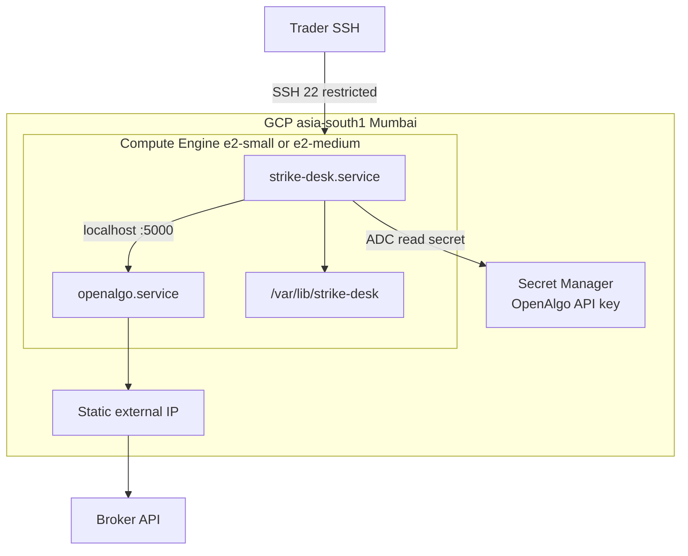

# Iteration 01 — Deployment Guide: the desk on GCP

Practice posture on **Google Cloud**, same architecture as the AWS guide
(`05_deployment_guide.md`): one persistent VM, two processes (OpenAlgo +
Strike Desk), localhost only, static public IP for SEBI broker whitelisting.



## 0. Preconditions

- `gcloud` CLI installed and logged in
- Active project: `ztartcopenalgo` (change if you use another)
- Billing enabled on the project
- OpenAlgo will be installed **on the same VM** (Strike Desk is only a client)

```bash
gcloud config set project ztartcopenalgo
gcloud config set compute/region asia-south1
gcloud config set compute/zone asia-south1-a
```

## 1. What you are standing up

| Piece | GCP choice | Why |
| --- | --- | --- |
| Host | Compute Engine `e2-small` (2 GB) or `e2-medium` (4 GB) | Persistent — no Cloud Run scale-to-zero (static IP + broker session) |
| Region | `asia-south1` (Mumbai) | Closest to NSE/broker latency |
| OS | Debian 12 or Ubuntu 22.04 LTS | systemd + `uv` |
| Public IP | Reserved static external IP | SEBI / broker whitelist |
| Secret | Secret Manager | OpenAlgo API key; rendered to tmpfs at start |
| Firewall | Allow SSH from your IP only | OpenAlgo/Strike Desk stay on localhost |

Prefer **`e2-medium`** if OpenAlgo + Strike Desk + SQLite feel tight on 2 GB.

## 2. Provision the host

```bash
export PROJECT=ztartcopenalgo
export REGION=asia-south1
export ZONE=asia-south1-a
export SD_NAME=strike-desk
export MY_IP="$(curl -s https://ifconfig.me)/32"

gcloud services enable compute.googleapis.com secretmanager.googleapis.com \
  --project="$PROJECT"

# Static IP (register THIS address with the broker)
gcloud compute addresses create "${SD_NAME}-ip" \
  --region="$REGION" --project="$PROJECT"
gcloud compute addresses describe "${SD_NAME}-ip" \
  --region="$REGION" --format='get(address)'

# Firewall: SSH from your workstation only
gcloud compute firewall-rules create "${SD_NAME}-ssh" \
  --project="$PROJECT" \
  --allow=tcp:22 \
  --source-ranges="$MY_IP" \
  --target-tags=strike-desk \
  --description="SSH to Strike Desk host"

# Service account: read only the strike-desk secret
gcloud iam service-accounts create strikedesk-sa \
  --display-name="Strike Desk VM" --project="$PROJECT"

# VM
gcloud compute instances create "$SD_NAME" \
  --project="$PROJECT" \
  --zone="$ZONE" \
  --machine-type=e2-medium \
  --image-family=debian-12 \
  --image-project=debian-cloud \
  --boot-disk-size=20GB \
  --boot-disk-type=pd-balanced \
  --address="${SD_NAME}-ip" \
  --tags=strike-desk \
  --service-account="strikedesk-sa@${PROJECT}.iam.gserviceaccount.com" \
  --scopes=cloud-platform \
  --metadata=startup-script='#!/bin/bash
set -euo pipefail
timedatectl set-timezone Asia/Kolkata
apt-get update -y
apt-get install -y git curl ca-certificates
'

# Confirm timezone after first boot (~60s)
gcloud compute ssh "$SD_NAME" --zone="$ZONE" --project="$PROJECT" \
  --command='timedatectl | head -5'
```

Note the static IP and complete **broker static-IP registration** before any live orders.

## 3. Secrets

```bash
# From your workstation (paste OpenAlgo API key when prompted)
echo -n 'PASTE_OPENALGO_API_KEY' | gcloud secrets create strike-desk-openalgo-api-key \
  --project="$PROJECT" \
  --replication-policy=automatic \
  --data-file=-

# Or add a new version later:
# echo -n 'NEW_KEY' | gcloud secrets versions add strike-desk-openalgo-api-key --data-file=-

gcloud secrets add-iam-policy-binding strike-desk-openalgo-api-key \
  --project="$PROJECT" \
  --member="serviceAccount:strikedesk-sa@${PROJECT}.iam.gserviceaccount.com" \
  --role="roles/secretmanager.secretAccessor"
```

On the VM, renderer used by systemd:

```bash
sudo tee /usr/local/bin/strike-desk-render-env >/dev/null <<'SH'
#!/usr/bin/env bash
set -euo pipefail
umask 077
key=$(gcloud secrets versions access latest \
  --secret=strike-desk-openalgo-api-key \
  --project=ztartcopenalgo)
printf 'STRIKE_DESK_OPENALGO_API_KEY=%s\n' "$key" > /run/strike-desk/env
SH
sudo chmod 0755 /usr/local/bin/strike-desk-render-env
```

Non-secret config:

```bash
sudo install -d -m 0750 -o root -g strikedesk /etc/strike-desk
sudo tee /etc/strike-desk/strike-desk.env >/dev/null <<'ENV'
STRIKE_DESK_OPENALGO_BASE_URL=http://127.0.0.1:5000
STRIKE_DESK_INDEX_SYMBOL=NIFTY
STRIKE_DESK_OPTION_EXCHANGE=NFO
STRIKE_DESK_TICK_INTERVAL_SECONDS=300
STRIKE_DESK_TICK_BUDGET_SECONDS=20
STRIKE_DESK_SPECIALIST_TIMEOUT_SECONDS=12
STRIKE_DESK_NO_TRADE_WINDOWS=09:15-09:30,15:15-15:30
STRIKE_DESK_EXPIRY_CUTOFF=14:00
STRIKE_DESK_EXPIRY_WEEKDAY=1
STRIKE_DESK_MIN_REGIME_CONFIDENCE=0.55
STRIKE_DESK_STATE_DIR=/var/lib/strike-desk
STRIKE_DESK_ENVIRONMENT=practice
STRIKE_DESK_LOG_LEVEL=INFO
ENV
sudo chmod 0640 /etc/strike-desk/strike-desk.env
```

## 4. Install OpenAlgo + Strike Desk on the VM

SSH in:

```bash
gcloud compute ssh strike-desk --zone=asia-south1-a --project=ztartcopenalgo
```

### 4a. OpenAlgo (substrate)

Follow OpenAlgo’s own install on this host (clone `main`, `.env`, `uv sync`, systemd
`openalgo.service` with gunicorn+eventlet `-w 1`). Confirm:

```bash
curl -s http://127.0.0.1:5000/api/v1/ping
```

Broker login must succeed on this host’s **static IP**.

### 4b. Strike Desk release layout

```bash
sudo useradd --system --home /var/lib/strike-desk --shell /usr/sbin/nologin strikedesk || true
curl -LsSf https://astral.sh/uv/install.sh | sudo env UV_INSTALL_DIR=/usr/local/bin sh

RELEASE=$(date +%Y%m%d)-$(git rev-parse --short HEAD 2>/dev/null || echo manual)
sudo install -d -m 0755 /opt/strike-desk/releases
sudo git clone --depth 1 https://github.com/rathinamtrainers/openalgo.git \
  "/opt/strike-desk/releases/$RELEASE"
sudo ln -sfn "/opt/strike-desk/releases/$RELEASE" /opt/strike-desk/current

cd /opt/strike-desk/current/strike_desk
sudo -u strikedesk uv sync --frozen || sudo uv sync
```

### 4c. systemd unit

```bash
sudo tee /etc/systemd/system/strike-desk.service >/dev/null <<'UNIT'
[Unit]
Description=Strike Desk — supervisor decision tick
After=network-online.target openalgo.service
Wants=network-online.target

[Service]
Type=simple
User=strikedesk
Group=strikedesk
WorkingDirectory=/opt/strike-desk/current/strike_desk
Environment=TZ=Asia/Kolkata
EnvironmentFile=/etc/strike-desk/strike-desk.env
EnvironmentFile=-/run/strike-desk/env
ExecStartPre=/usr/local/bin/strike-desk-render-env
ExecStart=/usr/local/bin/uv run --frozen strike-desk run
Restart=on-failure
RestartSec=10s
TimeoutStopSec=30s
KillSignal=SIGTERM

StateDirectory=strike-desk
StateDirectoryMode=0750
RuntimeDirectory=strike-desk
RuntimeDirectoryMode=0700

NoNewPrivileges=yes
PrivateTmp=yes
ProtectSystem=strict
ProtectHome=yes
MemoryMax=768M

[Install]
WantedBy=multi-user.target
UNIT

sudo systemctl daemon-reload
sudo systemctl enable --now strike-desk
```

## 5. Observability

```bash
sudo mkdir -p /etc/systemd/journald.conf.d
sudo tee /etc/systemd/journald.conf.d/strike-desk.conf >/dev/null <<'CONF'
[Journal]
SystemMaxUse=200M
MaxRetentionSec=30day
CONF
sudo systemctl restart systemd-journald

journalctl -u strike-desk -f
```

Decision history stays in `/var/lib/strike-desk/strike_desk.db` (append-only).

Optional later: Cloud Logging agent — not required for practice posture.

## 6. Smoke test

```bash
systemctl is-active strike-desk
journalctl -u strike-desk -n 40 --no-pager
sudo ls -l /var/lib/strike-desk/

# Force one tick (Linux)
sudo kill -USR1 "$(sudo cat /var/lib/strike-desk/strike-desk.pid)"

sudo -u strikedesk bash -lc '
  set -a
  source /etc/strike-desk/strike-desk.env
  set +a
  cd /opt/strike-desk/current/strike_desk
  uv run strike-desk status
  uv run strike-desk journal
'
```

Kill switch:

```bash
sudo -u strikedesk touch /var/lib/strike-desk/KILL
# wait one cadence — tick skipped: kill-switch
sudo rm /var/lib/strike-desk/KILL
```

## 7. Rollback / teardown

**Rollback Strike Desk code:** clone a new release dir, `ln -sfn` to `current`,
`systemctl restart strike-desk`.

**Teardown (stops billing for the VM + IP):**

```bash
gcloud compute instances delete strike-desk --zone=asia-south1-a --project=ztartcopenalgo
gcloud compute addresses delete strike-desk-ip --region=asia-south1 --project=ztartcopenalgo
gcloud compute firewall-rules delete strike-desk-ssh --project=ztartcopenalgo
# keep or delete the secret as you prefer
```

## 8. Cost notes (order of magnitude)

- `e2-medium` in `asia-south1` + 20 GB disk + static IP ≈ low tens of USD/month
  (check current GCP pricing; set a budget alert in Cloud Billing).
- No model/token spend in Iteration 01.
- Static IP is billed while reserved even if the VM is stopped — delete the
  address when you tear down.

## Relation to the AWS guide

Semantics (gates, journal, kill switch, localhost OpenAlgo) are identical.
Only cloud primitives differ: GCE ↔ EC2, static IP ↔ Elastic IP,
Secret Manager ↔ SSM, `gcloud` ↔ `aws`.
