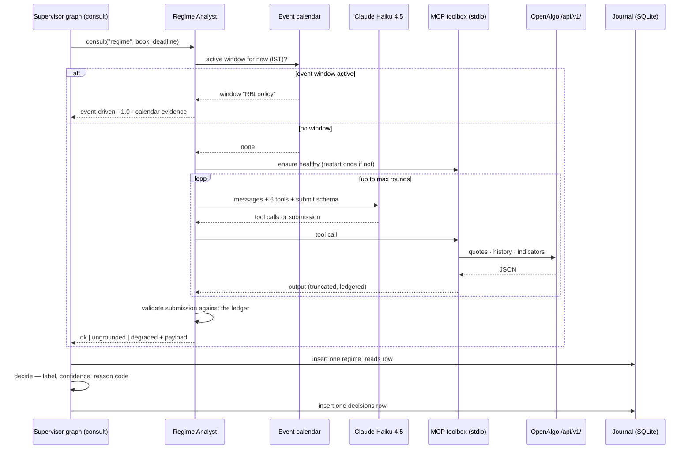

# Iteration 02 — UC-02: Read the regime

> **UC-02 — Read the regime**
>
> **Why this slice:** the catalog's MVP order runs UC-01 → UC-02 → UC-03, and iteration 01 built UC-01. UC-02 is therefore the next un-built entry, and it is the one the tick is already waiting for: iteration 01 left the `regime` role open in the specialist registry, so every flat-book tick today ends as `decline / specialist-unavailable`. This iteration fills that role with a real agent — the first language model call in the product, the first tool-grounded reasoning step, and the first evidence the journal has ever carried.
>
> **Actor:** the Regime Analyst — a Claude Haiku 4.5 agent that reads NIFTY price history, indicators, India VIX and futures open interest through OpenAlgo's MCP tool surface and returns a label, a confidence and the data points it used. The Supervisor consults it inside the tick; the Trader (Amit) reads what it concluded.
>
> **Preconditions:** the iteration-01 desk is deployed and ticking on the host, OpenAlgo is running with a valid broker session and downloaded master contracts, an Anthropic API key is available, and OpenAlgo's own virtual environment can run `mcp/mcpserver.py`.
>
> **Depends on:** UC-01's tick, registry, journal and trace plumbing, which this slice plugs into rather than reshapes. The Options Strategist (UC-04) remains unregistered, so a tradeable regime still ends the tick as a decline naming the missing `strategist` role.

![Navy portrait sheet for iteration 02, UC-02 read the regime, subtitled that the Regime Analyst reads the market through OpenAlgo MCP tools and classifies the regime so the Supervisor can decide or safely decline, with a goal badge calling it the first LLM-powered reasoning step, a why-this-slice card placing UC-02 between UC-01 and UC-03, a five-chip classification vocabulary of trending, range-bound, high-volatility, event-driven and unknown noting the playbook trades only the first two, an out-of-scope card forbidding order placement, alerting and any non-read-only operation, a nine-box main success scenario running tick fires, pre-checks, build request, agent loop, read-only tool calls listing get_quote, get_historical_data, get_trend_snapshot, get_momentum_snapshot, get_volatility_snapshot and get_expiry_dates, submit read, validate and close, journal read and decide, a full sequence diagram whose lifelines are the Supervisor graph, Regime Analyst, event calendar, Claude Haiku 4.5, the stdio MCP toolbox, OpenAlgo /api/v1/ and the SQLite journal, side panels on an event-window short-circuit that returns event-driven at confidence 1.0 with zero tool and model calls, a read-only toolbox owning exactly six tools and failing closed, tech and model details naming claude-haiku-4-5 over MCP stdio, and span coverage for regime.read, regime.model_call and regime.tool_call, then alternate flows, six exception flows from ungrounded submission to a failed journal write, the new regime_reads table with its key columns, a thirteen-item acceptance-criteria checklist, a decision-outcomes table mapping non-tradeable labels, sub-floor confidence and a missing strategist to declines with the note that no tick here ever ends in enter, and a footer strip previewing the implementation guide, manual tests, test automation, deployment guide and outcome.](images/amit-iter-2-image-1.png)

## 1. What this iteration builds

This iteration builds the Regime Analyst end to end: an MCP toolbox that owns OpenAlgo's stdio MCP server as a supervised subprocess and exposes exactly six read-only market tools; an agent loop that plans which signals matter now, calls those tools, observes what came back, and submits one structured classification; a grounding validator that rejects any rationale citing a number the agent did not fetch; a deterministic event-window short-circuit that labels announcement windows without spending a token; a `regime_reads` table that stores every read with its evidence, its prompt artifact and its token cost; and the span coverage that makes each model call and each tool call replayable from the trace.

The classification vocabulary is fixed at five labels — `trending`, `range-bound`, `high-volatility`, `event-driven`, `unknown` — of which the playbook trades the first two. `unknown` is not a failure: it is the answer the agent is expected to give when the data does not support a call, and it always resolves to a decline, which is safe. The supervisor's decision table from iteration 01 already knows how to score a label and a confidence; this slice supplies them, plus two new reason codes for the two ways a read can be rejected rather than merely uninteresting.

## 2. Main success scenario

1. The scheduler fires a tick. The session gate allows it, the `plan` node reads a flat book, and the graph routes to `consult`, which asks the registry for the `regime` role under the specialist timeout.
2. The Regime Analyst starts a `regime.read` span, checks the event calendar for the current IST minute, finds no active window, and confirms the MCP toolbox is healthy — its subprocess alive, its session open, its six whitelisted tools loaded.
3. The analyst builds the request from the versioned `regime_analyst` prompt artifact plus the tick's context: the index and its exchanges, the current IST time, today's decision count, and the five labels with the playbook's meaning of each.
4. The agent loop runs. Claude Haiku 4.5 is called with the six tools plus a `submit_regime_read` schema bound to it. It plans a first round of reads — typically the index quote, a trend snapshot and a volatility snapshot — and the loop executes each tool call against the MCP session, truncating and recording every result in the evidence ledger, then feeds the outputs back as tool messages.
5. The model observes what came back, optionally calls a second round (the India VIX quote, the futures open-interest quote or a momentum snapshot), and then calls `submit_regime_read` with a label, a confidence, a one-sentence rationale and a list of cited evidence items.
6. The validator checks the submission: the label is in the fixed set, the confidence is in `[0, 1]`, the rationale is one sentence within its character cap, at least one evidence item is present, and every number in the rationale and in the evidence matches a value the ledger actually observed.
7. The analyst closes its span with the label, the confidence, the tool-call count and the token usage, and returns a `SpecialistResult` whose payload carries the read.
8. The `consult` node appends one `regime_reads` row — read, evidence, prompt name, version and digest, model id, tokens and latency — and puts the label and confidence into the tick state.
9. The `decide` node scores the label: a non-tradeable label declines with `regime-not-tradeable`, a confidence under the floor declines with `regime-low-confidence`, and a tradeable, confident label declines with `specialist-unavailable` naming the missing strategist. The decision row now carries the regime label, the confidence, the model id and the token cost.

## 3. Alternate flows

**A1 — An event window is active.** When the IST clock falls inside a window in the event calendar, the analyst returns `event-driven` at confidence `1.0`, citing the calendar entry as its evidence, with zero tool calls and zero model calls. The tick declines with `regime-not-tradeable`. Policy announcements are the cheapest thing the desk can get right, and it gets them right by arithmetic rather than inference.

**A2 — The model answers `unknown`.** Thin data, a contradictory read or a stale feed produces `unknown` with a low confidence and the evidence behind it. The read is recorded exactly like any other, and the tick declines with `regime-not-tradeable`. Nothing about this path is treated as an error.

**A3 — A single tool call fails.** MCP tool failures come back as error strings rather than exceptions. The loop records the failure in the ledger, marks the observation unusable, and lets the model continue with what it has. As long as at least one read succeeded and the submission is grounded in it, the read stands, with its error count on the row.

**A4 — The analyst is triggered from the command line.** `strike-desk regime` performs one read out of band, prints the label, confidence, rationale and evidence, and appends a `regime_reads` row tagged `source = cli`. It writes no decision row, because a decision belongs to a tick.

## 4. Exception flows

**E1 — The submission is ungrounded.** A rationale or evidence value carrying a number the ledger never observed is a defect, not a difference of opinion. The read is stored with status `ungrounded` and the defect text, no label reaches the decision row, and the tick declines with the new reason code `regime-ungrounded` so the failure is countable in the journal rather than hidden inside a safe-looking `unknown`.

**E2 — Every tool call failed, or the model never submitted.** The analyst returns status `degraded` with label `unknown`, and the tick declines with `data-quality`. The desk does not classify a market it could not read.

**E3 — The MCP server is unreachable.** A missing interpreter, a missing script, a subprocess that dies or a session that will not open raises `McpUnavailable` out of the analyst. The registry converts it to `SpecialistUnavailable` and the tick declines with `specialist-unavailable`. The toolbox attempts one restart at the start of the next read, so a transient failure heals without a service restart.

**E4 — The model call fails or the account is out of credit.** Anthropic errors surface as `ModelCallFailed`, which the registry maps the same way: `decline / specialist-unavailable`. Fail flat, never fail open — the reasoning plane going dark stops entries and nothing else.

**E5 — The read runs long.** The analyst holds its own deadline, set a configured margin under the registry's specialist timeout, and cancels the agent coroutine when it expires. The registry's timeout stays as a backstop rather than the primary path, which matters because the registry abandons a timed-out worker thread and the pool has only two of them.

**E6 — The read cannot be journalled.** The `regime_reads` insert happens in the `consult` node, inside the graph, so a write failure propagates out of the tick exactly like the decision write does. An unrecorded read never becomes a decision.

## 5. Agentic and operational behaviour

This slice is where the product's reasoning plane starts. The loop is plan → act → observe in its most literal form: the model plans which signals matter for this minute of this session, acts by calling MCP tools, observes their outputs as tool messages, and repeats up to a bounded number of rounds before it must submit. The final round binds the submission schema with a forced tool choice, so the loop always terminates with a structured answer or an explicit degradation rather than drifting.

Three guardrails bind it, and each is structural rather than instructed. **Tool scoping:** the toolbox loads OpenAlgo's full MCP tool set and keeps exactly six read-only market tools, failing closed if any of the six is absent; nothing that places, modifies or cancels an order is reachable from the analyst's tool list. **Grounding:** the evidence ledger records every tool call's arguments and output, and the validator refuses any submission whose numbers do not appear in it. **Bounded work:** the round cap, the per-tool output truncation and the analyst's own deadline together put a ceiling on latency and on token spend.

The operational layer this slice owns is the AgentOps span coverage over the reasoning step, the LLMOps evaluation gate, and the PromptOps stamp. Every model round emits a `regime.model_call` span carrying the model id, the round index, the input and output token counts and the stop reason; every tool call emits a `regime.tool_call` span carrying the tool name, its arguments, the output size, the latency and whether it succeeded; the read itself emits `regime.read` with the label, confidence, status and total cost. All of them hang under the tick's root span and land in the `traces` table that iteration 01 built, which is what makes a read replayable. The prompt lives as a versioned artifact whose name, version and content digest are stamped on every `regime_reads` row alongside the process-wide `prompt_set_version`, so a regression can be attributed to a specific artifact rather than to "the prompts". The evaluation gate is a frozen set of recorded market snapshots replayed through the analyst with a live model: it scores label agreement, refuses any ungrounded submission, and fails CI when a prompt or model change degrades either.

## 6. Data touched

The journal gains one table. **`regime_reads`** takes one row per read: `read_id`, `tick_id`, `trace_id`, `created_at_utc`, `trading_day`, `index_symbol`, `source` (`tick` or `cli`), `status` (`ok`, `ungrounded`, `degraded`), `label`, `confidence`, `rationale`, `evidence_json`, `defect`, `tool_call_count`, `tool_error_count`, `model_calls`, `model_version`, `input_tokens`, `output_tokens`, `token_cost_micros`, `prompt_name`, `prompt_version`, `prompt_digest`, `prompt_set_version`, `latency_ms`, `schema_version`. It carries the same `UPDATE`/`DELETE` triggers as `decisions` and `traces`, and the schema version moves to 2 — existing rows keep 1 and are never backfilled. The `decisions` table is unchanged in shape but newly populated: `regime_label`, `regime_confidence`, `model_version` and `token_cost_micros` stop being empty.

Reads reach the market through the MCP server, which reaches OpenAlgo's `/api/v1/` on localhost: `get_quote` (NIFTY spot and India VIX on `NSE_INDEX`, the current-month future on `NFO` for its open interest), `get_historical_data`, `get_trend_snapshot`, `get_momentum_snapshot`, `get_volatility_snapshot` and `get_expiry_dates`. The event calendar is a JSON file in the state directory, read fresh on every tick. One model API is called: `claude-haiku-4-5`.

## 7. Acceptance criteria

| ID | Criterion |
| --- | --- |
| **AC-1** | Every completed read yields a label from `{trending, range-bound, high-volatility, event-driven, unknown}`, a confidence in `[0, 1]`, a one-sentence rationale within the character cap, and at least one evidence item naming the tool and field it came from. |
| **AC-2** | Every number in the rationale and in each evidence value matches a value present in the evidence ledger for that read; a submission that fails this check is stored with status `ungrounded` and its defect text, and the tick records `decline / regime-ungrounded`. |
| **AC-3** | The analyst's bound tool set is exactly the six read-only market tools; loading fails closed if any is missing from the MCP server, and no order-placing, modifying, cancelling or alerting tool is present in it. |
| **AC-4** | Every read appends exactly one `regime_reads` row populated in every non-nullable column, linked to its tick by `tick_id` and to its trace by `trace_id`; `UPDATE` and `DELETE` against the table raise a database error. |
| **AC-5** | A read with status `ok` puts its label and confidence on the tick's `decisions` row, and the existing decision table scores them: non-tradeable label → `regime-not-tradeable`, confidence below the floor → `regime-low-confidence`, tradeable and confident → `specialist-unavailable` naming the `strategist` role. No read produces outcome `enter`. |
| **AC-6** | When every tool call fails, or the model submits nothing within the round cap, the read is stored with status `degraded` and label `unknown`, and the tick records `decline / data-quality`. |
| **AC-7** | Inside a configured event window the read returns `event-driven` at confidence `1.0` citing the calendar entry, with zero tool calls and zero model calls; a malformed calendar file yields status `degraded` rather than a silent pass. |
| **AC-8** | The analyst enforces its own deadline below the registry timeout, cancels the in-flight coroutine on expiry, and returns control to the tick; after such a timeout the specialist executor still has both worker threads available for the next tick. |
| **AC-9** | Every read persists a connected span set under the tick's root — one `regime.read`, one `regime.model_call` per model round with its token counts, one `regime.tool_call` per tool call with its outcome — all sharing the tick's `trace_id`. |
| **AC-10** | Every `regime_reads` row carries the prompt artifact's name, version and content digest, the process-wide `prompt_set_version`, and the exact model id invoked; the decision row's `model_version` names that model and its `token_cost_micros` equals the read's cost, computed from the published per-million-token prices. |
| **AC-11** | Neither the Anthropic API key nor the OpenAlgo API key appears in any `regime_reads` row, `traces` row or log line, including the MCP subprocess arguments recorded on spans. |
| **AC-12** | Replaying a frozen market snapshot through the analyst three times yields the same label each time, and the frozen evaluation set meets its pass-bars — at least 80% label agreement with the expected label, zero ungrounded submissions, zero non-whitelisted tool calls — with the suite failing CI when a prompt or model change breaks either. |
| **AC-13** | The agent loop makes no more than the configured number of model rounds per read, and every tool output handed back to the model is truncated to the configured character cap with the truncation marked. |

## 8. The read, end to end

You build this in `02_implementation_guide.md`, verify it by hand against `03_manual_test_cases.md`, lock it down with the suite in `04_test_automation.md`, and promote the running desk to it with `05_deployment_guide.md`.

![Wide dark-blue diagram for iteration 02, UC-02 read the regime, captioned filing the regime role with agentic reasoning grounded in market data, whose left main-success column steps from the scheduler firing a tick to a plan node reading the flat book to a consult node with a rosette-badged Regime Analyst checking the event calendar and MCP toolbox status, opening into a circular plan, act, observe agent loop drawn around a portrait of Claude Haiku 4.5 that fans out to six whitelisted MCP tool icons and pulls truncated, ledgered JSON from the stdio MCP toolbox over the OpenAlgo API, then a grounding-validation checklist requiring a label from the set, a confidence between zero and one, a one-sentence rationale and cited evidence matching the ledger before the submit-regime-read box listing trending, range-bound, high-volatility, event-driven and unknown, and finally a consult node appending a regime_reads row into a decide node that scores label and confidence, with a vertical orange tick-declines rail for regime-not-tradeable, regime-low-confidence and missing strategist, right-hand cards for the two alternate flows of an active event window at confidence 1.0 and a model answering unknown, four exception flows for ungrounded submission, tool failure, an unreachable MCP server and a failed model call, three temple-column guardrails for read-only tool scoping, evidence-ledger grounding and bounded work under round caps and timeouts, a nested trace tree of tick, regime.read, regime.model_call and regime.tool_call, and a SQLite journal showing the regime_reads columns feeding regime_label, regime_confidence and model_version into decisions.](images/amit-iter-2-image-2.png)
