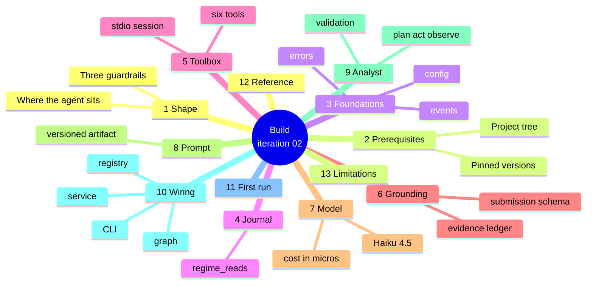
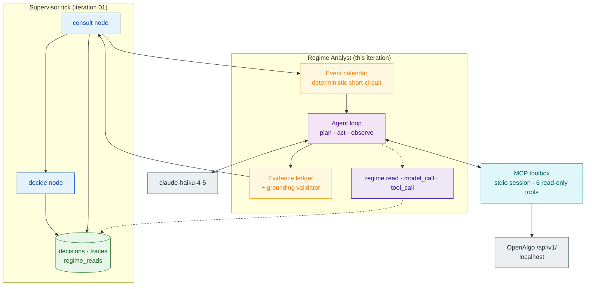

# Iteration 02 — Implementation Guide: the Regime Analyst



## 1. What you are adding, and the shape of it

The desk you inherited ticks on a cadence, reads its book, asks the registry for a `regime` specialist, finds nobody home, and journals a decline. Everything you write in this guide lives behind that one call. When you are done, `registry.consult("regime", ...)` reaches a real agent that calls Claude Haiku 4.5 with six OpenAlgo market tools bound to it, gets back a label with a confidence and a rationale, proves that rationale against the data it actually fetched, and hands the supervisor something worth journalling.

Four pieces make that work, and they are separated because they fail differently. The **MCP toolbox** owns OpenAlgo's stdio MCP server as a child process: it starts the subprocess, holds one initialised session open, loads the server's tool list, keeps exactly six read-only market tools, and runs everything on a private event loop thread so the rest of the desk stays synchronous. The **grounding module** holds the submission schema the model must fill and the evidence ledger that records what every tool actually returned, plus the validator that compares one against the other. The **model client** builds the Haiku tier and converts token counts into micro-dollars. The **analyst** is the loop itself: plan the reads, call the tools, observe the outputs, submit a classification, validate it, and emit a span for every step.



Two design choices are worth stating before you copy any code, because they are the ones you would otherwise reinvent badly.

**The analyst's loop is plain async code, not a LangGraph subgraph.** LangGraph earns its place in the supervisor tick, where checkpointing and the future approval interrupt matter. Inside a specialist that must run to completion within one deadline and be cancellable at any await point, a graph adds indirection and takes away the straight-line control you need over evidence capture and round counting. The loop still runs plan → act → observe; it just does it in a `for` statement you can read.

**The analyst holds its own deadline, below the registry's.** The registry runs specialists on a two-worker thread pool and, on timeout, abandons the worker thread to finish on its own. Two abandoned threads starve the pool permanently. So the analyst submits its coroutine to the toolbox's event loop, waits with a deadline set a configured margin *under* `specialist_timeout_seconds`, and cancels the coroutine when that expires — cancellation propagates into the awaiting task, the worker thread returns, and the registry's timeout stays a backstop rather than the primary path.

## 2. Prerequisites and pinned versions

You are extending the `strike_desk/` project from iteration 01 in place; nothing here starts a new tree. Before you begin, `uv run pytest` on the existing suite must pass, OpenAlgo must be running locally with a valid broker session and downloaded master contracts, and you need an Anthropic API key with credit on it.

The versions below were verified on 2026-08-13 against PyPI and the Claude platform documentation; the links are in Sources.

| Component | Pinned version | Why this one |
| --- | --- | --- |
| Python | 3.12 | Host project requirement, unchanged |
| `langchain-anthropic` | 1.5.6 | The Claude binding; requires `langchain-core >= 1.5.4` |
| `langchain-core` | 1.5.4 | Message, tool and usage-metadata types the loop is written against |
| `langchain-mcp-adapters` | 0.3.2 | Turns MCP tools into LangChain tools; requires `mcp < 2.0.0` |
| `mcp` | 1.29.0 | Highest 1.x release, so the adapters constraint holds; OpenAlgo's own venv is on the same line |
| `anthropic` | 0.121.0 | SDK underneath `langchain-anthropic` |
| `langgraph` | 1.2.11 | Patch bump from 1.2.9, same API |
| `langgraph-checkpoint-sqlite` | 3.1.1 | Patch bump from 3.1.0 |
| Model | `claude-haiku-4-5` | The design layer's classification tier: $1 / $5 per MTok, 200k context, fastest |

The model is called with thinking **off** and `temperature=0`. That is a deliberate deviation from the tech stack's blanket "adaptive thinking throughout" line: the current model documentation shows Claude Haiku 4.5 supports classic extended thinking and *not* adaptive thinking, and the effort control applies to the Opus and Sonnet tiers. A constrained classifier that must reproduce the same label from the same snapshot wants determinism, not deliberation, so thinking off at temperature 0 is the right configuration for this tier and is what the evaluation suite scores.

The files you touch, marked new or changed:

```
strike_desk/
├── pyproject.toml                      (changed)
├── .env.example                        (changed)
└── src/strike_desk/
    ├── config.py                       (changed)
    ├── errors.py                       (changed)
    ├── journal.py                      (changed)
    ├── specialists.py                  (changed)
    ├── graph.py                        (changed)
    ├── service.py                      (changed)
    ├── __main__.py                     (changed)
    ├── events.py                       (new)
    ├── mcp_toolbox.py                  (new)
    ├── grounding.py                    (new)
    ├── model_client.py                 (new)
    ├── regime_analyst.py               (new)
    └── prompts/
        └── regime_analyst.md           (new)
```

### `strike_desk/pyproject.toml`

The dependency set gains the model, the MCP client and the adapters; the test configuration gains the `evals` marker so live-model tests never run by accident.

```toml
[project]
name = "strike-desk"
version = "0.2.0"
description = "Agentic options-buying desk on OpenAlgo — supervisor tick and regime analyst."
requires-python = ">=3.12"
dependencies = [
    "langgraph==1.2.11",
    "langgraph-checkpoint-sqlite==3.1.1",
    "langchain-core==1.5.4",
    "langchain-anthropic==1.5.6",
    "langchain-mcp-adapters==0.3.2",
    "mcp==1.29.0",
    "anthropic==0.121.0",
    "sqlalchemy==2.0.51",
    "httpx==0.28.1",
    "pydantic==2.13.4",
    "pydantic-settings==2.14.2",
    "apscheduler==3.11.3",
    "opentelemetry-sdk==1.44.0",
    "opentelemetry-exporter-otlp-proto-http==1.44.0",
    "tzdata>=2025.2",
]

[project.scripts]
strike-desk = "strike_desk.__main__:main"

[dependency-groups]
dev = [
    "pytest==9.1.1",
    "pytest-cov==7.1.0",
    "respx==0.23.1",
    "freezegun==1.5.5",
    "ruff==0.15.22",
    "bandit>=1.8",
    "pip-audit>=2.7",
]

[build-system]
requires = ["hatchling"]
build-backend = "hatchling.build"

[tool.hatch.build.targets.wheel]
packages = ["src/strike_desk"]

[tool.ruff]
line-length = 100
target-version = "py312"

[tool.ruff.lint]
select = ["E", "F", "W", "I", "B", "C4", "UP"]

[tool.pytest.ini_options]
testpaths = ["tests"]
addopts = "-q --strict-markers -m 'not evals'"
markers = [
    "evals: live-model regime evaluations; need ANTHROPIC_API_KEY and cost money",
]
filterwarnings = ["error::DeprecationWarning:strike_desk.*"]

[tool.coverage.run]
source = ["strike_desk"]
omit = [
    "*/strike_desk/__main__.py",
    "*/strike_desk/service.py",
    # Its session lifecycle is proven against a real MCP server by hand, not by a double.
    "*/strike_desk/mcp_toolbox.py",
]

[tool.coverage.report]
exclude_lines = [
    "pragma: no cover",
    "if __name__ == .__main__.:",
]
```

Run `uv sync` once after this edit and confirm the lock resolves before writing any code — a dependency conflict discovered after six new modules is a bad afternoon.

## 3. Configuration, errors and the event calendar

### `strike_desk/src/strike_desk/config.py`

Everything the analyst needs is configuration, including the model id and its prices, so a tier change or a price change is an environment edit rather than a deploy of new code.

```python
"""Typed, environment-driven configuration for the Strike Desk service."""

from __future__ import annotations

from datetime import time
from functools import lru_cache
from pathlib import Path
from zoneinfo import ZoneInfo

from pydantic import Field, SecretStr, field_validator
from pydantic_settings import BaseSettings, SettingsConfigDict

IST = ZoneInfo("Asia/Kolkata")

# Project root is two levels above this file: strike_desk/src/strike_desk/config.py
_PROJECT_ROOT = Path(__file__).resolve().parents[2]
_ENV_FILES = (
    _PROJECT_ROOT / ".env",
    Path(".env"),  # also honour a cwd-relative .env when present
)

TimeWindow = tuple[time, time]


def parse_windows(raw: str) -> tuple[TimeWindow, ...]:
    """Parse ``"09:15-09:30,15:15-15:30"`` into ordered (start, end) time pairs."""
    windows: list[TimeWindow] = []
    for chunk in (piece.strip() for piece in raw.split(",")):
        if not chunk:
            continue
        start_raw, separator, end_raw = chunk.partition("-")
        if not separator:
            raise ValueError(f"window {chunk!r} must look like HH:MM-HH:MM")
        start = time.fromisoformat(start_raw.strip())
        end = time.fromisoformat(end_raw.strip())
        if start >= end:
            raise ValueError(f"window {chunk!r} must start before it ends")
        windows.append((start, end))
    return tuple(windows)


class Settings(BaseSettings):
    """All runtime configuration, read from ``STRIKE_DESK_*`` environment variables."""

    model_config = SettingsConfigDict(
        env_prefix="STRIKE_DESK_",
        env_file=_ENV_FILES,
        env_file_encoding="utf-8",
        extra="forbid",
        protected_namespaces=(),
    )

    # --- OpenAlgo substrate -------------------------------------------------
    openalgo_base_url: str = "http://127.0.0.1:5000"
    openalgo_api_key: SecretStr
    openalgo_timeout_seconds: float = Field(default=5.0, gt=0, le=60)
    openalgo_retries: int = Field(default=2, ge=0, le=5)

    # --- Book ---------------------------------------------------------------
    index_symbol: str = "NIFTY"
    option_exchange: str = "NFO"
    index_spot_exchange: str = "NSE_INDEX"
    vix_symbol: str = "INDIAVIX"

    # --- Tick cadence and budgets ------------------------------------------
    tick_interval_seconds: int = Field(default=900, ge=30, le=3600)
    tick_budget_seconds: float = Field(default=40.0, gt=0, le=120)
    specialist_timeout_seconds: float = Field(default=25.0, gt=0, le=60)

    # --- Session gates ------------------------------------------------------
    no_trade_windows: str = "09:15-09:30,15:15-15:30"
    expiry_cutoff: str = "14:00"
    expiry_weekday: int = Field(default=1, ge=0, le=6)  # 0 = Monday; NIFTY weeklies expire Tuesday

    # --- Supervisor policy --------------------------------------------------
    min_regime_confidence: float = Field(default=0.55, ge=0.0, le=1.0)

    # --- Regime Analyst (reasoning plane) -----------------------------------
    anthropic_api_key: SecretStr | None = None
    regime_model: str = "claude-haiku-4-5"
    regime_temperature: float = Field(default=0.0, ge=0.0, le=1.0)
    regime_max_output_tokens: int = Field(default=1200, ge=256, le=8192)
    regime_max_rounds: int = Field(default=4, ge=1, le=8)
    regime_deadline_margin_seconds: float = Field(default=3.0, ge=0.5, le=15.0)
    regime_tool_output_chars: int = Field(default=8000, ge=1000, le=60000)
    regime_rationale_max_chars: int = Field(default=320, ge=80, le=1000)
    price_in_per_mtok: float = Field(default=1.0, ge=0.0, le=1000.0)
    price_out_per_mtok: float = Field(default=5.0, ge=0.0, le=1000.0)

    # --- MCP toolbox --------------------------------------------------------
    mcp_python: Path = Path("/opt/openalgo/.venv/bin/python")
    mcp_server_script: Path = Path("/opt/openalgo/mcp/mcpserver.py")
    mcp_startup_timeout_seconds: float = Field(default=45.0, gt=0, le=180)

    # --- Paths --------------------------------------------------------------
    state_dir: Path = Path("/var/lib/strike-desk")
    prompts_dir: Path = Field(default_factory=lambda: Path(__file__).parent / "prompts")

    # --- Observability ------------------------------------------------------
    service_name: str = "strike-desk"
    environment: str = "practice"
    log_level: str = "INFO"
    otlp_endpoint: str | None = None
    otlp_headers: SecretStr | None = None

    @field_validator("no_trade_windows")
    @classmethod
    def _validate_windows(cls, value: str) -> str:
        parse_windows(value)
        return value

    @field_validator("expiry_cutoff")
    @classmethod
    def _validate_cutoff(cls, value: str) -> str:
        time.fromisoformat(value)
        return value

    @field_validator("environment")
    @classmethod
    def _validate_environment(cls, value: str) -> str:
        if value not in {"practice", "production"}:
            raise ValueError("environment must be 'practice' or 'production'")
        return value

    @property
    def no_trade_window_times(self) -> tuple[TimeWindow, ...]:
        return parse_windows(self.no_trade_windows)

    @property
    def expiry_cutoff_time(self) -> time:
        return time.fromisoformat(self.expiry_cutoff)

    @property
    def analyst_deadline_seconds(self) -> float:
        """The analyst's own budget, always under the registry's timeout."""
        return max(1.0, self.specialist_timeout_seconds - self.regime_deadline_margin_seconds)

    @property
    def db_path(self) -> Path:
        return self.state_dir / "strike_desk.db"

    @property
    def checkpoint_path(self) -> Path:
        return self.state_dir / "checkpoints.sqlite"

    @property
    def kill_switch_path(self) -> Path:
        return self.state_dir / "KILL"

    @property
    def heartbeat_path(self) -> Path:
        return self.state_dir / "heartbeat"

    @property
    def pid_path(self) -> Path:
        return self.state_dir / "strike-desk.pid"

    @property
    def events_path(self) -> Path:
        return self.state_dir / "events.json"


@lru_cache(maxsize=1)
def get_settings() -> Settings:
    """Process-wide settings singleton."""
    return Settings()  # type: ignore[call-arg]
```

Three defaults moved and each move is a decision. The cadence goes from 300 to **900 seconds** because the playbook allows at most three trades a day, one position at a time, and a 45-minute time-stop inside a tradeable window that runs from 09:30 to 15:15 — a quarter-hour cadence cannot cause you to miss anything the risk limits would have let you act on, and it cuts model spend by two thirds. The specialist timeout goes from 12 to **25 seconds** and the tick budget from 20 to **40**, because a tool-calling model round trip is seconds, not milliseconds; the PRD's sub-20-second target stays the design goal that `latency_ms` on every decision row measures, and these numbers are the hard ceiling above it. `protected_namespaces=()` is set so pydantic accepts the `model_*`-adjacent names without warning.

### `strike_desk/src/strike_desk/errors.py`

```python
"""Exception taxonomy — every failure the tick can survive has a type here."""

from __future__ import annotations


class StrikeDeskError(Exception):
    """Base class for every error raised inside Strike Desk."""


class OpenAlgoError(StrikeDeskError):
    """A call to OpenAlgo failed, timed out, or answered with an error status."""

    def __init__(self, message: str, status_code: int | None = None) -> None:
        super().__init__(message)
        self.status_code = status_code


class ReadOnlyViolation(StrikeDeskError):
    """Tick code attempted a path outside the read-only whitelist."""

    def __init__(self, path: str) -> None:
        super().__init__(f"path {path!r} is not in the read-only whitelist")
        self.path = path


class BookStateUnavailable(StrikeDeskError):
    """The book could not be read or parsed; the desk must not assume it is flat."""


class SpecialistUnavailable(StrikeDeskError):
    """No usable specialist answered for a role."""

    def __init__(self, role: str, detail: str) -> None:
        super().__init__(f"specialist role {role!r} unavailable: {detail}")
        self.role = role
        self.detail = detail


class SpecialistTimeout(StrikeDeskError):
    """A specialist exceeded its timeout budget."""

    def __init__(self, role: str, detail: str) -> None:
        super().__init__(f"specialist role {role!r} timed out: {detail}")
        self.role = role
        self.detail = detail


class JournalWriteError(StrikeDeskError):
    """The append-only journal could not be written; the tick must fail closed."""


class PromptNotFound(StrikeDeskError):
    """A prompt artifact was requested that the registry does not hold."""


class McpUnavailable(StrikeDeskError):
    """The OpenAlgo MCP server could not be started, reached, or trusted."""


class ModelCallFailed(StrikeDeskError):
    """The model provider refused, errored, or was not configured."""


class EventCalendarInvalid(StrikeDeskError):
    """The event calendar exists but cannot be parsed; the desk must not guess."""
```

### `strike_desk/src/strike_desk/events.py`

The playbook does not trade through policy announcements, and knowing whether now is such a moment is a calendar lookup rather than a judgement call. The calendar is a JSON file in the state directory, read fresh on every tick so the trader can add tomorrow's RBI window without restarting the service. A missing file means no windows; a malformed file is an error the desk refuses to trade through.

```python
"""The event calendar: announcement windows the desk refuses to reason through."""

from __future__ import annotations

import json
from dataclasses import dataclass
from datetime import datetime
from pathlib import Path
from typing import Any

from .config import IST
from .errors import EventCalendarInvalid


@dataclass(frozen=True)
class EventWindow:
    """One named window, in IST, that the desk treats as event-driven."""

    name: str
    start: datetime
    end: datetime

    def contains(self, moment: datetime) -> bool:
        return self.start <= moment < self.end

    def as_evidence(self) -> dict[str, str]:
        return {
            "tool": "event-calendar",
            "field": self.name,
            "value": f"{self.start.isoformat()} to {self.end.isoformat()}",
        }


def _as_ist(raw: Any, label: str) -> datetime:
    if not isinstance(raw, str):
        raise EventCalendarInvalid(f"{label} must be an ISO-8601 string, got {type(raw).__name__}")
    try:
        moment = datetime.fromisoformat(raw)
    except ValueError as exc:
        raise EventCalendarInvalid(f"{label} is not an ISO-8601 datetime: {raw!r}") from exc
    return moment.replace(tzinfo=IST) if moment.tzinfo is None else moment.astimezone(IST)


def load_event_windows(path: Path) -> tuple[EventWindow, ...]:
    """Read the calendar. Absent means no windows; unreadable means we do not know."""
    if not path.exists():
        return ()
    try:
        raw = json.loads(path.read_text(encoding="utf-8"))
    except (OSError, ValueError) as exc:
        raise EventCalendarInvalid(f"{path}: {type(exc).__name__}: {exc}") from exc
    if not isinstance(raw, list):
        raise EventCalendarInvalid(f"{path}: expected a JSON array of window objects")

    windows: list[EventWindow] = []
    for position, entry in enumerate(raw):
        if not isinstance(entry, dict):
            raise EventCalendarInvalid(f"{path}: entry {position} is not an object")
        name = str(entry.get("name", "")).strip()
        if not name:
            raise EventCalendarInvalid(f"{path}: entry {position} has no name")
        start = _as_ist(entry.get("start"), f"{path} entry {position} start")
        end = _as_ist(entry.get("end"), f"{path} entry {position} end")
        if start >= end:
            raise EventCalendarInvalid(f"{path}: entry {position} must start before it ends")
        windows.append(EventWindow(name=name, start=start, end=end))
    return tuple(sorted(windows, key=lambda window: window.start))


def active_window(windows: tuple[EventWindow, ...], now_ist: datetime) -> EventWindow | None:
    """The window containing this IST moment, if any."""
    return next((window for window in windows if window.contains(now_ist)), None)
```

A calendar file looks like this, and the deployment guide puts one on the host:

```json
[
  {"name": "RBI monetary policy", "start": "2026-08-14T09:45:00", "end": "2026-08-14T11:00:00"},
  {"name": "US CPI print", "start": "2026-08-19T17:45:00", "end": "2026-08-19T18:30:00"}
]
```

## 4. The journal grows a table

### `strike_desk/src/strike_desk/journal.py`

`regime_reads` records the read itself — what the agent concluded, what it cited, which prompt and model produced it, what it cost, and whether it was accepted. It joins to the tick by `tick_id` and to the trace by `trace_id`, it carries the same append-only triggers as the tables around it, and it moves the schema version to 2. Existing rows keep version 1 and are never backfilled: a correction is a new row, and a schema is no exception.

```python
"""Append-only SQLite journal: ``decisions``, ``traces`` and ``regime_reads``."""

from __future__ import annotations

import sqlite3
from collections.abc import Iterator, Sequence
from contextlib import contextmanager
from datetime import datetime
from pathlib import Path
from typing import Any

from sqlalchemy import (
    DDL,
    Boolean,
    DateTime,
    Float,
    Integer,
    String,
    Text,
    create_engine,
    event,
    func,
    select,
)
from sqlalchemy.exc import SQLAlchemyError
from sqlalchemy.orm import DeclarativeBase, Mapped, Session, mapped_column, sessionmaker
from sqlalchemy.pool import NullPool

from .errors import JournalWriteError

SCHEMA_VERSION = 2


class Base(DeclarativeBase):
    """Declarative base for the Strike Desk journal."""


class Decision(Base):
    """One row per completed tick. Never updated, never deleted."""

    __tablename__ = "decisions"

    id: Mapped[int] = mapped_column(Integer, primary_key=True, autoincrement=True)
    tick_id: Mapped[str] = mapped_column(String(36), unique=True, index=True, nullable=False)
    trace_id: Mapped[str] = mapped_column(String(32), index=True, nullable=False)
    created_at_utc: Mapped[datetime] = mapped_column(DateTime(timezone=True), nullable=False)
    trading_day: Mapped[str] = mapped_column(String(10), index=True, nullable=False)
    index_symbol: Mapped[str] = mapped_column(String(32), nullable=False)
    trigger: Mapped[str] = mapped_column(String(16), nullable=False)
    outcome: Mapped[str] = mapped_column(String(16), index=True, nullable=False)
    reason_code: Mapped[str] = mapped_column(String(48), index=True, nullable=False)
    reason_text: Mapped[str] = mapped_column(Text, nullable=False)
    regime_label: Mapped[str | None] = mapped_column(String(32), nullable=True)
    regime_confidence: Mapped[float | None] = mapped_column(Float, nullable=True)
    book_state_json: Mapped[str] = mapped_column(Text, nullable=False)
    prompt_set_version: Mapped[str] = mapped_column(String(32), nullable=False)
    model_version: Mapped[str] = mapped_column(String(128), nullable=False)
    token_cost_micros: Mapped[int] = mapped_column(Integer, nullable=False, default=0)
    latency_ms: Mapped[int] = mapped_column(Integer, nullable=False)
    trace_complete: Mapped[bool] = mapped_column(Boolean, nullable=False, default=True)
    schema_version: Mapped[int] = mapped_column(Integer, nullable=False, default=SCHEMA_VERSION)


class TraceSpan(Base):
    """One row per finished OpenTelemetry span. Never updated, never deleted."""

    __tablename__ = "traces"

    id: Mapped[int] = mapped_column(Integer, primary_key=True, autoincrement=True)
    trace_id: Mapped[str] = mapped_column(String(32), index=True, nullable=False)
    span_id: Mapped[str] = mapped_column(String(16), unique=True, nullable=False)
    parent_span_id: Mapped[str | None] = mapped_column(String(16), nullable=True)
    name: Mapped[str] = mapped_column(String(64), nullable=False)
    started_at_utc: Mapped[datetime] = mapped_column(DateTime(timezone=True), nullable=False)
    ended_at_utc: Mapped[datetime] = mapped_column(DateTime(timezone=True), nullable=False)
    duration_ms: Mapped[int] = mapped_column(Integer, nullable=False)
    status: Mapped[str] = mapped_column(String(16), nullable=False)
    attributes_json: Mapped[str] = mapped_column(Text, nullable=False)


class RegimeRead(Base):
    """One row per regime classification attempt. Never updated, never deleted."""

    __tablename__ = "regime_reads"

    id: Mapped[int] = mapped_column(Integer, primary_key=True, autoincrement=True)
    read_id: Mapped[str] = mapped_column(String(36), unique=True, nullable=False)
    tick_id: Mapped[str] = mapped_column(String(48), index=True, nullable=False)
    trace_id: Mapped[str] = mapped_column(String(32), index=True, nullable=False)
    created_at_utc: Mapped[datetime] = mapped_column(DateTime(timezone=True), nullable=False)
    trading_day: Mapped[str] = mapped_column(String(10), index=True, nullable=False)
    index_symbol: Mapped[str] = mapped_column(String(32), nullable=False)
    source: Mapped[str] = mapped_column(String(8), nullable=False)  # tick | cli
    status: Mapped[str] = mapped_column(String(16), index=True, nullable=False)
    label: Mapped[str | None] = mapped_column(String(32), index=True, nullable=True)
    confidence: Mapped[float | None] = mapped_column(Float, nullable=True)
    rationale: Mapped[str] = mapped_column(Text, nullable=False)
    evidence_json: Mapped[str] = mapped_column(Text, nullable=False)
    defect: Mapped[str | None] = mapped_column(Text, nullable=True)
    tool_call_count: Mapped[int] = mapped_column(Integer, nullable=False, default=0)
    tool_error_count: Mapped[int] = mapped_column(Integer, nullable=False, default=0)
    model_calls: Mapped[int] = mapped_column(Integer, nullable=False, default=0)
    model_version: Mapped[str] = mapped_column(String(128), nullable=False)
    input_tokens: Mapped[int] = mapped_column(Integer, nullable=False, default=0)
    output_tokens: Mapped[int] = mapped_column(Integer, nullable=False, default=0)
    token_cost_micros: Mapped[int] = mapped_column(Integer, nullable=False, default=0)
    prompt_name: Mapped[str] = mapped_column(String(64), nullable=False)
    prompt_version: Mapped[str] = mapped_column(String(32), nullable=False)
    prompt_digest: Mapped[str] = mapped_column(String(64), nullable=False)
    prompt_set_version: Mapped[str] = mapped_column(String(32), nullable=False)
    latency_ms: Mapped[int] = mapped_column(Integer, nullable=False)
    schema_version: Mapped[int] = mapped_column(Integer, nullable=False, default=SCHEMA_VERSION)


# Append-only enforcement lives in the database, not in application discipline.
for _table in (Decision.__table__, TraceSpan.__table__, RegimeRead.__table__):
    for _operation in ("UPDATE", "DELETE"):
        event.listen(
            _table,
            "after_create",
            DDL(
                f"CREATE TRIGGER IF NOT EXISTS {_table.name}_no_{_operation.lower()} "
                f"BEFORE {_operation} ON {_table.name} "
                f"BEGIN SELECT RAISE(ABORT, '{_table.name} is append-only'); END;"
            ),
        )


def _configure_connection(dbapi_connection: Any, _record: Any) -> None:
    """Apply the SQLite pragmas an audit journal needs on every fresh connection."""
    if not isinstance(dbapi_connection, sqlite3.Connection):
        return
    cursor = dbapi_connection.cursor()
    try:
        cursor.execute("PRAGMA journal_mode=WAL")
        cursor.execute("PRAGMA busy_timeout=5000")
        cursor.execute("PRAGMA foreign_keys=ON")
        cursor.execute("PRAGMA synchronous=FULL")
    finally:
        cursor.close()


class Journal:
    """Repository over the append-only journal database."""

    def __init__(self, db_path: Path) -> None:
        db_path.parent.mkdir(parents=True, exist_ok=True)
        self._path = db_path
        self._engine = create_engine(f"sqlite:///{db_path}", poolclass=NullPool, future=True)
        event.listen(self._engine, "connect", _configure_connection)
        self._sessionmaker = sessionmaker(bind=self._engine, expire_on_commit=False)

    @property
    def path(self) -> Path:
        return self._path

    def create_schema(self) -> None:
        """Create tables and append-only triggers if they do not already exist."""
        Base.metadata.create_all(self._engine)

    @contextmanager
    def session_scope(self) -> Iterator[Session]:
        """A session that commits on success and is closed on every path."""
        session = self._sessionmaker()
        try:
            yield session
            session.commit()
        except Exception:
            session.rollback()
            raise
        finally:
            session.close()

    def record_decision(self, **fields: Any) -> str:
        """Append one decision row. Raises JournalWriteError so the tick fails closed."""
        try:
            with self.session_scope() as session:
                session.add(Decision(**fields))
        except SQLAlchemyError as exc:
            raise JournalWriteError(f"could not append decision: {exc.__class__.__name__}") from exc
        return str(fields["tick_id"])

    def record_span(self, **fields: Any) -> None:
        """Append one trace span row."""
        try:
            with self.session_scope() as session:
                session.add(TraceSpan(**fields))
        except SQLAlchemyError as exc:
            raise JournalWriteError(f"could not append span: {exc.__class__.__name__}") from exc

    def record_regime_read(self, **fields: Any) -> str:
        """Append one regime read. Raises JournalWriteError so the tick fails closed."""
        try:
            with self.session_scope() as session:
                session.add(RegimeRead(**fields))
        except SQLAlchemyError as exc:
            raise JournalWriteError(
                f"could not append regime read: {exc.__class__.__name__}"
            ) from exc
        return str(fields["read_id"])

    def count_decisions(self, trading_day: str) -> int:
        with self.session_scope() as session:
            statement = select(func.count()).select_from(Decision).where(
                Decision.trading_day == trading_day
            )
            return int(session.execute(statement).scalar_one())

    def list_decisions(self, trading_day: str, limit: int = 100) -> Sequence[Decision]:
        with self.session_scope() as session:
            statement = (
                select(Decision)
                .where(Decision.trading_day == trading_day)
                .order_by(Decision.created_at_utc.desc())
                .limit(limit)
            )
            return list(session.execute(statement).scalars())

    def list_regime_reads(self, trading_day: str, limit: int = 100) -> Sequence[RegimeRead]:
        with self.session_scope() as session:
            statement = (
                select(RegimeRead)
                .where(RegimeRead.trading_day == trading_day)
                .order_by(RegimeRead.created_at_utc.desc())
                .limit(limit)
            )
            return list(session.execute(statement).scalars())

    def token_cost_micros(self, trading_day: str) -> int:
        """What the day's reads have cost, in USD micro-dollars."""
        with self.session_scope() as session:
            statement = select(func.coalesce(func.sum(RegimeRead.token_cost_micros), 0)).where(
                RegimeRead.trading_day == trading_day
            )
            return int(session.execute(statement).scalar_one())

    def spans_for_trace(self, trace_id: str) -> Sequence[TraceSpan]:
        with self.session_scope() as session:
            statement = (
                select(TraceSpan)
                .where(TraceSpan.trace_id == trace_id)
                .order_by(TraceSpan.started_at_utc.asc())
            )
            return list(session.execute(statement).scalars())

    def close(self) -> None:
        """Dispose the engine — every connection released, no descriptor left open."""
        self._engine.dispose()
```

`create_all` adds the new table and its triggers to an existing database without touching a byte of the old rows, which is exactly why the append-only design tolerates schema growth: you add tables, you never alter them.

## 5. The MCP toolbox

### `strike_desk/src/strike_desk/mcp_toolbox.py`

OpenAlgo's MCP server is a stdio program: you spawn it with its own interpreter, hand it the API key and host on the command line, and speak JSON-RPC over its pipes. Three details drive the code below.

First, **the session must be opened and closed in the same task.** `client.session()` is an async context manager over anyio scopes, and entering it in one task while exiting from another corrupts those scopes. So a single long-running coroutine opens the session, publishes the loaded tools, waits on a shutdown event, and lets the `async with` unwind in the task that entered it. Everything else — every tool call the analyst makes — runs as separate tasks on the same loop, which the MCP session multiplexes without complaint.

Second, **the tool list is filtered, and filtering fails closed.** The server exposes on the order of 112 tools, including `place_order`, `close_all_positions` and `send_telegram_alert`. The analyst is handed exactly six read-only market tools, and if any of the six is missing the toolbox refuses to open rather than quietly running with five. Order placement is not something the agent is instructed to avoid; it is something the agent cannot see.

Third, **the working directory is the server's own directory.** OpenAlgo's repository root contains a `mcp/` folder with no `__init__.py`, which can shadow the installed `mcp` package during import resolution; running with `cwd` set to that folder keeps `sys.path[0]` pointing at the script's directory and the installed package resolvable.

```python
"""The MCP toolbox: OpenAlgo's tool surface, scoped to six read-only market tools."""

from __future__ import annotations

import asyncio
import logging
import os
import threading
from collections.abc import Callable, Coroutine
from concurrent.futures import Future as ThreadFuture
from concurrent.futures import TimeoutError as FuturesTimeout
from typing import Any, Protocol

from langchain_core.tools import BaseTool
from langchain_mcp_adapters.client import MultiServerMCPClient
from langchain_mcp_adapters.sessions import StdioConnection
from langchain_mcp_adapters.tools import load_mcp_tools

from .config import Settings
from .errors import McpUnavailable

logger = logging.getLogger(__name__)

SERVER_NAME = "openalgo"

#: Everything the Regime Analyst may reach. Nothing here can place, modify,
#: cancel or square off an order, and nothing here can send a message.
REGIME_TOOLS: tuple[str, ...] = (
    "get_quote",
    "get_historical_data",
    "get_trend_snapshot",
    "get_momentum_snapshot",
    "get_volatility_snapshot",
    "get_expiry_dates",
)


class ToolSource(Protocol):
    """What the Regime Analyst needs from whatever holds its tools."""

    def ensure_started(self) -> None: ...

    def tools(self) -> list[BaseTool]: ...

    def submit(self, factory: Callable[[], Coroutine[Any, Any, Any]], timeout: float) -> Any: ...


def select_tools(loaded: list[BaseTool]) -> list[BaseTool]:
    """Keep exactly the whitelisted tools, in order, and fail closed if one is absent."""
    by_name = {tool.name: tool for tool in loaded}
    missing = [name for name in REGIME_TOOLS if name not in by_name]
    if missing:
        raise McpUnavailable(f"MCP server is missing required tools: {', '.join(missing)}")
    return [by_name[name] for name in REGIME_TOOLS]


class McpToolbox:
    """Owns the MCP subprocess, its session and its event loop. One per process."""

    def __init__(self, settings: Settings) -> None:
        self._settings = settings
        self._lock = threading.Lock()
        self._loop: asyncio.AbstractEventLoop | None = None
        self._thread: threading.Thread | None = None
        self._serving: ThreadFuture | None = None
        self._shutdown: asyncio.Event | None = None
        self._ready = threading.Event()
        self._tools: list[BaseTool] = []
        self._error: BaseException | None = None

    # -- lifecycle ----------------------------------------------------------

    def ensure_started(self) -> None:
        """Start the session, or restart it when the previous one has died."""
        with self._lock:
            healthy = (
                self._thread is not None
                and self._thread.is_alive()
                and self._error is None
                and self._serving is not None
                and not self._serving.done()
            )
        if healthy:
            return
        self.close()
        self.start()

    def start(self) -> None:
        """Spawn the server, open one session, and block until its tools are loaded."""
        connection = self._connection()
        with self._lock:
            self._ready.clear()
            self._error = None
            self._tools = []
            loop = asyncio.new_event_loop()
            thread = threading.Thread(
                target=self._run_loop, args=(loop,), name="mcp-loop", daemon=True
            )
            thread.start()
            self._loop = loop
            self._thread = thread
            self._serving = asyncio.run_coroutine_threadsafe(self._serve(connection), loop)

        if not self._ready.wait(self._settings.mcp_startup_timeout_seconds):
            self.close()
            raise McpUnavailable(
                f"the MCP server did not become ready within "
                f"{self._settings.mcp_startup_timeout_seconds:.0f}s"
            )
        if self._error is not None:
            error = self._error
            self.close()
            raise McpUnavailable(f"MCP session failed to open: {type(error).__name__}: {error}")
        logger.info(
            "MCP session open with %d tools: %s",
            len(self._tools),
            ", ".join(tool.name for tool in self._tools),
        )

    @staticmethod
    def _run_loop(loop: asyncio.AbstractEventLoop) -> None:
        asyncio.set_event_loop(loop)
        loop.run_forever()

    def _connection(self) -> StdioConnection:
        python = self._settings.mcp_python
        script = self._settings.mcp_server_script
        if not python.is_file():
            raise McpUnavailable(f"no MCP interpreter at {python}")
        if not script.is_file():
            raise McpUnavailable(f"no MCP server script at {script}")
        return {
            "transport": "stdio",
            "command": str(python),
            "args": [
                str(script),
                self._settings.openalgo_api_key.get_secret_value(),
                self._settings.openalgo_base_url.rstrip("/"),
            ],
            "cwd": str(script.parent),
            "env": {
                "PATH": os.environ.get("PATH", "/usr/bin:/bin"),
                "HOME": str(self._settings.state_dir),
                "TZ": "Asia/Kolkata",
                "PYTHONUNBUFFERED": "1",
            },
        }

    async def _serve(self, connection: StdioConnection) -> None:
        """Hold the session open in the task that entered it, until shutdown."""
        self._shutdown = asyncio.Event()
        try:
            client = MultiServerMCPClient({SERVER_NAME: connection})
            async with client.session(SERVER_NAME) as session:
                self._tools = select_tools(await load_mcp_tools(session, server_name=SERVER_NAME))
                self._ready.set()
                await self._shutdown.wait()
        except Exception as exc:  # noqa: BLE001 — surfaced to the caller, never swallowed
            self._error = exc
            logger.warning("MCP session ended: %s: %s", type(exc).__name__, exc)
            self._ready.set()

    def close(self) -> None:
        """Shut the session, stop the loop, join the thread. Safe to call twice."""
        with self._lock:
            loop, thread = self._loop, self._thread
            serving, shutdown = self._serving, self._shutdown
            self._loop = self._thread = self._serving = self._shutdown = None
            self._tools = []
            self._error = None
            self._ready.clear()
        if loop is None:
            return
        if shutdown is not None:
            loop.call_soon_threadsafe(shutdown.set)
        if serving is not None:
            try:
                serving.result(timeout=10)
            except Exception:  # noqa: BLE001 — shutdown is best effort by design
                serving.cancel()
        loop.call_soon_threadsafe(loop.stop)
        if thread is not None:
            thread.join(timeout=10)
        loop.close()
        logger.info("MCP session closed")

    # -- use ----------------------------------------------------------------

    def tools(self) -> list[BaseTool]:
        with self._lock:
            if not self._tools:
                raise McpUnavailable("no MCP tools are loaded")
            return list(self._tools)

    def submit(self, factory: Callable[[], Coroutine[Any, Any, Any]], timeout: float) -> Any:
        """Run one coroutine on the MCP loop, cancelling it if it outstays its deadline."""
        with self._lock:
            loop = self._loop
        if loop is None:
            raise McpUnavailable("the MCP session is not running")
        future = asyncio.run_coroutine_threadsafe(factory(), loop)
        try:
            return future.result(timeout=timeout)
        except FuturesTimeout:
            future.cancel()
            raise TimeoutError(f"exceeded the {timeout:.1f}s analyst deadline") from None
```

The API key reaches the server as a command-line argument because that is the interface the server defines. On this single-user host that is acceptable, and it is recorded in Limitations; it never reaches a span, a row or a log line, because the connection dictionary is built inside `_connection` and never handed to the tracer.

## 6. Grounding

### `strike_desk/src/strike_desk/grounding.py`

The contract the architecture sets is absolute: an agent may not assert a market fact it did not read this tick. Making that testable needs three things — a schema the model must fill, a ledger of what the tools actually returned, and a comparison between them.

The ledger keeps every observed number from every successful tool output *and* from the arguments the agent passed, parsed straight out of the raw text. That is deliberately generous about provenance and strict about existence: a value like `rsi_14` contributes both 14 and whatever the reading was, so an agent quoting "RSI(14) at 62.4" passes only if 62.4 was genuinely in the payload. Matching allows exactly the slack that honest rounding needs — a cited value with two decimals matches an observation within half of the last place — and nothing more, so a plausible-looking invention a few points away from the real number fails.

```python
"""Grounding: what the agent read, and the refusal to let it cite anything else."""

from __future__ import annotations

import re
from dataclasses import dataclass
from typing import Any, Literal

from pydantic import BaseModel, Field

LABELS: tuple[str, ...] = (
    "trending",
    "range-bound",
    "high-volatility",
    "event-driven",
    "unknown",
)

TRADEABLE_LABELS = frozenset({"trending", "range-bound"})

_NUMBER = re.compile(r"[-+]?\d[\d,]*(?:\.\d+)?")


class EvidenceItem(BaseModel):
    """One data point the agent claims to have read, and where it came from."""

    tool: str = Field(description="The tool call that produced this value.")
    field: str = Field(description="The field or indicator name, e.g. 'rsi_14'.")
    value: str = Field(description="The value exactly as the tool reported it.")


class RegimeSubmission(BaseModel):
    """The one structured answer a regime read is allowed to end with."""

    label: Literal["trending", "range-bound", "high-volatility", "event-driven", "unknown"] = Field(
        description="The regime this index is in right now."
    )
    confidence: float = Field(ge=0.0, le=1.0, description="0-1 confidence in the label.")
    rationale: str = Field(
        min_length=10,
        description="One sentence a trader can read back in a month. No confidence value in it.",
    )
    evidence: list[EvidenceItem] = Field(
        min_length=1, description="Every data point the rationale rests on."
    )


@dataclass(frozen=True)
class ToolObservation:
    """One executed tool call and what came back from it."""

    call_id: str
    tool: str
    args: dict[str, Any]
    output: str
    ok: bool
    latency_ms: int
    truncated: bool


def extract_numbers(text: str) -> set[float]:
    """Every number appearing anywhere in a blob of text."""
    found: set[float] = set()
    for raw in _NUMBER.findall(text):
        try:
            found.add(float(raw.replace(",", "")))
        except ValueError:  # pragma: no cover - the regex cannot produce this
            continue
    return found


def _decimals(raw: str) -> int:
    _, _, fraction = raw.partition(".")
    return len(fraction)


def _matches(raw: str, observed: set[float]) -> bool:
    """True when a cited literal is a rounding of something actually observed."""
    try:
        cited = float(raw.replace(",", ""))
    except ValueError:  # pragma: no cover - the regex cannot produce this
        return False
    tolerance = 0.5 * (10 ** -_decimals(raw)) + 1e-9
    return any(abs(cited - value) <= tolerance for value in observed)


class EvidenceLedger:
    """Everything this read actually observed, and the arbiter of what it may cite."""

    def __init__(self) -> None:
        self._observations: list[ToolObservation] = []
        self._numbers: set[float] = set()
        self._tools: set[str] = set()

    def record(self, observation: ToolObservation) -> None:
        self._observations.append(observation)
        self._numbers |= extract_numbers(str(observation.args))
        if observation.ok:
            self._tools.add(observation.tool)
            self._numbers |= extract_numbers(observation.output)

    def record_calendar(self, name: str, detail: str) -> None:
        """The event-calendar path observes a window rather than a tool output."""
        self._tools.add("event-calendar")
        self._numbers |= extract_numbers(f"{name} {detail}")

    @property
    def observations(self) -> tuple[ToolObservation, ...]:
        return tuple(self._observations)

    @property
    def numbers(self) -> set[float]:
        return set(self._numbers)

    def successful_calls(self) -> int:
        return sum(1 for observation in self._observations if observation.ok)

    def failed_calls(self) -> int:
        return sum(1 for observation in self._observations if not observation.ok)

    def summary(self) -> list[dict[str, Any]]:
        """A compact record of the calls, for the journal row."""
        return [
            {
                "tool": observation.tool,
                "args": observation.args,
                "ok": observation.ok,
                "chars": len(observation.output),
                "truncated": observation.truncated,
                "latency_ms": observation.latency_ms,
            }
            for observation in self._observations
        ]

    def ungrounded_numbers(self, text: str) -> list[str]:
        """Every numeric literal in ``text`` that this ledger never saw."""
        return [raw for raw in _NUMBER.findall(text) if not _matches(raw, self._numbers)]


def validate_submission(
    submission: RegimeSubmission, ledger: EvidenceLedger, max_rationale_chars: int
) -> str | None:
    """Return a defect description, or ``None`` when the submission is grounded."""
    if len(submission.rationale) > max_rationale_chars:
        return (
            f"rationale is {len(submission.rationale)} characters, "
            f"over the {max_rationale_chars} cap"
        )

    unknown_tools = sorted(
        {item.tool for item in submission.evidence} - set(ledger._tools)  # noqa: SLF001
    )
    if unknown_tools:
        return f"evidence cites tools that returned nothing this read: {', '.join(unknown_tools)}"

    floating = ledger.ungrounded_numbers(submission.rationale)
    if floating:
        return f"rationale cites numbers absent from the evidence: {', '.join(floating)}"

    for item in submission.evidence:
        floating = ledger.ungrounded_numbers(item.value)
        if floating:
            return (
                f"evidence item {item.tool}.{item.field} cites "
                f"numbers absent from the tool output: {', '.join(floating)}"
            )
    return None
```

The one private access in `validate_submission` is deliberate and stays local to this module; if you find yourself reaching for `_tools` anywhere else, add a property instead.

## 7. The model tier

### `strike_desk/src/strike_desk/model_client.py`

```python
"""The model tier for the Regime Analyst, and what a read costs."""

from __future__ import annotations

from typing import Any

from langchain_anthropic import ChatAnthropic
from langchain_core.messages import AIMessage

from .config import Settings
from .errors import ModelCallFailed


def build_regime_model(settings: Settings) -> ChatAnthropic:
    """Claude Haiku 4.5, thinking off, temperature 0 — a classifier, not a deliberator."""
    if settings.anthropic_api_key is None:
        raise ModelCallFailed("STRIKE_DESK_ANTHROPIC_API_KEY is not configured")
    return ChatAnthropic(
        model=settings.regime_model,
        temperature=settings.regime_temperature,
        max_tokens=settings.regime_max_output_tokens,
        timeout=settings.analyst_deadline_seconds,
        max_retries=1,
        stop=None,
        api_key=settings.anthropic_api_key,
    )


def token_usage(message: AIMessage) -> tuple[int, int]:
    """Input and output tokens for one model round, whatever shape the metadata takes."""
    usage: dict[str, Any] = dict(message.usage_metadata or {})
    if not usage:
        raw = message.response_metadata.get("usage") or {}
        usage = {
            "input_tokens": raw.get("input_tokens", 0),
            "output_tokens": raw.get("output_tokens", 0),
        }
    return int(usage.get("input_tokens", 0) or 0), int(usage.get("output_tokens", 0) or 0)


def cost_micros(settings: Settings, input_tokens: int, output_tokens: int) -> int:
    """Cost in USD micro-dollars. A price of $1 per MTok is exactly 1 micro-dollar per token."""
    return round(
        input_tokens * settings.price_in_per_mtok + output_tokens * settings.price_out_per_mtok
    )
```

The cost arithmetic is worth a sentence because it looks too simple to be right: a price quoted in dollars per million tokens is numerically identical to micro-dollars per token, so `tokens × price` is already the answer in the units the journal stores. Prices are configuration, so the day Anthropic moves them you change an environment variable and every subsequent row is correct.

## 8. The prompt artifact

### `strike_desk/src/strike_desk/prompts/regime_analyst.md`

This is the first file in the prompts directory, so writing it changes `prompt_set_version` from the empty-set hash to a real one — every decision row written after this deploy is distinguishable from every row before it, for free, by the machinery iteration 01 already built.

```markdown
---
name: regime_analyst
version: v1
model_tier: haiku
---
You are the Regime Analyst of a disciplined intraday index options-buying desk. Your one job
is to say what state the index is in right now, how sure you are, and exactly which numbers
led you there. You do not propose trades, you do not pick strikes, and you never predict
where the market is going next.

## Labels

Choose exactly one:

- `trending` — a clear directional move with confirming momentum and structure; the kind of
  session in which a directional long has room to work before decay bites.
- `range-bound` — price oscillating inside a defined band with no directional confirmation.
- `high-volatility` — wide, erratic ranges or an elevated volatility reading that makes
  premium expensive and stops unreliable.
- `event-driven` — the session is dominated by a scheduled or breaking event.
- `unknown` — the data you could read does not support any of the above. This is a correct,
  expected and never-penalised answer. Prefer it to a guess.

## How to work

1. Plan which readings matter for this minute of this session, then call the tools you need.
   You have a small number of rounds; use them deliberately rather than fetching everything.
2. Ground every claim. You may cite a number only if a tool returned it in this read. Do not
   recall values from memory, do not interpolate, and do not restate a number you rounded
   from something you did not see.
3. When the readings disagree, say so and lower your confidence rather than picking a side.
4. Finish by calling `submit_regime_read` exactly once. Never answer in prose.

## Tools

- `get_quote` — spot for the index, the volatility index, or a futures contract (a futures
  quote carries open interest).
- `get_expiry_dates` — resolve the current futures or options expiry before quoting one.
- `get_historical_data` — raw OHLCV bars, including open interest for derivative symbols.
- `get_trend_snapshot` — SMA/EMA stack, Supertrend, ADX/DMI, Ichimoku in one call.
- `get_momentum_snapshot` — RSI, MACD, Stochastic, CCI, Williams %R in one call.
- `get_volatility_snapshot` — ATR, NATR, Bollinger bands and width, Keltner, Donchian,
  historical volatility in one call.

Intraday work wants an intraday interval (`5m`, `15m`) with a short lookback; the daily
interval is for structure, not for this session's state.

## The submission

- `label` — one of the five above.
- `confidence` — 0 to 1, two decimals. Above 0.7 means the readings agree; below 0.4 means
  you are close to `unknown`.
- `rationale` — one sentence a trader reads back in a month and understands. Name the
  readings that decided it. Do not put the confidence number in the sentence.
- `evidence` — every data point the rationale rests on, each with the tool that produced it,
  the field name, and the value exactly as reported.
```

## 9. The analyst

### `strike_desk/src/strike_desk/regime_analyst.py`

Read this file as four movements. `run` is the synchronous entry point the registry calls: it opens the read span, checks the calendar, and hands the agent to the toolbox's loop under its own deadline. `_agent` is the loop: bind the tools, call the model, execute what it asked for, feed the results back, and force a submission on the final round. `_validate` turns a raw submission into a status. `build_regime_read_row` produces the journal row from the payload, and lives here because both the tick and the CLI need it and neither should assemble a row by hand.

```python
"""The Regime Analyst: the desk's first agent, and the first model call in the product."""

from __future__ import annotations

import json
import logging
import time
import uuid
from dataclasses import dataclass, field
from datetime import UTC, datetime
from typing import Any

from langchain_core.language_models import BaseChatModel
from langchain_core.messages import AIMessage, HumanMessage, SystemMessage, ToolMessage
from langchain_core.tools import BaseTool, StructuredTool
from opentelemetry.trace import Status, StatusCode
from pydantic import ValidationError

from .config import IST, Settings
from .errors import (
    EventCalendarInvalid,
    McpUnavailable,
    ModelCallFailed,
    SpecialistTimeout,
)
from .events import active_window, load_event_windows
from .grounding import (
    EvidenceLedger,
    RegimeSubmission,
    ToolObservation,
    validate_submission,
)
from .journal import SCHEMA_VERSION
from .mcp_toolbox import ToolSource
from .model_client import build_regime_model, cost_micros, token_usage
from .observability import get_tracer
from .prompt_registry import PromptRegistry
from .specialists import ROLE_REGIME, SpecialistRequest, SpecialistResult

logger = logging.getLogger(__name__)

PROMPT_NAME = "regime_analyst"
SUBMIT_TOOL_NAME = "submit_regime_read"

STATUS_OK = "ok"
STATUS_UNGROUNDED = "ungrounded"
STATUS_DEGRADED = "degraded"


def submit_tool() -> StructuredTool:
    """The schema the agent must fill. The loop interprets it; it is never executed."""

    def _intercepted(**_kwargs: Any) -> str:  # pragma: no cover - unreachable by design
        raise RuntimeError("submit_regime_read is interpreted by the agent loop")

    return StructuredTool.from_function(
        func=_intercepted,
        name=SUBMIT_TOOL_NAME,
        args_schema=RegimeSubmission,
        description="Submit the final regime classification. Call this exactly once, last.",
    )


@dataclass
class ReadOutcome:
    """Everything one read produced, whatever way it ended."""

    status: str
    label: str | None = None
    confidence: float | None = None
    rationale: str = ""
    evidence: list[dict[str, Any]] = field(default_factory=list)
    calls: list[dict[str, Any]] = field(default_factory=list)
    defect: str | None = None
    tool_calls: int = 0
    tool_errors: int = 0
    model_calls: int = 0
    input_tokens: int = 0
    output_tokens: int = 0


class RegimeAnalyst:
    """Reads the regime through OpenAlgo's tools, and cites what it read."""

    role = ROLE_REGIME

    def __init__(
        self,
        settings: Settings,
        prompts: PromptRegistry,
        tool_source: ToolSource,
        model: BaseChatModel,
    ) -> None:
        self._settings = settings
        self._prompts = prompts
        self._artifact = prompts.get(PROMPT_NAME)
        self._tool_source = tool_source
        self._model = model
        self._tracer = get_tracer()

    # -- entry point --------------------------------------------------------

    def run(self, request: SpecialistRequest) -> SpecialistResult:
        """Called by the registry, on a worker thread, under the registry's timeout."""
        started = time.monotonic()
        read_id = str(uuid.uuid4())
        with self._tracer.start_as_current_span("regime.read") as span:
            span.set_attribute("regime.read_id", read_id)
            span.set_attribute("strike_desk.tick_id", request.tick_id)
            span.set_attribute("strike_desk.index", request.index_symbol)
            span.set_attribute("prompt.name", self._artifact.name)
            span.set_attribute("prompt.version", self._artifact.version)
            span.set_attribute("model.id", self._settings.regime_model)

            outcome = self._read(request)
            latency_ms = int((time.monotonic() - started) * 1000)
            cost = cost_micros(self._settings, outcome.input_tokens, outcome.output_tokens)

            span.set_attribute("regime.status", outcome.status)
            span.set_attribute("regime.label", outcome.label or "none")
            span.set_attribute("regime.confidence", outcome.confidence or 0.0)
            span.set_attribute("regime.tool_calls", outcome.tool_calls)
            span.set_attribute("regime.tool_errors", outcome.tool_errors)
            span.set_attribute("regime.model_calls", outcome.model_calls)
            span.set_attribute("regime.token_cost_micros", cost)
            span.set_attribute("regime.latency_ms", latency_ms)
            if outcome.defect:
                span.set_attribute("regime.defect", outcome.defect)
                span.set_status(Status(StatusCode.ERROR, outcome.status))

            logger.info(
                "regime read %s -> %s/%s in %dms (%d tool calls, %d micros)",
                read_id,
                outcome.status,
                outcome.label or "-",
                latency_ms,
                outcome.tool_calls,
                cost,
            )
            return SpecialistResult(
                role=ROLE_REGIME,
                payload={
                    "read_id": read_id,
                    "status": outcome.status,
                    "label": outcome.label,
                    "confidence": outcome.confidence,
                    "rationale": outcome.rationale,
                    "evidence": outcome.evidence,
                    "calls": outcome.calls,
                    "defect": outcome.defect,
                    "tool_call_count": outcome.tool_calls,
                    "tool_error_count": outcome.tool_errors,
                    "model_calls": outcome.model_calls,
                    "input_tokens": outcome.input_tokens,
                    "output_tokens": outcome.output_tokens,
                    "latency_ms": latency_ms,
                    "prompt_name": self._artifact.name,
                    "prompt_version": self._artifact.version,
                    "prompt_digest": self._artifact.digest,
                },
                model_version=self._settings.regime_model if outcome.model_calls else None,
                prompt_version=self._artifact.version,
                token_cost_micros=cost,
            )

    def _read(self, request: SpecialistRequest) -> ReadOutcome:
        now_ist = datetime.now(tz=IST)
        try:
            windows = load_event_windows(self._settings.events_path)
        except EventCalendarInvalid as exc:
            return ReadOutcome(
                status=STATUS_DEGRADED,
                label="unknown",
                rationale="The event calendar could not be read, so the session state is unknown.",
                defect=str(exc),
            )

        window = active_window(windows, now_ist)
        if window is not None:
            ledger = EvidenceLedger()
            ledger.record_calendar(window.name, window.as_evidence()["value"])
            return ReadOutcome(
                status=STATUS_OK,
                label="event-driven",
                confidence=1.0,
                rationale=(
                    f"The configured event window {window.name!r} is active, "
                    "so this session is event-driven and the playbook stands aside."
                ),
                evidence=[window.as_evidence()],
            )

        self._tool_source.ensure_started()
        try:
            return self._tool_source.submit(
                lambda: self._agent(request, now_ist),
                timeout=self._settings.analyst_deadline_seconds,
            )
        except TimeoutError as exc:
            raise SpecialistTimeout(ROLE_REGIME, str(exc)) from exc

    # -- the loop -----------------------------------------------------------

    async def _agent(self, request: SpecialistRequest, now_ist: datetime) -> ReadOutcome:
        tools = self._tool_source.tools()
        by_name = {tool.name: tool for tool in tools}
        submit = submit_tool()
        ledger = EvidenceLedger()
        messages: list[Any] = [
            SystemMessage(content=self._artifact.content),
            HumanMessage(content=self._context(request, now_ist)),
        ]
        model_calls = input_tokens = output_tokens = 0
        submission_args: dict[str, Any] | None = None

        for round_index in range(1, self._settings.regime_max_rounds + 1):
            final = round_index == self._settings.regime_max_rounds
            bound = self._model.bind_tools(
                [submit] if final else [*tools, submit],
                tool_choice=(
                    {"type": "tool", "name": SUBMIT_TOOL_NAME} if final else "auto"
                ),
            )
            with self._tracer.start_as_current_span("regime.model_call") as span:
                span.set_attribute("model.id", self._settings.regime_model)
                span.set_attribute("model.round", round_index)
                span.set_attribute("model.forced_submission", final)
                try:
                    answer = await bound.ainvoke(messages)
                except Exception as exc:  # noqa: BLE001 — one taxonomy for provider failures
                    span.set_status(Status(StatusCode.ERROR, type(exc).__name__))
                    raise ModelCallFailed(f"{type(exc).__name__}: {exc}") from exc
                round_in, round_out = token_usage(answer)
                model_calls += 1
                input_tokens += round_in
                output_tokens += round_out
                span.set_attribute("model.input_tokens", round_in)
                span.set_attribute("model.output_tokens", round_out)
                span.set_attribute(
                    "model.stop_reason", str(answer.response_metadata.get("stop_reason", ""))
                )

            messages.append(answer)
            calls = list(getattr(answer, "tool_calls", []) or [])
            submission_args = next(
                (call["args"] for call in calls if call["name"] == SUBMIT_TOOL_NAME), None
            )
            if submission_args is not None:
                break

            if not calls:
                messages.append(
                    HumanMessage(
                        content=(
                            "Call a market tool, or call submit_regime_read with your answer. "
                            "Do not reply in prose."
                        )
                    )
                )
                continue

            for call in calls:
                await self._execute(call, by_name, ledger, messages)

        return self._finish(submission_args, ledger, model_calls, input_tokens, output_tokens)

    async def _execute(
        self,
        call: dict[str, Any],
        by_name: dict[str, BaseTool],
        ledger: EvidenceLedger,
        messages: list[Any],
    ) -> None:
        """Run one tool call, record it, and answer the model with its output."""
        name = str(call.get("name", ""))
        call_id = str(call.get("id", uuid.uuid4()))
        args = dict(call.get("args") or {})
        started = time.monotonic()

        with self._tracer.start_as_current_span("regime.tool_call") as span:
            span.set_attribute("tool.name", name)
            span.set_attribute("tool.args", json.dumps(args, default=str, sort_keys=True))
            tool = by_name.get(name)
            if tool is None:
                # Structural guardrail: nothing outside the whitelist is reachable, and an
                # attempt to reach past it is recorded rather than silently dropped.
                span.set_attribute("tool.rejected", True)
                span.set_status(Status(StatusCode.ERROR, "tool not in whitelist"))
                output, ok = f"Error: {name!r} is not an available tool.", False
            else:
                try:
                    output, ok = str(await tool.ainvoke(args)), True
                except Exception as exc:  # noqa: BLE001 — a bad call is data, not a crash
                    span.set_status(Status(StatusCode.ERROR, type(exc).__name__))
                    output, ok = f"Error calling {name}: {type(exc).__name__}: {exc}", False
                if ok and output.lstrip().lower().startswith("error"):
                    # OpenAlgo's MCP tools report failure as an error string, not an exception.
                    ok = False

            output, truncated = self._truncate(output)
            latency_ms = int((time.monotonic() - started) * 1000)
            span.set_attribute("tool.ok", ok)
            span.set_attribute("tool.truncated", truncated)
            span.set_attribute("tool.output_chars", len(output))
            span.set_attribute("tool.latency_ms", latency_ms)
            span.set_attribute("tool.output", output)

        ledger.record(
            ToolObservation(
                call_id=call_id,
                tool=name,
                args=args,
                output=output,
                ok=ok,
                latency_ms=latency_ms,
                truncated=truncated,
            )
        )
        messages.append(ToolMessage(content=output, tool_call_id=call_id, name=name))

    def _truncate(self, output: str) -> tuple[str, bool]:
        cap = self._settings.regime_tool_output_chars
        if len(output) <= cap:
            return output, False
        return output[:cap] + "\n…[truncated]", True

    # -- finishing ----------------------------------------------------------

    def _finish(
        self,
        submission_args: dict[str, Any] | None,
        ledger: EvidenceLedger,
        model_calls: int,
        input_tokens: int,
        output_tokens: int,
    ) -> ReadOutcome:
        base = {
            "calls": ledger.summary(),
            "tool_calls": len(ledger.observations),
            "tool_errors": ledger.failed_calls(),
            "model_calls": model_calls,
            "input_tokens": input_tokens,
            "output_tokens": output_tokens,
        }

        if ledger.successful_calls() == 0:
            return ReadOutcome(
                status=STATUS_DEGRADED,
                label="unknown",
                rationale="No market read succeeded this tick, so the regime is unknown.",
                defect="every tool call failed or none was made",
                **base,
            )

        if submission_args is None:
            return ReadOutcome(
                status=STATUS_DEGRADED,
                label="unknown",
                rationale="The analyst produced no classification within its round budget.",
                defect=f"no submission after {model_calls} model rounds",
                **base,
            )

        try:
            submission = RegimeSubmission.model_validate(submission_args)
        except ValidationError as exc:
            raw_label = submission_args.get("label")
            return ReadOutcome(
                status=STATUS_UNGROUNDED,
                label=str(raw_label) if raw_label else None,
                rationale=str(submission_args.get("rationale", ""))[:1000],
                defect=f"submission failed schema validation: {exc.error_count()} error(s)",
                **base,
            )

        defect = validate_submission(
            submission, ledger, self._settings.regime_rationale_max_chars
        )
        evidence = [item.model_dump() for item in submission.evidence]
        if defect is not None:
            return ReadOutcome(
                status=STATUS_UNGROUNDED,
                label=submission.label,
                confidence=submission.confidence,
                rationale=submission.rationale,
                evidence=evidence,
                defect=defect,
                **base,
            )

        return ReadOutcome(
            status=STATUS_OK,
            label=submission.label,
            confidence=round(submission.confidence, 2),
            rationale=submission.rationale,
            evidence=evidence,
            **base,
        )

    def _context(self, request: SpecialistRequest, now_ist: datetime) -> str:
        settings = self._settings
        book = request.book or {}
        positions = book.get("open_positions") or []
        return (
            f"As of {now_ist.strftime('%Y-%m-%d %H:%M:%S')} IST.\n"
            f"Index: {request.index_symbol} on {settings.index_spot_exchange}. "
            f"Options exchange: {settings.option_exchange}. "
            f"Volatility index: {settings.vix_symbol} on {settings.index_spot_exchange}.\n"
            "For open interest, resolve the current futures expiry with get_expiry_dates"
            f"(symbol='{request.index_symbol}', exchange='{settings.option_exchange}', "
            "instrument_type='futures') and quote that contract.\n"
            f"Book: {'flat' if not positions else f'{len(positions)} open position(s)'}. "
            f"Decisions journalled today: {book.get('decisions_today', 0)}.\n"
            f"Tool rounds available: {settings.regime_max_rounds}. "
            "The final round accepts only submit_regime_read."
        )


def build_regime_analyst(
    settings: Settings, prompts: PromptRegistry, tool_source: ToolSource
) -> RegimeAnalyst:
    """Compose the analyst with the configured model tier."""
    return RegimeAnalyst(
        settings=settings,
        prompts=prompts,
        tool_source=tool_source,
        model=build_regime_model(settings),
    )


def build_regime_read_row(
    payload: dict[str, Any],
    *,
    settings: Settings,
    prompts: PromptRegistry,
    tick_id: str,
    trace_id: str,
    trading_day: str,
    source: str,
) -> dict[str, Any]:
    """Turn a specialist payload into the ``regime_reads`` row both callers write."""
    return {
        "read_id": str(payload.get("read_id") or uuid.uuid4()),
        "tick_id": tick_id,
        "trace_id": trace_id,
        "created_at_utc": datetime.now(tz=UTC),
        "trading_day": trading_day,
        "index_symbol": settings.index_symbol,
        "source": source,
        "status": str(payload.get("status", STATUS_DEGRADED)),
        "label": payload.get("label"),
        "confidence": payload.get("confidence"),
        "rationale": str(payload.get("rationale", "")),
        "evidence_json": json.dumps(
            {"cited": payload.get("evidence") or [], "calls": payload.get("calls") or []},
            default=str,
            sort_keys=True,
        ),
        "defect": payload.get("defect"),
        "tool_call_count": int(payload.get("tool_call_count", 0)),
        "tool_error_count": int(payload.get("tool_error_count", 0)),
        "model_calls": int(payload.get("model_calls", 0)),
        "model_version": settings.regime_model if payload.get("model_calls") else "none",
        "input_tokens": int(payload.get("input_tokens", 0)),
        "output_tokens": int(payload.get("output_tokens", 0)),
        "token_cost_micros": cost_micros(
            settings,
            int(payload.get("input_tokens", 0)),
            int(payload.get("output_tokens", 0)),
        ),
        "prompt_name": str(payload.get("prompt_name", PROMPT_NAME)),
        "prompt_version": str(payload.get("prompt_version", "v0")),
        "prompt_digest": str(payload.get("prompt_digest", "")),
        "prompt_set_version": prompts.set_version,
        "latency_ms": int(payload.get("latency_ms", 0)),
        "schema_version": SCHEMA_VERSION,
    }


__all__ = [
    "PROMPT_NAME",
    "STATUS_DEGRADED",
    "STATUS_OK",
    "STATUS_UNGROUNDED",
    "SUBMIT_TOOL_NAME",
    "McpUnavailable",
    "RegimeAnalyst",
    "ReadOutcome",
    "build_regime_analyst",
    "build_regime_read_row",
    "submit_tool",
]
```

`McpUnavailable` is re-exported because the service and the CLI catch it around analyst construction and would otherwise import it from two places; everything else in `__all__` is what the tests and the wiring reach for.

## 10. Wiring it into the tick

### `strike_desk/src/strike_desk/specialists.py`

One change, at the bottom: when a specialist raises a `SpecialistTimeout` of its own — which the analyst now does when its inner deadline fires — the registry must let it through rather than flattening it into "unavailable". Everything above the exception handlers is unchanged from iteration 01, and is reproduced so you can replace the file wholesale.

```python
"""The specialist port: one protocol, one registry, one hard timeout."""

from __future__ import annotations

import logging
from concurrent.futures import ThreadPoolExecutor
from concurrent.futures import TimeoutError as FuturesTimeout
from dataclasses import dataclass, field
from datetime import datetime
from threading import Lock
from typing import Any, Protocol, runtime_checkable

from .errors import SpecialistTimeout, SpecialistUnavailable

logger = logging.getLogger(__name__)

ROLE_REGIME = "regime"
ROLE_STRATEGIST = "strategist"

_executor: ThreadPoolExecutor | None = None
_executor_lock = Lock()


def get_executor() -> ThreadPoolExecutor:
    """The process-wide specialist executor. One pool, created once."""
    global _executor
    with _executor_lock:
        if _executor is None:
            _executor = ThreadPoolExecutor(max_workers=2, thread_name_prefix="specialist")
        return _executor


def shutdown_executor() -> None:
    """Release the pool's threads on service shutdown."""
    global _executor
    with _executor_lock:
        if _executor is not None:
            _executor.shutdown(wait=False, cancel_futures=True)
            _executor = None


@dataclass(frozen=True)
class SpecialistRequest:
    tick_id: str
    index_symbol: str
    as_of: datetime
    book: dict[str, Any]


@dataclass(frozen=True)
class SpecialistResult:
    role: str
    payload: dict[str, Any] = field(default_factory=dict)
    model_version: str | None = None
    prompt_version: str | None = None
    token_cost_micros: int = 0


@runtime_checkable
class Specialist(Protocol):
    """What every agent the supervisor delegates to must implement."""

    role: str

    def run(self, request: SpecialistRequest) -> SpecialistResult: ...


class SpecialistRegistry:
    """Holds the specialists available to the supervisor this session."""

    def __init__(self) -> None:
        self._specialists: dict[str, Specialist] = {}
        self._lock = Lock()

    def register(self, specialist: Specialist) -> None:
        role = getattr(specialist, "role", "")
        if not role:
            raise ValueError("a specialist must declare a non-empty role")
        with self._lock:
            self._specialists[role] = specialist
        logger.info("registered specialist for role %r", role)

    def registered_roles(self) -> tuple[str, ...]:
        with self._lock:
            return tuple(sorted(self._specialists))

    def consult(
        self, role: str, request: SpecialistRequest, timeout_seconds: float
    ) -> SpecialistResult:
        """Run one specialist under a hard timeout. Never returns a partial answer."""
        with self._lock:
            specialist = self._specialists.get(role)
        if specialist is None:
            raise SpecialistUnavailable(role, "no specialist registered for this role")

        future = get_executor().submit(specialist.run, request)
        try:
            result = future.result(timeout=timeout_seconds)
        except FuturesTimeout as exc:
            future.cancel()
            raise SpecialistTimeout(role, f"exceeded {timeout_seconds:.1f}s") from exc
        except (SpecialistTimeout, SpecialistUnavailable):
            # A specialist that policed its own deadline keeps its own reason code.
            raise
        except Exception as exc:
            raise SpecialistUnavailable(
                role, f"raised {type(exc).__name__}: {str(exc)[:160]}"
            ) from exc

        if not isinstance(result, SpecialistResult) or result.role != role:
            raise SpecialistUnavailable(role, "returned a malformed result")
        return result
```

### `strike_desk/src/strike_desk/graph.py`

The `consult` node grows three responsibilities: it writes the `regime_reads` row (inside the graph, so a write failure fails the tick closed exactly as the decision write does), it maps the read's status onto the tick state, and it carries the model version and token cost even when the read was rejected — the money was spent either way. `_decide_outcome` grows one branch for data quality from the analyst and one for the ungrounded defect, and it appends the analyst's own sentence to the decline text so the trader reads the reasoning rather than the reason code.

```python
"""The supervisor decision tick as a LangGraph state graph."""

from __future__ import annotations

import json
import logging
import time
from dataclasses import dataclass
from datetime import UTC, datetime
from typing import Any, TypedDict

from langgraph.graph import END, START, StateGraph
from opentelemetry.trace import Status, StatusCode

from .book_state import read_book_state
from .config import Settings
from .errors import BookStateUnavailable, SpecialistTimeout, SpecialistUnavailable
from .journal import SCHEMA_VERSION, Journal
from .observability import JournalSpanProcessor, get_tracer
from .openalgo_client import OpenAlgoClient
from .prompt_registry import PromptRegistry
from .regime_analyst import (
    STATUS_DEGRADED,
    STATUS_OK,
    STATUS_UNGROUNDED,
    build_regime_read_row,
)
from .specialists import (
    ROLE_REGIME,
    ROLE_STRATEGIST,
    SpecialistRegistry,
    SpecialistRequest,
    SpecialistResult,
)

logger = logging.getLogger(__name__)

OUTCOME_ENTER = "enter"
OUTCOME_DECLINE = "decline"
OUTCOME_HOLD = "hold"

REASON_POSITION_OPEN = "position-open"
REASON_DATA_QUALITY = "data-quality"
REASON_SPECIALIST_UNAVAILABLE = "specialist-unavailable"
REASON_SPECIALIST_TIMEOUT = "specialist-timeout"
REASON_REGIME_NOT_TRADEABLE = "regime-not-tradeable"
REASON_REGIME_LOW_CONFIDENCE = "regime-low-confidence"
REASON_REGIME_UNGROUNDED = "regime-ungrounded"
REASON_TICK_TIMEOUT = "tick-timeout"
REASON_INTERNAL_ERROR = "internal-error"

TRADEABLE_REGIMES = frozenset({"trending", "range-bound"})


class TickState(TypedDict, total=False):
    tick_id: str
    trace_id: str
    trigger: str
    trading_day: str
    started_monotonic: float
    deadline_monotonic: float
    book: dict[str, Any] | None
    book_error: str | None
    budget_exceeded: bool
    regime_label: str | None
    regime_confidence: float | None
    regime_rationale: str | None
    regime_data_error: str | None
    specialist_error: dict[str, str] | None
    model_versions: list[str]
    token_cost_micros: int
    outcome: str
    reason_code: str
    reason_text: str


@dataclass
class TickDeps:
    settings: Settings
    client: OpenAlgoClient
    journal: Journal
    registry: SpecialistRegistry
    prompts: PromptRegistry
    span_processor: JournalSpanProcessor
    checkpointer: Any


def _with_rationale(text: str, state: TickState) -> str:
    rationale = (state.get("regime_rationale") or "").strip()
    return f"{text} Analyst: {rationale}" if rationale else text


def _decide_outcome(state: TickState, settings: Settings) -> tuple[str, str, str]:
    """The complete decision table. Returns (outcome, reason_code, reason_text)."""
    if state.get("budget_exceeded"):
        return (
            OUTCOME_DECLINE,
            REASON_TICK_TIMEOUT,
            f"Declined: the tick exceeded its {settings.tick_budget_seconds:.0f}s budget "
            "before a decision could be assembled.",
        )

    book_error = state.get("book_error")
    if book_error:
        return (
            OUTCOME_DECLINE,
            REASON_DATA_QUALITY,
            f"Declined: the book could not be read from OpenAlgo ({book_error}). "
            "An unreadable book is never assumed flat.",
        )

    book = state.get("book") or {}
    positions = book.get("open_positions") or []
    if positions:
        symbols = ", ".join(str(position.get("symbol", "?")) for position in positions)
        return (
            OUTCOME_HOLD,
            REASON_POSITION_OPEN,
            f"Held: {len(positions)} open {settings.index_symbol} position(s) ({symbols}). "
            "This tick manages the book; it does not add to it.",
        )

    regime_data_error = state.get("regime_data_error")
    if regime_data_error:
        return (
            OUTCOME_DECLINE,
            REASON_DATA_QUALITY,
            f"Declined: the regime could not be read from live data ({regime_data_error}). "
            "The desk does not classify a market it could not see.",
        )

    error = state.get("specialist_error")
    if error:
        role = error.get("role", "?")
        detail = error.get("detail", "")
        kind = error.get("kind")
        if kind == "timeout":
            return (
                OUTCOME_DECLINE,
                REASON_SPECIALIST_TIMEOUT,
                f"Declined: the {role!r} specialist did not answer within its timeout ({detail}).",
            )
        if kind == "ungrounded":
            return (
                OUTCOME_DECLINE,
                REASON_REGIME_UNGROUNDED,
                f"Declined: the regime read cited data it did not fetch ({detail}). "
                "An ungrounded read is a defect, not an opinion.",
            )
        return (
            OUTCOME_DECLINE,
            REASON_SPECIALIST_UNAVAILABLE,
            f"Declined: no usable {role!r} specialist ({detail}).",
        )

    if state.get("regime_label") is None:
        return (
            OUTCOME_DECLINE,
            REASON_SPECIALIST_UNAVAILABLE,
            "Declined: no usable 'regime' specialist (no specialist registered for this role).",
        )

    label = state.get("regime_label") or "unknown"
    confidence = state.get("regime_confidence") or 0.0
    if label not in TRADEABLE_REGIMES:
        return (
            OUTCOME_DECLINE,
            REASON_REGIME_NOT_TRADEABLE,
            _with_rationale(
                f"Declined: regime read as {label!r}, which this playbook does not trade.", state
            ),
        )
    if confidence < settings.min_regime_confidence:
        return (
            OUTCOME_DECLINE,
            REASON_REGIME_LOW_CONFIDENCE,
            _with_rationale(
                f"Declined: regime {label!r} is tradeable but confidence {confidence:.2f} "
                f"is below the {settings.min_regime_confidence:.2f} floor.",
                state,
            ),
        )
    return (
        OUTCOME_DECLINE,
        REASON_SPECIALIST_UNAVAILABLE,
        _with_rationale(
            f"Declined: regime {label!r} is tradeable at {confidence:.2f} confidence, but no "
            f"{ROLE_STRATEGIST!r} specialist is registered to propose a contract. "
            "A regime read alone is never an entry.",
            state,
        ),
    )


def _record_read(deps: TickDeps, state: TickState, result: SpecialistResult) -> dict[str, Any]:
    """Append the read, then translate its status into tick state."""
    payload = dict(result.payload)
    deps.journal.record_regime_read(
        **build_regime_read_row(
            payload,
            settings=deps.settings,
            prompts=deps.prompts,
            tick_id=state["tick_id"],
            trace_id=state["trace_id"],
            trading_day=state["trading_day"],
            source="tick",
        )
    )

    spent: dict[str, Any] = {
        "model_versions": [result.model_version] if result.model_version else [],
        "token_cost_micros": int(result.token_cost_micros),
    }
    status = str(payload.get("status", STATUS_DEGRADED))

    if status == STATUS_OK:
        try:
            label = str(payload["label"]).strip().lower()
            confidence = float(payload["confidence"])
        except (KeyError, TypeError, ValueError):
            # A specialist that answers with junk is unavailable, not low-confidence.
            return {
                **spent,
                "specialist_error": {
                    "role": ROLE_REGIME,
                    "kind": "unavailable",
                    "detail": "payload lacked a usable label/confidence",
                },
            }
        return {
            **spent,
            "regime_label": label,
            "regime_confidence": confidence,
            "regime_rationale": str(payload.get("rationale", "")),
        }
    if status == STATUS_UNGROUNDED:
        return {
            **spent,
            "specialist_error": {
                "role": ROLE_REGIME,
                "kind": "ungrounded",
                "detail": str(payload.get("defect", "ungrounded submission")),
            },
        }
    return {**spent, "regime_data_error": str(payload.get("defect", "the read was degraded"))}


def build_tick_graph(deps: TickDeps) -> Any:
    """Compile the supervisor tick graph. One compiled graph per process."""
    tracer = get_tracer()

    def _over_budget(state: TickState) -> bool:
        return time.monotonic() >= state["deadline_monotonic"]

    def plan(state: TickState) -> dict[str, Any]:
        with tracer.start_as_current_span("tick.plan") as span:
            span.set_attribute("strike_desk.tick_id", state["tick_id"])
            if _over_budget(state):
                span.set_attribute("tick.budget_exceeded", True)
                return {"budget_exceeded": True}
            try:
                book = read_book_state(
                    deps.client,
                    deps.journal,
                    deps.settings,
                    state["trading_day"],
                    datetime.now(tz=UTC),
                )
            except BookStateUnavailable as exc:
                span.set_attribute("book.error", str(exc))
                span.set_status(Status(StatusCode.ERROR, "book state unavailable"))
                return {"book": None, "book_error": str(exc)}
            span.set_attribute("book.flat", book.flat)
            span.set_attribute("book.open_positions", len(book.open_positions))
            span.set_attribute("book.decisions_today", book.decisions_today)
            span.set_attribute("book.available_cash", book.available_cash)
            return {"book": book.as_dict()}

    def route_after_plan(state: TickState) -> str:
        if state.get("budget_exceeded") or state.get("book_error"):
            return "decide"
        book = state.get("book") or {}
        return "decide" if book.get("open_positions") else "consult"

    def consult(state: TickState) -> dict[str, Any]:
        with tracer.start_as_current_span("tick.consult") as span:
            span.set_attribute("specialist.role", ROLE_REGIME)
            roles = ",".join(deps.registry.registered_roles())
            span.set_attribute("specialist.registered_roles", roles)
            if _over_budget(state):
                span.set_attribute("tick.budget_exceeded", True)
                return {"budget_exceeded": True}

            request = SpecialistRequest(
                tick_id=state["tick_id"],
                index_symbol=deps.settings.index_symbol,
                as_of=datetime.now(tz=UTC),
                book=state.get("book") or {},
            )
            try:
                result = deps.registry.consult(
                    ROLE_REGIME, request, deps.settings.specialist_timeout_seconds
                )
            except SpecialistTimeout as exc:
                span.set_attribute("specialist.outcome", "timeout")
                span.set_status(Status(StatusCode.ERROR, "specialist timeout"))
                return {
                    "specialist_error": {
                        "role": exc.role,
                        "kind": "timeout",
                        "detail": exc.detail,
                    }
                }
            except SpecialistUnavailable as exc:
                span.set_attribute("specialist.outcome", "unavailable")
                return {
                    "specialist_error": {
                        "role": exc.role,
                        "kind": "unavailable",
                        "detail": exc.detail,
                    }
                }

            update = _record_read(deps, state, result)
            span.set_attribute("specialist.outcome", str(result.payload.get("status", "unknown")))
            span.set_attribute("regime.label", str(result.payload.get("label") or "none"))
            span.set_attribute("regime.read_id", str(result.payload.get("read_id", "")))
            span.set_attribute("regime.token_cost_micros", int(result.token_cost_micros))
            return update

    def decide(state: TickState) -> dict[str, Any]:
        with tracer.start_as_current_span("tick.decide") as span:
            if _over_budget(state) and not state.get("budget_exceeded"):
                state = {**state, "budget_exceeded": True}
            outcome, reason_code, reason_text = _decide_outcome(state, deps.settings)
            span.set_attribute("decision.outcome", outcome)
            span.set_attribute("decision.reason_code", reason_code)
            return {
                "outcome": outcome,
                "reason_code": reason_code,
                "reason_text": reason_text,
                "budget_exceeded": bool(state.get("budget_exceeded")),
            }

    def persist(state: TickState) -> dict[str, Any]:
        with tracer.start_as_current_span("tick.persist") as span:
            latency_ms = int((time.monotonic() - state["started_monotonic"]) * 1000)
            trace_complete = not deps.span_processor.had_failure(state["trace_id"])
            models = [version for version in (state.get("model_versions") or []) if version]
            deps.journal.record_decision(
                tick_id=state["tick_id"],
                trace_id=state["trace_id"],
                created_at_utc=datetime.now(tz=UTC),
                trading_day=state["trading_day"],
                index_symbol=deps.settings.index_symbol,
                trigger=state["trigger"],
                outcome=state["outcome"],
                reason_code=state["reason_code"],
                reason_text=state["reason_text"],
                regime_label=state.get("regime_label"),
                regime_confidence=state.get("regime_confidence"),
                book_state_json=json.dumps(state.get("book"), default=str, sort_keys=True),
                prompt_set_version=deps.prompts.set_version,
                model_version=",".join(models) if models else "none",
                token_cost_micros=int(state.get("token_cost_micros") or 0),
                latency_ms=latency_ms,
                trace_complete=trace_complete,
                schema_version=SCHEMA_VERSION,
            )
            span.set_attribute("journal.latency_ms", latency_ms)
            span.set_attribute("journal.trace_complete", trace_complete)
            logger.info(
                "tick %s -> %s/%s in %dms",
                state["tick_id"],
                state["outcome"],
                state["reason_code"],
                latency_ms,
            )
            return {}

    builder = StateGraph(TickState)
    builder.add_node("plan", plan)
    builder.add_node("consult", consult)
    builder.add_node("decide", decide)
    builder.add_node("persist", persist)
    builder.add_edge(START, "plan")
    builder.add_conditional_edges(
        "plan", route_after_plan, {"consult": "consult", "decide": "decide"}
    )
    builder.add_edge("consult", "decide")
    builder.add_edge("decide", "persist")
    builder.add_edge("persist", END)
    return builder.compile(checkpointer=deps.checkpointer)
```

### `strike_desk/src/strike_desk/service.py`

The service now builds the toolbox and the analyst, and it is careful about the order of failure: a missing Anthropic key means the desk runs exactly as it did in iteration 01, ticking and declining with `specialist-unavailable`, which is a correct degradation rather than a crash loop. An MCP server that will not start at boot is logged and left to the toolbox's per-read restart, so a slow OpenAlgo start does not cost you the session.

```python
"""Service composition: scheduler, signals, lifecycle."""

from __future__ import annotations

import logging
import os
import signal
import sqlite3
import threading
from datetime import UTC, datetime
from types import FrameType

from apscheduler.schedulers.background import BackgroundScheduler
from apscheduler.triggers.interval import IntervalTrigger
from langgraph.checkpoint.sqlite import SqliteSaver

from .config import IST, Settings
from .errors import JournalWriteError, McpUnavailable, ModelCallFailed, PromptNotFound
from .graph import TickDeps
from .journal import Journal
from .mcp_toolbox import McpToolbox
from .observability import Redactor, configure_logging, configure_tracing
from .openalgo_client import OpenAlgoClient
from .prompt_registry import PromptRegistry
from .regime_analyst import build_regime_analyst
from .runner import TickRunner
from .session import SessionGate
from .specialists import SpecialistRegistry, shutdown_executor

logger = logging.getLogger(__name__)

MAX_CONSECUTIVE_JOURNAL_FAILURES = 3


class StrikeDeskService:
    """The long-running desk process."""

    def __init__(self, settings: Settings) -> None:
        self._settings = settings
        settings.state_dir.mkdir(parents=True, exist_ok=True)

        secrets = [settings.openalgo_api_key.get_secret_value()]
        if settings.anthropic_api_key is not None:
            secrets.append(settings.anthropic_api_key.get_secret_value())
        redactor = Redactor(secrets)
        configure_logging(settings, redactor)

        self._journal = Journal(settings.db_path)
        self._journal.create_schema()
        self._provider, self._span_processor = configure_tracing(settings, self._journal, redactor)

        self._client = OpenAlgoClient(settings)
        self._prompts = PromptRegistry.load(settings.prompts_dir)
        self.registry = SpecialistRegistry()
        self._toolbox: McpToolbox | None = None
        self._register_regime_analyst()

        self._checkpoint_conn = sqlite3.connect(
            str(settings.checkpoint_path), check_same_thread=False
        )
        checkpointer = SqliteSaver(self._checkpoint_conn)
        checkpointer.setup()

        deps = TickDeps(
            settings=settings,
            client=self._client,
            journal=self._journal,
            registry=self.registry,
            prompts=self._prompts,
            span_processor=self._span_processor,
            checkpointer=checkpointer,
        )
        self._runner = TickRunner(deps, SessionGate(self._client, settings))
        self._scheduler = BackgroundScheduler(timezone=IST)
        self._stop = threading.Event()
        self._manual = threading.Event()
        self._journal_failures = 0

    def _register_regime_analyst(self) -> None:
        """Stand up the reasoning plane, or run without it and decline every tick."""
        if self._settings.anthropic_api_key is None:
            logger.warning(
                "no Anthropic API key configured — the desk will tick and decline with "
                "specialist-unavailable until one is set"
            )
            return
        toolbox = McpToolbox(self._settings)
        try:
            analyst = build_regime_analyst(self._settings, self._prompts, toolbox)
        except (ModelCallFailed, PromptNotFound):
            logger.exception("could not build the regime analyst — running without one")
            return
        try:
            toolbox.start()
        except McpUnavailable:
            logger.exception("MCP session unavailable at startup — it will retry on each read")
        self._toolbox = toolbox
        self.registry.register(analyst)

    def _safe_tick(self, trigger: str) -> None:
        """Never let one bad tick kill the daemon — but never let it hide, either."""
        try:
            self._runner.run_tick(trigger)
        except JournalWriteError:
            self._journal_failures += 1
            logger.critical(
                "journal write failed (%d consecutive) — the tick failed closed",
                self._journal_failures,
            )
            if self._journal_failures >= MAX_CONSECUTIVE_JOURNAL_FAILURES:
                self.engage_kill_switch("journal unwritable — desk stopped automatically")
        except Exception:  # noqa: BLE001 — the scheduler thread must survive
            logger.exception("trigger %s failed", trigger)
        else:
            self._journal_failures = 0

    def engage_kill_switch(self, reason: str) -> None:
        self._settings.kill_switch_path.write_text(
            f"{datetime.now(tz=UTC).isoformat()} {reason}", encoding="utf-8"
        )
        logger.critical("kill switch engaged: %s", reason)

    def _handle_stop(self, _signum: int, _frame: FrameType | None) -> None:
        self._stop.set()

    def _handle_manual(self, _signum: int, _frame: FrameType | None) -> None:
        self._manual.set()

    def start(self) -> None:
        self._client.ping()
        logger.info(
            "strike-desk starting: index=%s cadence=%ss prompts=%s roles=%s model=%s",
            self._settings.index_symbol,
            self._settings.tick_interval_seconds,
            self._prompts.set_version,
            self.registry.registered_roles() or "(none)",
            self._settings.regime_model,
        )
        self._settings.pid_path.write_text(str(os.getpid()), encoding="utf-8")
        self._scheduler.add_job(
            self._safe_tick,
            IntervalTrigger(seconds=self._settings.tick_interval_seconds),
            args=("schedule",),
            id="decision-tick",
            max_instances=1,
            coalesce=True,
            misfire_grace_time=30,
        )
        self._scheduler.start()
        signal.signal(signal.SIGTERM, self._handle_stop)
        signal.signal(signal.SIGINT, self._handle_stop)
        # SIGUSR1 is POSIX-only; on Windows tick-now is unavailable via signals.
        if hasattr(signal, "SIGUSR1"):
            signal.signal(signal.SIGUSR1, self._handle_manual)

    def run_forever(self) -> None:
        try:
            while not self._stop.is_set():
                if self._manual.wait(timeout=1.0):
                    self._manual.clear()
                    self._safe_tick("manual")
        finally:
            self.shutdown()

    def shutdown(self) -> None:
        logger.info("strike-desk shutting down")
        try:
            self._scheduler.shutdown(wait=True)
        except Exception:  # noqa: BLE001
            logger.exception("scheduler shutdown failed")
        shutdown_executor()
        if self._toolbox is not None:
            self._toolbox.close()
        self._provider.shutdown()
        self._client.close()
        try:
            self._checkpoint_conn.close()
        finally:
            self._journal.close()
        self._settings.pid_path.unlink(missing_ok=True)
```

### `strike_desk/src/strike_desk/__main__.py`

Two changes: `status` reports the day's reads and what they cost, and a new `regime` subcommand performs one read out of band. The CLI read follows the same code path as a tick's read — same analyst, same toolbox, same validator — and writes the same row with `source = cli`, so what you see by hand is what the desk sees on its own.

```python
"""Command-line surface for the Strike Desk service."""

from __future__ import annotations

import argparse
import json
import os
import signal
import sys
import uuid
from datetime import UTC, datetime

from .config import IST, Settings, get_settings
from .errors import McpUnavailable, ModelCallFailed, StrikeDeskError
from .journal import Journal
from .mcp_toolbox import McpToolbox
from .observability import Redactor, configure_logging, configure_tracing, get_tracer
from .prompt_registry import PromptRegistry
from .regime_analyst import build_regime_analyst, build_regime_read_row
from .service import StrikeDeskService
from .specialists import SpecialistRequest


def _today() -> str:
    return datetime.now(tz=IST).date().isoformat()


def _cmd_run(settings: Settings, _args: argparse.Namespace) -> int:
    service = StrikeDeskService(settings)
    service.start()
    service.run_forever()
    return 0


def _cmd_tick_now(settings: Settings, _args: argparse.Namespace) -> int:
    if not hasattr(signal, "SIGUSR1"):
        print(
            "tick-now requires SIGUSR1 (Linux/WSL/production). "
            "On Windows use the scheduled cadence or run under WSL.",
            file=sys.stderr,
        )
        return 1
    try:
        pid = int(settings.pid_path.read_text(encoding="utf-8").strip())
    except (OSError, ValueError):
        print("strike-desk does not appear to be running (no readable PID file)", file=sys.stderr)
        return 1
    try:
        os.kill(pid, signal.SIGUSR1)
    except OSError as exc:
        print(f"could not signal pid {pid}: {exc}", file=sys.stderr)
        return 1
    print(f"requested an immediate tick from pid {pid}")
    return 0


def _cmd_kill(settings: Settings, args: argparse.Namespace) -> int:
    settings.state_dir.mkdir(parents=True, exist_ok=True)
    settings.kill_switch_path.write_text(
        f"{datetime.now(tz=UTC).isoformat()} {args.reason}", encoding="utf-8"
    )
    print(f"kill switch engaged: {args.reason}")
    return 0


def _cmd_resume(settings: Settings, _args: argparse.Namespace) -> int:
    if settings.kill_switch_path.exists():
        settings.kill_switch_path.unlink()
        print("kill switch released")
    else:
        print("kill switch was not engaged")
    return 0


def _cmd_status(settings: Settings, _args: argparse.Namespace) -> int:
    journal = Journal(settings.db_path)
    try:
        journal.create_schema()
        day = _today()
        decisions = journal.list_decisions(day, limit=1000)
        by_reason: dict[str, int] = {}
        for decision in decisions:
            by_reason[decision.reason_code] = by_reason.get(decision.reason_code, 0) + 1

        reads = journal.list_regime_reads(day, limit=1000)
        by_status: dict[str, int] = {}
        for read in reads:
            by_status[read.status] = by_status.get(read.status, 0) + 1

        killed = settings.kill_switch_path.exists()
        print(f"index            : {settings.index_symbol}")
        print(f"cadence          : {settings.tick_interval_seconds}s")
        print(f"model            : {settings.regime_model}")
        print(f"prompt set       : {PromptRegistry.load(settings.prompts_dir).set_version}")
        print(f"kill switch      : {'ENGAGED' if killed else 'released'}")
        if killed:
            reason = settings.kill_switch_path.read_text(encoding="utf-8").strip()
            print(f"  reason         : {reason}")
        if settings.heartbeat_path.exists():
            raw_beat = settings.heartbeat_path.read_text(encoding="utf-8").strip()
            beat = datetime.fromisoformat(raw_beat)
            age = (datetime.now(tz=UTC) - beat).total_seconds()
            print(f"last tick attempt: {beat.isoformat()} ({age:.0f}s ago)")
        else:
            print("last tick attempt: never")
        print(f"decisions {day}: {len(decisions)}")
        for reason, count in sorted(by_reason.items()):
            print(f"  {reason:<26} {count}")
        cost = journal.token_cost_micros(day)
        print(f"regime reads {day}: {len(reads)}  (${cost / 1_000_000:.4f})")
        for status, count in sorted(by_status.items()):
            print(f"  {status:<26} {count}")
    finally:
        journal.close()
    return 0


def _cmd_journal(settings: Settings, args: argparse.Namespace) -> int:
    journal = Journal(settings.db_path)
    try:
        journal.create_schema()
        day = args.day or _today()
        for decision in journal.list_decisions(day, limit=args.limit):
            flag = "" if decision.trace_complete else "  [TRACE INCOMPLETE]"
            print(
                f"{decision.created_at_utc.isoformat()}  {decision.outcome:<8}"
                f"{decision.reason_code:<26} {decision.latency_ms:>5}ms  "
                f"{decision.trace_id}{flag}"
            )
            print(f"    {decision.reason_text}")
    finally:
        journal.close()
    return 0


def _cmd_regime(settings: Settings, _args: argparse.Namespace) -> int:
    """Run one regime read out of band, print it, and journal it as a CLI read."""
    secrets = [settings.openalgo_api_key.get_secret_value()]
    if settings.anthropic_api_key is not None:
        secrets.append(settings.anthropic_api_key.get_secret_value())
    redactor = Redactor(secrets)
    configure_logging(settings, redactor)

    journal = Journal(settings.db_path)
    journal.create_schema()
    provider, _processor = configure_tracing(settings, journal, redactor)
    prompts = PromptRegistry.load(settings.prompts_dir)
    toolbox = McpToolbox(settings)
    tick_id = f"cli:{uuid.uuid4()}"
    try:
        analyst = build_regime_analyst(settings, prompts, toolbox)
        with get_tracer().start_as_current_span("strike_desk.regime_cli") as root:
            trace_id = format(root.get_span_context().trace_id, "032x")
            result = analyst.run(
                SpecialistRequest(
                    tick_id=tick_id,
                    index_symbol=settings.index_symbol,
                    as_of=datetime.now(tz=UTC),
                    book={},
                )
            )
        journal.record_regime_read(
            **build_regime_read_row(
                dict(result.payload),
                settings=settings,
                prompts=prompts,
                tick_id=tick_id,
                trace_id=trace_id,
                trading_day=_today(),
                source="cli",
            )
        )
        payload = result.payload
        print(f"status     : {payload['status']}")
        print(f"label      : {payload.get('label')}")
        print(f"confidence : {payload.get('confidence')}")
        print(f"rationale  : {payload.get('rationale')}")
        print(f"tool calls : {payload.get('tool_call_count')} "
              f"({payload.get('tool_error_count')} failed)")
        print(f"cost       : ${result.token_cost_micros / 1_000_000:.4f}")
        print(f"trace      : {trace_id}")
        if payload.get("defect"):
            print(f"defect     : {payload['defect']}")
        print("evidence   :")
        for item in payload.get("evidence") or []:
            print(f"  {json.dumps(item, sort_keys=True)}")
        return 0 if payload["status"] == "ok" else 2
    except (McpUnavailable, ModelCallFailed, StrikeDeskError) as exc:
        print(f"regime read failed: {type(exc).__name__}: {exc}", file=sys.stderr)
        return 1
    finally:
        toolbox.close()
        provider.shutdown()
        journal.close()


def main(argv: list[str] | None = None) -> int:
    parser = argparse.ArgumentParser(prog="strike-desk", description="Strike Desk decision tick")
    subparsers = parser.add_subparsers(dest="command", required=True)

    subparsers.add_parser("run", help="run the desk service in the foreground")
    subparsers.add_parser("tick-now", help="ask the running service for one immediate tick")

    kill_parser = subparsers.add_parser("kill", help="engage the kill switch")
    kill_parser.add_argument("--reason", default="engaged by the trader")

    subparsers.add_parser("resume", help="release the kill switch")
    subparsers.add_parser("status", help="show liveness, kill state, decisions and reads")
    subparsers.add_parser("regime", help="run one regime read now and print it")

    journal_parser = subparsers.add_parser("journal", help="print today's decisions")
    journal_parser.add_argument("--day", help="IST trading day as YYYY-MM-DD")
    journal_parser.add_argument("--limit", type=int, default=50)

    args = parser.parse_args(argv)
    settings = get_settings()
    handlers = {
        "run": _cmd_run,
        "tick-now": _cmd_tick_now,
        "kill": _cmd_kill,
        "resume": _cmd_resume,
        "status": _cmd_status,
        "regime": _cmd_regime,
        "journal": _cmd_journal,
    }
    return handlers[args.command](settings, args)


if __name__ == "__main__":
    raise SystemExit(main())
```

## 11. Environment and first working result

### `strike_desk/.env.example`

```bash
# --- OpenAlgo substrate ---
STRIKE_DESK_OPENALGO_BASE_URL=http://127.0.0.1:5000
STRIKE_DESK_OPENALGO_API_KEY=replace-me
STRIKE_DESK_OPENALGO_TIMEOUT_SECONDS=5
STRIKE_DESK_OPENALGO_RETRIES=2

# --- Book ---
STRIKE_DESK_INDEX_SYMBOL=NIFTY
STRIKE_DESK_OPTION_EXCHANGE=NFO
STRIKE_DESK_INDEX_SPOT_EXCHANGE=NSE_INDEX
STRIKE_DESK_VIX_SYMBOL=INDIAVIX

# --- Cadence and budgets ---
STRIKE_DESK_TICK_INTERVAL_SECONDS=900
STRIKE_DESK_TICK_BUDGET_SECONDS=40
STRIKE_DESK_SPECIALIST_TIMEOUT_SECONDS=25

# --- Session gates ---
STRIKE_DESK_NO_TRADE_WINDOWS=09:15-09:30,15:15-15:30
STRIKE_DESK_EXPIRY_CUTOFF=14:00
STRIKE_DESK_EXPIRY_WEEKDAY=1

# --- Supervisor policy ---
STRIKE_DESK_MIN_REGIME_CONFIDENCE=0.55

# --- Regime Analyst ---
STRIKE_DESK_ANTHROPIC_API_KEY=replace-me
STRIKE_DESK_REGIME_MODEL=claude-haiku-4-5
STRIKE_DESK_REGIME_TEMPERATURE=0.0
STRIKE_DESK_REGIME_MAX_OUTPUT_TOKENS=1200
STRIKE_DESK_REGIME_MAX_ROUNDS=4
STRIKE_DESK_REGIME_DEADLINE_MARGIN_SECONDS=3
STRIKE_DESK_REGIME_TOOL_OUTPUT_CHARS=8000
STRIKE_DESK_REGIME_RATIONALE_MAX_CHARS=320
STRIKE_DESK_PRICE_IN_PER_MTOK=1.0
STRIKE_DESK_PRICE_OUT_PER_MTOK=5.0

# --- MCP toolbox ---
STRIKE_DESK_MCP_PYTHON=/opt/openalgo/.venv/bin/python
STRIKE_DESK_MCP_SERVER_SCRIPT=/opt/openalgo/mcp/mcpserver.py
STRIKE_DESK_MCP_STARTUP_TIMEOUT_SECONDS=45

# --- Paths ---
STRIKE_DESK_STATE_DIR=/var/lib/strike-desk

# --- Observability ---
STRIKE_DESK_ENVIRONMENT=practice
STRIKE_DESK_LOG_LEVEL=INFO
# Leave the two OTLP variables unset in the practice posture: spans land in the
# journal's traces table and cost nothing. Set them to promote to Langfuse.
# STRIKE_DESK_OTLP_ENDPOINT=http://127.0.0.1:3000/api/public/otel/v1/traces
# STRIKE_DESK_OTLP_HEADERS=Authorization=Basic <base64 of pk-lf-...:sk-lf-...>
```

### First working result

Point `STRIKE_DESK_MCP_PYTHON` and `STRIKE_DESK_MCP_SERVER_SCRIPT` at your local OpenAlgo checkout, then confirm the moving parts in order — each step fails for a different reason, so run them one at a time:

```bash
cd strike_desk
uv sync                                    # resolves the new dependency set
uv run ruff check . && uv run ruff format --check .
uv run pytest                              # the suite from 04_test_automation.md
uv run strike-desk regime                  # one live read, printed
uv run strike-desk status                  # today's reads, their statuses, and the spend
```

A healthy `strike-desk regime` during market hours prints a label, a confidence, one sentence and a handful of evidence lines, and exits 0; the same command outside market hours still works, because quotes and history remain readable when the exchange is shut — you will simply get a stale-data read, most often `unknown` or `range-bound` at low confidence, which is the correct behaviour rather than a bug.

Three failures are common on a first run and each has a one-line cause. `no MCP interpreter at ...` means the two MCP paths point at something that is not OpenAlgo's virtual environment. `MCP server is missing required tools` means the server started but is an older build without the indicator snapshot tools — update the OpenAlgo checkout. `ModelCallFailed: AuthenticationError` means `STRIKE_DESK_ANTHROPIC_API_KEY` is absent or wrong; the service would have started anyway and simply declined every tick, which is why the log line at startup tells you which roles are registered.

Read the evidence in the journal to see what the agent actually did:

```bash
sqlite3 "$STRIKE_DESK_STATE_DIR/strike_desk.db" \
  "SELECT status, label, confidence, tool_call_count, token_cost_micros, latency_ms
     FROM regime_reads ORDER BY id DESC LIMIT 5;"
sqlite3 "$STRIKE_DESK_STATE_DIR/strike_desk.db" \
  "SELECT name, duration_ms FROM traces WHERE trace_id =
     (SELECT trace_id FROM regime_reads ORDER BY id DESC LIMIT 1) ORDER BY started_at_utc;"
```

Verify it by hand with `03_manual_test_cases.md`, hold it with the suite in `04_test_automation.md`, and put it on the trading host with `05_deployment_guide.md`.

## 12. Reference

| Setting | Default | What it governs |
| --- | --- | --- |
| `STRIKE_DESK_REGIME_MODEL` | `claude-haiku-4-5` | The classification tier |
| `STRIKE_DESK_REGIME_MAX_ROUNDS` | 4 | Model rounds per read; the last one forces a submission |
| `STRIKE_DESK_REGIME_DEADLINE_MARGIN_SECONDS` | 3 | How far the analyst's deadline sits under the registry timeout |
| `STRIKE_DESK_REGIME_TOOL_OUTPUT_CHARS` | 8000 | Per-tool output cap handed back to the model |
| `STRIKE_DESK_REGIME_RATIONALE_MAX_CHARS` | 320 | Rationale cap; over it, the read is ungrounded |
| `STRIKE_DESK_PRICE_IN_PER_MTOK` / `_OUT_` | 1.0 / 5.0 | Prices behind `token_cost_micros` |
| `STRIKE_DESK_MCP_PYTHON` / `_SERVER_SCRIPT` | `/opt/openalgo/...` | How the MCP subprocess is spawned |
| `STRIKE_DESK_MIN_REGIME_CONFIDENCE` | 0.55 | Below this, a tradeable label still declines |

| Read status | Reason code on the tick | Meaning |
| --- | --- | --- |
| `ok`, non-tradeable label | `regime-not-tradeable` | The playbook does not trade this state |
| `ok`, tradeable, low confidence | `regime-low-confidence` | Right state, not enough conviction |
| `ok`, tradeable, confident | `specialist-unavailable` | No strategist registered to propose a contract |
| `ungrounded` | `regime-ungrounded` | The submission cited data it did not fetch |
| `degraded` | `data-quality` | No usable market read, or no submission in budget |
| raised `McpUnavailable` / `ModelCallFailed` | `specialist-unavailable` | The reasoning plane is down; the desk stays out |
| raised `SpecialistTimeout` | `specialist-timeout` | The analyst's own deadline fired |

| Span | Emitted per | Key attributes |
| --- | --- | --- |
| `regime.read` | read | status, label, confidence, tool calls, cost, latency, defect |
| `regime.model_call` | model round | model id, round, input/output tokens, stop reason |
| `regime.tool_call` | tool call | tool name, args, ok, truncated, output, latency |

## 13. Limitations

The OpenAlgo MCP server takes the API key as a command-line argument, which is its published interface, so the key is visible in `/proc` to anyone who can already read another process's command line on the host. On this single-user, self-hosted box that is inside the existing trust boundary — server access already equals full control — but it is a real property of the design rather than an oversight, and it is why the key never appears anywhere the journal can be exported from.

The grounding validator proves that every number the agent cited was in something it read. It cannot prove the converse — that the agent read the *right* things, or that its interpretation is sound. That judgement lives in the evaluation suite's frozen cases and, later, in the nightly review's outcome tagging.

Temperature 0 makes the model close to reproducible, not formally deterministic; the suite scores label stability across repeated replays rather than asserting equality, which is the honest version of the catalog's "same input snapshot reproduces the same label".

The toolbox restarts a dead session once per read and gives up for that tick if the restart fails. A permanently broken MCP server therefore produces a decline every cadence interval rather than an alert — operator alerting is UC-14's job, and until it exists the log line and the `status` output are where that failure is visible.

---
**Sources**

*Repo files:* `030_design/01_use_cases.md` · `030_design/02_prd.md` · `030_design/03_architecture.md` · `030_design/04_tech_stack.md` · `040_iterations/iteration-01/02_implementation_guide.md` · `mcp/mcpserver.py` · `mcp/README.md` · `broker/zerodha/api/data.py` · `CLAUDE.md`

*Web (accessed 2026-08-13):*
- [Claude Platform Docs — Models overview (Haiku 4.5 id, pricing, thinking support)](https://platform.claude.com/docs/en/about-claude/models/overview)
- [langchain-mcp-adapters — README (MultiServerMCPClient, session, load_mcp_tools)](https://github.com/langchain-ai/langchain-mcp-adapters/blob/main/README.md)
- [langchain-mcp-adapters — sessions.py (StdioConnection fields)](https://github.com/langchain-ai/langchain-mcp-adapters/blob/main/langchain_mcp_adapters/sessions.py)
- [langchain-anthropic on PyPI (1.5.6, langchain-core >= 1.5.4)](https://pypi.org/project/langchain-anthropic/)
- [langchain-mcp-adapters on PyPI (0.3.2, mcp < 2.0.0)](https://pypi.org/project/langchain-mcp-adapters/)
- [mcp on PyPI (1.29.0, latest 1.x)](https://pypi.org/project/mcp/)
- [LangGraph on PyPI (1.2.11)](https://pypi.org/project/langgraph/)
