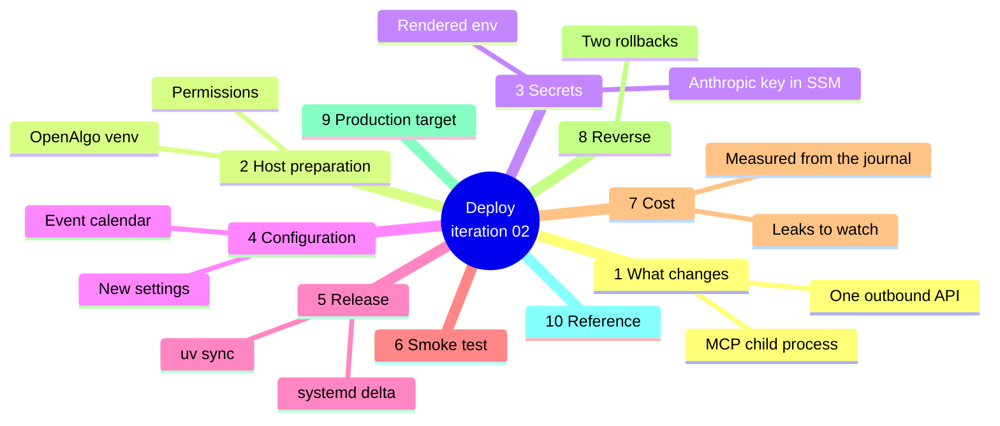
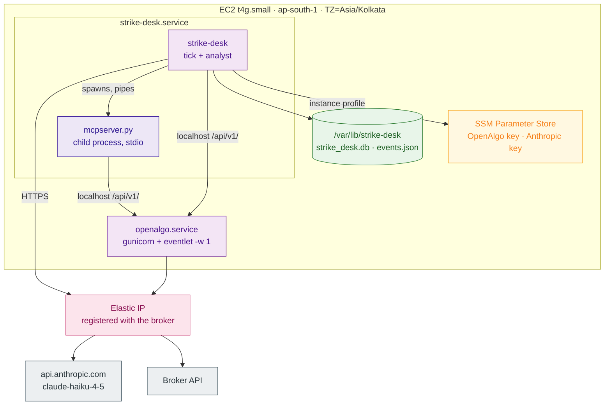

# Iteration 02 — Deployment Guide: putting the analyst on the desk



## 1. What changes on the host

The instance, the Elastic IP, the security group, the IAM role and the systemd unit are all already there from iteration 01, and none of them is replaced. What this deployment adds is a second process inside the same unit and a second outbound destination: `strike-desk` now spawns OpenAlgo's MCP server as a child process over pipes, and it now talks to `api.anthropic.com`. Everything else — the journal, the trace table, the kill switch, the gate — is the same code on the same disk.



The outbound model call leaves from the same Elastic IP the broker whitelisted, which is harmless and worth stating once: the static-IP mandate governs transactional orders, and an inference request carries no order. Nothing about this iteration changes the execution path, because this iteration has no execution path.

## 2. Prepare the host

The MCP server runs from OpenAlgo's own virtual environment, so that environment must exist and the desk's service account must be able to execute it. Confirm the interpreter and the script, then grant traverse-and-read on exactly those two paths — not on the OpenAlgo repository as a whole, which holds the broker credentials in its `.env`:

```bash
ls -l /opt/openalgo/.venv/bin/python /opt/openalgo/mcp/mcpserver.py
sudo chmod o+rX /opt/openalgo /opt/openalgo/mcp
sudo chmod -R o+rX /opt/openalgo/.venv
sudo chmod o+r /opt/openalgo/mcp/mcpserver.py
stat -c '%a %n' /opt/openalgo/.env      # expect 600 or 640 — unchanged, and unreadable
```

Prove the server actually starts under the service account before you ask the desk to depend on it. It speaks JSON-RPC on stdin, so an empty stdin makes it exit quietly; what you are checking is that it imports:

```bash
sudo -u strikedesk env HOME=/var/lib/strike-desk \
  /opt/openalgo/.venv/bin/python /opt/openalgo/mcp/mcpserver.py test-key http://127.0.0.1:5000 \
  </dev/null; echo "exit=$?"
```

An exit code of 0 or a clean EOF means the imports resolved. A `ModuleNotFoundError` means OpenAlgo's dependencies are not installed in that venv (`cd /opt/openalgo && uv sync`), and a permission error means the `chmod` above did not take.

## 3. The Anthropic key

The desk now holds two secrets, and the second one is handled exactly like the first: an SSM `SecureString` that the IAM role already grants (`/strike-desk/*`), rendered at service start into a `tmpfs` file that never touches the disk image.

From your workstation:

```bash
aws ssm put-parameter \
  --name /strike-desk/anthropic-api-key \
  --type SecureString \
  --value "$(read -rs -p 'Anthropic API key: ' k && echo "$k")" \
  --overwrite
```

On the host, extend the renderer to write both lines:

```bash
sudo tee /usr/local/bin/strike-desk-render-env >/dev/null <<'SH'
#!/usr/bin/env bash
set -euo pipefail
umask 077
get() { aws ssm get-parameter --name "$1" --with-decryption --region ap-south-1 \
          --query Parameter.Value --output text; }
{
  printf 'STRIKE_DESK_OPENALGO_API_KEY=%s\n' "$(get /strike-desk/openalgo-api-key)"
  printf 'STRIKE_DESK_ANTHROPIC_API_KEY=%s\n' "$(get /strike-desk/anthropic-api-key)"
} > /run/strike-desk/env
SH
sudo chmod 0755 /usr/local/bin/strike-desk-render-env
```

Set a monthly spend limit on the Anthropic account as well, in the Console under **Billing → Limits**. The journal's cost column tells you what you spent; the console limit is what stops a misconfigured cadence from spending it.

## 4. Configuration

Append the analyst's settings to the non-secret configuration file. Only two values are host-specific — the MCP paths — and the cadence change from 300 to 900 seconds is the one that matters most to the bill:

```bash
sudo tee -a /etc/strike-desk/strike-desk.env >/dev/null <<'ENV'
STRIKE_DESK_INDEX_SPOT_EXCHANGE=NSE_INDEX
STRIKE_DESK_VIX_SYMBOL=INDIAVIX
STRIKE_DESK_REGIME_MODEL=claude-haiku-4-5
STRIKE_DESK_REGIME_TEMPERATURE=0.0
STRIKE_DESK_REGIME_MAX_OUTPUT_TOKENS=1200
STRIKE_DESK_REGIME_MAX_ROUNDS=4
STRIKE_DESK_REGIME_DEADLINE_MARGIN_SECONDS=3
STRIKE_DESK_REGIME_TOOL_OUTPUT_CHARS=8000
STRIKE_DESK_REGIME_RATIONALE_MAX_CHARS=320
STRIKE_DESK_PRICE_IN_PER_MTOK=1.0
STRIKE_DESK_PRICE_OUT_PER_MTOK=5.0
STRIKE_DESK_MCP_PYTHON=/opt/openalgo/.venv/bin/python
STRIKE_DESK_MCP_SERVER_SCRIPT=/opt/openalgo/mcp/mcpserver.py
STRIKE_DESK_MCP_STARTUP_TIMEOUT_SECONDS=45
ENV

sudo sed -i \
  -e 's/^STRIKE_DESK_TICK_INTERVAL_SECONDS=.*/STRIKE_DESK_TICK_INTERVAL_SECONDS=900/' \
  -e 's/^STRIKE_DESK_TICK_BUDGET_SECONDS=.*/STRIKE_DESK_TICK_BUDGET_SECONDS=40/' \
  -e 's/^STRIKE_DESK_SPECIALIST_TIMEOUT_SECONDS=.*/STRIKE_DESK_SPECIALIST_TIMEOUT_SECONDS=25/' \
  /etc/strike-desk/strike-desk.env
```

The event calendar is a data file the trader owns, so it lives in the state directory and is read fresh on every tick — adding tomorrow's policy window needs no restart and no deploy. Seed it now, even if only with an empty list, so the file's absence is a choice rather than an accident:

```bash
sudo -u strikedesk tee /var/lib/strike-desk/events.json >/dev/null <<'JSON'
[
  {"name": "RBI monetary policy", "start": "2026-10-07T09:45:00", "end": "2026-10-07T11:00:00"}
]
JSON
```

Every timestamp in that file is IST. A malformed file makes the desk decline on data quality rather than trade through an announcement, which is the intended failure direction — but it also means a typo silently costs you a session, so `strike-desk regime` after every edit is a habit worth having.

## 5. Release the new code

Deployment is the same immutable-release pattern as before: clone, sync, swap the symlink, restart. The only unit change is memory — the MCP child imports pandas and the OpenAlgo SDK, which adds roughly 250 MB of resident set to the cgroup, and the old 768 MB ceiling would kill the service mid-read.

```bash
RELEASE=$(date +%Y%m%d)-$(git -C /path/to/checkout rev-parse --short HEAD)
sudo git clone --depth 1 <your-repo-url> "/opt/strike-desk/releases/$RELEASE"
cd "/opt/strike-desk/releases/$RELEASE/strike_desk" && sudo uv sync --frozen

sudo sed -i 's/^MemoryMax=.*/MemoryMax=1400M/' /etc/systemd/system/strike-desk.service
sudo systemctl daemon-reload

sudo ln -sfn "/opt/strike-desk/releases/$RELEASE" /opt/strike-desk/current
sudo systemctl restart strike-desk
journalctl -u strike-desk -n 40 --no-pager
```

The startup log now names the model and the registered roles — `roles=('regime',) model=claude-haiku-4-5` — followed by `MCP session open with 6 tools: get_quote, ...`. If instead you see `MCP session unavailable at startup`, the desk is still running and will retry on each read; fix the cause from §2 and the next tick recovers without a restart. If you see the warning about no Anthropic key, the renderer did not write the second line — check `sudo cat /run/strike-desk/env` for both variables.

The new schema arrives on its own: `create_schema()` adds `regime_reads` and its append-only triggers to the existing database on start, leaving every iteration-01 row untouched at `schema_version = 1`.

## 6. Smoke test

Run one read by hand before you trust the cadence, then confirm the tick path and the trace:

```bash
sudo -u strikedesk env $(sudo cat /etc/strike-desk/strike-desk.env | xargs) \
  $(sudo cat /run/strike-desk/env | xargs) \
  /usr/local/bin/uv run --project /opt/strike-desk/current/strike_desk strike-desk regime

sudo kill -USR1 "$(sudo cat /var/lib/strike-desk/strike-desk.pid)"   # one immediate tick

sudo sqlite3 /var/lib/strike-desk/strike_desk.db \
  "SELECT source, status, label, confidence, tool_call_count, model_calls,
          token_cost_micros, latency_ms FROM regime_reads ORDER BY id DESC LIMIT 5;"
sudo sqlite3 /var/lib/strike-desk/strike_desk.db \
  "SELECT outcome, reason_code, regime_label, model_version, token_cost_micros
     FROM decisions ORDER BY id DESC LIMIT 3;"
sudo sqlite3 /var/lib/strike-desk/strike_desk.db \
  "SELECT name, count(*) FROM traces WHERE trace_id =
     (SELECT trace_id FROM regime_reads ORDER BY id DESC LIMIT 1) GROUP BY name;"
```

A healthy picture during market hours: a `tick`-sourced read with status `ok`, a label, two to four tool calls, one to three model calls and a latency in the low seconds; a decision row that declines with a regime reason and carries the label, `claude-haiku-4-5` and a non-zero cost; and a trace holding one `regime.read`, one `regime.model_call` per round and one `regime.tool_call` per call. Then confirm the desk still stops on command — `strike-desk kill`, wait one cadence, `strike-desk resume` — because a new dependency is exactly when the kill switch is worth re-testing.

Tracing needs no new backend. Every span the analyst emits lands in the same `traces` table on the same volume through the span processor iteration 01 installed, at zero marginal cost and with no collector process; the two OTLP variables stay unset in the practice posture.

## 7. Cost

The infrastructure floor is unchanged at roughly **$4.30 a month** — the public IPv4 address and the 8 GB root volume, with compute covered by the T4g free trial — and iteration 01's `aws ce get-cost-and-usage` step still verifies it. What is new is a variable cost, and the journal measures it exactly, so do not estimate what you can query:

```bash
# What today cost, in dollars, and what an average read cost
sudo sqlite3 /var/lib/strike-desk/strike_desk.db \
  "SELECT trading_day, count(*) AS reads,
          printf('$%.4f', sum(token_cost_micros)/1000000.0) AS spend,
          printf('$%.4f', avg(token_cost_micros)/1000000.0) AS per_read,
          sum(input_tokens) AS tok_in, sum(output_tokens) AS tok_out
     FROM regime_reads GROUP BY trading_day ORDER BY trading_day DESC LIMIT 10;"
```

At a 900-second cadence the tradeable window from 09:30 to 15:15 yields about 23 ticks a day, and a two-round read at Haiku's $1/$5 per million tokens costs on the order of a cent — so expect roughly **$0.25 a day, about $5 a month** on top of the infrastructure floor, and treat the query above as the truth when it disagrees. Reads stop entirely outside market hours, on holidays and while a position is open, so a real month usually lands under that.

Four things quietly move that number, and all four are configuration. **Cadence** is linear: dropping back to 300 seconds triples the spend for no additional trading opportunity the risk limits would permit. **`REGIME_MAX_ROUNDS`** is close to linear too, because each round resends the whole conversation, so raising it from 4 to 8 more than doubles the input tokens. **`REGIME_TOOL_OUTPUT_CHARS`** sets how much tool output is resent on every subsequent round — the 8000-character cap is what keeps a full-year history call from becoming a 40,000-token prompt. And the **eval suite** spends real money in CI, which is why the workflow gates it on prompt and analyst changes rather than running it on every push.

Two AWS-side leaks from iteration 01 still apply and are worth re-checking after this deploy, because both bite quietly: an unassociated Elastic IP bills at the same rate as an associated one, and an EBS volume keeps billing after the instance is stopped. The existing $5 AWS budget alarm covers the infrastructure half; the Anthropic console limit from §3 covers the token half.

## 8. Rolling back

There are two rollbacks now, and the cheap one is almost always the right one first. If the analyst is misbehaving — labelling badly, timing out, spending too much — take the reasoning plane out without touching the release:

```bash
sudo sed -i 's/^STRIKE_DESK_ANTHROPIC_API_KEY=.*/# withdrawn/' /run/strike-desk/env
sudo systemctl restart strike-desk
```

The desk keeps ticking, keeps journalling, and declines every tick with `specialist-unavailable` — iteration 01's behaviour exactly, with the journal intact and no code moved. Restore by restarting again, since `ExecStartPre` re-renders the file from SSM.

If the release itself is bad, swap the symlink as before:

```bash
ls /opt/strike-desk/releases
sudo ln -sfn /opt/strike-desk/releases/<previous> /opt/strike-desk/current
cd /opt/strike-desk/current/strike_desk && sudo uv sync --frozen
sudo systemctl restart strike-desk
```

An older release simply ignores the `regime_reads` table it does not know about, and the extra environment variables are read by nothing. Nothing about rolling back deletes a row.

Teardown is unchanged apart from one line — remove the second secret alongside the first:

```bash
aws ssm delete-parameter --name /strike-desk/anthropic-api-key
```

## 9. The production target

Every item below is a tier, a setting or an additional resource. None of them edits the code you wrote.

**Compute.** The MCP child's pandas import pushes steady-state memory to roughly 700 MB across the unit, which fits `t4g.small` but leaves little headroom beside OpenAlgo. Production moves to `t4g.medium` on a one-year Compute Savings Plan (~$15/month) and raises `MemoryMax` accordingly; the free trial ends 31 December 2026 regardless.

**Model tier.** The analyst's tier is `STRIKE_DESK_REGIME_MODEL` plus its two price variables. Promoting the classification step to `claude-sonnet-5` is a three-line environment change at $2/$10 per MTok — roughly double the read cost — and the eval suite is how you decide whether the accuracy is worth it rather than assuming it is. The same two price variables are what you edit the day published prices move.

**Observability.** Set `STRIKE_DESK_OTLP_ENDPOINT` and `STRIKE_DESK_OTLP_HEADERS` and every span additionally flows to self-hosted Langfuse over OTLP — the code path is written and dormant. It earns its keep now rather than in iteration 01, because the trace finally contains model calls, tool arguments and captured tool outputs worth browsing rather than grepping. Langfuse's ClickHouse-backed stack wants roughly 4 vCPU and 8 GB, so it belongs on its own instance in the same VPC; self-hosting stays mandatory because these traces carry live positions and the trading logic itself.

**Alarms.** With the CloudWatch agent installed, two metrics matter beyond iteration 01's heartbeat age and restart count: the count of `regime_reads` rows with status `degraded` or `ungrounded` in the last hour, and the day's `token_cost_micros` sum. Both are one `sqlite3` query in a five-minute cron that puts a custom metric; the first catches a broken tool surface, the second catches a runaway loop before the invoice does.

**Backups.** The daily EBS snapshot policy and the nightly `sqlite3 .backup` to an Object-Locked S3 bucket now protect the evidence trail as well as the decisions, which is the part a regulator would ask for. Nothing about the backup configuration changes; the value of it does.

## 10. Reference

| Command | Purpose |
| --- | --- |
| `strike-desk regime` | One out-of-band read, printed and journalled with `source='cli'` |
| `strike-desk status` | Roles, model, today's decisions, today's reads and spend |
| `sudo kill -USR1 $(sudo cat /var/lib/strike-desk/strike-desk.pid)` | Force one immediate tick |
| `sudo cat /run/strike-desk/env` | Confirm both secrets rendered |
| `journalctl -u strike-desk -f` | Live log, including MCP session lifecycle lines |
| `sqlite3 ... "SELECT ... FROM regime_reads ..."` (§7) | Measure the day's token spend |
| `sudo sed -i 's/^STRIKE_DESK_ANTHROPIC_API_KEY=.*/# withdrawn/' /run/strike-desk/env` | Withdraw the reasoning plane without a rollback |

| Path | Owner | Contents |
| --- | --- | --- |
| `/etc/strike-desk/strike-desk.env` | root:strikedesk 0640 | Non-secret configuration, including the model and MCP paths |
| `/run/strike-desk/env` | strikedesk 0600, tmpfs | Both API keys, rendered per start, gone on reboot |
| `/var/lib/strike-desk/events.json` | strikedesk 0640 | The event calendar, IST, read fresh every tick |
| `/opt/openalgo/.venv/bin/python` | openalgo, o+rX | The interpreter the MCP child runs under |

## 11. Limitations

The MCP server takes the OpenAlgo API key as a command-line argument, so it is visible in `ps` output on the host. That is inside the existing single-user trust boundary — server access already equals full control of the broker session — but it is a property to know about rather than one to forget.

A permanently broken MCP server or an exhausted Anthropic balance produces a decline every cadence interval, visible in the log and in `strike-desk status`, and nothing pushes that to the trader; operator alerting is a separate use case and until it lands the daily `status` read is the operational habit that replaces it.

The token estimate in §7 is arithmetic over an assumed two-round read; real prompts and real market data move it, which is exactly why the cost check is a query against `regime_reads` rather than a table in this document. And the compute half of the infrastructure floor reaching $0 still depends on the T4g free trial, which currently runs only to 31 December 2026.

---
**Sources**

*Repo files:* `040_iterations/iteration-01/05_deployment_guide.md` · `040_iterations/iteration-02/02_implementation_guide.md` · `030_design/04_tech_stack.md` · `mcp/README.md` · `CLAUDE.md`

*Web (accessed 2026-08-13):*
- [Claude Platform Docs — Models overview (Haiku 4.5 and Sonnet 5 pricing)](https://platform.claude.com/docs/en/about-claude/models/overview)
- [AWS — Amazon EC2 T4g free trial (750 hours/month through 31 Dec 2026)](https://repost.aws/articles/ARi_gf6vo6TuqNtMQdiYPKyA/announcing-amazon-ec2-t4g-free-trial-extension)
- [AWS News Blog — public IPv4 address charge ($0.005/hour)](https://aws.amazon.com/blogs/aws/new-aws-public-ipv4-address-charge-public-ip-insights)
- [Langfuse — self-hosting requirements](https://langfuse.com/self-hosting)
- [Langfuse — OpenTelemetry endpoint and OTLP environment variables](https://langfuse.com/integrations/native/opentelemetry)
- [OpenAlgo — MCP server stdio launch contract](https://github.com/marketcalls/openalgo/blob/main/mcp/README.md)
