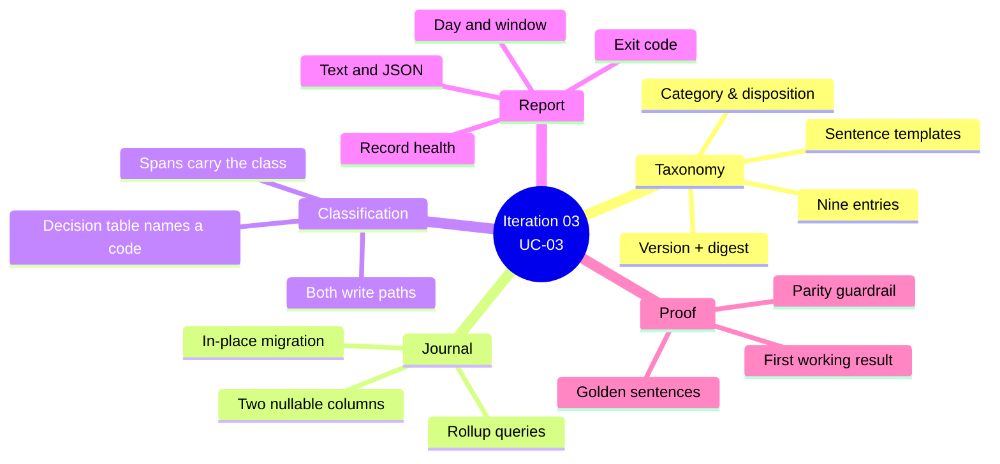
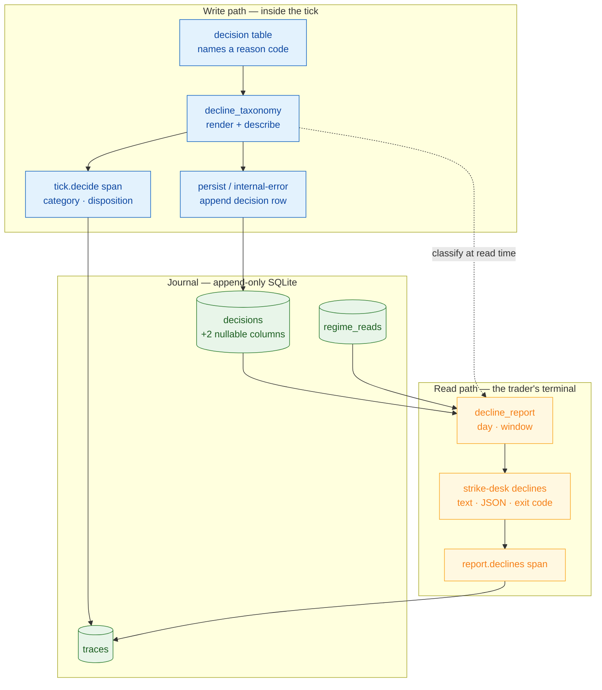

# Iteration 03 — Implementation Guide: the decline, made countable



You are adding the layer that makes the desk's most common act — refusing to trade — into something you can count. The behaviour of the tick does not change in this iteration: the same branches fire on the same conditions and produce the same verdicts. What changes is that each verdict now names a code the system knows about, the sentence is written in one place instead of nine, every decision row records what *kind* of refusal it was, and a command turns a day of that into a page you can read in ten seconds.

Read `01_use_case.md` first for the acceptance criteria; this guide implements them file by file, and every file below is complete and ready to paste over its predecessor. `03_manual_test_cases.md` and `04_test_automation.md` prove it, and `05_deployment_guide.md` puts it on the trading host.

## 1. What you are adding, and the shape of it

Two modules are new. `decline_taxonomy.py` is a registry: nine frozen entries, each pairing a reason code with the category and disposition it is counted under and the templates it is phrased with, validated at import and digested so a change is attributable. `decline_report.py` is a reader: pure functions that turn journal rollups into a `DayReport` or a `WindowReport` and render either as text or JSON.

Four files change around them. `journal.py` grows the two columns, an in-place migration and the grouped queries the report needs. `graph.py` stops writing sentences and starts naming codes, and stamps the class onto the span and the row. `runner.py` does the same on its internal-error path — it is the second place a decision is appended, and a classification layer that misses it leaves every crashed tick uncategorised. `__main__.py` grows the `declines` command and re-points `status` at the same report code.

The dependency direction is worth holding in your head while you work: the taxonomy imports nothing of the desk except its error base, the journal imports nothing of the taxonomy at all, and the report imports both. Nothing in the write path depends on the report, so a bug in reporting can never stop a tick from recording a decision.



## 2. Prerequisites and pinned versions

Nothing new is installed. This slice adds no dependency, no service and no network call — it is Python, SQLite and the packages iteration 02 already pinned. You need the working tree from iteration 02, Python 3.12 and `uv`, and a journal to read: either the one on the host or a scratch one you fill by running a few ticks.

The only change to the manifest is the project version, which moves to `0.3.0` so a deployed host can tell which code wrote a row. Paste the file whole.

### `strike_desk/pyproject.toml`

```toml
[project]
name = "strike-desk"
version = "0.3.0"
description = "Agentic options-buying desk on OpenAlgo - tick, regime analyst and decline record."
requires-python = ">=3.12"
dependencies = [
    "langgraph==1.2.11",
    "langgraph-checkpoint-sqlite==3.1.1",
    "langchain-core==1.5.4",
    "langchain-anthropic==1.5.6",
    "langchain-mcp-adapters==0.3.2",
    "mcp==1.29.0",
    "anthropic==0.121.0",
    "sqlalchemy==2.0.51",
    "httpx==0.28.1",
    "pydantic==2.13.4",
    "pydantic-settings==2.14.2",
    "apscheduler==3.11.3",
    "opentelemetry-sdk==1.44.0",
    "opentelemetry-exporter-otlp-proto-http==1.44.0",
    "tzdata>=2025.2",
]

[project.scripts]
strike-desk = "strike_desk.__main__:main"

[dependency-groups]
dev = [
    "pytest==9.1.1",
    "pytest-cov==7.1.0",
    "respx==0.23.1",
    "freezegun==1.5.5",
    "ruff==0.15.22",
    "bandit>=1.8",
    "pip-audit>=2.7",
]

[build-system]
requires = ["hatchling"]
build-backend = "hatchling.build"

[tool.hatch.build.targets.wheel]
packages = ["src/strike_desk"]

[tool.ruff]
line-length = 100
target-version = "py312"

[tool.ruff.lint]
select = ["E", "F", "W", "I", "B", "C4", "UP"]

[tool.pytest.ini_options]
testpaths = ["tests"]
addopts = "-q --strict-markers -m 'not evals'"
markers = [
    "evals: live-model regime evaluations; need ANTHROPIC_API_KEY and cost money",
]
filterwarnings = ["error::DeprecationWarning:strike_desk.*"]

[tool.coverage.run]
source = ["strike_desk"]
omit = [
    "*/strike_desk/__main__.py",
    "*/strike_desk/service.py",
    # Its session lifecycle is proven against a real MCP server by hand, not by a double.
    "*/strike_desk/mcp_toolbox.py",
]

[tool.coverage.report]
exclude_lines = [
    "pragma: no cover",
    "if __name__ == .__main__.:",
]
```

The tree you are working in gains two source modules and, from `04_test_automation.md`, four test files and a golden fixture:

```
strike_desk/
├── pyproject.toml                         # version 0.3.0
├── src/strike_desk/
│   ├── config.py                          # + reason_text_max_chars, report_default_days
│   ├── decline_report.py                  # new
│   ├── decline_taxonomy.py                # new
│   ├── graph.py                           # decision table names codes
│   ├── journal.py                         # schema 3, migration, rollups
│   ├── runner.py                          # internal-error path classified
│   └── __main__.py                        # declines command, status via the report
└── tests/
    ├── golden/reason_text.json            # new
    ├── journal_fixtures.py                # new
    ├── test_decline_report.py             # new
    ├── test_decline_taxonomy.py           # new
    ├── test_journal_migration.py          # new
    └── test_tick_declines.py              # new
```

## 3. The taxonomy

Start here, because everything else refers to it. An entry is a frozen dataclass holding the code, the outcome it belongs to, its category, its disposition, a summary the report prints, and a mapping of named sentence templates. Most entries have one template under the key `default`; two have more, because the same code is reached from genuinely different places. `data-quality` reads differently when the *book* could not be read than when the *regime* could not, and `specialist-unavailable` reads differently when no specialist answered at all than when the regime was fine but no strategist exists to act on it. Those are variants of one code rather than separate codes: splitting them would give you two counts of the same operational fact and churn the frozen scenario suite for nothing, while the sentence already says which happened.

The categories answer *what kind of thing stopped the trade* — `book`, `data`, `regime`, `specialist`, `system` — and are what you group by when you want to know where the desk's time goes. The dispositions answer *how worried you should be*. `routine` is the playbook working: the regime was not one you trade, or you already hold a position. `degraded` is the environment failing: a feed you could not read, a specialist that timed out. `defect` is the desk itself misbehaving: an ungrounded read, a crashed tick. Only `defect` changes an exit code, because only `defect` is something you must go and fix.

`_validate` runs at import and refuses a duplicated code, an unknown category or disposition, a missing summary, a missing `default` template or an empty one. That turns a typo in this file into a service that will not start, which is the correct failure for a table the whole journal is classified against. `compute_digest` hashes the entries canonically so the twelve-hex-character digest moves whenever any code, category, disposition, summary or sentence moves; `TAXONOMY_ARTIFACT` glues it to the version and is what the report and `status` print.

`render` is the only way a sentence is produced. It formats the template with a mapping that substitutes `unspecified` for a field a branch forgot rather than raising — a tick must be able to record a verdict it cannot phrase perfectly — collapses whitespace so a template written across source lines is one line, fits the deterministic part inside the cap, and then appends the analyst's rationale after `Analyst: ` only if at least a couple of dozen characters remain. The rationale is the part that gets cut; the verdict never is. `describe` is `render`'s read-time counterpart: it never raises, and it answers for a code this build does not define with an `unknown`/`defect` placeholder, which is what lets a report read a journal written by any release.

### `strike_desk/src/strike_desk/decline_taxonomy.py`

```python
"""The decline taxonomy: every reason code the desk can record, with the category it
belongs to, the disposition it implies, and the sentence the trader reads."""

from __future__ import annotations

import hashlib
import json
import logging
from collections.abc import Mapping
from dataclasses import dataclass
from types import MappingProxyType

from .errors import StrikeDeskError

logger = logging.getLogger(__name__)

TAXONOMY_VERSION = "dt-1"

CATEGORY_BOOK = "book"
CATEGORY_DATA = "data"
CATEGORY_REGIME = "regime"
CATEGORY_SPECIALIST = "specialist"
CATEGORY_SYSTEM = "system"
CATEGORY_UNKNOWN = "unknown"
CATEGORIES = frozenset(
    {CATEGORY_BOOK, CATEGORY_DATA, CATEGORY_REGIME, CATEGORY_SPECIALIST, CATEGORY_SYSTEM}
)

DISPOSITION_ROUTINE = "routine"
DISPOSITION_DEGRADED = "degraded"
DISPOSITION_DEFECT = "defect"
DISPOSITIONS = frozenset({DISPOSITION_ROUTINE, DISPOSITION_DEGRADED, DISPOSITION_DEFECT})

OUTCOMES = frozenset({"decline", "hold"})

RATIONALE_PREFIX = " Analyst: "
TRUNCATION_MARK = "..."
MIN_RATIONALE_ROOM = 24


class ReasonCodeUnknown(StrikeDeskError):
    """A reason code was rendered that this build's taxonomy does not define."""


@dataclass(frozen=True)
class ReasonEntry:
    """One reason code: what it means, how it is counted, how it reads."""

    code: str
    outcome: str
    category: str
    disposition: str
    summary: str
    templates: Mapping[str, str]

    def template(self, variant: str) -> str:
        """The sentence for a variant, falling back to the entry's default."""
        template = self.templates.get(variant)
        if template is None:
            logger.warning("reason %r has no %r variant; using its default", self.code, variant)
            return self.templates["default"]
        return template


def _entry(
    code: str,
    *,
    outcome: str,
    category: str,
    disposition: str,
    summary: str,
    **templates: str,
) -> ReasonEntry:
    return ReasonEntry(
        code=code,
        outcome=outcome,
        category=category,
        disposition=disposition,
        summary=summary,
        templates=MappingProxyType(dict(templates)),
    )


_ENTRIES: tuple[ReasonEntry, ...] = (
    _entry(
        "position-open",
        outcome="hold",
        category=CATEGORY_BOOK,
        disposition=DISPOSITION_ROUTINE,
        summary="a position is already open",
        default=(
            "Held: {count} open {index} position(s) ({symbols}). "
            "This tick manages the book; it does not add to it."
        ),
    ),
    _entry(
        "data-quality",
        outcome="decline",
        category=CATEGORY_DATA,
        disposition=DISPOSITION_DEGRADED,
        summary="the desk could not read what it needed",
        default=(
            "Declined: live data could not be read ({detail}). "
            "The desk does not act on a market it could not see."
        ),
        book=(
            "Declined: the book could not be read from OpenAlgo ({detail}). "
            "An unreadable book is never assumed flat."
        ),
        regime=(
            "Declined: the regime could not be read from live data ({detail}). "
            "The desk does not classify a market it could not see."
        ),
    ),
    _entry(
        "specialist-unavailable",
        outcome="decline",
        category=CATEGORY_SPECIALIST,
        disposition=DISPOSITION_DEGRADED,
        summary="a specialist the tick needed was not usable",
        default="Declined: no usable '{role}' specialist ({detail}).",
        no_strategist=(
            "Declined: regime '{label}' is tradeable at {confidence} confidence, but no "
            "'{role}' specialist is registered to propose a contract. "
            "A regime read alone is never an entry."
        ),
    ),
    _entry(
        "specialist-timeout",
        outcome="decline",
        category=CATEGORY_SPECIALIST,
        disposition=DISPOSITION_DEGRADED,
        summary="a specialist did not answer in time",
        default="Declined: the '{role}' specialist did not answer within its timeout ({detail}).",
    ),
    _entry(
        "regime-not-tradeable",
        outcome="decline",
        category=CATEGORY_REGIME,
        disposition=DISPOSITION_ROUTINE,
        summary="the regime is not one this playbook trades",
        default="Declined: regime read as '{label}', which this playbook does not trade.",
    ),
    _entry(
        "regime-low-confidence",
        outcome="decline",
        category=CATEGORY_REGIME,
        disposition=DISPOSITION_ROUTINE,
        summary="the regime was tradeable but not confident enough",
        default=(
            "Declined: regime '{label}' is tradeable but confidence {confidence} "
            "is below the {floor} floor."
        ),
    ),
    _entry(
        "regime-ungrounded",
        outcome="decline",
        category=CATEGORY_REGIME,
        disposition=DISPOSITION_DEFECT,
        summary="the regime read cited data it never fetched",
        default=(
            "Declined: the regime read cited data it did not fetch ({detail}). "
            "An ungrounded read is a defect, not an opinion."
        ),
    ),
    _entry(
        "tick-timeout",
        outcome="decline",
        category=CATEGORY_SYSTEM,
        disposition=DISPOSITION_DEGRADED,
        summary="the tick ran out of its budget",
        default=(
            "Declined: the tick exceeded its {budget}s budget "
            "before a decision could be assembled."
        ),
    ),
    _entry(
        "internal-error",
        outcome="decline",
        category=CATEGORY_SYSTEM,
        disposition=DISPOSITION_DEFECT,
        summary="the tick raised before it could decide",
        default=(
            "Declined: the tick raised {error} before assembling a decision. "
            "The desk stays out when it cannot reason."
        ),
    ),
)


def _validate(entries: tuple[ReasonEntry, ...]) -> Mapping[str, ReasonEntry]:
    """A malformed taxonomy is an import-time failure, not a runtime surprise."""
    registry: dict[str, ReasonEntry] = {}
    for item in entries:
        if item.code in registry:
            raise ValueError(f"duplicate reason code {item.code!r}")
        if item.outcome not in OUTCOMES:
            raise ValueError(f"{item.code!r}: outcome {item.outcome!r} is not a no-trade outcome")
        if item.category not in CATEGORIES:
            raise ValueError(f"{item.code!r}: category {item.category!r} is not a known category")
        if item.disposition not in DISPOSITIONS:
            raise ValueError(f"{item.code!r}: disposition {item.disposition!r} is not known")
        if not item.summary.strip():
            raise ValueError(f"{item.code!r}: needs a summary for the report")
        if "default" not in item.templates:
            raise ValueError(f"{item.code!r}: needs a 'default' sentence template")
        for name, template in item.templates.items():
            if not template.strip():
                raise ValueError(f"{item.code!r}: template {name!r} is empty")
        registry[item.code] = item
    return MappingProxyType(registry)


REASONS: Mapping[str, ReasonEntry] = _validate(_ENTRIES)


def compute_digest(entries: tuple[ReasonEntry, ...]) -> str:
    """A content digest over the taxonomy, so a wording change is attributable."""
    canonical = json.dumps(
        [
            {
                "code": item.code,
                "outcome": item.outcome,
                "category": item.category,
                "disposition": item.disposition,
                "summary": item.summary,
                "templates": dict(item.templates),
            }
            for item in entries
        ],
        sort_keys=True,
        separators=(",", ":"),
    )
    return hashlib.sha256(canonical.encode("utf-8")).hexdigest()[:12]


TAXONOMY_DIGEST = compute_digest(_ENTRIES)
TAXONOMY_ARTIFACT = f"{TAXONOMY_VERSION}+{TAXONOMY_DIGEST}"

_UNKNOWN_TEMPLATES: Mapping[str, str] = MappingProxyType({"default": "Declined: {detail}."})


def known_codes() -> frozenset[str]:
    """Every reason code this build can classify."""
    return frozenset(REASONS)


def entry(code: str) -> ReasonEntry:
    """The entry for a code. Raises when the code is not in the taxonomy."""
    try:
        return REASONS[code]
    except KeyError as exc:
        raise ReasonCodeUnknown(f"reason code {code!r} is not in the taxonomy") from exc


def describe(code: str) -> ReasonEntry:
    """The entry for a code, or an ``unknown``/``defect`` placeholder for a foreign one.

    Reports read journals written by other releases, so classification at read time must
    never raise: an unrecognised code is surfaced as a defect rather than dropped.
    """
    found = REASONS.get(code)
    if found is not None:
        return found
    return ReasonEntry(
        code=code,
        outcome="decline",
        category=CATEGORY_UNKNOWN,
        disposition=DISPOSITION_DEFECT,
        summary="a reason code this build does not define",
        templates=_UNKNOWN_TEMPLATES,
    )


class _Defaulting(dict):
    """Renders a missing template field visibly rather than raising inside a tick."""

    def __missing__(self, key: str) -> str:
        logger.warning("reason template field %r was not supplied", key)
        return "unspecified"


def _fit(text: str, max_chars: int) -> str:
    if len(text) <= max_chars:
        return text
    logger.warning("reason sentence exceeded %d characters and was truncated", max_chars)
    return text[: max_chars - len(TRUNCATION_MARK)].rstrip() + TRUNCATION_MARK


def render(
    code: str,
    *,
    max_chars: int,
    variant: str = "default",
    rationale: str | None = None,
    **fields: object,
) -> str:
    """The trader-facing sentence for one verdict: deterministic, one line, capped."""
    text = " ".join(entry(code).template(variant).format_map(_Defaulting(fields)).split())
    text = _fit(text, max_chars)
    clean = " ".join((rationale or "").split())
    if not clean:
        return text
    room = max_chars - len(text) - len(RATIONALE_PREFIX)
    if room < MIN_RATIONALE_ROOM:
        return text
    if len(clean) > room:
        clean = clean[: room - len(TRUNCATION_MARK)].rstrip() + TRUNCATION_MARK
    return f"{text}{RATIONALE_PREFIX}{clean}"
```

## 4. The journal grows two columns

`decisions` gains `reason_category` and `reason_disposition`. Both are nullable and neither has a default, and that is deliberate on three counts. SQLite's `ALTER TABLE ADD COLUMN` only accepts a new column that allows `NULL` or carries a constant default, so nullable is what makes an in-place widening possible at all. The append-only triggers make `UPDATE` impossible, so existing rows can never be filled in and a `NOT NULL` column could never be added to a populated table. And a nullable column is what makes a rollback survivable: the iteration-02 binary selects columns explicitly and inserts without these two, so it keeps writing valid rows into a widened table.

`create_all` creates tables it does not find but never alters one it does, so the migration is explicit. `_add_missing_columns` asks `PRAGMA table_info` what the table actually has and issues one `ALTER TABLE` per absent column inside a single transaction. It is idempotent, it skips a table that does not exist yet because `create_all` owns that case, and it runs from `create_schema()` — which every entry point calls, the service and all four CLI commands alike, so there is no path that opens an old database and then queries a column that is not there.

The reporting reads are five grouped queries and one bounds lookup. `decision_rollup` is the one that matters: a single `GROUP BY` over outcome, reason code, stored category and stored disposition, which lets the database do the counting and hands the report both the counts and the stored classification it needs in order to detect unstamped and drifted rows. The bounds are two ordered `LIMIT 1` selects rather than `min`/`max` aggregates, so SQLAlchemy's result processing on the timestamp column applies exactly as it does everywhere else. Note that `decision_cost_micros` sums the *decisions* table while the older `token_cost_micros` sums *regime_reads*: the first is what the day's ticks spent, the second includes out-of-band CLI reads, and the report wants the first.

### `strike_desk/src/strike_desk/journal.py`

```python
"""Append-only SQLite journal: ``decisions``, ``traces`` and ``regime_reads``."""

from __future__ import annotations

import logging
import sqlite3
from collections.abc import Iterator, Sequence
from contextlib import contextmanager
from datetime import datetime
from pathlib import Path
from typing import Any

from sqlalchemy import (
    DDL,
    Boolean,
    DateTime,
    Float,
    Integer,
    String,
    Text,
    create_engine,
    event,
    func,
    select,
)
from sqlalchemy.exc import SQLAlchemyError
from sqlalchemy.orm import DeclarativeBase, Mapped, Session, mapped_column, sessionmaker
from sqlalchemy.pool import NullPool

from .errors import JournalWriteError

logger = logging.getLogger(__name__)

SCHEMA_VERSION = 3


class Base(DeclarativeBase):
    """Declarative base for the Strike Desk journal."""


class Decision(Base):
    """One row per completed tick. Never updated, never deleted."""

    __tablename__ = "decisions"

    id: Mapped[int] = mapped_column(Integer, primary_key=True, autoincrement=True)
    tick_id: Mapped[str] = mapped_column(String(36), unique=True, index=True, nullable=False)
    trace_id: Mapped[str] = mapped_column(String(32), index=True, nullable=False)
    created_at_utc: Mapped[datetime] = mapped_column(DateTime(timezone=True), nullable=False)
    trading_day: Mapped[str] = mapped_column(String(10), index=True, nullable=False)
    index_symbol: Mapped[str] = mapped_column(String(32), nullable=False)
    trigger: Mapped[str] = mapped_column(String(16), nullable=False)
    outcome: Mapped[str] = mapped_column(String(16), index=True, nullable=False)
    reason_code: Mapped[str] = mapped_column(String(48), index=True, nullable=False)
    reason_text: Mapped[str] = mapped_column(Text, nullable=False)
    # Written from the taxonomy, nullable because a journal from an earlier release has
    # rows that predate these columns and an append-only table can never be backfilled.
    reason_category: Mapped[str | None] = mapped_column(String(24), index=True, nullable=True)
    reason_disposition: Mapped[str | None] = mapped_column(String(16), nullable=True)
    regime_label: Mapped[str | None] = mapped_column(String(32), nullable=True)
    regime_confidence: Mapped[float | None] = mapped_column(Float, nullable=True)
    book_state_json: Mapped[str] = mapped_column(Text, nullable=False)
    prompt_set_version: Mapped[str] = mapped_column(String(32), nullable=False)
    model_version: Mapped[str] = mapped_column(String(128), nullable=False)
    token_cost_micros: Mapped[int] = mapped_column(Integer, nullable=False, default=0)
    latency_ms: Mapped[int] = mapped_column(Integer, nullable=False)
    trace_complete: Mapped[bool] = mapped_column(Boolean, nullable=False, default=True)
    schema_version: Mapped[int] = mapped_column(Integer, nullable=False, default=SCHEMA_VERSION)


class TraceSpan(Base):
    """One row per finished OpenTelemetry span. Never updated, never deleted."""

    __tablename__ = "traces"

    id: Mapped[int] = mapped_column(Integer, primary_key=True, autoincrement=True)
    trace_id: Mapped[str] = mapped_column(String(32), index=True, nullable=False)
    span_id: Mapped[str] = mapped_column(String(16), unique=True, nullable=False)
    parent_span_id: Mapped[str | None] = mapped_column(String(16), nullable=True)
    name: Mapped[str] = mapped_column(String(64), nullable=False)
    started_at_utc: Mapped[datetime] = mapped_column(DateTime(timezone=True), nullable=False)
    ended_at_utc: Mapped[datetime] = mapped_column(DateTime(timezone=True), nullable=False)
    duration_ms: Mapped[int] = mapped_column(Integer, nullable=False)
    status: Mapped[str] = mapped_column(String(16), nullable=False)
    attributes_json: Mapped[str] = mapped_column(Text, nullable=False)


class RegimeRead(Base):
    """One row per regime classification attempt. Never updated, never deleted."""

    __tablename__ = "regime_reads"

    id: Mapped[int] = mapped_column(Integer, primary_key=True, autoincrement=True)
    read_id: Mapped[str] = mapped_column(String(36), unique=True, nullable=False)
    tick_id: Mapped[str] = mapped_column(String(48), index=True, nullable=False)
    trace_id: Mapped[str] = mapped_column(String(32), index=True, nullable=False)
    created_at_utc: Mapped[datetime] = mapped_column(DateTime(timezone=True), nullable=False)
    trading_day: Mapped[str] = mapped_column(String(10), index=True, nullable=False)
    index_symbol: Mapped[str] = mapped_column(String(32), nullable=False)
    source: Mapped[str] = mapped_column(String(8), nullable=False)  # tick | cli
    status: Mapped[str] = mapped_column(String(16), index=True, nullable=False)
    label: Mapped[str | None] = mapped_column(String(32), index=True, nullable=True)
    confidence: Mapped[float | None] = mapped_column(Float, nullable=True)
    rationale: Mapped[str] = mapped_column(Text, nullable=False)
    evidence_json: Mapped[str] = mapped_column(Text, nullable=False)
    defect: Mapped[str | None] = mapped_column(Text, nullable=True)
    tool_call_count: Mapped[int] = mapped_column(Integer, nullable=False, default=0)
    tool_error_count: Mapped[int] = mapped_column(Integer, nullable=False, default=0)
    model_calls: Mapped[int] = mapped_column(Integer, nullable=False, default=0)
    model_version: Mapped[str] = mapped_column(String(128), nullable=False)
    input_tokens: Mapped[int] = mapped_column(Integer, nullable=False, default=0)
    output_tokens: Mapped[int] = mapped_column(Integer, nullable=False, default=0)
    token_cost_micros: Mapped[int] = mapped_column(Integer, nullable=False, default=0)
    prompt_name: Mapped[str] = mapped_column(String(64), nullable=False)
    prompt_version: Mapped[str] = mapped_column(String(32), nullable=False)
    prompt_digest: Mapped[str] = mapped_column(String(64), nullable=False)
    prompt_set_version: Mapped[str] = mapped_column(String(32), nullable=False)
    latency_ms: Mapped[int] = mapped_column(Integer, nullable=False)
    schema_version: Mapped[int] = mapped_column(Integer, nullable=False, default=SCHEMA_VERSION)


# Append-only enforcement lives in the database, not in application discipline.
for _table in (Decision.__table__, TraceSpan.__table__, RegimeRead.__table__):
    for _operation in ("UPDATE", "DELETE"):
        event.listen(
            _table,
            "after_create",
            DDL(
                f"CREATE TRIGGER IF NOT EXISTS {_table.name}_no_{_operation.lower()} "
                f"BEFORE {_operation} ON {_table.name} "
                f"BEGIN SELECT RAISE(ABORT, '{_table.name} is append-only'); END;"
            ),
        )

# Columns added after a table shipped. Always nullable and never given a default, so an
# older binary can still write rows and a newer one can still read the older rows.
ADDED_COLUMNS: tuple[tuple[str, str, str], ...] = (
    ("decisions", "reason_category", "VARCHAR(24)"),
    ("decisions", "reason_disposition", "VARCHAR(16)"),
)


def _configure_connection(dbapi_connection: Any, _record: Any) -> None:
    """Apply the SQLite pragmas an audit journal needs on every fresh connection."""
    if not isinstance(dbapi_connection, sqlite3.Connection):
        return
    cursor = dbapi_connection.cursor()
    try:
        cursor.execute("PRAGMA journal_mode=WAL")
        cursor.execute("PRAGMA busy_timeout=5000")
        cursor.execute("PRAGMA foreign_keys=ON")
        cursor.execute("PRAGMA synchronous=FULL")
    finally:
        cursor.close()


class Journal:
    """Repository over the append-only journal database."""

    def __init__(self, db_path: Path) -> None:
        db_path.parent.mkdir(parents=True, exist_ok=True)
        self._path = db_path
        self._engine = create_engine(f"sqlite:///{db_path}", poolclass=NullPool, future=True)
        event.listen(self._engine, "connect", _configure_connection)
        self._sessionmaker = sessionmaker(bind=self._engine, expire_on_commit=False)

    @property
    def path(self) -> Path:
        return self._path

    def create_schema(self) -> None:
        """Create tables and triggers if absent, then add any column this release added."""
        Base.metadata.create_all(self._engine)
        self._add_missing_columns()

    def _add_missing_columns(self) -> None:
        """Widen an existing table in place. No row is read, rewritten or deleted."""
        with self._engine.begin() as connection:
            for table, column, column_type in ADDED_COLUMNS:
                # Every name interpolated below comes from ADDED_COLUMNS, a module
                # constant; no caller-supplied value ever reaches this SQL.
                rows = connection.exec_driver_sql(f"PRAGMA table_info({table})").fetchall()
                present = {str(row[1]) for row in rows}
                if not present or column in present:
                    continue
                connection.exec_driver_sql(
                    f"ALTER TABLE {table} ADD COLUMN {column} {column_type}"
                )
                logger.info("journal migration: added %s.%s", table, column)

    @contextmanager
    def session_scope(self) -> Iterator[Session]:
        """A session that commits on success and is closed on every path."""
        session = self._sessionmaker()
        try:
            yield session
            session.commit()
        except Exception:
            session.rollback()
            raise
        finally:
            session.close()

    def record_decision(self, **fields: Any) -> str:
        """Append one decision row. Raises JournalWriteError so the tick fails closed."""
        try:
            with self.session_scope() as session:
                session.add(Decision(**fields))
        except SQLAlchemyError as exc:
            raise JournalWriteError(f"could not append decision: {exc.__class__.__name__}") from exc
        return str(fields["tick_id"])

    def record_span(self, **fields: Any) -> None:
        """Append one trace span row."""
        try:
            with self.session_scope() as session:
                session.add(TraceSpan(**fields))
        except SQLAlchemyError as exc:
            raise JournalWriteError(f"could not append span: {exc.__class__.__name__}") from exc

    def record_regime_read(self, **fields: Any) -> str:
        """Append one regime read. Raises JournalWriteError so the tick fails closed."""
        try:
            with self.session_scope() as session:
                session.add(RegimeRead(**fields))
        except SQLAlchemyError as exc:
            raise JournalWriteError(
                f"could not append regime read: {exc.__class__.__name__}"
            ) from exc
        return str(fields["read_id"])

    def count_decisions(self, trading_day: str) -> int:
        with self.session_scope() as session:
            statement = select(func.count()).select_from(Decision).where(
                Decision.trading_day == trading_day
            )
            return int(session.execute(statement).scalar_one())

    def list_decisions(self, trading_day: str, limit: int = 100) -> Sequence[Decision]:
        with self.session_scope() as session:
            statement = (
                select(Decision)
                .where(Decision.trading_day == trading_day)
                .order_by(Decision.created_at_utc.desc())
                .limit(limit)
            )
            return list(session.execute(statement).scalars())

    def list_regime_reads(self, trading_day: str, limit: int = 100) -> Sequence[RegimeRead]:
        with self.session_scope() as session:
            statement = (
                select(RegimeRead)
                .where(RegimeRead.trading_day == trading_day)
                .order_by(RegimeRead.created_at_utc.desc())
                .limit(limit)
            )
            return list(session.execute(statement).scalars())

    def token_cost_micros(self, trading_day: str) -> int:
        """What the day's reads have cost, in USD micro-dollars."""
        with self.session_scope() as session:
            statement = select(func.coalesce(func.sum(RegimeRead.token_cost_micros), 0)).where(
                RegimeRead.trading_day == trading_day
            )
            return int(session.execute(statement).scalar_one())

    # --- reporting reads ----------------------------------------------------

    def decision_rollup(self, trading_day: str) -> list[dict[str, Any]]:
        """One row per (outcome, reason code, stored category) group, with its count."""
        with self.session_scope() as session:
            statement = (
                select(
                    Decision.outcome,
                    Decision.reason_code,
                    Decision.reason_category,
                    Decision.reason_disposition,
                    func.count().label("total"),
                )
                .where(Decision.trading_day == trading_day)
                .group_by(
                    Decision.outcome,
                    Decision.reason_code,
                    Decision.reason_category,
                    Decision.reason_disposition,
                )
            )
            return [
                {
                    "outcome": str(row.outcome),
                    "reason_code": str(row.reason_code),
                    "reason_category": row.reason_category,
                    "reason_disposition": row.reason_disposition,
                    "count": int(row.total),
                }
                for row in session.execute(statement)
            ]

    def decision_bounds(self, trading_day: str) -> tuple[datetime | None, datetime | None]:
        """When the day's first and last decisions were written."""
        with self.session_scope() as session:
            base = select(Decision.created_at_utc).where(Decision.trading_day == trading_day)
            first = session.execute(
                base.order_by(Decision.created_at_utc.asc()).limit(1)
            ).scalar_one_or_none()
            last = session.execute(
                base.order_by(Decision.created_at_utc.desc()).limit(1)
            ).scalar_one_or_none()
            return first, last

    def decision_cost_micros(self, trading_day: str) -> int:
        """What the day's decisions cost in tokens, in USD micro-dollars."""
        with self.session_scope() as session:
            statement = select(func.coalesce(func.sum(Decision.token_cost_micros), 0)).where(
                Decision.trading_day == trading_day
            )
            return int(session.execute(statement).scalar_one())

    def incomplete_trace_count(self, trading_day: str) -> int:
        """Decisions whose trace did not persist cleanly — a safety-system defect."""
        with self.session_scope() as session:
            statement = (
                select(func.count())
                .select_from(Decision)
                .where(Decision.trading_day == trading_day, Decision.trace_complete.is_(False))
            )
            return int(session.execute(statement).scalar_one())

    def regime_label_rollup(self, trading_day: str) -> dict[str, int]:
        """The labels the day's ticks actually read, counted."""
        with self.session_scope() as session:
            statement = (
                select(RegimeRead.label, func.count().label("total"))
                .where(
                    RegimeRead.trading_day == trading_day,
                    RegimeRead.source == "tick",
                    RegimeRead.label.is_not(None),
                )
                .group_by(RegimeRead.label)
                .order_by(func.count().desc())
            )
            return {str(row.label): int(row.total) for row in session.execute(statement)}

    def recent_trading_days(self, limit: int = 5) -> list[str]:
        """The most recent days that hold at least one decision, newest first."""
        with self.session_scope() as session:
            statement = (
                select(Decision.trading_day)
                .group_by(Decision.trading_day)
                .order_by(Decision.trading_day.desc())
                .limit(limit)
            )
            return [str(day) for day in session.execute(statement).scalars()]

    def spans_for_trace(self, trace_id: str) -> Sequence[TraceSpan]:
        with self.session_scope() as session:
            statement = (
                select(TraceSpan)
                .where(TraceSpan.trace_id == trace_id)
                .order_by(TraceSpan.started_at_utc.asc())
            )
            return list(session.execute(statement).scalars())

    def close(self) -> None:
        """Dispose the engine — every connection released, no descriptor left open."""
        self._engine.dispose()
```

## 5. Classifying every decision, on both write paths

The decision table keeps its shape and its signature — it still returns `(outcome, reason_code, reason_text)`, so the frozen scenario suite iteration 01 wrote keeps passing untouched — but each branch now names its code and hands `render` the facts that belong in the sentence. Numbers are formatted before they are passed, not inside the template, so a template holds no format specifications and the golden file can pin plain strings. The `_with_rationale` helper is gone: appending the analyst's sentence is `render`'s job now, and it is the same job whether the branch is `regime-not-tradeable`, `regime-low-confidence` or the tradeable-but-no-strategist case.

`decide` calls `describe` once to stamp the class onto its span, and `persist` calls it again to write the two columns. Both use `describe` rather than `entry` even though the code is one this build defines, because a read-time classifier that cannot raise is the right tool at a point where raising would cost you the decision row.

### `strike_desk/src/strike_desk/graph.py`

```python
"""The supervisor decision tick as a LangGraph state graph."""

from __future__ import annotations

import json
import logging
import time
from dataclasses import dataclass
from datetime import UTC, datetime
from typing import Any, TypedDict

from langgraph.graph import END, START, StateGraph
from opentelemetry.trace import Status, StatusCode

from .book_state import read_book_state
from .config import Settings
from .decline_taxonomy import describe, render
from .errors import BookStateUnavailable, SpecialistTimeout, SpecialistUnavailable
from .journal import SCHEMA_VERSION, Journal
from .observability import JournalSpanProcessor, get_tracer
from .openalgo_client import OpenAlgoClient
from .prompt_registry import PromptRegistry
from .regime_analyst import (
    STATUS_DEGRADED,
    STATUS_OK,
    STATUS_UNGROUNDED,
    build_regime_read_row,
)
from .specialists import (
    ROLE_REGIME,
    ROLE_STRATEGIST,
    SpecialistRegistry,
    SpecialistRequest,
    SpecialistResult,
)

logger = logging.getLogger(__name__)

OUTCOME_ENTER = "enter"
OUTCOME_DECLINE = "decline"
OUTCOME_HOLD = "hold"

REASON_POSITION_OPEN = "position-open"
REASON_DATA_QUALITY = "data-quality"
REASON_SPECIALIST_UNAVAILABLE = "specialist-unavailable"
REASON_SPECIALIST_TIMEOUT = "specialist-timeout"
REASON_REGIME_NOT_TRADEABLE = "regime-not-tradeable"
REASON_REGIME_LOW_CONFIDENCE = "regime-low-confidence"
REASON_REGIME_UNGROUNDED = "regime-ungrounded"
REASON_TICK_TIMEOUT = "tick-timeout"
REASON_INTERNAL_ERROR = "internal-error"

TRADEABLE_REGIMES = frozenset({"trending", "range-bound"})


class TickState(TypedDict, total=False):
    tick_id: str
    trace_id: str
    trigger: str
    trading_day: str
    started_monotonic: float
    deadline_monotonic: float
    book: dict[str, Any] | None
    book_error: str | None
    budget_exceeded: bool
    regime_label: str | None
    regime_confidence: float | None
    regime_rationale: str | None
    regime_data_error: str | None
    specialist_error: dict[str, str] | None
    model_versions: list[str]
    token_cost_micros: int
    outcome: str
    reason_code: str
    reason_text: str


@dataclass
class TickDeps:
    settings: Settings
    client: OpenAlgoClient
    journal: Journal
    registry: SpecialistRegistry
    prompts: PromptRegistry
    span_processor: JournalSpanProcessor
    checkpointer: Any


def _rationale(state: TickState) -> str | None:
    """The analyst's own sentence, when this tick had one."""
    text = (state.get("regime_rationale") or "").strip()
    return text or None


def _decide_outcome(state: TickState, settings: Settings) -> tuple[str, str, str]:
    """The complete decision table. Returns (outcome, reason_code, reason_text).

    Every branch names its reason code and lets the taxonomy write the sentence, so the
    wording of a verdict lives in exactly one place and is pinned by a golden test.
    """
    cap = settings.reason_text_max_chars

    if state.get("budget_exceeded"):
        return (
            OUTCOME_DECLINE,
            REASON_TICK_TIMEOUT,
            render(
                REASON_TICK_TIMEOUT,
                max_chars=cap,
                budget=f"{settings.tick_budget_seconds:.0f}",
            ),
        )

    book_error = state.get("book_error")
    if book_error:
        return (
            OUTCOME_DECLINE,
            REASON_DATA_QUALITY,
            render(REASON_DATA_QUALITY, max_chars=cap, variant="book", detail=book_error),
        )

    book = state.get("book") or {}
    positions = book.get("open_positions") or []
    if positions:
        return (
            OUTCOME_HOLD,
            REASON_POSITION_OPEN,
            render(
                REASON_POSITION_OPEN,
                max_chars=cap,
                count=len(positions),
                index=settings.index_symbol,
                symbols=", ".join(str(position.get("symbol", "?")) for position in positions),
            ),
        )

    regime_data_error = state.get("regime_data_error")
    if regime_data_error:
        return (
            OUTCOME_DECLINE,
            REASON_DATA_QUALITY,
            render(REASON_DATA_QUALITY, max_chars=cap, variant="regime", detail=regime_data_error),
        )

    error = state.get("specialist_error")
    if error:
        role = error.get("role", "?")
        detail = error.get("detail", "")
        kind = error.get("kind")
        if kind == "timeout":
            return (
                OUTCOME_DECLINE,
                REASON_SPECIALIST_TIMEOUT,
                render(REASON_SPECIALIST_TIMEOUT, max_chars=cap, role=role, detail=detail),
            )
        if kind == "ungrounded":
            return (
                OUTCOME_DECLINE,
                REASON_REGIME_UNGROUNDED,
                render(REASON_REGIME_UNGROUNDED, max_chars=cap, detail=detail),
            )
        return (
            OUTCOME_DECLINE,
            REASON_SPECIALIST_UNAVAILABLE,
            render(REASON_SPECIALIST_UNAVAILABLE, max_chars=cap, role=role, detail=detail),
        )

    if state.get("regime_label") is None:
        return (
            OUTCOME_DECLINE,
            REASON_SPECIALIST_UNAVAILABLE,
            render(
                REASON_SPECIALIST_UNAVAILABLE,
                max_chars=cap,
                role=ROLE_REGIME,
                detail="no specialist registered for this role",
            ),
        )

    label = state.get("regime_label") or "unknown"
    confidence = state.get("regime_confidence") or 0.0
    if label not in TRADEABLE_REGIMES:
        return (
            OUTCOME_DECLINE,
            REASON_REGIME_NOT_TRADEABLE,
            render(
                REASON_REGIME_NOT_TRADEABLE,
                max_chars=cap,
                rationale=_rationale(state),
                label=label,
            ),
        )
    if confidence < settings.min_regime_confidence:
        return (
            OUTCOME_DECLINE,
            REASON_REGIME_LOW_CONFIDENCE,
            render(
                REASON_REGIME_LOW_CONFIDENCE,
                max_chars=cap,
                rationale=_rationale(state),
                label=label,
                confidence=f"{confidence:.2f}",
                floor=f"{settings.min_regime_confidence:.2f}",
            ),
        )
    return (
        OUTCOME_DECLINE,
        REASON_SPECIALIST_UNAVAILABLE,
        render(
            REASON_SPECIALIST_UNAVAILABLE,
            max_chars=cap,
            variant="no_strategist",
            rationale=_rationale(state),
            label=label,
            confidence=f"{confidence:.2f}",
            role=ROLE_STRATEGIST,
        ),
    )


def _record_read(deps: TickDeps, state: TickState, result: SpecialistResult) -> dict[str, Any]:
    """Append the read, then translate its status into tick state."""
    payload = dict(result.payload)
    deps.journal.record_regime_read(
        **build_regime_read_row(
            payload,
            settings=deps.settings,
            prompts=deps.prompts,
            tick_id=state["tick_id"],
            trace_id=state["trace_id"],
            trading_day=state["trading_day"],
            source="tick",
        )
    )

    spent: dict[str, Any] = {
        "model_versions": [result.model_version] if result.model_version else [],
        "token_cost_micros": int(result.token_cost_micros),
    }
    status = str(payload.get("status", STATUS_DEGRADED))

    if status == STATUS_OK:
        try:
            label = str(payload["label"]).strip().lower()
            confidence = float(payload["confidence"])
        except (KeyError, TypeError, ValueError):
            # A specialist that answers with junk is unavailable, not low-confidence.
            return {
                **spent,
                "specialist_error": {
                    "role": ROLE_REGIME,
                    "kind": "unavailable",
                    "detail": "payload lacked a usable label/confidence",
                },
            }
        return {
            **spent,
            "regime_label": label,
            "regime_confidence": confidence,
            "regime_rationale": str(payload.get("rationale", "")),
        }
    if status == STATUS_UNGROUNDED:
        return {
            **spent,
            "specialist_error": {
                "role": ROLE_REGIME,
                "kind": "ungrounded",
                "detail": str(payload.get("defect", "ungrounded submission")),
            },
        }
    return {**spent, "regime_data_error": str(payload.get("defect", "the read was degraded"))}


def build_tick_graph(deps: TickDeps) -> Any:
    """Compile the supervisor tick graph. One compiled graph per process."""
    tracer = get_tracer()

    def _over_budget(state: TickState) -> bool:
        return time.monotonic() >= state["deadline_monotonic"]

    def plan(state: TickState) -> dict[str, Any]:
        with tracer.start_as_current_span("tick.plan") as span:
            span.set_attribute("strike_desk.tick_id", state["tick_id"])
            if _over_budget(state):
                span.set_attribute("tick.budget_exceeded", True)
                return {"budget_exceeded": True}
            try:
                book = read_book_state(
                    deps.client,
                    deps.journal,
                    deps.settings,
                    state["trading_day"],
                    datetime.now(tz=UTC),
                )
            except BookStateUnavailable as exc:
                span.set_attribute("book.error", str(exc))
                span.set_status(Status(StatusCode.ERROR, "book state unavailable"))
                return {"book": None, "book_error": str(exc)}
            span.set_attribute("book.flat", book.flat)
            span.set_attribute("book.open_positions", len(book.open_positions))
            span.set_attribute("book.decisions_today", book.decisions_today)
            span.set_attribute("book.available_cash", book.available_cash)
            return {"book": book.as_dict()}

    def route_after_plan(state: TickState) -> str:
        if state.get("budget_exceeded") or state.get("book_error"):
            return "decide"
        book = state.get("book") or {}
        return "decide" if book.get("open_positions") else "consult"

    def consult(state: TickState) -> dict[str, Any]:
        with tracer.start_as_current_span("tick.consult") as span:
            span.set_attribute("specialist.role", ROLE_REGIME)
            roles = ",".join(deps.registry.registered_roles())
            span.set_attribute("specialist.registered_roles", roles)
            if _over_budget(state):
                span.set_attribute("tick.budget_exceeded", True)
                return {"budget_exceeded": True}

            request = SpecialistRequest(
                tick_id=state["tick_id"],
                index_symbol=deps.settings.index_symbol,
                as_of=datetime.now(tz=UTC),
                book=state.get("book") or {},
            )
            try:
                result = deps.registry.consult(
                    ROLE_REGIME, request, deps.settings.specialist_timeout_seconds
                )
            except SpecialistTimeout as exc:
                span.set_attribute("specialist.outcome", "timeout")
                span.set_status(Status(StatusCode.ERROR, "specialist timeout"))
                return {
                    "specialist_error": {
                        "role": exc.role,
                        "kind": "timeout",
                        "detail": exc.detail,
                    }
                }
            except SpecialistUnavailable as exc:
                span.set_attribute("specialist.outcome", "unavailable")
                return {
                    "specialist_error": {
                        "role": exc.role,
                        "kind": "unavailable",
                        "detail": exc.detail,
                    }
                }

            update = _record_read(deps, state, result)
            span.set_attribute("specialist.outcome", str(result.payload.get("status", "unknown")))
            span.set_attribute("regime.label", str(result.payload.get("label") or "none"))
            span.set_attribute("regime.read_id", str(result.payload.get("read_id", "")))
            span.set_attribute("regime.token_cost_micros", int(result.token_cost_micros))
            return update

    def decide(state: TickState) -> dict[str, Any]:
        with tracer.start_as_current_span("tick.decide") as span:
            if _over_budget(state) and not state.get("budget_exceeded"):
                state = {**state, "budget_exceeded": True}
            outcome, reason_code, reason_text = _decide_outcome(state, deps.settings)
            entry = describe(reason_code)
            span.set_attribute("decision.outcome", outcome)
            span.set_attribute("decision.reason_code", reason_code)
            span.set_attribute("decision.reason_category", entry.category)
            span.set_attribute("decision.reason_disposition", entry.disposition)
            return {
                "outcome": outcome,
                "reason_code": reason_code,
                "reason_text": reason_text,
                "budget_exceeded": bool(state.get("budget_exceeded")),
            }

    def persist(state: TickState) -> dict[str, Any]:
        with tracer.start_as_current_span("tick.persist") as span:
            latency_ms = int((time.monotonic() - state["started_monotonic"]) * 1000)
            trace_complete = not deps.span_processor.had_failure(state["trace_id"])
            models = [version for version in (state.get("model_versions") or []) if version]
            entry = describe(state["reason_code"])
            deps.journal.record_decision(
                tick_id=state["tick_id"],
                trace_id=state["trace_id"],
                created_at_utc=datetime.now(tz=UTC),
                trading_day=state["trading_day"],
                index_symbol=deps.settings.index_symbol,
                trigger=state["trigger"],
                outcome=state["outcome"],
                reason_code=state["reason_code"],
                reason_text=state["reason_text"],
                reason_category=entry.category,
                reason_disposition=entry.disposition,
                regime_label=state.get("regime_label"),
                regime_confidence=state.get("regime_confidence"),
                book_state_json=json.dumps(state.get("book"), default=str, sort_keys=True),
                prompt_set_version=deps.prompts.set_version,
                model_version=",".join(models) if models else "none",
                token_cost_micros=int(state.get("token_cost_micros") or 0),
                latency_ms=latency_ms,
                trace_complete=trace_complete,
                schema_version=SCHEMA_VERSION,
            )
            span.set_attribute("journal.latency_ms", latency_ms)
            span.set_attribute("journal.trace_complete", trace_complete)
            logger.info(
                "tick %s -> %s/%s (%s/%s) in %dms",
                state["tick_id"],
                state["outcome"],
                state["reason_code"],
                entry.category,
                entry.disposition,
                latency_ms,
            )
            return {}

    builder = StateGraph(TickState)
    builder.add_node("plan", plan)
    builder.add_node("consult", consult)
    builder.add_node("decide", decide)
    builder.add_node("persist", persist)
    builder.add_edge(START, "plan")
    builder.add_conditional_edges(
        "plan", route_after_plan, {"consult": "consult", "decide": "decide"}
    )
    builder.add_edge("consult", "decide")
    builder.add_edge("decide", "persist")
    builder.add_edge("persist", END)
    return builder.compile(checkpointer=deps.checkpointer)
```

The runner's internal-error path is the second place a decision is appended, and it is easy to forget precisely because it only fires when something has already gone wrong. It now renders through the taxonomy and stamps `system`/`defect` like any other row, which is what makes a crashed tick show up in the report's defect count rather than as an uncategorised row nobody notices.

### `strike_desk/src/strike_desk/runner.py`

```python
"""The tick runner: single-flight, gated, budgeted, and fail-closed."""

from __future__ import annotations

import json
import logging
import threading
import time
import uuid
from datetime import UTC, datetime

from opentelemetry.trace import Status, StatusCode

from .config import IST
from .decline_taxonomy import describe, render
from .errors import JournalWriteError
from .graph import OUTCOME_DECLINE, REASON_INTERNAL_ERROR, TickDeps, build_tick_graph
from .journal import SCHEMA_VERSION
from .observability import get_tracer
from .session import OVERLAP, SessionGate

logger = logging.getLogger(__name__)


class TickRunner:
    """Runs exactly one decision tick per accepted trigger."""

    def __init__(self, deps: TickDeps, gate: SessionGate) -> None:
        self._deps = deps
        self._gate = gate
        self._graph = build_tick_graph(deps)
        self._lock = threading.Lock()
        self._tracer = get_tracer()

    def run_tick(self, trigger: str) -> str | None:
        """Return the tick id, or None when the trigger was skipped."""
        if not self._lock.acquire(blocking=False):
            self._skipped(trigger, OVERLAP, "a tick was already in flight")
            return None
        try:
            return self._run_locked(trigger)
        finally:
            self._lock.release()
            self._touch_heartbeat()

    def _skipped(self, trigger: str, blocked_by: str, detail: str) -> None:
        with self._tracer.start_as_current_span("strike_desk.tick") as root:
            root.set_attribute("strike_desk.trigger", trigger)
            root.set_attribute("strike_desk.index", self._deps.settings.index_symbol)
            root.set_attribute("tick.skipped", True)
            root.set_attribute("gate.allowed", False)
            root.set_attribute("gate.blocked_by", blocked_by)
            root.set_attribute("gate.detail", detail)
        logger.info("trigger %s skipped: %s (%s)", trigger, blocked_by, detail)

    def _touch_heartbeat(self) -> None:
        try:
            path = self._deps.settings.heartbeat_path
            path.parent.mkdir(parents=True, exist_ok=True)
            path.write_text(datetime.now(tz=UTC).isoformat(), encoding="utf-8")
        except OSError:
            logger.exception("could not update the heartbeat file")

    def _run_locked(self, trigger: str) -> str | None:
        settings = self._deps.settings
        tick_id = str(uuid.uuid4())
        started = time.monotonic()
        now_ist = datetime.now(tz=IST)
        trading_day = now_ist.date().isoformat()

        with self._tracer.start_as_current_span("strike_desk.tick") as root:
            trace_id = format(root.get_span_context().trace_id, "032x")
            root.set_attribute("strike_desk.tick_id", tick_id)
            root.set_attribute("strike_desk.trigger", trigger)
            root.set_attribute("strike_desk.index", settings.index_symbol)
            root.set_attribute("strike_desk.trading_day", trading_day)
            root.set_attribute("strike_desk.prompt_set_version", self._deps.prompts.set_version)

            verdict = self._gate.evaluate(now_ist)
            root.set_attribute("gate.allowed", verdict.allowed)
            if not verdict.allowed:
                root.set_attribute("tick.skipped", True)
                root.set_attribute("gate.blocked_by", verdict.blocked_by or "unknown")
                root.set_attribute("gate.detail", verdict.detail)
                logger.info("tick skipped: %s (%s)", verdict.blocked_by, verdict.detail)
                return None

            root.set_attribute("tick.skipped", False)
            state = {
                "tick_id": tick_id,
                "trace_id": trace_id,
                "trigger": trigger,
                "trading_day": trading_day,
                "started_monotonic": started,
                "deadline_monotonic": started + settings.tick_budget_seconds,
                "model_versions": [],
                "token_cost_micros": 0,  # nosec B105
            }
            config = {"configurable": {"thread_id": tick_id}, "recursion_limit": 12}

            try:
                final = self._graph.invoke(state, config)
            except JournalWriteError:
                root.set_status(Status(StatusCode.ERROR, "journal write failed"))
                logger.exception("tick %s failed closed — journal unwritable", tick_id)
                raise
            except Exception as exc:  # noqa: BLE001 — a crashed tick is still a decision
                root.set_status(Status(StatusCode.ERROR, type(exc).__name__))
                logger.exception("tick %s raised unexpectedly", tick_id)
                self._journal_internal_error(tick_id, trace_id, trigger, trading_day, started, exc)
                return tick_id

            root.set_attribute("decision.outcome", final["outcome"])
            root.set_attribute("decision.reason_code", final["reason_code"])
            self._deps.span_processor.forget(trace_id)
            return tick_id

    def _journal_internal_error(
        self,
        tick_id: str,
        trace_id: str,
        trigger: str,
        trading_day: str,
        started: float,
        exc: BaseException,
    ) -> None:
        """The second write path into ``decisions`` — classified exactly like the first."""
        entry = describe(REASON_INTERNAL_ERROR)
        self._deps.journal.record_decision(
            tick_id=tick_id,
            trace_id=trace_id,
            created_at_utc=datetime.now(tz=UTC),
            trading_day=trading_day,
            index_symbol=self._deps.settings.index_symbol,
            trigger=trigger,
            outcome=OUTCOME_DECLINE,
            reason_code=REASON_INTERNAL_ERROR,
            reason_text=render(
                REASON_INTERNAL_ERROR,
                max_chars=self._deps.settings.reason_text_max_chars,
                error=type(exc).__name__,
            ),
            reason_category=entry.category,
            reason_disposition=entry.disposition,
            regime_label=None,
            regime_confidence=None,
            book_state_json=json.dumps(None),
            prompt_set_version=self._deps.prompts.set_version,
            model_version="none",
            token_cost_micros=0,
            latency_ms=int((time.monotonic() - started) * 1000),
            trace_complete=not self._deps.span_processor.had_failure(trace_id),
            schema_version=SCHEMA_VERSION,
        )
```

## 6. Counting the day

`build_day_report` walks the rollup once. For each group it resolves the entry from the taxonomy **by code**, adds the count to the per-code bucket and to the category and disposition tallies, and compares the stored category against the resolved one: `NULL` counts as unstamped, a mismatch counts as drift. This is the detail that decides whether the report is any use — read the stored column and every row iterations 01 and 02 wrote reports as uncategorised, which is most of the history on the host today. Resolving from the taxonomy classifies all of it and still surfaces the gap honestly in the health block.

A `DayReport` is a frozen snapshot of one day with the derived quantities as properties, so `declines`, `holds`, `defects` and `healthy` cannot go stale against the counts they come from. A `WindowReport` holds day reports and aggregates on demand — a window number can always be traced back to the day that contributed it. `healthy` is the whole exit-code policy in one line: no defect-disposition decision and no unknown code.

Rendering is deliberately plain ASCII. The report is read over SSH and piped into files, and a box-drawing character that dies on a non-UTF-8 console is a report you cannot read when you need it. `to_json` serialises the same object graph, stamped with the taxonomy version and digest, so the text and the JSON are two renderings of one computation rather than two computations.

### `strike_desk/src/strike_desk/decline_report.py`

```python
"""The decline report: what the desk decided, counted and classified from the journal."""

from __future__ import annotations

import json
from collections import Counter
from collections.abc import Sequence
from dataclasses import dataclass
from datetime import UTC, datetime
from typing import Any

from .config import IST
from .decline_taxonomy import (
    CATEGORY_UNKNOWN,
    DISPOSITION_DEFECT,
    TAXONOMY_ARTIFACT,
    TAXONOMY_DIGEST,
    TAXONOMY_VERSION,
    describe,
)
from .journal import Journal


def _to_ist(value: datetime | None) -> str | None:
    """Journal timestamps are UTC; SQLite may hand them back naive."""
    if value is None:
        return None
    moment = value if value.tzinfo is not None else value.replace(tzinfo=UTC)
    return moment.astimezone(IST).strftime("%H:%M:%S")


@dataclass(frozen=True)
class ReasonRow:
    """One reason code as it was recorded on one day."""

    code: str
    outcome: str
    category: str
    disposition: str
    summary: str
    count: int
    unstamped: int
    drift: int

    def as_dict(self) -> dict[str, Any]:
        return {
            "reason_code": self.code,
            "outcome": self.outcome,
            "category": self.category,
            "disposition": self.disposition,
            "summary": self.summary,
            "count": self.count,
            "unstamped": self.unstamped,
            "drift": self.drift,
        }


@dataclass(frozen=True)
class DayReport:
    """One IST trading day, counted from the append-only journal."""

    trading_day: str
    index_symbol: str
    total: int
    by_outcome: dict[str, int]
    reasons: tuple[ReasonRow, ...]
    by_category: dict[str, int]
    by_disposition: dict[str, int]
    regime_labels: dict[str, int]
    first_at_ist: str | None
    last_at_ist: str | None
    token_cost_micros: int
    trace_incomplete: int
    unstamped: int
    drift: int
    unknown_codes: tuple[str, ...]

    @property
    def declines(self) -> int:
        return self.by_outcome.get("decline", 0)

    @property
    def holds(self) -> int:
        return self.by_outcome.get("hold", 0)

    @property
    def entries(self) -> int:
        return self.by_outcome.get("enter", 0)

    @property
    def no_trade(self) -> int:
        return self.declines + self.holds

    @property
    def defects(self) -> int:
        return self.by_disposition.get(DISPOSITION_DEFECT, 0)

    @property
    def healthy(self) -> bool:
        """A day is clean when nothing in it was a defect or an unrecognised code."""
        return self.defects == 0 and not self.unknown_codes

    def as_dict(self) -> dict[str, Any]:
        return {
            "trading_day": self.trading_day,
            "index_symbol": self.index_symbol,
            "total": self.total,
            "by_outcome": dict(self.by_outcome),
            "reasons": [row.as_dict() for row in self.reasons],
            "by_category": dict(self.by_category),
            "by_disposition": dict(self.by_disposition),
            "regime_labels": dict(self.regime_labels),
            "first_at_ist": self.first_at_ist,
            "last_at_ist": self.last_at_ist,
            "token_cost_micros": self.token_cost_micros,
            "trace_incomplete": self.trace_incomplete,
            "unstamped": self.unstamped,
            "drift": self.drift,
            "unknown_codes": list(self.unknown_codes),
        }


@dataclass(frozen=True)
class WindowReport:
    """Several trading days, with the same counts aggregated across them."""

    days: tuple[DayReport, ...]
    index_symbol: str

    @property
    def total(self) -> int:
        return sum(day.total for day in self.days)

    @property
    def by_outcome(self) -> dict[str, int]:
        return _merge(day.by_outcome for day in self.days)

    @property
    def by_category(self) -> dict[str, int]:
        return _merge(day.by_category for day in self.days)

    @property
    def by_disposition(self) -> dict[str, int]:
        return _merge(day.by_disposition for day in self.days)

    @property
    def by_reason(self) -> dict[str, int]:
        counter: Counter[str] = Counter()
        for day in self.days:
            for row in day.reasons:
                counter[row.code] += row.count
        return dict(counter.most_common())

    @property
    def token_cost_micros(self) -> int:
        return sum(day.token_cost_micros for day in self.days)

    @property
    def defects(self) -> int:
        return sum(day.defects for day in self.days)

    @property
    def unknown_codes(self) -> tuple[str, ...]:
        return tuple(sorted({code for day in self.days for code in day.unknown_codes}))

    @property
    def healthy(self) -> bool:
        return all(day.healthy for day in self.days)

    def as_dict(self) -> dict[str, Any]:
        return {
            "index_symbol": self.index_symbol,
            "days": [day.as_dict() for day in self.days],
            "total": self.total,
            "by_outcome": self.by_outcome,
            "by_reason": self.by_reason,
            "by_category": self.by_category,
            "by_disposition": self.by_disposition,
            "token_cost_micros": self.token_cost_micros,
            "defects": self.defects,
            "unknown_codes": list(self.unknown_codes),
        }


def _merge(mappings: Any) -> dict[str, int]:
    counter: Counter[str] = Counter()
    for mapping in mappings:
        counter.update(mapping)
    return dict(counter.most_common())


def build_day_report(journal: Journal, trading_day: str, index_symbol: str) -> DayReport:
    """Count one day. Categories are resolved from the taxonomy, not trusted from the row."""
    per_code: dict[str, dict[str, Any]] = {}
    by_outcome: Counter[str] = Counter()
    by_category: Counter[str] = Counter()
    by_disposition: Counter[str] = Counter()
    unstamped = 0
    drift = 0

    for group in journal.decision_rollup(trading_day):
        code = group["reason_code"]
        count = group["count"]
        entry = describe(code)
        bucket = per_code.setdefault(
            code,
            {
                "outcome": group["outcome"],
                "count": 0,
                "unstamped": 0,
                "drift": 0,
            },
        )
        bucket["count"] += count
        stored = group["reason_category"]
        if stored is None:
            bucket["unstamped"] += count
            unstamped += count
        elif stored != entry.category:
            bucket["drift"] += count
            drift += count
        by_outcome[group["outcome"]] += count
        by_category[entry.category] += count
        by_disposition[entry.disposition] += count

    reasons = tuple(
        ReasonRow(
            code=code,
            outcome=bucket["outcome"],
            category=describe(code).category,
            disposition=describe(code).disposition,
            summary=describe(code).summary,
            count=bucket["count"],
            unstamped=bucket["unstamped"],
            drift=bucket["drift"],
        )
        for code, bucket in sorted(per_code.items(), key=lambda item: (-item[1]["count"], item[0]))
    )
    first, last = journal.decision_bounds(trading_day)
    return DayReport(
        trading_day=trading_day,
        index_symbol=index_symbol,
        total=sum(by_outcome.values()),
        by_outcome=dict(by_outcome),
        reasons=reasons,
        by_category=dict(by_category.most_common()),
        by_disposition=dict(by_disposition.most_common()),
        regime_labels=journal.regime_label_rollup(trading_day),
        first_at_ist=_to_ist(first),
        last_at_ist=_to_ist(last),
        token_cost_micros=journal.decision_cost_micros(trading_day),
        trace_incomplete=journal.incomplete_trace_count(trading_day),
        unstamped=unstamped,
        drift=drift,
        unknown_codes=tuple(
            sorted(row.code for row in reasons if row.category == CATEGORY_UNKNOWN)
        ),
    )


def build_window_report(
    journal: Journal, index_symbol: str, days: Sequence[str] | None = None, limit: int = 5
) -> WindowReport:
    """Count the given days, or the most recent ``limit`` days the journal holds."""
    chosen = list(days) if days is not None else journal.recent_trading_days(limit)
    return WindowReport(
        days=tuple(build_day_report(journal, day, index_symbol) for day in sorted(chosen)),
        index_symbol=index_symbol,
    )


def _share(count: int, total: int) -> str:
    return f"{(100.0 * count / total):5.1f}%" if total else "    -"


def _block(title: str, counts: dict[str, int], total: int) -> list[str]:
    if not counts:
        return []
    lines = [f"{title}"]
    for name, count in counts.items():
        lines.append(f"  {name:<26} {count:>5}  {_share(count, total)}")
    lines.append("")
    return lines


def render_day(report: DayReport) -> str:
    """The day, as the trader reads it in a terminal."""
    lines = [
        f"decline report - {report.trading_day}  ({report.index_symbol})",
        f"  decisions        : {report.total}"
        f"   (declines {report.declines} | holds {report.holds} | entries {report.entries})",
        f"  first / last     : {report.first_at_ist or '-'} to {report.last_at_ist or '-'} IST",
        f"  token cost       : ${report.token_cost_micros / 1_000_000:.4f}",
        f"  taxonomy         : {TAXONOMY_ARTIFACT}",
        "",
    ]
    lines += _block("by disposition", report.by_disposition, report.total)
    lines += _block("by category", report.by_category, report.total)
    if report.reasons:
        lines.append("by reason")
        for row in report.reasons:
            lines.append(
                f"  {row.code:<26} {row.count:>5}  {_share(row.count, report.total)}  "
                f"{row.outcome:<8} {row.category}/{row.disposition} - {row.summary}"
            )
        lines.append("")
    lines += _block("regime labels read", report.regime_labels, sum(report.regime_labels.values()))
    lines += [
        "record health",
        f"  unstamped rows             {report.unstamped:>5}",
        f"  taxonomy drift             {report.drift:>5}",
        f"  incomplete traces          {report.trace_incomplete:>5}",
        f"  unknown reason codes       {', '.join(report.unknown_codes) or 'none':>5}",
    ]
    return "\n".join(lines)


def render_window(window: WindowReport) -> str:
    """Several days: one line each, then the same breakdowns over the whole window."""
    if not window.days:
        return "decline report - no decisions in the journal for the requested window"
    lines = [
        f"decline report - {window.days[0].trading_day} to {window.days[-1].trading_day}"
        f"  ({window.index_symbol}, {len(window.days)} day(s))",
        "",
        "per day",
        f"  {'day':<12}{'total':>6}{'declines':>10}{'holds':>7}{'defects':>9}{'cost':>10}",
    ]
    for day in window.days:
        lines.append(
            f"  {day.trading_day:<12}{day.total:>6}{day.declines:>10}{day.holds:>7}"
            f"{day.defects:>9}{day.token_cost_micros / 1_000_000:>10.4f}"
        )
    lines.append("")
    lines += _block("by disposition", window.by_disposition, window.total)
    lines += _block("by category", window.by_category, window.total)
    lines += _block("by reason", window.by_reason, window.total)
    lines += [
        f"window total     : {window.total} decisions,"
        f" ${window.token_cost_micros / 1_000_000:.4f}",
        f"taxonomy         : {TAXONOMY_ARTIFACT}",
        f"unknown codes    : {', '.join(window.unknown_codes) or 'none'}",
    ]
    return "\n".join(lines)


def to_json(report: DayReport | WindowReport) -> str:
    """The same numbers, for a script rather than a human."""
    payload = {
        "taxonomy_version": TAXONOMY_VERSION,
        "taxonomy_digest": TAXONOMY_DIGEST,
        "report": report.as_dict(),
    }
    return json.dumps(payload, indent=2, sort_keys=True)
```

## 7. Configuration and the command

Two settings arrive. `reason_text_max_chars` (400 by default, floor 120, ceiling 1000) is the cap `render` fits a sentence into; it is configuration because the right length depends on where you read it, and the golden file pins the wording at the default. `report_default_days` (5) is what bare `--since` means.

### `strike_desk/src/strike_desk/config.py`

```python
"""Typed, environment-driven configuration for the Strike Desk service."""

from __future__ import annotations

from datetime import time
from functools import lru_cache
from pathlib import Path
from zoneinfo import ZoneInfo

from pydantic import Field, SecretStr, field_validator
from pydantic_settings import BaseSettings, SettingsConfigDict

IST = ZoneInfo("Asia/Kolkata")

# Project root is two levels above this file: strike_desk/src/strike_desk/config.py
_PROJECT_ROOT = Path(__file__).resolve().parents[2]
_ENV_FILES = (
    _PROJECT_ROOT / ".env",
    Path(".env"),  # also honour a cwd-relative .env when present
)

TimeWindow = tuple[time, time]


def parse_windows(raw: str) -> tuple[TimeWindow, ...]:
    """Parse ``"09:15-09:30,15:15-15:30"`` into ordered (start, end) time pairs."""
    windows: list[TimeWindow] = []
    for chunk in (piece.strip() for piece in raw.split(",")):
        if not chunk:
            continue
        start_raw, separator, end_raw = chunk.partition("-")
        if not separator:
            raise ValueError(f"window {chunk!r} must look like HH:MM-HH:MM")
        start = time.fromisoformat(start_raw.strip())
        end = time.fromisoformat(end_raw.strip())
        if start >= end:
            raise ValueError(f"window {chunk!r} must start before it ends")
        windows.append((start, end))
    return tuple(windows)


class Settings(BaseSettings):
    """All runtime configuration, read from ``STRIKE_DESK_*`` environment variables."""

    model_config = SettingsConfigDict(
        env_prefix="STRIKE_DESK_",
        env_file=_ENV_FILES,
        env_file_encoding="utf-8",
        extra="forbid",
        protected_namespaces=(),
    )

    # --- OpenAlgo substrate -------------------------------------------------
    openalgo_base_url: str = "http://127.0.0.1:5000"
    openalgo_api_key: SecretStr
    openalgo_timeout_seconds: float = Field(default=5.0, gt=0, le=60)
    openalgo_retries: int = Field(default=2, ge=0, le=5)

    # --- Book ---------------------------------------------------------------
    index_symbol: str = "NIFTY"
    option_exchange: str = "NFO"
    index_spot_exchange: str = "NSE_INDEX"
    vix_symbol: str = "INDIAVIX"

    # --- Tick cadence and budgets ------------------------------------------
    tick_interval_seconds: int = Field(default=900, ge=30, le=3600)
    tick_budget_seconds: float = Field(default=40.0, gt=0, le=120)
    specialist_timeout_seconds: float = Field(default=25.0, gt=0, le=60)

    # --- Session gates ------------------------------------------------------
    no_trade_windows: str = "09:15-09:30,15:15-15:30"
    expiry_cutoff: str = "14:00"
    expiry_weekday: int = Field(default=1, ge=0, le=6)  # 0 = Monday; NIFTY weeklies expire Tuesday

    # --- Supervisor policy --------------------------------------------------
    min_regime_confidence: float = Field(default=0.55, ge=0.0, le=1.0)
    reason_text_max_chars: int = Field(default=400, ge=120, le=1000)

    # --- Reporting ----------------------------------------------------------
    report_default_days: int = Field(default=5, ge=1, le=60)

    # --- Regime Analyst (reasoning plane) -----------------------------------
    anthropic_api_key: SecretStr | None = None
    regime_model: str = "claude-haiku-4-5"
    regime_temperature: float = Field(default=0.0, ge=0.0, le=1.0)
    regime_max_output_tokens: int = Field(default=1200, ge=256, le=8192)
    regime_max_rounds: int = Field(default=4, ge=1, le=8)
    regime_deadline_margin_seconds: float = Field(default=3.0, ge=0.5, le=15.0)
    regime_tool_output_chars: int = Field(default=8000, ge=1000, le=60000)
    regime_rationale_max_chars: int = Field(default=320, ge=80, le=1000)
    price_in_per_mtok: float = Field(default=1.0, ge=0.0, le=1000.0)
    price_out_per_mtok: float = Field(default=5.0, ge=0.0, le=1000.0)

    # --- MCP toolbox --------------------------------------------------------
    mcp_python: Path = Path("/opt/openalgo/.venv/bin/python")
    mcp_server_script: Path = Path("/opt/openalgo/mcp/mcpserver.py")
    mcp_startup_timeout_seconds: float = Field(default=45.0, gt=0, le=180)

    # --- Paths --------------------------------------------------------------
    state_dir: Path = Path("/var/lib/strike-desk")
    prompts_dir: Path = Field(default_factory=lambda: Path(__file__).parent / "prompts")

    # --- Observability ------------------------------------------------------
    service_name: str = "strike-desk"
    environment: str = "practice"
    log_level: str = "INFO"
    otlp_endpoint: str | None = None
    otlp_headers: SecretStr | None = None

    @field_validator("no_trade_windows")
    @classmethod
    def _validate_windows(cls, value: str) -> str:
        parse_windows(value)
        return value

    @field_validator("expiry_cutoff")
    @classmethod
    def _validate_cutoff(cls, value: str) -> str:
        time.fromisoformat(value)
        return value

    @field_validator("environment")
    @classmethod
    def _validate_environment(cls, value: str) -> str:
        if value not in {"practice", "production"}:
            raise ValueError("environment must be 'practice' or 'production'")
        return value

    @property
    def no_trade_window_times(self) -> tuple[TimeWindow, ...]:
        return parse_windows(self.no_trade_windows)

    @property
    def expiry_cutoff_time(self) -> time:
        return time.fromisoformat(self.expiry_cutoff)

    @property
    def analyst_deadline_seconds(self) -> float:
        """The analyst's own budget, always under the registry's timeout."""
        return max(1.0, self.specialist_timeout_seconds - self.regime_deadline_margin_seconds)

    @property
    def db_path(self) -> Path:
        return self.state_dir / "strike_desk.db"

    @property
    def checkpoint_path(self) -> Path:
        return self.state_dir / "checkpoints.sqlite"

    @property
    def kill_switch_path(self) -> Path:
        return self.state_dir / "KILL"

    @property
    def heartbeat_path(self) -> Path:
        return self.state_dir / "heartbeat"

    @property
    def pid_path(self) -> Path:
        return self.state_dir / "strike-desk.pid"

    @property
    def events_path(self) -> Path:
        return self.state_dir / "events.json"


@lru_cache(maxsize=1)
def get_settings() -> Settings:
    """Process-wide settings singleton."""
    return Settings()  # type: ignore[call-arg]
```

The `declines` command validates its arguments at the boundary: `--day` is parsed as an ISO date by the argument parser itself, `--since` accepts only a positive whole number, and passing both is an error, so nothing malformed ever reaches a query. It configures logging and tracing exactly as `regime` does — the report's own span belongs in the append-only trace, since who looked at what and what it said is part of the record — then builds a day or a window, prints text or JSON, and returns 0 or 2 from `healthy`. The journal and the tracer provider are closed in a `finally` block on every path, which is the file-descriptor discipline the whole service is held to.

`status` loses its hand-rolled counting loop and prints the day report's rows instead, so the two commands read from one implementation. It also prints the taxonomy artifact next to the prompt-set version, which is how you tell at a glance which classification a running host is using.

### `strike_desk/src/strike_desk/__main__.py`

```python
"""Command-line surface for the Strike Desk service."""

from __future__ import annotations

import argparse
import json
import os
import signal
import sys
import uuid
from datetime import UTC, date, datetime

from .config import IST, Settings, get_settings
from .decline_report import (
    DayReport,
    WindowReport,
    build_day_report,
    build_window_report,
    render_day,
    render_window,
    to_json,
)
from .decline_taxonomy import TAXONOMY_ARTIFACT
from .errors import McpUnavailable, ModelCallFailed, StrikeDeskError
from .journal import Journal
from .mcp_toolbox import McpToolbox
from .observability import Redactor, configure_logging, configure_tracing, get_tracer
from .prompt_registry import PromptRegistry
from .regime_analyst import build_regime_analyst, build_regime_read_row
from .service import StrikeDeskService
from .specialists import SpecialistRequest


def _today() -> str:
    return datetime.now(tz=IST).date().isoformat()


def _trading_day(raw: str) -> str:
    """An IST trading day, rejected at the boundary rather than deep in a query."""
    try:
        return date.fromisoformat(raw).isoformat()
    except ValueError as exc:
        raise argparse.ArgumentTypeError(f"{raw!r} is not an IST date as YYYY-MM-DD") from exc


def _positive_int(raw: str) -> int:
    try:
        value = int(raw)
    except ValueError as exc:
        raise argparse.ArgumentTypeError(f"{raw!r} is not a whole number") from exc
    if value < 1:
        raise argparse.ArgumentTypeError("must be at least 1")
    return value


def _cmd_run(settings: Settings, _args: argparse.Namespace) -> int:
    service = StrikeDeskService(settings)
    service.start()
    service.run_forever()
    return 0


def _cmd_tick_now(settings: Settings, _args: argparse.Namespace) -> int:
    if not hasattr(signal, "SIGUSR1"):
        print(
            "tick-now requires SIGUSR1 (Linux/WSL/production). "
            "On Windows use the scheduled cadence or run under WSL.",
            file=sys.stderr,
        )
        return 1
    try:
        pid = int(settings.pid_path.read_text(encoding="utf-8").strip())
    except (OSError, ValueError):
        print("strike-desk does not appear to be running (no readable PID file)", file=sys.stderr)
        return 1
    try:
        os.kill(pid, signal.SIGUSR1)
    except OSError as exc:
        print(f"could not signal pid {pid}: {exc}", file=sys.stderr)
        return 1
    print(f"requested an immediate tick from pid {pid}")
    return 0


def _cmd_kill(settings: Settings, args: argparse.Namespace) -> int:
    settings.state_dir.mkdir(parents=True, exist_ok=True)
    settings.kill_switch_path.write_text(
        f"{datetime.now(tz=UTC).isoformat()} {args.reason}", encoding="utf-8"
    )
    print(f"kill switch engaged: {args.reason}")
    return 0


def _cmd_resume(settings: Settings, _args: argparse.Namespace) -> int:
    if settings.kill_switch_path.exists():
        settings.kill_switch_path.unlink()
        print("kill switch released")
    else:
        print("kill switch was not engaged")
    return 0


def _cmd_status(settings: Settings, _args: argparse.Namespace) -> int:
    journal = Journal(settings.db_path)
    try:
        journal.create_schema()
        day = _today()
        report = build_day_report(journal, day, settings.index_symbol)

        reads = journal.list_regime_reads(day, limit=1000)
        by_status: dict[str, int] = {}
        for read in reads:
            by_status[read.status] = by_status.get(read.status, 0) + 1

        killed = settings.kill_switch_path.exists()
        print(f"index            : {settings.index_symbol}")
        print(f"cadence          : {settings.tick_interval_seconds}s")
        print(f"model            : {settings.regime_model}")
        print(f"prompt set       : {PromptRegistry.load(settings.prompts_dir).set_version}")
        print(f"taxonomy         : {TAXONOMY_ARTIFACT}")
        print(f"kill switch      : {'ENGAGED' if killed else 'released'}")
        if killed:
            reason = settings.kill_switch_path.read_text(encoding="utf-8").strip()
            print(f"  reason         : {reason}")
        if settings.heartbeat_path.exists():
            raw_beat = settings.heartbeat_path.read_text(encoding="utf-8").strip()
            beat = datetime.fromisoformat(raw_beat)
            age = (datetime.now(tz=UTC) - beat).total_seconds()
            print(f"last tick attempt: {beat.isoformat()} ({age:.0f}s ago)")
        else:
            print("last tick attempt: never")
        print(
            f"decisions {day}: {report.total}"
            f"  (declines {report.declines} | holds {report.holds} | entries {report.entries})"
        )
        for row in report.reasons:
            print(f"  {row.code:<26} {row.count:>4}  {row.category}/{row.disposition}")
        cost = journal.token_cost_micros(day)
        print(f"regime reads {day}: {len(reads)}  (${cost / 1_000_000:.4f})")
        for status, count in sorted(by_status.items()):
            print(f"  {status:<26} {count}")
    finally:
        journal.close()
    return 0


def _cmd_declines(settings: Settings, args: argparse.Namespace) -> int:
    """Count and classify what the desk decided, for one day or a window of days."""
    secrets = [settings.openalgo_api_key.get_secret_value()]
    if settings.anthropic_api_key is not None:
        secrets.append(settings.anthropic_api_key.get_secret_value())
    redactor = Redactor(secrets)
    configure_logging(settings, redactor)
    journal = Journal(settings.db_path)
    journal.create_schema()
    provider, _processor = configure_tracing(settings, journal, redactor)
    try:
        with get_tracer().start_as_current_span("report.declines") as span:
            span.set_attribute("report.taxonomy", TAXONOMY_ARTIFACT)
            report: DayReport | WindowReport
            if args.since is not None:
                days = args.since or settings.report_default_days
                report = build_window_report(journal, settings.index_symbol, limit=days)
                rendered = render_window(report)
                span.set_attribute("report.days", len(report.days))
            else:
                day = args.day or _today()
                report = build_day_report(journal, day, settings.index_symbol)
                rendered = render_day(report)
                span.set_attribute("report.days", 1)
                span.set_attribute("report.trading_day", day)
            span.set_attribute("report.total", report.total)
            span.set_attribute("report.defects", report.defects)
            span.set_attribute("report.unknown_codes", ",".join(report.unknown_codes) or "none")
            span.set_attribute("report.healthy", report.healthy)
        print(to_json(report) if args.json else rendered)
        return 0 if report.healthy else 2
    finally:
        provider.shutdown()
        journal.close()


def _cmd_journal(settings: Settings, args: argparse.Namespace) -> int:
    journal = Journal(settings.db_path)
    try:
        journal.create_schema()
        day = args.day or _today()
        for decision in journal.list_decisions(day, limit=args.limit):
            flag = "" if decision.trace_complete else "  [TRACE INCOMPLETE]"
            category = decision.reason_category or "unstamped"
            print(
                f"{decision.created_at_utc.isoformat()}  {decision.outcome:<8}"
                f"{decision.reason_code:<26} {category:<12} {decision.latency_ms:>5}ms  "
                f"{decision.trace_id}{flag}"
            )
            print(f"    {decision.reason_text}")
    finally:
        journal.close()
    return 0


def _cmd_regime(settings: Settings, _args: argparse.Namespace) -> int:
    """Run one regime read out of band, print it, and journal it as a CLI read."""
    secrets = [settings.openalgo_api_key.get_secret_value()]
    if settings.anthropic_api_key is not None:
        secrets.append(settings.anthropic_api_key.get_secret_value())
    redactor = Redactor(secrets)
    configure_logging(settings, redactor)

    journal = Journal(settings.db_path)
    journal.create_schema()
    provider, _processor = configure_tracing(settings, journal, redactor)
    prompts = PromptRegistry.load(settings.prompts_dir)
    toolbox = McpToolbox(settings)
    tick_id = f"cli:{uuid.uuid4()}"
    try:
        analyst = build_regime_analyst(settings, prompts, toolbox)
        with get_tracer().start_as_current_span("strike_desk.regime_cli") as root:
            trace_id = format(root.get_span_context().trace_id, "032x")
            result = analyst.run(
                SpecialistRequest(
                    tick_id=tick_id,
                    index_symbol=settings.index_symbol,
                    as_of=datetime.now(tz=UTC),
                    book={},
                )
            )
        journal.record_regime_read(
            **build_regime_read_row(
                dict(result.payload),
                settings=settings,
                prompts=prompts,
                tick_id=tick_id,
                trace_id=trace_id,
                trading_day=_today(),
                source="cli",
            )
        )
        payload = result.payload
        print(f"status     : {payload['status']}")
        print(f"label      : {payload.get('label')}")
        print(f"confidence : {payload.get('confidence')}")
        print(f"rationale  : {payload.get('rationale')}")
        print(f"tool calls : {payload.get('tool_call_count')} "
              f"({payload.get('tool_error_count')} failed)")
        print(f"cost       : ${result.token_cost_micros / 1_000_000:.4f}")
        print(f"trace      : {trace_id}")
        if payload.get("defect"):
            print(f"defect     : {payload['defect']}")
        print("evidence   :")
        for item in payload.get("evidence") or []:
            print(f"  {json.dumps(item, sort_keys=True)}")
        return 0 if payload["status"] == "ok" else 2
    except (McpUnavailable, ModelCallFailed, StrikeDeskError) as exc:
        print(f"regime read failed: {type(exc).__name__}: {exc}", file=sys.stderr)
        return 1
    finally:
        toolbox.close()
        provider.shutdown()
        journal.close()


def main(argv: list[str] | None = None) -> int:
    parser = argparse.ArgumentParser(prog="strike-desk", description="Strike Desk decision tick")
    subparsers = parser.add_subparsers(dest="command", required=True)

    subparsers.add_parser("run", help="run the desk service in the foreground")
    subparsers.add_parser("tick-now", help="ask the running service for one immediate tick")

    kill_parser = subparsers.add_parser("kill", help="engage the kill switch")
    kill_parser.add_argument("--reason", default="engaged by the trader")

    subparsers.add_parser("resume", help="release the kill switch")
    subparsers.add_parser("status", help="show liveness, kill state, decisions and reads")
    subparsers.add_parser("regime", help="run one regime read now and print it")

    journal_parser = subparsers.add_parser("journal", help="print today's decisions")
    journal_parser.add_argument("--day", type=_trading_day, help="IST trading day as YYYY-MM-DD")
    journal_parser.add_argument("--limit", type=_positive_int, default=50)

    declines_parser = subparsers.add_parser(
        "declines", help="count and classify the desk's no-trade decisions"
    )
    declines_parser.add_argument("--day", type=_trading_day, help="IST trading day as YYYY-MM-DD")
    declines_parser.add_argument(
        "--since",
        type=_positive_int,
        nargs="?",
        const=0,
        help="report the most recent N journalled trading days instead of one day; "
        "bare --since uses STRIKE_DESK_REPORT_DEFAULT_DAYS",
    )
    declines_parser.add_argument(
        "--json", action="store_true", help="print the same numbers as a JSON document"
    )

    args = parser.parse_args(argv)
    if getattr(args, "since", None) is not None and getattr(args, "day", None) is not None:
        parser.error("--day and --since are alternatives; pass one of them")
    settings = get_settings()
    handlers = {
        "run": _cmd_run,
        "tick-now": _cmd_tick_now,
        "kill": _cmd_kill,
        "resume": _cmd_resume,
        "status": _cmd_status,
        "regime": _cmd_regime,
        "journal": _cmd_journal,
        "declines": _cmd_declines,
    }
    return handlers[args.command](settings, args)


if __name__ == "__main__":
    raise SystemExit(main())
```

### `strike_desk/.env.example`

```bash
# --- OpenAlgo substrate ---
STRIKE_DESK_OPENALGO_BASE_URL=http://127.0.0.1:5000
STRIKE_DESK_OPENALGO_API_KEY=replace-me
STRIKE_DESK_OPENALGO_TIMEOUT_SECONDS=5
STRIKE_DESK_OPENALGO_RETRIES=2

# --- Book ---
STRIKE_DESK_INDEX_SYMBOL=NIFTY
STRIKE_DESK_OPTION_EXCHANGE=NFO
STRIKE_DESK_INDEX_SPOT_EXCHANGE=NSE_INDEX
STRIKE_DESK_VIX_SYMBOL=INDIAVIX

# --- Cadence and budgets ---
STRIKE_DESK_TICK_INTERVAL_SECONDS=900
STRIKE_DESK_TICK_BUDGET_SECONDS=40
STRIKE_DESK_SPECIALIST_TIMEOUT_SECONDS=25

# --- Session gates ---
STRIKE_DESK_NO_TRADE_WINDOWS=09:15-09:30,15:15-15:30
STRIKE_DESK_EXPIRY_CUTOFF=14:00
STRIKE_DESK_EXPIRY_WEEKDAY=1

# --- Supervisor policy ---
STRIKE_DESK_MIN_REGIME_CONFIDENCE=0.55
STRIKE_DESK_REASON_TEXT_MAX_CHARS=400

# --- Reporting ---
STRIKE_DESK_REPORT_DEFAULT_DAYS=5

# --- Regime Analyst ---
STRIKE_DESK_ANTHROPIC_API_KEY=replace-me
STRIKE_DESK_REGIME_MODEL=claude-haiku-4-5
STRIKE_DESK_REGIME_TEMPERATURE=0.0
STRIKE_DESK_REGIME_MAX_OUTPUT_TOKENS=1200
STRIKE_DESK_REGIME_MAX_ROUNDS=4
STRIKE_DESK_REGIME_DEADLINE_MARGIN_SECONDS=3
STRIKE_DESK_REGIME_TOOL_OUTPUT_CHARS=8000
STRIKE_DESK_REGIME_RATIONALE_MAX_CHARS=320
STRIKE_DESK_PRICE_IN_PER_MTOK=1.0
STRIKE_DESK_PRICE_OUT_PER_MTOK=5.0

# --- MCP toolbox ---
STRIKE_DESK_MCP_PYTHON=/opt/openalgo/.venv/bin/python
STRIKE_DESK_MCP_SERVER_SCRIPT=/opt/openalgo/mcp/mcpserver.py
STRIKE_DESK_MCP_STARTUP_TIMEOUT_SECONDS=45

# --- Paths ---
STRIKE_DESK_STATE_DIR=/var/lib/strike-desk

# --- Observability ---
STRIKE_DESK_ENVIRONMENT=practice
STRIKE_DESK_LOG_LEVEL=INFO
# Leave the two OTLP variables unset in the practice posture: spans land in the
# journal's traces table and cost nothing. Set them to promote to Langfuse.
# STRIKE_DESK_OTLP_ENDPOINT=http://127.0.0.1:3000/api/public/otel/v1/traces
# STRIKE_DESK_OTLP_HEADERS=Authorization=Basic <base64 of pk-lf-...:sk-lf-...>
```

## 8. First working result

Work in a scratch state directory so you are never reading a real journal while you develop, and point the desk at a local OpenAlgo:

```bash
cd strike_desk
export STRIKE_DESK_OPENALGO_API_KEY='<the key from /apikey>'
export STRIKE_DESK_STATE_DIR="$PWD/.state-dev"
export STRIKE_DESK_TICK_INTERVAL_SECONDS=60
uv sync
uv run ruff check .
uv run pytest -q
```

With the suite green, produce some decisions. If OpenAlgo is up and the market is open, `uv run strike-desk run` in one terminal and a few `uv run strike-desk tick-now` in another will fill the day; if it is not, the automated tests in `04_test_automation.md` already write rows into a temporary journal and you can point `STRIKE_DESK_STATE_DIR` at a copy of the host's database instead. Then read it back:

```bash
uv run strike-desk declines
uv run strike-desk declines --since 5
uv run strike-desk declines --json | python -m json.tool | head -40
uv run strike-desk status
echo "exit code: $?"
```

The day report opens with the total and its outcome split, and closes with the health block. A first run against a journal from iteration 02 is the interesting one: every row classifies, and `unstamped rows` equals the number of decisions written before this release — which is the migration working, not a failure. Confirm the widening happened and nothing else did:

```bash
sqlite3 "$STRIKE_DESK_STATE_DIR/strike_desk.db" "PRAGMA table_info(decisions);" | grep reason_
sqlite3 "$STRIKE_DESK_STATE_DIR/strike_desk.db" "UPDATE decisions SET reason_category='book';"
```

The first prints the two new columns; the second fails with `decisions is append-only`, exactly as it did before the table was widened.

## 9. Reference

| Symbol | Where | What it is |
| --- | --- | --- |
| `REASONS`, `known_codes()` | `decline_taxonomy.py` | The nine entries, validated at import |
| `render(code, max_chars=..., variant=..., rationale=..., **fields)` | `decline_taxonomy.py` | The only producer of `reason_text` |
| `describe(code)` | `decline_taxonomy.py` | Read-time classification; never raises |
| `TAXONOMY_ARTIFACT` | `decline_taxonomy.py` | `dt-1+<12 hex>`, printed by the report and `status` |
| `ADDED_COLUMNS` | `journal.py` | The in-place migration's column list |
| `decision_rollup(day)` | `journal.py` | One `GROUP BY` over outcome, code and stored class |
| `build_day_report` / `build_window_report` | `decline_report.py` | The counting, classified from the taxonomy |
| `DayReport.healthy` | `decline_report.py` | No defect and no unknown code — the exit-code policy |

| Command | What it does |
| --- | --- |
| `strike-desk declines` | Today's report; exit 2 on a defect |
| `strike-desk declines --day YYYY-MM-DD` | One past IST trading day |
| `strike-desk declines --since [N]` | The most recent N journalled days, aggregated |
| `strike-desk declines --json` | The same numbers for a script |
| `strike-desk status` | Liveness, taxonomy artifact, today's classified breakdown |

| Setting | Default | Effect |
| --- | --- | --- |
| `STRIKE_DESK_REASON_TEXT_MAX_CHARS` | `400` | Cap on the rendered sentence; the rationale is what gets cut |
| `STRIKE_DESK_REPORT_DEFAULT_DAYS` | `5` | What bare `--since` means |

## 10. Limitations

Rows written before this release keep `NULL` in both new columns for as long as the journal lives. The report classifies them from the taxonomy so no history is lost, but a direct `SELECT reason_category` against the table will show the gap, and the append-only triggers mean it can never be closed — which is the audit posture working as intended.

The report reads the whole day's rows through one grouped query per metric and rebuilds a `DayReport` per day in a window. At a handful of decisions per day that is instant, and at the cadence this desk runs it will stay that way for years; a window measured in months would want a persisted rollup, and that is not a table worth carrying today.

Two variants of `data-quality` and two of `specialist-unavailable` mean the reason count is coarser than the sentence. If you later need to count "the book was unreadable" separately from "the regime was unreadable", that is a new code with a new entry and a new golden case, not a new variant — and the parity guardrail will make you do it properly.

---
**Sources**

*Repo files:* `030_design/01_use_cases.md` · `030_design/02_prd.md` · `030_design/03_architecture.md` · `030_design/04_tech_stack.md` · `040_iterations/iteration-02/02_implementation_guide.md` · `strike_desk/src/strike_desk/graph.py` · `strike_desk/src/strike_desk/journal.py` · `CLAUDE.md`

*Web (accessed 2026-08-21):*
- [SQLite — ALTER TABLE ADD COLUMN restrictions](https://www.sqlite.org/lang_altertable.html)
- [SQLAlchemy 2.0 — ORM declarative table configuration](https://docs.sqlalchemy.org/en/20/orm/declarative_tables.html)
