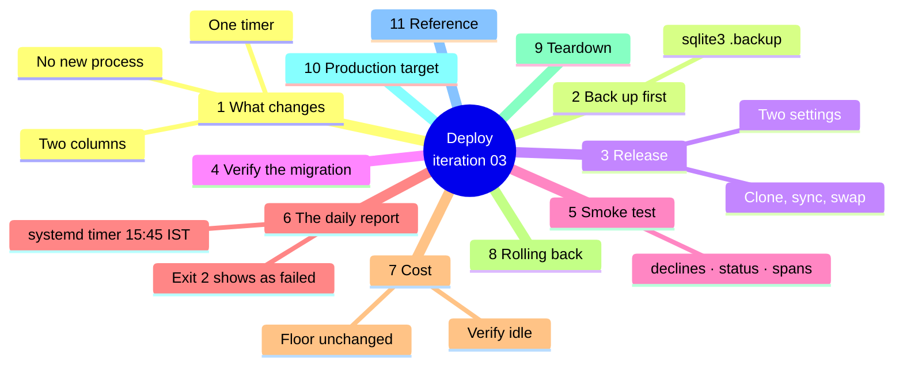
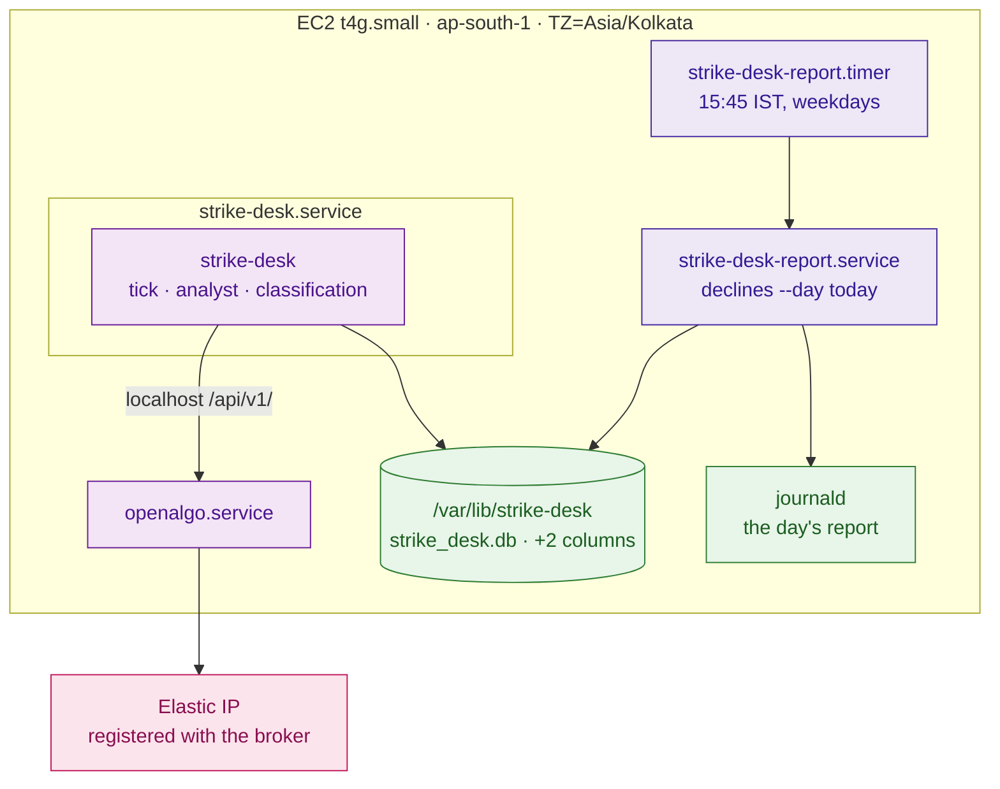

# Iteration 03 — Deployment Guide: releasing the decline record



## 1. What changes on the host

Less than any deployment so far. No new process runs, no new port opens, no new outbound destination is contacted, and no new secret is needed — this slice is Python that reads a SQLite file the desk already owns. Three things change: the running binary gains a `declines` command and writes two more columns per decision, the existing `decisions` table is widened in place the first time the new code opens it, and a systemd timer starts printing the day's report into journald after the close.



The report span lands in the same `traces` table as everything else, through the span processor iteration 01 installed. There is still no collector, no backend and no always-on observability process, so the practice posture's cost line is untouched by this deployment.

## 2. Back the journal up before you migrate it

The migration adds columns and touches no row, and the automated suite proves that against a database shaped exactly like the one on the host. Take a copy anyway, because it costs a second and the journal is the audit artifact:

```bash
sudo -u strikedesk sqlite3 /var/lib/strike-desk/strike_desk.db \
  ".backup '/var/lib/strike-desk/strike_desk.pre-0.3.0.db'"
sudo -u strikedesk sqlite3 /var/lib/strike-desk/strike_desk.pre-0.3.0.db \
  "SELECT count(*) FROM decisions;"
```

Use `.backup` rather than `cp`: the database runs in WAL mode with a live writer, and a file copy can catch it mid-checkpoint. Keep the count — you will compare against it in §4.

## 3. Release the new code

The immutable-release pattern is unchanged: clone, sync, swap the symlink, restart.

```bash
RELEASE=$(date +%Y%m%d)-$(git -C /path/to/checkout rev-parse --short HEAD)
sudo git clone --depth 1 <your-repo-url> "/opt/strike-desk/releases/$RELEASE"
cd "/opt/strike-desk/releases/$RELEASE/strike_desk" && sudo uv sync --frozen

sudo ln -sfn "/opt/strike-desk/releases/$RELEASE" /opt/strike-desk/current
sudo systemctl restart strike-desk
journalctl -u strike-desk -n 30 --no-pager
```

Two settings are new and both have working defaults, so the deploy succeeds without touching the environment file. Write them down anyway, so the running configuration is explicit rather than inherited:

```bash
sudo tee -a /etc/strike-desk/strike-desk.env >/dev/null <<'EOF'
STRIKE_DESK_REASON_TEXT_MAX_CHARS=400
STRIKE_DESK_REPORT_DEFAULT_DAYS=5
EOF
sudo systemctl restart strike-desk
```

The service log now carries the classification on every tick line — `tick <id> -> decline/specialist-unavailable (specialist/degraded) in 812ms` — which is the quickest confirmation that the new code is the code running.

## 4. Verify the migration

The widening happens the first time any entry point calls `create_schema()`, which the service does on start. Check the shape and the count against the number you kept in §2:

```bash
sudo sqlite3 /var/lib/strike-desk/strike_desk.db "PRAGMA table_info(decisions);" | grep reason_
sudo sqlite3 /var/lib/strike-desk/strike_desk.db "SELECT count(*) FROM decisions;"
sudo sqlite3 /var/lib/strike-desk/strike_desk.db \
  "SELECT coalesce(reason_category,'(pre-0.3.0)') AS class, count(*)
     FROM decisions GROUP BY 1 ORDER BY 2 DESC;"
sudo sqlite3 /var/lib/strike-desk/strike_desk.db \
  "UPDATE decisions SET reason_category='book';"
```

Both columns are present, the row count is identical to the backup's, every row written before this release groups under `(pre-0.3.0)` and every row written since carries a class, and the last statement fails with `Error: decisions is append-only`. That last line is the one to actually run: it proves the triggers survived the `ALTER TABLE`, which is the only way this migration could have quietly weakened the audit posture.

## 5. Smoke test

```bash
sudo -u strikedesk /usr/local/bin/uv run --project /opt/strike-desk/current/strike_desk \
  strike-desk declines; echo "exit $?"
sudo -u strikedesk /usr/local/bin/uv run --project /opt/strike-desk/current/strike_desk \
  strike-desk declines --since 5
sudo -u strikedesk /usr/local/bin/uv run --project /opt/strike-desk/current/strike_desk \
  strike-desk status | head -8

sudo sqlite3 /var/lib/strike-desk/strike_desk.db \
  "SELECT json_extract(attributes_json,'\$.\"report.taxonomy\"'),
          json_extract(attributes_json,'\$.\"report.total\"'),
          json_extract(attributes_json,'\$.\"report.healthy\"')
     FROM traces WHERE name='report.declines' ORDER BY id DESC LIMIT 1;"
```

A healthy first run: the day report prints with a by-reason table and a record-health block whose `unstamped rows` equals the pre-release row count for that day; the window covers five days; `status` prints the taxonomy artifact next to the prompt-set version; and the trace holds one `report.declines` span per report you ran. The exit code is 0 unless the day genuinely contains a defect — if it is 2, read the `unknown reason codes` line and the `internal-error` count before assuming the deploy is at fault, because the report is telling you about the journal, not about itself.

## 6. The daily report

The trader should not have to remember to run this. A oneshot unit and a timer put the day's page into journald just after the close, on weekdays only, and a defect makes the unit fail — which means a day with a crashed tick or an unknown reason code shows up in `systemctl list-units --failed` without any alerting infrastructure at all.

```bash
sudo tee /etc/systemd/system/strike-desk-report.service >/dev/null <<'EOF'
[Unit]
Description=Strike Desk daily decline report
After=strike-desk.service

[Service]
Type=oneshot
User=strikedesk
Group=strikedesk
WorkingDirectory=/opt/strike-desk/current/strike_desk
EnvironmentFile=/etc/strike-desk/strike-desk.env
EnvironmentFile=/run/strike-desk/env
ExecStart=/usr/local/bin/uv run --project /opt/strike-desk/current/strike_desk strike-desk declines
StandardOutput=journal
StandardError=journal
EOF

sudo tee /etc/systemd/system/strike-desk-report.timer >/dev/null <<'EOF'
[Unit]
Description=Run the Strike Desk decline report after the close

[Timer]
OnCalendar=Mon..Fri 15:45
Persistent=true
Unit=strike-desk-report.service

[Install]
WantedBy=timers.target
EOF

sudo systemctl daemon-reload
sudo systemctl enable --now strike-desk-report.timer
sudo systemctl list-timers strike-desk-report.timer --no-pager
sudo systemctl start strike-desk-report.service   # run it once by hand
journalctl -u strike-desk-report -n 40 --no-pager
```

`OnCalendar` follows the host clock, which is `Asia/Kolkata`, so 15:45 is fifteen minutes after the last no-trade window closes. `Persistent=true` means a run missed because the instance was stopped fires on the next boot rather than being skipped. The unit reads `/run/strike-desk/env` because that is where the OpenAlgo key is rendered and the redactor wants it; it makes no OpenAlgo call and no model call.

## 7. Cost

The infrastructure floor is exactly what iteration 02 left it at — roughly **$4.30 a month** for the public IPv4 address and the 8 GB root volume, with compute covered by the T4g free trial through 31 December 2026 — and this slice adds nothing to it. The report is local SQLite reads over a few hundred rows: about a second of CPU a day from the timer, a handful of kilobytes of journald output, and two extra columns whose storage is measured in bytes per row. There is no token spend, because there is no model call.

Two things are worth watching anyway, and both are properties of *this* stack rather than general advice. The `traces` table now grows a little faster, since every report you run appends a span; at one timer run a day that is a row a day, but a loop that calls `declines --json` every minute would add up over a year, so keep scripted callers to the cadence you actually read. And the pre-migration backup you took in §2 lives on the same 8 GB volume as everything else — prune old copies rather than accumulating one per release, because the volume is billed whether or not the instance is running.

Verify the idle line is still where it should be, a day after deploying:

```bash
aws ce get-cost-and-usage --time-period Start=$(date -d '2 days ago' +%F),End=$(date +%F) \
  --granularity DAILY --metrics UnblendedCost \
  --group-by Type=DIMENSION,Key=SERVICE --query 'ResultsByTime[].Groups[].[Keys[0],Metrics.UnblendedCost.Amount]' \
  --output table
du -sh /var/lib/strike-desk/*
```

Daily cost unchanged against the days before the deploy — EC2-Other for the address and the volume, nothing else — and a state directory still measured in megabytes, is the proof that this iteration is free to run.

## 8. Rolling back

The release rollback is the usual symlink swap, and it is safe in both directions because the two new columns are nullable with no default:

```bash
ls /opt/strike-desk/releases
sudo ln -sfn /opt/strike-desk/releases/<previous> /opt/strike-desk/current
cd /opt/strike-desk/current/strike_desk && sudo uv sync --frozen
sudo systemctl disable --now strike-desk-report.timer
sudo systemctl restart strike-desk
```

The iteration-02 binary selects its columns explicitly, so it neither sees nor needs the two it does not know about, and it keeps appending valid rows into the widened table — those rows simply carry `NULL` in both, and report as `unstamped` when you roll forward again. Disable the timer as part of the rollback: the older binary has no `declines` command, and a timer firing a subcommand that does not exist is a failed unit every evening for no reason. Nothing about rolling back deletes a row or narrows a column, and the pre-release backup from §2 stays where it is until you are satisfied.

## 9. Teardown

Removing just this iteration's addition is two commands, and it leaves the journal exactly as it is:

```bash
sudo systemctl disable --now strike-desk-report.timer
sudo rm /etc/systemd/system/strike-desk-report.{timer,service} && sudo systemctl daemon-reload
```

## 10. The production target

Every item here is a tier, a schedule or an additional resource; none of it edits the code this iteration ships.

**Backups.** The nightly `sqlite3 .backup` to an Object-Locked S3 bucket now protects the classification as well as the decisions, and it is what makes a months-long report reproducible after the instance is replaced. The policy does not change; what it is worth does.

**Observability.** Setting `STRIKE_DESK_OTLP_ENDPOINT` and `STRIKE_DESK_OTLP_HEADERS` sends `report.declines` and the classified `tick.decide` spans to self-hosted Langfuse alongside everything else — the code path is written and dormant, and turning it on is two environment variables plus the instance Langfuse runs on.

**Alarms.** The timer's exit code is already a signal; production turns it into a metric. A `systemd` `OnFailure=` unit or a five-minute cron putting the day's defect count as a CloudWatch custom metric gives you an alarm on "the desk recorded a defect today" without waiting for someone to read journald.

**Scale.** SQLite holds until portfolio-level operation, as the tech stack records. When the journal does move to managed Postgres, the report moves with it unchanged: its queries are ORM-level `select`/`func` expressions with no SQLite-specific SQL in them. What is dialect-specific is the engine URL, the pragma hook and the append-only triggers, all of which live in `journal.py` and none of which is this slice's logic. A window measured in months is also the point at which a persisted daily rollup earns its keep — today it would only be a table that can disagree with the journal.

**Compute.** Unchanged by this iteration; the report adds about a second of CPU a day, which the current instance would not notice at any tier.

## 11. Reference

| Command | Purpose |
| --- | --- |
| `strike-desk declines` | Today's classified report; exit 2 on a defect |
| `strike-desk declines --day YYYY-MM-DD` | One past IST trading day |
| `strike-desk declines --since [N]` | The most recent N journalled days |
| `strike-desk declines --json` | The same numbers for a script |
| `systemctl list-timers strike-desk-report.timer` | When the daily report next runs |
| `journalctl -u strike-desk-report -n 60` | The last report the timer printed |
| `systemctl list-units --failed` | A day the report found a defect |
| `sqlite3 ... "PRAGMA table_info(decisions);"` | Confirm the widening (§4) |

| Path | Owner | Contents |
| --- | --- | --- |
| `/etc/systemd/system/strike-desk-report.{service,timer}` | root | The after-the-close report |
| `/var/lib/strike-desk/strike_desk.pre-0.3.0.db` | strikedesk | The pre-migration backup; prune once you are satisfied |
| `/etc/strike-desk/strike-desk.env` | root:strikedesk 0640 | Non-secret configuration, now including the two new settings |

## 12. Limitations

Rows written before this release carry `NULL` in both new columns permanently. The report classifies them from the taxonomy so nothing is lost, but a direct query against the columns will show the gap, and the append-only triggers mean it can never be filled.

The timer reports the day it runs, so a day the instance was down is reported on the next boot by `Persistent=true` — which will report *that* day, not the missed one. Recovering a missed day is `strike-desk declines --day <the date>` by hand; nothing about the journal is lost either way.

And a failing timer is only as visible as the person looking at `systemctl list-units --failed`. Nothing pushes it anywhere, because operator alerting is a separate use case; until it lands, the daily habit is to read the report the timer already wrote.

---
**Sources**

*Repo files:* `040_iterations/iteration-01/05_deployment_guide.md` · `040_iterations/iteration-02/05_deployment_guide.md` · `040_iterations/iteration-03/02_implementation_guide.md` · `030_design/04_tech_stack.md` · `CLAUDE.md`

*Web (accessed 2026-08-21):*
- [SQLite — ALTER TABLE ADD COLUMN restrictions](https://www.sqlite.org/lang_altertable.html)
- [SQLite — the backup API and the `.backup` shell command](https://www.sqlite.org/backup.html)
- [systemd.timer — `OnCalendar` and `Persistent`](https://www.freedesktop.org/software/systemd/man/latest/systemd.timer.html)
- [AWS — Amazon EC2 T4g free trial (750 hours/month through 31 Dec 2026)](https://repost.aws/articles/ARi_gf6vo6TuqNtMQdiYPKyA/announcing-amazon-ec2-t4g-free-trial-extension)
