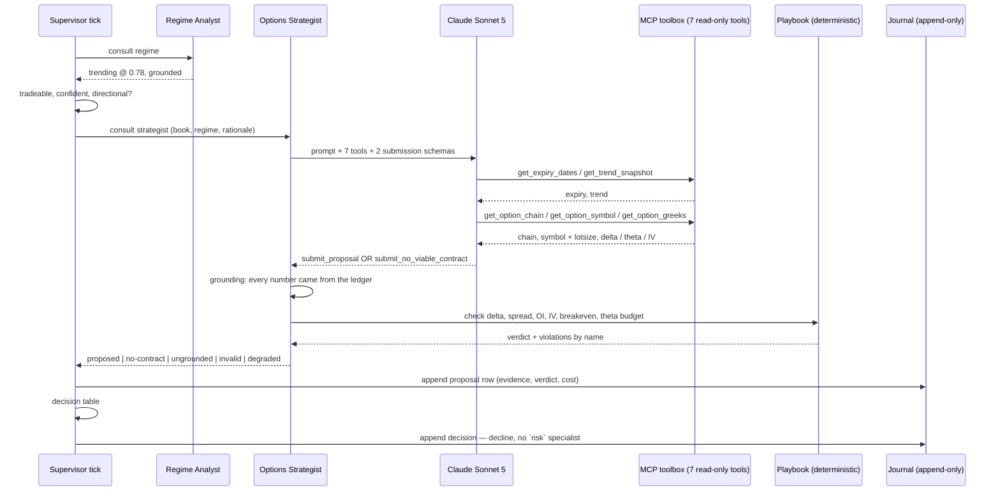

# Iteration 04 — UC-04: Propose a directional long

> **UC-04 — Propose a directional long**
>
> **Why this slice:** the catalog's MVP order runs UC-01 → UC-02 → UC-03 → UC-04, and iterations 01 to 03 built the first three. UC-04 is therefore the next un-built entry by catalog priority. It is also the role the desk has been naming in its own refusals since iteration 01: every tradeable, confident regime read still ends the tick as `decline / specialist-unavailable` because no `strategist` is registered to act on it. This iteration registers one. It is the richest plan → act → observe step in the product and the last piece of the *Decide* half that the desk can build before risk adjudication arrives.
>
> **Actor:** the Options Strategist — a Claude Sonnet 5 agent that reads the live option chain, Greeks, implied volatility and open interest through OpenAlgo's MCP tool surface and returns one concrete contract proposal, or an honest "no viable contract". The Supervisor consults it inside the tick, after the Regime Analyst and only when the regime warrants an entry. The Trader (Amit) reads what it proposed with `strike-desk proposals`.
>
> **Preconditions:** the iteration-03 desk is deployed and ticking on the host, with its journal at `/var/lib/strike-desk/strike_desk.db` at `SCHEMA_VERSION = 3` and its taxonomy at `dt-1`. OpenAlgo is running with a **valid broker session** and downloaded master contracts — this slice cannot be exercised against a broker session that cannot serve `/quotes`. An Anthropic API key is available, and OpenAlgo's own virtual environment can run `mcp/mcpserver.py`.
>
> **Depends on:** UC-01's tick, registry, journal and trace plumbing; UC-02's regime read, MCP toolbox, evidence ledger and grounding validator, all of which this slice extends rather than reshapes; and UC-03's taxonomy, which gains three codes and two variants and moves to `dt-2`. The Risk Officer (UC-05) remains unregistered, so **a viable proposal still ends the tick as a decline** naming the missing `risk` role.

![Navy portrait sheet for UC-04 Propose a directional long, tracing the catalog chain UC-01 to UC-04, the Options Strategist as a Claude Sonnet 5 agent returning either one concrete proposal or an honest no-viable-contract refusal, preconditions of a schema-version-3 journal, a valid broker session and an Anthropic API key, a build list of the second MCP whitelist, deterministic playbook, agent loop, verification pass, proposals table, taxonomy updates and span coverage, a model-proposes and code-verifies split where playbook.check re-derives breakeven, re-measures the bid-ask spread, re-tests the delta band, re-checks the open-interest floor and IV band, re-checks lot arithmetic and recalculates the theta budget, seven read-only tools for option data, symbol, Greeks, chain, implied volatility, open interest and server time, a proposal-anatomy wheel of index, expiry, strike, CE or PE, lots, theta budget, breakeven, entry band, stop loss, target and time stop, three new reason codes too-wide-spread, oi-too-thin and iv-outside-band, and a tick flow that still ends in decline because the Risk Officer is not yet registered.](images/amit-itr-4-image-1.png)

## 1. What this iteration builds

This iteration builds the Options Strategist end to end: a **second whitelist** on the existing MCP toolbox that gives the strategist the option-chain, option-symbol and Greeks tools the Regime Analyst never had — and gives it nothing that can place, modify, cancel or square off an order; a **deterministic playbook** that owns every numeric constraint a contract must satisfy; an **agent loop** that plans which reads matter, fetches the chain and the Greeks, and submits either one structured proposal or one structured refusal; a **verification pass** that re-checks every constraint the model claimed to have met, against the ledger of what it actually fetched; a `proposals` table that stores every attempt with its evidence, its prompt artifact and its token cost; three new reason codes in the taxonomy; and the span coverage that makes each proposal replayable from the trace.

The division of labour is the whole design, and it is worth stating plainly before any of the mechanics. **The model chooses and explains; deterministic code decides whether the choice is allowed.** The agent reads the chain, forms a view on direction, picks a strike and an expiry, and writes the rationale a trader reads back in a month. It then hands that proposal to `playbook.check`, which re-derives the breakeven, re-measures the bid-ask spread, re-tests the delta band, the open-interest floor, the IV band, the lot arithmetic and the theta budget from the numbers in the evidence ledger — and rejects the proposal if any of them disagrees with what the model asserted. A model that is persuasive but wrong produces a `defect`, not a trade. This is the same shape as UC-02's grounding validator, applied to arithmetic rather than to citation, and it is why the catalog can say the desk's edge is discipline rather than forecasting.

Two answers are equally first-class. The strategist may call `submit_proposal`, or it may call `submit_no_viable_contract` with a reason — too wide a spread, too thin an open interest, IV outside the band, nothing inside the delta window at an acceptable price. The second is not an error path and is not logged as one: it is the correct answer most of the time, it is journalled with the same completeness as a proposal, and it declines the tick with a `routine` disposition. Giving the refusal its own submission tool rather than inferring it from a failure is what keeps "the chain had nothing worth buying" distinguishable from "the agent broke".

**A directional long is proposed only in a directional regime.** `STRIKE_DESK_DIRECTIONAL_REGIMES` defaults to `trending` alone. The supervisor's tradeable set from iteration 02 also contains `range-bound`, and a range is genuinely tradeable — but not by buying a naked long that pays theta every hour to wait for a move the regime says is not coming. That trade is precisely the marginal trade UC-03 exists to decline, so this slice declines it by construction with `no-viable-contract` and does not spend a token on it. Range-bound entries arrive with the debit spreads of UC-19, which change the theta arithmetic rather than merely respecting it.

**No tick in this slice can end in `enter`.** That requires a proposal *and* a risk verdict, and UC-05 is unbuilt. A proposal that passes the playbook therefore lands in the `proposals` table, is named in the decision sentence, and the tick declines with `specialist-unavailable` naming the missing `risk` role — the identical pattern iterations 01 and 02 used for the missing `strategist`. The acceptance criteria below are written so that no reading of them promises an entry, and AC-11 makes the absence of `enter` a property the suite checks rather than a fact that happens to be true.

The reporting surface stays thin on purpose. `strike-desk proposals [--day | --since N] [--json]` lists what was proposed and what was refused, from the `proposals` table alone. It deliberately does not grow the aggregation, rollup and record-health machinery that `strike-desk declines` carries: iteration 03's centrepiece was the report, and this slice's centrepiece is the agent. Proposals are counted in the day's page because their reason codes are in the taxonomy that `declines` already classifies.

## 2. Main success scenario

1. The scheduler fires a tick. The session gate allows it, the `plan` node reads a flat book, and the graph routes to `consult`, which runs the Regime Analyst exactly as iteration 02 left it. The analyst answers `trending` at confidence `0.78`, and the read is journalled.
2. The graph's new router sees a regime that is `ok`, tradeable, above the confidence floor and in the directional set, and routes to `propose` rather than straight to `decide`.
3. The `propose` node opens a `tick.propose` span and asks the registry for the `strategist` role under the strategist timeout, passing the tick's book state, the regime label, the confidence and the analyst's rationale in the request.
4. The Options Strategist starts a `strategy.propose` span, confirms the MCP toolbox is healthy, and builds its request from the versioned `options_strategist` prompt artifact plus the tick's context: the index and its exchanges, the current IST time, the regime it is acting on, and the playbook's constraints stated as numbers so the model optimises inside them rather than guessing at them.
5. The agent loop runs. Claude Sonnet 5 is called with the seven whitelisted read-only tools plus the two submission schemas bound to it. It resolves the expiry with `get_expiry_dates`, reads direction from `get_trend_snapshot` and `get_momentum_snapshot`, pulls the chain around the money with `get_option_chain`, and records every result in the evidence ledger.
6. The model observes what came back, narrows to a strike, calls `get_option_symbol` for the exact tradable symbol and its lot size, and `get_option_greeks` for the delta, theta and implied volatility of that contract.
7. The model calls `submit_proposal` with the index, expiry, strike, option type, symbol, lot size, lots, entry price band, delta, IV, open interest, bid and ask, breakeven, stop, target, time-stop, theta per day, theta budget, and a rationale citing only numbers it fetched.
8. The grounding validator checks the citation: every numeric literal in the rationale and in each evidence item matches a value the ledger observed, the evidence names only tools that answered, and the rationale is inside its character cap.
9. `playbook.check` then re-derives the arithmetic independently: the option type agrees with the stated direction, the delta is inside the band, the spread is inside its cap, the open interest clears the floor, the IV is inside the band, the lots are inside the maximum, the quantity is the lot multiple, the breakeven equals strike plus premium for a CE, the stop sits below the entry band and the target above it, the time-stop is before the session's cutoff, and the day's theta cost is inside the budget. Nothing disagrees.
10. The strategist closes its span with the symbol, the delta, the spread, the theta cost, the tool-call count and the token usage, and returns a `SpecialistResult` whose payload carries the proposal.
11. The `propose` node appends one `proposals` row — proposal, evidence, playbook verdict, prompt name, version and digest, model id, tokens and latency — and puts the proposal into the tick state.
12. The `decide` node reaches the end of the decision table with a regime that warrants an entry and a proposal that passed, and finds no `risk` specialist registered. It declines with `specialist-unavailable`, variant `no_risk`, and a sentence naming the contract that was proposed and the role that was missing. The decision row carries `specialist` / `degraded` as its class, and the day's `strike-desk proposals` shows the contract the desk would have bought.

## 3. Alternate flows

**A1 — No viable contract.** The chain is there and readable, but nothing in it clears the playbook: the ATM spread is 4% of mid, or the strikes inside the delta band show open interest under the floor, or IV sits above the band and every contract is priced for a move already made. The model calls `submit_no_viable_contract` with a reason and the evidence behind it. The row is written with status `no-contract`, and the tick declines with `no-viable-contract` at disposition `routine`. This is the most common non-trivial outcome in the slice and nothing about it is treated as a failure.

**A2 — A non-directional tradeable regime.** The regime is `range-bound`, tradeable and confident, but not in `STRIKE_DESK_DIRECTIONAL_REGIMES`. The router does not enter `propose` at all: no model call, no tool call, no token spent. The tick declines with `no-viable-contract`, variant `non_directional`, whose sentence names the regime and says the playbook has no directional entry for it.

**A3 — The ladder moved under the proposal.** A proposal is grounded strictly in the chain as read *this tick*. There is no cached chain anywhere in the slice, and `get_option_chain` is called inside the agent loop on every proposal, so a strike ladder that has moved since the regime read is simply the ladder the strategist sees. The evidence ledger holds one read; the proposal cites that read; nothing older is reachable.

**A4 — Expiry day.** The session gate's expiry cutoff from iteration 01 already stops ticking past `STRIKE_DESK_EXPIRY_CUTOFF` on an expiry day, so the strategist is never consulted into the last hours of an expiry. Inside the allowed window on an expiry day the playbook's `min_days_to_expiry` still binds: a contract expiring today fails the check and the model is told so in its constraints, so it does not propose one.

**A5 — A machine reads the proposals.** `strike-desk proposals --json` prints the same rows as the text rendering, stamped with the taxonomy artifact and the playbook digest. The text and the JSON are two renderings of one object, which is why they cannot disagree.

## 4. Exception flows

**E1 — The proposal cites a number it never fetched.** The grounding validator finds a numeric literal in the rationale or in an evidence item that no tool output contained. The row is written with status `ungrounded` and the defect recorded, and the tick declines with `proposal-ungrounded` at disposition `defect`, which makes `strike-desk declines` exit 2. This is UC-02's `regime-ungrounded` guardrail applied to a richer submission, and it binds identically.

**E2 — The proposal fails the playbook.** The model submits a contract whose stated delta is outside the band, whose breakeven does not equal strike plus premium, whose stop sits above the entry, or whose theta cost exceeds the budget. `playbook.check` returns the violations by name. The row is written with status `invalid` carrying every violation, and the tick declines with `proposal-invalid` at disposition `defect`. A persuasive proposal that does not survive arithmetic is a defect in the reasoning plane, and it is recorded as one rather than quietly re-priced.

**E3 — The strategist times out.** The agent exceeds `STRIKE_DESK_STRATEGIST_TIMEOUT_SECONDS`. The registry cancels it and raises `SpecialistTimeout`, and the tick declines with the existing `specialist-timeout` code naming the `strategist` role. No new code is needed: a specialist that did not answer in time is one operational fact whichever specialist it was.

**E4 — Every tool call fails.** The MCP session is up but OpenAlgo cannot serve the chain — a broker session that has expired is the realistic case. No read succeeds, the loop cannot ground anything, and the row is written with status `degraded`. The tick declines with `data-quality`, variant `chain`, at disposition `degraded`. The desk does not propose a contract from a chain it could not see.

**E5 — A forbidden tool is attempted.** The model emits a tool call for a name outside the strategist's whitelist. The name is not in the bound tool list at all, so the call cannot execute; the loop records `tool.rejected` on the span, answers the model with an error string, and continues. The attempt is in the append-only trace rather than silently dropped.

**E6 — The proposals table cannot be written.** `record_proposal` raises `JournalWriteError` exactly as `record_regime_read` does, the tick fails closed, and the runner's internal-error path writes a `system`/`defect` decision row. A proposal that was not journalled did not happen.

## 5. Operational behaviour

**AgentOps.** The strategist adds three span names — `strategy.propose`, `strategy.model_call` and `strategy.tool_call` — mirroring the analyst's three, so a trace answers "which chain did it read, what did it pick, and how much did that cost?" without opening the journal. The `tick.propose` span carries the proposal's symbol, its playbook verdict and its token cost, so the supervisor's view of the step is legible without descending into the specialist's own spans.

**PromptOps.** `options_strategist.md` is a versioned artifact in the same registry, so adding it moves `prompt_set_version` for the whole desk — expected, and called out in the deployment guide because every decision row written after promote carries the new set version. The playbook is versioned the same way: `PLAYBOOK_VERSION` plus a content digest over its constraint values, printed in `status` and stamped on every proposal row, so a change to the delta band is attributable to the release that made it.

**Guardrails.** Three bind structurally rather than by instruction. The **whitelist** is the analogue of iteration 01's order-pathless client: the strategist's bound tool list is asserted to contain no name matching `place_*`, `modify_*`, `cancel_*`, `close_*` or `square_*`, so "it proposes, it never places" is a property of the tool binding rather than of the prompt. The **playbook check** re-derives every constraint from the ledger rather than trusting the submission. The **taxonomy parity check** from iteration 03 still binds in both directions, so the three new codes cannot ship uncategorised.

**Cost.** The strategist is the first Sonnet-tier call in the product and it is deliberately rationed: it runs at most once per tick, only after a tradeable and confident directional regime, and never at all on a non-directional one. On a typical session the analyst runs on every tick and the strategist on a small minority of them, which is the intended cost shape — cheap classification gates expensive deliberation.

## 6. Data touched

The journal gains one table, `proposals`, and `SCHEMA_VERSION` moves to 4. Because the change is a new table rather than a widened one, the migration is `create_schema()` calling `create_all` — no `ALTER TABLE`, no row read, no row rewritten. The rollback story is correspondingly simpler than iteration 03's: the previous binary does not know the table exists and never writes to it, so a widened database is a valid iteration-03 database.

`decisions` gains **no** column. A proposal is joined to its decision by `tick_id`, which both rows already carry. Adding a nullable `proposal_id` would have been legal, but a new table needs no migration risk at all, and the join is one column either way.

Reads are the chain and the Greeks, all through OpenAlgo's read-only MCP tools, all inside the tick that cites them. Nothing is cached between ticks, no table outside Strike Desk's own database is written, and no order path is reachable from the strategist's process at any point.

## 7. Acceptance criteria

1. **AC-1** — Every proposal names index, expiry, strike, option type, tradable symbol, lots, lot size, entry price band, breakeven, stop, target, time-stop and theta budget, plus a one-paragraph rationale, and is persisted as one `proposals` row with its evidence, its playbook verdict, its prompt artifact and its token cost.
2. **AC-2** — Every number in the rationale and in every evidence item matches a value the evidence ledger observed in this read; a submission citing anything else is recorded with status `ungrounded` and declines the tick with `proposal-ungrounded` at disposition `defect`.
3. **AC-3** — `playbook.check` re-derives the option type against the stated direction, the delta band, the bid-ask spread cap, the open-interest floor, the IV band, the lot maximum, the quantity as a lot multiple, the breakeven arithmetic, the stop below and target above the entry band, the days to expiry, the time-stop against the session cutoff, and the theta budget — from the ledger, not from the submission — and a proposal violating any of them is recorded with status `invalid`, carries every violation by name, and declines the tick with `proposal-invalid` at disposition `defect`.
4. **AC-4** — `submit_no_viable_contract` is a first-class answer: it is journalled with the same completeness as a proposal, declines the tick with `no-viable-contract` at disposition `routine`, and is never recorded as an error or a defect.
5. **AC-5** — The strategist's bound tool list contains exactly the seven whitelisted read-only tools and no name matching `place_*`, `modify_*`, `cancel_*`, `close_*` or `square_*`; a tool call for any other name cannot execute, is answered with an error string, and is recorded on its span as `tool.rejected`.
6. **AC-6** — The strategist is consulted only when the regime read is `ok`, its label is tradeable, its confidence is at or above the floor, and its label is in `STRIKE_DESK_DIRECTIONAL_REGIMES`; any other path spends no model call and no tool call, and a tradeable-but-non-directional regime declines with `no-viable-contract`, variant `non_directional`.
7. **AC-7** — The taxonomy moves to `dt-2` **additively**: `no-viable-contract`, `proposal-ungrounded` and `proposal-invalid` are added under the new `contract` category, `specialist-unavailable` gains a `no_risk` variant and `data-quality` a `chain` variant, and no existing entry's code, category or disposition changes — so every row written under `dt-1` still reports at `taxonomy drift 0`.
8. **AC-8** — The journal opens at `SCHEMA_VERSION = 4` by creating the `proposals` table if it is absent, reads and rewrites no existing row, leaves the append-only `UPDATE` and `DELETE` triggers refusing exactly as before on every table including the new one, and `create_schema()` is safe to call repeatedly.
9. **AC-9** — `strategy.propose` carries the status, the symbol, the playbook verdict, the tool-call count and the token cost; `strategy.model_call` and `strategy.tool_call` carry the same per-round and per-call detail the analyst's spans do; and `tick.propose` carries the symbol, the verdict and the cost at supervisor altitude.
10. **AC-10** — `strike-desk proposals` prints, for one IST trading day, every proposal and refusal with its status, its contract, its playbook verdict and its cost; `--since N` widens it to the most recent N journalled days; `--json` prints the identical rows stamped with the taxonomy and playbook artifacts; `--day` and `--since` are mutually exclusive, and a malformed date or count is rejected before the journal is opened.
11. **AC-11** — No tick in this slice can produce outcome `enter`. A proposal that passes every check still declines with `specialist-unavailable`, variant `no_risk`, naming the unregistered `risk` role, and the suite asserts that `enter` is unreachable rather than merely unobserved.
12. **AC-12** — The playbook is a versioned artifact: `PLAYBOOK_VERSION` plus a content digest over its constraint values appears in `status`, on every `proposals` row and on the `strategy.propose` span, and a golden file pins both the constraint set and every trader-facing sentence the three new codes render, so a change to a band or a wording fails CI until it is written down deliberately.

## 8. The flow

![Wide slate board in six columns: context and actor, giving the MVP order UC-01 to UC-02 to UC-04 and a two-submission design whose proposed and no-contract fields fail into ungrounded, invalid or degraded; a five-step agent loop of model consult, tool exec against the whitelist, evidence record, grounding re-fetch check and form-and-submit; a whitelisted MCP toolbox of seven allowed read-only tools against blocked place, modify, cancel, close and square-off families under a structural guardrail that the agent proposes and never places; proposal verification, where playbook.check tests twelve constraints on option type, delta, spread cap, open-interest floor, IV band, lot multiple, breakeven target and theta budget and compares model claims with validated numbers; taxonomy and reporting at journal schema version 4, mapping statuses to no-viable-contract as routine and proposal-ungrounded or proposal-invalid as defects beside a sample strike-desk proposals table; and decision integration ending the tick in DECLINE with no risk verdict, proposals joined to decisions on tick_id.](images/amit-itr-4-image-2.png)

## 9. Out of scope

Deliberately not in this slice, and each for a stated reason:

- **Placing anything.** UC-06 owns order placement behind human approval. The strategist's whitelist makes placement structurally unreachable from this code.
- **Risk adjudication.** UC-05 owns the hard limits a proposal must clear before it can become an entry. Until it registers, a passing proposal declines.
- **Managing an open position.** UC-07 owns the stop, target and time-stop once a position exists. This slice writes a time-stop into the proposal; nothing enforces it yet.
- **Multi-leg and spreads.** UC-19. A debit spread needs leg-level risk adjudication and atomic execution semantics that do not exist yet.
- **Regime memory and retrieval.** UC-18. Every proposal in this slice is grounded strictly in the chain as read this tick, with nothing retrieved and nothing cached.
- **Widening the report.** `strike-desk proposals` lists; it does not aggregate. Proposals are already counted by reason code in `strike-desk declines`.
