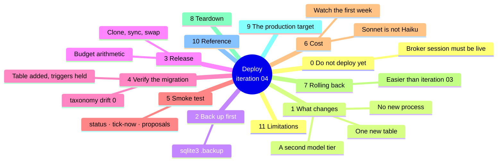
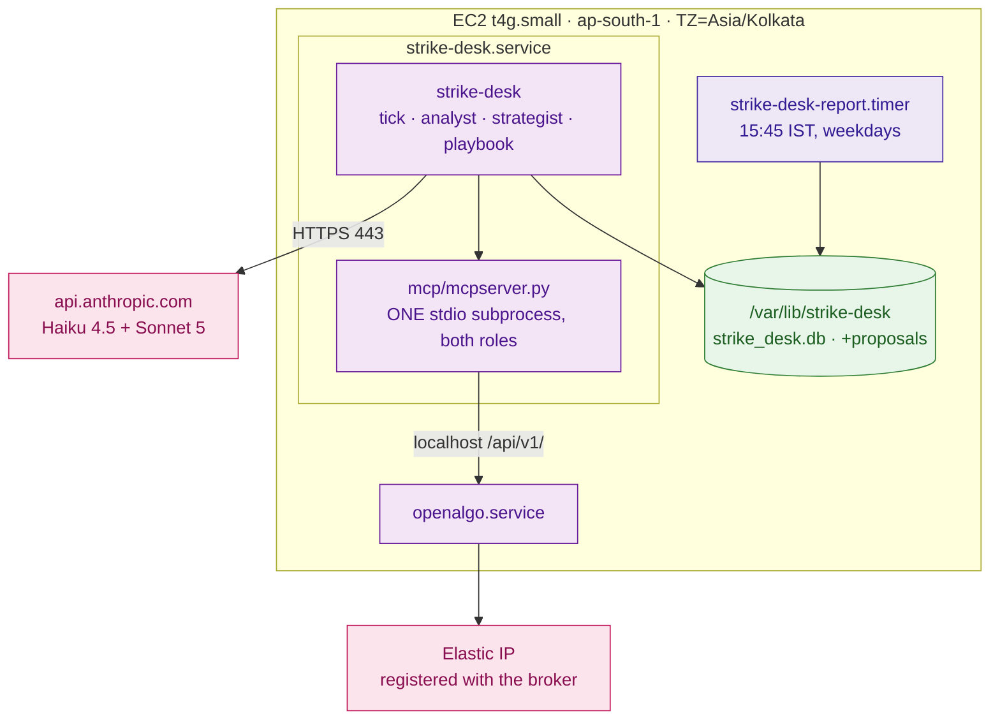

# Iteration 04 — Deployment Guide: releasing the Options Strategist



## 0. Do not deploy this until the broker session is live

Every deployment before this one could be verified on a dead broker session, because
iterations 01 to 03 read the book, the journal and a handful of indicators. This one reads a
live option chain. If `/api/v1/quotes` is still answering `Incorrect api_key or access_token`,
then:

- every strategist consult will fail all of its tool calls,
- every proposal row will be written with status `degraded`,
- every tick will decline with `data-quality` / `chain`, and
- **you will have deployed a slice you cannot tell apart from a broken one.**

Check first, and treat the check as a gate rather than a formality:

```bash
curl -s -X POST http://127.0.0.1:5000/api/v1/quotes \
  -H 'Content-Type: application/json' \
  -d '{"apikey":"'"$OPENALGO_API_KEY"'","symbol":"NIFTY","exchange":"NSE_INDEX"}' | head -20

curl -s -X POST http://127.0.0.1:5000/api/v1/optionchain \
  -H 'Content-Type: application/json' \
  -d '{"apikey":"'"$OPENALGO_API_KEY"'","symbol":"NIFTY","exchange":"NFO","strike_count":5}' | head -40
```

Both must return `"status": "success"` with data. The chain call is the one that matters —
a quote can succeed from a cached master contract while the chain fails. If either is bad,
reconnect the broker at `/broker` and re-run this section before going further.

Block A of `03_manual_test_cases.md` runs with no broker at all, so there is useful work to
do while the session is being fixed. This deployment is not part of it.

## 1. What changes on the host

No new process, no new port, no new inbound path. Three things change, and one of them costs
money.

1. **The journal gains a `proposals` table.** Created on the first `create_schema()`. No
   `ALTER TABLE`, no existing row read or rewritten.
2. **A second model tier is called.** The desk now talks to Anthropic twice on some ticks:
   Haiku for every regime read as before, and Sonnet for a proposal — but only after a
   tradeable, confident, *directional* read. That gating is what keeps the bill sane, and §6
   is how you confirm it is working.
3. **The tick budget widens from 40 to 90 seconds.** Two specialists cannot fit inside 40.
   The service refuses to start if the arithmetic does not hold, so this is a change you
   cannot forget to make — but it is also a change that makes each tick able to run longer,
   which matters if your cadence is short.



Note the MCP box: **one** subprocess serves both specialists. If you see two
`mcpserver.py` processes after this deploy, the toolbox was instantiated twice and that is a
file-descriptor leak, not a performance choice — see §5.

## 2. Back the journal up before you migrate it

The migration creates a table and touches no row, and the suite proves that against a
database shaped exactly like the host's. Take a copy anyway:

```bash
sudo -u strikedesk sqlite3 /var/lib/strike-desk/strike_desk.db \
  ".backup '/var/lib/strike-desk/strike_desk.pre-0.4.0.db'"
sudo -u strikedesk sqlite3 /var/lib/strike-desk/strike_desk.pre-0.4.0.db \
  "SELECT count(*) FROM decisions;"
```

Use `.backup` rather than `cp` — WAL mode with a live writer. Keep the count for §4.

## 3. Release the new code

The immutable-release pattern is unchanged: clone, sync, swap the symlink, restart.

```bash
RELEASE=$(date +%Y%m%d)-$(git -C /path/to/checkout rev-parse --short HEAD)
sudo git clone --depth 1 <your-repo-url> "/opt/strike-desk/releases/$RELEASE"
cd "/opt/strike-desk/releases/$RELEASE/strike_desk" && sudo uv sync --frozen
```

**Write the new environment before you swap the symlink.** Unlike iteration 03, this release
has a setting whose default is incompatible with the previous one: `tick_budget_seconds`
must widen, and the service will refuse to start otherwise. Doing this after the restart
means a failed unit and a confusing thirty seconds.

```bash
sudo tee -a /etc/strike-desk/strike-desk.env >/dev/null <<'EOF'
# Two specialists must fit inside one tick: 25 + 35 < 90.
STRIKE_DESK_TICK_BUDGET_SECONDS=90
STRIKE_DESK_STRATEGIST_TIMEOUT_SECONDS=35
STRIKE_DESK_STRATEGIST_DEADLINE_MARGIN_SECONDS=4

# The deliberation tier.
STRIKE_DESK_STRATEGIST_MODEL=claude-sonnet-5
STRIKE_DESK_STRATEGIST_MAX_ROUNDS=6
STRIKE_DESK_STRATEGIST_TOOL_OUTPUT_CHARS=16000
STRIKE_DESK_PROPOSAL_RATIONALE_MAX_CHARS=700
STRIKE_DESK_STRATEGIST_PRICE_IN_PER_MTOK=3.0
STRIKE_DESK_STRATEGIST_PRICE_OUT_PER_MTOK=15.0

# A directional long is proposed only in a directional regime.
STRIKE_DESK_DIRECTIONAL_REGIMES=trending

# The playbook. Every one of these is a judgement call; the digest makes each attributable.
STRIKE_DESK_PLAYBOOK_DELTA_MIN=0.35
STRIKE_DESK_PLAYBOOK_DELTA_MAX=0.60
STRIKE_DESK_PLAYBOOK_MAX_SPREAD_PCT=1.5
STRIKE_DESK_PLAYBOOK_MIN_OPEN_INTEREST=50000
STRIKE_DESK_PLAYBOOK_IV_FLOOR=8.0
STRIKE_DESK_PLAYBOOK_IV_CEILING=35.0
STRIKE_DESK_PLAYBOOK_MAX_LOTS=2
STRIKE_DESK_PLAYBOOK_MIN_DAYS_TO_EXPIRY=1
STRIKE_DESK_PLAYBOOK_MAX_DAYS_TO_EXPIRY=10
STRIKE_DESK_PLAYBOOK_THETA_BUDGET_RUPEES=1500
STRIKE_DESK_PLAYBOOK_TIME_STOP=15:00
EOF
```

Then swap and restart:

```bash
sudo ln -sfn "/opt/strike-desk/releases/$RELEASE" /opt/strike-desk/current
sudo systemctl restart strike-desk
journalctl -u strike-desk -n 40 --no-pager
```

The startup line should now name both roles:

```
strike-desk starting: index=NIFTY cadence=900s prompts=ps-<new> roles=('regime', 'strategist') model=claude-haiku-4-5
```

`prompts=` will have changed even though you did not edit `regime_analyst.md`. That is
correct and expected: adding `options_strategist.md` to the registry moves the whole set
version, so every decision row written from here carries the new stamp. It is the honest
answer — the desk's prompt surface did change.

If the unit fails to start, read the error before touching anything. A configuration
arithmetic failure says so exactly:

```
specialist timeouts total 60s, which does not fit inside the 40s tick budget
```

That means the env block above was not written, or was written to a file the unit does not
read. It is not a code problem.

## 4. Verify the migration

```bash
sudo sqlite3 /var/lib/strike-desk/strike_desk.db ".tables"
sudo sqlite3 /var/lib/strike-desk/strike_desk.db "SELECT count(*) FROM decisions;"
sudo sqlite3 /var/lib/strike-desk/strike_desk.db \
  "SELECT name FROM sqlite_master WHERE type='trigger' AND tbl_name='proposals';"
sudo sqlite3 /var/lib/strike-desk/strike_desk.db \
  "UPDATE decisions SET reason_category='book';"
```

Expect: `proposals` present alongside `decisions`, `traces` and `regime_reads`; the decision
count identical to §2's; both `proposals_no_update` and `proposals_no_delete` listed; and the
last statement failing with `Error: decisions is append-only`.

**Then run the check that actually protects a year of rows:**

```bash
sudo -u strikedesk /opt/strike-desk/current/strike_desk/.venv/bin/strike-desk declines --since 20
```

Read the health block. It must say **`taxonomy drift 0`**. The taxonomy moved from `dt-1` to
`dt-2` in this release, and the whole discipline of that change was that it be *additive* —
three codes added, two variants added, nothing existing altered. If drift is anything but
zero, an existing entry's category or disposition was changed, every historical row carrying
it is now mis-classified, and the correct response is to roll back (§7) and fix the taxonomy
rather than to accept the number.

`strike-desk status` should show both artifacts:

```
taxonomy         : dt-2+<digest>
playbook         : pb-1+<digest>
strategist model : claude-sonnet-5
directional      : trending
```

## 5. Smoke test

Do this during market hours, on a day the desk is ticking.

```bash
sudo -u strikedesk /opt/strike-desk/current/strike_desk/.venv/bin/strike-desk tick-now
sleep 30
sudo -u strikedesk /opt/strike-desk/current/strike_desk/.venv/bin/strike-desk proposals
```

Three outcomes are all correct, and it is worth knowing which you are looking at:

| What you see | What it means |
| --- | --- |
| No proposal row at all | The regime was not tradeable, not confident, or not directional. The router gated before spending. Check the decision row's reason code — it will say which. |
| `no contract` | The strategist read the chain and refused. Normal and healthy. |
| `PROPOSED` with `playbook pass` | A contract was found and verified. Read the decision row: it must still be a `decline` naming the missing `risk` role. |

Then check the two things that would be quietly wrong:

```bash
# ONE MCP subprocess, not two. Two means the toolbox was built twice — an FD leak.
pgrep -af mcpserver.py | wc -l

# File descriptors held by the service. Compare against the pre-deploy number; it should
# not have grown by more than a handful.
sudo ls -l /proc/$(systemctl show -p MainPID --value strike-desk)/fd | wc -l

# No proposal should ever record a rejected tool in normal operation.
sudo sqlite3 /var/lib/strike-desk/strike_desk.db \
  "SELECT count(*) FROM proposals WHERE rejected_tool_count > 0;"
```

The last query is the one to keep an eye on over the first week. A non-zero count means the
model attempted a tool outside its whitelist. The attempt was refused — that is what the
whitelist is for — but it is worth reading the trace to see what it reached for, because it
is a signal about the prompt.

## 6. Cost

This is the first deployment where the bill can move meaningfully, so treat the first week as
an observation period rather than a settled state.

The shape you are relying on: Haiku runs on every tick; Sonnet runs only after a tradeable,
confident, directional read. On a 15-minute cadence over a 6-hour session that is roughly 24
regime reads a day, of which some fraction reach the strategist. If that fraction is small,
the incremental cost is small. If it is not, you will see it here:

```bash
sudo sqlite3 /var/lib/strike-desk/strike_desk.db "
  SELECT trading_day,
         (SELECT count(*) FROM regime_reads r WHERE r.trading_day = d.trading_day) AS reads,
         (SELECT count(*) FROM proposals p WHERE p.trading_day = d.trading_day) AS proposals,
         (SELECT round(sum(token_cost_micros)/1000000.0, 4) FROM regime_reads r
            WHERE r.trading_day = d.trading_day) AS haiku_usd,
         (SELECT round(sum(token_cost_micros)/1000000.0, 4) FROM proposals p
            WHERE p.trading_day = d.trading_day) AS sonnet_usd
    FROM (SELECT DISTINCT trading_day FROM decisions) d
   ORDER BY trading_day DESC LIMIT 10;"
```

If `proposals` is close to `reads`, the gate is not gating: either the analyst is calling
`trending` far more often than the session warrants, or `STRIKE_DESK_DIRECTIONAL_REGIMES` was
widened. Narrow it before you tune anything else — gating is cheaper than optimising.

The prices in the environment file are what the journal costs its rows at. They are
configuration, not truth: if Anthropic's published price for the tier changes, the historical
rows keep the price they were written at, which is the right behaviour for an audit record
and the wrong behaviour for a forecast. Update the env when the price changes and note the
date.

Two guards that are not on by default and are worth considering after a week of real numbers:
a lower `STRIKE_DESK_STRATEGIST_MAX_ROUNDS` (each round is a full model call over a growing
message list, so 6 → 4 cuts the tail), and a smaller
`STRIKE_DESK_STRATEGIST_TOOL_OUTPUT_CHARS` (a full chain is the largest thing in the context,
and `strike_count` in the prompt already keeps it small).

## 7. Rolling back

Easier than iteration 03's, and the reason is structural: this release added a **table**
rather than widening one. The iteration-03 binary does not know `proposals` exists, never
selects from it and never inserts into it, so a database this release has touched is still a
completely valid iteration-03 database.

```bash
sudo ln -sfn /opt/strike-desk/releases/<the previous release> /opt/strike-desk/current
sudo systemctl restart strike-desk
```

Then revert the environment, because the old binary does not know these keys and
`extra="forbid"` will refuse to start with them present:

```bash
sudo sed -i '/^STRIKE_DESK_STRATEGIST_/d;/^STRIKE_DESK_PLAYBOOK_/d;/^STRIKE_DESK_DIRECTIONAL_REGIMES/d' \
  /etc/strike-desk/strike-desk.env
sudo sed -i 's/^STRIKE_DESK_TICK_BUDGET_SECONDS=90/STRIKE_DESK_TICK_BUDGET_SECONDS=40/' \
  /etc/strike-desk/strike-desk.env
sudo systemctl restart strike-desk
```

Rows written under `dt-2` stay in the journal and will read as `unknown` / `defect` under a
`dt-1` binary if they carry one of the three new codes — `strike-desk declines` will name
them and exit 2. That is correct: a `dt-1` build genuinely does not know what
`no-viable-contract` means, and saying so is better than guessing. It is also the clearest
argument for rolling forward with a fix rather than living on a rollback.

The `proposals` table is left in place. Dropping it is possible and pointless; it costs
nothing and holds the record of what the desk proposed.

## 8. Teardown

Unchanged from iteration 03. Nothing in this slice adds a timer, a socket or a unit. If you
are tearing the desk down entirely, the sequence is still: `systemctl disable --now
strike-desk strike-desk-report.timer`, then archive `/var/lib/strike-desk/` before removing
it — the journal is the only artifact of what the desk decided, and it cannot be regenerated.

## 9. The production target

Two things about this slice change what "production" would mean, and both should be written
down now rather than discovered later.

**The strategist is one code change away from an order path.** Today the distance between a
proposal and a placed order is UC-05 and UC-06 — a risk verdict and a human approval. The
structural guardrail that holds in the meantime is the whitelist, and it holds because it is
asserted at import and at binding. Any future work that touches `mcp_toolbox.py` should be
reviewed as if it were touching an order path, because it is.

**The playbook's numbers are unvalidated.** They are defensible starting values chosen by
reading the product's own constraints, not values that have been tested against outcomes. A
production posture needs UC-11's baseline comparison and UC-17's replay harness before any
band is treated as tuned. Until then, `pb-1+<digest>` in the journal is doing real work: it
records which numbers each proposal was judged against, so a later analysis can separate "the
playbook was wrong" from "the playbook changed".

The rest of the production target — Langfuse via the two OTLP variables, a real secret store,
and the SEBI static-IP posture that is already satisfied by the Elastic IP — is unchanged
from iteration 03 and needs nothing from this release.

## 10. Reference

| Thing | Value |
| --- | --- |
| Package version | `0.4.0` |
| Journal schema | `SCHEMA_VERSION = 4` — `decisions`, `traces`, `regime_reads`, `proposals` |
| Taxonomy | `dt-2` — nine `dt-1` codes unchanged, three added under `contract` |
| Playbook | `pb-1` plus a digest of the resolved bands |
| New table | `proposals`, append-only, created by `create_schema()` |
| New model tier | `claude-sonnet-5`, called at most once per tick, only on a directional read |
| Budget invariant | `specialist_timeout + strategist_timeout < tick_budget` → `25 + 35 < 90` |
| MCP subprocesses | **One.** Both specialists share the toolbox. |
| New ports | None |
| New secrets | None — the existing Anthropic key serves both tiers |
| Rollback | Symlink swap + remove the new env keys. The table is harmless to leave. |

## 11. Limitations

1. **A proposal is not a trade, and this deployment does not make the desk trade.** After
   this release the desk will find contracts, verify them, journal them, and decline every
   one of them. If that is not what you see, something is wrong.
2. **The first week's proposals are unfalsified.** No fill, no P&L, no baseline. Read them
   for whether the reasoning is sound and the numbers are grounded, not for whether they
   would have made money — nothing in the system can answer that yet.
3. **The chain read is the slowest thing in the tick.** A 15-minute cadence has ample room; a
   3-minute cadence on a busy session may start colliding with the single-flight guard, which
   skips rather than queues. That is the designed behaviour, but it means a short cadence
   silently reduces the number of ticks rather than running them faster.
4. **Deploying on a dead broker session produces a slice that looks broken.** Section 0
   exists because this is the single most likely way to waste a day on this release.
