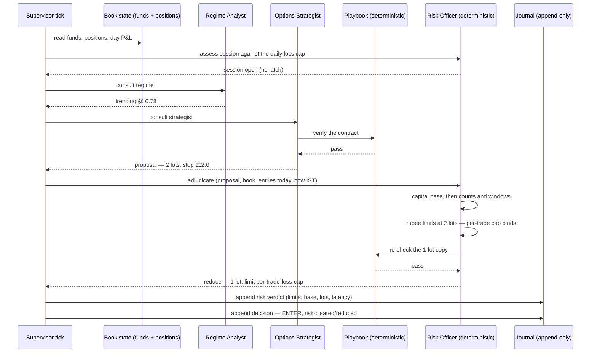

# Iteration 05 — UC-05: Adjudicate against hard risk limits

> **UC-05 — Adjudicate against hard risk limits**
>
> **Why this slice:** the catalog's MVP order runs UC-01 → UC-02 → UC-03 → UC-04 → UC-05, and iterations 01 to 04 built the first four. UC-05 is the next un-built entry by catalog priority, and it is the one the desk has been naming in its own refusals since the strategist arrived: every verified contract still ends the tick as `decline / specialist-unavailable` because nothing is registered to adjudicate it. This iteration builds the adjudicator, and with it the desk's first affirmative answer — a risk-cleared intent to enter.
>
> **Actor:** the Risk Officer, and it is deliberately not a language model. It is a pure function over the proposal, the live book and the configured limits, returning `pass`, `reduce`, `veto` or `hold` with the tripped limit named, its configured value and the observed value. The Supervisor calls it in-process, after the playbook has verified the contract. The Trader (Amit) reads every verdict with `strike-desk risk`.
>
> **Preconditions:** the iteration-04 desk is deployed and ticking on the host, with its journal at `/var/lib/strike-desk/strike_desk.db` at `SCHEMA_VERSION = 4`, its taxonomy at `dt-2` and its playbook at `pb-1`. OpenAlgo is running with a valid broker session, because the limits are computed from live funds and the live position book — an unreadable book is the one input this slice must refuse to guess at.
>
> **Depends on:** UC-01's tick, book-state snapshot, journal and trace plumbing; UC-03's taxonomy and day report, which gain a fourth outcome; and UC-04's `proposals` table and `playbook.check`, which produce and verify the contract this slice adjudicates. Routing a cleared intent through OpenAlgo's Action Center is UC-06's work, so the tick ends the moment the intent is journalled.

## 1. What this iteration builds

This iteration builds the deterministic core's first half: a `risk_officer` module holding the eight hard limits FR-5 names, as a frozen, versioned constraint set plus two pure functions; a `risk_verdicts` table that records every adjudication with the limit that bound it, the number it was configured at, the number that was observed and the capital base both were taken of; a session-stop latch that takes the desk out of the market for the rest of the day the moment the daily loss cap is breached, before a single token is spent; four new reason codes and a fourth outcome in the taxonomy; a `strike-desk risk` command; and the span coverage that makes a veto as traceable as a proposal.

The division of labour that iteration 04 established gets its second half here. The model chose and explained, and `playbook.check` re-derived whether the contract is *well formed*. The Risk Officer answers a different question — whether the desk is *allowed* to take it — and it answers with arithmetic over the live book. It reads no tool, calls no model, holds no timeout and has no retry, because a safety limit that can time out is not a limit. Nothing the strategist wrote has standing here: the rationale may argue for an exception in the most persuasive English available and the verdict will not move, because every number the officer uses is recomputed from the proposal's own declared prices and quantities and from funds read this tick.

There is no agent loop in this slice. The reasoning plane is untouched — same two specialists, same prompts, same models — and everything added here runs in the control plane in well under a millisecond.

Four verdicts are possible and each one is a first-class answer. **`pass`** means every limit has headroom and the tick ends as an intent. **`reduce`** means the contract is allowed but not at the size proposed, so the lots come down to the largest count that fits strictly inside every rupee limit, the reduced contract is re-checked against the playbook, and the tick ends as an intent at the smaller size. **`veto`** means a limit binds and no size clears it, so the tick declines naming the limit. **`hold`** means an input the check needed could not be read — an unusable capital base, a proposal the officer cannot parse — and the proposal is held rather than assumed safe. There is no fifth answer and no partial exception.

**A cleared intent is not an order.** With a verdict in hand the tick can finally end in `enter`, which is what the catalog means by "an intent to enter": a journalled decision that this contract, at this size, cleared every hard limit. Nothing places it. The OpenAlgo client's read-only path whitelist from iteration 01 is unchanged, the strategist's tool whitelist from iteration 04 is unchanged, and there is no code path from this slice to a broker. Presenting the intent to the trader and taking his click is UC-06's work.

**The rupee limits are strict and the count limits are not.** A proposal that sits exactly on a monetary cap is a breach — the catalog says so plainly, and the reason is that a cap is the amount you may not lose rather than the amount you may lose. A count limit is the opposite: `max_lots = 2` means two lots are permitted, and three are not. That distinction is a single rule in code and it is worth stating once, here, because half the boundary tests in the suite exist to hold it.

## 2. Main success scenario

1. The scheduler fires a tick. The session gate allows it and the `plan` node reads the book: flat, ₹6,00,000 of capital across available cash and utilised margin, and the day's realised and unrealised P&L at zero.
2. The session assessment runs on that snapshot. The day's loss is nothing against a ₹12,000 cap, and no session-stop verdict is latched for the day, so the tick proceeds and no verdict row is written.
3. The Regime Analyst answers `trending` at confidence `0.78`, the router finds the read tradeable, confident and directional, and the Options Strategist proposes `NIFTY02SEP2624800CE`, two lots of 75, entry band 138.5–142.0, stop 112.0, target 196.0, time-stop 14:45 IST. The proposal is grounded and passes the playbook, exactly as iteration 04 left it.
4. The new router sees a proposal with status `proposed` and routes to `adjudicate` rather than straight to `decide`.
5. The `adjudicate` node opens a `tick.adjudicate` span, reconstructs the typed proposal from the tick state, resolves the limits from settings, and calls `risk_officer.adjudicate` with the proposal, the book snapshot, the day's entry count and the current IST time.
6. The officer computes the capital base — ₹6,00,000 — and derives the three rupee limits from it: ₹12,000 for the day, ₹3,000 per trade, ₹60,000 of deployed capital and the same for per-index exposure.
7. It checks the count and window limits first: no position is open against a ceiling of one, no entry has been journalled today against a ceiling of three, and the contract's expiry is not today, so the expiry-day window does not bind.
8. It then checks the sizeable limits at the requested two lots. The premium at risk is 142.0 × 150 = ₹21,300, inside the ₹60,000 ceiling; but the loss at the stop is (142.0 − 112.0) × 150 = ₹4,500, which is at or beyond the ₹3,000 per-trade cap.
9. Because that limit is size-dependent, the officer solves for the largest lot count strictly inside every rupee limit and finds one lot: ₹2,250 of risk against ₹3,000, ₹10,650 of premium against ₹60,000.
10. It copies the proposal at one lot and 75 quantity and re-runs `playbook.check` on the copy. Nothing has moved that the playbook cares about — the per-unit prices, the breakeven and the levels are unchanged and the theta cost has halved — so the reduced contract stands.
11. The officer returns `reduce`, carrying every limit it evaluated with its configured and observed values, the capital base, two lots requested and one lot cleared, and the per-trade cap named as the limit that bound.
12. The node appends one `risk_verdicts` row before anything else happens, closes the span with the verdict, the limit and a latency in microseconds, and puts the verdict into tick state.
13. The `decide` node reaches a cleared verdict, and the tick's outcome is `enter` with reason `risk-cleared`, variant `reduced`, and a sentence naming the contract, the size it cleared at, the size it was cut from and the limit that cut it. `strike-desk risk` shows the arithmetic and `strike-desk declines` counts the day's first entry.

## 3. Alternate flows

**A1 — Everything has headroom.** The same tick on a ₹10,00,000 base: the per-trade cap is ₹5,000, two lots risk ₹4,500, and the verdict is `pass` at the requested size. The row records the same limit set with no breach, because a verdict that records only failures cannot answer "how close were we?" a month later.

**A2 — A limit binds at every size.** The base is ₹4,00,000, the per-trade cap is ₹2,000, and one lot still risks ₹2,250. There is no smaller size, so the verdict is `veto` naming `per-trade-loss-cap` at ₹2,000 configured against ₹2,250 observed, and the tick declines with `risk-veto`, variant `sized_out`, at disposition `routine`. A veto is the playbook working, not the desk failing.

**A3 — The day's third entry has already been taken.** `max-trades-per-day` is a count of the entries journalled for the trading day. On the fourth clearing proposal the observed count is three against a ceiling of three, the verdict is `veto` naming that limit, and no size reduction can help — a count limit is not size-dependent, and the officer does not attempt to reduce past one.

**A4 — The session has already stopped.** The book's realised and unrealised P&L for the day is −₹13,400 against a ₹12,000 daily cap. The session assessment in `plan` finds the breach, appends exactly one session-stop verdict row for the day, and the tick declines with `risk-session-stopped` before the Regime Analyst is consulted. Every later tick that day finds the latch already written, appends nothing, and declines the same way. The desk stops proposing entries for the session, which is the letter of the catalog's exception.

**A5 — A machine reads the verdicts.** `strike-desk risk --json` prints the same rows as the text rendering, stamped with the limits artifact, so the two cannot disagree. `--since N` widens the window to the most recent N journalled days.

## 4. Exception flows

**E1 — The capital base is unusable.** Funds came back with zero available cash and zero utilised margin, or a base below the configured floor. Percentages of nothing are not limits, so the verdict is `hold` naming `capital-base`, the tick declines with `risk-input-unavailable` at disposition `degraded`, and nothing is passed. The proposal is held, never assumed safe.

**E2 — The proposal cannot be parsed.** The tick state holds a proposal the officer cannot reconstruct into a typed submission — a missing stop, a non-numeric quantity. That is a defect in the plane above, and the officer's answer is the same as for any missing input: `hold`, `risk-input-unavailable`, no pass. A contract the risk layer cannot read is a contract it will not clear.

**E3 — The reduced contract fails the playbook.** The size solver found a smaller lot count, but `playbook.check` rejects the copy. That should be impossible — reducing lots moves only the quantity and the theta cost, both in the safe direction — so if it happens, the arithmetic disagrees with itself. The verdict becomes `veto` carrying the playbook's violations as its detail, because a contract two independent checks disagree about is not one to buy.

**E4 — The verdict cannot be journalled.** `record_risk_verdict` raises `JournalWriteError` exactly as `record_proposal` does, the tick fails closed, and the runner's internal-error path writes a `system`/`defect` decision row. An intent that was not journalled did not happen, and FR-10 makes that a hard rule rather than a preference.

## 5. Operational behaviour

**AgentOps.** Two spans join the trace. `risk.session` opens inside `plan` and carries the day's P&L, the derived cap and whether the latch was already set; `tick.adjudicate` carries the verdict, the tripped limit with both of its numbers, the capital base, lots requested and cleared, the limits artifact and a latency in microseconds — microseconds because this is control-plane code and a millisecond-rounded zero would tell you nothing about it. Together they answer "why did the desk take that, or refuse it?" without opening the journal.

**LLMOps.** The PRD's operational requirement is explicit that guardrail tests over the deterministic limits are mandatory and must fail loudly, and this slice is where that clause is discharged. The regression gate is a frozen scenario set: a fixed table of proposal-and-book cases, each pinned to its verdict, its tripped limit and the exact sentence the trader reads, running in CI ahead of the full suite. A limit whose behaviour or wording changes fails that gate until the change is written down deliberately. The structural half is a test asserting that `risk_officer.py` imports nothing from the model, prompt or specialist layers — the veto is arithmetic, and the import graph is where that is proved rather than promised.

**PromptOps.** No prompt changes and none is added; `prompt_set_version` is unmoved by this release. The versioned artifact this slice introduces is the limit set itself: `RISK_LIMITS_VERSION` plus a digest over the resolved values, printed by `status`, stamped on every verdict row and carried on the span, so a change to the daily cap is attributable to the release that made it.

**Cost.** Nothing is added to the bill and something is taken off it. Adjudication is free, and the session-stop latch is a net saving: on a day the loss cap has been breached, the desk stops calling Haiku and Sonnet entirely rather than reasoning its way to a refusal it already knows.

## 6. Data touched

The journal gains one table, `risk_verdicts`, and `SCHEMA_VERSION` moves to 5. As in iteration 04 the change is a new table rather than a widened one, so the migration is `create_schema()` calling `create_all`, with the same append-only `UPDATE` and `DELETE` triggers attached by the existing DDL listener. No existing row is read or rewritten, and a previous binary that does not know the table exists writes perfectly valid rows beside it.

`decisions` gains no column. A verdict joins its decision and its proposal by `tick_id`, which all three rows already carry, and the verdict row also stores the `proposal_id` so the chain from regime read to intent can be walked in either direction.

The reads are the ones the tick already makes. Funds and the position book arrive in the book-state snapshot the `plan` node captures, the day's entry count and the session-stop latch are two indexed queries against Strike Desk's own journal, and nothing outside that database is written. No market data is fetched for adjudication, because a limit that needs a fresh quote to evaluate is a limit that can fail when the feed does.

## 7. Acceptance criteria

1. **AC-1** — Every proposal that passes the playbook is adjudicated before any outcome is assembled, and the adjudication is journalled as one `risk_verdicts` row carrying the verdict, the tripped limit's name with its configured and observed values, the capital base both were derived from, every limit evaluated with its own two numbers, lots requested, lots cleared, the limits artifact and the latency — written before the decision row that depends on it.
2. **AC-2** — All eight limits FR-5 names are evaluated and named exactly: `daily-loss-cap`, `per-trade-loss-cap`, `max-concurrent-positions`, `deployed-capital-ceiling`, `per-index-exposure`, `max-lots`, `max-trades-per-day` and `expiry-day-window`.
3. **AC-3** — A rupee limit is breached when the observed value is at or beyond the configured one; a count limit permits its configured number exactly and breaches above it. Both boundaries are asserted at the exact value, one rupee inside and one rupee outside.
4. **AC-4** — When a rupee limit binds only because of size, the lots are reduced to the largest count strictly inside every rupee limit, the reduced contract is re-checked by `playbook.check` and a copy that fails it becomes a `veto`; a single lot that still breaches is a `veto` naming the binding limit, and no count limit is ever resolved by reduction.
5. **AC-5** — An input the check needs and cannot use — a capital base at or below the configured floor, an unparseable proposal — yields `hold`, declines the tick with `risk-input-unavailable` at disposition `degraded`, and can never yield `pass` or `reduce`.
6. **AC-6** — When the day's realised plus unrealised P&L is at or beyond the daily loss cap, or a session-stop verdict is already latched for the trading day, the tick declines with `risk-session-stopped` before any specialist is consulted, spending no model call and no tool call; the latch is exactly one appended row per trading day.
7. **AC-7** — The Risk Officer is deterministic code and not a specialist: `risk_officer.py` imports nothing from the model, prompt, specialist or agent modules, `registered_roles()` never contains `risk`, adjudication makes no network call and holds no timeout, and a proposal whose rationale argues for an exception or whose numbers understate its own loss receives the verdict the recomputed arithmetic gives.
8. **AC-8** — Outcome `enter` is reachable only through a `pass` or `reduce` verdict; every other path declines or holds, an `enter` decision records the cleared lot count, and no HTTP call outside `READ_ONLY_PATHS` is made on any path in this slice.
9. **AC-9** — The taxonomy moves to `dt-3` additively: the outcome set gains `enter`, the category `risk` is added, `risk-cleared`, `risk-veto`, `risk-session-stopped` and `risk-input-unavailable` are added, and no existing entry's code, category, disposition or `default` sentence changes, so every row written under `dt-1` or `dt-2` still reports at `taxonomy drift 0`.
10. **AC-10** — The day report classifies an `enter` row by its code like any other, counts it under `entries` rather than `declines` or `holds`, leaves the exit code unchanged because `risk-cleared` is `routine`, and shows entries in both the day and the window rendering.
11. **AC-11** — The journal opens at `SCHEMA_VERSION = 5` by creating `risk_verdicts` if it is absent, reads and rewrites no existing row, attaches the append-only triggers to the new table, and `create_schema()` is safe to call repeatedly.
12. **AC-12** — `risk.session` and `tick.adjudicate` carry the attributes named in §5; `strike-desk risk` prints every verdict for one IST trading day with its limits and arithmetic, `--since N` widens the window, `--json` prints identical rows stamped with the limits artifact, `--day` and `--since` are mutually exclusive, and a malformed argument is rejected before the journal is opened.
13. **AC-13** — The limit set is a versioned artifact: `RISK_LIMITS_VERSION` plus a digest over the resolved values appears in `status`, on every verdict row and on the span, and a frozen scenario suite pins the verdict, the tripped limit and the trader-facing sentence for each case, so a limit or wording change fails CI until it is written down deliberately.

## 8. The flow

