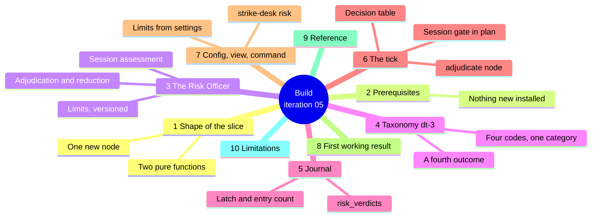
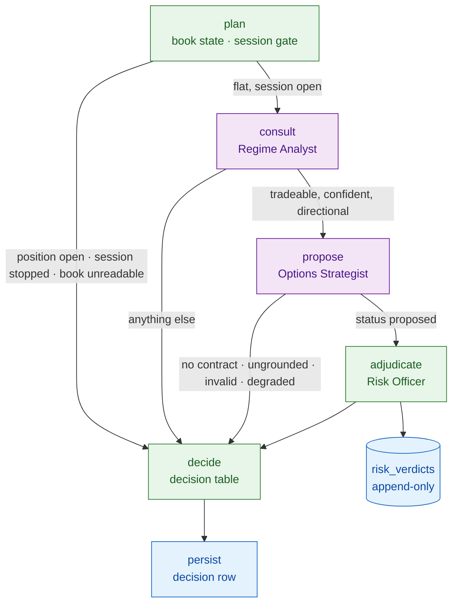

# Iteration 05 — Implementation Guide: the Risk Officer

> **Document:** the build instructions for UC-05. Read `01_use_case.md` first for what this
> slice is and why; this file is how it is made. `03_manual_test_cases.md` is what you check
> by hand, `04_test_automation.md` is what CI checks forever, and `05_deployment_guide.md`
> releases it to the host.
>
> **Starting point:** the iteration-04 desk. `strike_desk/src/strike_desk/` holds `config.py`,
> `errors.py`, `events.py`, `journal.py`, `mcp_toolbox.py`, `grounding.py`, `model_client.py`,
> `prompt_registry.py`, `regime_analyst.py`, `options_strategist.py`, `playbook.py`,
> `decline_taxonomy.py`, `decline_report.py`, `proposal_view.py`, `graph.py`, `runner.py`,
> `service.py`, `session.py`, `specialists.py`, `book_state.py`, `observability.py`,
> `openalgo_client.py`, `__main__.py` and two prompt artifacts. The journal is at
> `SCHEMA_VERSION = 4`, the taxonomy at `dt-2` and the playbook at `pb-1`.
>
> **Ending point:** the same desk with a deterministic Risk Officer, a `risk_verdicts` table, a
> session-stop latch, a taxonomy at `dt-3` with a fourth outcome, a `strike-desk risk` command,
> and ticks that can end in `enter`. Still no order path.



## 1. What you are adding, and the shape of it

Two files are new and seven are edited, and the whole slice is smaller than iteration 04's
because none of it talks to anything. `risk_officer.py` is pure arithmetic over data the tick
already holds; `risk_view.py` renders a row. Everything else is wiring.

| File | What it is |
| --- | --- |
| `risk_officer.py` | The limits as a frozen, versioned set, plus `assess_session` and `adjudicate`. No I/O of any kind. |
| `risk_view.py` | One verdict row, rendered as text or as JSON, so the two cannot disagree. |

| File | Edit |
| --- | --- |
| `config.py` | Eight risk settings, two invariants, and the derived limit set. |
| `errors.py` | `RiskInputUnavailable`. |
| `decline_taxonomy.py` | The `enter` outcome, the `risk` category, four codes. Additive only. |
| `journal.py` | The `risk_verdicts` table, four repository methods, `SCHEMA_VERSION = 5`. |
| `decline_report.py` | Entries in the window rendering. |
| `graph.py` | The session gate in `plan`, an `adjudicate` node, a router, four decision-table branches. |
| `__main__.py` | The `risk` command, and the limits artifact in `status`. |

Build them in the order of the sections below. The officer comes first because it is the only
file with real logic in it and because its tests need nothing else; the graph comes last
because it is the only file where a mistake shows up as a wrong decision rather than as an
import error.

The tick's new shape is one node and one gate. The gate lives in `plan` so a stopped session
costs nothing, and the node lives after `propose` so a proposal is adjudicated only once it is
known to be well formed:



**The Risk Officer is not registered as a specialist.** Resist that shape even though
`ROLE_RISK` already exists and the registry is right there. The registry is the delegation
port for *agents*: it runs its callee on a thread pool under a hard timeout and converts a
slow one into `SpecialistTimeout`. A safety limit that can time out is not a safety limit, and
a limit that runs on another thread is a limit whose failure mode you now have to reason
about. `adjudicate` is called directly, in the graph node, on the tick's own thread, and it
returns in microseconds. `ROLE_RISK` stays in `specialists.py` because the taxonomy's
`no_risk` sentence still exists for the rows iteration 04 wrote, but nothing registers it and
`registered_roles()` never contains it.

## 2. Prerequisites and pinned versions

Nothing new is installed. This slice adds no dependency, no prompt, no model call and no
network call, so `strike_desk/pyproject.toml` changes in one place only:

### `strike_desk/pyproject.toml`

```toml
[project]
name = "strike-desk"
version = "0.5.0"
```

Run `uv sync` after the bump so `strike_desk/uv.lock` records the new version. The pins that
matter are the ones iterations 01 to 04 already hold — `langgraph==1.2.9`,
`langgraph-checkpoint-sqlite==3.1.0`, `sqlalchemy==2.0.51`, `pydantic==2.13.4`,
`pydantic-settings==2.14.2`, `pytest==9.1.1` — and none of them moves here.

The host prerequisite is a **live broker session**, for a different reason than iteration 04's.
The strategist needed one to read a chain; the officer needs one because every rupee limit is
a percentage of a capital base read from `/api/v1/funds`, and a funds response the desk cannot
parse is the `hold` verdict rather than a pass. You can build and test the whole slice with no
broker at all — the suite runs against fixture book states — but you cannot *watch it work* on
the host without one.

## 3. The Risk Officer

Everything in this file is a pure function over data the caller already has. It performs no
I/O, imports nothing from the model, prompt or specialist layers, and raises nothing: an
input it cannot use becomes a `hold` verdict, because a risk check that raises is a risk check
that can be swallowed by an exception handler somewhere upstream.

**Read the two comparison rules before the code, because half the suite exists to hold them.**
A **rupee limit** is breached when the observed value is *at or beyond* the configured one.
Sitting exactly on a cap is a breach, not a pass — a cap is the amount you may not lose, and
the catalog says so in as many words. A **count limit** is inclusive: `max_lots = 2` permits
two lots and refuses three. To keep those two rules from tangling, every observed value means
*what the book would show if this trade were taken* — one open position plus this one, three
entries today plus this one — so both comparisons read the same way even though one is strict
and the other is not.

The second thing worth understanding before the code is the **capital base**, which is the
single decision this slice had to make on its own. FR-5 gives the daily and per-trade caps as
percentages of "deployed capital" and the deployment ceiling as a percentage of "account", and
the literal composition of those two is self-defeating: on a ₹10,00,000 account a 10% ceiling
gives ₹1,00,000 of deployed capital, and 0.5% of that is ₹500 — below the stop-loss risk of a
single NIFTY lot, so every proposal would be vetoed and the limit would be enforcing nothing
except that the desk never trades. So **all four percentages are taken of one base**: available
cash plus utilised margin, which is the capital the account actually has at work or ready to
put to work. The base is stored on every verdict row beside the configured and observed
values, because a percentage is not checkable after the fact without the number it was a
percentage of.

`RiskLimits` mirrors `Playbook`: resolved from settings once, frozen, and digested so a change
to `STRIKE_DESK_RISK_DAILY_LOSS_CAP_PCT` on the host moves the artifact stamped on every
subsequent verdict. `assess_session` answers "may the desk propose at all today?" from the
book alone and is called in `plan`, before a token is spent. `adjudicate` answers "may it take
*this*?" and is called after the playbook.

The size solver is the one piece of real logic. When a rupee limit binds only because of size,
it walks the lot count down from what was requested and takes the first count that is strictly
inside every rupee limit; if no count clears, the verdict is a veto naming the limit that
still bound at one lot. Count limits are never resolved by reduction — a fourth trade is a
fourth trade however small it is — and that is enforced by checking them before the solver
runs.

### `strike_desk/src/strike_desk/risk_officer.py`

```python
"""The Risk Officer: the hard limits, and the pure functions that adjudicate against them.

No model, no tool, no network, no timeout, no exception. Every number used here is
recomputed from the proposal's own declared prices and from the book read this tick — the
model's rationale has no standing in this module, which is why the module cannot import it.
"""

from __future__ import annotations

import hashlib
import json
import uuid
from collections.abc import Mapping, Sequence
from dataclasses import asdict, dataclass
from datetime import date, datetime, time
from typing import Any

from .config import Settings
from .grounding import ProposalSubmission
from .playbook import Playbook
from .playbook import check as playbook_check

RISK_LIMITS_VERSION = "rl-1"

VERDICT_PASS = "pass"
VERDICT_REDUCE = "reduce"
VERDICT_VETO = "veto"
VERDICT_HOLD = "hold"
#: The two verdicts that permit an intent. Everything else ends the tick without one.
CLEARING_VERDICTS = frozenset({VERDICT_PASS, VERDICT_REDUCE})

LIMIT_CAPITAL_BASE = "capital-base"
LIMIT_DAILY_LOSS = "daily-loss-cap"
LIMIT_PER_TRADE_LOSS = "per-trade-loss-cap"
LIMIT_MAX_POSITIONS = "max-concurrent-positions"
LIMIT_DEPLOYED_CAPITAL = "deployed-capital-ceiling"
LIMIT_PER_INDEX_EXPOSURE = "per-index-exposure"
LIMIT_MAX_LOTS = "max-lots"
LIMIT_MAX_TRADES = "max-trades-per-day"
LIMIT_EXPIRY_WINDOW = "expiry-day-window"
LIMIT_PROPOSAL_SHAPE = "proposal-shape"

#: The eight limits FR-5 names, in the order they are evaluated.
FR5_LIMITS: tuple[str, ...] = (
    LIMIT_DAILY_LOSS,
    LIMIT_MAX_POSITIONS,
    LIMIT_MAX_TRADES,
    LIMIT_EXPIRY_WINDOW,
    LIMIT_MAX_LOTS,
    LIMIT_PER_TRADE_LOSS,
    LIMIT_DEPLOYED_CAPITAL,
    LIMIT_PER_INDEX_EXPOSURE,
)

#: The limits a smaller position can satisfy. A count limit is never one of them.
SIZEABLE_LIMITS: tuple[str, ...] = (
    LIMIT_PER_TRADE_LOSS,
    LIMIT_DEPLOYED_CAPITAL,
    LIMIT_PER_INDEX_EXPOSURE,
)

UNIT_RUPEES = "INR"
UNIT_COUNT = "count"
UNIT_CLOCK = "IST-minutes"

#: The observed value recorded for a clock limit that does not apply today.
NOT_APPLICABLE = -1.0


@dataclass(frozen=True)
class LimitCheck:
    """One limit, evaluated: what it was set to, what was observed, whether it bound."""

    limit: str
    unit: str
    configured: float
    observed: float
    breached: bool
    detail: str

    def as_dict(self) -> dict[str, Any]:
        return asdict(self)


def _rupee_check(limit: str, configured: float, observed: float, detail: str) -> LimitCheck:
    """A money limit. Touching the cap is breaching it.

    Both values are rounded to paise *before* they are compared, so the verdict a row
    records is the verdict its own two numbers imply. A stored ``3000.00`` beside a stored
    ``3000.00`` and ``breached: false`` is an audit row nobody can check.
    """
    cap = round(configured, 2)
    seen = round(observed, 2)
    return LimitCheck(
        limit=limit,
        unit=UNIT_RUPEES,
        configured=cap,
        observed=seen,
        breached=seen >= cap,
        detail=detail,
    )


def _count_check(limit: str, configured: int, observed: int, detail: str) -> LimitCheck:
    """A count limit. The configured number is permitted; one more is not."""
    return LimitCheck(
        limit=limit,
        unit=UNIT_COUNT,
        configured=float(configured),
        observed=float(observed),
        breached=observed > configured,
        detail=detail,
    )


@dataclass(frozen=True)
class RiskLimits:
    """The hard limits, resolved from settings once and then immutable."""

    daily_loss_cap_pct: float
    per_trade_loss_cap_pct: float
    deployed_capital_pct: float
    per_index_exposure_pct: float
    max_concurrent_positions: int
    max_lots: int
    max_trades_per_day: int
    capital_floor: float
    expiry_cutoff: str

    @classmethod
    def from_settings(cls, settings: Settings) -> RiskLimits:
        return cls(
            daily_loss_cap_pct=settings.risk_daily_loss_cap_pct,
            per_trade_loss_cap_pct=settings.risk_per_trade_loss_cap_pct,
            deployed_capital_pct=settings.risk_deployed_capital_pct,
            per_index_exposure_pct=settings.risk_per_index_exposure_pct,
            max_concurrent_positions=settings.risk_max_concurrent_positions,
            max_lots=settings.risk_max_lots,
            max_trades_per_day=settings.risk_max_trades_per_day,
            capital_floor=settings.risk_capital_floor,
            expiry_cutoff=settings.expiry_cutoff,
        )

    @property
    def digest(self) -> str:
        """A content digest over the resolved limits, so a change is attributable."""
        canonical = json.dumps(asdict(self), sort_keys=True, separators=(",", ":"))
        return hashlib.sha256(canonical.encode("utf-8")).hexdigest()[:12]

    @property
    def artifact(self) -> str:
        return f"{RISK_LIMITS_VERSION}+{self.digest}"

    @property
    def expiry_cutoff_time(self) -> time:
        return time.fromisoformat(self.expiry_cutoff)

    def rupees(self, base: float, pct: float) -> float:
        return base * pct / 100.0

    def describe(self) -> str:
        """The limits as ``status`` prints them."""
        return "\n".join(
            (
                f"  daily loss cap        {self.daily_loss_cap_pct:.2f}% of base",
                f"  per-trade loss cap    {self.per_trade_loss_cap_pct:.2f}% of base",
                f"  deployed capital      {self.deployed_capital_pct:.2f}% of base",
                f"  per-index exposure    {self.per_index_exposure_pct:.2f}% of base",
                f"  max positions         {self.max_concurrent_positions}",
                f"  max lots per trade    {self.max_lots}",
                f"  max trades per day    {self.max_trades_per_day}",
                f"  capital base floor    Rs {self.capital_floor:,.0f}",
                f"  expiry-day cutoff     {self.expiry_cutoff} IST",
            )
        )


@dataclass(frozen=True)
class SessionAssessment:
    """Whether the desk may propose at all today, from the book alone."""

    stopped: bool
    check: LimitCheck
    capital_base: float
    detail: str


@dataclass(frozen=True)
class RiskVerdict:
    """One adjudication. ``checks`` is evaluated at the size that was requested."""

    verdict: str
    checks: tuple[LimitCheck, ...]
    tripped: LimitCheck | None
    lots_requested: int
    lots_cleared: int
    capital_base: float
    premium_at_risk: float
    max_loss_at_stop: float
    session_stop: bool
    detail: str

    @property
    def cleared(self) -> bool:
        return self.verdict in CLEARING_VERDICTS

    def as_dict(self) -> dict[str, Any]:
        return {
            "verdict": self.verdict,
            "checks": [check.as_dict() for check in self.checks],
            "tripped": self.tripped.as_dict() if self.tripped else None,
            "lots_requested": self.lots_requested,
            "lots_cleared": self.lots_cleared,
            "capital_base": self.capital_base,
            "premium_at_risk": self.premium_at_risk,
            "max_loss_at_stop": self.max_loss_at_stop,
            "session_stop": self.session_stop,
            "detail": self.detail,
        }


def capital_base(book: Mapping[str, Any]) -> float | None:
    """Available cash plus utilised margin: the one base every percentage is taken of."""
    try:
        cash = float(book["available_cash"])
        margin = float(book["utilised_margin"])
    except (KeyError, TypeError, ValueError):
        return None
    base = cash + margin
    return base if base > 0 else None


def day_loss(book: Mapping[str, Any]) -> float:
    """The day's loss as a positive number. A profitable day loses nothing."""
    try:
        pnl = float(book.get("realised_pnl") or 0.0) + float(book.get("unrealised_pnl") or 0.0)
    except (TypeError, ValueError):
        return 0.0
    return max(0.0, -pnl)


def open_premium(book: Mapping[str, Any]) -> float:
    """Premium already deployed in open positions, at the price it was paid."""
    total = 0.0
    for position in book.get("open_positions") or ():
        if not isinstance(position, Mapping):
            continue
        try:
            total += abs(float(position.get("quantity") or 0)) * float(
                position.get("average_price") or 0.0
            )
        except (TypeError, ValueError):
            continue
    return total


def assess_session(book: Mapping[str, Any], limits: RiskLimits) -> SessionAssessment:
    """May the desk propose entries today? Read before any specialist is consulted."""
    base = capital_base(book)
    if base is None or base <= limits.capital_floor:
        check = _rupee_check(
            LIMIT_CAPITAL_BASE,
            limits.capital_floor,
            base or 0.0,
            "capital base is unusable; the daily cap is evaluated per proposal",
        )
        return SessionAssessment(
            stopped=False,
            check=check,
            capital_base=base or 0.0,
            detail=check.detail,
        )

    cap = limits.rupees(base, limits.daily_loss_cap_pct)
    observed = day_loss(book)
    check = _rupee_check(
        LIMIT_DAILY_LOSS,
        cap,
        observed,
        f"day P&L against {limits.daily_loss_cap_pct:.2f}% of a Rs {base:,.0f} base",
    )
    return SessionAssessment(
        stopped=check.breached,
        check=check,
        capital_base=base,
        detail=(
            f"the day is down Rs {observed:,.0f} against a Rs {cap:,.0f} cap"
            if check.breached
            else f"Rs {cap - observed:,.0f} of daily headroom remains"
        ),
    )


def held(limit: str, detail: str, *, lots_requested: int = 0, base: float = 0.0) -> RiskVerdict:
    """The verdict for an input the officer cannot use. Never a pass."""
    check = LimitCheck(
        limit=limit,
        unit=UNIT_RUPEES if limit == LIMIT_CAPITAL_BASE else UNIT_COUNT,
        configured=0.0,
        observed=0.0,
        breached=True,
        detail=detail,
    )
    return RiskVerdict(
        verdict=VERDICT_HOLD,
        checks=(check,),
        tripped=check,
        lots_requested=lots_requested,
        lots_cleared=0,
        capital_base=base,
        premium_at_risk=0.0,
        max_loss_at_stop=0.0,
        session_stop=False,
        detail=detail,
    )


def _sizeable_checks(
    proposal: ProposalSubmission,
    *,
    lots: int,
    base: float,
    limits: RiskLimits,
    already_deployed: float,
) -> list[LimitCheck]:
    """The three rupee limits, evaluated at a given lot count."""
    quantity = lots * proposal.lot_size
    premium = proposal.entry_price_high * quantity
    loss_at_stop = max(0.0, proposal.entry_price_high - proposal.stop_price) * quantity
    deployed_cap = limits.rupees(base, limits.deployed_capital_pct)
    exposure_cap = limits.rupees(base, limits.per_index_exposure_pct)
    return [
        _rupee_check(
            LIMIT_PER_TRADE_LOSS,
            limits.rupees(base, limits.per_trade_loss_cap_pct),
            loss_at_stop,
            f"{lots} lot(s) risking (entry {proposal.entry_price_high:.2f} - stop "
            f"{proposal.stop_price:.2f}) x {quantity}",
        ),
        _rupee_check(
            LIMIT_DEPLOYED_CAPITAL,
            deployed_cap,
            already_deployed + premium,
            f"Rs {already_deployed:,.0f} already deployed plus Rs {premium:,.0f} of new premium",
        ),
        _rupee_check(
            LIMIT_PER_INDEX_EXPOSURE,
            exposure_cap,
            already_deployed + premium,
            f"{proposal.index_symbol} exposure after this entry",
        ),
    ]


def _first_breach(checks: Sequence[LimitCheck]) -> LimitCheck | None:
    for check in checks:
        if check.breached:
            return check
    return None


def adjudicate(
    proposal: ProposalSubmission,
    book: Mapping[str, Any],
    limits: RiskLimits,
    playbook: Playbook,
    *,
    now_ist: datetime,
    entries_today: int,
) -> RiskVerdict:
    """Clear a verified proposal against every hard limit.

    Returns ``pass``, ``reduce``, ``veto`` or ``hold``. Never raises, never rewrites the
    proposal in place, and never consults anything the model wrote.
    """
    base = capital_base(book)
    if base is None or base <= limits.capital_floor:
        return held(
            LIMIT_CAPITAL_BASE,
            f"capital base Rs {base or 0.0:,.0f} is at or below the "
            f"Rs {limits.capital_floor:,.0f} floor",
            lots_requested=proposal.lots,
            base=base or 0.0,
        )
    if proposal.lot_size <= 0 or proposal.lots <= 0:
        return held(
            LIMIT_PROPOSAL_SHAPE,
            f"proposal declares {proposal.lots} lot(s) of {proposal.lot_size}",
            lots_requested=max(0, proposal.lots),
            base=base,
        )

    already_deployed = open_premium(book)
    open_positions = len(book.get("open_positions") or ())
    checks: list[LimitCheck] = []

    session = assess_session(book, limits)
    checks.append(session.check)

    checks.append(
        _count_check(
            LIMIT_MAX_POSITIONS,
            limits.max_concurrent_positions,
            open_positions + 1,
            f"{open_positions} open now, {open_positions + 1} after this entry",
        )
    )
    checks.append(
        _count_check(
            LIMIT_MAX_TRADES,
            limits.max_trades_per_day,
            entries_today + 1,
            f"{entries_today} entr(ies) journalled today, {entries_today + 1} after this one",
        )
    )

    cutoff = limits.expiry_cutoff_time
    try:
        expiry = date.fromisoformat(proposal.expiry)
    except ValueError:
        expiry = None
    expires_today = expiry == now_ist.date()
    cutoff_minutes = cutoff.hour * 60 + cutoff.minute
    now_minutes = now_ist.hour * 60 + now_ist.minute
    checks.append(
        LimitCheck(
            limit=LIMIT_EXPIRY_WINDOW,
            unit=UNIT_CLOCK,
            configured=float(cutoff_minutes),
            observed=float(now_minutes) if expires_today else NOT_APPLICABLE,
            breached=expires_today and now_minutes >= cutoff_minutes,
            detail=(
                f"contract expires today; now {now_ist.strftime('%H:%M')} IST "
                f"against a {limits.expiry_cutoff} cutoff"
                if expires_today
                else f"expiry {proposal.expiry} is not today"
            ),
        )
    )
    checks.append(
        _count_check(
            LIMIT_MAX_LOTS,
            limits.max_lots,
            proposal.lots,
            f"{proposal.lots} lot(s) proposed",
        )
    )

    # Nothing above this line can be fixed by taking a smaller position.
    blocking = _first_breach(checks)
    if blocking is not None:
        requested = _sizeable_checks(
            proposal,
            lots=proposal.lots,
            base=base,
            limits=limits,
            already_deployed=already_deployed,
        )
        return RiskVerdict(
            verdict=VERDICT_VETO,
            checks=tuple(checks + requested),
            tripped=blocking,
            lots_requested=proposal.lots,
            lots_cleared=0,
            capital_base=base,
            premium_at_risk=0.0,
            max_loss_at_stop=0.0,
            session_stop=blocking.limit == LIMIT_DAILY_LOSS,
            detail=blocking.detail,
        )

    requested = _sizeable_checks(
        proposal,
        lots=proposal.lots,
        base=base,
        limits=limits,
        already_deployed=already_deployed,
    )
    checks.extend(requested)

    cleared_lots = 0
    for candidate in range(proposal.lots, 0, -1):
        trial = _sizeable_checks(
            proposal,
            lots=candidate,
            base=base,
            limits=limits,
            already_deployed=already_deployed,
        )
        if _first_breach(trial) is None:
            cleared_lots = candidate
            break

    tripped = _first_breach(requested)
    if cleared_lots == 0:
        binding = _first_breach(
            _sizeable_checks(
                proposal, lots=1, base=base, limits=limits, already_deployed=already_deployed
            )
        )
        return RiskVerdict(
            verdict=VERDICT_VETO,
            checks=tuple(checks),
            tripped=binding or tripped,
            lots_requested=proposal.lots,
            lots_cleared=0,
            capital_base=base,
            premium_at_risk=0.0,
            max_loss_at_stop=0.0,
            session_stop=False,
            detail=(binding or tripped).detail if (binding or tripped) else "no size clears",
        )

    quantity = cleared_lots * proposal.lot_size
    premium = proposal.entry_price_high * quantity
    loss_at_stop = max(0.0, proposal.entry_price_high - proposal.stop_price) * quantity

    if cleared_lots != proposal.lots:
        reduced = proposal.model_copy(update={"lots": cleared_lots, "quantity": quantity})
        violations = playbook_check(reduced, playbook, now_ist=now_ist)
        if violations:
            return RiskVerdict(
                verdict=VERDICT_VETO,
                checks=tuple(checks),
                tripped=tripped,
                lots_requested=proposal.lots,
                lots_cleared=0,
                capital_base=base,
                premium_at_risk=0.0,
                max_loss_at_stop=0.0,
                session_stop=False,
                detail=f"reduced to {cleared_lots} lot(s): {'; '.join(violations[:2])}",
            )

    return RiskVerdict(
        verdict=VERDICT_PASS if cleared_lots == proposal.lots else VERDICT_REDUCE,
        checks=tuple(checks),
        tripped=tripped if cleared_lots != proposal.lots else None,
        lots_requested=proposal.lots,
        lots_cleared=cleared_lots,
        capital_base=base,
        premium_at_risk=round(premium, 2),
        max_loss_at_stop=round(loss_at_stop, 2),
        session_stop=False,
        detail=(
            f"cleared {cleared_lots} lot(s) risking Rs {loss_at_stop:,.0f}"
            if cleared_lots == proposal.lots
            else f"reduced from {proposal.lots} to {cleared_lots} lot(s) to fit "
            f"{tripped.limit if tripped else 'a rupee limit'}"
        ),
    )


def build_verdict_row(
    verdict: RiskVerdict,
    *,
    limits: RiskLimits,
    tick_id: str,
    trace_id: str,
    trading_day: str,
    index_symbol: str,
    proposal_id: str | None,
    symbol: str | None,
    latency_us: int,
) -> dict[str, Any]:
    """Everything ``record_risk_verdict`` needs, in the shape the table stores it."""
    tripped = verdict.tripped
    return {
        "verdict_id": str(uuid.uuid4()),
        "tick_id": tick_id,
        "trace_id": trace_id,
        "proposal_id": proposal_id,
        "created_at_utc": None,  # filled by the caller with a timezone-aware UTC datetime
        "trading_day": trading_day,
        "index_symbol": index_symbol,
        "symbol": symbol,
        "verdict": verdict.verdict,
        "tripped_limit": tripped.limit if tripped else None,
        "configured_value": tripped.configured if tripped else None,
        "observed_value": tripped.observed if tripped else None,
        "limit_unit": tripped.unit if tripped else None,
        "capital_base": verdict.capital_base,
        "lots_requested": verdict.lots_requested,
        "lots_cleared": verdict.lots_cleared,
        "premium_at_risk": verdict.premium_at_risk,
        "max_loss_at_stop": verdict.max_loss_at_stop,
        "session_stop": verdict.session_stop,
        "checks_json": json.dumps([check.as_dict() for check in verdict.checks], sort_keys=True),
        "limits_artifact": limits.artifact,
        "detail": verdict.detail,
        "latency_us": latency_us,
    }


__all__ = [
    "CLEARING_VERDICTS",
    "FR5_LIMITS",
    "LIMIT_CAPITAL_BASE",
    "LIMIT_DAILY_LOSS",
    "LIMIT_DEPLOYED_CAPITAL",
    "LIMIT_EXPIRY_WINDOW",
    "LIMIT_MAX_LOTS",
    "LIMIT_MAX_POSITIONS",
    "LIMIT_MAX_TRADES",
    "LIMIT_PER_INDEX_EXPOSURE",
    "LIMIT_PER_TRADE_LOSS",
    "LIMIT_PROPOSAL_SHAPE",
    "RISK_LIMITS_VERSION",
    "SIZEABLE_LIMITS",
    "UNIT_CLOCK",
    "UNIT_COUNT",
    "UNIT_RUPEES",
    "VERDICT_HOLD",
    "VERDICT_PASS",
    "VERDICT_REDUCE",
    "VERDICT_VETO",
    "LimitCheck",
    "RiskLimits",
    "RiskVerdict",
    "SessionAssessment",
    "adjudicate",
    "assess_session",
    "build_verdict_row",
    "capital_base",
    "day_loss",
    "held",
    "open_premium",
]
```

`created_at_utc` is deliberately left `None` in the row builder and filled by the graph node.
The officer is a pure function and reading the clock is not pure; the node that already stamps
every other row is the one place a timestamp comes from.

One edit to `errors.py`, beside `PlaybookViolation`:

```python
class RiskInputUnavailable(StrikeDeskError):
    """A limit could not be evaluated because an input it needs was unusable."""
```

Nothing raises it in this slice — the officer returns a `hold` instead — but the type exists
so the CLI and any future caller that wants to fail rather than hold has one name for the
condition, and so the exception hierarchy stays complete.

## 4. The taxonomy gains an outcome

Four codes, one category, and one change that is not additive in the way iteration 04's was:
`OUTCOMES` gains `enter`. That is safe for exactly the reason the entry set is safe — no
existing entry changes code, category, disposition or `default` sentence, so no row written
under `dt-1` or `dt-2` becomes drift. What changes is that the frozen set now admits a
third outcome, and `_validate`'s error message stops calling it a no-trade outcome, because it
is no longer only one.

`risk-veto` is `routine`, and that is the disposition decision that matters here for the same
reason `no-viable-contract` was in iteration 04: a veto is the risk layer doing its job, and a
day full of vetoes is a day the desk protected itself. Only `risk-input-unavailable` is
`degraded`, because an unreadable capital base is the environment failing rather than the
playbook working. Nothing in this slice is a `defect` — a limit that binds is never a bug.

`risk-cleared` carries `enter` and is `routine`. Note the sentence: it names the contract, the
size, the risk and the stop, and it ends by saying what the row is *not*. An intent that reads
like a fill is a sentence that will be misread on a bad morning.

### `strike_desk/src/strike_desk/decline_taxonomy.py` — edits

```python
TAXONOMY_VERSION = "dt-3"

CATEGORY_BOOK = "book"
CATEGORY_CONTRACT = "contract"
CATEGORY_DATA = "data"
CATEGORY_REGIME = "regime"
CATEGORY_RISK = "risk"
CATEGORY_SPECIALIST = "specialist"
CATEGORY_SYSTEM = "system"
CATEGORY_UNKNOWN = "unknown"
CATEGORIES = frozenset(
    {
        CATEGORY_BOOK,
        CATEGORY_CONTRACT,
        CATEGORY_DATA,
        CATEGORY_REGIME,
        CATEGORY_RISK,
        CATEGORY_SPECIALIST,
        CATEGORY_SYSTEM,
    }
)

OUTCOMES = frozenset({"decline", "hold", "enter"})
```

One line inside `_validate` changes with it:

```python
        if item.outcome not in OUTCOMES:
            raise ValueError(f"{item.code!r}: outcome {item.outcome!r} is not a tick outcome")
```

Four entries are added at the end of `_ENTRIES`, so the tuple still reads in tick order:

```python
    _entry(
        "risk-session-stopped",
        outcome="decline",
        category=CATEGORY_RISK,
        disposition=DISPOSITION_ROUTINE,
        summary="the day's loss cap has stopped the session",
        default=(
            "Declined: the day is down {observed} against a {configured} daily loss cap. "
            "The desk stops proposing entries for the rest of the session."
        ),
    ),
    _entry(
        "risk-input-unavailable",
        outcome="decline",
        category=CATEGORY_RISK,
        disposition=DISPOSITION_DEGRADED,
        summary="a hard limit could not be evaluated",
        default=(
            "Declined: the {limit} limit could not be evaluated ({detail}). "
            "A proposal is held, never assumed safe."
        ),
    ),
    _entry(
        "risk-veto",
        outcome="decline",
        category=CATEGORY_RISK,
        disposition=DISPOSITION_ROUTINE,
        summary="a hard limit vetoed the proposal",
        default=(
            "Declined: {symbol} trips the {limit} limit - configured {configured}, "
            "observed {observed}. The veto is arithmetic and is not negotiated."
        ),
        sized_out=(
            "Declined: even one lot of {symbol} trips the {limit} limit - configured "
            "{configured}, observed {observed}. There is no size this desk may take."
        ),
        playbook_disagreed=(
            "Declined: {symbol} reduced to fit {limit} no longer passes the playbook "
            "({detail}). A contract two checks disagree about is never bought."
        ),
    ),
    _entry(
        "risk-cleared",
        outcome="enter",
        category=CATEGORY_RISK,
        disposition=DISPOSITION_ROUTINE,
        summary="the contract cleared every hard limit",
        default=(
            "Intent: buy {lots} lot(s) of {symbol} at up to {entry}, risking {risk} to the "
            "{stop} stop against a {base} capital base. This is an intent, not an order."
        ),
        reduced=(
            "Intent: buy {lots} lot(s) of {symbol} at up to {entry}, cut from {requested} "
            "lot(s) to fit the {limit} limit of {configured}. Risking {risk} to the {stop} "
            "stop. This is an intent, not an order."
        ),
    ),
```

## 5. The journal grows a table

`SCHEMA_VERSION` moves to 5 and one table is added, so the migration is the same easy kind
iteration 04 had: `create_all` issues `CREATE TABLE IF NOT EXISTS`, the `after_create` DDL
listener attaches the append-only triggers, and no existing row is read, locked or rewritten.
A previous binary opening a widened database never selects from `risk_verdicts` and never
inserts into it.

`checks_json` stores every limit the officer evaluated, not only the one that bound. That is
the column that makes the journal answer "how close were we?" rather than only "what stopped
us?", and it is the reason a `pass` row is worth keeping at all. `capital_base` sits beside
the tripped limit's configured and observed values because all three are needed to check the
arithmetic later: a cap of ₹3,000 means nothing without the ₹6,00,000 it was half a percent
of.

`latency_us` is microseconds rather than milliseconds. This is control-plane code and the
NFR it lives under is sub-second by an enormous margin; a column that rounds every verdict to
`0 ms` would be recording nothing.

### `strike_desk/src/strike_desk/journal.py` — edits

```python
SCHEMA_VERSION = 5


class RiskVerdictRow(Base):
    """One row per adjudication. Never updated, never deleted."""

    __tablename__ = "risk_verdicts"

    id: Mapped[int] = mapped_column(Integer, primary_key=True, autoincrement=True)
    verdict_id: Mapped[str] = mapped_column(String(36), unique=True, nullable=False)
    tick_id: Mapped[str] = mapped_column(String(48), index=True, nullable=False)
    trace_id: Mapped[str] = mapped_column(String(32), index=True, nullable=False)
    proposal_id: Mapped[str | None] = mapped_column(String(36), index=True, nullable=True)
    created_at_utc: Mapped[datetime] = mapped_column(DateTime(timezone=True), nullable=False)
    trading_day: Mapped[str] = mapped_column(String(10), index=True, nullable=False)
    index_symbol: Mapped[str] = mapped_column(String(32), nullable=False)
    symbol: Mapped[str | None] = mapped_column(String(64), nullable=True)
    verdict: Mapped[str] = mapped_column(String(8), index=True, nullable=False)
    tripped_limit: Mapped[str | None] = mapped_column(String(32), index=True, nullable=True)
    configured_value: Mapped[float | None] = mapped_column(Float, nullable=True)
    observed_value: Mapped[float | None] = mapped_column(Float, nullable=True)
    limit_unit: Mapped[str | None] = mapped_column(String(16), nullable=True)
    capital_base: Mapped[float] = mapped_column(Float, nullable=False)
    lots_requested: Mapped[int] = mapped_column(Integer, nullable=False, default=0)
    lots_cleared: Mapped[int] = mapped_column(Integer, nullable=False, default=0)
    premium_at_risk: Mapped[float] = mapped_column(Float, nullable=False, default=0.0)
    max_loss_at_stop: Mapped[float] = mapped_column(Float, nullable=False, default=0.0)
    session_stop: Mapped[bool] = mapped_column(Boolean, nullable=False, default=False)
    checks_json: Mapped[str] = mapped_column(Text, nullable=False)
    limits_artifact: Mapped[str] = mapped_column(String(32), nullable=False)
    detail: Mapped[str] = mapped_column(Text, nullable=False)
    latency_us: Mapped[int] = mapped_column(Integer, nullable=False, default=0)
    schema_version: Mapped[int] = mapped_column(Integer, nullable=False, default=SCHEMA_VERSION)
```

The trigger loop takes the new table:

```python
for _table in (
    Decision.__table__,
    TraceSpan.__table__,
    RegimeRead.__table__,
    Proposal.__table__,
    RiskVerdictRow.__table__,
):
```

And four methods join the repository class:

```python
    def record_risk_verdict(self, **fields: Any) -> str:
        """Append one verdict. Raises JournalWriteError so the tick fails closed."""
        try:
            with self.session_scope() as session:
                session.add(RiskVerdictRow(**fields))
        except SQLAlchemyError as exc:
            raise JournalWriteError(
                f"could not append risk verdict: {exc.__class__.__name__}"
            ) from exc
        return str(fields["verdict_id"])

    def list_risk_verdicts(self, trading_day: str, limit: int = 200) -> Sequence[RiskVerdictRow]:
        with self.session_scope() as session:
            statement = (
                select(RiskVerdictRow)
                .where(RiskVerdictRow.trading_day == trading_day)
                .order_by(RiskVerdictRow.created_at_utc.asc())
                .limit(limit)
            )
            return list(session.execute(statement).scalars())

    def recent_risk_days(self, days: int) -> list[str]:
        """The most recent trading days holding at least one verdict, oldest first."""
        with self.session_scope() as session:
            statement = (
                select(RiskVerdictRow.trading_day)
                .distinct()
                .order_by(RiskVerdictRow.trading_day.desc())
                .limit(days)
            )
            found = [str(row) for row in session.execute(statement).scalars()]
        return sorted(found)

    def session_stopped(self, trading_day: str) -> bool:
        """True once a session-stop verdict has been latched for the day."""
        with self.session_scope() as session:
            statement = (
                select(RiskVerdictRow.id)
                .where(
                    RiskVerdictRow.trading_day == trading_day,
                    RiskVerdictRow.session_stop.is_(True),
                )
                .limit(1)
            )
            return session.execute(statement).first() is not None

    def count_entries(self, trading_day: str) -> int:
        """Entries journalled today — the observed value behind max-trades-per-day."""
        with self.session_scope() as session:
            statement = (
                select(func.count())
                .select_from(Decision)
                .where(Decision.trading_day == trading_day, Decision.outcome == "enter")
            )
            return int(session.execute(statement).scalar_one())
```

The latch is a query rather than a flag in memory, and that is deliberate: the service
restarts, and a desk that forgets it stopped itself because systemd bounced the unit is a desk
with no daily loss cap at all. One indexed lookup per tick costs nothing next to that.

`decline_report.py` needs one edit, in `render_window`, so the per-day table shows the outcome
the desk can now produce:

```python
        f"  {'day':<12}{'total':>6}{'declines':>10}{'holds':>7}{'entries':>9}"
        f"{'defects':>9}{'cost':>10}",
```

```python
        lines.append(
            f"  {day.trading_day:<12}{day.total:>6}{day.declines:>10}{day.holds:>7}"
            f"{day.entries:>9}{day.defects:>9}{day.token_cost_micros / 1_000_000:>10.4f}"
        )
```

Nothing else in the report changes. `build_day_report` resolves every row's class from the
taxonomy by code, so a `risk-cleared` row classifies as `risk`/`routine` with no drift, and
`DayReport.entries` and `healthy` already behave correctly — `healthy` counts defects, and an
entry is not one.

## 6. Wiring it into the tick

Three changes to `graph.py`: the session gate in `plan`, the `adjudicate` node with its
router, and four branches in the decision table. New constants beside the existing `REASON_*`
block:

```python
REASON_RISK_SESSION_STOPPED = "risk-session-stopped"
REASON_RISK_INPUT_UNAVAILABLE = "risk-input-unavailable"
REASON_RISK_VETO = "risk-veto"
REASON_RISK_CLEARED = "risk-cleared"
```

New `TickState` keys:

```python
    proposal_id: str | None
    session_stop: dict[str, Any] | None
    risk: dict[str, Any] | None
```

Two dictionaries rather than a dozen scalars, because the decision table needs the whole
verdict to phrase its sentence and LangGraph's checkpointer wants plain data. The imports:

```python
from datetime import UTC, datetime

from pydantic import ValidationError

from .config import IST, Settings
from .grounding import ProposalSubmission
from .playbook import Playbook
from .risk_officer import (
    LIMIT_PROPOSAL_SHAPE,
    SIZEABLE_LIMITS,
    UNIT_RUPEES,
    VERDICT_HOLD,
    VERDICT_REDUCE,
    VERDICT_VETO,
    RiskLimits,
    SessionAssessment,
    adjudicate as adjudicate_proposal,
    assess_session,
    build_verdict_row,
    held,
)
```

The `plan` node gains the session gate, immediately after the book is read and inside the same
span-bearing block. Insert it in place of the existing `return {"book": book.as_dict()}`:

```python
            snapshot = book.as_dict()
            limits = RiskLimits.from_settings(deps.settings)
            with tracer.start_as_current_span("risk.session") as risk_span:
                assessment = assess_session(snapshot, limits)
                risk_span.set_attribute("risk.limits_artifact", limits.artifact)
                risk_span.set_attribute("risk.capital_base", assessment.capital_base)
                risk_span.set_attribute("risk.daily_loss_configured", assessment.check.configured)
                risk_span.set_attribute("risk.daily_loss_observed", assessment.check.observed)
                latched = deps.journal.session_stopped(state["trading_day"])
                risk_span.set_attribute("risk.session_latched", latched)
                risk_span.set_attribute("risk.session_stopped", assessment.stopped or latched)
                if not (assessment.stopped or latched):
                    return {"book": snapshot}
                if assessment.stopped and not latched:
                    _latch_session_stop(deps, state, assessment, limits)
            return {
                "book": snapshot,
                "session_stop": {
                    "configured": assessment.check.configured,
                    "observed": assessment.check.observed,
                    "detail": assessment.detail,
                },
            }
```

When the latch already exists but this tick's own reading is no longer in breach — the book
recovered, or the trader closed a position at a profit — the tick still declines. A session
stop is for the session; it is not re-evaluated every fifteen minutes, and that is the point
of latching it rather than recomputing it.

`_latch_session_stop` sits beside `_record_proposal` at module level:

```python
def _latch_session_stop(
    deps: TickDeps, state: TickState, assessment: SessionAssessment, limits: RiskLimits
) -> None:
    """Write exactly one session-stop verdict for the day. The latch is a row, not a flag."""
    verdict = held(
        assessment.check.limit,
        assessment.detail,
        base=assessment.capital_base,
    )
    row = build_verdict_row(
        verdict,
        limits=limits,
        tick_id=state["tick_id"],
        trace_id=state["trace_id"],
        trading_day=state["trading_day"],
        index_symbol=deps.settings.index_symbol,
        proposal_id=None,
        symbol=None,
        latency_us=0,
    )
    row.update(
        {
            "created_at_utc": datetime.now(tz=UTC),
            "verdict": VERDICT_VETO,
            "session_stop": True,
            "tripped_limit": assessment.check.limit,
            "configured_value": assessment.check.configured,
            "observed_value": assessment.check.observed,
            "limit_unit": assessment.check.unit,
            "checks_json": json.dumps([assessment.check.as_dict()], sort_keys=True),
        }
    )
    deps.journal.record_risk_verdict(**row)
```

`route_after_plan` grows one condition, ahead of the position check so an open position still
takes the hold path:

```python
    def route_after_plan(state: TickState) -> str:
        if state.get("budget_exceeded") or state.get("book_error"):
            return "decide"
        book = state.get("book") or {}
        if book.get("open_positions"):
            return "decide"
        return "decide" if state.get("session_stop") else "consult"
```

`_record_proposal` gains one line so the verdict can point at the proposal it adjudicated —
capture what `record_proposal` returns and put it in state:

```python
    proposal_id = deps.journal.record_proposal(**build_proposal_row(...))
```
```python
        "proposal_id": proposal_id,
```

The `adjudicate` node and its router are nested inside `build_tick_graph` beside `propose`,
because they close over `deps` and `tracer`:

```python
    def route_after_propose(state: TickState) -> str:
        return "adjudicate" if state.get("proposal_status") == "proposed" else "decide"

    def adjudicate(state: TickState) -> dict[str, Any]:
        with tracer.start_as_current_span("tick.adjudicate") as span:
            limits = RiskLimits.from_settings(deps.settings)
            span.set_attribute("risk.limits_artifact", limits.artifact)
            payload = state.get("proposal") or {}
            started = time.perf_counter()
            try:
                proposal = ProposalSubmission.model_validate(payload)
            except ValidationError as exc:
                verdict = held(
                    LIMIT_PROPOSAL_SHAPE,
                    f"the proposal could not be read as a submission: {exc.error_count()} field(s)",
                )
            else:
                verdict = adjudicate_proposal(
                    proposal,
                    state.get("book") or {},
                    limits,
                    Playbook.from_settings(deps.settings),
                    now_ist=datetime.now(tz=IST),
                    entries_today=deps.journal.count_entries(state["trading_day"]),
                )
            latency_us = int((time.perf_counter() - started) * 1_000_000)

            row = build_verdict_row(
                verdict,
                limits=limits,
                tick_id=state["tick_id"],
                trace_id=state["trace_id"],
                trading_day=state["trading_day"],
                index_symbol=deps.settings.index_symbol,
                proposal_id=state.get("proposal_id"),
                symbol=str(payload.get("symbol") or "") or None,
                latency_us=latency_us,
            )
            row["created_at_utc"] = datetime.now(tz=UTC)
            deps.journal.record_risk_verdict(**row)

            span.set_attribute("risk.verdict", verdict.verdict)
            span.set_attribute("risk.limit", verdict.tripped.limit if verdict.tripped else "none")
            span.set_attribute(
                "risk.configured", verdict.tripped.configured if verdict.tripped else 0.0
            )
            span.set_attribute(
                "risk.observed", verdict.tripped.observed if verdict.tripped else 0.0
            )
            span.set_attribute("risk.capital_base", verdict.capital_base)
            span.set_attribute("risk.lots_requested", verdict.lots_requested)
            span.set_attribute("risk.lots_cleared", verdict.lots_cleared)
            span.set_attribute("risk.latency_us", latency_us)
            if verdict.verdict == VERDICT_HOLD:
                span.set_status(Status(StatusCode.ERROR, "risk input unavailable"))
            return {"risk": verdict.as_dict()}
```

The verdict row is written before the node returns, so the decision row that depends on it can
never be the only record of an intent. If the write raises, the tick fails closed on the
runner's internal-error path exactly as a failed proposal write does.

The decision table's final branch — iteration 04's unconditional `no_risk` decline — is
replaced by five. The `no_risk` return survives as the first of them, unreachable in normal
operation and correct if the graph is ever wired so that a proposal arrives unadjudicated:

```python
    risk = state.get("risk")
    if risk is None:
        return (
            OUTCOME_DECLINE,
            REASON_SPECIALIST_UNAVAILABLE,
            render(
                REASON_SPECIALIST_UNAVAILABLE,
                max_chars=cap,
                variant="no_risk",
                symbol=str(proposal.get("symbol", "a contract")),
                entry=f"{float(proposal.get('entry_price_high') or 0.0):.2f}",
                role=ROLE_RISK,
            ),
        )

    tripped = risk.get("tripped") or {}
    limit = str(tripped.get("limit", "a limit"))
    configured = _money(tripped.get("configured"), tripped.get("unit"))
    observed = _money(tripped.get("observed"), tripped.get("unit"))
    symbol = str(proposal.get("symbol", "the contract"))

    if risk["verdict"] == VERDICT_HOLD:
        return (
            OUTCOME_DECLINE,
            REASON_RISK_INPUT_UNAVAILABLE,
            render(
                REASON_RISK_INPUT_UNAVAILABLE,
                max_chars=cap,
                limit=limit,
                detail=str(risk.get("detail", "")),
            ),
        )
    if risk["verdict"] == VERDICT_VETO:
        variant = "default"
        if risk.get("lots_requested") and risk.get("lots_cleared") == 0:
            variant = "sized_out" if limit in SIZEABLE_LIMITS else "default"
        if "no longer passes the playbook" in str(risk.get("detail", "")):
            variant = "playbook_disagreed"
        return (
            OUTCOME_DECLINE,
            REASON_RISK_VETO,
            render(
                REASON_RISK_VETO,
                max_chars=cap,
                variant=variant,
                symbol=symbol,
                limit=limit,
                configured=configured,
                observed=observed,
                lots=risk.get("lots_cleared", 0),
                detail=str(risk.get("detail", "")),
            ),
        )

    reduced = risk["verdict"] == VERDICT_REDUCE
    return (
        OUTCOME_ENTER,
        REASON_RISK_CLEARED,
        render(
            REASON_RISK_CLEARED,
            max_chars=cap,
            variant="reduced" if reduced else "default",
            symbol=symbol,
            lots=risk.get("lots_cleared", 0),
            requested=risk.get("lots_requested", 0),
            entry=f"{float(proposal.get('entry_price_high') or 0.0):.2f}",
            stop=f"{float(proposal.get('stop_price') or 0.0):.2f}",
            risk=f"Rs {float(risk.get('max_loss_at_stop') or 0.0):,.0f}",
            base=f"Rs {float(risk.get('capital_base') or 0.0):,.0f}",
            limit=limit,
            configured=configured,
        ),
    )
```

The session-stop branch goes near the top of the table, after the book-error check and after
the open-position hold, because a stopped session still manages what it holds:

```python
    stop = state.get("session_stop")
    if stop:
        return (
            OUTCOME_DECLINE,
            REASON_RISK_SESSION_STOPPED,
            render(
                REASON_RISK_SESSION_STOPPED,
                max_chars=cap,
                configured=f"Rs {float(stop.get('configured') or 0.0):,.0f}",
                observed=f"Rs {float(stop.get('observed') or 0.0):,.0f}",
            ),
        )
```

`_money` is a two-line module-level helper that formats a limit's value according to its unit,
so a rupee cap reads as rupees and a lot ceiling reads as a count:

```python
def _money(value: Any, unit: Any) -> str:
    """Format a limit's value the way its unit wants to be read."""
    try:
        number = float(value)
    except (TypeError, ValueError):
        return "unspecified"
    return f"Rs {number:,.0f}" if unit == UNIT_RUPEES else f"{number:g}"
```

Finally the builder wires the node in. `propose` no longer edges straight to `decide`:

```python
    builder.add_node("adjudicate", adjudicate)
    builder.add_conditional_edges(
        "propose", route_after_propose, {"adjudicate": "adjudicate", "decide": "decide"}
    )
    builder.add_edge("adjudicate", "decide")
```

`service.py` needs no change at all. The officer is not a specialist, so nothing registers it,
and `_register_specialists` is exactly as iteration 04 left it.

## 7. Configuration, the view and the command

Eight settings arrive and two invariants come with them. The first refuses a per-trade cap
looser than the daily one, which would let a single trade end the session by itself. The
second refuses a risk lot ceiling above the playbook's, because a hard limit that is looser
than the style guide it backs up is a limit that never binds and will be read as protection it
is not providing.

### `strike_desk/src/strike_desk/config.py` — edits

```python
    # --- Risk Officer (control plane) ---------------------------------------
    risk_daily_loss_cap_pct: float = Field(default=2.0, gt=0.0, le=100.0)
    risk_per_trade_loss_cap_pct: float = Field(default=0.5, gt=0.0, le=100.0)
    risk_deployed_capital_pct: float = Field(default=10.0, gt=0.0, le=100.0)
    risk_per_index_exposure_pct: float = Field(default=10.0, gt=0.0, le=100.0)
    risk_max_concurrent_positions: int = Field(default=1, ge=1, le=10)
    risk_max_lots: int = Field(default=2, ge=1, le=20)
    risk_max_trades_per_day: int = Field(default=3, ge=1, le=50)
    risk_capital_floor: float = Field(default=50_000.0, ge=0.0, le=100_000_000.0)
```

Two clauses join the existing `_budgets_fit` model validator:

```python
        if self.risk_per_trade_loss_cap_pct > self.risk_daily_loss_cap_pct:
            raise ValueError(
                "risk_per_trade_loss_cap_pct must not exceed risk_daily_loss_cap_pct, or one "
                "trade can end the session"
            )
        if self.risk_max_lots > self.playbook_max_lots:
            raise ValueError(
                f"risk_max_lots {self.risk_max_lots} is looser than playbook_max_lots "
                f"{self.playbook_max_lots}; the hard limit must bind at or before the playbook"
            )
```

### `strike_desk/src/strike_desk/risk_view.py`

One object, two renderings, exactly as `proposal_view.py` does it for a proposal.

```python
"""One risk verdict row, rendered as text or as JSON. Two views, one object."""

from __future__ import annotations

import json
from typing import Any

from .journal import RiskVerdictRow
from .risk_officer import RISK_LIMITS_VERSION, UNIT_RUPEES

VERDICT_MARK = {
    "pass": "PASS",
    "reduce": "REDUCE",
    "veto": "VETO",
    "hold": "HOLD",
}


def _value(value: Any, unit: Any) -> str:
    try:
        number = float(value)
    except (TypeError, ValueError):
        return "-"
    return f"Rs {number:,.0f}" if unit == UNIT_RUPEES else f"{number:g}"


def as_dict(row: RiskVerdictRow) -> dict[str, Any]:
    """Everything one verdict row holds, in the shape --json prints."""
    return {
        "verdict_id": row.verdict_id,
        "tick_id": row.tick_id,
        "trace_id": row.trace_id,
        "proposal_id": row.proposal_id,
        "trading_day": row.trading_day,
        "created_at_utc": row.created_at_utc.isoformat(),
        "index_symbol": row.index_symbol,
        "symbol": row.symbol,
        "verdict": row.verdict,
        "session_stop": bool(row.session_stop),
        "tripped": {
            "limit": row.tripped_limit,
            "configured": row.configured_value,
            "observed": row.observed_value,
            "unit": row.limit_unit,
        },
        "capital_base": row.capital_base,
        "lots": {"requested": row.lots_requested, "cleared": row.lots_cleared},
        "premium_at_risk": row.premium_at_risk,
        "max_loss_at_stop": row.max_loss_at_stop,
        "checks": json.loads(row.checks_json or "[]"),
        "limits_artifact": row.limits_artifact,
        "detail": row.detail,
        "latency_us": row.latency_us,
    }


def render(rows: list[RiskVerdictRow], *, days: list[str]) -> str:
    """The terminal rendering of the same rows --json prints."""
    lines = [
        f"risk verdicts    : {len(rows)} over {len(days)} day(s)",
        f"limits           : {RISK_LIMITS_VERSION} (per row below)",
        "",
    ]
    if not rows:
        lines.append("(no adjudications in this window)")
        return "\n".join(lines)

    for row in rows:
        view = as_dict(row)
        mark = VERDICT_MARK.get(row.verdict, row.verdict)
        header = f"{row.created_at_utc.strftime('%H:%M:%S')}  {mark}"
        if row.symbol:
            header += f"  {row.symbol}"
        if row.lots_requested:
            header += f"  {row.lots_requested} -> {row.lots_cleared} lot(s)"
        if row.session_stop:
            header += "  [session stop]"
        lines.append(header)
        if row.tripped_limit:
            lines.append(
                f"    tripped   {row.tripped_limit}  configured "
                f"{_value(row.configured_value, row.limit_unit)}  observed "
                f"{_value(row.observed_value, row.limit_unit)}"
            )
        lines.append(
            f"    base      Rs {row.capital_base:,.0f}   premium "
            f"Rs {row.premium_at_risk:,.0f}   risk Rs {row.max_loss_at_stop:,.0f}"
        )
        for check in view["checks"]:
            flag = "x" if check["breached"] else " "
            lines.append(
                f"      [{flag}] {check['limit']:<26} "
                f"{_value(check['configured'], check['unit']):>14} vs "
                f"{_value(check['observed'], check['unit']):>14}"
            )
        lines.append(f"    {row.detail}")
        lines.append(f"    {row.limits_artifact}   {row.latency_us}us")
        lines.append("")
    return "\n".join(lines).rstrip()
```

### `strike_desk/src/strike_desk/__main__.py` — edits

The `risk` command mirrors `proposals` down to the argument discipline: bad arguments exit 2
before the journal is opened, and `_resolve_days` — the helper iteration 04 lifted out of
`cmd_declines` — resolves the window for all three commands so they cannot drift apart.

```python
def _add_risk_parser(subparsers: Any) -> None:
    parser = subparsers.add_parser("risk", help="list every risk adjudication")
    group = parser.add_mutually_exclusive_group()
    group.add_argument("--day", help="one IST trading day, YYYY-MM-DD")
    group.add_argument(
        "--since", nargs="?", type=int, const=-1, help="the most recent N journalled days"
    )
    parser.add_argument("--json", action="store_true", help="print JSON instead of text")


def _cmd_risk(settings: Settings, args: Any) -> int:
    try:
        days = _resolve_days(args, settings)
    except ValueError as exc:
        print(f"error: {exc}", file=sys.stderr)
        return 2

    journal = Journal(settings.db_path)
    try:
        journal.create_schema()
        if days is None:
            days = journal.recent_risk_days(settings.report_default_days)
        rows = [row for day in days for row in journal.list_risk_verdicts(day)]
        if args.json:
            print(
                json.dumps(
                    {
                        "limits": RiskLimits.from_settings(settings).artifact,
                        "days": days,
                        "verdicts": [risk_as_dict(row) for row in rows],
                    },
                    indent=2,
                    default=str,
                )
            )
        else:
            print(risk_render(rows, days=days))
    finally:
        journal.close()
    return 0
```

Import the view under names that do not collide with `proposal_view`'s, and register the
command in both places `proposals` is registered — the parser and the dispatch map — because a
command argparse never sees is a command that exits 2 on a typo it did not make:

```python
from .risk_view import as_dict as risk_as_dict
from .risk_view import render as risk_render
```

Inside `main`, beside the other `add_parser` calls and in the `handlers` map that dispatches
them — `_cmd_risk` takes `(settings, args)` like every other handler, so `main` stays the one
place `get_settings()` is called:

```python
    _add_risk_parser(subparsers)
```

```python
    handlers = {
        ...
        "proposals": _cmd_proposals,
        "risk": _cmd_risk,
    }
```

And `status` prints the limits beside the taxonomy and the playbook, so one command still
shows every artifact the desk is running:

```python
    limits = RiskLimits.from_settings(settings)
    print(f"risk limits      : {limits.artifact}")
    print(limits.describe())
```

### `strike_desk/.env.example` — the new block

```bash
# --- Risk Officer ---
# All four percentages are taken of one capital base: available cash + utilised margin.
# Rupee limits breach on touch; count limits permit their configured number exactly.
STRIKE_DESK_RISK_DAILY_LOSS_CAP_PCT=2.0
STRIKE_DESK_RISK_PER_TRADE_LOSS_CAP_PCT=0.5
STRIKE_DESK_RISK_DEPLOYED_CAPITAL_PCT=10.0
STRIKE_DESK_RISK_PER_INDEX_EXPOSURE_PCT=10.0
STRIKE_DESK_RISK_MAX_CONCURRENT_POSITIONS=1
STRIKE_DESK_RISK_MAX_LOTS=2
STRIKE_DESK_RISK_MAX_TRADES_PER_DAY=3
# Below this base the percentages are meaningless and every proposal is held.
STRIKE_DESK_RISK_CAPITAL_FLOOR=50000
```

The expiry-day window is not a new setting. It reuses `STRIKE_DESK_EXPIRY_CUTOFF`, the
`14:00` the session gate has enforced since iteration 01, so the desk cannot end up with two
different answers to the same question.

## 8. First working result

With the broker connected and the market open:

```console
$ uv run strike-desk status
index            : NIFTY
taxonomy         : dt-3+<digest>
playbook         : pb-1+<digest>
risk limits      : rl-1+<digest>
  daily loss cap        2.00% of base
  per-trade loss cap    0.50% of base
  deployed capital      10.00% of base
  per-index exposure    10.00% of base
  max positions         1
  max lots per trade    2
  max trades per day    3
  capital base floor    Rs 50,000
  expiry-day cutoff     14:00 IST
roles            : regime, strategist

$ uv run strike-desk tick-now
$ uv run strike-desk risk
risk verdicts    : 1 over 1 day(s)
limits           : rl-1 (per row below)

11:47:12  REDUCE  NIFTY02SEP2624800CE  2 -> 1 lot(s)
    tripped   per-trade-loss-cap  configured Rs 3,000  observed Rs 4,500
    base      Rs 600,000   premium Rs 10,650   risk Rs 2,250
      [ ] daily-loss-cap                    Rs 12,000 vs             Rs 0
      [ ] max-concurrent-positions                  1 vs                1
      [ ] max-trades-per-day                        3 vs                1
      [ ] expiry-day-window                       840 vs               -1
      [ ] max-lots                                  2 vs                2
      [x] per-trade-loss-cap                 Rs 3,000 vs         Rs 4,500
      [ ] deployed-capital-ceiling          Rs 60,000 vs        Rs 21,300
      [ ] per-index-exposure                Rs 60,000 vs        Rs 21,300
    reduced from 2 to 1 lot(s) to fit per-trade-loss-cap
    rl-1+<digest>   214us

$ uv run strike-desk declines
decline report - 2026-09-01  (NIFTY)
  decisions        : 12   (declines 11 | holds 0 | entries 1)
...
risk-cleared                   1   8.3%  enter    risk/routine - the contract cleared every hard limit
    Intent: buy 1 lot(s) of NIFTY02SEP2624800CE at up to 142.00, cut from 2 lot(s) to fit
    the per-trade-loss-cap limit of Rs 3,000. Risking Rs 2,250 to the 112.00 stop. This is
    an intent, not an order.
```

That is the slice working. A contract was found, verified, sized down to what the account can
carry, and recorded as an intent — and nothing was placed, because nothing in this process can
place anything.

## 9. Reference

| Symbol | Where | What it is |
| --- | --- | --- |
| `RiskLimits` | `risk_officer.py` | The frozen limit set, versioned `rl-1` plus a digest of its values. |
| `assess_session` | `risk_officer.py` | The daily-loss gate, run in `plan` before any specialist. |
| `adjudicate` | `risk_officer.py` | The pure adjudication: `pass`, `reduce`, `veto` or `hold`. |
| `LimitCheck` | `risk_officer.py` | One limit with its configured and observed values and whether it bound. |
| `SIZEABLE_LIMITS` | `risk_officer.py` | The three rupee limits a smaller position can satisfy. |
| `capital_base` | `risk_officer.py` | Available cash + utilised margin — the one base every percentage uses. |
| `build_verdict_row` | `risk_officer.py` | The row `record_risk_verdict` stores, minus the timestamp. |
| `RiskVerdictRow` | `journal.py` | The append-only row. `SCHEMA_VERSION = 5`. |
| `session_stopped` | `journal.py` | The latch, read as a query so a restart cannot forget it. |
| `count_entries` | `journal.py` | Entries journalled today — the observed value behind `max-trades-per-day`. |
| `CATEGORY_RISK` | `decline_taxonomy.py` | The new category. `TAXONOMY_VERSION = "dt-3"`, outcomes now include `enter`. |
| `risk_capital_floor` | `config.py` | The base below which every proposal is held rather than sized. |

## 10. Limitations

Stated plainly, so none of them is discovered later as a surprise.

1. **The capital base is account-wide, and so is the day's P&L.** `available_cash`,
   `utilised_margin`, `m2mrealized` and `m2munrealized` come from OpenAlgo's funds endpoint
   for the whole broker account. If the trader has an unrelated position on the same account,
   its P&L moves the desk's daily loss cap. That is the honest reading of the data available,
   and it errs toward stopping the desk rather than toward letting it run.
2. **`per-index-exposure` and `deployed-capital-ceiling` observe the same number today.** The
   book snapshot is already filtered to the configured index, so with one index the two
   limits see identical values against identical defaults. Both are evaluated and named
   because FR-5 names both, and they diverge the moment a second index exists.
3. **`max-concurrent-positions` is mostly shadowed.** A tick with an open position already
   ends as a `position-open` hold before a proposal is ever made, so the limit fires only if
   that path is changed. It is checked anyway, because a limit that exists only in another
   module's control flow is not a limit.
4. **Nothing acts on a cleared intent.** The intent is journalled and the tick ends. There is
   no approval surface, no order, no position, and therefore no fill against which any of
   these limits has ever been tested with real money.
5. **The recorded chain fixture predates the current lot size.** NSE cut the NIFTY lot from 75
   to 65 effective January 2026; iteration 04's fixture holds 75, and the suite still uses it.
   Nothing in the officer depends on the number — every quantity is `lots × lot_size` read from
   the proposal — but the rupee figures in the tests and in the worked example above are 75-lot
   figures and will not match a live 65-lot chain.
6. **The limits are defensible defaults, not tuned values.** They are the PRD's numbers, and
   the PRD says plainly they are for the trader to confirm before the first live session. The
   `rl-1` digest is what makes each one attributable to the release that set it.

---
**Sources**

*Repo files:* `030_design/01_use_cases.md` · `030_design/02_prd.md` · `030_design/03_architecture.md` · `030_design/04_tech_stack.md` · `040_iterations/iteration-01/02_implementation_guide.md` · `040_iterations/iteration-03/02_implementation_guide.md` · `040_iterations/iteration-04/02_implementation_guide.md` · `CLAUDE.md`

*Web (accessed 2026-08-28):*
- [LangGraph on PyPI — current 1.2.x line, Python ≥ 3.10](https://pypi.org/project/langgraph/)
- [Ventura — Nifty & Bank Nifty lot size changes, January 2026 (NIFTY 75 → 65)](https://www.venturasecurities.com/blog/nifty-bank-nifty-lot-size-changes-january-2026-know-how-it-impacts-traders/)
