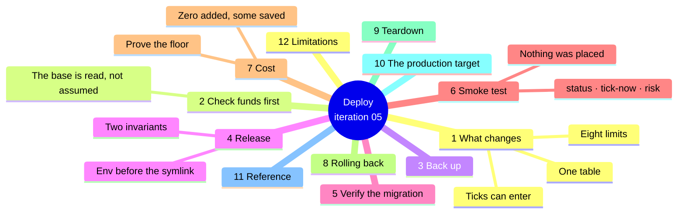
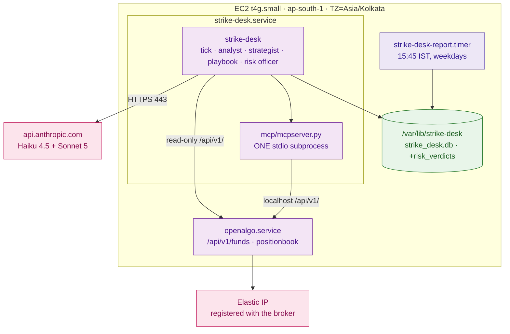

# Iteration 05 — Deployment Guide: releasing the Risk Officer



## 1. What changes on the host

No new process, no new port, no new secret, no new model call, and no new dependency. Three
things change, and the third is the one to read twice.

1. **The journal gains a `risk_verdicts` table**, created on the first `create_schema()`. No
   `ALTER TABLE`, no existing row read or rewritten.
2. **Eight risk settings arrive**, and two of them are invariants the service enforces at
   startup rather than warnings it logs: the per-trade cap may not exceed the daily cap, and
   the risk lot ceiling may not exceed the playbook's. A configuration that violates either
   refuses to start.
3. **A tick can now end in `enter`.** Every release before this one could only decline or
   hold. After this one, a proposal that clears every hard limit is journalled as an *intent*
   — a decision row with outcome `enter`, reason `risk-cleared`, naming the contract and the
   cleared size. **Nothing is placed.** There is no order path in this process, the OpenAlgo
   client still refuses every path outside its read-only whitelist, and the approval surface
   that would turn an intent into an order does not exist yet. If you see an order in
   OpenAlgo's order book after this deploy, stop the desk and read §6 — that would be a
   serious defect, not a feature.



## 2. Check funds before you deploy

Every rupee limit is a percentage of a capital base read from OpenAlgo's funds endpoint. If
that endpoint cannot be read or parsed, every proposal is held with `risk-input-unavailable`
and you have deployed a slice you cannot tell apart from a broken one:

```bash
curl -s -X POST http://127.0.0.1:5000/api/v1/funds \
  -H 'Content-Type: application/json' \
  -d '{"apikey":"'"$OPENALGO_API_KEY"'"}' | python3 -m json.tool
```

Read `availablecash` and `utiliseddebits` off that response and add them. That sum is the
capital base every limit will be taken of, and the numbers you will check §6's verdict row
against. If it is not the account size you expect — because a second broker account is
connected, or because the session is stale — fix that before releasing rather than after.

Note also what those two fields are: whole-account figures. If the trader holds unrelated
positions on the same broker account, they move this base and the day's P&L with it.

## 3. Back the journal up before you migrate it

The migration creates a table and touches no row, and the suite proves that against a database
shaped exactly like the host's. Take a copy anyway:

```bash
sudo -u strikedesk sqlite3 /var/lib/strike-desk/strike_desk.db \
  ".backup '/var/lib/strike-desk/strike_desk.pre-0.5.0.db'"
sudo -u strikedesk sqlite3 /var/lib/strike-desk/strike_desk.pre-0.5.0.db \
  "SELECT count(*) FROM decisions; SELECT count(*) FROM proposals;"
```

Use `.backup` rather than `cp` — WAL mode with a live writer. Keep both counts for §5.

## 4. Release the new code

Clone, sync, write the environment, swap the symlink, restart.

```bash
RELEASE=$(date +%Y%m%d)-$(git -C /path/to/checkout rev-parse --short HEAD)
sudo git clone --depth 1 <your-repo-url> "/opt/strike-desk/releases/$RELEASE"
cd "/opt/strike-desk/releases/$RELEASE/strike_desk" && sudo uv sync --frozen
```

**Write the environment before you swap the symlink.** The defaults are usable as they stand,
so an empty block starts cleanly — but if you intend to change a limit, change it now, because
the two invariants are startup errors and discovering one after the restart means a failed
unit and a confusing minute.

```bash
sudo tee -a /etc/strike-desk/strike-desk.env >/dev/null <<'ENV'

# --- Risk Officer (iteration 05) ---
# All four percentages are taken of one capital base: available cash + utilised margin.
# Rupee limits breach on touch; count limits permit their configured number exactly.
STRIKE_DESK_RISK_DAILY_LOSS_CAP_PCT=2.0
STRIKE_DESK_RISK_PER_TRADE_LOSS_CAP_PCT=0.5
STRIKE_DESK_RISK_DEPLOYED_CAPITAL_PCT=10.0
STRIKE_DESK_RISK_PER_INDEX_EXPOSURE_PCT=10.0
STRIKE_DESK_RISK_MAX_CONCURRENT_POSITIONS=1
STRIKE_DESK_RISK_MAX_LOTS=2
STRIKE_DESK_RISK_MAX_TRADES_PER_DAY=3
STRIKE_DESK_RISK_CAPITAL_FLOOR=50000
ENV

sudo ln -sfn "/opt/strike-desk/releases/$RELEASE" /opt/strike-desk/current
sudo systemctl restart strike-desk
sudo systemctl status strike-desk --no-pager
```

The expiry-day window is deliberately **not** in that block. It reuses
`STRIKE_DESK_EXPIRY_CUTOFF`, the `14:00` already in the file, so the desk cannot end up
holding two different answers to the same question.

These are the PRD's default numbers, and the PRD is explicit that they are for the trader to
confirm before the first live session rather than constants. Confirm them with Amit now, while
the release is fresh: 2% of the account in a day, 0.5% on one trade, one position at a time,
two lots, 10% of the account deployed, three trades a day.

## 5. Verify the migration

```bash
sudo -u strikedesk sqlite3 /var/lib/strike-desk/strike_desk.db "
  .tables
  SELECT count(*) FROM decisions;
  SELECT count(*) FROM proposals;
  SELECT name FROM sqlite_master WHERE type='trigger' AND tbl_name='risk_verdicts';
  PRAGMA user_version;"
```

`risk_verdicts` exists with `risk_verdicts_no_update` and `risk_verdicts_no_delete`; both
counts match §3 exactly. Then confirm the taxonomy move cost you nothing historically:

```bash
sudo -u strikedesk /opt/strike-desk/current/strike_desk/.venv/bin/strike-desk declines --since 30
```

`taxonomy drift 0` and `unknown reason codes none`, with the header reading `dt-3+<digest>`.
Any drift here means an existing entry's category or disposition moved, which this release is
not allowed to do — roll back and fix it before trading on it.

## 6. Smoke test

```bash
sudo -u strikedesk /opt/strike-desk/current/strike_desk/.venv/bin/strike-desk status
```

`risk limits : rl-1+<digest>` followed by the nine resolved values, beside the taxonomy at
`dt-3` and the playbook at `pb-1`. The base of the percentages is not printed here because it
is read per tick, not configured.

With the market open, force a tick and read what it decided:

```bash
sudo kill -USR1 $(sudo cat /var/lib/strike-desk/strike-desk.pid)
sudo -u strikedesk /opt/strike-desk/current/strike_desk/.venv/bin/strike-desk risk
sudo -u strikedesk /opt/strike-desk/current/strike_desk/.venv/bin/strike-desk declines
```

If the tick reached the strategist you get one verdict row: eight limits with their configured
and observed values, and a `capital_base` that matches the sum you computed in §2. If it did
not — a non-tradeable regime, a low-confidence read, no viable contract — there is no verdict
row and nothing is wrong; run it again later.

Then the check that matters most on this release:

```bash
# Nothing was placed. An intent is not an order.
curl -s -X POST http://127.0.0.1:5000/api/v1/orderbook \
  -H 'Content-Type: application/json' -d '{"apikey":"'"$OPENALGO_API_KEY"'"}' | head -20

# And nothing outside the read-only whitelist was even attempted.
sudo journalctl -u strike-desk --since "10 min ago" | grep -i "ReadOnlyViolation" || echo "clean"

# The MCP surface is unchanged: ONE subprocess, not two.
pgrep -fc mcpserver.py

# Adjudication is control-plane code. These should be tens or hundreds of microseconds.
sudo -u strikedesk sqlite3 /var/lib/strike-desk/strike_desk.db \
  "SELECT verdict, tripped_limit, lots_requested, lots_cleared, latency_us
     FROM risk_verdicts ORDER BY id DESC LIMIT 5;"
```

An empty order book beside an `enter` row is the slice working exactly as designed. A
`latency_us` in the thousands would mean the officer is doing something it should not be —
the only I/O in the node is the entry count and the verdict write.

## 7. Cost

This release adds nothing to the bill and takes a little off it. Adjudication is arithmetic:
no tokens, no API call, no extra process, and a table whose rows are a few hundred bytes each
at a handful per day. The saving is the session-stop latch — on a day the loss cap has been
breached the desk stops calling Haiku and Sonnet entirely rather than reasoning its way to a
refusal the arithmetic already made.

Confirm the shape after the first week:

```bash
sudo sqlite3 /var/lib/strike-desk/strike_desk.db "
  SELECT trading_day,
         sum(outcome='enter')   AS intents,
         sum(outcome='decline') AS declines,
         round(sum(token_cost_micros)/1000000.0, 4) AS usd
    FROM decisions GROUP BY trading_day ORDER BY trading_day DESC LIMIT 10;"

sudo sqlite3 /var/lib/strike-desk/strike_desk.db "
  SELECT verdict, tripped_limit, count(*) FROM risk_verdicts
   GROUP BY verdict, tripped_limit ORDER BY 3 DESC;"
```

The second query is the one to read as a limits review rather than as a cost report. A column
of vetoes all naming `per-trade-loss-cap` means the playbook is proposing a size the account
cannot carry, and the answer is a conversation about the cap or about the stop distance — not
a code change.

### The practice posture, and proving it

The posture is unchanged from iteration 01 and it is deliberately the cheapest one this
product is allowed to have. Scale-to-zero is **not** available here and that is a regulatory
constraint rather than an oversight: from 1 April 2026 SEBI requires every transactional API
order to originate from a broker-whitelisted static IP, so the host holds an Elastic IP and
stays up. What that buys is a floor rather than zero — roughly **$4.30 a month** for the
Elastic IP and the gp3 volume, with the `t4g.small` itself free under the T4g trial through 31
December 2026 — and this release moves none of it.

```bash
# The marginal cost of iteration 05 should be indistinguishable from zero.
aws ce get-cost-and-usage --time-period Start=$(date -d '7 days ago' +%F),End=$(date +%F) \
  --granularity DAILY --metrics UnblendedCost \
  --filter '{"Dimensions":{"Key":"REGION","Values":["ap-south-1"]}}' \
  --query 'ResultsByTime[].{day:TimePeriod.Start,usd:Total.UnblendedCost.Amount}' --output table

# And the disk this release added is bytes, not gigabytes.
sudo du -h /var/lib/strike-desk/strike_desk.db
sudo -u strikedesk sqlite3 /var/lib/strike-desk/strike_desk.db \
  "SELECT count(*), sum(length(checks_json)) FROM risk_verdicts;"
```

The daily figure either side of the deploy should be the same to the cent. The silent cost
leaks on this stack are the ones iteration 01 named and they have not changed: an Elastic IP
is billed whether attached or not, old release checkouts under `/opt/strike-desk/releases`
accumulate on the same 8 GiB volume, and the journal grows monotonically because it is
append-only. Prune releases beyond the last three, and leave the journal alone — it is the
only record of what the desk decided.

## 8. Rolling back

Structurally the same as iteration 04's, and for the same reason: this release added a table
rather than widening one. The iteration-04 binary does not know `risk_verdicts` exists, never
selects from it and never inserts into it.

```bash
sudo ln -sfn /opt/strike-desk/releases/<the previous release> /opt/strike-desk/current
sudo sed -i '/^STRIKE_DESK_RISK_/d' /etc/strike-desk/strike-desk.env
sudo systemctl restart strike-desk
```

The environment must be reverted in the same breath, because the old binary's settings model
is `extra="forbid"` and will refuse to start with keys it does not know.

One consequence is worth understanding before you need it. Rows written under `dt-3` stay in
the journal, and a `dt-2` binary reading a `risk-cleared` or `risk-veto` row classifies it as
`unknown` / `defect`: `strike-desk declines` will name those codes and exit 2. That is
correct — a `dt-2` build genuinely does not know what `risk-cleared` means, and saying so is
better than guessing — and it is the clearest argument for rolling forward with a fix rather
than living on a rollback. The `risk_verdicts` table is harmless to leave in place, and
dropping it would throw away the record of what was cleared and what was refused.

## 9. Teardown

Unchanged. This slice adds no unit, no timer and no socket. If you are tearing the desk down
entirely the sequence is still `systemctl disable --now strike-desk
strike-desk-report.timer`, then archive `/var/lib/strike-desk/` before removing it — the
journal cannot be regenerated, and it now holds the record of every limit that bound.

## 10. The production target

The practice posture above is a cost configuration, not a quality one: the same code, the same
limits and the same journal promote to the production target by changing tiers and files, not
by being rewritten. What that target is, for the pieces this slice touches:

**Compute stays always-on and gets bigger, not different.** `t4g.small` under the free trial
becomes an on-demand `t4g.small` or `t4g.medium` (roughly $12–24 a month in `ap-south-1`) once
the trial ends on 31 December 2026, on the same Elastic IP, with the same systemd unit. The
officer's latency budget is microseconds against a sub-second control-plane requirement, so
this is a headroom decision rather than a performance one.

**The journal moves to managed Postgres when concurrency argues for it.** SQLite with
`NullPool` is right for one index, one playbook and a handful of verdicts a day, and the tech
stack names RDS Postgres as the migration path. The officer is untouched by that move — it
takes dictionaries and returns a dataclass, and only `journal.py` knows what a database is.

**Backups become automatic.** Today §3's `.backup` is a step you run by hand before a
migration. In production it is a nightly `sqlite3 .backup` to S3 with lifecycle expiry (or
RDS automated snapshots after the Postgres move), because the journal is the audit artifact
and an append-only table on a single EBS volume is one instance failure from gone.

**Observability keeps the same shape at a cost.** The spans this slice emits already land in
the `traces` table and are exported over OTLP the moment
`STRIKE_DESK_OTEL_EXPORTER_OTLP_ENDPOINT` points at a self-hosted Langfuse — the two
environment variables iteration 01 wired and left unset because Langfuse's ClickHouse
requirement does not fit beside the desk on a `t4g.small`. In production that is its own
instance, and `risk.verdict` and `risk.limit` become dashboard dimensions rather than sqlite
queries.

**The limits become reviewed configuration.** Production means the numbers in §4 have been
confirmed against the account they protect and changed through a release with an `rl-` digest
behind them, rather than defaults inherited from a document.

## 11. Reference

| Thing | Value |
| --- | --- |
| Package version | `0.5.0` |
| Journal schema | `SCHEMA_VERSION = 5` — `decisions`, `traces`, `regime_reads`, `proposals`, `risk_verdicts` |
| Taxonomy | `dt-3` — twelve earlier codes unchanged, four added under `risk`, outcomes gain `enter` |
| Risk limits | `rl-1` plus a digest of the resolved values |
| New table | `risk_verdicts`, append-only, created by `create_schema()` |
| New model calls | None. Adjudication is arithmetic |
| Startup invariants | per-trade cap ≤ daily cap; `risk_max_lots` ≤ `playbook_max_lots` |
| New ports, secrets, processes | None |
| First release where a tick can `enter` | Yes — as a journalled intent, with no order path |
| Rollback | Symlink swap + delete the `STRIKE_DESK_RISK_*` keys. The table is harmless to leave |

## 12. Limitations

1. **An intent is the end of the line.** Nothing presents it, nothing approves it, nothing
   places it. After this release the desk will find contracts, verify them, size them to the
   account and record what it would have bought — and buy nothing.
2. **The capital base is whole-account.** Available cash, utilised margin and the day's P&L
   come from OpenAlgo's funds endpoint for the entire broker account, so unrelated positions
   move every limit. It errs toward stopping the desk rather than toward letting it run,
   which is the right direction for the error, but it is an error.
3. **The session-stop latch is per journal.** It is a row in this database, so pointing the
   service at a different `STRIKE_DESK_DB_PATH` gives it a clean day. That is exactly how
   manual test MT-18 exercises the latch, and it is worth knowing before someone does it by
   accident.
4. **The first week's verdicts are unfalsified.** No fill, no realised loss, no evidence that
   0.5% per trade is the right number. Read them for whether the arithmetic matches your
   account, not for whether the limits are wise.

---
**Sources**

*Repo files:* `030_design/02_prd.md` · `030_design/03_architecture.md` · `030_design/04_tech_stack.md` · `040_iterations/iteration-01/05_deployment_guide.md` · `040_iterations/iteration-04/05_deployment_guide.md` · `040_iterations/iteration-05/02_implementation_guide.md`

*Web (accessed 2026-08-28):*
- [SEBI — Safer participation of retail investors in Algorithmic trading (static-IP mandate)](https://www.sebi.gov.in/legal/circulars/feb-2025/safer-participation-of-retail-investors-in-algorithmic-trading_91614.html)
- [AWS — Amazon EC2 T4g free trial extension (750 hours/month through 31 Dec 2026)](https://repost.aws/articles/ARi_gf6vo6TuqNtMQdiYPKyA/announcing-amazon-ec2-t4g-free-trial-extension)
- [AWS — Elastic IP addresses are charged whether in use or idle](https://docs.aws.amazon.com/AWSEC2/latest/UserGuide/elastic-ip-addresses-eip.html)
- [Langfuse — OpenTelemetry endpoint and OTLP environment variables](https://langfuse.com/integrations/native/opentelemetry)
