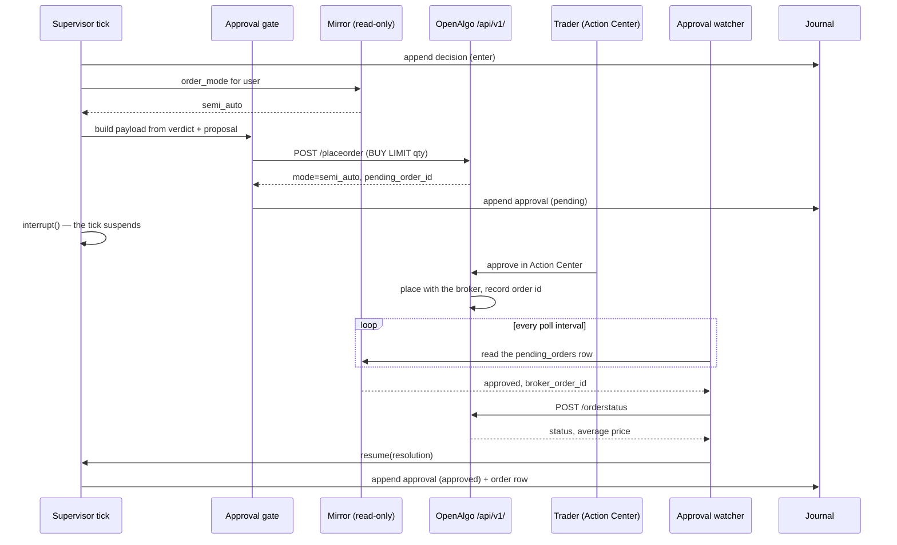

# Iteration 06 — UC-06: Place a live order behind human approval

> **UC-06 — Place a live order behind human approval**
>
> **Why this slice:** the catalog's MVP order runs UC-01 → UC-02 → UC-03 → UC-04 → UC-05 → UC-06, and iterations 01 to 05 built the first five. UC-06 is the next un-built entry by catalog priority, and it is the one the desk has been walking towards since iteration 01: since the Risk Officer arrived, a cleared contract is journalled as an `enter` — an intent naming the symbol, the size and the levels — and then nothing happens to it. This iteration gives the intent somewhere to go: OpenAlgo's Action Center, where a human looks at it and clicks, and only then does an order reach a broker.
>
> **Actor:** the Execution Agent, and it decides nothing. It formats a cleared intent into an order payload, routes it into the Action Center queue, waits for the trader's answer, and writes down what happened. The Trader (Amit) is the deciding actor here: he approves or rejects in OpenAlgo's own Action Center UI, and reads the case back with `strike-desk approvals`.
>
> **Preconditions:** the iteration-05 desk is deployed and ticking on the host, with its journal at `/var/lib/strike-desk/strike_desk.db` at `SCHEMA_VERSION = 5`, its taxonomy at `dt-3`, its playbook at `pb-1` and its limits at `rl-1`. OpenAlgo runs on the same host with a valid broker session, its database is SQLite at a path the desk can read, and the trader's API key is set to **semi-auto** order mode at `/apikey`. Python 3.12 and `uv` are installed.
>
> **Depends on:** UC-05's `risk_verdicts` and the `enter` outcome it made reachable, which supply the contract and the cleared lot count this slice places; UC-04's `proposals` table, which supplies the entry band and the levels; and UC-01's tick, journal, trace and kill-switch plumbing, which this slice extends rather than reshapes. Holding the filled position to its stop, target and time-stop is UC-07's work, so this slice ends when the order is recorded.

![Dark portrait sheet for UC-06 Place a live order behind human approval, going from a cleared intent to a real broker order only after the trader clicks Approve in OpenAlgo's Action Center, with cards on why this slice, the Execution Agent that decides nothing, preconditions at SCHEMA_VERSION 5 with taxonomy dt-3, playbook pb-1, limits rl-1 and a SEMI-AUTO order mode, and dependencies on UC-05, UC-04 and UC-01, a five-piece build of read-only mirror, execution client with exactly three write paths, approval gate, five-second approval watcher and two append-only approvals and orders tables, a six-step flow from cleared intent through the OpenAlgo semi-auto gate and pending_orders row into the Action Center queue, the trader's approve or reject and a record-and-resume step, a five-minute approval deadline that settles as expired and logs CRITICAL, and panels on verifying rather than assuming the gate, building the order arithmetically at the entry band's high rounded down to a tradable tick, proposing nothing while an approval is outstanding, and an audit trail of approvals and orders rows.](images/amit-itr-06-uc-image-1.png)

## 1. What this iteration builds

This iteration builds the path from a journalled intent to a real broker order, and the human gate in the middle of it. Five pieces arrive: a **read-only mirror** of OpenAlgo's own database, which is the only place the approval verdict, the approver's identity and the rejection reason are recorded; an **execution client** that can reach exactly three write paths on `/api/v1/` and nothing else; an **approval gate** that turns a cleared intent into an order payload, refuses to submit unless the platform is genuinely in semi-auto mode, and settles what comes back; an **approval watcher** that polls the queue on a five-second cadence and resumes the paused tick when the trader answers; and two append-only tables, `approvals` and `orders`, that make the click auditable.

The design rests on one structural fact about OpenAlgo. When an API key is in **semi-auto** order mode, `POST /api/v1/placeorder` does not place an order — `services/order_router_service.py` intercepts it and writes a row to `pending_orders` instead, answering `{"status": "success", "mode": "semi_auto", "pending_order_id": N}`. The order reaches the broker only when the trader clicks approve in the Action Center, at which point OpenAlgo executes it under its own session and records the broker order id against the same row. That is precisely the gate FR-6 asks for: already built, already authenticated by the trader's own login. Strike Desk does not reimplement it, does not bypass it, and cannot — the desk holds an API key, and an API key in semi-auto mode has no path to a broker.

What the desk must add is everything around that gate: the guarantee that the gate is really there, the discipline that the queued order is exactly what the Risk Officer cleared, the deadline that keeps a stale intent from firing an hour late, and the record that ties the click back to the reasoning behind it.

**The gate is verified, not assumed.** Before any submission the desk reads OpenAlgo's `api_keys.order_mode` for the configured user through the read-only mirror and refuses to submit anything unless it reads `semi_auto`. It then checks the answer as well: a `placeorder` response that comes back with an `orderid` instead of a `pending_order_id` means the gate was not there and an order has just gone to a broker with no human in the loop. That is the one thing this product may never do, so it engages the kill switch, journals the event as a defect, and stops the desk.

**The order is arithmetic, not prose.** The payload is rebuilt from the risk verdict's cleared lot count and the proposal's lot size, priced as a `LIMIT` at the entry band's high rounded *down* to a tradable tick, `BUY`, product `MIS`, tagged with a strategy string carrying the tick id. Nothing the model wrote reaches the broker; the rationale reaches the trader.

**A queued intent expires.** The trader has `STRIKE_DESK_APPROVAL_DEADLINE_SECONDS` — five minutes by default — to answer. Past that the desk settles the approval as `expired` and says loudly, at CRITICAL, which pending order a human must now reject by hand; and if a click lands on it anyway, the late approval is caught within a poll, recorded as a defect, and the order it created is cancelled where the platform permits a cancel. While an approval is outstanding the desk proposes nothing: every tick holds with `approval-pending`, spending no token, so two intents can never queue against one book.

The reasoning plane is untouched. Same two agents, same prompts, same models, same tool whitelists — the strategist still cannot see an order tool, because placement lives in the control plane and always will.

## 2. Main success scenario

1. A tick runs exactly as iteration 05 left it: the session gate allows it, the book is flat, no approval is outstanding, the mirror confirms OpenAlgo is in semi-auto mode, the Regime Analyst reads a tradeable regime, the Options Strategist proposes a contract, `playbook.check` verifies it, and the Risk Officer clears it at two lots.
2. The `persist` node appends the `enter` decision row, as it already did. The journal is written *before* anything is submitted: an untraceable decision may not become an order.
3. The `submit` node builds the intent. It reads `lots_cleared` from the verdict and `lot_size` from the proposal, multiplies them into a quantity, takes the entry band high of ₹192.00 and rounds it down to the ₹0.05 tick, and assembles the payload with `pricetype=LIMIT`, `action=BUY`, `exchange=NFO`, `product=MIS` and `strategy=strike-desk:<the tick id's first eight characters>`.
4. The gate's preflight reads `order_mode` for the configured OpenAlgo user from the mirror once more and finds `semi_auto`.
5. The desk POSTs the payload to `/api/v1/placeorder`. OpenAlgo queues it and answers `mode: semi_auto` with `pending_order_id: 41`. The desk asserts both fields are present, appends one `approvals` row at status `pending` carrying the pending order id, the payload, the deadline and the ids of the decision, proposal and verdict behind it, and closes the `tick.submit` span.
6. The `await_approval` node calls LangGraph's `interrupt()`. The tick's graph suspends with its state checkpointed, `run_tick` returns, and the runner's lock is released. No thread is parked on a human.
7. The trader sees the pending order in OpenAlgo's Action Center — the badge OpenAlgo already raises — and runs `strike-desk approvals` to read the case: the contract, the size, the levels, the analyst's regime read, the strategist's rationale, and every limit the Risk Officer measured. He clicks **approve**.
8. OpenAlgo executes the order under its own broker session, records the broker order id and the resulting status against the pending row, and stamps who approved it and when.
9. Within one poll the watcher reads that row through the mirror, sees `approved`, takes the tick runner's lock so it cannot race a scheduled tick, and resumes the suspended graph with the resolution.
10. The `settle` node appends one `approvals` row at status `approved`, carrying the approver's identity, the Action Center's IST timestamp and the seconds the trader took, and one `orders` row carrying the broker order id, the requested quantity, the limit price and the order status read from `/api/v1/orderstatus`. The graph ends.
11. The watcher keeps a short second watch on the order itself. When `/api/v1/orderstatus` reports `complete` it appends a second `orders` row with the average price the trade filled at, and stops watching.
12. The next scheduled tick reads the position book, finds the new position, and holds with `position-open` — the desk's existing management-only behaviour, with the exits still to arrive in UC-07.

## 3. Alternate flows

**The trader rejects.** The Action Center records `rejected` with the reason he typed. The watcher resumes the graph, `settle` appends a `rejected` approval row carrying that reason verbatim, and no `orders` row is written. This is the labelled corpus the desk is later graded against, which is why the reason is stored rather than merely noticed.

**The trader does not answer.** At the deadline the watcher resumes the graph with `expired` and `settle` appends the terminal row. Nothing is cancelled, because a queued order has no broker order behind it — OpenAlgo wrote a row and stopped — so the desk records `withdrawal = not-queued` and escalates by log to the one action that does remove it: a human rejecting it in the Action Center.

**The trader deletes the pending order.** The row disappears from `pending_orders`, the watcher settles the approval as `withdrawn`, and the tick closes cleanly. A queued order the trader threw away is not a defect.

**The broker refuses the approved order.** OpenAlgo records the pending row's broker status as `rejected`, and the desk's `orders` row carries `order_status = rejected` with whatever the broker said. The approval still settles as `approved`, because the human did approve it — the broker's refusal is a different fact and is recorded as one. The desk does not resubmit: a retry under semi-auto needs a second human click anyway, so the next scheduled tick reproposes at a fresh price behind a fresh verdict rather than re-firing a band that has moved.

**The order rests unfilled.** A `LIMIT` order at the band high may not fill. The watcher polls it until `STRIKE_DESK_FILL_DEADLINE_SECONDS` — five minutes by default — then attempts a cancel and appends the final `orders` row with the status the platform gave. An unfilled resting order is not left dangling into the afternoon.

**Execution is switched off.** `STRIKE_DESK_EXECUTION_ENABLED=false` makes the tick end exactly where iteration 05 ended it: the `enter` decision is journalled and nothing is submitted. This is the posture to deploy in first, and the posture to fall back to.

## 4. Exception flows

**The gate is not in semi-auto mode.** The `plan` node checks gate health every tick, so a desk whose platform has been switched to auto mode declines with `approval-gate-unavailable` before spending a token; a mode that changes between `plan` and `submit` is caught again at submission and settles the approval as `gate-unavailable`. In neither case is a payload sent.

**The gate was not there at all.** A `placeorder` response carrying an `orderid` rather than a `pending_order_id` means an order reached a broker without a click. The desk appends a `gate-bypassed` approval row marked as a defect, writes the kill switch file with that reason, and logs at CRITICAL. Every subsequent tick is blocked by the session gate until a human clears it.

**The mirror cannot be read.** A missing OpenAlgo database file, a Postgres deployment, a permissions error or an unset `STRIKE_DESK_OPENALGO_USER` all resolve the same way: gate health is false, the desk declines with `approval-gate-unavailable`, and it submits nothing. The desk never guesses that the gate is present. If an approval is already outstanding when the queue becomes unreadable, nothing is settled — a clickable order may still be sitting there, and releasing the hold would let a second intent form — so once that approval is past its deadline the tick holds with `approval-queue-stale` instead of the routine `approval-pending`, which is a defect rather than a quiet, healthy-looking silence.

**The submission itself raises.** Anything unexpected inside the submit step — including a journal that cannot be written — is caught there and turned into a terminal `submit-failed` result rather than allowed to escape into the runner, which would try to journal a second decision under a tick id that already has one.

**The submission fails.** A transport error, a timeout, a non-200 or an OpenAlgo error status settles the approval as `submit-failed` with the message, and the tick ends. Nothing is retried inside the tick, because retrying a placement whose outcome is unknown is how a book ends up with two positions.

**The band holds no tradable tick.** If rounding the entry band high down to the tick lands below the band low, and rounding the low up lands above the high, the contract cannot be priced at all. The approval settles `unpriceable-band` as a defect and nothing is submitted.

**The kill switch is engaged while an approval is outstanding.** The watcher notices within one poll and settles the approval as `expired`, with the same escalation. A kill switch that quietly left the desk's own intent sitting in an approval queue would not be a kill switch.

**The service restarts mid-approval.** The `approvals` table is the source of truth, not memory: on start the watcher lists approvals whose latest row is still `pending` and carries on polling them. The graph resumes from the checkpoint on disk; if the checkpoint is gone, the watcher settles the approval directly through the same function the `settle` node calls, so the journal reaches the same state by a shorter road.

**A resume runs twice.** LangGraph re-executes a node from its start on resume, and a watcher retry can call settle twice for one approval. The database refuses it: `approvals` carries `UNIQUE(approval_id, status)`, a duplicate terminal row raises, and the settle function reads that as "already settled" and returns quietly.

## 5. Operational behaviour

There is **no agent loop and no model call in this slice**. The Execution Agent is control-plane code — it formats, submits, waits and records — and the plan → act → observe loop the product runs sits entirely upstream of it, in iterations 02 and 04.

The AgentOps surface is the trace. `tick.submit` carries the approval id, the pending order id, the quantity, the limit price and the resulting status. The watcher opens its own root span, `strike_desk.approval`, per resolution, carrying the approval id, the status it settled to, the seconds waited and — this is the hop that makes the chain readable — `strike_desk.tick_trace_id`, the trace of the tick that created the intent. The wait for a human is deliberately *not* a held-open span: a tick's trace ends when the tick ends, and a five-minute span parked on a person tells you nothing two timestamps do not.

The guardrails this slice adds are structural rather than instructional, and each is a test rather than a promise: the execution client's three-path whitelist, the mirror opened `mode=ro` so a write raises rather than corrupts, the semi-auto preflight, the bypass assertion with its kill switch, the one-outstanding-approval hold, and the append-only uniqueness that makes settlement idempotent.

Telegram alerting for approvals and risk events is UC-14's subject; here the trader's notification is the one OpenAlgo already raises in its own Action Center, and the desk's own escalations are CRITICAL log lines that `journalctl` and the health check pick up.

## 6. Data touched

Strike Desk's own journal gains two append-only tables at `SCHEMA_VERSION = 6`. **`approvals`** holds one row per state of a human gate — `pending` first, then a terminal row, plus a further `late-approval` row in the one case where a click lands after the deadline — carrying the tick, trace, proposal and verdict ids, the symbol and exchange, the lots, lot size and quantity, the limit price and the band it came from, the pending order id, the strategy tag, the deadline, the approver identity, the rejection reason, the payload and response as JSON, and a defect flag. **`orders`** holds one row per observed order state, carrying the approval id, the broker order id, the requested quantity, the limit price, the order status and the average price once it fills.

OpenAlgo's database is **read only, and never written**: `api_keys.order_mode` for the configured user, and one `pending_orders` row by id — its status, timestamps, approver, rejection reason, broker order id and broker status.

Three OpenAlgo endpoints are called that no earlier iteration touched: `POST /api/v1/placeorder` to queue, `POST /api/v1/orderstatus` to read an order back, and `POST /api/v1/cancelorder` to attempt a withdrawal. The read-only client from iteration 01 keeps its own whitelist untouched and gains nothing.

## 7. Acceptance criteria

1. **AC-1** — A tick that ends `enter` with execution enabled submits exactly one order to `/api/v1/placeorder` and appends exactly one `approvals` row at status `pending`, carrying the `pending_order_id` from the response, the payload, the deadline, and the tick, proposal and verdict ids — after the decision row, never before it.
2. **AC-2** — No payload is sent unless the mirror reports `order_mode = semi_auto` for the configured OpenAlgo user. When it does not, `plan` declines the tick with `approval-gate-unavailable` before any specialist is consulted, and a mode that degrades between `plan` and `submit` settles the approval as `gate-unavailable` with no HTTP call made.
3. **AC-3** — A `placeorder` response that does not carry both `mode = semi_auto` and a positive `pending_order_id` appends a `gate-bypassed` approval row flagged as a defect, writes the kill switch file, and logs at CRITICAL — so an order placed without a click stops the desk.
4. **AC-4** — The submitted payload is `BUY`, `LIMIT`, the configured product, on the configured option exchange, with `quantity = lots_cleared × lot_size` recomputed from the risk verdict and the proposal, at the entry band high rounded down to the configured tick, and with a strategy tag naming the tick; a band that contains no tradable tick settles `unpriceable-band` and submits nothing.
5. **AC-5** — The execution client reaches exactly `/api/v1/placeorder`, `/api/v1/orderstatus` and `/api/v1/cancelorder`; any other path raises `ExecutionPathViolation` before a socket is opened, and the tick's read-only client still refuses everything outside its own four paths.
6. **AC-6** — An approved pending order settles within one poll interval into one `approvals` row at status `approved`, carrying the approver identity and the Action Center's IST timestamp, plus one `orders` row carrying the broker order id, the requested quantity, the limit price and the order status read from `/api/v1/orderstatus`.
7. **AC-7** — A rejected pending order settles into one `approvals` row at status `rejected` carrying the trader's reason verbatim, and no `orders` row is written.
8. **AC-8** — A pending order still unresolved at its deadline settles `expired` recording `withdrawal = not-queued` — a queued order has no broker order behind it to cancel — and logs at CRITICAL naming the pending order id a human must reject in the Action Center.
9. **AC-9** — A pending order that flips to approved after its deadline settles `late-approval` flagged as a defect, the desk attempts to cancel the broker order that now exists and records whether the platform permitted or refused it, and logs at CRITICAL; a late click is never recorded as a normal approval.
10. **AC-10** — While an approval is unsettled, every tick ends `hold` with reason `approval-pending`, decided in `plan`, consulting no specialist and spending no token; two approvals against one book are unreachable.
11. **AC-11** — Settlement is idempotent: `approvals` carries `UNIQUE(approval_id, status)`, a second terminal write is swallowed as already-settled rather than duplicated or raised at the caller, and UPDATE or DELETE on `approvals` and `orders` aborts.
12. **AC-12** — The chain resolves in the journal alone: an `orders` row names its approval, which names its decision by `tick_id`, its verdict, its proposal and the tick's trace, and the watcher's own span names that trace as `strike_desk.tick_trace_id`.
13. **AC-13** — The mirror opens OpenAlgo's database read-only: an attempted write raises, and an unreadable, absent or non-SQLite database resolves to an unhealthy gate rather than to a submission. An unreadable queue settles no outstanding approval; once that approval is past its deadline the watcher logs at CRITICAL and the tick holds with `approval-queue-stale` at disposition `defect`, so the day's report exits non-zero rather than looking healthy.
14. **AC-14** — Restart and kill switch are safe: an approval outstanding across a service restart is settled exactly once, and an engaged kill switch settles every outstanding approval as `expired` within one poll.
15. **AC-15** — `tick.submit` and `strike_desk.approval` land in `traces` with the attributes named in §5, and `strike-desk approvals` prints every approval for an IST trading day with its order rows, `--since N` widening the window and `--json` printing the identical numbers.

## 8. The flow

![Wide four-lane board of the semi-automatic order approval flow: a supervisor tick and journal lane appending an ENTER decision into the approvals and orders tables of the schema v6 Strike Desk DB, building lots cleared and a rounded-down limit price into a payload and reading order_mode from a read-only mirror of the OpenAlgo database; an approval-gate lane posting to /api/v1/placeorder, getting back mode semi_auto with pending_order_id 41, appending a PENDING approval and suspending the tick; a trader lane showing the OpenAlgo Action Center UI with contract info, risk verdicts, quantity, price and limit sliders where a human clicks APPROVE before the deadline or gives a rejection reason; and an approval-watcher and settlement lane polling the pending order on a five-second cadence, calling /api/v1/orderstatus for status and average price, resuming the tick and appending the APPROVED approval plus a filled order row.](images/amit-itr-06-uc-image-2.png)
