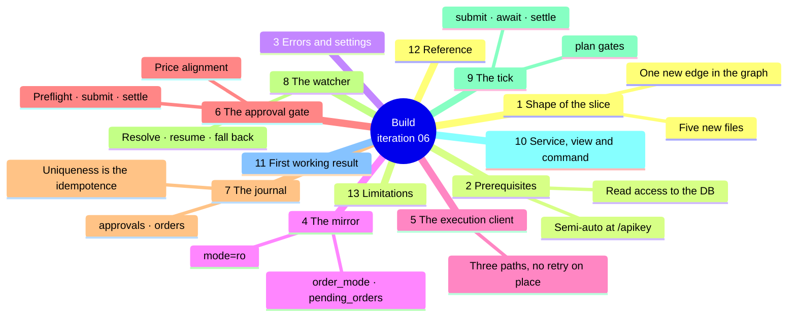
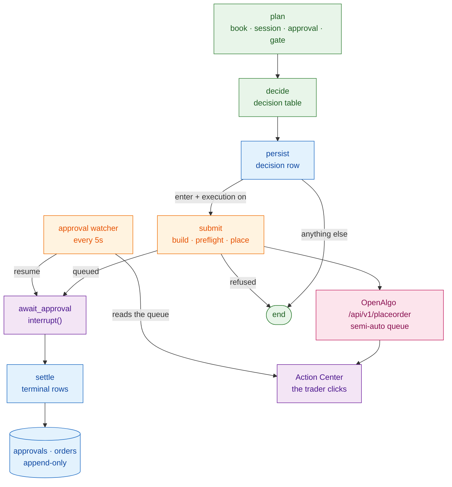

# Iteration 06 — Implementation Guide: the approval gate

> **Document:** the build instructions for UC-06. Read `01_use_case.md` first for what this
> slice is and why; this file is how it is made. `03_manual_test_cases.md` is what you check
> by hand, `04_test_automation.md` is what CI checks forever, and `05_deployment_guide.md`
> releases it to the host.
>
> **Starting point:** the iteration-05 desk. `strike_desk/src/strike_desk/` holds `config.py`,
> `errors.py`, `events.py`, `journal.py`, `mcp_toolbox.py`, `grounding.py`, `model_client.py`,
> `prompt_registry.py`, `regime_analyst.py`, `options_strategist.py`, `playbook.py`,
> `risk_officer.py`, `risk_view.py`, `decline_taxonomy.py`, `decline_report.py`,
> `proposal_view.py`, `graph.py`, `runner.py`, `service.py`, `session.py`, `specialists.py`,
> `book_state.py`, `observability.py`, `openalgo_client.py`, `__main__.py` and two prompt
> artifacts. The journal is at `SCHEMA_VERSION = 5`, the taxonomy at `dt-3`, the playbook at
> `pb-1` and the limits at `rl-1`.
>
> **Ending point:** the same desk with an execution client, a read-only mirror of OpenAlgo's
> database, an approval gate, an approval watcher, `approvals` and `orders` tables, a taxonomy
> at `dt-4`, a `strike-desk approvals` command — and a tick that can put a real order in front
> of a human.
>
> **How the code is presented:** every new file is reproduced complete and copy-paste ready.
> For the nine files you edit, each changed unit is given whole — a full function, a full class
> or a full block with the exact line it replaces — never as a fragment with pieces left out.



## 1. What you are adding, and the shape of it

The slice has one job — get a cleared intent in front of a human and record what he does with
it — and almost all of its difficulty is in the word *record*. The placement itself is one HTTP
POST. Everything else exists because the approval happens somewhere Strike Desk does not
control, minutes after the tick that caused it, possibly after a restart, and because the one
outcome this product may never produce is an order nobody approved.

Five files are new:

| File | What it is |
| --- | --- |
| `openalgo_mirror.py` | A read-only reader over OpenAlgo's own SQLite database: the user's order mode, and one `pending_orders` row by id. |
| `execution_client.py` | The only code in the desk that can change anything at a broker. Three whitelisted paths, no retry on placement. |
| `approval_gate.py` | Price alignment, intent building, the semi-auto preflight, the submission, and the one function that settles an approval. |
| `approval_watcher.py` | The scheduled job that resolves outstanding approvals, resumes the suspended tick, and watches a placed order to its end. |
| `approval_view.py` | One approval rendered as text or as JSON, so the two cannot disagree. |

Nine are edited:

| File | Edit |
| --- | --- |
| `errors.py` | Six errors. |
| `config.py` | Nine execution settings, three validators and one invariant. |
| `session.py` | `engage_kill_switch`, so the kill switch is written in one place. |
| `decline_taxonomy.py` | `dt-4`: three codes. Additive. |
| `journal.py` | `approvals` and `orders`, the status vocabulary, eight repository methods, `SCHEMA_VERSION = 6`. |
| `graph.py` | Two gates in `plan`, two branches in the decision table, three nodes after `persist`, and the verdict id kept in state. |
| `runner.py` | `resume_approval`, holding the same lock a tick holds. |
| `service.py` | The mirror, the client and the gate when execution is enabled; the watcher job; the shutdown path. |
| `__main__.py` | The `approvals` command, and three lines in `status`. |

Build them in the order of the sections below. The mirror and the client come first because
they are the two edges of the system and neither imports anything of ours beyond config and
errors; the graph comes last because it is the only file where a mistake shows up as a wrong
decision rather than an import error.

The tick grows a tail. Everything through `persist` is iteration 05 unchanged; the three nodes
after it run only when the outcome is `enter` and execution is enabled:



Two structural decisions run through everything below and are worth stating before any code.

**The human boundary is an interrupt, not a wait.** The `await_approval` node calls LangGraph's
`interrupt()`, the graph suspends with its state in the checkpointer, and `run_tick` returns.
Nothing is blocked on a person: no thread, no HTTP connection, no lock. The watcher resumes the
graph later, possibly after a restart, because the checkpoint is a file on disk. LangGraph
re-executes a node from its start when it resumes, so `await_approval` contains *nothing but*
the `interrupt()` call — a side effect placed before it would happen twice.

**The journal is the state machine, and uniqueness enforces it.** There is no in-memory set of
outstanding approvals. "What is still open" is a query, "has this been settled" is a unique
constraint, and a duplicate settle is an `IntegrityError` the code reads as *already done*. That
is the same philosophy as the append-only triggers: the guarantee lives in the schema, where a
restart cannot forget it.

## 2. Prerequisites and pinned versions

No dependency is added. This slice writes no prompt, calls no model and imports nothing new;
the pins iterations 01 to 05 hold are the pins it builds on, and all of them are current:
`langgraph==1.2.11`, `langgraph-checkpoint-sqlite==3.1.1`, `sqlalchemy==2.0.51`,
`httpx==0.28.1`, `pydantic==2.13.4`, `pydantic-settings==2.14.2`, `apscheduler==3.11.3`,
`opentelemetry-sdk==1.44.0`, with `pytest==9.1.1`, `respx==0.23.1`, `freezegun==1.5.5` and
`ruff==0.15.22` in the dev group. Bump one line and run `uv sync` so the lockfile records it:

### `strike_desk/pyproject.toml`

```toml
[project]
name = "strike-desk"
version = "0.6.0"
```

Two things must be true on the host before this slice does anything at all, and neither is
code. **OpenAlgo's API key must be in semi-auto order mode** — set it at `/apikey` in the
OpenAlgo UI — because that is the switch that turns `placeorder` from a placement into a
queued approval. And **the desk's system user must be able to read OpenAlgo's database
directory**, including the `-wal` and `-shm` files a running SQLite writer keeps beside it;
the deployment guide grants that with a group, not with a copy.

## 3. Errors and settings

### `strike_desk/src/strike_desk/errors.py` — additions

Append these at the end of the module. Each names one thing that can go wrong at the execution
edge, and every one of them resolves to a journalled approval row rather than to a crash.

```python
class MirrorUnavailable(StrikeDeskError):
    """OpenAlgo's own database could not be read, so the approval gate is unverifiable."""


class ExecutionPathViolation(StrikeDeskError):
    """Execution code attempted a path outside the execution whitelist."""

    def __init__(self, path: str) -> None:
        super().__init__(f"path {path!r} is not in the execution whitelist")
        self.path = path


class InvalidOrderPayload(StrikeDeskError):
    """An order payload failed its own validation and was never sent."""


class UnpriceableBand(StrikeDeskError):
    """The entry band contains no price on the exchange's tick grid."""


class ApprovalGateBypassed(StrikeDeskError):
    """A placement was accepted without the human gate — the desk must stop."""


class AlreadyJournalled(StrikeDeskError):
    """This exact append-only row already exists; the write was a repeat, not a failure."""
```

### `strike_desk/src/strike_desk/config.py` — additions

Nine settings, in one block after the risk block, plus three validators and one invariant.

```python
    # --- Execution and the approval gate ------------------------------------
    execution_enabled: bool = False
    openalgo_user: str | None = None
    openalgo_db_path: Path = Path("/opt/openalgo/db/openalgo.db")
    order_product: str = "MIS"
    order_strategy_prefix: str = "strike-desk"
    price_tick: float = Field(default=0.05, gt=0, le=100)
    approval_deadline_seconds: int = Field(default=300, ge=30, le=1800)
    approval_poll_seconds: int = Field(default=5, ge=1, le=60)
    fill_deadline_seconds: int = Field(default=300, ge=30, le=3600)
```

```python
    @field_validator("order_product")
    @classmethod
    def _validate_product(cls, value: str) -> str:
        if value not in {"MIS", "NRML", "CNC"}:
            raise ValueError("order_product must be one of MIS, NRML, CNC")
        return value

    @field_validator("order_strategy_prefix")
    @classmethod
    def _validate_strategy_prefix(cls, value: str) -> str:
        if not value or len(value) > 15 or not all(ch.isalnum() or ch in "-_" for ch in value):
            raise ValueError("order_strategy_prefix must be 1-15 chars of [A-Za-z0-9_-]")
        return value

    @model_validator(mode="after")
    def _execution_needs_a_user(self) -> Settings:
        """A desk that may place orders must know whose approval queue it is writing into."""
        if self.execution_enabled and not (self.openalgo_user or "").strip():
            raise ValueError(
                "STRIKE_DESK_EXECUTION_ENABLED=true requires STRIKE_DESK_OPENALGO_USER"
            )
        return self
```

`model_validator` joins the pydantic import at the top of the file:

```python
from pydantic import Field, SecretStr, field_validator, model_validator
```

The default is `execution_enabled=false`, and that is the whole rollout plan: this release
deploys behaving exactly like iteration 05, and execution is turned on deliberately, in a
separate step, once you have watched the desk form intents you agree with.

The deadline of 300 seconds is a decision this slice had to make on its own — FR-6 requires
that a stale approval expires rather than fires late, but names no number. Five minutes is
short enough that an option premium band is still roughly the band the strategist read, and
long enough for a person to notice a badge and read the case. It is configuration; the desk
holds one intent at a time regardless of how it is set, because a second intent cannot be
formed while one is outstanding.

### `strike_desk/src/strike_desk/session.py` — addition

The kill switch is written from two places now, so it gets one implementation. Add the import
`from datetime import UTC, date, datetime, timedelta` and this function at module level:

```python
def engage_kill_switch(settings: Settings, reason: str) -> None:
    """Write the kill switch file. Every subsequent gate evaluation blocks the tick."""
    settings.state_dir.mkdir(parents=True, exist_ok=True)
    settings.kill_switch_path.write_text(
        f"{datetime.now(tz=UTC).isoformat()} {reason}", encoding="utf-8"
    )
    logger.critical("kill switch engaged: %s", reason)
```

`StrikeDeskService.engage_kill_switch` becomes a delegation, so the file's format is written in
one place:

```python
    def engage_kill_switch(self, reason: str) -> None:
        engage_kill_switch(self._settings, reason)
```

## 4. The mirror

OpenAlgo exposes no API-key surface for the Action Center. Every route in `blueprints/orders.py`
that touches a pending order — approve, reject, delete, the data feed behind the page — is
guarded by `@check_session_validity` and expects a browser session with the trader's login
cookie. There is no MCP tool for it and no `/api/v1/` endpoint. So the approver's identity, the
timestamp of the click, the rejection reason and the broker order id exist in exactly one place
Strike Desk can reach: the `pending_orders` table OpenAlgo writes them to.

This module reads that table and `api_keys.order_mode`, and nothing else. It opens the database
with SQLite's `mode=ro` URI, so a write is refused by the driver rather than by our own
discipline — the architecture's rule that Strike Desk never writes to OpenAlgo's database
becomes a property of the connection instead of a promise in a document.

Two behaviours are worth understanding before the code. Every failure is *closed*: a missing
file, a Postgres deployment, a permissions error and an unset user all raise
`MirrorUnavailable`, which the gate reads as "the approval gate cannot be verified" and which
therefore stops a submission rather than allowing one. And the row is returned as a frozen
dataclass rather than an ORM object, because it is read on one thread and used on another,
and a detached instance is a trap you only find in production.

### `strike_desk/src/strike_desk/openalgo_mirror.py`

```python
"""A read-only window onto OpenAlgo's own database.

Strike Desk reaches OpenAlgo through its published HTTP and MCP surfaces everywhere else.
The Action Center is the one exception, and not by choice: its routes are session-guarded
browser endpoints, so the approval verdict, the approver's identity, the rejection reason and
the broker order id are readable only from the table OpenAlgo writes them to.

The connection is opened ``mode=ro``. Nothing here can write, and the tests prove it by
trying.
"""

from __future__ import annotations

import logging
from collections.abc import Iterator
from contextlib import contextmanager
from dataclasses import dataclass
from pathlib import Path

from sqlalchemy import Integer, String, Text, create_engine, select
from sqlalchemy.exc import SQLAlchemyError
from sqlalchemy.orm import DeclarativeBase, Mapped, Session, mapped_column, sessionmaker
from sqlalchemy.pool import NullPool

from .config import Settings
from .errors import MirrorUnavailable

logger = logging.getLogger(__name__)

ORDER_MODE_SEMI_AUTO = "semi_auto"

PENDING = "pending"
APPROVED = "approved"
REJECTED = "rejected"


class MirrorBase(DeclarativeBase):
    """Declarative base for OpenAlgo's tables. Strike Desk never creates or alters them."""


class ApiKeyRow(MirrorBase):
    """Only the two columns the gate needs from ``api_keys``."""

    __tablename__ = "api_keys"

    id: Mapped[int] = mapped_column(Integer, primary_key=True)
    user_id: Mapped[str] = mapped_column(String, nullable=False)
    order_mode: Mapped[str | None] = mapped_column(String(20), nullable=True)


class PendingOrderRow(MirrorBase):
    """Only the columns the watcher needs from ``pending_orders``."""

    __tablename__ = "pending_orders"

    id: Mapped[int] = mapped_column(Integer, primary_key=True)
    user_id: Mapped[str] = mapped_column(String(255), nullable=False)
    api_type: Mapped[str] = mapped_column(String(50), nullable=False)
    order_data: Mapped[str] = mapped_column(Text, nullable=False)
    status: Mapped[str | None] = mapped_column(String(20), nullable=True)
    created_at_ist: Mapped[str | None] = mapped_column(String(50), nullable=True)
    approved_at_ist: Mapped[str | None] = mapped_column(String(50), nullable=True)
    approved_by: Mapped[str | None] = mapped_column(String(255), nullable=True)
    rejected_at_ist: Mapped[str | None] = mapped_column(String(50), nullable=True)
    rejected_by: Mapped[str | None] = mapped_column(String(255), nullable=True)
    rejected_reason: Mapped[str | None] = mapped_column(Text, nullable=True)
    broker_order_id: Mapped[str | None] = mapped_column(String(255), nullable=True)
    broker_status: Mapped[str | None] = mapped_column(String(20), nullable=True)


@dataclass(frozen=True)
class PendingOrder:
    """One Action Center row, detached from its session and safe to pass between threads."""

    pending_order_id: int
    user_id: str
    api_type: str
    status: str
    created_at_ist: str | None
    approved_at_ist: str | None
    approved_by: str | None
    rejected_at_ist: str | None
    rejected_by: str | None
    rejected_reason: str | None
    broker_order_id: str | None
    broker_status: str | None

    @property
    def resolved(self) -> bool:
        return self.status in {APPROVED, REJECTED}

    @property
    def resolved_at_ist(self) -> str | None:
        if self.status == APPROVED:
            return self.approved_at_ist
        if self.status == REJECTED:
            return self.rejected_at_ist
        return None


@dataclass(frozen=True)
class GateHealth:
    """Whether an order may be submitted at all, and why not when it may not."""

    ok: bool
    order_mode: str | None
    detail: str


class OpenAlgoMirror:
    """Read-only reader over OpenAlgo's database. One instance per process."""

    def __init__(self, settings: Settings) -> None:
        self._path: Path = settings.openalgo_db_path
        self._user = (settings.openalgo_user or "").strip()
        url = f"sqlite:///file:{self._path.as_posix()}?mode=ro&uri=true"
        self._engine = create_engine(url, poolclass=NullPool, future=True)
        self._sessionmaker = sessionmaker(bind=self._engine, expire_on_commit=False)

    @property
    def path(self) -> Path:
        return self._path

    @contextmanager
    def _session_scope(self) -> Iterator[Session]:
        """A read-only session, closed on every path including the error path."""
        session = self._sessionmaker()
        try:
            yield session
        finally:
            session.close()

    def order_mode(self) -> str:
        """The configured user's order mode. Raises rather than guessing."""
        if not self._user:
            raise MirrorUnavailable("STRIKE_DESK_OPENALGO_USER is not configured")
        if not self._path.exists():
            raise MirrorUnavailable(f"{self._path} does not exist")
        try:
            with self._session_scope() as session:
                statement = select(ApiKeyRow.order_mode).where(ApiKeyRow.user_id == self._user)
                found = session.execute(statement).scalars().first()
        except SQLAlchemyError as exc:
            raise MirrorUnavailable(
                f"{self._path}: could not read api_keys ({exc.__class__.__name__})"
            ) from exc
        if found is None:
            raise MirrorUnavailable(f"no api_keys row for user {self._user!r}")
        return str(found)

    def health(self) -> GateHealth:
        """Whether OpenAlgo will queue an order rather than place it."""
        try:
            mode = self.order_mode()
        except MirrorUnavailable as exc:
            return GateHealth(False, None, str(exc))
        if mode != ORDER_MODE_SEMI_AUTO:
            return GateHealth(
                False,
                mode,
                f"OpenAlgo order mode is {mode!r}, not {ORDER_MODE_SEMI_AUTO!r}: "
                "an order would reach the broker without a human approval",
            )
        return GateHealth(True, mode, "semi-auto approval gate is active")

    def pending_order(self, pending_order_id: int) -> PendingOrder | None:
        """One Action Center row by id, or None when the trader has deleted it."""
        try:
            with self._session_scope() as session:
                row = session.get(PendingOrderRow, int(pending_order_id))
                if row is None:
                    return None
                return PendingOrder(
                    pending_order_id=int(row.id),
                    user_id=str(row.user_id),
                    api_type=str(row.api_type),
                    status=str(row.status or PENDING),
                    created_at_ist=row.created_at_ist,
                    approved_at_ist=row.approved_at_ist,
                    approved_by=row.approved_by,
                    rejected_at_ist=row.rejected_at_ist,
                    rejected_by=row.rejected_by,
                    rejected_reason=row.rejected_reason,
                    broker_order_id=row.broker_order_id,
                    broker_status=row.broker_status,
                )
        except SQLAlchemyError as exc:
            raise MirrorUnavailable(
                f"{self._path}: could not read pending_orders ({exc.__class__.__name__})"
            ) from exc

    def close(self) -> None:
        """Dispose the engine — no descriptor is left open against OpenAlgo's database."""
        self._engine.dispose()
```

## 5. The execution client

This is the only code in Strike Desk that can change anything at a broker, and it is
deliberately small enough to read in one sitting. Three paths are reachable, named in a frozen
set, checked before a socket is opened: queue an order, read one back, withdraw one. The
tick's `OpenAlgoClient` is untouched and keeps its own four-path read-only whitelist, so the
guarantee iterations 01 to 05 relied on — the code that reasons cannot place — survives
literally, as two classes that cannot reach each other's paths.

**Placement never retries.** `order_status` and `cancel_order` retry a 5xx because reading and
cancelling are idempotent; `place_order` does not, because a POST whose response was lost may
already have queued an order, and a retry would queue a second one. A placement whose outcome
is unknown is reported as a failure and settled as `submit-failed`; the desk would rather miss
a trade than take two.

`place_order` classifies the answer rather than merely returning it. `queued` is true only
when OpenAlgo reports `mode == "semi_auto"` *and* a positive `pending_order_id` — the shape
`services/order_router_service.py` produces. Anything else, in particular a response carrying
an `orderid`, means the order did not stop at the gate. The client reports that as a receipt;
the policy that follows is the gate's, in §6.

### `strike_desk/src/strike_desk/execution_client.py`

```python
"""The desk's only write path to a broker: three endpoints, whitelisted by constant.

Nothing here is reachable from an agent. The reasoning plane holds tools, and no tool in any
agent's whitelist places, modifies or cancels an order; placement is control-plane code that
runs after a deterministic verdict and behind a human click.
"""

from __future__ import annotations

import logging
import time
from dataclasses import dataclass, field
from typing import Any

import httpx

from .config import Settings
from .errors import ExecutionPathViolation, InvalidOrderPayload, OpenAlgoError

logger = logging.getLogger(__name__)

PATH_PLACE = "/api/v1/placeorder"
PATH_STATUS = "/api/v1/orderstatus"
PATH_CANCEL = "/api/v1/cancelorder"
EXECUTION_PATHS = frozenset({PATH_PLACE, PATH_STATUS, PATH_CANCEL})

RETRYABLE_STATUS = frozenset({429, 500, 502, 503, 504})

VALID_ACTIONS = frozenset({"BUY", "SELL"})
VALID_PRICE_TYPES = frozenset({"MARKET", "LIMIT", "SL", "SL-M"})
VALID_PRODUCTS = frozenset({"MIS", "NRML", "CNC"})
REQUIRED_FIELDS = (
    "strategy",
    "symbol",
    "exchange",
    "action",
    "quantity",
    "pricetype",
    "product",
    "price",
)


def validate_order_payload(payload: dict[str, Any]) -> None:
    """The last check before the wire. Raises rather than sending something malformed."""
    missing = [name for name in REQUIRED_FIELDS if name not in payload]
    if missing:
        raise InvalidOrderPayload(f"order payload is missing {', '.join(missing)}")
    if payload["action"] not in VALID_ACTIONS:
        raise InvalidOrderPayload(f"action {payload['action']!r} is not BUY or SELL")
    if payload["pricetype"] not in VALID_PRICE_TYPES:
        raise InvalidOrderPayload(f"pricetype {payload['pricetype']!r} is not a valid price type")
    if payload["product"] not in VALID_PRODUCTS:
        raise InvalidOrderPayload(f"product {payload['product']!r} is not a valid product")
    quantity = payload["quantity"]
    if not isinstance(quantity, int) or quantity <= 0:
        raise InvalidOrderPayload(f"quantity {quantity!r} must be a positive whole number")
    price = float(payload["price"])
    if payload["pricetype"] == "LIMIT" and price <= 0:
        raise InvalidOrderPayload("a LIMIT order needs a positive price")
    if not str(payload["symbol"]).strip() or not str(payload["exchange"]).strip():
        raise InvalidOrderPayload("symbol and exchange must both be non-empty")


@dataclass(frozen=True)
class PlacementReceipt:
    """What came back from a placement, classified."""

    queued: bool
    pending_order_id: int | None
    mode: str
    broker_order_id: str | None
    raw: dict[str, Any] = field(default_factory=dict)


class ExecutionClient:
    """One pooled client for the process. Never instantiate one per order."""

    def __init__(self, settings: Settings) -> None:
        self._settings = settings
        self._api_key = settings.openalgo_api_key.get_secret_value()
        self._client = httpx.Client(
            base_url=settings.openalgo_base_url.rstrip("/"),
            timeout=httpx.Timeout(settings.openalgo_timeout_seconds),
            limits=httpx.Limits(max_connections=2, max_keepalive_connections=1),
            headers={"User-Agent": "strike-desk-execution/0.6"},
        )

    def close(self) -> None:
        self._client.close()

    @staticmethod
    def _backoff_seconds(attempt: int) -> float:
        return min(0.25 * (2**attempt), 2.0)

    def _request(
        self, path: str, payload: dict[str, Any], *, retries: int
    ) -> tuple[int, dict[str, Any]]:
        """POST and return (status code, parsed body). The whitelist is checked first."""
        if path not in EXECUTION_PATHS:
            raise ExecutionPathViolation(path)

        body: dict[str, Any] = dict(payload)
        body["apikey"] = self._api_key
        last_error: OpenAlgoError | None = None

        for attempt in range(retries + 1):
            try:
                response = self._client.post(path, json=body)
            except httpx.HTTPError as exc:
                last_error = OpenAlgoError(f"{path}: transport failure {type(exc).__name__}")
            else:
                if response.status_code in RETRYABLE_STATUS and attempt < retries:
                    last_error = OpenAlgoError(
                        f"{path}: HTTP {response.status_code}", status_code=response.status_code
                    )
                else:
                    try:
                        parsed = response.json()
                    except ValueError as exc:
                        raise OpenAlgoError(f"{path}: response body was not JSON") from exc
                    if not isinstance(parsed, dict):
                        raise OpenAlgoError(f"{path}: response was not a JSON object")
                    return response.status_code, parsed

            if attempt < retries:
                delay = self._backoff_seconds(attempt)
                logger.warning("%s failed (attempt %d), retrying in %.2fs", path, attempt + 1, delay)
                time.sleep(delay)

        raise last_error or OpenAlgoError(f"{path}: exhausted retries")

    def place_order(self, payload: dict[str, Any]) -> PlacementReceipt:
        """Submit one order. Never retried: a repeat POST is a second order."""
        validate_order_payload(payload)
        status_code, parsed = self._request(PATH_PLACE, payload, retries=0)
        if status_code != 200 or parsed.get("status") != "success":
            raise OpenAlgoError(
                f"{PATH_PLACE}: HTTP {status_code} status={parsed.get('status')!r} "
                f"message={str(parsed.get('message'))[:200]!r}",
                status_code=status_code,
            )
        mode = str(parsed.get("mode") or "")
        raw_id = parsed.get("pending_order_id")
        pending_order_id = int(raw_id) if isinstance(raw_id, int | str) and str(raw_id).isdigit() else None
        queued = mode == "semi_auto" and bool(pending_order_id)
        broker_order_id = parsed.get("orderid")
        return PlacementReceipt(
            queued=queued,
            pending_order_id=pending_order_id if queued else None,
            mode=mode or "unknown",
            broker_order_id=str(broker_order_id) if broker_order_id else None,
            raw=parsed,
        )

    def order_status(self, orderid: str, strategy: str) -> dict[str, Any]:
        """One order as OpenAlgo's normalised order book reports it."""
        status_code, parsed = self._request(
            PATH_STATUS, {"orderid": str(orderid), "strategy": strategy}, retries=1
        )
        if status_code != 200 or parsed.get("status") != "success":
            raise OpenAlgoError(
                f"{PATH_STATUS}: HTTP {status_code} message={str(parsed.get('message'))[:200]!r}",
                status_code=status_code,
            )
        data = parsed.get("data")
        if not isinstance(data, dict):
            raise OpenAlgoError(f"{PATH_STATUS}: 'data' was not an object")
        return data

    def cancel_order(self, orderid: str, strategy: str) -> tuple[bool, str]:
        """Try to withdraw an order. Returns (permitted, detail) and never raises for a refusal.

        OpenAlgo blocks ``cancelorder`` for an API key in semi-auto mode unless the platform is
        in analyze (sandbox) mode, so a 403 here is the platform's policy rather than a fault.
        The caller records which it was; it does not retry a refusal.
        """
        try:
            status_code, parsed = self._request(
                PATH_CANCEL, {"orderid": str(orderid), "strategy": strategy}, retries=1
            )
        except OpenAlgoError as exc:
            return False, f"cancel failed: {exc}"
        if status_code == 200 and parsed.get("status") == "success":
            return True, f"order {orderid} cancelled"
        detail = str(parsed.get("message") or f"HTTP {status_code}")[:200]
        return False, f"cancel refused by the platform: {detail}"
```

## 6. The approval gate

Three jobs live here: turning a cleared intent into a payload, submitting it behind the
preflight, and settling it afterwards. The third is a free function rather than a method,
because it is called from two places — the graph's `settle` node and the watcher's fallback
path — and both must write exactly the same rows.

**Pricing is exact arithmetic, in `Decimal`.** The strategist proposed a band; the desk buys at
the top of it and never above, so the limit price is the band high rounded *down* to the
exchange's tick. Floats cannot do that reliably — `192.00 / 0.05` is not 3840 in binary
floating point — so the alignment runs in `Decimal` and comes back as a float only at the end.
When the floor of the high falls below the band low, the ceiling of the low is tried instead,
and a band that contains no tick at all is refused rather than nudged: a price outside the band
the risk verdict was computed on is a different trade.

**Nothing the model wrote reaches the payload.** The quantity is `lots_cleared` from the risk
verdict multiplied by `lot_size` from the proposal, both integers the desk recomputed for
itself; the symbol is the one `get_option_symbol` returned and `playbook.check` verified; the
side is `BUY` because this playbook buys. The rationale goes to the trader, not to the broker.

**The preflight is the FR-6 guarantee, and the postflight is its proof.** Before the POST the
gate asks the mirror whether OpenAlgo is in semi-auto mode and refuses to send anything if it
is not. After the POST it checks that what came back is a queue receipt. If it is not — if an
`orderid` came back, meaning an order went to a broker with no human in the loop — the desk
writes a `gate-bypassed` row, engages the kill switch and logs at CRITICAL. That is the one
failure this product treats as a stop-everything event, because the audit property the MVP
claims is *zero autonomous live orders*, and a desk that has just broken it must not be
allowed to do it twice.

### `strike_desk/src/strike_desk/approval_gate.py`

```python
"""The human gate: build an order from a cleared intent, queue it, and settle what happens.

The gate decides nothing about the trade. Every number in the payload was decided upstream —
the contract by the strategist and the playbook, the size by the Risk Officer — and every
number is recomputed here from the journal's own fields rather than read out of prose.
"""

from __future__ import annotations

import json
import logging
import uuid
from dataclasses import asdict, dataclass, field
from datetime import UTC, datetime, timedelta
from decimal import Decimal, ROUND_CEILING, ROUND_FLOOR
from typing import Any

from .config import Settings
from .errors import (
    AlreadyJournalled,
    InvalidOrderPayload,
    JournalWriteError,
    MirrorUnavailable,
    OpenAlgoError,
    UnpriceableBand,
)
from .execution_client import ExecutionClient
from .journal import (
    APPROVAL_APPROVED,
    APPROVAL_EXPIRED,
    APPROVAL_GATE_BYPASSED,
    APPROVAL_GATE_UNAVAILABLE,
    APPROVAL_LATE,
    APPROVAL_PENDING,
    APPROVAL_SUBMIT_FAILED,
    APPROVAL_UNPRICEABLE,
    APPROVAL_DEFECTS,
    SCHEMA_VERSION,
    Journal,
)
from .openalgo_mirror import GateHealth, OpenAlgoMirror
from .session import engage_kill_switch

logger = logging.getLogger(__name__)

ACTION_BUY = "BUY"
PRICE_TYPE_LIMIT = "LIMIT"

WITHDRAWAL_NOT_QUEUED = "not-queued"
WITHDRAWAL_PERMITTED = "permitted"
WITHDRAWAL_REFUSED = "refused"
WITHDRAWAL_NOT_ATTEMPTED = "not-attempted"


def align_price(band_low: float, band_high: float, tick: float) -> float:
    """The highest price on the tick grid that lies inside the band.

    A buy is priced at the top of the band and never above it, so the high is floored to the
    grid. If that lands under the band, the low is raised to the grid instead. A band that
    holds no grid price at all is refused — nudging it would price a trade the Risk Officer
    never adjudicated.
    """
    grid = Decimal(str(tick))
    low = Decimal(str(band_low))
    high = Decimal(str(band_high))
    if grid <= 0:
        raise UnpriceableBand(f"tick size {tick!r} is not positive")
    if low > high:
        raise UnpriceableBand(f"band {band_low} to {band_high} is inverted")

    floored = (high / grid).to_integral_value(rounding=ROUND_FLOOR) * grid
    if floored >= low and floored > 0:
        return float(floored)
    raised = (low / grid).to_integral_value(rounding=ROUND_CEILING) * grid
    if raised <= high and raised > 0:
        return float(raised)
    raise UnpriceableBand(
        f"no multiple of {tick} lies between {band_low} and {band_high}"
    )


def strategy_tag(settings: Settings, tick_id: str) -> str:
    """The label the Action Center shows the trader, tying the click to the tick."""
    return f"{settings.order_strategy_prefix}:{tick_id[:8]}"


@dataclass(frozen=True)
class TickContext:
    """Everything the gate needs from a tick, lifted out of graph state."""

    tick_id: str
    trace_id: str
    trading_day: str
    proposal: dict[str, Any]
    risk: dict[str, Any]
    proposal_id: str | None
    verdict_id: str | None


@dataclass(frozen=True)
class OrderIntent:
    """A cleared intent, priced and sized, ready to be queued."""

    approval_id: str
    tick_id: str
    trace_id: str
    trading_day: str
    index_symbol: str
    symbol: str
    exchange: str
    action: str
    product: str
    lots: int
    lot_size: int
    quantity: int
    limit_price: float
    band_low: float
    band_high: float
    strategy: str
    deadline_utc: datetime
    proposal_id: str | None
    verdict_id: str | None

    def payload(self) -> dict[str, Any]:
        """The order body OpenAlgo's placeorder schema expects."""
        return {
            "strategy": self.strategy,
            "symbol": self.symbol,
            "exchange": self.exchange,
            "action": self.action,
            "quantity": self.quantity,
            "pricetype": PRICE_TYPE_LIMIT,
            "product": self.product,
            "price": self.limit_price,
        }


def build_intent(context: TickContext, settings: Settings, now_utc: datetime) -> OrderIntent:
    """Turn a cleared tick into a priced, sized intent. Raises rather than guessing."""
    proposal = context.proposal or {}
    risk = context.risk or {}
    try:
        lots = int(risk["lots_cleared"])
        lot_size = int(proposal["lot_size"])
        band_low = float(proposal["entry_price_low"])
        band_high = float(proposal["entry_price_high"])
        symbol = str(proposal["symbol"]).strip()
    except (KeyError, TypeError, ValueError) as exc:
        raise InvalidOrderPayload(f"the cleared intent is unreadable: {exc}") from exc
    if lots <= 0 or lot_size <= 0 or not symbol:
        raise InvalidOrderPayload(
            f"the cleared intent is unusable: lots={lots} lot_size={lot_size} symbol={symbol!r}"
        )

    return OrderIntent(
        approval_id=str(uuid.uuid4()),
        tick_id=context.tick_id,
        trace_id=context.trace_id,
        trading_day=context.trading_day,
        index_symbol=settings.index_symbol,
        symbol=symbol,
        exchange=settings.option_exchange,
        action=ACTION_BUY,
        product=settings.order_product,
        lots=lots,
        lot_size=lot_size,
        quantity=lots * lot_size,
        limit_price=align_price(band_low, band_high, settings.price_tick),
        band_low=band_low,
        band_high=band_high,
        strategy=strategy_tag(settings, context.tick_id),
        deadline_utc=now_utc + timedelta(seconds=settings.approval_deadline_seconds),
        proposal_id=context.proposal_id,
        verdict_id=context.verdict_id,
    )


@dataclass(frozen=True)
class SubmitResult:
    """What the submit node puts into tick state."""

    approval_id: str
    status: str
    detail: str
    pending_order_id: int | None = None
    quantity: int = 0
    limit_price: float = 0.0
    symbol: str = ""

    def as_dict(self) -> dict[str, Any]:
        return asdict(self)


@dataclass(frozen=True)
class Resolution:
    """How one approval ended. Plain data, because it travels through a graph resume."""

    approval_id: str
    tick_id: str
    status: str
    detail: str = ""
    approved_by: str | None = None
    resolved_at_ist: str | None = None
    broker_order_id: str | None = None
    withdrawal: str | None = None
    wait_seconds: float = 0.0
    order_status: str | None = None
    average_price: float | None = None
    order_raw: dict[str, Any] = field(default_factory=dict)

    def as_dict(self) -> dict[str, Any]:
        return asdict(self)

    @classmethod
    def from_dict(cls, payload: dict[str, Any]) -> Resolution:
        known = {key: payload.get(key) for key in cls.__dataclass_fields__ if key in payload}
        known.setdefault("order_raw", {})
        return cls(**known)  # type: ignore[arg-type]


def _base_row(intent_row: Any) -> dict[str, Any]:
    """The contract fields every state of one approval repeats, copied from its pending row."""
    return {
        "approval_id": intent_row.approval_id,
        "tick_id": intent_row.tick_id,
        "trading_day": intent_row.trading_day,
        "index_symbol": intent_row.index_symbol,
        "symbol": intent_row.symbol,
        "exchange": intent_row.exchange,
        "action": intent_row.action,
        "product": intent_row.product,
        "lots": intent_row.lots,
        "lot_size": intent_row.lot_size,
        "quantity": intent_row.quantity,
        "limit_price": intent_row.limit_price,
        "band_low": intent_row.band_low,
        "band_high": intent_row.band_high,
        "pending_order_id": intent_row.pending_order_id,
        "strategy_tag": intent_row.strategy_tag,
        "deadline_utc": intent_row.deadline_utc,
        "proposal_id": intent_row.proposal_id,
        "verdict_id": intent_row.verdict_id,
        "tick_trace_id": intent_row.tick_trace_id,
        "payload_json": intent_row.payload_json,
        "schema_version": SCHEMA_VERSION,
    }


def settle_approval(journal: Journal, resolution: Resolution, trace_id: str) -> bool:
    """Append the terminal rows for one approval. The only writer, called from two places.

    Returns False when there was nothing to settle or the settlement had already been
    written — both of which are ordinary outcomes of a retried resume, not errors.
    """
    head = journal.approval_row(resolution.approval_id, APPROVAL_PENDING)
    if head is None:
        logger.error("approval %s has no pending row to settle", resolution.approval_id)
        return False

    if resolution.broker_order_id and resolution.status in {APPROVAL_APPROVED, APPROVAL_LATE}:
        try:
            journal.record_order(
                order_id=str(uuid.uuid4()),
                approval_id=head.approval_id,
                tick_id=head.tick_id,
                trace_id=trace_id,
                created_at_utc=datetime.now(tz=UTC),
                trading_day=head.trading_day,
                pending_order_id=head.pending_order_id,
                broker_order_id=resolution.broker_order_id,
                symbol=head.symbol,
                exchange=head.exchange,
                action=head.action,
                product=head.product,
                price_type=PRICE_TYPE_LIMIT,
                limit_price=head.limit_price,
                lots=head.lots,
                lot_size=head.lot_size,
                quantity=head.quantity,
                order_status=str(resolution.order_status or "unknown"),
                average_price=resolution.average_price,
                raw_json=json.dumps(resolution.order_raw, default=str, sort_keys=True),
                schema_version=SCHEMA_VERSION,
            )
        except AlreadyJournalled:
            logger.info(
                "order row for approval %s at status %s already exists",
                resolution.approval_id,
                resolution.order_status,
            )

    row = _base_row(head)
    row.update(
        {
            "status": resolution.status,
            "trace_id": trace_id,
            "created_at_utc": datetime.now(tz=UTC),
            "wait_seconds": float(resolution.wait_seconds),
            "approved_by": resolution.approved_by,
            "resolved_at_ist": resolution.resolved_at_ist,
            "broker_order_id": resolution.broker_order_id,
            "withdrawal": resolution.withdrawal,
            "detail": resolution.detail,
            "response_json": json.dumps(resolution.order_raw, default=str, sort_keys=True),
            "defect": resolution.status in APPROVAL_DEFECTS,
        }
    )
    try:
        journal.record_approval(**row)
    except AlreadyJournalled:
        logger.info("approval %s was already settled as %s", head.approval_id, resolution.status)
        return False
    logger.info(
        "approval %s settled as %s after %.0fs",
        head.approval_id,
        resolution.status,
        resolution.wait_seconds,
    )
    return True


class ApprovalGate:
    """Preflight, submit, and the refusals that never reach the wire."""

    def __init__(
        self,
        settings: Settings,
        journal: Journal,
        mirror: OpenAlgoMirror,
        client: ExecutionClient,
    ) -> None:
        self._settings = settings
        self._journal = journal
        self._mirror = mirror
        self._client = client

    def health(self) -> GateHealth:
        """Whether a submission is allowed to be attempted at all."""
        return self._mirror.health()

    def submit(self, context: TickContext) -> SubmitResult:
        """Queue one cleared intent for approval, or journal exactly why it was not."""
        now = datetime.now(tz=UTC)
        try:
            intent = build_intent(context, self._settings, now)
        except UnpriceableBand as exc:
            return self._refuse_before_intent(context, APPROVAL_UNPRICEABLE, str(exc), now)
        except InvalidOrderPayload as exc:
            return self._refuse_before_intent(context, APPROVAL_SUBMIT_FAILED, str(exc), now)

        health = self.health()
        if not health.ok:
            self._record(intent, APPROVAL_GATE_UNAVAILABLE, health.detail, response={})
            return SubmitResult(
                intent.approval_id,
                APPROVAL_GATE_UNAVAILABLE,
                health.detail,
                quantity=intent.quantity,
                limit_price=intent.limit_price,
                symbol=intent.symbol,
            )

        try:
            receipt = self._client.place_order(intent.payload())
        except (OpenAlgoError, InvalidOrderPayload, MirrorUnavailable) as exc:
            detail = f"{type(exc).__name__}: {exc}"
            logger.error("placement for tick %s failed: %s", intent.tick_id, detail)
            self._record(intent, APPROVAL_SUBMIT_FAILED, detail, response={})
            return SubmitResult(
                intent.approval_id,
                APPROVAL_SUBMIT_FAILED,
                detail,
                quantity=intent.quantity,
                limit_price=intent.limit_price,
                symbol=intent.symbol,
            )

        if not receipt.queued:
            detail = (
                f"OpenAlgo answered mode={receipt.mode!r} "
                f"orderid={receipt.broker_order_id!r}: the approval gate was not in the path"
            )
            self._record(
                intent,
                APPROVAL_GATE_BYPASSED,
                detail,
                response=receipt.raw,
                broker_order_id=receipt.broker_order_id,
            )
            logger.critical(
                "APPROVAL GATE BYPASSED for tick %s — an order may have reached the broker "
                "without a human approval. %s",
                intent.tick_id,
                detail,
            )
            engage_kill_switch(
                self._settings, f"approval gate bypassed on tick {intent.tick_id}: {detail}"
            )
            return SubmitResult(
                intent.approval_id,
                APPROVAL_GATE_BYPASSED,
                detail,
                quantity=intent.quantity,
                limit_price=intent.limit_price,
                symbol=intent.symbol,
            )

        try:
            self._record(
                intent,
                APPROVAL_PENDING,
                f"queued as pending order {receipt.pending_order_id} for approval by "
                f"{self._settings.openalgo_user}",
                response=receipt.raw,
                pending_order_id=receipt.pending_order_id,
            )
        except JournalWriteError:
            logger.critical(
                "UNJOURNALLED PENDING ORDER %s: it was queued but its approval row could not "
                "be written, so nothing is watching it. Reject it in the Action Center.",
                receipt.pending_order_id,
            )
            raise
        logger.info(
            "queued %d x %s at %.2f as pending order %s (tick %s)",
            intent.quantity,
            intent.symbol,
            intent.limit_price,
            receipt.pending_order_id,
            intent.tick_id,
        )
        return SubmitResult(
            intent.approval_id,
            APPROVAL_PENDING,
            "awaiting the trader's approval",
            pending_order_id=receipt.pending_order_id,
            quantity=intent.quantity,
            limit_price=intent.limit_price,
            symbol=intent.symbol,
        )

    def record_failure(self, context: TickContext, detail: str) -> SubmitResult:
        """Best-effort journalling of a submission that raised. Never raises itself.

        Called by the graph's ``submit`` node, which must always return a terminal result:
        an exception escaping that node would be journalled by the runner under the tick's
        own id, and the decision row for that id already exists.
        """
        try:
            return self._refuse_before_intent(
                context, APPROVAL_SUBMIT_FAILED, detail, datetime.now(tz=UTC)
            )
        except Exception:  # noqa: BLE001 — the log is the last resort and must not raise
            logger.exception(
                "could not journal the failed submission for tick %s", context.tick_id
            )
            return SubmitResult(str(uuid.uuid4()), APPROVAL_SUBMIT_FAILED, detail)

    def _refuse_before_intent(
        self, context: TickContext, status: str, detail: str, now: datetime
    ) -> SubmitResult:
        """Journal a refusal for an intent that could not even be built."""
        proposal = context.proposal or {}
        approval_id = str(uuid.uuid4())
        logger.error("tick %s could not be turned into an order: %s", context.tick_id, detail)
        self._journal.record_approval(
            approval_id=approval_id,
            status=status,
            tick_id=context.tick_id,
            trace_id=context.trace_id,
            tick_trace_id=context.trace_id,
            proposal_id=context.proposal_id,
            verdict_id=context.verdict_id,
            created_at_utc=now,
            trading_day=context.trading_day,
            index_symbol=self._settings.index_symbol,
            symbol=str(proposal.get("symbol") or ""),
            exchange=self._settings.option_exchange,
            action=ACTION_BUY,
            product=self._settings.order_product,
            lots=int((context.risk or {}).get("lots_cleared") or 0),
            lot_size=int(proposal.get("lot_size") or 0),
            quantity=0,
            limit_price=0.0,
            band_low=float(proposal.get("entry_price_low") or 0.0),
            band_high=float(proposal.get("entry_price_high") or 0.0),
            pending_order_id=None,
            strategy_tag=strategy_tag(self._settings, context.tick_id),
            deadline_utc=now,
            wait_seconds=0.0,
            approved_by=None,
            resolved_at_ist=None,
            broker_order_id=None,
            withdrawal=WITHDRAWAL_NOT_QUEUED,
            detail=detail,
            payload_json="{}",
            response_json="{}",
            defect=True,
            schema_version=SCHEMA_VERSION,
        )
        return SubmitResult(approval_id, status, detail)

    def _record(
        self,
        intent: OrderIntent,
        status: str,
        detail: str,
        *,
        response: dict[str, Any],
        pending_order_id: int | None = None,
        broker_order_id: str | None = None,
    ) -> None:
        """Append one approval row for an intent that was built."""
        self._journal.record_approval(
            approval_id=intent.approval_id,
            status=status,
            tick_id=intent.tick_id,
            trace_id=intent.trace_id,
            tick_trace_id=intent.trace_id,
            proposal_id=intent.proposal_id,
            verdict_id=intent.verdict_id,
            created_at_utc=datetime.now(tz=UTC),
            trading_day=intent.trading_day,
            index_symbol=intent.index_symbol,
            symbol=intent.symbol,
            exchange=intent.exchange,
            action=intent.action,
            product=intent.product,
            lots=intent.lots,
            lot_size=intent.lot_size,
            quantity=intent.quantity,
            limit_price=intent.limit_price,
            band_low=intent.band_low,
            band_high=intent.band_high,
            pending_order_id=pending_order_id,
            strategy_tag=intent.strategy,
            deadline_utc=intent.deadline_utc,
            wait_seconds=0.0,
            approved_by=None,
            resolved_at_ist=None,
            broker_order_id=broker_order_id,
            withdrawal=None if status == APPROVAL_PENDING else WITHDRAWAL_NOT_QUEUED,
            detail=detail,
            payload_json=json.dumps(intent.payload(), sort_keys=True),
            response_json=json.dumps(response, default=str, sort_keys=True),
            defect=status in APPROVAL_DEFECTS,
            schema_version=SCHEMA_VERSION,
        )
```

## 7. The journal grows two tables

`SCHEMA_VERSION` moves to 6 and two tables are added, so the migration is the easy kind again:
`create_all` issues `CREATE TABLE IF NOT EXISTS`, the `after_create` listener attaches the
append-only triggers, and no existing row is read, locked or rewritten. An iteration-05 binary
opening a widened database never selects from `approvals` or `orders`.

The uniqueness is the part to read twice. `approvals` carries `UNIQUE(approval_id, status)` and
`orders` carries `UNIQUE(approval_id, order_status)`, and those two constraints are the whole
idempotence story of this slice. A resume that runs twice, a watcher that retries after a
restart, a settle called from both the graph and the fallback path — each of them tries to
write a row that already exists, the database refuses it, and `record_approval` translates the
`IntegrityError` into `AlreadyJournalled`, which the caller reads as *already done*. Nothing
about that depends on a flag in memory surviving anything.

Note what the constraint permits, deliberately: an approval that expired and was *then*
approved by a late click gets two terminal rows, `expired` and `late-approval`, because both
things genuinely happened and hiding the second would be the dishonest choice. The same shape
gives an order its natural history — one `open` row, then one `complete` row with the average
price it filled at.

### `strike_desk/src/strike_desk/journal.py` — edits

The status vocabulary goes at module level, beside `SCHEMA_VERSION`, because it is the
`status` column's domain and the gate imports it from here rather than defining a second copy:

```python
SCHEMA_VERSION = 6

APPROVAL_PENDING = "pending"
APPROVAL_APPROVED = "approved"
APPROVAL_REJECTED = "rejected"
APPROVAL_EXPIRED = "expired"
APPROVAL_LATE = "late-approval"
APPROVAL_WITHDRAWN = "withdrawn"
APPROVAL_GATE_UNAVAILABLE = "gate-unavailable"
APPROVAL_GATE_BYPASSED = "gate-bypassed"
APPROVAL_SUBMIT_FAILED = "submit-failed"
APPROVAL_UNPRICEABLE = "unpriceable-band"

APPROVAL_TERMINAL = frozenset(
    {
        APPROVAL_APPROVED,
        APPROVAL_REJECTED,
        APPROVAL_EXPIRED,
        APPROVAL_LATE,
        APPROVAL_WITHDRAWN,
        APPROVAL_GATE_UNAVAILABLE,
        APPROVAL_GATE_BYPASSED,
        APPROVAL_SUBMIT_FAILED,
        APPROVAL_UNPRICEABLE,
    }
)
#: Statuses that mean a human should go and look at something.
APPROVAL_DEFECTS = frozenset(
    {
        APPROVAL_LATE,
        APPROVAL_GATE_UNAVAILABLE,
        APPROVAL_GATE_BYPASSED,
        APPROVAL_SUBMIT_FAILED,
        APPROVAL_UNPRICEABLE,
    }
)
#: Order statuses OpenAlgo's normalised order book uses that need no further watching.
ORDER_TERMINAL = frozenset({"complete", "rejected", "cancelled"})
```

Two tables join the models. `UniqueConstraint` and `or_` join the SQLAlchemy import list at the
top of the file, and `AlreadyJournalled` joins the import from `.errors`:

```python
class ApprovalRow(Base):
    """One row per state of one human approval. Never updated, never deleted."""

    __tablename__ = "approvals"

    id: Mapped[int] = mapped_column(Integer, primary_key=True, autoincrement=True)
    approval_id: Mapped[str] = mapped_column(String(36), index=True, nullable=False)
    status: Mapped[str] = mapped_column(String(24), index=True, nullable=False)
    tick_id: Mapped[str] = mapped_column(String(48), index=True, nullable=False)
    trace_id: Mapped[str] = mapped_column(String(32), index=True, nullable=False)
    tick_trace_id: Mapped[str] = mapped_column(String(32), nullable=False)
    proposal_id: Mapped[str | None] = mapped_column(String(36), index=True, nullable=True)
    verdict_id: Mapped[str | None] = mapped_column(String(36), index=True, nullable=True)
    created_at_utc: Mapped[datetime] = mapped_column(DateTime(timezone=True), nullable=False)
    trading_day: Mapped[str] = mapped_column(String(10), index=True, nullable=False)
    index_symbol: Mapped[str] = mapped_column(String(32), nullable=False)
    symbol: Mapped[str] = mapped_column(String(64), nullable=False)
    exchange: Mapped[str] = mapped_column(String(16), nullable=False)
    action: Mapped[str] = mapped_column(String(8), nullable=False)
    product: Mapped[str] = mapped_column(String(8), nullable=False)
    lots: Mapped[int] = mapped_column(Integer, nullable=False, default=0)
    lot_size: Mapped[int] = mapped_column(Integer, nullable=False, default=0)
    quantity: Mapped[int] = mapped_column(Integer, nullable=False, default=0)
    limit_price: Mapped[float] = mapped_column(Float, nullable=False, default=0.0)
    band_low: Mapped[float] = mapped_column(Float, nullable=False, default=0.0)
    band_high: Mapped[float] = mapped_column(Float, nullable=False, default=0.0)
    pending_order_id: Mapped[int | None] = mapped_column(Integer, index=True, nullable=True)
    strategy_tag: Mapped[str] = mapped_column(String(32), nullable=False)
    deadline_utc: Mapped[datetime] = mapped_column(DateTime(timezone=True), nullable=False)
    wait_seconds: Mapped[float] = mapped_column(Float, nullable=False, default=0.0)
    approved_by: Mapped[str | None] = mapped_column(String(255), nullable=True)
    resolved_at_ist: Mapped[str | None] = mapped_column(String(50), nullable=True)
    broker_order_id: Mapped[str | None] = mapped_column(String(255), nullable=True)
    withdrawal: Mapped[str | None] = mapped_column(String(24), nullable=True)
    detail: Mapped[str] = mapped_column(Text, nullable=False)
    payload_json: Mapped[str] = mapped_column(Text, nullable=False)
    response_json: Mapped[str] = mapped_column(Text, nullable=False)
    defect: Mapped[bool] = mapped_column(Boolean, nullable=False, default=False)
    schema_version: Mapped[int] = mapped_column(Integer, nullable=False, default=SCHEMA_VERSION)

    __table_args__ = (
        UniqueConstraint("approval_id", "status", name="uq_approvals_state"),
    )


class OrderRow(Base):
    """One row per observed state of one placed order. Never updated, never deleted."""

    __tablename__ = "orders"

    id: Mapped[int] = mapped_column(Integer, primary_key=True, autoincrement=True)
    order_id: Mapped[str] = mapped_column(String(36), unique=True, nullable=False)
    approval_id: Mapped[str] = mapped_column(String(36), index=True, nullable=False)
    tick_id: Mapped[str] = mapped_column(String(48), index=True, nullable=False)
    trace_id: Mapped[str] = mapped_column(String(32), index=True, nullable=False)
    created_at_utc: Mapped[datetime] = mapped_column(DateTime(timezone=True), nullable=False)
    trading_day: Mapped[str] = mapped_column(String(10), index=True, nullable=False)
    pending_order_id: Mapped[int | None] = mapped_column(Integer, nullable=True)
    broker_order_id: Mapped[str] = mapped_column(String(255), index=True, nullable=False)
    symbol: Mapped[str] = mapped_column(String(64), nullable=False)
    exchange: Mapped[str] = mapped_column(String(16), nullable=False)
    action: Mapped[str] = mapped_column(String(8), nullable=False)
    product: Mapped[str] = mapped_column(String(8), nullable=False)
    price_type: Mapped[str] = mapped_column(String(8), nullable=False)
    limit_price: Mapped[float] = mapped_column(Float, nullable=False, default=0.0)
    lots: Mapped[int] = mapped_column(Integer, nullable=False, default=0)
    lot_size: Mapped[int] = mapped_column(Integer, nullable=False, default=0)
    quantity: Mapped[int] = mapped_column(Integer, nullable=False, default=0)
    order_status: Mapped[str] = mapped_column(String(24), index=True, nullable=False)
    average_price: Mapped[float | None] = mapped_column(Float, nullable=True)
    raw_json: Mapped[str] = mapped_column(Text, nullable=False)
    schema_version: Mapped[int] = mapped_column(Integer, nullable=False, default=SCHEMA_VERSION)

    __table_args__ = (
        UniqueConstraint("approval_id", "order_status", name="uq_orders_state"),
    )
```

The trigger loop takes both new tables:

```python
for _table in (
    Decision.__table__,
    TraceSpan.__table__,
    RegimeRead.__table__,
    Proposal.__table__,
    RiskVerdictRow.__table__,
    ApprovalRow.__table__,
    OrderRow.__table__,
):
```

And eight methods join the repository class. The two writers are the only place in the codebase
that turns an `IntegrityError` into a domain answer:

```python
    def record_approval(self, **fields: Any) -> str:
        """Append one approval state. Raises AlreadyJournalled when that state already exists."""
        try:
            with self.session_scope() as session:
                session.add(ApprovalRow(**fields))
        except IntegrityError as exc:
            raise AlreadyJournalled(
                f"approval {fields.get('approval_id')} is already at status "
                f"{fields.get('status')}"
            ) from exc
        except SQLAlchemyError as exc:
            raise JournalWriteError(f"could not append approval: {exc.__class__.__name__}") from exc
        return str(fields["approval_id"])

    def record_order(self, **fields: Any) -> str:
        """Append one order state. Raises AlreadyJournalled when that state already exists."""
        try:
            with self.session_scope() as session:
                session.add(OrderRow(**fields))
        except IntegrityError as exc:
            raise AlreadyJournalled(
                f"order for approval {fields.get('approval_id')} is already at status "
                f"{fields.get('order_status')}"
            ) from exc
        except SQLAlchemyError as exc:
            raise JournalWriteError(f"could not append order: {exc.__class__.__name__}") from exc
        return str(fields["order_id"])

    def approval_row(self, approval_id: str, status: str) -> ApprovalRow | None:
        with self.session_scope() as session:
            statement = select(ApprovalRow).where(
                ApprovalRow.approval_id == approval_id, ApprovalRow.status == status
            )
            return session.execute(statement).scalars().first()

    def open_approvals(self) -> Sequence[ApprovalRow]:
        """Pending approvals with no terminal row yet, oldest first."""
        with self.session_scope() as session:
            settled = select(ApprovalRow.approval_id).where(ApprovalRow.status != APPROVAL_PENDING)
            statement = (
                select(ApprovalRow)
                .where(
                    ApprovalRow.status == APPROVAL_PENDING,
                    ApprovalRow.approval_id.not_in(settled),
                )
                .order_by(ApprovalRow.created_at_utc.asc())
            )
            return list(session.execute(statement).scalars())

    def expired_awaiting_late_check(self, trading_day: str) -> Sequence[ApprovalRow]:
        """Expired approvals whose queued order was never withdrawn and may still be clicked."""
        with self.session_scope() as session:
            already_late = select(ApprovalRow.approval_id).where(
                ApprovalRow.status == APPROVAL_LATE
            )
            statement = select(ApprovalRow).where(
                ApprovalRow.trading_day == trading_day,
                ApprovalRow.status == APPROVAL_EXPIRED,
                ApprovalRow.pending_order_id.is_not(None),
                ApprovalRow.approval_id.not_in(already_late),
            )
            return list(session.execute(statement).scalars())

    def watchable_orders(self, trading_day: str) -> Sequence[OrderRow]:
        """The latest order row per approval today, where the order has not finished."""
        with self.session_scope() as session:
            latest = (
                select(func.max(OrderRow.id))
                .where(OrderRow.trading_day == trading_day)
                .group_by(OrderRow.approval_id)
                .scalar_subquery()
            )
            statement = select(OrderRow).where(
                OrderRow.id.in_(latest), OrderRow.order_status.not_in(ORDER_TERMINAL)
            )
            return list(session.execute(statement).scalars())

    def list_approvals(self, trading_day: str, limit: int = 100) -> Sequence[ApprovalRow]:
        with self.session_scope() as session:
            statement = (
                select(ApprovalRow)
                .where(ApprovalRow.trading_day == trading_day)
                .order_by(ApprovalRow.created_at_utc.asc())
                .limit(limit)
            )
            return list(session.execute(statement).scalars())

    def orders_for_approval(self, approval_id: str) -> Sequence[OrderRow]:
        with self.session_scope() as session:
            statement = (
                select(OrderRow)
                .where(OrderRow.approval_id == approval_id)
                .order_by(OrderRow.created_at_utc.asc())
            )
            return list(session.execute(statement).scalars())
```

Three small lookups make the trader-facing view of an approval complete, which is what FR-6
means by presenting the contract, the size, the rationale and the risk verdict:

```python
    def proposal(self, proposal_id: str) -> Proposal | None:
        with self.session_scope() as session:
            statement = select(Proposal).where(Proposal.proposal_id == proposal_id)
            return session.execute(statement).scalars().first()

    def risk_verdict(self, verdict_id: str) -> RiskVerdictRow | None:
        with self.session_scope() as session:
            statement = select(RiskVerdictRow).where(RiskVerdictRow.verdict_id == verdict_id)
            return session.execute(statement).scalars().first()

    def regime_read_for_tick(self, tick_id: str) -> RegimeRead | None:
        with self.session_scope() as session:
            statement = select(RegimeRead).where(RegimeRead.tick_id == tick_id)
            return session.execute(statement).scalars().first()
```

## 8. The watcher

The watcher is a scheduled job that runs every `approval_poll_seconds` and does three passes:
resolve outstanding approvals, look for a late click on one that already expired, and follow a
placed order to its end. It holds no state between runs — every pass starts from a journal
query — which is why a restart costs it nothing and why it is safe to run beside a tick.

**Resolution is decided here; writing is not.** The watcher assembles a complete `Resolution`,
including the order status read from `/api/v1/orderstatus` and any withdrawal it attempted, and
then hands it to the graph. The `settle` node calls `settle_approval`, so the journal is
written by one function whichever path got there. If the resume fails — the checkpoint file is
gone after a disk restore, or a tick holds the lock for longer than the watcher will wait — the
watcher calls the same function itself. There is no second implementation to drift.

**The expiry has an honest mechanic, and it is worth understanding exactly.** A pending order
that the trader has not touched has *no broker order behind it*: OpenAlgo queued a row and
stopped. There is nothing to cancel, so the desk records `withdrawal = not-queued` and logs at
CRITICAL naming the pending order id a human must reject in the Action Center. Only when a
late click turns that row into a real order does a cancel become possible, and then the desk
attempts it — successfully in the sandbox posture, refused with a 403 in live semi-auto, where
OpenAlgo blocks `cancelorder` for an API key. Either way the attempt and its answer are
recorded. The desk does not promise that no late fill can happen in live semi-auto; it promises
that one is detected within a poll, journalled as a defect, and escalated.

**The kill switch reaches the queue.** If the kill switch file exists, every outstanding
approval resolves as expired on the next pass. An intent this desk queued is this desk's to
withdraw, and a kill switch that left it live would not be a kill switch.

**An unreadable queue is never a settlement.** If the mirror cannot be read the watcher settles
nothing, because a clickable order may still be sitting in the Action Center and releasing the
hold would let a second intent form against the same book. What it does instead is escalate:
past the deadline the failure is logged at CRITICAL, and the next tick — which sees the same
outstanding row past the same deadline — holds with `approval-queue-stale` rather than the
routine `approval-pending`, so the day's report exits non-zero instead of looking healthy.

### `strike_desk/src/strike_desk/approval_watcher.py`

```python
"""The scheduled job that turns a queued intent into a settled, journalled fact."""

from __future__ import annotations

import logging
from collections.abc import Callable
from datetime import UTC, datetime
from typing import Any

from opentelemetry.trace import Status, StatusCode

from .approval_gate import (
    WITHDRAWAL_NOT_ATTEMPTED,
    WITHDRAWAL_NOT_QUEUED,
    WITHDRAWAL_PERMITTED,
    WITHDRAWAL_REFUSED,
    Resolution,
    settle_approval,
    strategy_tag,
)
from .config import IST, Settings
from .errors import MirrorUnavailable, OpenAlgoError
from .execution_client import ExecutionClient
from .journal import (
    APPROVAL_APPROVED,
    APPROVAL_EXPIRED,
    APPROVAL_LATE,
    APPROVAL_REJECTED,
    APPROVAL_WITHDRAWN,
    ORDER_TERMINAL,
    SCHEMA_VERSION,
    Journal,
)
from .observability import get_tracer
from .openalgo_mirror import APPROVED, REJECTED, OpenAlgoMirror

logger = logging.getLogger(__name__)

#: The resume signature: (tick_id, resolution payload) -> was the graph resumed?
ResumeCallback = Callable[[str, dict[str, Any]], bool]


def _as_utc(moment: datetime) -> datetime:
    """Timestamps read back from SQLite are naive; treat them as the UTC they were written in."""
    return moment if moment.tzinfo is not None else moment.replace(tzinfo=UTC)


class ApprovalWatcher:
    """Resolves outstanding approvals and follows placed orders. Stateless between runs."""

    def __init__(
        self,
        settings: Settings,
        journal: Journal,
        mirror: OpenAlgoMirror,
        client: ExecutionClient,
        resume: ResumeCallback,
    ) -> None:
        self._settings = settings
        self._journal = journal
        self._mirror = mirror
        self._client = client
        self._resume = resume
        self._tracer = get_tracer()

    def poll_once(self) -> int:
        """One pass. Returns the number of approvals settled, for tests and logging."""
        settled = 0
        for row in self._journal.open_approvals():
            resolution = self._resolve(row)
            if resolution is None:
                continue
            if self._settle(row.tick_id, resolution):
                settled += 1
        self._check_for_late_clicks()
        self._follow_orders()
        return settled

    # --- resolving an outstanding approval ---------------------------------

    def _resolve(self, row: Any) -> Resolution | None:
        """What has happened to one queued intent, or None when it is still waiting."""
        now = datetime.now(tz=UTC)
        waited = (now - _as_utc(row.created_at_utc)).total_seconds()
        killed = self._settings.kill_switch_path.exists()
        expired = killed or now >= _as_utc(row.deadline_utc)

        try:
            pending = self._mirror.pending_order(int(row.pending_order_id))
        except MirrorUnavailable as exc:
            # An unreadable queue is not a settlement: a clickable order may still be in it,
            # and settling blind would release the hold and let a second intent form. Past
            # the deadline it stops being a transient and becomes something a human must see.
            if expired:
                logger.critical(
                    "APPROVAL QUEUE UNREADABLE: pending order %s passed its deadline and the "
                    "queue cannot be read (%s). The desk is holding and is not trading.",
                    row.pending_order_id,
                    exc,
                )
            else:
                logger.error("cannot read the approval queue for %s: %s", row.approval_id, exc)
            return None

        if pending is None:
            return Resolution(
                approval_id=row.approval_id,
                tick_id=row.tick_id,
                status=APPROVAL_WITHDRAWN,
                detail=f"pending order {row.pending_order_id} is no longer in the queue",
                wait_seconds=waited,
                withdrawal=WITHDRAWAL_NOT_QUEUED,
            )

        if pending.status == APPROVED:
            return self._approved_resolution(row, pending, waited, late=False)

        if pending.status == REJECTED:
            reason = (pending.rejected_reason or "no reason given").strip()
            return Resolution(
                approval_id=row.approval_id,
                tick_id=row.tick_id,
                status=APPROVAL_REJECTED,
                detail=f"rejected by {pending.rejected_by or 'the trader'}: {reason}",
                approved_by=pending.rejected_by,
                resolved_at_ist=pending.resolved_at_ist,
                wait_seconds=waited,
                withdrawal=WITHDRAWAL_NOT_QUEUED,
            )

        if expired:
            cause = "the kill switch is engaged" if killed else "the approval deadline passed"
            logger.critical(
                "APPROVAL EXPIRED: %s while pending order %s was still queued. "
                "Reject pending order %s in OpenAlgo's Action Center — approving it now would "
                "buy %d x %s at a price band read %.0f seconds ago.",
                cause,
                row.pending_order_id,
                row.pending_order_id,
                row.quantity,
                row.symbol,
                waited,
            )
            return Resolution(
                approval_id=row.approval_id,
                tick_id=row.tick_id,
                status=APPROVAL_EXPIRED,
                detail=(
                    f"{cause} after {waited:.0f}s; pending order {row.pending_order_id} is still "
                    "queued and has no broker order behind it to cancel"
                ),
                wait_seconds=waited,
                withdrawal=WITHDRAWAL_NOT_QUEUED,
            )
        return None

    def _approved_resolution(
        self, row: Any, pending: Any, waited: float, *, late: bool
    ) -> Resolution:
        """An approved pending order, with the order read back and — if late — withdrawn."""
        broker_order_id = (pending.broker_order_id or "").strip() or None
        order: dict[str, Any] = {}
        order_status = pending.broker_status or "unknown"
        average_price: float | None = None
        tag = strategy_tag(self._settings, row.tick_id)

        if broker_order_id:
            try:
                order = self._client.order_status(broker_order_id, tag)
                order_status = str(order.get("order_status") or order_status)
                raw_average = order.get("average_price")
                average_price = float(raw_average) if raw_average else None
            except OpenAlgoError as exc:
                logger.error("could not read order %s back: %s", broker_order_id, exc)

        withdrawal = WITHDRAWAL_NOT_ATTEMPTED
        if late and broker_order_id and order_status not in ORDER_TERMINAL:
            permitted, detail = self._client.cancel_order(broker_order_id, tag)
            withdrawal = WITHDRAWAL_PERMITTED if permitted else WITHDRAWAL_REFUSED
            logger.critical(
                "LATE APPROVAL: pending order %s was approved after its deadline; "
                "withdrawal %s (%s)",
                row.pending_order_id,
                withdrawal,
                detail,
            )

        approver = pending.approved_by or "the trader"
        return Resolution(
            approval_id=row.approval_id,
            tick_id=row.tick_id,
            status=APPROVAL_LATE if late else APPROVAL_APPROVED,
            detail=(
                f"approved by {approver} at {pending.approved_at_ist or 'an unrecorded time'}; "
                f"order {broker_order_id or 'unknown'} is {order_status}"
            ),
            approved_by=pending.approved_by,
            resolved_at_ist=pending.approved_at_ist,
            broker_order_id=broker_order_id,
            withdrawal=withdrawal,
            wait_seconds=waited,
            order_status=order_status,
            average_price=average_price,
            order_raw=order,
        )

    def _settle(self, tick_id: str, resolution: Resolution) -> bool:
        """Resume the suspended tick so it settles itself; settle it here if that fails."""
        with self._tracer.start_as_current_span("strike_desk.approval") as span:
            trace_id = format(span.get_span_context().trace_id, "032x")
            span.set_attribute("strike_desk.tick_id", tick_id)
            span.set_attribute("approval.id", resolution.approval_id)
            span.set_attribute("approval.status", resolution.status)
            span.set_attribute("approval.wait_seconds", resolution.wait_seconds)
            span.set_attribute("approval.withdrawal", resolution.withdrawal or "none")
            span.set_attribute("order.status", resolution.order_status or "none")
            if resolution.status in {APPROVAL_LATE, APPROVAL_EXPIRED}:
                span.set_status(Status(StatusCode.ERROR, resolution.status))

            if self._resume(tick_id, resolution.as_dict()):
                span.set_attribute("approval.settled_by", "graph")
                return True
            span.set_attribute("approval.settled_by", "watcher")
            return settle_approval(self._journal, resolution, trace_id)

    # --- the two follow-up passes ------------------------------------------

    def _check_for_late_clicks(self) -> None:
        """An expired approval whose queued row a human may still approve."""
        today = datetime.now(tz=IST).date().isoformat()
        for row in self._journal.expired_awaiting_late_check(today):
            try:
                pending = self._mirror.pending_order(int(row.pending_order_id))
            except MirrorUnavailable as exc:
                logger.error("cannot re-read pending order %s: %s", row.pending_order_id, exc)
                continue
            if pending is None or pending.status != APPROVED:
                continue
            waited = (
                datetime.now(tz=UTC) - _as_utc(row.created_at_utc)
            ).total_seconds()
            resolution = self._approved_resolution(row, pending, waited, late=True)
            with self._tracer.start_as_current_span("strike_desk.approval") as span:
                trace_id = format(span.get_span_context().trace_id, "032x")
                span.set_attribute("approval.id", row.approval_id)
                span.set_attribute("approval.status", resolution.status)
                span.set_attribute("strike_desk.tick_trace_id", row.tick_trace_id)
                span.set_status(Status(StatusCode.ERROR, APPROVAL_LATE))
                settle_approval(self._journal, resolution, trace_id)

    def _follow_orders(self) -> None:
        """Watch a placed order to a terminal state, and cancel one that never fills."""
        today = datetime.now(tz=IST).date().isoformat()
        now = datetime.now(tz=UTC)
        for order in self._journal.watchable_orders(today):
            tag = strategy_tag(self._settings, order.tick_id)
            try:
                data = self._client.order_status(order.broker_order_id, tag)
            except OpenAlgoError as exc:
                logger.error("could not read order %s back: %s", order.broker_order_id, exc)
                continue
            status = str(data.get("order_status") or "unknown")
            raw_average = data.get("average_price")
            average_price = float(raw_average) if raw_average else None

            age = (now - _as_utc(order.created_at_utc)).total_seconds()
            if status not in ORDER_TERMINAL and age >= self._settings.fill_deadline_seconds:
                permitted, detail = self._client.cancel_order(order.broker_order_id, tag)
                logger.warning(
                    "order %s had not filled after %.0fs; cancel %s (%s)",
                    order.broker_order_id,
                    age,
                    "permitted" if permitted else "refused",
                    detail,
                )
                if permitted:
                    status = "cancelled"

            if status == order.order_status:
                continue
            self._append_order_state(order, status, average_price, data)

    def _append_order_state(
        self, order: Any, status: str, average_price: float | None, raw: dict[str, Any]
    ) -> None:
        """One more row for the same order, at its new state."""
        import json
        import uuid

        try:
            self._journal.record_order(
                order_id=str(uuid.uuid4()),
                approval_id=order.approval_id,
                tick_id=order.tick_id,
                trace_id=order.trace_id,
                created_at_utc=datetime.now(tz=UTC),
                trading_day=order.trading_day,
                pending_order_id=order.pending_order_id,
                broker_order_id=order.broker_order_id,
                symbol=order.symbol,
                exchange=order.exchange,
                action=order.action,
                product=order.product,
                price_type=order.price_type,
                limit_price=order.limit_price,
                lots=order.lots,
                lot_size=order.lot_size,
                quantity=order.quantity,
                order_status=status,
                average_price=average_price,
                raw_json=json.dumps(raw, default=str, sort_keys=True),
                schema_version=SCHEMA_VERSION,
            )
        except Exception:  # noqa: BLE001 — bookkeeping must never kill the scheduler thread
            logger.exception("could not append order state %s for %s", status, order.order_id)
```

## 9. Wiring it into the tick

Four changes to `graph.py`, one to `runner.py`.

New constants beside the existing `REASON_*` block, and the new imports:

```python
REASON_APPROVAL_PENDING = "approval-pending"
REASON_APPROVAL_QUEUE_STALE = "approval-queue-stale"
REASON_APPROVAL_GATE_UNAVAILABLE = "approval-gate-unavailable"
```

```python
import uuid

from langgraph.types import interrupt

from .approval_gate import ApprovalGate, Resolution, SubmitResult, TickContext, settle_approval
from .config import IST
from .journal import APPROVAL_PENDING, APPROVAL_SUBMIT_FAILED
```

`IST` may already be imported by iteration 05's `adjudicate`; keep one import line rather than
two.

`TickDeps` gains one optional field, so every existing construction of it keeps working:

```python
    gate: ApprovalGate | None = None
```

New `TickState` keys:

```python
    verdict_id: str | None
    approval_pending: dict[str, Any] | None
    gate_unavailable: str | None
    approval: dict[str, Any] | None
    resolution: dict[str, Any] | None
```

### The two new gates in `plan`

They go at the end of the node, replacing iteration 05's `return {"book": snapshot}` inside the
session-stop block's `if not (assessment.stopped or latched):` branch. Both are cheap — one
indexed query and one read of a single-row table — and both run before a token is spent, which
is the entire reason they live in `plan` rather than in `submit`:

```python
                if not (assessment.stopped or latched):
                    outstanding = deps.journal.open_approvals()
                    if outstanding:
                        head = outstanding[0]
                        deadline = head.deadline_utc
                        if deadline.tzinfo is None:
                            deadline = deadline.replace(tzinfo=UTC)
                        stale = datetime.now(tz=UTC) >= deadline
                        span.set_attribute("approval.outstanding", head.approval_id)
                        span.set_attribute("approval.stale", stale)
                        return {
                            "book": snapshot,
                            "approval_pending": {
                                "approval_id": head.approval_id,
                                "pending_order_id": head.pending_order_id,
                                "symbol": head.symbol,
                                "quantity": head.quantity,
                                "deadline": deadline.astimezone(IST).strftime("%H:%M:%S IST"),
                                "stale": stale,
                            },
                        }
                    if deps.settings.execution_enabled and deps.gate is not None:
                        health = deps.gate.health()
                        span.set_attribute("approval.gate_ok", health.ok)
                        if not health.ok:
                            return {"book": snapshot, "gate_unavailable": health.detail}
                    return {"book": snapshot}
```

`route_after_plan` grows one condition, so both new states reach the decision table without
consulting anybody:

```python
    def route_after_plan(state: TickState) -> str:
        if state.get("budget_exceeded") or state.get("book_error"):
            return "decide"
        book = state.get("book") or {}
        if book.get("open_positions"):
            return "decide"
        if state.get("approval_pending") or state.get("gate_unavailable"):
            return "decide"
        return "decide" if state.get("session_stop") else "consult"
```

### Two branches in the decision table

They go into `_decide_outcome` immediately after the open-position hold and before the
session-stop branch, because an outstanding intent is a fact about the book and a broken gate
makes every downstream step pointless:

```python
    pending = state.get("approval_pending")
    if pending:
        if pending.get("stale"):
            return (
                OUTCOME_HOLD,
                REASON_APPROVAL_QUEUE_STALE,
                render(
                    REASON_APPROVAL_QUEUE_STALE,
                    max_chars=cap,
                    pending_order_id=pending.get("pending_order_id", "?"),
                    deadline=str(pending.get("deadline", "an unrecorded time")),
                ),
            )
        return (
            OUTCOME_HOLD,
            REASON_APPROVAL_PENDING,
            render(
                REASON_APPROVAL_PENDING,
                max_chars=cap,
                symbol=str(pending.get("symbol", "a contract")),
                quantity=pending.get("quantity", 0),
                pending_order_id=pending.get("pending_order_id", "?"),
            ),
        )

    gate_detail = state.get("gate_unavailable")
    if gate_detail:
        return (
            OUTCOME_DECLINE,
            REASON_APPROVAL_GATE_UNAVAILABLE,
            render(REASON_APPROVAL_GATE_UNAVAILABLE, max_chars=cap, detail=str(gate_detail)),
        )
```

### The verdict id kept in state

One line in `adjudicate`, so an approval can name the verdict that cleared it rather than
leaving the chain to be reassembled by tick id:

```python
            return {"risk": verdict.as_dict(), "verdict_id": row["verdict_id"]}
```

### The three nodes after `persist`

They are nested inside `build_tick_graph` beside `adjudicate`, because they close over `deps`
and `tracer`. Note what `await_approval` does *not* contain: LangGraph re-executes a node from
its start when a resume arrives, so anything placed before the `interrupt()` call would run
twice — once when the tick suspends and once when it wakes.

```python
    def route_after_persist(state: TickState) -> str:
        if state.get("outcome") != OUTCOME_ENTER:
            return "end"
        return "submit" if deps.settings.execution_enabled and deps.gate else "end"

    def submit(state: TickState) -> dict[str, Any]:
        with tracer.start_as_current_span("tick.submit") as span:
            context = TickContext(
                tick_id=state["tick_id"],
                trace_id=state["trace_id"],
                trading_day=state["trading_day"],
                proposal=dict(state.get("proposal") or {}),
                risk=dict(state.get("risk") or {}),
                proposal_id=state.get("proposal_id"),
                verdict_id=state.get("verdict_id"),
            )
            try:
                result = deps.gate.submit(context)  # type: ignore[union-attr]
            except Exception as exc:  # noqa: BLE001 — see the note below this block
                detail = f"the submission raised {type(exc).__name__}: {exc}"
                logger.exception("tick %s could not be submitted", state["tick_id"])
                span.set_status(Status(StatusCode.ERROR, "submit raised"))
                result = deps.gate.record_failure(context, detail)  # type: ignore[union-attr]
            span.set_attribute("approval.id", result.approval_id)
            span.set_attribute("approval.status", result.status)
            span.set_attribute("approval.pending_order_id", result.pending_order_id or 0)
            span.set_attribute("approval.quantity", result.quantity)
            span.set_attribute("approval.limit_price", result.limit_price)
            span.set_attribute("approval.symbol", result.symbol)
            if result.status != APPROVAL_PENDING:
                span.set_status(Status(StatusCode.ERROR, result.status))
                logger.warning(
                    "tick %s did not reach the approval queue: %s (%s)",
                    state["tick_id"],
                    result.status,
                    result.detail,
                )
            return {"approval": result.as_dict()}

    def route_after_submit(state: TickState) -> str:
        approval = state.get("approval") or {}
        return "await" if approval.get("status") == APPROVAL_PENDING else "end"

    def await_approval(state: TickState) -> dict[str, Any]:
        # Nothing may precede this call: a resume re-runs the node from its first line.
        approval = state.get("approval") or {}
        resolution = interrupt(
            {
                "approval_id": approval.get("approval_id"),
                "pending_order_id": approval.get("pending_order_id"),
                "deadline_seconds": deps.settings.approval_deadline_seconds,
            }
        )
        return {"resolution": dict(resolution or {})}

    def settle(state: TickState) -> dict[str, Any]:
        with tracer.start_as_current_span("tick.settle") as span:
            resolution = Resolution.from_dict(dict(state.get("resolution") or {}))
            trace_id = format(span.get_span_context().trace_id, "032x")
            span.set_attribute("approval.id", resolution.approval_id)
            span.set_attribute("approval.status", resolution.status)
            span.set_attribute("strike_desk.tick_trace_id", state["trace_id"])
            written = settle_approval(deps.journal, resolution, trace_id)
            span.set_attribute("approval.settled", written)
            return {}
```

The blanket `except Exception` around `gate.submit` is not laziness, and it is the one place in
this slice where catching everything is the careful choice. `submit` is the first node that
runs after `persist`, so an exception escaping it reaches the runner's own handler, which
journals an internal-error decision under the *same* `tick_id` — and `Decision.tick_id` is
unique, so that write raises `IntegrityError`, surfaces as `JournalWriteError`, and the desk
logs that its journal is unwritable when the journal is fine. Catching here turns a submission
failure into what it actually is: a terminal `SubmitResult`, a best-effort `submit-failed` row,
and a tick that ends.

The builder wires them on, and `persist` stops edging straight to `END`:

```python
    builder.add_node("submit", submit)
    builder.add_node("await_approval", await_approval)
    builder.add_node("settle", settle)
    builder.add_conditional_edges(
        "persist", route_after_persist, {"submit": "submit", "end": END}
    )
    builder.add_conditional_edges(
        "submit", route_after_submit, {"await": "await_approval", "end": END}
    )
    builder.add_edge("await_approval", "settle")
    builder.add_edge("settle", END)
```

### `strike_desk/src/strike_desk/runner.py` — the resume

`run_tick` reads `final["outcome"]` today; an interrupted graph returns the channel values it
had reached plus an `__interrupt__` entry, so the outcome is there — but read it defensively,
because a graph that suspends before `decide` in some future shape would not have one. Replace
the two attribute lines at the end of `_run_locked`:

```python
            root.set_attribute("decision.outcome", str(final.get("outcome", "suspended")))
            root.set_attribute("decision.reason_code", str(final.get("reason_code", "none")))
            root.set_attribute("tick.suspended", "__interrupt__" in final)
```

And add the resume method, which takes **the same lock a tick takes**. That matters more than
it looks: `SqliteSaver` is built on one `sqlite3` connection shared by the whole process, and
two threads invoking the same graph over one SQLite connection is exactly the corruption the
host project documents. The watcher waits two seconds and gives up rather than blocking its own
scheduler thread; five seconds later it tries again.

```python
    def resume_approval(self, tick_id: str, resolution: dict[str, Any]) -> bool:
        """Wake a suspended tick so it settles its own approval. False when it could not."""
        if not self._lock.acquire(timeout=2.0):
            logger.info("approval resume for tick %s deferred: a tick is in flight", tick_id)
            return False
        try:
            config = {"configurable": {"thread_id": tick_id}, "recursion_limit": 12}
            self._graph.invoke(Command(resume=resolution), config)
            return True
        except Exception:  # noqa: BLE001 — the watcher falls back to settling directly
            logger.exception("could not resume tick %s to settle its approval", tick_id)
            return False
        finally:
            self._lock.release()
```

`Command` and `Any` join the imports at the top of `runner.py`:

```python
from typing import Any

from langgraph.types import Command
```

## 10. The taxonomy, the service, the view and the command

### `strike_desk/src/strike_desk/decline_taxonomy.py` — edits

`dt-4`, three entries, nothing existing touched — so every row written under `dt-1` through
`dt-3` still reports `taxonomy drift 0`:

```python
TAXONOMY_VERSION = "dt-4"
```

```python
    _entry(
        "approval-pending",
        outcome="hold",
        category=CATEGORY_BOOK,
        disposition=DISPOSITION_ROUTINE,
        summary="an intent is already waiting for the trader",
        default=(
            "Held: {quantity} x {symbol} is queued as pending order {pending_order_id} and is "
            "waiting for your approval. The desk proposes nothing while an intent is open."
        ),
    ),
    _entry(
        "approval-gate-unavailable",
        outcome="decline",
        category=CATEGORY_SYSTEM,
        disposition=DISPOSITION_DEFECT,
        summary="the human approval gate could not be verified",
        default=(
            "Declined: the approval gate could not be verified ({detail}). The desk does not "
            "propose a trade it has no safe way to place."
        ),
    ),
    _entry(
        "approval-queue-stale",
        outcome="hold",
        category=CATEGORY_SYSTEM,
        disposition=DISPOSITION_DEFECT,
        summary="an intent is past its deadline and has not been settled",
        default=(
            "Held: pending order {pending_order_id} passed its approval deadline at "
            "{deadline} and has still not been settled. The desk is holding on an intent "
            "nothing is resolving — read the log and clear the queue."
        ),
    ),
```

`approval-gate-unavailable` is a `defect` rather than `degraded`, and that is a deliberate
severity call: a desk running against a platform in auto mode is one configuration change away
from placing orders nobody approved, and the exit code of `strike-desk declines` should say so.

`approval-queue-stale` exists for the failure that is otherwise silent. The outstanding-approval
hold is a *routine* answer, so a desk that can no longer resolve its own queue — the mirror
became unreadable, the watcher wedged, the scheduler died — would hold every tick, exit 0 and
look healthy while it had quietly stopped trading. Being past the deadline and still unsettled
is the symptom of all of those causes at once, whatever caused it, so the hold stays (a
clickable order may still be queued and a second intent would be worse) and the disposition
turns it into something `strike-desk declines` exits 2 on.

### `strike_desk/src/strike_desk/service.py` — edits

The execution edge is built only when it is enabled, so a desk with `execution_enabled=false`
opens no second HTTP client, no mirror connection and no watcher job. In `__init__`, after the
prompt registry and before the checkpointer:

```python
        self._mirror: OpenAlgoMirror | None = None
        self._execution: ExecutionClient | None = None
        self._gate: ApprovalGate | None = None
        if settings.execution_enabled:
            self._mirror = OpenAlgoMirror(settings)
            self._execution = ExecutionClient(settings)
            self._gate = ApprovalGate(settings, self._journal, self._mirror, self._execution)
```

`deps` gains `gate=self._gate`, and after the runner is built:

```python
        self._watcher: ApprovalWatcher | None = None
        if self._gate is not None and self._mirror is not None and self._execution is not None:
            self._watcher = ApprovalWatcher(
                settings,
                self._journal,
                self._mirror,
                self._execution,
                self._runner.resume_approval,
            )
```

`start()` probes the gate loudly and schedules the watcher. Add this after the existing
`self._scheduler.add_job(...)` for the decision tick:

```python
        if self._gate is not None:
            health = self._gate.health()
            if health.ok:
                logger.info("approval gate: %s", health.detail)
            else:
                logger.critical(
                    "approval gate is NOT usable: %s — the desk will decline every tick "
                    "with approval-gate-unavailable until this is fixed",
                    health.detail,
                )
        if self._watcher is not None:
            self._scheduler.add_job(
                self._poll_approvals,
                IntervalTrigger(seconds=self._settings.approval_poll_seconds),
                id="approval-watch",
                max_instances=1,
                coalesce=True,
                misfire_grace_time=30,
            )
```

```python
    def _poll_approvals(self) -> None:
        """Never let one bad poll kill the scheduler thread."""
        try:
            self._watcher.poll_once()  # type: ignore[union-attr]
        except Exception:  # noqa: BLE001
            logger.exception("approval watch failed")
```

And `shutdown()` releases both new descriptors, before the journal is closed:

```python
        if self._execution is not None:
            self._execution.close()
        if self._mirror is not None:
            self._mirror.close()
```

### `strike_desk/src/strike_desk/approval_view.py`

One approval rendered once, so the terminal and `--json` cannot disagree — the same shape
`risk_view.py` established. The text rendering is what the trader reads while deciding, so it
carries the case rather than only the contract: the regime that opened the tick, the
strategist's rationale, the limit that came closest to binding, and the deadline.

```python
"""One approval, rendered for a human or for a script."""

from __future__ import annotations

import json
from datetime import UTC, datetime
from typing import Any

from .config import IST
from .journal import APPROVAL_PENDING, ApprovalRow, Journal, OrderRow


def as_dict(row: ApprovalRow, orders: list[OrderRow]) -> dict[str, Any]:
    """Everything one approval state holds, in the shape --json prints."""
    return {
        "approval_id": row.approval_id,
        "status": row.status,
        "tick_id": row.tick_id,
        "trace_id": row.trace_id,
        "tick_trace_id": row.tick_trace_id,
        "proposal_id": row.proposal_id,
        "verdict_id": row.verdict_id,
        "created_at_utc": row.created_at_utc.isoformat(),
        "trading_day": row.trading_day,
        "symbol": row.symbol,
        "exchange": row.exchange,
        "action": row.action,
        "product": row.product,
        "lots": row.lots,
        "lot_size": row.lot_size,
        "quantity": row.quantity,
        "limit_price": row.limit_price,
        "band": [row.band_low, row.band_high],
        "pending_order_id": row.pending_order_id,
        "strategy_tag": row.strategy_tag,
        "deadline_utc": row.deadline_utc.isoformat(),
        "wait_seconds": row.wait_seconds,
        "approved_by": row.approved_by,
        "resolved_at_ist": row.resolved_at_ist,
        "broker_order_id": row.broker_order_id,
        "withdrawal": row.withdrawal,
        "detail": row.detail,
        "defect": bool(row.defect),
        "orders": [
            {
                "order_id": order.order_id,
                "broker_order_id": order.broker_order_id,
                "order_status": order.order_status,
                "average_price": order.average_price,
                "quantity": order.quantity,
                "created_at_utc": order.created_at_utc.isoformat(),
            }
            for order in orders
        ],
    }


def _ist(moment: datetime) -> str:
    aware = moment if moment.tzinfo is not None else moment.replace(tzinfo=UTC)
    return aware.astimezone(IST).strftime("%H:%M:%S")


def render(row: ApprovalRow, orders: list[OrderRow], journal: Journal) -> str:
    """One approval as a block of text, with the case behind it when it is still pending."""
    lines = [
        f"{_ist(row.created_at_utc)}  {row.status:<16} {row.symbol} "
        f"{row.action} {row.quantity} @ {row.limit_price:.2f} LIMIT ({row.lots} lot(s))",
        f"    band {row.band_low:.2f}-{row.band_high:.2f}  "
        f"pending order {row.pending_order_id}  tag {row.strategy_tag}",
        f"    {row.detail}",
    ]
    if row.status == APPROVAL_PENDING:
        lines.append(f"    deadline {_ist(row.deadline_utc)} IST")
        if row.verdict_id:
            verdict = journal.risk_verdict(row.verdict_id)
            if verdict is not None:
                lines.append(
                    f"    risk    : {verdict.verdict} at {verdict.lots_cleared} lot(s), "
                    f"risking Rs {verdict.max_loss_at_stop:,.0f} of a "
                    f"Rs {verdict.capital_base:,.0f} base"
                )
        read = journal.regime_read_for_tick(row.tick_id)
        if read is not None and read.label:
            lines.append(f"    regime  : {read.label} at {read.confidence:.2f} — {read.rationale}")
        if row.proposal_id:
            proposal = journal.proposal(row.proposal_id)
            if proposal is not None:
                lines.append(
                    f"    levels  : stop {proposal.stop_price} target {proposal.target_price} "
                    f"time-stop {proposal.time_stop_ist} IST"
                )
                lines.append(f"    case    : {proposal.rationale}")
    else:
        lines.append(
            f"    waited {row.wait_seconds:.0f}s"
            + (f", approved by {row.approved_by}" if row.approved_by else "")
            + (f", withdrawal {row.withdrawal}" if row.withdrawal else "")
        )
    for order in orders:
        average = f" at {order.average_price:.2f}" if order.average_price else ""
        lines.append(
            f"    order   : {order.broker_order_id} {order.order_status}{average} "
            f"({_ist(order.created_at_utc)} IST)"
        )
    return "\n".join(lines)


def to_json(rows: list[tuple[ApprovalRow, list[OrderRow]]]) -> str:
    return json.dumps([as_dict(row, orders) for row, orders in rows], indent=2, sort_keys=True)
```

### `strike_desk/src/strike_desk/__main__.py` — edits

The command follows `strike-desk risk` exactly: one day by default, `--since N` for a window,
`--json` for a script, and an exit code of 2 when the window holds a defect, so a habit or a
timer notices without anyone reading the text.

```python
def _cmd_approvals(settings: Settings, args: argparse.Namespace) -> int:
    if args.day and args.since:
        print("--day and --since are mutually exclusive", file=sys.stderr)
        return 1
    if args.since is not None and args.since < 1:
        print("--since must be at least 1", file=sys.stderr)
        return 1

    journal = Journal(settings.db_path)
    try:
        journal.create_schema()
        if args.since:
            today = datetime.now(tz=IST).date()
            days = [
                (today - timedelta(days=offset)).isoformat() for offset in range(args.since - 1, -1, -1)
            ]
        else:
            days = [args.day or _today()]

        collected: list[tuple[Any, list[Any]]] = []
        for day in days:
            for row in journal.list_approvals(day, limit=args.limit):
                collected.append((row, list(journal.orders_for_approval(row.approval_id))))

        if args.json:
            print(approval_view.to_json(collected))
        elif not collected:
            print(f"no approvals for {', '.join(days)}")
        else:
            for row, orders in collected:
                print(approval_view.render(row, orders, journal))
        return 2 if any(row.defect for row, _ in collected) else 0
    finally:
        journal.close()
```

It is registered beside the others in `main`, and `timedelta`, `approval_view` and `Any` join
the imports:

```python
    approvals_parser = subparsers.add_parser("approvals", help="print approvals and their orders")
    approvals_parser.add_argument("--day", help="IST trading day as YYYY-MM-DD")
    approvals_parser.add_argument("--since", type=int, help="the last N days, ending today")
    approvals_parser.add_argument("--limit", type=int, default=100)
    approvals_parser.add_argument("--json", action="store_true")
```

```python
        "approvals": _cmd_approvals,
```

`status` gains three lines, printed after the risk limits block, so one command answers "can
this desk place an order right now?":

```python
        print(f"execution        : {'ENABLED' if settings.execution_enabled else 'disabled'}")
        if settings.execution_enabled:
            mirror = OpenAlgoMirror(settings)
            try:
                health = mirror.health()
            finally:
                mirror.close()
            print(f"approval gate    : {'ok' if health.ok else 'UNUSABLE'} — {health.detail}")
            print(f"outstanding      : {len(journal.open_approvals())}")
```

### `strike_desk/.env.example` — the new block

```bash
# --- Execution and the approval gate (iteration 06) ---
# Off by default. Turn it on only after OpenAlgo's API key is in semi-auto order
# mode at /apikey — with it in auto mode the desk refuses to submit anything.
STRIKE_DESK_EXECUTION_ENABLED=false
STRIKE_DESK_OPENALGO_USER=replace-me
STRIKE_DESK_OPENALGO_DB_PATH=/opt/openalgo/db/openalgo.db
STRIKE_DESK_ORDER_PRODUCT=MIS
STRIKE_DESK_ORDER_STRATEGY_PREFIX=strike-desk
STRIKE_DESK_PRICE_TICK=0.05
STRIKE_DESK_APPROVAL_DEADLINE_SECONDS=300
STRIKE_DESK_APPROVAL_POLL_SECONDS=5
STRIKE_DESK_FILL_DEADLINE_SECONDS=300
```

## 11. First working result

Build it against the sandbox, not against money. OpenAlgo's analyze mode routes an approved
order to its own sandbox engine while leaving the semi-auto queue exactly where it is — the
routing check in `services/place_order_service.py` runs before the analyze-mode branch — so the
whole path, click included, is exercisable with ₹1 crore of sandbox capital and no broker risk.

```bash
cd strike_desk
uv sync
uv run ruff check .
uv run pytest -q
```

Then, with OpenAlgo running locally, its API key in **semi-auto** mode at `/apikey` and analyze
mode on:

```bash
export STRIKE_DESK_EXECUTION_ENABLED=true
export STRIKE_DESK_OPENALGO_USER=<your OpenAlgo username>
export STRIKE_DESK_OPENALGO_DB_PATH=$(pwd)/../db/openalgo.db
uv run strike-desk status
```

`approval gate : ok — semi-auto approval gate is active` is the line to see. If it says
`UNUSABLE`, fix that before anything else: with the gate unverifiable the desk will decline
every tick, which is the correct behaviour and a boring way to spend an afternoon.

Run the service, force a tick, and watch what it did:

```bash
uv run strike-desk run &
kill -USR1 $(cat "$STRIKE_DESK_STATE_DIR/strike-desk.pid")
uv run strike-desk journal        # the enter decision
uv run strike-desk approvals      # the queued intent and the case behind it
```

(On Windows there is no `SIGUSR1` and `tick-now` is unsupported; wait one scheduled cadence for
the tick instead. Note too that the fixture's recorded contract will have expired — queue with a
live weekly, as `03_manual_test_cases.md` shows, or the approve click has nothing to place.)

Open `http://127.0.0.1:5000/orders/action-center`, and the order is there with your strategy
tag on it. Approve it, wait five seconds, and run `strike-desk approvals` again: the same
approval now shows `approved`, who approved it, how long you took, and the order that came out
of it. Reject the next one and read the reason come back verbatim. Then let one sit for five
minutes and watch the expiry fire in `journalctl` — that CRITICAL line is the one you most want
to have seen once before you see it for real.

`03_manual_test_cases.md` walks the rest of the flows by hand, `04_test_automation.md` is the
suite that holds them, and `05_deployment_guide.md` puts this on the host.

## 12. Reference

| Thing | Value |
| --- | --- |
| Package version | `0.6.0` |
| Journal schema | `SCHEMA_VERSION = 6` — adds `approvals` and `orders` |
| Taxonomy | `dt-4` — sixteen earlier codes unchanged, three added |
| New endpoints used | `/api/v1/placeorder`, `/api/v1/orderstatus`, `/api/v1/cancelorder` |
| Execution whitelist | Those three, and nothing else |
| Read-only whitelist | Unchanged: ping, funds, positionbook, market/timings |
| New model calls | None. This slice runs no agent loop |
| New dependency | None |
| Default posture | `STRIKE_DESK_EXECUTION_ENABLED=false` — iteration-05 behaviour |
| Approval deadline | 300s; poll 5s; fill deadline 300s |
| Idempotence | `UNIQUE(approval_id, status)` and `UNIQUE(approval_id, order_status)` |
| Kill switch triggers | Journal unwritable (iteration 01), approval gate bypassed (this slice) |

## 13. Limitations

1. **The mirror assumes OpenAlgo is on SQLite.** `database/auth_db.py` branches to Postgres
   when `DATABASE_URL` says so, and the mirror does not follow it there. On such a deployment
   `health()` fails closed and the desk declines every tick with `approval-gate-unavailable`,
   which is safe and visible — but the fix is a Postgres URL in the mirror, not a workaround.
2. **A late fill cannot be prevented in live semi-auto.** OpenAlgo blocks `cancelorder` for an
   API key in semi-auto mode unless analyze mode is on, so in the live posture the desk can
   detect a post-deadline approval and escalate it, but not undo it. In the sandbox posture the
   cancel succeeds. The limit price bounds what a late fill can cost; nothing bounds when it
   arrives.
3. **Partial fills are not accounted here.** OpenAlgo's normalised order object carries the
   ordered quantity and a status, not a filled quantity, so a partially filled order reads as
   `open`. Reconciling what actually filled against the position book is the Position Monitor's
   job in UC-07, which is also where a filled position acquires its exits.
4. **The trader's case lives in a terminal, not in the Action Center.** OpenAlgo's approval
   screen shows the order, not the reasoning, so the strategy tag is the link and
   `strike-desk approvals` is where the rationale, the regime read and the risk verdict are
   read. Pushing that case to Telegram is UC-14's work.
5. **One index, one intent, one order.** The outstanding-approval hold makes concurrency
   unreachable by construction, which is correct for a book with a `max-concurrent-positions`
   of 1 and would need rethinking before it is not.

---
**Sources**

*Repo files:* `030_design/01_use_cases.md` · `030_design/02_prd.md` · `030_design/03_architecture.md` · `030_design/04_tech_stack.md` · `040_iterations/iteration-05/02_implementation_guide.md` · `services/order_router_service.py` · `services/place_order_service.py` · `services/pending_order_execution_service.py` · `services/cancel_order_service.py` · `services/orderstatus_service.py` · `database/action_center_db.py` · `database/auth_db.py` · `blueprints/orders.py` · `restx_api/schemas.py` · `restx_api/account_schema.py`

*Web (accessed 2026-09-01):*
- [LangGraph — `interrupt` and `Command(resume=...)` reference](https://reference.langchain.com/python/langgraph/types/interrupt)
- [SQLAlchemy — SQLite URI connections and `mode=ro`](https://docs.sqlalchemy.org/en/20/dialects/sqlite.html#uri-connections)
- [PyPI — langgraph 1.2.11](https://pypi.org/project/langgraph/)
- [PyPI — langgraph-checkpoint-sqlite 3.1.1](https://pypi.org/project/langgraph-checkpoint-sqlite/)
