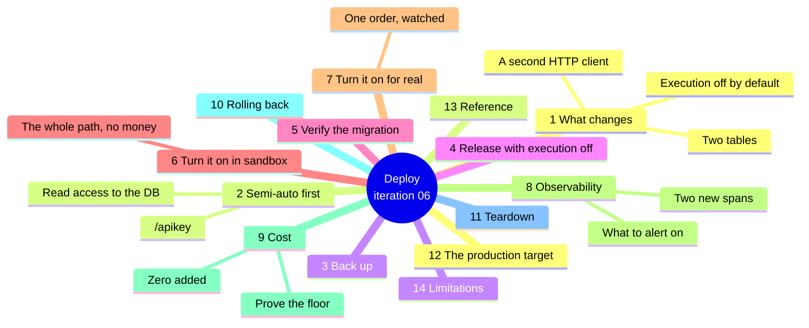
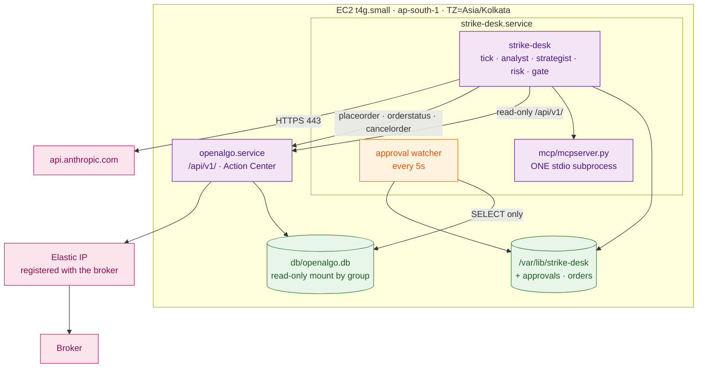

# Iteration 06 — Deployment Guide: releasing the approval gate



## 1. What changes on the host

No new process, no new port, no new secret and no new dependency. Four things change, and the
fourth is why this release deploys in two steps rather than one.

1. **The journal gains `approvals` and `orders`**, created on the first `create_schema()`. No
   `ALTER TABLE`, no existing row read or rewritten.
2. **The desk opens a second HTTP client** against the same localhost OpenAlgo, with a
   three-path whitelist: `placeorder`, `orderstatus`, `cancelorder`.
3. **The desk opens a read-only connection to OpenAlgo's own database.** It reads two tables
   and can write nothing — the connection is opened `mode=ro`, so the driver refuses a write
   before our code has a chance to try one. This is the only place Strike Desk touches
   OpenAlgo outside its HTTP surface, and it exists because the Action Center's routes are
   session-guarded browser endpoints with no API-key equivalent.
4. **A tick can now place an order — behind a human click.** Every release before this one
   could form an intent and stop. After this one, an intent that clears every hard limit is
   queued into OpenAlgo's Action Center and waits for you. It cannot reach a broker without
   your click: the desk verifies OpenAlgo is in semi-auto mode before it submits and stops the
   entire service if a placement comes back saying otherwise.

That last point is why `STRIKE_DESK_EXECUTION_ENABLED` defaults to `false`. §4 releases the
code behaving exactly like iteration 05, §6 turns it on against the sandbox, and §7 turns it on
for real. Do them on different days.



## 2. Two host preconditions

**OpenAlgo must be in semi-auto order mode.** Open the OpenAlgo UI, go to `/apikey`, and set
the order mode for the trader's key to **Semi-Auto**. Confirm it from the database, because
this is the single setting the whole slice rests on:

```bash
sudo -u openalgo sqlite3 /opt/openalgo/db/openalgo.db \
  "SELECT user_id, order_mode FROM api_keys;"
```

Anything other than `semi_auto` and the desk will decline every tick with
`approval-gate-unavailable` — which is the correct behaviour, and a confusing hour if you have
not read this paragraph.

**The desk's user must be able to read OpenAlgo's database directory.** Grant it by group
rather than by copying the file: a copy goes stale within a second, and the watcher would then
be reading yesterday's approvals.

```bash
sudo usermod -a -G openalgo strikedesk
sudo chmod 750 /opt/openalgo/db
sudo chmod 640 /opt/openalgo/db/openalgo.db*
sudo systemctl restart strike-desk       # group membership applies to new processes only

# Prove it, as the service user, before you rely on it. SQLite in WAL mode needs the
# -wal and -shm files readable too, which the glob above covers.
sudo -u strikedesk sqlite3 \
  "file:/opt/openalgo/db/openalgo.db?mode=ro" "SELECT count(*) FROM pending_orders;"
```

## 3. Back the journal up before you migrate it

```bash
sudo -u strikedesk sqlite3 /var/lib/strike-desk/strike_desk.db \
  ".backup '/var/lib/strike-desk/strike_desk.pre-0.6.0.db'"
sudo -u strikedesk sqlite3 /var/lib/strike-desk/strike_desk.pre-0.6.0.db \
  "SELECT count(*) FROM decisions; SELECT count(*) FROM risk_verdicts;"
```

Use `.backup` rather than `cp` — WAL mode with a live writer. Keep both counts for §5.

## 4. Release, with execution off

```bash
RELEASE=$(date +%Y%m%d)-$(git -C /path/to/checkout rev-parse --short HEAD)
sudo git clone --depth 1 <your-repo-url> "/opt/strike-desk/releases/$RELEASE"
cd "/opt/strike-desk/releases/$RELEASE/strike_desk" && sudo uv sync --frozen

sudo tee -a /etc/strike-desk/strike-desk.env >/dev/null <<'ENV'

# --- Execution and the approval gate (iteration 06) ---
# Deliberately off. Section 6 turns it on against the sandbox, section 7 for real.
STRIKE_DESK_EXECUTION_ENABLED=false
STRIKE_DESK_OPENALGO_USER=<the OpenAlgo username>
STRIKE_DESK_OPENALGO_DB_PATH=/opt/openalgo/db/openalgo.db
STRIKE_DESK_ORDER_PRODUCT=MIS
STRIKE_DESK_ORDER_STRATEGY_PREFIX=strike-desk
STRIKE_DESK_PRICE_TICK=0.05
STRIKE_DESK_APPROVAL_DEADLINE_SECONDS=300
STRIKE_DESK_APPROVAL_POLL_SECONDS=5
STRIKE_DESK_FILL_DEADLINE_SECONDS=300
ENV

sudo ln -sfn "/opt/strike-desk/releases/$RELEASE" /opt/strike-desk/current
sudo systemctl restart strike-desk
sudo systemctl status strike-desk --no-pager
```

Set `STRIKE_DESK_OPENALGO_USER` even while execution is off. The settings model refuses to
start with execution enabled and no user, and discovering that at the moment you flip the
switch turns a two-minute change into a failed unit.

## 5. Verify the migration

```bash
sudo -u strikedesk sqlite3 /var/lib/strike-desk/strike_desk.db "
  .tables
  SELECT count(*) FROM decisions;
  SELECT count(*) FROM risk_verdicts;
  SELECT name FROM sqlite_master WHERE type='trigger' AND tbl_name IN ('approvals','orders');
  SELECT name FROM sqlite_master WHERE type='index' AND name LIKE 'uq_%';"
```

`approvals` and `orders` exist with four triggers between them and both unique indexes,
`uq_approvals_state` and `uq_orders_state`; both counts match §3 exactly. Then confirm the
taxonomy moved without cost:

```bash
sudo -u strikedesk /opt/strike-desk/current/strike_desk/.venv/bin/strike-desk declines --since 30
sudo -u strikedesk /opt/strike-desk/current/strike_desk/.venv/bin/strike-desk status
```

`taxonomy drift 0`, `unknown reason codes none`, the header reading `dt-4+<digest>`, and
`execution : disabled`. At this point the desk behaves exactly as it did yesterday.

## 6. Turn it on against the sandbox

This is the step that proves the whole path with no money at stake. OpenAlgo's **analyze
(sandbox) mode** routes an approved order to its own sandbox engine with ₹1 crore of capital,
and — this is the part that makes the rehearsal faithful — it leaves the semi-auto queue
exactly where it is, because the routing check in `services/place_order_service.py` runs before
the analyze branch. You get the real queue, the real click, the real settlement, and a
simulated fill.

Turn on analyze mode in the OpenAlgo UI, then:

```bash
sudo sed -i 's/^STRIKE_DESK_EXECUTION_ENABLED=false/STRIKE_DESK_EXECUTION_ENABLED=true/' \
  /etc/strike-desk/strike-desk.env
sudo systemctl restart strike-desk
sudo -u strikedesk /opt/strike-desk/current/strike_desk/.venv/bin/strike-desk status
```

The line to see is `approval gate : ok — semi-auto approval gate is active`. If it says
`UNUSABLE`, §2 is where the answer is; nothing further will work until it reads ok.

Now walk the loop by hand — Block B of `03_manual_test_cases.md` is the full list, and these
four are the ones you do not skip:

```bash
# 1. Queue one intent and read the case the trader is being asked to approve.
sudo -u strikedesk /opt/strike-desk/current/strike_desk/.venv/bin/strike-desk approvals

# 2. Approve it at /orders/action-center, wait five seconds, and read it back.
sudo -u strikedesk /opt/strike-desk/current/strike_desk/.venv/bin/strike-desk approvals --json

# 3. Confirm the desk went quiet while it waited.
sudo -u strikedesk /opt/strike-desk/current/strike_desk/.venv/bin/strike-desk journal | head

# 4. Let the next one expire, and read the escalation you will one day get at 14:55.
sudo journalctl -u strike-desk --since "10 min ago" | grep -E "APPROVAL (EXPIRED|GATE)"
```

Leave it in sandbox for at least a full session. What you are watching for is not whether it
works — the suite already answered that — but whether the intents it forms are ones you would
have clicked.

## 7. Turn it on for real

Turn analyze mode **off** in the OpenAlgo UI. Nothing in Strike Desk's configuration changes:
the same code, the same limits, the same queue, the same click. What changes is that the
approval now reaches a broker.

Sit with the first one. Read the case, check that the queued order in the Action Center matches
the intent exactly — symbol, quantity, limit price — and approve it. Then confirm the chain
closed:

```bash
sudo -u strikedesk /opt/strike-desk/current/strike_desk/.venv/bin/strike-desk approvals --json \
  | python3 -c 'import json,sys; [print(a["status"], a["broker_order_id"], a["orders"]) for a in json.load(sys.stdin)]'

curl -s -X POST http://127.0.0.1:5000/api/v1/orderbook \
  -H 'Content-Type: application/json' -d '{"apikey":"'"$OPENALGO_API_KEY"'"}' | head -20
```

The broker order id in the journal and the one in OpenAlgo's order book are the same string.
That equality is the whole audit chain in one line: order → approval → decision → verdict →
proposal → regime read.

The check that matters most on this release is the negative one:

```bash
# Every order in the book traces to an approval. Nothing autonomous.
sudo -u strikedesk sqlite3 /var/lib/strike-desk/strike_desk.db "
  SELECT o.broker_order_id, a.status, a.approved_by
    FROM orders o JOIN approvals a
      ON a.approval_id = o.approval_id AND a.status IN ('approved','late-approval')
   ORDER BY o.id DESC LIMIT 10;"

# And no bypass was ever recorded.
sudo -u strikedesk sqlite3 /var/lib/strike-desk/strike_desk.db \
  "SELECT count(*) FROM approvals WHERE status='gate-bypassed';"
```

A non-zero count on the second query means an order reached the broker without a click. The
desk will already have engaged the kill switch and stopped; do not clear it until you know
why.

## 8. Observability

Two span names are new and both land in the journal's `traces` table, exported over OTLP only
when the endpoint iteration 01 wired is set. `tick.submit` is a child of the tick's own trace
and carries the approval id, pending order id, quantity, limit price and resulting status;
`strike_desk.approval` is the watcher's own root span, one per settlement, carrying the status,
the seconds waited, the withdrawal and — the hop that stitches the two traces together —
`strike_desk.tick_trace_id`.

```bash
sudo -u strikedesk sqlite3 /var/lib/strike-desk/strike_desk.db "
  SELECT name, status, duration_ms, substr(attributes_json, 1, 120)
    FROM traces WHERE name IN ('tick.submit','strike_desk.approval','tick.settle')
   ORDER BY id DESC LIMIT 10;"
```

Five log lines are worth an alert, all of them CRITICAL, so a single grep is the whole rule:

```bash
sudo journalctl -u strike-desk --since today | grep -E \
  "APPROVAL GATE BYPASSED|APPROVAL EXPIRED|LATE APPROVAL|APPROVAL QUEUE UNREADABLE|UNJOURNALLED PENDING ORDER"
```

`APPROVAL GATE BYPASSED` means stop everything and read §7's negative check. `APPROVAL EXPIRED`
means a queued order is still sitting in the Action Center and a human must reject it.
`LATE APPROVAL` means a click landed after the deadline; in sandbox the desk cancelled the
order, and in live semi-auto it could not, so read the position book. `APPROVAL QUEUE
UNREADABLE` means the desk can no longer see OpenAlgo's database while an intent of its own is
past its deadline — it is holding, not trading, and §2's permissions are where to look;
the next tick will also hold with `approval-queue-stale`, so `strike-desk declines` exits 2 and
a timer notices even if nobody reads the log. `UNJOURNALLED PENDING ORDER` is the rarest and
the most urgent: an order was queued but its journal row was not written, so nothing is
watching it — reject it in the Action Center by hand. Routing these to Telegram
alongside fills and risk events is UC-14's work; until then they are `journalctl` lines and the
`strike-desk approvals` exit code, which is 2 whenever the window holds a defect:

```bash
sudo -u strikedesk /opt/strike-desk/current/strike_desk/.venv/bin/strike-desk approvals \
  || echo "a defect is in today's approvals — read it"
```

## 9. Cost

This release adds nothing to the bill. There are no tokens in it — the approval path runs no
model — no new process, no new instance, and no new egress beyond a few localhost POSTs. The
watcher wakes every five seconds to run two indexed SELECTs against two SQLite files on the
same disk; over a market session that is a rounding error against a tick that calls Sonnet.
The two new tables add a few hundred bytes per approval at a handful of approvals a day.

```bash
# The marginal cost of iteration 06 should be indistinguishable from zero.
aws ce get-cost-and-usage --time-period Start=$(date -d '7 days ago' +%F),End=$(date +%F) \
  --granularity DAILY --metrics UnblendedCost \
  --filter '{"Dimensions":{"Key":"REGION","Values":["ap-south-1"]}}' \
  --query 'ResultsByTime[].{day:TimePeriod.Start,usd:Total.UnblendedCost.Amount}' --output table

sudo du -h /var/lib/strike-desk/strike_desk.db
sudo -u strikedesk sqlite3 /var/lib/strike-desk/strike_desk.db \
  "SELECT count(*) FROM approvals; SELECT count(*) FROM orders;"
```

The daily figure either side of the deploy should match to the cent.

### The practice posture, and proving it

The posture is unchanged from iteration 01 and is deliberately the cheapest one this product is
allowed to have. Scale-to-zero is **not** available and that is regulatory rather than an
oversight: from 1 April 2026 SEBI requires every transactional API order to originate from a
broker-whitelisted static IP, so the host holds an Elastic IP and stays up through the session.
That buys a floor rather than zero — roughly **$4.30 a month** for the Elastic IP and the gp3
volume, with the `t4g.small` itself free under the T4g trial through 31 December 2026 — and
this release moves none of it.

The silent cost leaks on this stack are the ones iteration 01 named and they have not changed:
an Elastic IP is billed whether attached or not, old release checkouts under
`/opt/strike-desk/releases` accumulate on the same 8 GiB volume, and the journal grows
monotonically because it is append-only. Prune releases beyond the last three; leave the
journal alone — it is now the only record of who approved what.

```bash
# Idle cost check: with the market closed, nothing should be running but two sleeping units.
systemctl list-timers --all | grep strike-desk
ps -o pid,etime,pcpu,rss,cmd -C python | grep -c strike-desk
sudo du -sh /opt/strike-desk/releases/*
```

## 10. Rolling back

Two rollbacks exist here and the cheap one is almost always the right one.

**Stop executing, keep the release.** One line, no restart of anything else, and the desk falls
back to iteration-05 behaviour — forming intents and journalling them:

```bash
sudo sed -i 's/^STRIKE_DESK_EXECUTION_ENABLED=true/STRIKE_DESK_EXECUTION_ENABLED=false/' \
  /etc/strike-desk/strike-desk.env
sudo systemctl restart strike-desk
```

**Roll back the code.** Structurally the same as iteration 05's, because this release added
tables rather than widening one:

```bash
sudo ln -sfn /opt/strike-desk/releases/<the previous release> /opt/strike-desk/current
sudo sed -i '/^STRIKE_DESK_EXECUTION_ENABLED=/d;/^STRIKE_DESK_OPENALGO_USER=/d;
             /^STRIKE_DESK_OPENALGO_DB_PATH=/d;/^STRIKE_DESK_ORDER_/d;
             /^STRIKE_DESK_PRICE_TICK=/d;/^STRIKE_DESK_APPROVAL_/d;
             /^STRIKE_DESK_FILL_DEADLINE_SECONDS=/d' /etc/strike-desk/strike-desk.env
sudo systemctl restart strike-desk
```

The environment must be reverted in the same breath: the old binary's settings model is
`extra="forbid"` and refuses to start with keys it does not know. Two consequences are worth
understanding before you need them. Rows written under `dt-4` stay in the journal, so a `dt-3`
binary reading an `approval-pending` row classifies it as `unknown`/`defect` and
`strike-desk declines` exits 2 — correct, because a `dt-3` build genuinely does not know what
that code means. And **check the Action Center before you roll back**: an approval outstanding
at the moment you swap the symlink has no watcher after it, so reject it by hand rather than
leaving it queued.

## 11. Teardown

Unchanged in shape, with one step in front of it. Before disabling the units, make sure the
queue is empty:

```bash
sudo -u strikedesk /opt/strike-desk/current/strike_desk/.venv/bin/strike-desk approvals
# reject anything still 'pending' at /orders/action-center, then:
sudo systemctl disable --now strike-desk strike-desk-report.timer
```

Archive `/var/lib/strike-desk/` before removing it. The journal cannot be regenerated, and it
now holds the record of every order this desk ever put in front of a human.

## 12. The production target

The practice posture above is a cost configuration, not a quality one: the same code, the same
gate and the same journal promote to the production target by changing tiers and files rather
than by being rewritten. For the pieces this slice touches:

**Compute stays always-on and gets bigger, not different.** `t4g.small` under the free trial
becomes an on-demand `t4g.small` or `t4g.medium` in `ap-south-1` (roughly $12–24 a month) once
the trial ends on 31 December 2026, on the same Elastic IP, with the same systemd unit. The
approval path is I/O-bound on a localhost POST and a five-second poll, so this is headroom
rather than performance.

**The mirror becomes a Postgres URL rather than a file path.** The tech stack names RDS
Postgres as the migration path for the journal, and OpenAlgo's own `DATABASE_URL` moves with
it. `OpenAlgoMirror` builds one engine from one URL, so that promotion is a settings change and
a read-only database role — a `GRANT SELECT` on `api_keys` and `pending_orders`, which is a
stronger version of the same guarantee `mode=ro` gives today.

**Backups become automatic.** Today §3's `.backup` is a step you run by hand before a
migration. In production it is a nightly `sqlite3 .backup` to S3 with lifecycle expiry, or RDS
automated snapshots after the Postgres move. The `approvals` table is the labelled corpus the
desk is graded against and the record of who authorised what; it is the last thing that should
live on one EBS volume.

**Observability keeps its shape at a cost.** The spans in §8 already export over OTLP the
moment `STRIKE_DESK_OTLP_ENDPOINT` points at a self-hosted Langfuse — the variable iteration 01
wired and left unset because Langfuse's ClickHouse does not fit beside the desk on a
`t4g.small`. In production that is its own instance, `approval.status` and
`approval.wait_seconds` become dashboard dimensions, and the three CRITICAL lines in §8 become
alert rules with a pager behind them rather than a `grep` you remember to run.

**The gate itself gets a second lock.** Semi-auto plus a five-minute deadline is the MVP
posture. Production means the same code with `STRIKE_DESK_APPROVAL_DEADLINE_SECONDS` tuned to
how fast you actually answer, per-index limits confirmed against the account, and — when a
playbook has earned it through the journal this slice now fills — the auto-mode promotion of
UC-15, which is a configuration decision made on evidence rather than a rewrite.

## 13. Reference

| Thing | Value |
| --- | --- |
| Package version | `0.6.0` |
| Journal schema | `SCHEMA_VERSION = 6` — adds `approvals` and `orders` |
| Taxonomy | `dt-4` — sixteen earlier codes unchanged, three added |
| New tables | `approvals`, `orders` — append-only, unique per state |
| New endpoints | `/api/v1/placeorder`, `/api/v1/orderstatus`, `/api/v1/cancelorder` |
| New host precondition | API key in **semi-auto** at `/apikey`; group read on `/opt/openalgo/db` |
| New settings | Nine `STRIKE_DESK_*` keys, execution off by default |
| Default posture after §4 | Identical to iteration 05 |
| Watcher cadence | 5s, `max_instances=1`, in the existing scheduler |
| New model calls, ports, secrets, processes | None |
| First release that can place an order | Yes — behind a human click, never without one |
| Rollback | One env line, or a symlink swap plus deleting the nine keys |

## 14. Limitations

1. **The mirror assumes OpenAlgo is on SQLite.** On a Postgres deployment `health()` fails
   closed, the desk declines every tick with `approval-gate-unavailable`, and nothing is
   submitted. Safe and visible, but the fix is the Postgres URL of §12, not a workaround.
2. **A late fill cannot be prevented in live semi-auto.** OpenAlgo blocks `cancelorder` for a
   semi-auto API key unless analyze mode is on, so live the desk detects a post-deadline
   approval within a poll and escalates, but cannot undo it. The limit price bounds what such a
   fill can cost; nothing bounds when it arrives.
3. **An outstanding approval has no watcher while the service is down.** Restarting is safe —
   the watcher rebuilds from the journal and settles exactly once — but a service that stays
   down leaves a queued order in the Action Center that only a human can remove.
4. **A filled position has no exits yet.** This release buys; holding the position to its stop,
   its target and its time-stop is UC-07. Until then, OpenAlgo's exchange-aligned auto
   square-off is the backstop under it, and it must stay enabled.
5. **The trader's case lives in a terminal.** The Action Center shows the order, not the
   reasoning; `strike-desk approvals` shows the reasoning. Read it before you click.

---
**Sources**

*Repo files:* `030_design/03_architecture.md` · `030_design/04_tech_stack.md` · `040_iterations/iteration-01/05_deployment_guide.md` · `040_iterations/iteration-05/05_deployment_guide.md` · `040_iterations/iteration-06/02_implementation_guide.md` · `services/place_order_service.py` · `services/order_router_service.py` · `services/cancel_order_service.py` · `database/action_center_db.py`

*Web (accessed 2026-09-01):*
- [SEBI — Safer participation of retail investors in Algorithmic trading (static-IP mandate)](https://www.sebi.gov.in/legal/circulars/feb-2025/safer-participation-of-retail-investors-in-algorithmic-trading_91614.html)
- [AWS — Amazon EC2 T4g free trial extension (750 hours/month through 31 Dec 2026)](https://repost.aws/articles/ARi_gf6vo6TuqNtMQdiYPKyA/announcing-amazon-ec2-t4g-free-trial-extension)
- [AWS — Elastic IP addresses are charged whether in use or idle](https://docs.aws.amazon.com/AWSEC2/latest/UserGuide/elastic-ip-addresses-eip.html)
- [SQLite — URI filenames and the `mode=ro` parameter](https://www.sqlite.org/uri.html)
- [Langfuse — OpenTelemetry endpoint and OTLP environment variables](https://langfuse.com/integrations/native/opentelemetry)
