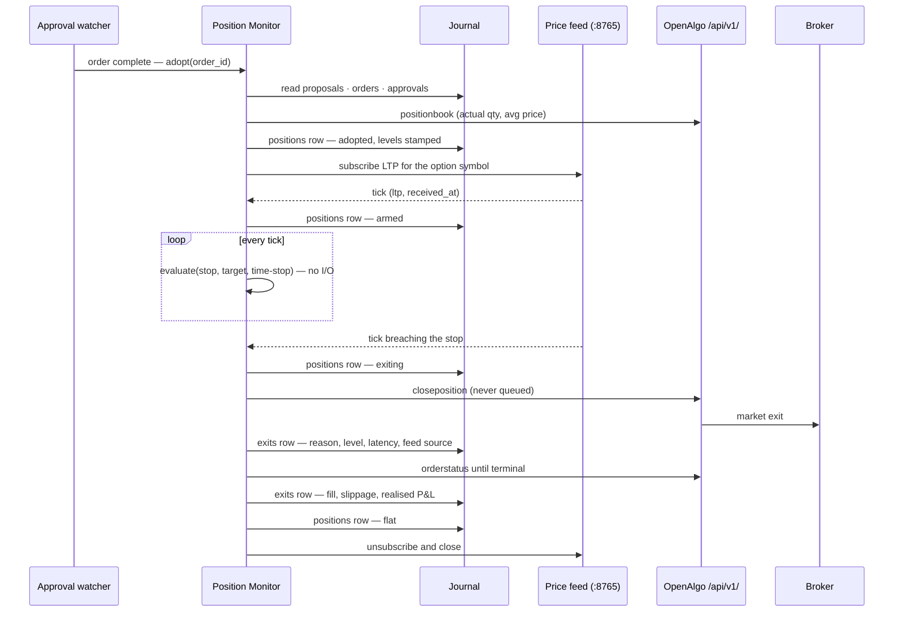

# Iteration 07 — UC-07: Manage the open position

> **UC-07 — Manage the open position**
>
> **Why this slice:** the catalog's MVP order runs UC-01 → UC-02 → UC-03 → UC-04 → UC-05 → UC-06 → UC-07, and iterations 01 to 06 built the first six. UC-07 is the next un-built entry by catalog priority, and it is the one the desk cannot honestly go on without: since iteration 06 the trader can click **Approve** and a real broker order can fill, and from that moment the desk owns a live long option with nothing watching it. A position with no stop is not a managed trade, it is an open-ended bet on the clock — the exact bleed the product was built to refuse. This iteration puts the Position Monitor under the fill.
>
> **Actor:** the Position Monitor — deterministic control-plane code, not an agent. The Trader is a spectator here and an escape hatch: he can close the position himself and the monitor will notice and stand down.
>
> **Preconditions:** the iteration-06 desk running, journal at `SCHEMA_VERSION = 6`, taxonomy `dt-4`, playbook `pb-1`, limits `rl-1`, `STRIKE_DESK_EXECUTION_ENABLED=true`, and OpenAlgo's WebSocket proxy reachable on `ws://127.0.0.1:8765` with its ZeroMQ bus up. · **Depends on:** UC-04's `proposals` row, which is where the stop, the target and the theta-derived time-stop were written at proposal time; UC-06's `orders` row and its watcher, which is what tells the monitor a fill happened; and UC-01's journal, span and kill-switch plumbing, which this slice extends rather than reshapes. Telegram delivery of the operator-facing escalations is UC-14's work, so this slice escalates to the process log at `CRITICAL` and to the kill switch.

This iteration builds exactly one thing: a loop that holds a filled long option from fill to flat against three levels it did not choose, and gets out the moment one of them is hit. It adopts the position, arms the levels, watches the price, fires a market exit, records what happened with the latency it took, reconciles against the broker, and stands down. Nothing beyond that.

On top of that loop it adds the thing the loop makes safe to offer, and makes it **the default**: an **unattended mode** in which the trader approves nothing and the desk runs from tick to flat by itself. That is §9, and it is deliberately last — the human could only leave the entry gate once something was watching the fill. From this iteration on he leaves it by default, and attended mode survives only as an explicit opt-out.

## 1. The division of labour, restated for the control plane

Iteration 04 established that the model proposes and code verifies. This slice states the same idea one step further down: **the agentic layer contributed the levels at entry time; enforcing them is arithmetic.** The stop, the target and the time-stop were fixed the moment the Options Strategist's proposal cleared `playbook.check` and the Risk Officer; the monitor never re-derives, re-negotiates or re-reasons about them. It compares two numbers and a clock, and when the comparison says get out, it sends a market order.

That is why nothing in this slice imports the reasoning plane. No model call, no MCP tool call, no prompt and no LangGraph node sits between a breached stop and an exit order — an exit that waits on a language model is not an exit. The plan → act → observe loop the rest of the product runs does not appear here at all, and its absence is the design. What this slice does own operationally is the other half of the AgentOps story: **every state change and every exit attempt is a span and an append-only row**, and the exit latency from breach to submission is measured on every single exit rather than asserted once in a test.

## 2. The three levels and their precedence

A long option is held against three exits, and the monitor holds all three from the moment of adoption.

The **stop** is the premium level at which the trade is wrong; the proposal wrote it, and the Risk Officer sized the position so that reaching it costs no more than the per-trade cap. The **target** is where the trade is right and the desk takes the money rather than hoping. The **time-stop** is the wall clock the theta budget bought: a long option decays whether or not the thesis is intact, so the monitor closes on the clock regardless of price. Alongside the proposal's own time-stop the monitor holds a **session deadline** — 15:10 IST by default, comfortably inside the exchange's own square-off — and takes whichever of the two comes first, so an intraday desk never carries a decaying position into the close by accident.

When more than one level is breached in the same observation — a gap can cross the stop and the target in one print, and a tick delivered late can arrive after the time-stop — precedence is fixed and safety-first: **time-based exits beat price exits, and the stop beats the target.** Each of those orderings picks the exit that assumes less. Getting out on the clock is never wrong for an options buyer, and recording a target on an observation that also breached the stop is optimistic bookkeeping.

## 3. Main success scenario

1. The approval watcher sees the entry order reach `complete` and hands the monitor the order id, or the monitor finds an unadopted filled order during startup reconciliation.
2. The monitor resolves the chain backwards — order → approval → proposal — and reads the stop, target, time-stop and theta budget from the `proposals` row.
3. It reads `/api/v1/positionbook` and adopts the **actual** net quantity and average entry price the broker reports rather than the quantity it asked for, so a partial fill is managed as what it is.
4. It writes a `positions` row at state `adopted`, then a second at `armed` once the price feed is delivering ticks for the symbol.
5. The price feed subscribes the option symbol on OpenAlgo's WebSocket proxy in LTP mode and pushes every tick into the monitor with the moment it was received.
6. On each tick the monitor evaluates the levels — three comparisons, no I/O — and does nothing when no level is breached.
7. A tick breaches a level. The monitor stamps the breach time, writes a `positions` row at `exiting`, and submits a market exit through the ungated exit path (§4) without waiting for anything or anyone.
8. It records an `exits` row with the reason, the level, the observed price, the feed source and age, and the latency from breach observation to submission.
9. It follows the exit order to a terminal status, reads the fill price, computes slippage against the level and realised P&L against the entry, and writes the final `positions` row at `flat`.
10. The feed unsubscribes and closes, the monitor stands down, and the next scheduled tick finds a flat book and is free to propose again — subject to the day's trade count.

## 4. Exits are never gated, and the desk proves it before it enters

FR-7 says exits must not require approval even in semi-auto: getting out is never gated. OpenAlgo's semi-auto mode, which iteration 06 depends on for entries, is a **user-level** policy — `services/order_router_service.py` queues every `placeorder` for that key, and `services/close_position_service.py` refuses `closeposition` outright with a 403 unless the platform is in analyze (sandbox) mode. Those two facts together mean the exit path is open in exactly two configurations: the platform in **analyze/sandbox mode**, where `closeposition` executes immediately against the sandbox engine and where the MVP's proving week runs, or the order mode set to **auto**.

The monitor therefore proves rather than assumes. Before a tick is allowed to form a new entry at all, the desk runs an **exit-path preflight** against its read-only mirror of OpenAlgo's database: if the platform is live *and* the key is in semi-auto, the exit path is gated and the tick declines with the new reason code `exit-path-gated`. The desk never takes a position it cannot leave without a human. And when an exit does fire it climbs a two-rung ladder: `closeposition` first, which is never queued and closes the desk's own single position, then a **targeted** SELL market order for the exact symbol and quantity, used when the account holds a position the desk did not open and a blanket close would be wrong. If the fallback comes back queued rather than placed, that is an exit sitting in an approval queue — the monitor records it as `gated`, logs `CRITICAL` with the symbol and quantity the trader must close by hand, and keeps trying.

## 5. Alternate and exception flows

**A gap through the stop** is the normal case, not the exception: options gap. The exit is a market order in every case, so a gap changes nothing about the mechanism and everything about the accounting — the exit row records the level, the observation that breached it and the price it actually filled at, and the difference is stored as slippage rather than smoothed away.

**A rejected or failed exit** retries on a short backoff up to the configured attempt limit, climbing the ladder as it goes. When the last attempt fails the monitor logs `CRITICAL` naming the symbol and the quantity, engages the kill switch so no new intent can be formed, and leaves the position to OpenAlgo's exchange-aligned auto square-off — the backstop that exists precisely because it must survive the thing it is backing up.

**A quiet feed** is handled in two stages. When no tick has arrived for `feed_stale_seconds` the monitor falls back to polling `/api/v1/quotes` for the symbol, which is slower but sufficient, and marks its feed source accordingly on every subsequent exit row. If the REST fallback also fails continuously for `feed_blackout_seconds`, the monitor stops guessing and exits at market with reason `feed-blackout`: a position whose price you cannot see is not a position you hold deliberately.

**The trader closes the position himself** — from the OpenAlgo UI, from his broker's app, or by phone. The reconciler, which reads the position book every `reconcile_interval_seconds`, finds the net quantity at zero, writes a `stood-down` row with exit reason `manual`, closes the feed and stops watching. It never attempts an exit for a position that no longer exists, and it never treats a broker-side truth as a mistake.

**A position the desk cannot explain** — the broker reports a holding in an option symbol with no `orders` row behind it — is recorded `orphaned` with a `CRITICAL` log and is not managed. The monitor manages what it opened; adopting a stranger's position and putting a stop on it is exactly the kind of helpfulness a risk system must not have.

**Levels that cannot be resolved** — the proposal row is missing, or its stop and target are absent — mean the monitor is holding a position it cannot manage. It exits at market immediately with reason `levels-unavailable` and marks the row a defect. An unmanaged position is worse than a small realised loss.

## 6. Data touched

The journal moves to `SCHEMA_VERSION = 7` and gains two append-only tables. **`positions`** holds one row per state of one position — `adopted`, `armed`, `exiting`, `flat`, `stood-down`, `orphaned` — carrying the symbol, exchange, product, adopted quantity, entry price and the three levels as stamped, under `UNIQUE(position_id, state)`. **`exits`** holds one row per exit attempt — reason, ladder rung, trigger and submission timestamps, the latency between them, the level and the observed price, the feed source and its age, the resulting status, the broker order id, the fill price, slippage and realised P&L — under `UNIQUE(position_id, attempt)`. As everywhere else in this journal, uniqueness is the idempotence: a duplicate state write raises `AlreadyJournalled` and the caller reads it as *already done*.

Reads are `proposals`, `orders` and `approvals` for the chain behind a fill, and `api_keys.order_mode` plus `settings.analyze_mode` through the read-only mirror for the preflight. Writes go only to Strike Desk's own database. Market data comes from the WebSocket proxy and, in fallback, from `/api/v1/quotes`, which joins the tick client's read-only whitelist. Exits leave through `/api/v1/closeposition` and `/api/v1/placeorder`, which join the execution client's whitelist. No model is called anywhere in this slice, so the day's token cost is unchanged by it.

## 7. Acceptance criteria

1. **AC-1** — Every adopted position carries a stop, a target and a time-stop stamped from its `proposals` row at adoption; a position whose levels cannot be resolved is exited at market immediately with reason `levels-unavailable` and its row marked a defect.
2. **AC-2** — A filled entry order is adopted within one monitor poll interval of reaching `complete`, whether the watcher hands it over or startup reconciliation finds it, and adoption uses the broker's reported net quantity and average price, not the requested ones.
3. **AC-3** — An observed price at or below the stop fires a market exit recorded with reason `stop`.
4. **AC-4** — An observed price at or above the target fires a market exit recorded with reason `target`.
5. **AC-5** — The monitor exits at the earlier of the proposal's time-stop and the configured session deadline regardless of price, with reason `time-stop` or `session-deadline`; no position outlives the earlier of the two.
6. **AC-6** — When several levels are breached in one observation, precedence holds: time-based exits beat price exits, and `stop` beats `target`.
7. **AC-7** — Every exit row carries the measured latency from breach observation to order submission, the same value appears on the exit span, and the deterministic path stays within `exit_latency_budget_ms`.
8. **AC-8** — No module on the monitor path imports the reasoning plane, and no model or MCP call occurs on it — enforced by an automated import and call-surface test.
9. **AC-9** — A tick declines with `exit-path-gated` whenever the exit-path preflight reports that the platform would queue or refuse an exit, so no entry is formed that cannot be exited without a human.
10. **AC-10** — A gap exit records the level, the breaching observation and the actual fill price, and stores the difference as slippage.
11. **AC-11** — A failing exit retries up to `exit_max_attempts` climbing the ladder, and on final failure logs `CRITICAL` naming symbol and quantity and engages the kill switch.
12. **AC-12** — A feed silent beyond `feed_stale_seconds` switches to REST quote polling and every subsequent exit row names the source; a blackout beyond `feed_blackout_seconds` exits at market with reason `feed-blackout`.
13. **AC-13** — A position closed outside the desk is reconciled within one reconcile interval into a `stood-down` row with exit reason `manual`, and the feed is closed.
14. **AC-14** — Every state change is one append-only row, a repeated state write is refused by the unique constraint and surfaces as *already done*, and `strike-desk position` prints the live position, its three levels, the distance to each, the feed source and its age, exiting non-zero when a defect state exists.

## 8. The flow, in one picture

## 9. Unattended operation — taking the human out of the loop

Iteration 06 put a person in front of every entry: the intent went into OpenAlgo's Action Center and waited for a click. That was the right shape for a desk that had nothing watching a fill. This iteration changes the fact underneath it — from here on a fill is adopted, armed against three levels and exited by code — and so the desk can now be asked to run the whole loop by itself. Amit wants that: **an unattended mode in which no human approves anything, from tick to flat.**

The mode is a switch, not a rewrite. `STRIKE_DESK_AUTONOMY` reads `unattended` — the default from this iteration on — or `attended`, which is iteration 06's behaviour kept as an opt-out for a desk that wants its click back. Nothing about the reasoning plane changes in either: the same two agents, the same prompts, the same playbook check and the same Risk Officer clear the same contract. What changes is what happens to a cleared intent. Unattended, it goes. Attended, it queues and waits for a click.

Flipping the default has a consequence worth naming plainly, because it lands on every existing deploy: **an iteration-06 desk upgraded to this iteration without touching its `.env` becomes autonomous.** That is the intent, not an accident, and §9.1 makes it fail loudly rather than quietly — the desk refuses to trade at all until the OpenAlgo key is moved to Auto order mode. An operator who upgrades and does nothing gets `autonomy-mode-mismatch` declines, not surprise unattended orders. The upgrade note in `05_deployment_guide.md` carries the same warning, and the two daily caps in §9.2 exist precisely because the safe path is now the default path.

### 9.1 The same gate, read the other way

The desk still never assumes what OpenAlgo will do with an order; it reads `api_keys.order_mode` from the read-only mirror and insists the platform agrees with it. Attended mode demands `semi_auto` and treats a response carrying a bare `orderid` as the catastrophe it is — an order reached a broker with nobody in the loop. Unattended mode demands `auto` and treats the mirror image as the catastrophe: a response carrying a `pending_order_id` means the desk believes it is autonomous while a human is quietly holding its entry in a queue, and an entry parked in a queue with a monitor waiting for a fill is a desk that will misread the whole day. Either mismatch declines the tick with `autonomy-mode-mismatch` before a token is spent, and a mismatch discovered in the *response* — after submission — engages the kill switch, exactly as iteration 06 does.

This is also where the two halves of the iteration meet. §4's exit-path preflight already refuses to enter when the platform is live and the key is in semi-auto, because an exit would need a human. Unattended mode requires `auto`, which is precisely the configuration in which both the entry and the exit are ungated. The `exit-path-gated` decline and the `autonomy-mode-mismatch` decline are two readings of the same switch, and in unattended mode they agree.

### 9.2 What replaces the click

The click was never only a gate; it was also the last place a human could look at a case and say no. Removing it removes that, so the desk replaces it with controls that do not need a person awake, and all of them are arithmetic:

The **dead-man switch** comes first. Unattended, no entry may be formed unless the Position Monitor is alive and recently alive — its thread running, and its heartbeat stamped within `monitor_heartbeat_max_age_seconds`. An unattended entry made while nothing is watching is the open-ended bet §1 of this document refuses; the tick declines with `monitor-unavailable` instead. Attended mode has no such rule, because attended, a person is the fallback — and since attended is now the exception, the dead-man switch is the rule that applies on almost every desk.

The **daily realised-loss cap** comes second. The monitor now writes realised P&L on every `flat` row, so the day's realised loss is a sum over the `exits` table and needs no new state. When the day's realised loss reaches `unattended_daily_loss_cap`, the desk declines with `daily-loss-cap` and engages the kill switch, so the cap holds until a human clears it. A per-trade cap the Risk Officer already enforces stops one bad trade; this stops a bad day.

The **unattended trade count** comes third: `unattended_max_trades_per_day`, taken as the tighter of it and the limits pack's own daily count. A strategy that is wrong about the regime is wrong repeatedly, and an unattended desk will happily prove it eight times before lunch.

And the record comes fourth. Every unattended entry is logged at `WARNING` with the full case — contract, size, the three levels, the analyst's regime read and the strategist's rationale — so the trader reads in the morning exactly what was decided in his absence. The `approvals` row is still written, at status `auto-approved` with the approver recorded as the desk itself and no deadline, so `strike-desk approvals` prints the same case it always did with the click replaced by a stamp. The audit trail keeps its shape; only the approver changed.

### 9.3 What the graph stops doing

Unattended, the `await_approval` node does not call `interrupt()`. The tick runs from plan to submitted order in a single pass, the graph never suspends, no checkpoint is resumed, and no `approval-pending` hold blocks the following ticks — because there is no pending approval to be held by. The approval watcher's five-second poll narrows to what it is now for: following the placed order to a terminal status and handing a `complete` to the monitor. The five-minute approval deadline, and the expiry path that logs `CRITICAL` when a click never comes, are attended-mode concerns and simply do not arm.

The journal does not move. No new table, no new column, no migration — `SCHEMA_VERSION` stays at 7. `auto-approved` is a new value in a column that already exists, and the loss cap is a query over rows this iteration was already writing.

### 9.4 What the trader still holds

Unattended is not unsupervised. The kill switch still stops the desk on the next tick and is honoured mid-position; `strike-desk pause` still holds new entries while letting an open position run to its levels; `strike-desk position` still prints what is live and its distance to each level; and the trader can close the position from OpenAlgo at any moment, which §5's reconciler reads as `manual` and stands down for. The human left the loop; he did not leave the room.

### 9.5 Additional acceptance criteria

15. **AC-15** — With `STRIKE_DESK_AUTONOMY=unattended` and the OpenAlgo key in Auto mode, a cleared intent reaches the broker in the same tick, with no `interrupt()`, no pending order and no `approval-pending` hold on the following tick.
16. **AC-16** — The autonomy mode is verified against the mirror before submission: unattended with a key in semi-auto, or attended with a key in auto, declines with `autonomy-mode-mismatch` and no token is spent.
17. **AC-17** — A response that contradicts the mode after submission — a `pending_order_id` unattended, an `orderid` attended — is journalled as a defect and engages the kill switch.
18. **AC-18** — Unattended, no entry is formed unless the monitor is alive with a heartbeat newer than `monitor_heartbeat_max_age_seconds`; otherwise the tick declines with `monitor-unavailable`.
19. **AC-19** — Unattended, the day's realised loss summed from `exits` reaching `unattended_daily_loss_cap` declines the tick with `daily-loss-cap` and engages the kill switch; the cap also holds across a restart, because it is derived from the journal and not from memory.
20. **AC-20** — Unattended, the day's entry count is capped at the tighter of `unattended_max_trades_per_day` and the limits pack's daily count.
21. **AC-21** — Every unattended entry writes an `approvals` row at `auto-approved` with the desk as approver and no deadline, logs the full case at `WARNING`, and prints under `strike-desk approvals` exactly as an attended case does. Attended mode's behaviour, when explicitly selected, is byte-for-byte unchanged, which the regression suite asserts.
22. **AC-22** — A desk started with no `STRIKE_DESK_AUTONOMY` set runs unattended: `strike-desk position` reports `autonomy: unattended`, and an upgraded iteration-06 deploy whose key is still in Semi-Auto declines every tick with `autonomy-mode-mismatch` rather than entering or waiting for a click.
