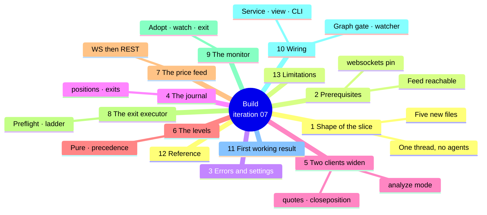
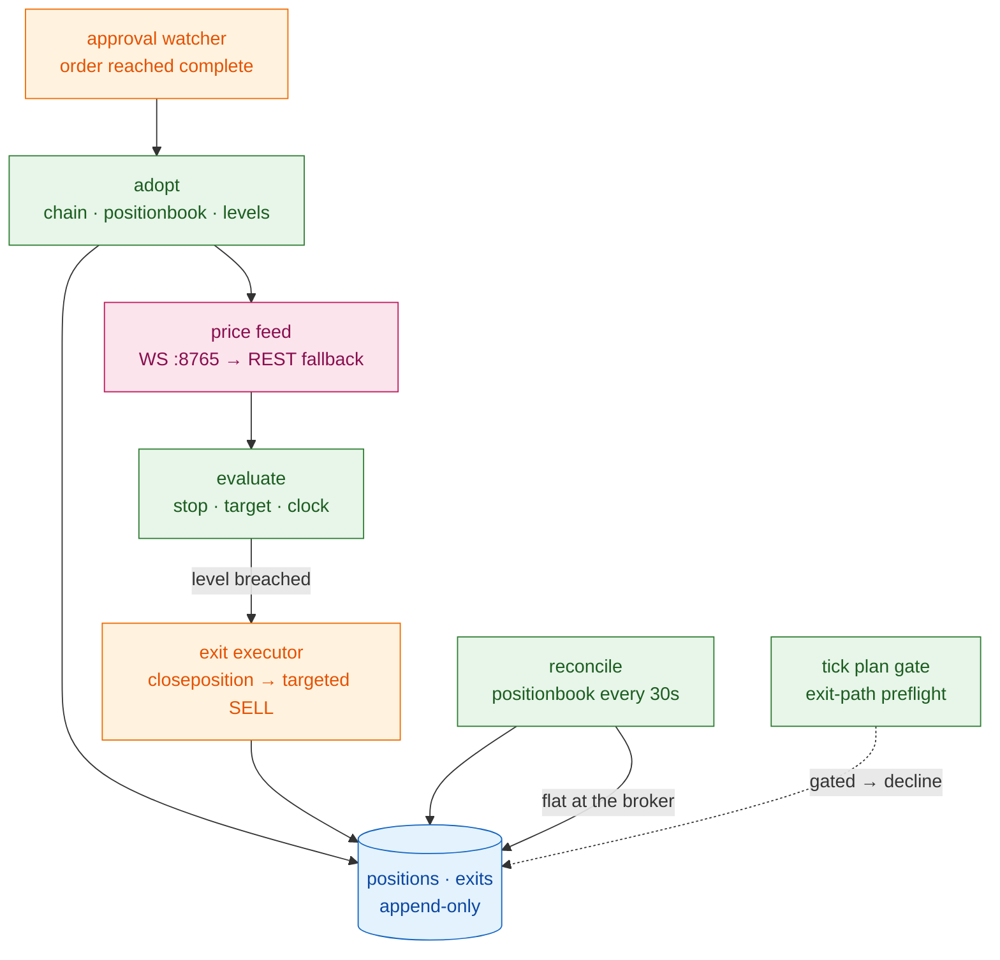

# Iteration 07 — Implementation Guide: the Position Monitor

> **Document:** the build instructions for UC-07. Read `01_use_case.md` first for what this
> slice is and why; this file is how it is made. `03_manual_test_cases.md` is what you check
> by hand, `04_test_automation.md` is what CI checks forever, and `05_deployment_guide.md`
> releases it to the host.
>
> **Starting point:** the iteration-06 desk. `strike_desk/src/strike_desk/` holds `config.py`,
> `errors.py`, `events.py`, `journal.py`, `mcp_toolbox.py`, `grounding.py`, `model_client.py`,
> `prompt_registry.py`, `regime_analyst.py`, `options_strategist.py`, `playbook.py`,
> `risk_officer.py`, `risk_view.py`, `decline_taxonomy.py`, `decline_report.py`,
> `proposal_view.py`, `openalgo_mirror.py`, `execution_client.py`, `approval_gate.py`,
> `approval_watcher.py`, `approval_view.py`, `graph.py`, `runner.py`, `service.py`,
> `session.py`, `specialists.py`, `book_state.py`, `observability.py`, `openalgo_client.py`
> and `__main__.py`. The journal is at `SCHEMA_VERSION = 6` and the taxonomy at `dt-4`.
>
> **Ending point:** the same desk with a live price feed, a pure level evaluator, an ungated
> exit executor, a Position Monitor thread, `positions` and `exits` tables, a taxonomy at
> `dt-5`, a `strike-desk position` command — and a filled option that cannot outlive its stop,
> its target or its clock.
>
> **How the code is presented:** every new file is reproduced complete and copy-paste ready.
> For the files you edit, each changed unit is given whole — a full function, a full class or
> a full block with the exact line it replaces — never as a fragment with pieces left out.



## 1. What you are adding, and the shape of it

The whole slice is one thread and one rule: **hold three numbers in memory and compare them to
every price that arrives.** Everything else in this guide exists because the position is real,
the feed is not always there, the exit can be refused, and every one of those facts has to end
up in an append-only row you can read back in a month.

Five files are new.

| File | What it is |
| --- | --- |
| `levels.py` | The pure evaluator: three levels, one clock, a fixed precedence, no I/O. This is the file to read first and the file with the most tests. |
| `price_feed.py` | One symbol subscribed on OpenAlgo's WebSocket proxy in LTP mode, with a REST quote fallback and a staleness clock. One connection, closed before every reconnect. |
| `exit_executor.py` | The preflight that decides whether an exit could fire at all, and the two-rung ladder that fires it. |
| `position_monitor.py` | The loop: adopt a fill, arm the levels, evaluate every tick, exit, follow the exit to a fill, reconcile, stand down. |
| `position_view.py` | The live position rendered as text or JSON, so the CLI and the tests cannot disagree. |

Nine are edited.

| File | Edit |
| --- | --- |
| `errors.py` | Four errors. |
| `config.py` | Twelve monitor settings and two validators. |
| `journal.py` | `positions` and `exits`, the state and reason vocabularies, seven repository methods, `SCHEMA_VERSION = 7`. |
| `openalgo_client.py` | `/api/v1/quotes` on the read-only whitelist, and one method. |
| `execution_client.py` | `/api/v1/closeposition` on the execution whitelist, and one method. |
| `openalgo_mirror.py` | The platform's analyze-mode flag, read from OpenAlgo's `settings` table. |
| `decline_taxonomy.py` | `dt-5`: one code, `exit-path-gated`. Additive. |
| `graph.py` | One gate in `plan`, one branch in the decision table. |
| `approval_watcher.py`, `service.py`, `__main__.py` | The hand-off on a filled order, the monitor's lifecycle, the `position` command. |

Build them in the order of the sections below: the journal and the clients first because
nothing depends on them being right except everything, then `levels.py` which is pure and
testable on its own, then the feed, then the executor, then the monitor that composes all four.



Two structural decisions run through everything below.

**The monitor is a thread, not a graph node.** It starts with the service and lives as long as
the process. It does not run on the tick cadence, it is not scheduled by APScheduler, and no
part of it is reachable from `graph.py`. A tick that hangs for forty seconds waiting on a model
must not delay an exit by forty seconds, and the only way to guarantee that is for the two to
share nothing but the journal.

**Every I/O decision is made outside the evaluator.** `levels.py` takes a price and a moment
and returns a trigger or `None`. It cannot fail, cannot block, and cannot be slow, which is
what makes AC-7's latency budget a property of the code rather than a hope about the network.

## 2. Prerequisites and pinned versions

One dependency is added: **`websockets==17.1`**, the current release of the reference Python
WebSocket library (17.0.1 is the documented stable line; 17.1 shipped 2026-08-26). You use its
**synchronous** client, `websockets.sync.client.connect`, deliberately: the monitor is a plain
thread and the rest of the desk composes APScheduler, SQLAlchemy and httpx synchronously, so
introducing an event loop here would buy nothing and cost a class of bugs. `recv(timeout=…)`
on the sync connection is what gives the feed loop its own clock without a second thread.

Everything else is the pins iterations 01 to 06 hold, all still current: `langgraph==1.2.11`,
`langgraph-checkpoint-sqlite==3.1.1`, `sqlalchemy==2.0.51`, `httpx==0.28.1`,
`pydantic==2.13.4`, `pydantic-settings==2.14.2`, `apscheduler==3.11.3`,
`opentelemetry-sdk==1.44.0`, with `pytest==9.1.1`, `respx==0.23.1`, `freezegun==1.5.5` and
`ruff==0.15.22` in the dev group.

### `strike_desk/pyproject.toml`

```toml
[project]
name = "strike-desk"
version = "0.7.0"
```

Add one line to the `dependencies` list and run `uv sync` so the lockfile records it:

```toml
    "websockets==17.1",
```

Two things must be true on the host before any of this does anything. **OpenAlgo's WebSocket
proxy must be reachable** on `ws://127.0.0.1:8765` with its ZeroMQ bus up — the deployment
guide checks it before the release. And **the platform must be in analyze (sandbox) mode, or
the key in auto order mode**, because those are the two configurations in which an exit is not
gated; §8 explains why, and the desk declines every entry until one of them holds.

## 3. Errors and settings

### `strike_desk/src/strike_desk/errors.py` — additions

Append these at the end of the module. Each names one thing that can go wrong while a real
position is open, and each resolves to a journalled row rather than to a crashed thread.

```python
class FeedUnavailable(StrikeDeskError):
    """The live price feed could not be reached, authenticated or subscribed."""


class LevelsUnavailable(StrikeDeskError):
    """A position was adopted whose stop, target or time-stop cannot be resolved."""


class ExitPathGated(StrikeDeskError):
    """An exit would be queued for human approval — the desk must not hold this position."""


class ExitFailed(StrikeDeskError):
    """Every rung of the exit ladder failed; the position is still open."""
```

### `strike_desk/src/strike_desk/config.py` — additions

Twelve settings in one block after the execution block, plus two validators.

```python
    # --- The position monitor ------------------------------------------------
    monitor_enabled: bool = True
    ws_url: str = "ws://127.0.0.1:8765"
    ws_open_timeout_seconds: float = Field(default=10.0, gt=0, le=60)
    monitor_poll_seconds: float = Field(default=1.0, gt=0, le=10)
    quote_poll_seconds: float = Field(default=2.0, gt=0, le=30)
    feed_stale_seconds: float = Field(default=15.0, gt=0, le=300)
    feed_blackout_seconds: float = Field(default=90.0, gt=0, le=1800)
    reconcile_interval_seconds: float = Field(default=30.0, gt=0, le=600)
    session_exit_deadline: str = "15:10"
    exit_latency_budget_ms: int = Field(default=1500, ge=100, le=30000)
    exit_max_attempts: int = Field(default=3, ge=1, le=10)
    exit_retry_seconds: float = Field(default=2.0, gt=0, le=60)
```

```python
    @field_validator("session_exit_deadline")
    @classmethod
    def _validate_exit_deadline(cls, value: str) -> str:
        time.fromisoformat(value)
        return value

    @field_validator("ws_url")
    @classmethod
    def _validate_ws_url(cls, value: str) -> str:
        if not value.startswith(("ws://", "wss://")):
            raise ValueError("ws_url must start with ws:// or wss://")
        return value
```

And one property beside `expiry_cutoff_time`, so the deadline is parsed in one place:

```python
    @property
    def session_exit_deadline_time(self) -> time:
        return time.fromisoformat(self.session_exit_deadline)
```

The two numbers worth arguing about are `session_exit_deadline` and `feed_blackout_seconds`,
and both are decisions this slice had to make on its own because FR-7 names neither. 15:10 IST
sits five minutes before the desk's own 15:15 no-trade window and twenty before the close: late
enough that a trade gets its afternoon, early enough that the exit is a market order into a
liquid book rather than into the closing scramble. Ninety seconds of total price blindness is
long enough to survive a proxy restart or a broker reconnect — both of which happen and both of
which resolve in seconds — and short enough that the desk is never sitting on a decaying option
it cannot see for the length of a coffee.

## 4. The journal grows two tables

`SCHEMA_VERSION` moves to 7 and two tables are added, so the migration is the easy kind once
again: `create_all` issues `CREATE TABLE IF NOT EXISTS`, the `after_create` listener attaches
the append-only triggers, and no existing row is read, locked or rewritten.

The vocabularies go at module level beside `SCHEMA_VERSION`, because the monitor, the view and
the tests must all mean the same thing by `flat`:

```python
SCHEMA_VERSION = 7

POSITION_ADOPTED = "adopted"
POSITION_ARMED = "armed"
POSITION_EXITING = "exiting"
POSITION_FLAT = "flat"
POSITION_STOOD_DOWN = "stood-down"
POSITION_ORPHANED = "orphaned"

POSITION_LIVE = frozenset({POSITION_ADOPTED, POSITION_ARMED, POSITION_EXITING})
POSITION_TERMINAL = frozenset({POSITION_FLAT, POSITION_STOOD_DOWN, POSITION_ORPHANED})

EXIT_STOP = "stop"
EXIT_TARGET = "target"
EXIT_TIME_STOP = "time-stop"
EXIT_SESSION_DEADLINE = "session-deadline"
EXIT_FEED_BLACKOUT = "feed-blackout"
EXIT_LEVELS_UNAVAILABLE = "levels-unavailable"
EXIT_MANUAL = "manual"
EXIT_SQUARE_OFF = "square-off"

EXIT_REASONS = frozenset(
    {
        EXIT_STOP,
        EXIT_TARGET,
        EXIT_TIME_STOP,
        EXIT_SESSION_DEADLINE,
        EXIT_FEED_BLACKOUT,
        EXIT_LEVELS_UNAVAILABLE,
        EXIT_MANUAL,
        EXIT_SQUARE_OFF,
    }
)

EXIT_SUBMITTED = "submitted"
EXIT_FILLED = "filled"
EXIT_REFUSED = "refused"
EXIT_GATED = "gated"
EXIT_FAILED = "failed"
```

### `strike_desk/src/strike_desk/journal.py` — the two models

Add these beside `OrderRow`. `UNIQUE(position_id, state)` and `UNIQUE(position_id, attempt)`
are the whole idempotence story of this slice, exactly as `UNIQUE(approval_id, status)` was for
iteration 06: a monitor restarted mid-exit, a reconciler and an exit path both concluding the
position is flat, an adoption running twice because the watcher and the startup pass both saw
the same order — each writes a row that already exists, the database refuses it, and the
repository translates the `IntegrityError` into `AlreadyJournalled`, which the caller reads as
*already done*.

```python
class PositionRow(Base):
    """One row per state of one managed position. Never updated, never deleted."""

    __tablename__ = "positions"

    id: Mapped[int] = mapped_column(Integer, primary_key=True, autoincrement=True)
    position_id: Mapped[str] = mapped_column(String(36), index=True, nullable=False)
    state: Mapped[str] = mapped_column(String(16), index=True, nullable=False)
    order_id: Mapped[str | None] = mapped_column(String(36), index=True, nullable=True)
    approval_id: Mapped[str | None] = mapped_column(String(36), index=True, nullable=True)
    proposal_id: Mapped[str | None] = mapped_column(String(36), index=True, nullable=True)
    tick_id: Mapped[str | None] = mapped_column(String(48), index=True, nullable=True)
    trace_id: Mapped[str] = mapped_column(String(32), index=True, nullable=False)
    created_at_utc: Mapped[datetime] = mapped_column(DateTime(timezone=True), nullable=False)
    trading_day: Mapped[str] = mapped_column(String(10), index=True, nullable=False)
    symbol: Mapped[str] = mapped_column(String(64), index=True, nullable=False)
    exchange: Mapped[str] = mapped_column(String(16), nullable=False)
    product: Mapped[str] = mapped_column(String(8), nullable=False)
    quantity: Mapped[int] = mapped_column(Integer, nullable=False, default=0)
    entry_price: Mapped[float] = mapped_column(Float, nullable=False, default=0.0)
    stop_price: Mapped[float | None] = mapped_column(Float, nullable=True)
    target_price: Mapped[float | None] = mapped_column(Float, nullable=True)
    time_stop_utc: Mapped[datetime | None] = mapped_column(
        DateTime(timezone=True), nullable=True
    )
    theta_per_day: Mapped[float | None] = mapped_column(Float, nullable=True)
    exit_reason: Mapped[str | None] = mapped_column(String(24), nullable=True)
    realised_pnl: Mapped[float | None] = mapped_column(Float, nullable=True)
    detail: Mapped[str] = mapped_column(Text, nullable=False)
    defect: Mapped[bool] = mapped_column(Boolean, nullable=False, default=False)
    schema_version: Mapped[int] = mapped_column(Integer, nullable=False, default=SCHEMA_VERSION)

    __table_args__ = (UniqueConstraint("position_id", "state", name="uq_positions_state"),)


class ExitRow(Base):
    """One row per exit attempt. Never updated, never deleted."""

    __tablename__ = "exits"

    id: Mapped[int] = mapped_column(Integer, primary_key=True, autoincrement=True)
    exit_id: Mapped[str] = mapped_column(String(36), unique=True, nullable=False)
    position_id: Mapped[str] = mapped_column(String(36), index=True, nullable=False)
    attempt: Mapped[int] = mapped_column(Integer, nullable=False, default=1)
    reason: Mapped[str] = mapped_column(String(24), index=True, nullable=False)
    path: Mapped[str] = mapped_column(String(24), nullable=False)
    status: Mapped[str] = mapped_column(String(16), index=True, nullable=False)
    trace_id: Mapped[str] = mapped_column(String(32), index=True, nullable=False)
    trading_day: Mapped[str] = mapped_column(String(10), index=True, nullable=False)
    triggered_at_utc: Mapped[datetime] = mapped_column(DateTime(timezone=True), nullable=False)
    submitted_at_utc: Mapped[datetime | None] = mapped_column(
        DateTime(timezone=True), nullable=True
    )
    latency_ms: Mapped[int] = mapped_column(Integer, nullable=False, default=0)
    round_trip_ms: Mapped[int] = mapped_column(Integer, nullable=False, default=0)
    symbol: Mapped[str] = mapped_column(String(64), nullable=False)
    exchange: Mapped[str] = mapped_column(String(16), nullable=False)
    quantity: Mapped[int] = mapped_column(Integer, nullable=False, default=0)
    level_price: Mapped[float | None] = mapped_column(Float, nullable=True)
    observed_price: Mapped[float | None] = mapped_column(Float, nullable=True)
    feed_source: Mapped[str] = mapped_column(String(16), nullable=False, default="none")
    feed_age_ms: Mapped[int] = mapped_column(Integer, nullable=False, default=0)
    broker_order_id: Mapped[str | None] = mapped_column(String(255), nullable=True)
    exit_price: Mapped[float | None] = mapped_column(Float, nullable=True)
    slippage: Mapped[float | None] = mapped_column(Float, nullable=True)
    realised_pnl: Mapped[float | None] = mapped_column(Float, nullable=True)
    detail: Mapped[str] = mapped_column(Text, nullable=False)
    raw_json: Mapped[str] = mapped_column(Text, nullable=False)
    schema_version: Mapped[int] = mapped_column(Integer, nullable=False, default=SCHEMA_VERSION)

    __table_args__ = (UniqueConstraint("position_id", "attempt", name="uq_exits_attempt"),)
```

The trigger loop takes both new tables:

```python
for _table in (
    Decision.__table__,
    TraceSpan.__table__,
    RegimeRead.__table__,
    Proposal.__table__,
    RiskVerdictRow.__table__,
    ApprovalRow.__table__,
    OrderRow.__table__,
    PositionRow.__table__,
    ExitRow.__table__,
):
```

### `strike_desk/src/strike_desk/journal.py` — the repository methods

Seven methods join the class. `record_position_state` and `record_exit` are the writers; the
rest are the queries the monitor, the reconciler and the view read the world through. Note that
`live_position` is a query rather than an attribute: there is no in-memory notion of "the open
position", so a restart costs the monitor nothing.

```python
    def record_position_state(self, **fields: Any) -> str:
        """Append one position state. Raises AlreadyJournalled when that state exists."""
        try:
            with self.session_scope() as session:
                session.add(PositionRow(**fields))
        except IntegrityError as exc:
            raise AlreadyJournalled(
                f"position {fields.get('position_id')} is already at state "
                f"{fields.get('state')}"
            ) from exc
        except SQLAlchemyError as exc:
            raise JournalWriteError(
                f"could not append position state: {exc.__class__.__name__}"
            ) from exc
        return str(fields["position_id"])

    def record_exit(self, **fields: Any) -> str:
        """Append one exit attempt. Raises AlreadyJournalled when that attempt exists."""
        try:
            with self.session_scope() as session:
                session.add(ExitRow(**fields))
        except IntegrityError as exc:
            raise AlreadyJournalled(
                f"position {fields.get('position_id')} already has attempt "
                f"{fields.get('attempt')}"
            ) from exc
        except SQLAlchemyError as exc:
            raise JournalWriteError(f"could not append exit: {exc.__class__.__name__}") from exc
        return str(fields["exit_id"])

    def live_position(self) -> PositionRow | None:
        """The most recent non-terminal position, or None when the book is flat."""
        with self.session_scope() as session:
            terminal = select(PositionRow.position_id).where(
                PositionRow.state.in_(tuple(POSITION_TERMINAL))
            )
            statement = (
                select(PositionRow)
                .where(PositionRow.position_id.not_in(terminal))
                .order_by(PositionRow.id.desc())
                .limit(1)
            )
            return session.execute(statement).scalars().first()

    def position_states(self, position_id: str) -> Sequence[PositionRow]:
        with self.session_scope() as session:
            statement = (
                select(PositionRow)
                .where(PositionRow.position_id == position_id)
                .order_by(PositionRow.id.asc())
            )
            return list(session.execute(statement).scalars())

    def position_for_order(self, order_id: str) -> PositionRow | None:
        with self.session_scope() as session:
            statement = (
                select(PositionRow).where(PositionRow.order_id == order_id).limit(1)
            )
            return session.execute(statement).scalars().first()

    def exits_for_position(self, position_id: str) -> Sequence[ExitRow]:
        with self.session_scope() as session:
            statement = (
                select(ExitRow)
                .where(ExitRow.position_id == position_id)
                .order_by(ExitRow.attempt.asc(), ExitRow.id.asc())
            )
            return list(session.execute(statement).scalars())

    def list_positions(self, trading_day: str, limit: int = 100) -> Sequence[PositionRow]:
        with self.session_scope() as session:
            statement = (
                select(PositionRow)
                .where(PositionRow.trading_day == trading_day)
                .order_by(PositionRow.created_at_utc.asc())
                .limit(limit)
            )
            return list(session.execute(statement).scalars())
```

One more query joins the class, and it is the one that makes an unadopted fill impossible to
miss on restart: today's completed orders that have no position row behind them.

```python
    def unadopted_orders(self, trading_day: str) -> Sequence[OrderRow]:
        """Orders that reached 'complete' today and were never adopted by the monitor."""
        with self.session_scope() as session:
            adopted = select(PositionRow.order_id).where(PositionRow.order_id.is_not(None))
            statement = (
                select(OrderRow)
                .where(
                    OrderRow.trading_day == trading_day,
                    OrderRow.order_status == "complete",
                    OrderRow.order_id.not_in(adopted),
                )
                .order_by(OrderRow.created_at_utc.asc())
            )
            return list(session.execute(statement).scalars())
```

## 5. Two clients widen by one path each

Both edits are three lines and both matter, because a path outside a whitelist raises rather
than travels: the read-only client would refuse `/api/v1/quotes` and the execution client would
refuse `/api/v1/closeposition` until you add them.

### `strike_desk/src/strike_desk/openalgo_client.py` — edits

```python
READ_ONLY_PATHS = frozenset(
    {
        "/api/v1/ping",
        "/api/v1/funds",
        "/api/v1/positionbook",
        "/api/v1/market/timings",
        "/api/v1/quotes",
    }
)
```

```python
    def quotes(self, symbol: str, exchange: str) -> dict[str, Any]:
        """One symbol's snapshot. The monitor's fallback when the tick feed goes quiet."""
        data = self._post("/api/v1/quotes", {"symbol": symbol, "exchange": exchange}).get("data")
        if not isinstance(data, dict):
            raise OpenAlgoError("/api/v1/quotes: 'data' was not an object")
        return data
```

### `strike_desk/src/strike_desk/execution_client.py` — edits

```python
PATH_CLOSE = "/api/v1/closeposition"
EXECUTION_PATHS = frozenset({PATH_PLACE, PATH_STATUS, PATH_CANCEL, PATH_CLOSE})
```

```python
    def close_position(self, strategy: str) -> tuple[bool, dict[str, Any]]:
        """Close the account's open position immediately. Never queued for approval.

        OpenAlgo lists ``closeposition`` among the operations that never route to the Action
        Center, and permits it in analyze mode regardless of order mode. In live semi-auto it
        answers 403, which the caller reads as 'this rung of the ladder is closed' rather than
        as a fault. Retried once: closing an already-flat book is a no-op, so it is safe.
        """
        try:
            status_code, parsed = self._request(PATH_CLOSE, {"strategy": strategy}, retries=1)
        except OpenAlgoError as exc:
            return False, {"status": "error", "message": str(exc)}
        if status_code == 200 and parsed.get("status") == "success":
            return True, parsed
        return False, parsed
```

### `strike_desk/src/strike_desk/openalgo_mirror.py` — edits

The preflight needs one more fact than iteration 06 read: whether the platform is in analyze
mode, which is the switch that makes `closeposition` work regardless of order mode. It lives in
OpenAlgo's single-row `settings` table. Add the model beside `PendingOrderRow`:

```python
class PlatformSettingsRow(MirrorBase):
    """OpenAlgo's single-row settings table. Only the analyze-mode flag is read."""

    __tablename__ = "settings"

    id: Mapped[int] = mapped_column(Integer, primary_key=True)
    analyze_mode: Mapped[bool | None] = mapped_column(Boolean, nullable=True)
```

`Boolean` joins the SQLAlchemy import at the top of the file, and one method joins the class:

```python
    def analyze_mode(self) -> bool:
        """True when OpenAlgo is in analyze (sandbox) mode. Raises rather than guessing."""
        if not self._path.exists():
            raise MirrorUnavailable(f"{self._path} does not exist")
        try:
            with self._session_scope() as session:
                statement = select(PlatformSettingsRow.analyze_mode).limit(1)
                found = session.execute(statement).scalars().first()
        except SQLAlchemyError as exc:
            raise MirrorUnavailable(
                f"{self._path}: could not read settings ({exc.__class__.__name__})"
            ) from exc
        return bool(found)
```

## 6. The levels

This is the file the whole slice rests on and the one with no dependencies. It takes the three
levels stamped at adoption, a price, and a moment, and returns either `None` or a trigger. It
performs no I/O, catches no exceptions, and holds no state, which is why it can be tested
exhaustively and why the latency budget in AC-7 is meaningful.

Read the precedence in `evaluate` carefully — it is the encoded version of §2 of the use case.
Time-based exits are checked before price, and the stop before the target, so an observation
that breaches several levels resolves to the exit that assumes least.

The time-stop is derived once, at adoption, by `resolve_time_stop`: the proposal wrote an IST
`HH:MM`, the config holds a session deadline, and the monitor takes the earlier of the two on
the position's own trading day. A proposal whose time-stop has already passed by the time the
order fills — possible when an approval sat for four minutes near the deadline — yields a
time-stop in the past, which the monitor treats as an immediate exit rather than as an error.

### `strike_desk/src/strike_desk/levels.py`

```python
"""The exit levels and the arithmetic over them. Pure: no I/O, no clock of its own.

The agentic layer chose these numbers at proposal time. This module only compares them, and
that separation is the reason an exit never waits on a model.
"""

from __future__ import annotations

from dataclasses import dataclass
from datetime import UTC, date, datetime, time

from .config import IST
from .errors import LevelsUnavailable
from .journal import EXIT_SESSION_DEADLINE, EXIT_STOP, EXIT_TARGET, EXIT_TIME_STOP


@dataclass(frozen=True)
class ExitLevels:
    """The three exits a long option is held against, stamped at adoption."""

    stop_price: float
    target_price: float
    time_stop_utc: datetime
    time_stop_reason: str

    def __post_init__(self) -> None:
        if not (self.stop_price > 0 and self.target_price > 0):
            raise LevelsUnavailable("stop and target must both be positive premiums")
        if self.stop_price >= self.target_price:
            raise LevelsUnavailable(
                f"stop {self.stop_price} must sit below target {self.target_price}"
            )
        if self.time_stop_utc.tzinfo is None:
            raise LevelsUnavailable("time stop must be timezone-aware")
        if self.time_stop_reason not in {EXIT_TIME_STOP, EXIT_SESSION_DEADLINE}:
            raise LevelsUnavailable(f"unknown time-stop reason {self.time_stop_reason!r}")

    def as_dict(self) -> dict[str, object]:
        return {
            "stop_price": self.stop_price,
            "target_price": self.target_price,
            "time_stop_utc": self.time_stop_utc.isoformat(),
            "time_stop_reason": self.time_stop_reason,
        }


@dataclass(frozen=True)
class ExitTrigger:
    """A breached level: why we are getting out, and the two numbers that say so."""

    reason: str
    level_price: float | None
    observed_price: float | None


def resolve_time_stop(
    time_stop_ist: str | None,
    session_deadline: time,
    trading_day: date,
) -> tuple[datetime, str]:
    """The earlier of the proposal's time-stop and the session deadline, as UTC.

    Raises LevelsUnavailable when the proposal's time-stop is unreadable — a position whose
    clock cannot be established is a position the monitor cannot manage.
    """
    deadline = datetime.combine(trading_day, session_deadline, tzinfo=IST)
    if not time_stop_ist:
        return deadline.astimezone(UTC), EXIT_SESSION_DEADLINE
    try:
        proposed = time.fromisoformat(time_stop_ist.strip())
    except ValueError as exc:
        raise LevelsUnavailable(f"time_stop_ist {time_stop_ist!r} is not HH:MM") from exc
    candidate = datetime.combine(trading_day, proposed, tzinfo=IST)
    if candidate <= deadline:
        return candidate.astimezone(UTC), EXIT_TIME_STOP
    return deadline.astimezone(UTC), EXIT_SESSION_DEADLINE


def evaluate(
    levels: ExitLevels,
    price: float | None,
    now_utc: datetime,
) -> ExitTrigger | None:
    """Return the exit this observation demands, or None to keep holding.

    Precedence is safety-first and fixed: time beats price, and the stop beats the target.
    A None price means the observation carried no usable premium — the clock still applies.
    """
    if now_utc >= levels.time_stop_utc:
        return ExitTrigger(levels.time_stop_reason, None, price)
    if price is None:
        return None
    if price <= levels.stop_price:
        return ExitTrigger(EXIT_STOP, levels.stop_price, price)
    if price >= levels.target_price:
        return ExitTrigger(EXIT_TARGET, levels.target_price, price)
    return None


def distances(levels: ExitLevels, price: float | None) -> dict[str, float | None]:
    """How far the last observation sits from each price level, for the operator view."""
    if price is None:
        return {"to_stop": None, "to_target": None}
    return {
        "to_stop": round(price - levels.stop_price, 2),
        "to_target": round(levels.target_price - price, 2),
    }
```

## 7. The price feed

One symbol, one connection, one thread. The feed authenticates with the same OpenAlgo API key
the rest of the desk uses, subscribes in **LTP** mode — the cheapest mode the proxy delivers,
and the only field the levels need — and calls a callback with every tick. It never decides
anything: staleness, fallback and exits are the monitor's judgement, and the feed only reports
what it has.

Three behaviours are worth understanding before the code. **Close before reconnect**, always:
the connection is closed in a `finally` and a new one is opened only after, because a
long-running process that reconnects without closing is the file-descriptor leak the host
project warns about. **`recv(timeout=…)` rather than a second thread**: the sync client's
timeout gives the loop its own heartbeat, so a silent feed still wakes up regularly and still
updates its own liveness. And **the last tick is a value, not a stream**: the monitor reads
`last_tick()` whenever it wants, so a burst of ticks costs the monitor nothing and a missing
tick is visible as an age rather than as an absence.

### `strike_desk/src/strike_desk/price_feed.py`

```python
"""One option symbol's live price, from OpenAlgo's WebSocket proxy.

The proxy speaks JSON over ws://host:8765: authenticate with the API key, subscribe with a
symbol/exchange/mode, then receive {"type": "market_data", "data": {"ltp": ..., ...}} frames.
The desk uses LTP mode because the exit levels are premium levels and nothing here needs depth.
"""

from __future__ import annotations

import json
import logging
import threading
from dataclasses import dataclass
from datetime import UTC, datetime
from typing import Any

from websockets.exceptions import ConnectionClosed, WebSocketException
from websockets.sync.client import ClientConnection, connect

from .config import Settings
from .errors import FeedUnavailable

logger = logging.getLogger(__name__)

SOURCE_WEBSOCKET = "websocket"
SOURCE_QUOTES = "quotes"
SOURCE_NONE = "none"

RECONNECT_BACKOFF_SECONDS = (1.0, 2.0, 5.0, 10.0)


@dataclass(frozen=True)
class Tick:
    """One observation: the premium, where it came from, and when we saw it."""

    price: float
    source: str
    received_at_utc: datetime

    def age_ms(self, now_utc: datetime) -> int:
        return max(0, int((now_utc - self.received_at_utc).total_seconds() * 1000))


def _parse_ltp(message: dict[str, Any]) -> float | None:
    """Pull a usable last-traded price out of one market_data frame."""
    if message.get("type") != "market_data":
        return None
    data = message.get("data")
    if not isinstance(data, dict):
        return None
    raw = data.get("ltp", data.get("last_price"))
    try:
        price = float(raw)  # type: ignore[arg-type]
    except (TypeError, ValueError):
        return None
    return price if price > 0 else None


class PriceFeed:
    """A single-symbol LTP subscription on the OpenAlgo WebSocket proxy.

    One connection, one thread, closed before every reconnect. ``last_tick`` is the only thing
    the monitor reads, so the feed can stall or reconnect without the monitor blocking on it.
    """

    def __init__(self, settings: Settings, symbol: str, exchange: str) -> None:
        self._settings = settings
        self._symbol = symbol
        self._exchange = exchange
        self._api_key = settings.openalgo_api_key.get_secret_value()
        self._lock = threading.Lock()
        self._last: Tick | None = None
        self._stop = threading.Event()
        self._connected = threading.Event()
        self._thread: threading.Thread | None = None
        self._failures = 0

    @property
    def symbol(self) -> str:
        return self._symbol

    def last_tick(self) -> Tick | None:
        with self._lock:
            return self._last

    def is_connected(self) -> bool:
        return self._connected.is_set()

    def start(self) -> None:
        if self._thread is not None:
            return
        self._stop.clear()
        self._thread = threading.Thread(
            target=self._run, name=f"price-feed-{self._symbol}", daemon=True
        )
        self._thread.start()

    def wait_for_first_tick(self, timeout: float) -> bool:
        """Block briefly at adoption so the position is armed against a real price."""
        deadline = datetime.now(tz=UTC).timestamp() + timeout
        while datetime.now(tz=UTC).timestamp() < deadline:
            if self.last_tick() is not None:
                return True
            if self._stop.wait(0.1):
                return False
        return self.last_tick() is not None

    def close(self) -> None:
        """Stop the thread and let the connection close on its own path out."""
        self._stop.set()
        thread = self._thread
        if thread is not None and thread.is_alive():
            thread.join(timeout=5.0)
            if thread.is_alive():
                logger.warning("price feed thread for %s did not stop within 5s", self._symbol)
        self._thread = None
        self._connected.clear()

    # --- internals ---------------------------------------------------------

    def _record(self, price: float) -> None:
        with self._lock:
            self._last = Tick(price=price, source=SOURCE_WEBSOCKET, received_at_utc=datetime.now(tz=UTC))

    def _handshake(self, websocket: ClientConnection) -> None:
        """Authenticate and subscribe. Anything unexpected is a FeedUnavailable."""
        websocket.send(json.dumps({"action": "authenticate", "api_key": self._api_key}))
        raw = websocket.recv(timeout=self._settings.ws_open_timeout_seconds)
        reply = json.loads(raw)
        if str(reply.get("status", "")).lower() not in {"success", "ok"}:
            raise FeedUnavailable(f"authentication refused: {str(reply.get('message'))[:200]}")
        websocket.send(
            json.dumps(
                {
                    "action": "subscribe",
                    "symbol": self._symbol,
                    "exchange": self._exchange,
                    "mode": "LTP",
                }
            )
        )
        raw = websocket.recv(timeout=self._settings.ws_open_timeout_seconds)
        reply = json.loads(raw)
        if str(reply.get("status", "")).lower() not in {"success", "ok"}:
            raise FeedUnavailable(f"subscribe refused: {str(reply.get('message'))[:200]}")
        logger.info("price feed subscribed to %s on %s", self._symbol, self._exchange)

    def _session(self) -> None:
        """One connection, from handshake to close. Returns when the feed must reconnect."""
        websocket = connect(
            self._settings.ws_url,
            open_timeout=self._settings.ws_open_timeout_seconds,
            close_timeout=5.0,
            max_queue=64,
        )
        try:
            self._handshake(websocket)
            self._connected.set()
            self._failures = 0
            while not self._stop.is_set():
                try:
                    raw = websocket.recv(timeout=1.0)
                except TimeoutError:
                    continue
                try:
                    message = json.loads(raw)
                except ValueError:
                    logger.warning("price feed received a non-JSON frame; ignoring it")
                    continue
                if not isinstance(message, dict):
                    continue
                price = _parse_ltp(message)
                if price is not None:
                    self._record(price)
        finally:
            self._connected.clear()
            try:
                websocket.close()
            except (WebSocketException, OSError):
                logger.debug("price feed close raced the peer; the socket is gone either way")

    def _run(self) -> None:
        """Reconnect forever until closed. Never raises out of the thread."""
        while not self._stop.is_set():
            try:
                self._session()
            except (FeedUnavailable, ConnectionClosed, WebSocketException, OSError, ValueError):
                logger.exception("price feed session for %s ended", self._symbol)
            except Exception:  # noqa: BLE001 — the feed thread must survive anything
                logger.exception("unexpected price feed failure for %s", self._symbol)
            if self._stop.is_set():
                break
            index = min(self._failures, len(RECONNECT_BACKOFF_SECONDS) - 1)
            delay = RECONNECT_BACKOFF_SECONDS[index]
            self._failures += 1
            logger.warning("price feed for %s reconnecting in %.0fs", self._symbol, delay)
            self._stop.wait(delay)
```

## 8. The exit executor

Two jobs live here: deciding in advance whether an exit *could* fire, and firing it.

**The preflight is the interesting half**, and it exists because of a genuine conflict between
two things OpenAlgo does. Semi-auto order mode — the switch iteration 06 depends on to gate
entries — queues every `placeorder` for the key, and `closeposition` is refused outright with a
403 in live semi-auto. So an exit is *ungated* in exactly two configurations: the platform in
analyze (sandbox) mode, where `closeposition` runs against the sandbox engine regardless of
order mode, or the order mode set to `auto`. `exit_path_status` reads both facts from the
mirror and answers plainly. The tick consults it in `plan` (§10) and declines rather than
entering, which is the honest reading of FR-7: a desk that cannot exit without a human must not
open a position that will need one.

**Firing is a two-rung ladder.** `closeposition` first, because it is the one path OpenAlgo
never queues — but it closes *the account's* positions, so it is used only when the position
book holds nothing the desk did not open. When a foreign position is present the executor drops
to a targeted SELL market order for the exact symbol and quantity. If that comes back `queued`,
an exit is sitting in an approval queue: the executor returns `gated`, the monitor logs
`CRITICAL` naming what the trader must close by hand, and the attempt counts.

Exits are always `MARKET`. A limit exit is a preference; a stop is a decision.

### `strike_desk/src/strike_desk/exit_executor.py`

```python
"""The ungated exit path: the preflight that proves it exists, and the ladder that uses it.

Nothing in this module is reachable from an agent, and it imports no part of the reasoning
plane. That is a structural property the guardrail tests assert, not a convention.
"""

from __future__ import annotations

import logging
from dataclasses import dataclass, field
from datetime import UTC, datetime
from typing import Any

from .config import Settings
from .errors import MirrorUnavailable, OpenAlgoError
from .execution_client import ExecutionClient
from .journal import EXIT_FAILED, EXIT_GATED, EXIT_REFUSED, EXIT_SUBMITTED
from .openalgo_client import OpenAlgoClient
from .openalgo_mirror import ORDER_MODE_SEMI_AUTO, OpenAlgoMirror

logger = logging.getLogger(__name__)

PATH_CLOSE_POSITION = "closeposition"
PATH_TARGETED_SELL = "targeted-sell"


@dataclass(frozen=True)
class ExitPathStatus:
    """Whether an exit could be fired right now without a human in the way."""

    ok: bool
    detail: str
    analyze_mode: bool | None = None
    order_mode: str | None = None


@dataclass(frozen=True)
class ExitAttempt:
    """What one rung of the ladder did."""

    status: str
    path: str
    submitted_at_utc: datetime | None
    round_trip_ms: int
    broker_order_id: str | None
    detail: str
    raw: dict[str, Any] = field(default_factory=dict)


def exit_path_status(mirror: OpenAlgoMirror) -> ExitPathStatus:
    """Read OpenAlgo's two switches and say whether an exit would be gated.

    Analyze mode makes closeposition work regardless of order mode; auto order mode makes a
    placed order reach the broker directly. Live plus semi-auto is the one combination in
    which every write path this desk holds would stop at a human, and it is a refusal to
    enter, not a refusal to exit.
    """
    try:
        analyze = mirror.analyze_mode()
        mode = mirror.order_mode()
    except MirrorUnavailable as exc:
        return ExitPathStatus(False, f"exit path unverifiable: {exc}")
    if analyze:
        return ExitPathStatus(
            True, "OpenAlgo is in analyze mode: exits close against the sandbox engine",
            analyze_mode=True, order_mode=mode,
        )
    if mode != ORDER_MODE_SEMI_AUTO:
        return ExitPathStatus(
            True, f"order mode is {mode!r}: exits reach the broker directly",
            analyze_mode=False, order_mode=mode,
        )
    return ExitPathStatus(
        False,
        "OpenAlgo is live and in semi-auto: closeposition is refused and a sell order would "
        "queue for approval, so an exit would need a human",
        analyze_mode=False,
        order_mode=mode,
    )


class ExitExecutor:
    """Fires market exits. Holds no state; every call carries everything it needs."""

    def __init__(
        self,
        settings: Settings,
        execution: ExecutionClient,
        client: OpenAlgoClient,
        strategy: str,
    ) -> None:
        self._settings = settings
        self._execution = execution
        self._client = client
        self._strategy = strategy

    def book_is_exclusively(self, symbol: str) -> bool:
        """True when the only non-zero position at the broker is the one we are managing."""
        try:
            book = self._client.positionbook()
        except OpenAlgoError:
            logger.exception("could not read the position book before an exit")
            return False
        for entry in book:
            try:
                quantity = int(float(entry.get("quantity", 0) or 0))
            except (TypeError, ValueError):
                return False
            if quantity == 0:
                continue
            if str(entry.get("symbol", "")).strip().upper() != symbol.strip().upper():
                return False
        return True

    def fire(self, symbol: str, exchange: str, quantity: int) -> ExitAttempt:
        """One attempt at getting flat. Market only, never queued if the platform allows it."""
        if quantity <= 0:
            return ExitAttempt(
                EXIT_FAILED, PATH_CLOSE_POSITION, None, 0, None,
                f"refusing to exit a non-positive quantity {quantity}",
            )
        if self.book_is_exclusively(symbol):
            attempt = self._close_position()
            if attempt.status == EXIT_SUBMITTED:
                return attempt
            logger.warning("closeposition rung failed (%s); falling back to a targeted sell",
                           attempt.detail)
        return self._targeted_sell(symbol, exchange, quantity)

    def _close_position(self) -> ExitAttempt:
        started = datetime.now(tz=UTC)
        ok, parsed = self._execution.close_position(self._strategy)
        finished = datetime.now(tz=UTC)
        round_trip = int((finished - started).total_seconds() * 1000)
        if ok:
            return ExitAttempt(
                EXIT_SUBMITTED, PATH_CLOSE_POSITION, started, round_trip, None,
                "closeposition accepted", parsed,
            )
        return ExitAttempt(
            EXIT_REFUSED, PATH_CLOSE_POSITION, started, round_trip, None,
            str(parsed.get("message") or "closeposition refused")[:300], parsed,
        )

    def _targeted_sell(self, symbol: str, exchange: str, quantity: int) -> ExitAttempt:
        payload = {
            "strategy": self._strategy,
            "symbol": symbol,
            "exchange": exchange,
            "action": "SELL",
            "quantity": int(quantity),
            "pricetype": "MARKET",
            "product": self._settings.order_product,
            "price": 0,
        }
        started = datetime.now(tz=UTC)
        try:
            receipt = self._execution.place_order(payload)
        except OpenAlgoError as exc:
            finished = datetime.now(tz=UTC)
            return ExitAttempt(
                EXIT_FAILED, PATH_TARGETED_SELL, started,
                int((finished - started).total_seconds() * 1000), None,
                f"exit order refused: {exc}",
            )
        finished = datetime.now(tz=UTC)
        round_trip = int((finished - started).total_seconds() * 1000)
        if receipt.queued:
            logger.critical(
                "EXIT QUEUED FOR APPROVAL: %s x %s is waiting as pending order %s — approve it "
                "or close the position by hand now",
                quantity, symbol, receipt.pending_order_id,
            )
            return ExitAttempt(
                EXIT_GATED, PATH_TARGETED_SELL, started, round_trip, None,
                f"exit queued as pending order {receipt.pending_order_id}", receipt.raw,
            )
        return ExitAttempt(
            EXIT_SUBMITTED, PATH_TARGETED_SELL, started, round_trip,
            receipt.broker_order_id, "exit order placed", receipt.raw,
        )
```

## 9. The monitor

Everything above composes here. The monitor owns one thread, one feed at a time and no
authority: it does not choose levels, does not choose whether to trade, and cannot form an
intent. It adopts what UC-06 filled, watches it, and gets it flat.

Read the loop as four independent responsibilities running on one clock. **Adoption** turns an
order id into a managed position: chain resolution, level stamping, the broker's actual
quantity, a feed. **Evaluation** runs every `monitor_poll_seconds` against the most recent tick
and is the only path that can produce an exit. **Fallback** watches the tick's age and switches
sources, and, past the blackout threshold, produces an exit of its own. **Reconciliation**
runs every `reconcile_interval_seconds` and lets the broker overrule the monitor's belief —
never the other way round.

Three details deserve a sentence each before the code. The **latency** in AC-7 is measured from
the moment the breaching observation was evaluated to the moment the exit request was sent, not
to the moment it came back — the network's round trip is recorded separately, because the
number the desk controls is the one worth budgeting. **The exit loop is idempotent through the
journal**: attempts are numbered, the unique constraint refuses a repeat, and a restart mid-exit
resumes at the next attempt number rather than double-selling. And **realised P&L is recorded
only when a fill price is known**; a gated or failed attempt records no P&L rather than a
plausible one.

### `strike_desk/src/strike_desk/position_monitor.py`

```python
"""The Position Monitor: from fill to flat, deterministically.

No model call, no MCP tool call, and no import of the reasoning plane appears anywhere in this
module or in anything it imports. The levels were chosen by an agent at proposal time; holding
the position to them is arithmetic on a thread.
"""

from __future__ import annotations

import json
import logging
import threading
import uuid
from dataclasses import dataclass
from datetime import UTC, date, datetime
from typing import Any

from opentelemetry.trace import Span

from .config import IST, Settings
from .errors import (
    AlreadyJournalled,
    JournalWriteError,
    LevelsUnavailable,
    OpenAlgoError,
    StrikeDeskError,
)
from .exit_executor import ExitExecutor, exit_path_status
from .journal import (
    EXIT_FAILED,
    EXIT_FEED_BLACKOUT,
    EXIT_FILLED,
    EXIT_GATED,
    EXIT_LEVELS_UNAVAILABLE,
    EXIT_MANUAL,
    EXIT_SUBMITTED,
    Journal,
    ORDER_TERMINAL,
    POSITION_ADOPTED,
    POSITION_ARMED,
    POSITION_EXITING,
    POSITION_FLAT,
    POSITION_ORPHANED,
    POSITION_STOOD_DOWN,
)
from .levels import ExitLevels, ExitTrigger, evaluate, resolve_time_stop
from .observability import get_tracer
from .openalgo_client import OpenAlgoClient
from .openalgo_mirror import OpenAlgoMirror
from .price_feed import SOURCE_NONE, SOURCE_QUOTES, PriceFeed, Tick
from .session import engage_kill_switch

logger = logging.getLogger(__name__)


@dataclass
class ManagedPosition:
    """The monitor's working set for one position. Rebuilt from the journal on restart."""

    position_id: str
    order_id: str | None
    approval_id: str | None
    proposal_id: str | None
    tick_id: str | None
    trace_id: str
    trading_day: str
    symbol: str
    exchange: str
    product: str
    quantity: int
    entry_price: float
    levels: ExitLevels
    theta_per_day: float | None
    attempts: int = 0


def _trading_day(now_utc: datetime) -> str:
    return now_utc.astimezone(IST).date().isoformat()


def _as_float(raw: Any) -> float | None:
    try:
        value = float(raw)
    except (TypeError, ValueError):
        return None
    return value


class PositionMonitor:
    """One thread that holds at most one position to its levels."""

    def __init__(
        self,
        settings: Settings,
        journal: Journal,
        client: OpenAlgoClient,
        executor: ExitExecutor,
        mirror: OpenAlgoMirror,
    ) -> None:
        self._settings = settings
        self._journal = journal
        self._client = client
        self._executor = executor
        self._mirror = mirror
        self._stop = threading.Event()
        self._wake = threading.Event()
        self._lock = threading.Lock()
        self._thread: threading.Thread | None = None
        self._feed: PriceFeed | None = None
        self._position: ManagedPosition | None = None
        self._last_reconcile = 0.0
        self._blackout_since: datetime | None = None
        self._pending_adoptions: list[str] = []

    # --- lifecycle ---------------------------------------------------------

    def start(self) -> None:
        if self._thread is not None:
            return
        self._stop.clear()
        self._thread = threading.Thread(target=self._run, name="position-monitor", daemon=True)
        self._thread.start()
        logger.info("position monitor started (poll=%.1fs)", self._settings.monitor_poll_seconds)

    def close(self) -> None:
        """Stop watching. The position, if any, stays open — auto square-off is the backstop."""
        self._stop.set()
        self._wake.set()
        thread = self._thread
        if thread is not None and thread.is_alive():
            thread.join(timeout=10.0)
            if thread.is_alive():
                logger.warning("position monitor did not stop within 10s")
        self._thread = None
        self._close_feed()

    def notify_fill(self, order_id: str) -> None:
        """Called by the approval watcher the moment an entry order reaches 'complete'."""
        with self._lock:
            if order_id not in self._pending_adoptions:
                self._pending_adoptions.append(order_id)
        self._wake.set()

    def snapshot(self) -> dict[str, Any]:
        """What the operator view prints. Safe to call from any thread."""
        with self._lock:
            position = self._position
        if position is None:
            return {"managed": False}
        tick = self._feed.last_tick() if self._feed is not None else None
        now = datetime.now(tz=UTC)
        return {
            "managed": True,
            "position_id": position.position_id,
            "symbol": position.symbol,
            "exchange": position.exchange,
            "quantity": position.quantity,
            "entry_price": position.entry_price,
            "levels": position.levels.as_dict(),
            "last_price": tick.price if tick else None,
            "feed_source": tick.source if tick else SOURCE_NONE,
            "feed_age_ms": tick.age_ms(now) if tick else None,
            "attempts": position.attempts,
        }

    # --- the loop ----------------------------------------------------------

    def _run(self) -> None:
        while not self._stop.is_set():
            try:
                self._cycle()
            except Exception:  # noqa: BLE001 — the monitor thread must survive anything
                logger.exception("position monitor cycle failed")
            self._wake.wait(timeout=self._settings.monitor_poll_seconds)
            self._wake.clear()

    def _cycle(self) -> None:
        self._drain_adoptions()
        if self._position is None:
            self._adopt_unadopted_orders()
            return
        self._reconcile_if_due()
        if self._position is None:
            return
        self._evaluate()

    def _drain_adoptions(self) -> None:
        with self._lock:
            pending = list(self._pending_adoptions)
            self._pending_adoptions.clear()
        for order_id in pending:
            if self._position is not None:
                logger.error(
                    "order %s filled while position %s is still managed — not adopting a second",
                    order_id, self._position.position_id,
                )
                continue
            self._adopt(order_id)

    def _adopt_unadopted_orders(self) -> None:
        """Startup and restart safety: a filled order nobody is watching is adopted here."""
        day = _trading_day(datetime.now(tz=UTC))
        try:
            orphans = self._journal.unadopted_orders(day)
        except StrikeDeskError:
            logger.exception("could not query unadopted orders")
            return
        for order in orphans:
            self._adopt(order.order_id)
            if self._position is not None:
                return

    # --- adoption ----------------------------------------------------------

    def _adopt(self, order_id: str) -> None:
        tracer = get_tracer()
        with tracer.start_as_current_span("strike_desk.monitor.adopt") as span:
            span.set_attribute("order.id", order_id)
            try:
                self._adopt_inner(order_id, span)
            except LevelsUnavailable as exc:
                logger.exception("levels unresolvable for order %s", order_id)
                span.set_attribute("adopt.defect", str(exc))
                self._exit_unmanageable(order_id, str(exc))
            except (StrikeDeskError, OpenAlgoError):
                logger.exception("could not adopt order %s", order_id)

    def _adopt_inner(self, order_id: str, span: Span) -> None:
        orders = [row for row in self._journal.watchable_orders(_trading_day(datetime.now(tz=UTC)))]
        order = self._journal.position_for_order(order_id)
        if order is not None:
            logger.info("order %s is already adopted as position %s", order_id, order.position_id)
            return
        del orders  # the watchable list is a liveness aid only; adoption reads the order row

        record = self._journal.order_row(order_id)
        if record is None:
            raise LevelsUnavailable(f"no orders row for {order_id}")
        approval = self._journal.approval_row(record.approval_id, "approved")
        proposal_id = approval.proposal_id if approval is not None else None
        proposal = self._journal.proposal(proposal_id) if proposal_id else None
        if proposal is None:
            raise LevelsUnavailable(f"no proposal behind order {order_id}")

        now = datetime.now(tz=UTC)
        day = _trading_day(now)
        time_stop, time_stop_reason = resolve_time_stop(
            proposal.time_stop_ist,
            self._settings.session_exit_deadline_time,
            date.fromisoformat(day),
        )
        levels = ExitLevels(
            stop_price=float(proposal.stop_price or 0.0),
            target_price=float(proposal.target_price or 0.0),
            time_stop_utc=time_stop,
            time_stop_reason=time_stop_reason,
        )

        quantity, entry_price = self._broker_position(record.symbol)
        if quantity <= 0:
            logger.warning(
                "order %s is complete but the broker reports no position in %s — nothing to adopt",
                order_id, record.symbol,
            )
            return

        position = ManagedPosition(
            position_id=str(uuid.uuid4()),
            order_id=record.order_id,
            approval_id=record.approval_id,
            proposal_id=proposal.proposal_id,
            tick_id=record.tick_id,
            trace_id=format(span.get_span_context().trace_id, "032x"),
            trading_day=day,
            symbol=record.symbol,
            exchange=record.exchange,
            product=record.product,
            quantity=quantity,
            entry_price=entry_price or float(record.average_price or 0.0),
            levels=levels,
            theta_per_day=proposal.theta_per_day,
        )
        self._write_state(position, POSITION_ADOPTED, detail=f"adopted from order {order_id}")
        span.set_attribute("position.id", position.position_id)
        span.set_attribute("position.symbol", position.symbol)
        span.set_attribute("position.quantity", position.quantity)
        span.set_attribute("levels.stop", levels.stop_price)
        span.set_attribute("levels.target", levels.target_price)
        span.set_attribute("levels.time_stop", levels.time_stop_utc.isoformat())

        feed = PriceFeed(self._settings, position.symbol, position.exchange)
        feed.start()
        armed = feed.wait_for_first_tick(timeout=self._settings.feed_stale_seconds)
        with self._lock:
            self._feed = feed
            self._position = position
        self._blackout_since = None if armed else datetime.now(tz=UTC)
        self._write_state(
            position,
            POSITION_ARMED,
            detail=(
                "armed on a live feed" if armed else "armed without a first tick — polling quotes"
            ),
        )
        logger.info(
            "managing %s x %s at %.2f — stop %.2f target %.2f time-stop %s",
            position.quantity, position.symbol, position.entry_price,
            levels.stop_price, levels.target_price,
            levels.time_stop_utc.astimezone(IST).strftime("%H:%M IST"),
        )

    def _broker_position(self, symbol: str) -> tuple[int, float]:
        """The broker's truth about our symbol: net quantity and average entry price."""
        try:
            book = self._client.positionbook()
        except OpenAlgoError:
            logger.exception("could not read the position book during adoption")
            return 0, 0.0
        for entry in book:
            if str(entry.get("symbol", "")).strip().upper() != symbol.strip().upper():
                continue
            quantity = _as_float(entry.get("quantity")) or 0.0
            average = _as_float(entry.get("average_price")) or 0.0
            return int(quantity), average
        return 0, 0.0

    def _exit_unmanageable(self, order_id: str, detail: str) -> None:
        """A filled order whose levels cannot be resolved is closed at market immediately."""
        record = self._journal.order_row(order_id)
        if record is None:
            return
        quantity, entry_price = self._broker_position(record.symbol)
        if quantity <= 0:
            return
        now = datetime.now(tz=UTC)
        position = ManagedPosition(
            position_id=str(uuid.uuid4()),
            order_id=record.order_id,
            approval_id=record.approval_id,
            proposal_id=None,
            tick_id=record.tick_id,
            trace_id=format(0, "032x"),
            trading_day=_trading_day(now),
            symbol=record.symbol,
            exchange=record.exchange,
            product=record.product,
            quantity=quantity,
            entry_price=entry_price,
            levels=ExitLevels(0.05, 1e9, now, "time-stop"),
            theta_per_day=None,
        )
        self._write_state(position, POSITION_ADOPTED, detail=detail, defect=True)
        with self._lock:
            self._position = position
        self._fire_exit(ExitTrigger(EXIT_LEVELS_UNAVAILABLE, None, None), tick=None)

    # --- watching ----------------------------------------------------------

    def _current_tick(self) -> Tick | None:
        """The freshest observation available, falling back to a REST quote when stale."""
        feed = self._feed
        position = self._position
        if feed is None or position is None:
            return None
        now = datetime.now(tz=UTC)
        tick = feed.last_tick()
        if tick is not None and tick.age_ms(now) <= self._settings.feed_stale_seconds * 1000:
            self._blackout_since = None
            return tick
        try:
            quote = self._client.quotes(position.symbol, position.exchange)
        except OpenAlgoError:
            logger.warning("quote fallback failed for %s", position.symbol)
            if self._blackout_since is None:
                self._blackout_since = now
            return tick
        price = _as_float(quote.get("ltp"))
        if price is None or price <= 0:
            if self._blackout_since is None:
                self._blackout_since = now
            return tick
        self._blackout_since = None
        return Tick(price=price, source=SOURCE_QUOTES, received_at_utc=now)

    def _evaluate(self) -> None:
        position = self._position
        if position is None:
            return
        now = datetime.now(tz=UTC)
        tick = self._current_tick()
        if self._blackout_since is not None:
            blackout_for = (now - self._blackout_since).total_seconds()
            if blackout_for >= self._settings.feed_blackout_seconds:
                logger.critical(
                    "no usable price for %s in %.0fs — exiting at market",
                    position.symbol, blackout_for,
                )
                self._fire_exit(ExitTrigger(EXIT_FEED_BLACKOUT, None, None), tick)
                return
        trigger = evaluate(position.levels, tick.price if tick else None, now)
        if trigger is None:
            return
        self._fire_exit(trigger, tick)

    def _reconcile_if_due(self) -> None:
        now = datetime.now(tz=UTC).timestamp()
        if now - self._last_reconcile < self._settings.reconcile_interval_seconds:
            return
        self._last_reconcile = now
        position = self._position
        if position is None:
            return
        with get_tracer().start_as_current_span("strike_desk.monitor.reconcile") as span:
            quantity, _price = self._broker_position(position.symbol)
            span.set_attribute("position.id", position.position_id)
            span.set_attribute("broker.quantity", quantity)
            if quantity > 0:
                if quantity != position.quantity:
                    logger.warning(
                        "position %s quantity moved %d -> %d at the broker; adopting the broker",
                        position.position_id, position.quantity, quantity,
                    )
                    position.quantity = quantity
                return
            logger.info(
                "position %s is flat at the broker and the desk did not close it — standing down",
                position.position_id,
            )
            self._write_state(
                position, POSITION_STOOD_DOWN,
                detail="closed outside the desk; reconciled from the position book",
                exit_reason=EXIT_MANUAL,
            )
            self._stand_down()

    # --- exiting -----------------------------------------------------------

    def _fire_exit(self, trigger: ExitTrigger, tick: Tick | None) -> None:
        position = self._position
        if position is None:
            return
        triggered_at = datetime.now(tz=UTC)
        self._write_state(
            position, POSITION_EXITING,
            detail=f"{trigger.reason} at {trigger.observed_price}",
            exit_reason=trigger.reason,
        )
        with get_tracer().start_as_current_span("strike_desk.monitor.exit") as span:
            span.set_attribute("position.id", position.position_id)
            span.set_attribute("exit.reason", trigger.reason)
            span.set_attribute("exit.observed_price", trigger.observed_price or 0.0)
            for attempt_number in range(position.attempts + 1, self._settings.exit_max_attempts + 1):
                position.attempts = attempt_number
                attempt = self._executor.fire(position.symbol, position.exchange, position.quantity)
                latency_ms = int(
                    ((attempt.submitted_at_utc or datetime.now(tz=UTC)) - triggered_at
                     ).total_seconds() * 1000
                )
                span.set_attribute("exit.attempt", attempt_number)
                span.set_attribute("exit.latency_ms", latency_ms)
                span.set_attribute("exit.path", attempt.path)
                span.set_attribute("exit.status", attempt.status)
                exit_price, broker_order_id = self._settle_attempt(attempt, position)
                self._record_exit(
                    position, trigger, attempt, attempt_number, triggered_at, latency_ms,
                    tick, exit_price, broker_order_id,
                )
                if latency_ms > self._settings.exit_latency_budget_ms:
                    logger.warning(
                        "exit latency %dms exceeded the %dms budget for position %s",
                        latency_ms, self._settings.exit_latency_budget_ms, position.position_id,
                    )
                if attempt.status == EXIT_SUBMITTED:
                    self._finish(position, trigger, exit_price)
                    return
                self._stop.wait(self._settings.exit_retry_seconds)
            self._escalate(position, trigger)

    def _settle_attempt(
        self, attempt: Any, position: ManagedPosition
    ) -> tuple[float | None, str | None]:
        """Follow a submitted exit to a fill, so slippage and P&L are real numbers."""
        if attempt.status != EXIT_SUBMITTED or not attempt.broker_order_id:
            return None, attempt.broker_order_id
        deadline = datetime.now(tz=UTC).timestamp() + self._settings.fill_deadline_seconds
        while datetime.now(tz=UTC).timestamp() < deadline and not self._stop.is_set():
            try:
                data = self._execution_status(attempt.broker_order_id)
            except OpenAlgoError:
                logger.exception("could not read exit order status")
                return None, attempt.broker_order_id
            status = str(data.get("order_status", "")).lower()
            if status in ORDER_TERMINAL:
                return _as_float(data.get("average_price")), attempt.broker_order_id
            self._stop.wait(1.0)
        return None, attempt.broker_order_id

    def _execution_status(self, broker_order_id: str) -> dict[str, Any]:
        strategy = f"{self._settings.order_strategy_prefix}-{self._settings.index_symbol}"
        return self._executor._execution.order_status(broker_order_id, strategy)  # noqa: SLF001

    def _record_exit(
        self,
        position: ManagedPosition,
        trigger: ExitTrigger,
        attempt: Any,
        attempt_number: int,
        triggered_at: datetime,
        latency_ms: int,
        tick: Tick | None,
        exit_price: float | None,
        broker_order_id: str | None,
    ) -> None:
        now = datetime.now(tz=UTC)
        slippage = None
        realised = None
        if exit_price is not None:
            if trigger.level_price is not None:
                slippage = round(exit_price - trigger.level_price, 4)
            realised = round((exit_price - position.entry_price) * position.quantity, 2)
        try:
            self._journal.record_exit(
                exit_id=str(uuid.uuid4()),
                position_id=position.position_id,
                attempt=attempt_number,
                reason=trigger.reason,
                path=attempt.path,
                status=EXIT_FILLED if exit_price is not None else attempt.status,
                trace_id=position.trace_id,
                trading_day=position.trading_day,
                triggered_at_utc=triggered_at,
                submitted_at_utc=attempt.submitted_at_utc,
                latency_ms=latency_ms,
                round_trip_ms=attempt.round_trip_ms,
                symbol=position.symbol,
                exchange=position.exchange,
                quantity=position.quantity,
                level_price=trigger.level_price,
                observed_price=trigger.observed_price,
                feed_source=tick.source if tick else SOURCE_NONE,
                feed_age_ms=tick.age_ms(now) if tick else 0,
                broker_order_id=broker_order_id,
                exit_price=exit_price,
                slippage=slippage,
                realised_pnl=realised,
                detail=attempt.detail,
                raw_json=json.dumps(attempt.raw, default=str, sort_keys=True)[:8000],
            )
        except AlreadyJournalled:
            logger.info("exit attempt %d for %s was already journalled",
                        attempt_number, position.position_id)
        except JournalWriteError:
            logger.critical(
                "could not journal exit attempt %d for %s — the order was still sent",
                attempt_number, position.position_id,
            )

    def _finish(
        self, position: ManagedPosition, trigger: ExitTrigger, exit_price: float | None
    ) -> None:
        realised = (
            round((exit_price - position.entry_price) * position.quantity, 2)
            if exit_price is not None
            else None
        )
        self._write_state(
            position, POSITION_FLAT,
            detail=f"exited on {trigger.reason}",
            exit_reason=trigger.reason,
            realised_pnl=realised,
        )
        logger.info(
            "position %s is flat on %s (realised %s)",
            position.position_id, trigger.reason,
            "unknown" if realised is None else f"{realised:.2f}",
        )
        self._stand_down()

    def _escalate(self, position: ManagedPosition, trigger: ExitTrigger) -> None:
        """Every rung failed. Say so loudly, stop trading, and leave the backstop to work."""
        logger.critical(
            "EXIT FAILED after %d attempts: %d x %s is still open on a %s trigger — close it by "
            "hand now; OpenAlgo auto square-off remains the backstop",
            position.attempts, position.quantity, position.symbol, trigger.reason,
        )
        self._write_state(
            position, POSITION_ORPHANED,
            detail=f"exit failed after {position.attempts} attempts on {trigger.reason}",
            exit_reason=trigger.reason,
            defect=True,
        )
        engage_kill_switch(
            self._settings,
            f"exit failed for {position.symbol}: no new intents until it is resolved",
        )
        self._stand_down()

    # --- shared ------------------------------------------------------------

    def _write_state(
        self,
        position: ManagedPosition,
        state: str,
        *,
        detail: str,
        exit_reason: str | None = None,
        realised_pnl: float | None = None,
        defect: bool = False,
    ) -> None:
        try:
            self._journal.record_position_state(
                position_id=position.position_id,
                state=state,
                order_id=position.order_id,
                approval_id=position.approval_id,
                proposal_id=position.proposal_id,
                tick_id=position.tick_id,
                trace_id=position.trace_id,
                created_at_utc=datetime.now(tz=UTC),
                trading_day=position.trading_day,
                symbol=position.symbol,
                exchange=position.exchange,
                product=position.product,
                quantity=position.quantity,
                entry_price=position.entry_price,
                stop_price=position.levels.stop_price,
                target_price=position.levels.target_price,
                time_stop_utc=position.levels.time_stop_utc,
                theta_per_day=position.theta_per_day,
                exit_reason=exit_reason,
                realised_pnl=realised_pnl,
                detail=detail[:2000],
                defect=defect,
            )
        except AlreadyJournalled:
            logger.info("position %s was already at %s", position.position_id, state)
        except JournalWriteError:
            logger.critical(
                "could not journal position %s at state %s", position.position_id, state
            )

    def _close_feed(self) -> None:
        feed = self._feed
        if feed is not None:
            feed.close()
        self._feed = None

    def _stand_down(self) -> None:
        self._close_feed()
        with self._lock:
            self._position = None
        self._blackout_since = None

    def exit_path_ok(self) -> bool:
        """Used by the tick's plan gate. Reads the mirror; never raises."""
        return exit_path_status(self._mirror).ok
```

## 10. Wiring it in

### `strike_desk/src/strike_desk/decline_taxonomy.py` — edits

`dt-5`, one entry, nothing existing touched:

```python
TAXONOMY_VERSION = "dt-5"
```

```python
    _entry(
        "exit-path-gated",
        outcome="decline",
        category=CATEGORY_SYSTEM,
        disposition=DISPOSITION_DEFECT,
        summary="an exit would need a human, so no position may be opened",
        default=(
            "Declined: the exit path is gated ({detail}). The desk does not open a position "
            "it cannot close without someone clicking Approve."
        ),
    ),
```

A `defect` rather than `degraded`, on the same reasoning as iteration 06's gate code: a desk
that entered here would be one fill away from holding an option it cannot sell, and
`strike-desk declines` should exit 2 until the configuration is fixed.

### `strike_desk/src/strike_desk/graph.py` — edits

One constant beside the existing `REASON_*` block:

```python
REASON_EXIT_PATH_GATED = "exit-path-gated"
```

`TickDeps` gains one optional field, so every existing construction keeps working:

```python
    monitor: Any | None = None
```

One `TickState` key:

```python
    exit_path_gated: str | None
```

The gate goes in `plan`, immediately after iteration 06's approval-gate health check and
before the final `return {"book": snapshot}` — it is one read of a single-row table and one of
an indexed row, and like the gate check it runs before a token is spent:

```python
                    if deps.settings.execution_enabled and deps.monitor is not None:
                        status = exit_path_status(deps.monitor.mirror)
                        span.set_attribute("exit_path.ok", status.ok)
                        if not status.ok:
                            return {"book": snapshot, "exit_path_gated": status.detail}
                    return {"book": snapshot}
```

with the import beside the others:

```python
from .exit_executor import exit_path_status
```

`route_after_plan` grows the new state into the same condition the other plan-level declines
use:

```python
        if state.get("approval_pending") or state.get("gate_unavailable"):
            return "decide"
        if state.get("exit_path_gated"):
            return "decide"
```

And the decision table grows one branch, placed immediately after the `gate_unavailable`
branch, because both say the same kind of thing — the road ahead is blocked:

```python
    exit_detail = state.get("exit_path_gated")
    if exit_detail:
        return (
            OUTCOME_DECLINE,
            REASON_EXIT_PATH_GATED,
            render(REASON_EXIT_PATH_GATED, max_chars=cap, detail=str(exit_detail)),
        )
```

For the gate to reach the mirror the monitor exposes it, so add this property to
`PositionMonitor`:

```python
    @property
    def mirror(self) -> OpenAlgoMirror:
        return self._mirror
```

### `strike_desk/src/strike_desk/approval_watcher.py` — edits

The watcher already follows a placed order to a terminal status. One hand-off joins it, in the
branch where an order row is written at a terminal status — after the journal write, so the
monitor never adopts an order the journal has not recorded:

```python
        if order_status == "complete" and self._monitor is not None:
            self._monitor.notify_fill(order_id)
```

and the constructor takes the monitor as an optional collaborator, defaulting to `None` so a
desk with the monitor disabled builds unchanged:

```python
    def __init__(
        self,
        settings: Settings,
        journal: Journal,
        mirror: OpenAlgoMirror,
        execution: ExecutionClient,
        gate: ApprovalGate,
        runner: TickRunner,
        monitor: Any | None = None,
    ) -> None:
        ...
        self._monitor = monitor
```

### `strike_desk/src/strike_desk/service.py` — edits

The monitor is built only when execution is enabled and `monitor_enabled` is true, because a
desk that cannot place cannot fill. In `__init__`, after the gate is built:

```python
        self._monitor: PositionMonitor | None = None
        if settings.execution_enabled and settings.monitor_enabled:
            assert self._mirror is not None and self._execution is not None
            executor = ExitExecutor(
                settings,
                self._execution,
                self._client,
                f"{settings.order_strategy_prefix}-{settings.index_symbol}",
            )
            self._monitor = PositionMonitor(
                settings, self._journal, self._client, executor, self._mirror
            )
```

`TickDeps` takes it so the plan gate can read the mirror through it:

```python
            monitor=self._monitor,
```

`start` starts the thread after the scheduler, so a fill that arrives during startup is queued
rather than lost:

```python
        if self._monitor is not None:
            self._monitor.start()
```

and `shutdown` stops it first, before the HTTP clients it uses are closed:

```python
        if self._monitor is not None:
            self._monitor.close()
```

with the imports:

```python
from .exit_executor import ExitExecutor
from .position_monitor import PositionMonitor
```

### `strike_desk/src/strike_desk/position_view.py`

One rendering, two formats, so the CLI and the tests cannot drift apart.

```python
"""The live position rendered for a human or for a machine."""

from __future__ import annotations

from datetime import UTC, datetime
from typing import Any

from .config import IST
from .journal import Journal, POSITION_ORPHANED
from .levels import ExitLevels, distances


def build_position_report(journal: Journal, snapshot: dict[str, Any], day: str) -> dict[str, Any]:
    """Merge what the monitor holds in memory with what the journal recorded today."""
    rows = journal.list_positions(day, limit=200)
    states = [
        {
            "position_id": row.position_id,
            "state": row.state,
            "symbol": row.symbol,
            "quantity": row.quantity,
            "exit_reason": row.exit_reason,
            "realised_pnl": row.realised_pnl,
            "defect": bool(row.defect),
            "at": row.created_at_utc.astimezone(IST).strftime("%H:%M:%S IST"),
            "detail": row.detail,
        }
        for row in rows
    ]
    report: dict[str, Any] = {
        "trading_day": day,
        "generated_at": datetime.now(tz=UTC).astimezone(IST).isoformat(),
        "live": snapshot,
        "states": states,
        "defects": [state for state in states if state["defect"]
                    or state["state"] == POSITION_ORPHANED],
    }
    if snapshot.get("managed"):
        levels = snapshot["levels"]
        report["distances"] = distances(
            ExitLevels(
                stop_price=float(levels["stop_price"]),
                target_price=float(levels["target_price"]),
                time_stop_utc=datetime.fromisoformat(str(levels["time_stop_utc"])),
                time_stop_reason=str(levels["time_stop_reason"]),
            ),
            snapshot.get("last_price"),
        )
    return report


def render_position_report(report: dict[str, Any]) -> str:
    """The text the operator reads. Every number in it comes from the report dict."""
    lines: list[str] = [f"position report for {report['trading_day']}", ""]
    live = report.get("live") or {}
    if not live.get("managed"):
        lines.append("no position under management")
    else:
        levels = live["levels"]
        gaps = report.get("distances") or {}
        time_stop = datetime.fromisoformat(str(levels["time_stop_utc"]))
        lines.extend(
            [
                f"symbol      : {live['symbol']} ({live['exchange']})",
                f"quantity    : {live['quantity']} at {live['entry_price']:.2f}",
                f"last price  : {live.get('last_price')} "
                f"[{live.get('feed_source')} {live.get('feed_age_ms')}ms]",
                f"stop        : {levels['stop_price']:.2f}  (distance {gaps.get('to_stop')})",
                f"target      : {levels['target_price']:.2f}  (distance {gaps.get('to_target')})",
                f"time stop   : {time_stop.astimezone(IST).strftime('%H:%M:%S IST')} "
                f"({levels['time_stop_reason']})",
                f"exit tries  : {live.get('attempts', 0)}",
            ]
        )
    lines.append("")
    lines.append("today:")
    for state in report["states"]:
        flag = "  [DEFECT]" if state["defect"] else ""
        lines.append(
            f"  {state['at']}  {state['state']:<12} {state['symbol']:<28}"
            f"{state.get('exit_reason') or '':<18}{flag}"
        )
        lines.append(f"      {state['detail']}")
    return "\n".join(lines)
```

### `strike_desk/src/strike_desk/__main__.py` — edits

One command. It reads the journal directly and, when the service is running in the same
process, nothing else — a CLI invocation cannot see another process's in-memory snapshot, so it
prints the journal's view and says so.

```python
def _cmd_position(settings: Settings, args: argparse.Namespace) -> int:
    """Print today's position states and the live position as the journal knows it."""
    journal = Journal(settings.db_path)
    try:
        journal.create_schema()
        day = args.day or _today()
        row = journal.live_position()
        snapshot: dict[str, object] = {"managed": False}
        if row is not None:
            snapshot = {
                "managed": True,
                "position_id": row.position_id,
                "symbol": row.symbol,
                "exchange": row.exchange,
                "quantity": row.quantity,
                "entry_price": row.entry_price,
                "levels": {
                    "stop_price": row.stop_price,
                    "target_price": row.target_price,
                    "time_stop_utc": (
                        row.time_stop_utc.isoformat() if row.time_stop_utc else None
                    ),
                    "time_stop_reason": "time-stop",
                },
                "last_price": None,
                "feed_source": "journal",
                "feed_age_ms": None,
                "attempts": len(journal.exits_for_position(row.position_id)),
            }
        report = build_position_report(journal, snapshot, day)
        if args.json:
            print(json.dumps(report, indent=2, sort_keys=True, default=str))
        else:
            print(render_position_report(report))
        return 2 if report["defects"] else 0
    finally:
        journal.close()
```

with the import, the subparser and the handler entry:

```python
from .position_view import build_position_report, render_position_report
```

```python
    position_parser = subparsers.add_parser("position", help="show the managed position")
    position_parser.add_argument("--day", help="IST trading day as YYYY-MM-DD")
    position_parser.add_argument("--json", action="store_true", help="machine-readable output")
```

```python
        "position": _cmd_position,
```

### `strike_desk/.env.example` — the new block

```bash
# --- Position monitor (iteration 07) ---------------------------------------
STRIKE_DESK_MONITOR_ENABLED=true
STRIKE_DESK_WS_URL=ws://127.0.0.1:8765
STRIKE_DESK_WS_OPEN_TIMEOUT_SECONDS=10
STRIKE_DESK_MONITOR_POLL_SECONDS=1
STRIKE_DESK_QUOTE_POLL_SECONDS=2
STRIKE_DESK_FEED_STALE_SECONDS=15
STRIKE_DESK_FEED_BLACKOUT_SECONDS=90
STRIKE_DESK_RECONCILE_INTERVAL_SECONDS=30
STRIKE_DESK_SESSION_EXIT_DEADLINE=15:10
STRIKE_DESK_EXIT_LATENCY_BUDGET_MS=1500
STRIKE_DESK_EXIT_MAX_ATTEMPTS=3
STRIKE_DESK_EXIT_RETRY_SECONDS=2
```

No secret is added by this slice. The feed authenticates with the OpenAlgo API key the desk
already holds, and it is read from the environment exactly as before — never written to the
journal, never logged, because `Redactor` already knows it.

## 11. First working result

Work in `strike_desk/`. Sync, lint and run the tests you will write from `04_test_automation.md`:

```bash
cd strike_desk
uv sync
uv run ruff check . --fix
uv run ruff format .
uv run pytest -q
```

Then prove the three pieces in the order they can fail. **The schema first**, because
everything else writes to it:

```bash
uv run python -c "
from strike_desk.config import get_settings
from strike_desk.journal import Journal
j = Journal(get_settings().db_path); j.create_schema()
print(sorted(t for t in j.table_names()))
j.close()"
```

You should see `positions` and `exits` alongside the six tables that were already there.

**The feed second**, against a running OpenAlgo with a live broker session. Subscribe to an
option symbol you can see moving and watch ticks arrive:

```bash
uv run python -c "
import time
from strike_desk.config import get_settings
from strike_desk.price_feed import PriceFeed
s = get_settings()
f = PriceFeed(s, 'NIFTY30SEP2625000CE', 'NFO')
f.start()
for _ in range(10):
    time.sleep(1); print(f.last_tick())
f.close()"
```

A `Tick` with a positive price inside a couple of seconds means the proxy, the ZeroMQ bus and
the broker adapter are all healthy. `None` forever means one of them is not, and the deployment
guide's §2 checks tell you which.

**The whole path last**, in the sandbox. Put OpenAlgo in analyze mode, let a tick propose and
clear an intent, approve it in the Action Center, and watch:

```bash
uv run python -m strike_desk position
journalctl -u strike-desk -f | grep -E "managing|flat|EXIT"
```

Within a second of the fill you should see `managing … stop … target … time-stop`, and
`strike-desk position` should print the three levels with live distances. Set the stop above
the current premium in a scratch proposal if you want to watch an exit fire on demand — the
manual test cases in `03_manual_test_cases.md` walk that through properly, and
`05_deployment_guide.md` releases it to the host.

## 12. Reference

| Thing | Value |
| --- | --- |
| New dependency | `websockets==17.1` (sync client) |
| Journal schema | `SCHEMA_VERSION = 7`; `positions`, `exits` |
| Taxonomy | `dt-5`; adds `exit-path-gated` |
| Feed | `ws://127.0.0.1:8765`, LTP mode, one symbol |
| Fallback | `/api/v1/quotes` after `feed_stale_seconds` (15s) |
| Blackout exit | after `feed_blackout_seconds` (90s) |
| Exit ladder | `/api/v1/closeposition` → targeted SELL `MARKET` |
| Session deadline | 15:10 IST, or the proposal's time-stop if earlier |
| Latency budget | `exit_latency_budget_ms` = 1500 |
| Spans | `strike_desk.monitor.adopt`, `.exit`, `.reconcile` |
| New command | `strike-desk position [--day] [--json]` |
| Exit codes | `position` exits 2 when a defect or orphaned state exists |

## 13. Limitations

The monitor manages **one** position, because the Risk Officer permits one. The structures here
would need a supervised set of monitors and a portfolio-level view before that changes, and
that is UC-20's work rather than a gap in this one.

The exit ladder's first rung closes the account's positions rather than a single symbol,
because `/api/v1/closeposition` takes only a strategy. The executor therefore checks the
position book for exclusivity before using it and falls back to a targeted sell otherwise; that
check costs one HTTP call on the exit path, which is inside the latency budget but is not free,
and a symbol-scoped close endpoint upstream would remove it.

Slippage and realised P&L are computed from the exit order's average price as OpenAlgo reports
it, so a broker that reports an average price late leaves those two fields null on the exit row
until the next state is written. The row is still complete in every other respect, and the
reason, the level and the latency — the numbers this use case is graded on — never depend on
the fill report.

---
**Sources**

*Repo files:* `030_design/01_use_cases.md` · `030_design/02_prd.md` · `030_design/03_architecture.md` · `030_design/04_tech_stack.md` · `040_iterations/iteration-06/02_implementation_guide.md` · `services/order_router_service.py` · `services/close_position_service.py` · `services/place_order_service.py` · `database/auth_db.py` · `database/settings_db.py` · `websocket_proxy/server.py` · `broker/zerodha/streaming/zerodha_adapter.py` · `restx_api/data_schemas.py`

*Web (accessed 2026-09-08):*
- [websockets — synchronous client API reference](https://websockets.readthedocs.io/en/stable/reference/sync/client.html)
- [websockets on PyPI (17.1, released 2026-08-26)](https://pypi.org/project/websockets/)
- [websockets 17.0.1 documentation](https://websockets.readthedocs.io/)
