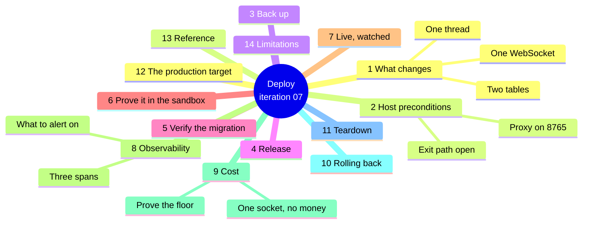
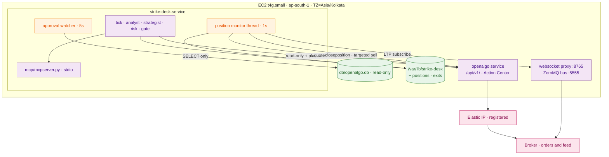

# Iteration 07 — Deployment Guide: releasing the Position Monitor



## 1. What changes on the host

No new process, no new listening port, no new secret and no new model call. Five things change.

1. **The journal gains `positions` and `exits`**, created on the first `create_schema()`. No
   `ALTER TABLE`, no existing row read or rewritten.
2. **The desk opens one outbound WebSocket** to OpenAlgo's proxy on `127.0.0.1:8765`, for one
   option symbol at a time, and only while a position is open. It is closed before every
   reconnect and closed on shutdown.
3. **The desk gains a second thread.** The Position Monitor runs beside the scheduler, on a
   one-second poll, and shares nothing with the tick but the journal — so a tick blocked on a
   model call cannot delay an exit.
4. **A filled position can now be closed by the desk, without a click.** Every release before
   this one bought and stopped. After this one, a stop, a target or a clock produces a market
   exit through `/api/v1/closeposition` or a targeted SELL, on the deliberate reading of FR-7
   that getting out is never gated.

5. **The desk now runs with no human at all, by default.** `STRIKE_DESK_AUTONOMY` ships set to
   `unattended`: the Action Center is out of the entry path and nobody approves anything.
   `attended` — iteration 06's behaviour, every entry waiting for a click — remains as an
   explicit opt-out. **This is the breaking change in the release.** An iteration-06 host
   upgraded without touching `.env` becomes autonomous, so §7A is no longer an optional extra
   step: its four preconditions must be satisfied *before* the new build is started, or the desk
   will decline every tick with `autonomy-mode-mismatch` until they are.

Point four is why the exit-path preflight ships in the same release. In live semi-auto — the
mode iteration 06 depends on — OpenAlgo refuses `closeposition` and queues a sell, so an exit
would need a human. The desk therefore refuses to *enter* in that configuration and declines
every tick with `exit-path-gated` until either analyze mode is on or the key is in auto. §6 and
§7 walk both.



## 2. Two host preconditions

**The WebSocket proxy must be up and delivering.** It starts with OpenAlgo, but under gunicorn
with eventlet it runs out of process, and the failure mode worth knowing about is the quiet one:
`subscribe` succeeds and no tick ever arrives, because a publisher bound the ZeroMQ port the
proxy's SUB was supposed to own. Check both before you release:

```bash
sudo ss -ltnp | grep -E ':8765|:5555'
sudo -u strikedesk /opt/strike-desk/current/strike_desk/.venv/bin/python - <<'PY'
import time
from strike_desk.config import get_settings
from strike_desk.price_feed import PriceFeed
settings = get_settings()
feed = PriceFeed(settings, "NIFTY30SEP2625000CE", "NFO")   # any liquid weekly strike
feed.start()
for _ in range(10):
    time.sleep(1)
    print(feed.last_tick())
feed.close()
PY
```

A `Tick` with a positive price within a couple of seconds means proxy, bus and broker adapter
are all healthy. `None` for ten seconds during market hours means one of them is not, and the
monitor would fall back to REST quotes on every observation — workable, but you want to know.

**The exit path must be open, or the desk will not trade.** Read both switches from OpenAlgo's
database and confirm you are in one of the two permitted configurations:

```bash
sudo -u openalgo sqlite3 /opt/openalgo/db/openalgo.db \
  "SELECT user_id, order_mode FROM api_keys; SELECT analyze_mode FROM settings;"
```

`analyze_mode = 1` (sandbox) or `order_mode = auto` opens the path. Live plus `semi_auto` is the
one combination in which every tick declines `exit-path-gated` — which is correct, and a
confusing afternoon if you have not read this paragraph.

## 3. Back the journal up before you migrate it

```bash
sudo -u strikedesk sqlite3 /var/lib/strike-desk/strike_desk.db \
  ".backup '/var/lib/strike-desk/strike_desk.pre-0.7.0.db'"
sudo -u strikedesk sqlite3 /var/lib/strike-desk/strike_desk.pre-0.7.0.db \
  "SELECT count(*) FROM decisions; SELECT count(*) FROM orders;"
```

Use `.backup` rather than `cp` — WAL mode with a live writer. Keep both counts for §5.

## 4. Release

```bash
RELEASE=$(date +%Y%m%d)-$(git -C /path/to/checkout rev-parse --short HEAD)
sudo git clone --depth 1 <your-repo-url> "/opt/strike-desk/releases/$RELEASE"
cd "/opt/strike-desk/releases/$RELEASE/strike_desk" && sudo uv sync --frozen

sudo tee -a /etc/strike-desk/strike-desk.env >/dev/null <<'ENV'

# --- Position monitor (iteration 07) ---
STRIKE_DESK_MONITOR_ENABLED=true
STRIKE_DESK_WS_URL=ws://127.0.0.1:8765
STRIKE_DESK_WS_OPEN_TIMEOUT_SECONDS=10
STRIKE_DESK_MONITOR_POLL_SECONDS=1
STRIKE_DESK_QUOTE_POLL_SECONDS=2
STRIKE_DESK_FEED_STALE_SECONDS=15
STRIKE_DESK_FEED_BLACKOUT_SECONDS=90
STRIKE_DESK_RECONCILE_INTERVAL_SECONDS=30
STRIKE_DESK_SESSION_EXIT_DEADLINE=15:10
STRIKE_DESK_EXIT_LATENCY_BUDGET_MS=1500
STRIKE_DESK_EXIT_MAX_ATTEMPTS=3
STRIKE_DESK_EXIT_RETRY_SECONDS=2

# --- Autonomy (iteration 07) ---
# 'unattended' is the default and the shipped posture: no human in the entry path.
# It requires the OpenAlgo key in AUTO order mode — see §7A before starting the unit.
# Set 'attended' here only if you deliberately want iteration 06's click back.
STRIKE_DESK_AUTONOMY=unattended
STRIKE_DESK_MONITOR_HEARTBEAT_MAX_AGE_SECONDS=30
STRIKE_DESK_UNATTENDED_DAILY_LOSS_CAP=6000
STRIKE_DESK_UNATTENDED_MAX_TRADES_PER_DAY=3
ENV

sudo ln -sfn "/opt/strike-desk/releases/$RELEASE" /opt/strike-desk/current
sudo systemctl restart strike-desk
sudo systemctl status strike-desk --no-pager
```

`uv sync --frozen` is what installs `websockets==17.1` from the lockfile; if it reports the
lockfile is out of date, you committed `pyproject.toml` without running `uv sync` locally.

Deploy this release **outside market hours or on a flat book**. The monitor adopts unadopted
filled orders at startup, which is exactly what you want after a restart and exactly what you do
not want to discover for the first time with a live position open.

## 5. Verify the migration

```bash
sudo -u strikedesk sqlite3 /var/lib/strike-desk/strike_desk.db "
  .tables
  SELECT count(*) FROM decisions;
  SELECT count(*) FROM orders;
  SELECT name FROM sqlite_master WHERE type='trigger' AND tbl_name IN ('positions','exits');
  SELECT name FROM sqlite_master WHERE type='index' AND name IN
    ('uq_positions_state','uq_exits_attempt');"
```

`positions` and `exits` exist with four triggers between them and both unique indexes; both
counts match §3 exactly. Then confirm the taxonomy moved without cost and the monitor is alive:

```bash
sudo -u strikedesk /opt/strike-desk/current/strike_desk/.venv/bin/strike-desk declines --since 30
sudo -u strikedesk /opt/strike-desk/current/strike_desk/.venv/bin/strike-desk position
sudo journalctl -u strike-desk --since "5 min ago" | grep "position monitor started"
```

`taxonomy drift 0`, `unknown reason codes none`, `dt-5+<digest>`, `no position under
management`, and one `position monitor started` line. At this point the desk behaves exactly as
it did yesterday, plus a thread that is watching nothing.

## 6. Prove it in the sandbox

Analyze mode is where this slice earns its release, because it exercises the whole path — real
queue, real click, real feed, real exit arithmetic — against ₹1 crore of sandbox capital with no
money at stake, and because `closeposition` is permitted there regardless of order mode.

Turn analyze mode on in the OpenAlgo UI, then let a tick fill and watch:

```bash
sudo journalctl -u strike-desk -f | grep -E "managing|price feed|flat|EXIT|stood down"
```

Three things must happen, in this order. Within a second of your approval and the sandbox fill,
`managing 75 x NIFTY… at 102.50 — stop 80.00 target 140.00 time-stop 14:45 IST`. Then
`strike-desk position` prints all three levels with live distances and `feed_source=websocket`.
Then, when a level goes, an exit:

```bash
sudo -u strikedesk sqlite3 -header -column /var/lib/strike-desk/strike_desk.db "
  SELECT reason, path, status, latency_ms, round_trip_ms, level_price, observed_price,
         exit_price, slippage, feed_source
  FROM exits ORDER BY id DESC LIMIT 5;"
```

A healthy sandbox exit reads `stop | closeposition | filled`, `latency_ms` well under 300, and a
slippage that is a real number of either sign. If you would rather not wait for the market to
hit a level, the manual test cases seed a proposal with a stop two rupees under the live premium
so the reflex fires on demand.

Run a full session in this posture before §7. The point of the proving week (UC-09) is that the
pieces compose; this is the piece that composes last.

## 7. Live, watched

Going live means turning analyze mode **off**, which closes the `closeposition` rung unless the
key is in auto mode. That is a real decision, not a formality: auto mode removes the human gate
UC-06 built for entries. Two postures are defensible and both are configuration.

**Stay in sandbox until the expiry-week run passes.** The desk trades, manages and exits with no
money involved, and every tick's decline of `exit-path-gated` never appears because analyze mode
keeps the path open. This is the recommended posture and the one the MVP gate in FR-9 asks for.

**Or go live with the key in Auto and accept the trade-off knowingly.** Entries no longer stop
at the Action Center; the Risk Officer and the kill switch remain the binding limits. Do this
only with the day's trade count and the per-trade cap set low, and only after a session in
sandbox. Auto mode is also the precondition for §7A's unattended operation, and the two decisions are
best taken together rather than a week apart: if the key is going to Auto, decide at the same
time whether the desk is still expected to wait for a click it can no longer be given. Whichever
you choose, prove which one you are in before the market opens:

```bash
sudo -u strikedesk /opt/strike-desk/current/strike_desk/.venv/bin/strike-desk journal --limit 5
sudo -u openalgo sqlite3 /opt/openalgo/db/openalgo.db \
  "SELECT order_mode FROM api_keys; SELECT analyze_mode FROM settings;"
```

An `exit-path-gated` decline in the journal means the desk is running but will not trade — that
is the guardrail working, not a fault to route around.

## 7A. Running with the human off — the default posture

Everything up to here releases the monitor. This section covers the other half of the iteration,
which is no longer a switch you may or may not throw: `unattended` is the default, so **this
section is mandatory for every deploy of this release**, and it must be worked through before
the new unit is started rather than after. An iteration-06 host that upgrades and starts without
reading it will not misfire — the mode check refuses to trade against a Semi-Auto key — but it
will sit declining `autonomy-mode-mismatch` all day, which is a failed deploy either way.

Do it in this order and not another.

**First, satisfy the four preconditions — before the restart, not after.** Unattended mode is
refused, loudly, unless all four
hold, and each of them is checked rather than assumed: the OpenAlgo API key is in **Auto** order
mode at `/apikey`; the position monitor is enabled and its heartbeat is fresh; the desk can read
OpenAlgo's database through the mirror, because that is how the order mode is verified; and the
two daily caps are set to numbers you would be willing to lose while asleep.

**Second, run a full sandbox session unattended before a live one.** Analyze mode on, key in
Auto, autonomy unattended. This is the only configuration in which the entire loop — propose,
clear, place, fill, adopt, arm, exit, reconcile — runs with no human touching it and no money
at risk, and it is the configuration the proving week should spend a day in.

```bash
sudo -u strikedesk /opt/strike-desk/current/strike_desk/.venv/bin/strike-desk position
sudo journalctl -u strike-desk -f | grep -E "unattended entry|managing|flat|declined"
```

You are looking for one `WARNING` line per entry, beginning `unattended entry:` and naming the
symbol, the quantity and all three levels, followed within a poll by `managing …`. If the entry
line appears and `managing` does not, stop: the monitor is not adopting, and unattended mode
without adoption is exactly the open-ended bet this product exists to refuse.

**Third, set the caps before you set the mode.** The three lines below go into `/etc/strike-desk/strike-desk.env`
together, and the mode line is written explicitly even though it matches the default, so the
file states the posture rather than relying on one:

```bash
STRIKE_DESK_MONITOR_HEARTBEAT_MAX_AGE_SECONDS=30
STRIKE_DESK_UNATTENDED_DAILY_LOSS_CAP=6000
STRIKE_DESK_UNATTENDED_MAX_TRADES_PER_DAY=3
STRIKE_DESK_AUTONOMY=unattended
```

```bash
sudo systemctl restart strike-desk
sudo -u strikedesk /opt/strike-desk/current/strike_desk/.venv/bin/strike-desk position | head -3
```

The `autonomy: unattended` line in that output is the confirmation. If it reads `attended`,
something is still setting the opt-out — a stale `.env` line or an old unit `Environment=` — and
the desk is, correctly, still asking for a click nobody is there to give.

**Fourth, know how to stop it.** Three controls, in increasing order of bluntness: `strike-desk
pause` holds new entries and lets an open position run to its levels; the kill switch stops the
desk on the next tick and is honoured mid-position; `sudo systemctl stop strike-desk` stops
everything including the monitor, which means an open position is left to OpenAlgo's own
auto square-off. The middle one is almost always the one you want, and the last one is the one
to avoid while a position is live.

Opting back out is one line — `STRIKE_DESK_AUTONOMY=attended` and a restart — and the key should
go back to Semi-Auto at the same time, because attended mode with an Auto key is itself a
mismatch and will decline every tick until the two agree.

### What unattended mode does not change

It does not touch the reasoning plane, the prompts, the models, the tool whitelists, the token
budget or the Risk Officer's limits. It does not widen what the desk can send: the execution
client still holds the same three write paths. It does not make the desk trade more often — the
unattended trade cap makes it trade *less* often than the limits pack alone would allow. The
only thing it removes is the click, and the only things it adds are the guards that stand in
for the person who used to make it.

## 8. Observability

Three spans join the trace, all under the existing tracer and all persisted to the `traces`
table by the span processor iteration 01 wired: `strike_desk.monitor.adopt` carries the position
id, the symbol, the quantity and all three levels; `strike_desk.monitor.exit` carries the
reason, the attempt number, the path, the status and — the number this iteration is graded on —
`exit.latency_ms`; `strike_desk.monitor.reconcile` carries the broker quantity it read.

Query the day's exit latencies straight out of the journal:

```bash
sudo -u strikedesk sqlite3 -header -column /var/lib/strike-desk/strike_desk.db "
  SELECT reason, count(*) n, max(latency_ms) worst, avg(latency_ms) mean
  FROM exits WHERE trading_day = date('now','localtime') GROUP BY reason;"
```

Four log lines deserve alerting, and until UC-14 wires Telegram they are `grep` targets in
`journalctl`. `EXIT FAILED after` means a position is open that the desk could not close —
this is the one that should wake somebody. `EXIT QUEUED FOR APPROVAL` means an exit is sitting
in the Action Center. `no usable price for … exiting at market` means the feed died with a
position open. And `price feed for … reconnecting` repeating more than a few times an hour means
the proxy or the bus is unhealthy even though nothing has failed yet.

Everything above stays inside the practice cost line because it stays on the box: spans go to
SQLite, logs go to journald, and `STRIKE_DESK_OTLP_ENDPOINT` remains unset. No collector, no
agent, no egress.

## 9. Cost

The posture is unchanged and this release adds nothing billable: one localhost WebSocket, one
extra thread, two more tables in a file that already existed. Scale-to-zero is not available and
that is regulatory rather than an oversight — SEBI's static-IP mandate keeps the host up on a
registered Elastic IP — so the floor is roughly **$4.30 a month** for the Elastic IP and the gp3
volume, with the `t4g.small` itself free under the T4g trial through 31 December 2026.

The leaks to watch on this stack are the ones earlier iterations named, plus one this slice
adds. An Elastic IP is billed whether attached or not. Old release checkouts under
`/opt/strike-desk/releases` accumulate on the same 8 GiB volume — prune beyond the last three.
And **`exits` rows are small but the WAL is not**: a day of one-second polling writes nothing,
because the monitor only writes on a state change, but confirm that rather than assume it.

```bash
# Idle cost check: market closed, one unit, no socket, and a database that stopped growing.
systemctl list-timers --all | grep strike-desk
sudo ss -tnp | grep 8765 || echo "no feed socket open while flat — correct"
sudo du -sh /var/lib/strike-desk/*.db*
sudo du -sh /opt/strike-desk/releases/*
```

With the book flat there should be **no socket to 8765 at all** — the feed exists only while a
position does. That is the line to check: a socket open overnight means a monitor that never
stood down, which is a defect and not a cost problem, though it will show up as both.

## 10. Rolling back

**Stop monitoring, keep the release.** One line and a restart, and the desk falls back to
iteration-06 behaviour — buying behind a click, and leaving OpenAlgo's auto square-off as the
only thing under the position:

```bash
sudo sed -i 's/^STRIKE_DESK_MONITOR_ENABLED=true/STRIKE_DESK_MONITOR_ENABLED=false/' \
  /etc/strike-desk/strike-desk.env
sudo systemctl restart strike-desk
```

Do this only on a flat book. Turning the monitor off with a position open leaves it unmanaged
until the exchange squares it off, which is safe but is not what you meant.

**Roll back the code.** Structurally the same as iteration 06's, because this release added
tables rather than widening one:

```bash
sudo ln -sfn /opt/strike-desk/releases/<the previous release> /opt/strike-desk/current
sudo sed -i '/^STRIKE_DESK_MONITOR_/d;/^STRIKE_DESK_WS_/d;/^STRIKE_DESK_QUOTE_POLL/d;
             /^STRIKE_DESK_FEED_/d;/^STRIKE_DESK_RECONCILE_/d;
             /^STRIKE_DESK_SESSION_EXIT_DEADLINE=/d;/^STRIKE_DESK_EXIT_/d' \
  /etc/strike-desk/strike-desk.env
sudo systemctl restart strike-desk
```

Revert the environment in the same breath: the old binary's settings model is `extra="forbid"`
and refuses to start with keys it does not know. And check the book before you swap the symlink
— rows written under `dt-5` stay in the journal, so a `dt-4` binary reading an `exit-path-gated`
row classifies it as `unknown`/`defect` and `strike-desk declines` exits 2, which is correct
because that build genuinely does not know the code.

## 11. Teardown

One step in front of the usual one: get flat first.

```bash
sudo -u strikedesk /opt/strike-desk/current/strike_desk/.venv/bin/strike-desk position
# close anything still under management from the OpenAlgo UI, then:
sudo systemctl disable --now strike-desk strike-desk-report.timer
```

Archive `/var/lib/strike-desk/` before removing it. `positions` and `exits` are now the only
record of why each trade ended and how fast it ended, and neither can be regenerated.

## 12. The production target

The practice posture above is a cost configuration, not a quality one: the same monitor, the same
levels and the same journal promote to production by changing tiers and files rather than by
being rewritten.

**Compute stays always-on and gets bigger, not different.** `t4g.small` under the free trial
becomes an on-demand `t4g.small` or `t4g.medium` in `ap-south-1` (roughly $12–24 a month) once
the trial ends on 31 December 2026, on the same Elastic IP and the same systemd unit. The
monitor is I/O-light — one socket, one comparison per second — so this is headroom for the
reasoning plane beside it rather than for the exits.

**The journal becomes RDS Postgres**, as the tech stack names. `positions` and `exits` are
ordinary SQLAlchemy models with no SQLite-specific column type, so that promotion is a URL
change; the append-only triggers move to their Postgres equivalents in the same `after_create`
listener. Multi-day exit-latency analysis is the first thing that actually needs it.

**Backups become automatic.** Today §3's `.backup` is a step you run before a migration. In
production it is a nightly `sqlite3 .backup` to S3 with lifecycle expiry, or RDS automated
snapshots after the Postgres move. The `exits` table is the evidence that every position was
held to its levels; it should not live on one EBS volume.

**Observability keeps its shape at a cost.** The three spans already export over OTLP the moment
`STRIKE_DESK_OTLP_ENDPOINT` points at a self-hosted Langfuse — the variable iteration 01 wired
and left unset because Langfuse's ClickHouse does not fit beside the desk on a `t4g.small`. In
production that is its own instance, `exit.latency_ms` becomes a p99 chart with a threshold on
it, and the four `grep` targets in §8 become alert rules with a pager behind them.

**The feed gets a second source.** One WebSocket to one proxy is a single point of failure that
the REST fallback softens rather than removes. The production shape is the same `PriceFeed`
interface with a second subscription against a second registered IP — the failover host the tech
stack already names for the SEBI mandate — chosen by configuration, because the monitor reads
`last_tick()` and does not care where the tick came from.

## 13. Reference

| Thing | Value |
| --- | --- |
| Package version | `0.7.0` |
| New dependency | `websockets==17.1` |
| Journal schema | `SCHEMA_VERSION = 7` — adds `positions` and `exits` |
| Taxonomy | `dt-6` — nineteen earlier codes unchanged, four added |
| New endpoints | `/api/v1/quotes` (read-only), `/api/v1/closeposition` (execution) |
| New outbound socket | `ws://127.0.0.1:8765`, one symbol, only while a position is open |
| New host precondition | Proxy on 8765 delivering ticks; analyze mode **or** auto order mode |
| New settings | Sixteen `STRIKE_DESK_*` keys — twelve for the monitor (on by default) and four for autonomy (`unattended` by default) |
| New spans | `strike_desk.monitor.adopt`, `.exit`, `.reconcile` |
| New command | `strike-desk position [--day] [--json]` |
| New model calls, ports, secrets, processes | None |
| Autonomy | **`unattended` by default** (needs Auto order mode, a live monitor and two daily caps) — `attended` (iteration 06 behaviour, needs Semi-Auto) is an explicit opt-out |
| Breaking change | Upgrading without editing `.env` makes entries autonomous; work §7A before starting the unit |
| Rollback | One env line, or a symlink swap plus deleting the sixteen keys |

## 14. Limitations

1. **Live semi-auto is a no-trade configuration.** The desk declines every tick with
   `exit-path-gated` rather than opening a position it cannot close. That is the honest reading
   of FR-7 with the platform as it is, and the resolution is analyze mode, auto mode, or a
   symbol-scoped ungated close endpoint upstream — not a workaround in this repo.
2. **The first exit rung closes the account's positions.** `/api/v1/closeposition` takes only a
   strategy, so the executor checks the position book for exclusivity before using it and falls
   back to a targeted sell otherwise. That check costs one HTTP call on the exit path.
3. **The monitor manages one position**, because the Risk Officer permits one. More than one
   needs a supervised set of monitors and a portfolio view, which is UC-20.
4. **A restart during an exit resumes at the next attempt number, not mid-attempt.** The unique
   constraint makes that safe, but a placement whose response was lost is reported as a failure
   and retried on the *next* rung, so a duplicate exit is theoretically possible where a
   duplicate entry is not. A market sell of an already-flat position is rejected by the broker,
   which bounds the consequence.
5. **Unattended is the default, so the Auto key is now a deploy-time precondition rather than a
   later decision — and Auto ungates that key for everything.** Auto order
   mode is a property of the OpenAlgo API key, not of this desk, so any other caller holding the
   same key also stops being gated. On a single-purpose trading host that is intended; where the
   trader places manual orders through the same key, issue a second key instead.
6. **The dead-man switch proves the monitor is running, not that prices are flowing.** A monitor
   in REST-quote fallback still beats, which is the right answer for an entry gate — the
   fallback is a working exit path — but "monitor alive" is a weaker claim than "feed healthy".
7. **The unattended loss cap counts realised P&L only.** An open position bleeding towards its
   stop does not itself close the desk for the day; with one position permitted at a time the
   exposure is bounded by a single per-trade cap, and the gap closes with UC-20's portfolio view.
8. **Slippage and realised P&L depend on the broker reporting an average price.** When it
   arrives late those two fields stay null; the reason, the level and the latency never do.

---
**Sources**

*Repo files:* `030_design/03_architecture.md` · `030_design/04_tech_stack.md` · `040_iterations/iteration-06/05_deployment_guide.md` · `services/order_router_service.py` · `services/close_position_service.py` · `database/settings_db.py` · `websocket_proxy/server.py` · `CLAUDE.md`

*Web (accessed 2026-09-08):*
- [websockets — synchronous client API reference](https://websockets.readthedocs.io/en/stable/reference/sync/client.html)
- [websockets on PyPI (17.1)](https://pypi.org/project/websockets/)
- [SEBI — Safer participation of retail investors in Algorithmic trading (static-IP mandate)](https://www.sebi.gov.in/legal/circulars/feb-2025/safer-participation-of-retail-investors-in-algorithmic-trading_91614.html)
- [AWS — Amazon EC2 T4g free trial extension (750 hours/month through 31 Dec 2026)](https://repost.aws/articles/ARi_gf6vo6TuqNtMQdiYPKyA/announcing-amazon-ec2-t4g-free-trial-extension)
- [AWS — Elastic IP addresses are charged whether in use or idle](https://docs.aws.amazon.com/AWSEC2/latest/UserGuide/elastic-ip-addresses-eip.html)
